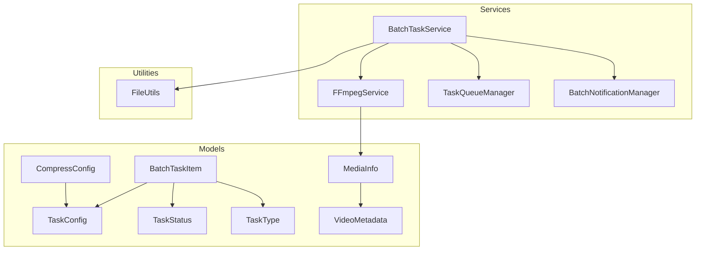
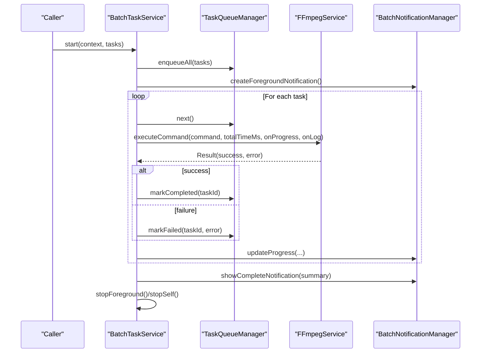
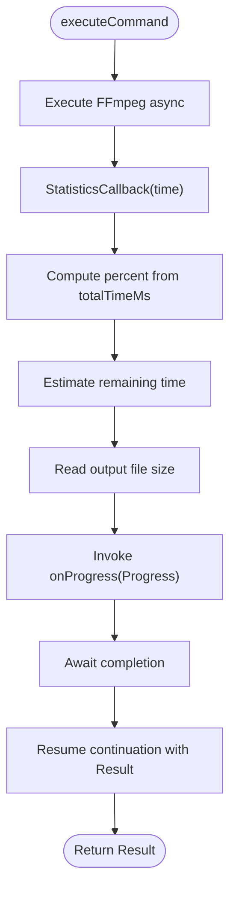
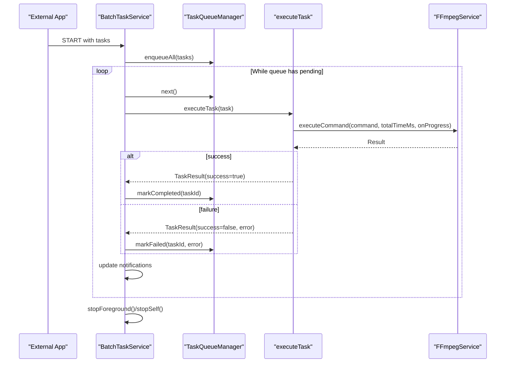
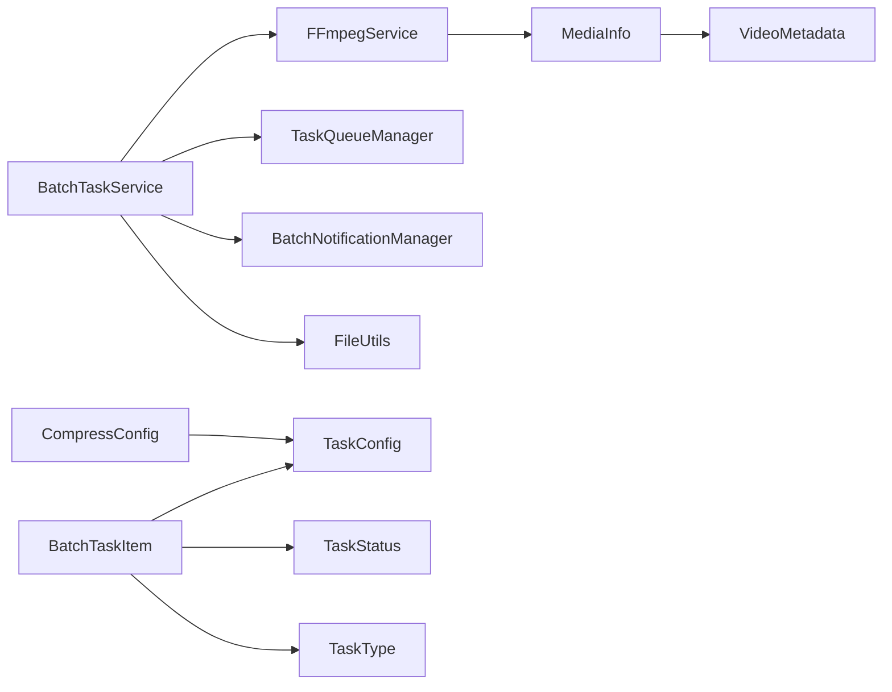

# API Reference

<cite>
**Referenced Files in This Document**
- [FFmpegService.kt](file://app/src/main/java/com/pisces312/streamclip/service/FFmpegService.kt)
- [BatchTaskService.kt](file://app/src/main/java/com/pisces312/streamclip/service/BatchTaskService.kt)
- [TaskQueueManager.kt](file://app/src/main/java/com/pisces312/streamclip/service/TaskQueueManager.kt)
- [BatchNotificationManager.kt](file://app/src/main/java/com/pisces312/streamclip/service/BatchNotificationManager.kt)
- [TaskConfig.kt](file://app/src/main/java/com/pisces312/streamclip/model/TaskConfig.kt)
- [CompressConfig.kt](file://app/src/main/java/com/pisces312/streamclip/model/CompressConfig.kt)
- [BatchTaskItem.kt](file://app/src/main/java/com/pisces312/streamclip/model/BatchTaskItem.kt)
- [TaskStatus.kt](file://app/src/main/java/com/pisces312/streamclip/model/TaskStatus.kt)
- [TaskType.kt](file://app/src/main/java/com/pisces312/streamclip/model/TaskType.kt)
- [MediaInfo.kt](file://app/src/main/java/com/pisces312/streamclip/model/MediaInfo.kt)
- [VideoMetadata.kt](file://app/src/main/java/com/pisces312/streamclip/model/VideoMetadata.kt)
- [FileUtils.kt](file://app/src/main/java/com/pisces312/streamclip/util/FileUtils.kt)
- [README.md](file://README.md)
- [CHANGELOG.md](file://CHANGELOG.md)
</cite>

## Table of Contents
1. [Introduction](#introduction)
2. [Project Structure](#project-structure)
3. [Core Components](#core-components)
4. [Architecture Overview](#architecture-overview)
5. [Detailed Component Analysis](#detailed-component-analysis)
6. [Dependency Analysis](#dependency-analysis)
7. [Performance Considerations](#performance-considerations)
8. [Troubleshooting Guide](#troubleshooting-guide)
9. [Conclusion](#conclusion)
10. [Appendices](#appendices)

## Introduction
This API reference documents StreamClip’s public interfaces for programmatic interaction. It focuses on:
- FFmpegService: video processing operations, parameter validation, callback interfaces, and progress tracking
- BatchTaskService: batch processing management, queue operations, and status monitoring
- Data structures: TaskConfig and CompressConfig, including properties, validation rules, and usage guidance
- Event callbacks, asynchronous operation patterns, error propagation, and best practices

The documentation is derived from the source code and aims to be accessible to both technical and non-technical users.

## Project Structure
The relevant APIs are organized around:
- Service layer: FFmpegService for FFmpeg operations, BatchTaskService for orchestration
- Queue and notifications: TaskQueueManager and BatchNotificationManager
- Data models: TaskConfig, CompressConfig, BatchTaskItem, TaskStatus, TaskType, MediaInfo, VideoMetadata
- Utilities: FileUtils for file handling and metadata time management

**Diagram sources**
- [FFmpegService.kt:19-420](file://app/src/main/java/com/pisces312/streamclip/service/FFmpegService.kt#L19-L420)
- [BatchTaskService.kt:26-301](file://app/src/main/java/com/pisces312/streamclip/service/BatchTaskService.kt#L26-L301)
- [TaskQueueManager.kt:10-146](file://app/src/main/java/com/pisces312/streamclip/service/TaskQueueManager.kt#L10-L146)
- [BatchNotificationManager.kt:17-137](file://app/src/main/java/com/pisces312/streamclip/service/BatchNotificationManager.kt#L17-L137)
- [TaskConfig.kt:5-9](file://app/src/main/java/com/pisces312/streamclip/model/TaskConfig.kt#L5-L9)
- [CompressConfig.kt:3-15](file://app/src/main/java/com/pisces312/streamclip/model/CompressConfig.kt#L3-L15)
- [BatchTaskItem.kt:5-18](file://app/src/main/java/com/pisces312/streamclip/model/BatchTaskItem.kt#L5-L18)
- [TaskStatus.kt:3-10](file://app/src/main/java/com/pisces312/streamclip/model/TaskStatus.kt#L3-L10)
- [TaskType.kt:3-7](file://app/src/main/java/com/pisces312/streamclip/model/TaskType.kt#L3-L7)
- [MediaInfo.kt:5-165](file://app/src/main/java/com/pisces312/streamclip/model/MediaInfo.kt#L5-L165)
- [VideoMetadata.kt:5-56](file://app/src/main/java/com/pisces312/streamclip/model/VideoMetadata.kt#L5-L56)
- [FileUtils.kt:17-362](file://app/src/main/java/com/pisces312/streamclip/util/FileUtils.kt#L17-L362)

**Section sources**
- [FFmpegService.kt:19-420](file://app/src/main/java/com/pisces312/streamclip/service/FFmpegService.kt#L19-L420)
- [BatchTaskService.kt:26-301](file://app/src/main/java/com/pisces312/streamclip/service/BatchTaskService.kt#L26-L301)
- [TaskQueueManager.kt:10-146](file://app/src/main/java/com/pisces312/streamclip/service/TaskQueueManager.kt#L10-L146)
- [BatchNotificationManager.kt:17-137](file://app/src/main/java/com/pisces312/streamclip/service/BatchNotificationManager.kt#L17-L137)
- [TaskConfig.kt:5-9](file://app/src/main/java/com/pisces312/streamclip/model/TaskConfig.kt#L5-L9)
- [CompressConfig.kt:3-15](file://app/src/main/java/com/pisces312/streamclip/model/CompressConfig.kt#L3-L15)
- [BatchTaskItem.kt:5-18](file://app/src/main/java/com/pisces312/streamclip/model/BatchTaskItem.kt#L5-L18)
- [TaskStatus.kt:3-10](file://app/src/main/java/com/pisces312/streamclip/model/TaskStatus.kt#L3-L10)
- [TaskType.kt:3-7](file://app/src/main/java/com/pisces312/streamclip/model/TaskType.kt#L3-L7)
- [MediaInfo.kt:5-165](file://app/src/main/java/com/pisces312/streamclip/model/MediaInfo.kt#L5-L165)
- [VideoMetadata.kt:5-56](file://app/src/main/java/com/pisces312/streamclip/model/VideoMetadata.kt#L5-L56)
- [FileUtils.kt:17-362](file://app/src/main/java/com/pisces312/streamclip/util/FileUtils.kt#L17-L362)

## Core Components
This section summarizes the primary public APIs and data structures.

- FFmpegService
  - Purpose: Execute FFmpeg commands via ffmpeg-kit, probe media info, and provide progress/log callbacks.
  - Key capabilities:
    - Probe media info (duration, format tags, streams)
    - Execute async commands with progress and log callbacks
    - Trim video (lossless copy)
    - Merge videos (concat demuxer, lossless)
    - Extract audio (lossless copy)
    - Compress video (hardware/software encoder)
    - Compress audio (re-encode)
  - Cancellation: Cancels current session via sessionId.

- BatchTaskService
  - Purpose: Foreground service orchestrating batch processing of tasks.
  - Key capabilities:
    - Start/stop/pause/resume batch processing
    - Enqueue tasks, process sequentially, track progress
    - Retry on failure, cleanup partial outputs
    - Notifications for progress and completion

- TaskQueueManager
  - Purpose: In-memory queue and state management for batch tasks.
  - Key capabilities:
    - Enqueue tasks, iterate next task, update progress
    - Mark completed/failed/cancelled
    - Pause/resume queue
    - Expose StateFlow of tasks for UI binding

- BatchNotificationManager
  - Purpose: Manage foreground notifications for batch processing lifecycle.

- Data Models
  - TaskConfig: Wraps CompressConfig, task type, and optional custom command.
  - CompressConfig: Encapsulates encoding parameters and generates FFmpeg command.
  - BatchTaskItem: Represents a queued task with status, progress, timestamps, and sizes.
  - TaskStatus/TaskType: Enumerations for task lifecycle and operation type.
  - MediaInfo/VideoMetadata: Structured media metadata and convenience accessors.

- Utilities
  - FileUtils: Path resolution, scanning, file time management, and output directories.

**Section sources**
- [FFmpegService.kt:19-420](file://app/src/main/java/com/pisces312/streamclip/service/FFmpegService.kt#L19-L420)
- [BatchTaskService.kt:26-301](file://app/src/main/java/com/pisces312/streamclip/service/BatchTaskService.kt#L26-L301)
- [TaskQueueManager.kt:10-146](file://app/src/main/java/com/pisces312/streamclip/service/TaskQueueManager.kt#L10-L146)
- [BatchNotificationManager.kt:17-137](file://app/src/main/java/com/pisces312/streamclip/service/BatchNotificationManager.kt#L17-L137)
- [TaskConfig.kt:5-9](file://app/src/main/java/com/pisces312/streamclip/model/TaskConfig.kt#L5-L9)
- [CompressConfig.kt:3-15](file://app/src/main/java/com/pisces312/streamclip/model/CompressConfig.kt#L3-L15)
- [BatchTaskItem.kt:5-18](file://app/src/main/java/com/pisces312/streamclip/model/BatchTaskItem.kt#L5-L18)
- [TaskStatus.kt:3-10](file://app/src/main/java/com/pisces312/streamclip/model/TaskStatus.kt#L3-L10)
- [TaskType.kt:3-7](file://app/src/main/java/com/pisces312/streamclip/model/TaskType.kt#L3-L7)
- [MediaInfo.kt:5-165](file://app/src/main/java/com/pisces312/streamclip/model/MediaInfo.kt#L5-L165)
- [VideoMetadata.kt:5-56](file://app/src/main/java/com/pisces312/streamclip/model/VideoMetadata.kt#L5-L56)
- [FileUtils.kt:17-362](file://app/src/main/java/com/pisces312/streamclip/util/FileUtils.kt#L17-L362)

## Architecture Overview
The system integrates FFmpeg operations with a robust batch processing pipeline and UI-friendly progress reporting.

**Diagram sources**
- [BatchTaskService.kt:92-165](file://app/src/main/java/com/pisces312/streamclip/service/BatchTaskService.kt#L92-L165)
- [BatchTaskService.kt:181-240](file://app/src/main/java/com/pisces312/streamclip/service/BatchTaskService.kt#L181-L240)
- [FFmpegService.kt:152-241](file://app/src/main/java/com/pisces312/streamclip/service/FFmpegService.kt#L152-L241)
- [TaskQueueManager.kt:32-86](file://app/src/main/java/com/pisces312/streamclip/service/TaskQueueManager.kt#L32-L86)
- [BatchNotificationManager.kt:57-89](file://app/src/main/java/com/pisces312/streamclip/service/BatchNotificationManager.kt#L57-L89)

## Detailed Component Analysis

### FFmpegService
FFmpegService exposes synchronous and asynchronous operations backed by ffmpeg-kit. It supports:
- Media probing
- Command execution with progress and log callbacks
- Specific operations: trim, merge, extract audio, compress video/audio

Key public methods and behaviors:
- cancelCurrentSession()
  - Cancels the currently running FFmpeg session by sessionId.
  - Returns: void
  - Exceptions: None thrown; logs cancellation events.

- probeMediaInfo(path: String): MediaInfo?
  - Probes a media file and parses JSON output into MediaInfo.
  - Parameters:
    - path: Input media file path
  - Returns: MediaInfo with duration, format tags, and first video/audio streams; null on failure
  - Exceptions: Wrapped in try-catch; logs errors via LogCollector

- executeCommand(command: String, outputPath: String?, totalTimeMs: Long, onProgress: ((Progress) -> Unit)?, onLog: ((LogLine) -> Unit)?): Result
  - Executes FFmpeg asynchronously.
  - Parameters:
    - command: FFmpeg command string
    - outputPath: Optional output path for progress size estimation
    - totalTimeMs: Total duration in milliseconds for percentage calculation
    - onProgress: Callback receiving Progress updates
    - onLog: Callback receiving LogLine entries
  - Returns: Result indicating success/failure and error message
  - Exceptions: Continuation resumed with Result; cancellation cancels session

- trimVideo(context, inputPath, outputPath, startSec, durationSec, onProgress): Result
  - Trims video without re-encoding using stream copy.
  - Parameters: Context, input/output paths, start time and duration in seconds, optional progress callback
  - Returns: Result
  - Validation: Creates parent directories for outputPath

- mergeVideos(context, inputPaths, outputPath, onProgress): Result
  - Merges multiple videos using concat demuxer (lossless).
  - Parameters: Context, list of input paths, output path, optional progress callback
  - Returns: Result
  - Validation: Requires at least two inputs; otherwise returns error code
  - Post-processing: Applies metadata from the first video to merged output

- extractAudio(context, inputPath, outputPath, onProgress): Result
  - Extracts audio stream without re-encoding.
  - Parameters: Context, input/output paths, optional progress callback
  - Returns: Result

- compressVideo(context, inputPath, outputPath, width, height, videoBitrate, audioBitrate, useHwEncoder, onProgress): Result
  - Compresses video using hardware or software encoder.
  - Parameters: Context, input/output paths, target width/height, video/audio bitrate, encoder choice, optional progress callback
  - Returns: Result
  - Validation: Probes duration for progress percentage

- compressAudio(context, inputPath, outputPath, audioBitrate, onProgress): Result
  - Re-encodes audio to target bitrate.
  - Parameters: Context, input/output paths, audio bitrate, optional progress callback
  - Returns: Result
  - Validation: Probes duration for progress percentage

Data structures:
- Result(success: Boolean, outputPath: String?, error: String?)
- Progress(percent: Int, processedTimeMs: Long, totalTimeMs: Long, outputSizeBytes: Long, message: String)
- LogLine(text: String, isError: Boolean)

Usage notes:
- Progress percentage is computed from session statistics time vs. total duration.
- Output size is estimated by reading the file size at each progress update.
- Cancellation cancels the active session and resets internal sessionId.

**Section sources**
- [FFmpegService.kt:24-31](file://app/src/main/java/com/pisces312/streamclip/service/FFmpegService.kt#L24-L31)
- [FFmpegService.kt:56-147](file://app/src/main/java/com/pisces312/streamclip/service/FFmpegService.kt#L56-L147)
- [FFmpegService.kt:152-241](file://app/src/main/java/com/pisces312/streamclip/service/FFmpegService.kt#L152-L241)
- [FFmpegService.kt:246-272](file://app/src/main/java/com/pisces312/streamclip/service/FFmpegService.kt#L246-L272)
- [FFmpegService.kt:297-334](file://app/src/main/java/com/pisces312/streamclip/service/FFmpegService.kt#L297-L334)
- [FFmpegService.kt:339-350](file://app/src/main/java/com/pisces312/streamclip/service/FFmpegService.kt#L339-L350)
- [FFmpegService.kt:355-393](file://app/src/main/java/com/pisces312/streamclip/service/FFmpegService.kt#L355-L393)
- [FFmpegService.kt:398-418](file://app/src/main/java/com/pisces312/streamclip/service/FFmpegService.kt#L398-L418)
- [FFmpegService.kt:33-50](file://app/src/main/java/com/pisces312/streamclip/service/FFmpegService.kt#L33-L50)

#### FFmpegService Progress Flow

**Diagram sources**
- [FFmpegService.kt:152-241](file://app/src/main/java/com/pisces312/streamclip/service/FFmpegService.kt#L152-L241)

### BatchTaskService
BatchTaskService is a foreground Android Service managing batch processing:
- Actions: START, STOP, CANCEL_TASK, PAUSE, RESUME
- Lifecycle: Starts foreground notification, processes queue, updates notifications, stops on completion
- Concurrency: Uses SupervisorJob with IO dispatcher; tracks per-task jobs for cancellation

Key public methods and behaviors:
- Companion object
  - start(context, tasks): Starts service with tasks via Intent extras
  - stop(context): Stops service
  - cancelTask(context, taskId): Cancels a specific task
  - isRunning: Volatile flag indicating service running state

- onStartCommand(intent): Dispatches actions to handlers
- processQueue(): Iterates TaskQueueManager, launches tasks, updates progress, handles retries
- executeTaskWithRetry(task, maxRetries): Retries failed tasks with exponential backoff
- executeTask(task): Builds command based on TaskType, probes media, executes FFmpeg, applies metadata/time, cleans up on failure
- handleStop/handleCancelTask/handlePause/handleResume: Control service lifecycle and queue state

Integration patterns:
- Start from external apps by sending Intent with ACTION_START and EXTRA_TASKS
- Use ACTION_PAUSE/RESUME to control queue flow
- Use ACTION_CANCEL_TASK to cancel a specific task

**Section sources**
- [BatchTaskService.kt:28-64](file://app/src/main/java/com/pisces312/streamclip/service/BatchTaskService.kt#L28-L64)
- [BatchTaskService.kt:79-88](file://app/src/main/java/com/pisces312/streamclip/service/BatchTaskService.kt#L79-L88)
- [BatchTaskService.kt:123-165](file://app/src/main/java/com/pisces312/streamclip/service/BatchTaskService.kt#L123-L165)
- [BatchTaskService.kt:167-179](file://app/src/main/java/com/pisces312/streamclip/service/BatchTaskService.kt#L167-L179)
- [BatchTaskService.kt:181-240](file://app/src/main/java/com/pisces312/streamclip/service/BatchTaskService.kt#L181-L240)
- [BatchTaskService.kt:265-293](file://app/src/main/java/com/pisces312/streamclip/service/BatchTaskService.kt#L265-L293)

#### Batch Processing Sequence

**Diagram sources**
- [BatchTaskService.kt:92-165](file://app/src/main/java/com/pisces312/streamclip/service/BatchTaskService.kt#L92-L165)
- [BatchTaskService.kt:181-240](file://app/src/main/java/com/pisces312/streamclip/service/BatchTaskService.kt#L181-L240)
- [TaskQueueManager.kt:32-86](file://app/src/main/java/com/pisces312/streamclip/service/TaskQueueManager.kt#L32-L86)

### TaskQueueManager
TaskQueueManager maintains an in-memory queue and task state:
- enqueueAll(tasks): Adds tasks and emits updates
- next(): Dequeues next task, marks RUNNING
- updateProgress(taskId, percent): Updates progress and emits
- markCompleted/markFailed/markCancelled: Updates status and emits
- pause/resume: Controls queue iteration
- getSummary(): Computes totals and counts
- retryTask/getAllTasks/clearCompleted: Management operations

Concurrency:
- Synchronized access to queue and task map
- Emits StateFlow<List<BatchTaskItem>> for UI binding

**Section sources**
- [TaskQueueManager.kt:24-30](file://app/src/main/java/com/pisces312/streamclip/service/TaskQueueManager.kt#L24-L30)
- [TaskQueueManager.kt:32-42](file://app/src/main/java/com/pisces312/streamclip/service/TaskQueueManager.kt#L32-L42)
- [TaskQueueManager.kt:48-53](file://app/src/main/java/com/pisces312/streamclip/service/TaskQueueManager.kt#L48-L53)
- [TaskQueueManager.kt:56-86](file://app/src/main/java/com/pisces312/streamclip/service/TaskQueueManager.kt#L56-L86)
- [TaskQueueManager.kt:88-93](file://app/src/main/java/com/pisces312/streamclip/service/TaskQueueManager.kt#L88-L93)
- [TaskQueueManager.kt:96-104](file://app/src/main/java/com/pisces312/streamclip/service/TaskQueueManager.kt#L96-L104)
- [TaskQueueManager.kt:122-139](file://app/src/main/java/com/pisces312/streamclip/service/TaskQueueManager.kt#L122-L139)

### BatchNotificationManager
Manages foreground notifications:
- createForegroundNotification(title, content): Builds ongoing notification with launch action
- updateProgress(currentTask, completedCount, totalCount): Updates progress bar and actions
- showCompleteNotification(summary): Shows completion summary with open action

Actions:
- Pause/Cancel mapped to service actions

**Section sources**
- [BatchNotificationManager.kt:40-55](file://app/src/main/java/com/pisces312/streamclip/service/BatchNotificationManager.kt#L40-L55)
- [BatchNotificationManager.kt:57-89](file://app/src/main/java/com/pisces312/streamclip/service/BatchNotificationManager.kt#L57-L89)
- [BatchNotificationManager.kt:91-121](file://app/src/main/java/com/pisces312/streamclip/service/BatchNotificationManager.kt#L91-L121)

### Data Structures

#### TaskConfig
- Properties:
  - compressConfig: CompressConfig (default constructed)
  - taskType: TaskType (default COMPRESS)
  - customCommand: String? (optional)
- Serialization: Implements Serializable
- Utility: toTaskConfig() extension to convert CompressConfig to TaskConfig

Validation and usage:
- Used by BatchTaskService to determine command building for COMPRESS/EXTRACT_AUDIO/CUSTOM_COMMAND

**Section sources**
- [TaskConfig.kt:5-9](file://app/src/main/java/com/pisces312/streamclip/model/TaskConfig.kt#L5-L9)
- [TaskConfig.kt:11-14](file://app/src/main/java/com/pisces312/streamclip/model/TaskConfig.kt#L11-L14)

#### CompressConfig
- Properties:
  - encoder: String (default "h264_mediacodec")
  - bitrate: Int (default 2000)
  - crf: Int (default 23)
  - resolution: String (default "original")
  - frameRate: String (default "original")
  - preset: String (default "medium")
  - audioEncoder: String (default "copy")
  - audioBitrate: String (default "128")
  - audioSampleRate: String (default "copy")
  - isHardware: Boolean (default true)
  - copyMetadata: Boolean (default true)
- Methods:
  - toFFmpegCommand(inputPath, outputPath, sourceWidth, sourceHeight, colorSpace, colorPrimaries, colorTransfer): Generates FFmpeg command string
- Constants:
  - HW_ENCODERS, SW_ENCODERS, BITRATES, SCALE_FACTORS, PRESETS, AUDIO_ENCODERS, AUDIO_BITRATES, AUDIO_SAMPLE_RATES, FRAME_RATES
  - HELP_TEXTS: Keys map to help resource keys

Validation and usage:
- Resolution scaling uses predefined ScaleFactor entries
- Frame rate accepts "original" or numeric strings
- Audio encoder supports "copy" and common codecs
- Audio sample rate defaults to "copy" to avoid resampler crashes
- HDR handling toggles profile/pixel format/color metadata based on detected transfer characteristics

**Section sources**
- [CompressConfig.kt:3-15](file://app/src/main/java/com/pisces312/streamclip/model/CompressConfig.kt#L3-L15)
- [CompressConfig.kt:21-114](file://app/src/main/java/com/pisces312/streamclip/model/CompressConfig.kt#L21-L114)
- [CompressConfig.kt:116-207](file://app/src/main/java/com/pisces312/streamclip/model/CompressConfig.kt#L116-L207)

#### BatchTaskItem
- Properties:
  - id: String (UUID)
  - type: TaskType
  - inputPath: String
  - outputPath: String
  - config: TaskConfig
  - status: TaskStatus (default PENDING)
  - progress: Int (default 0)
  - errorMessage: String?
  - createdAt/startedAt/completedAt: Long timestamps
  - outputSizeBytes: Long (default 0)
- Serialization: Implements Serializable

**Section sources**
- [BatchTaskItem.kt:5-18](file://app/src/main/java/com/pisces312/streamclip/model/BatchTaskItem.kt#L5-L18)

#### TaskStatus and TaskType
- TaskStatus: PENDING, RUNNING, PAUSED, COMPLETED, FAILED, CANCELLED
- TaskType: COMPRESS, EXTRACT_AUDIO, CUSTOM_COMMAND

**Section sources**
- [TaskStatus.kt:3-10](file://app/src/main/java/com/pisces312/streamclip/model/TaskStatus.kt#L3-L10)
- [TaskType.kt:3-7](file://app/src/main/java/com/pisces312/streamclip/model/TaskType.kt#L3-L7)

#### MediaInfo and VideoMetadata
- MediaInfo: Holds path, durationMs, formatName, formatTags, video/audio streams, and convenience accessors (resolution, bitrates, aspect ratio, HDR flags)
- VideoMetadata: Holds editable metadata fields and builds FFmpeg -metadata arguments for changed fields

**Section sources**
- [MediaInfo.kt:5-165](file://app/src/main/java/com/pisces312/streamclip/model/MediaInfo.kt#L5-L165)
- [VideoMetadata.kt:5-56](file://app/src/main/java/com/pisces312/streamclip/model/VideoMetadata.kt#L5-L56)

### Utilities
- FileUtils
  - Path resolution from URIs (direct read vs. cache copy)
  - Output directories for videos and audio
  - File size and duration formatting
  - Media scanner integration
  - Read and apply file creation/modification times
  - Apply shooting date as creation/modification time

**Section sources**
- [FileUtils.kt:17-362](file://app/src/main/java/com/pisces312/streamclip/util/FileUtils.kt#L17-L362)

## Dependency Analysis
- FFmpegService depends on ffmpeg-kit for execution and statistics, and on MediaInfo for probing.
- BatchTaskService depends on TaskQueueManager for state, BatchNotificationManager for UI feedback, FFmpegService for execution, and FileUtils for post-processing.
- Data models are shared across services and UI layers.

**Diagram sources**
- [FFmpegService.kt:19-420](file://app/src/main/java/com/pisces312/streamclip/service/FFmpegService.kt#L19-L420)
- [BatchTaskService.kt:26-301](file://app/src/main/java/com/pisces312/streamclip/service/BatchTaskService.kt#L26-L301)
- [TaskQueueManager.kt:10-146](file://app/src/main/java/com/pisces312/streamclip/service/TaskQueueManager.kt#L10-L146)
- [BatchNotificationManager.kt:17-137](file://app/src/main/java/com/pisces312/streamclip/service/BatchNotificationManager.kt#L17-L137)
- [TaskConfig.kt:5-9](file://app/src/main/java/com/pisces312/streamclip/model/TaskConfig.kt#L5-L9)
- [CompressConfig.kt:3-15](file://app/src/main/java/com/pisces312/streamclip/model/CompressConfig.kt#L3-L15)
- [BatchTaskItem.kt:5-18](file://app/src/main/java/com/pisces312/streamclip/model/BatchTaskItem.kt#L5-L18)
- [TaskStatus.kt:3-10](file://app/src/main/java/com/pisces312/streamclip/model/TaskStatus.kt#L3-L10)
- [TaskType.kt:3-7](file://app/src/main/java/com/pisces312/streamclip/model/TaskType.kt#L3-L7)
- [MediaInfo.kt:5-165](file://app/src/main/java/com/pisces312/streamclip/model/MediaInfo.kt#L5-L165)
- [VideoMetadata.kt:5-56](file://app/src/main/java/com/pisces312/streamclip/model/VideoMetadata.kt#L5-L56)
- [FileUtils.kt:17-362](file://app/src/main/java/com/pisces312/streamclip/util/FileUtils.kt#L17-L362)

**Section sources**
- [FFmpegService.kt:19-420](file://app/src/main/java/com/pisces312/streamclip/service/FFmpegService.kt#L19-L420)
- [BatchTaskService.kt:26-301](file://app/src/main/java/com/pisces312/streamclip/service/BatchTaskService.kt#L26-L301)
- [TaskQueueManager.kt:10-146](file://app/src/main/java/com/pisces312/streamclip/service/TaskQueueManager.kt#L10-L146)
- [BatchNotificationManager.kt:17-137](file://app/src/main/java/com/pisces312/streamclip/service/BatchNotificationManager.kt#L17-L137)
- [TaskConfig.kt:5-9](file://app/src/main/java/com/pisces312/streamclip/model/TaskConfig.kt#L5-L9)
- [CompressConfig.kt:3-15](file://app/src/main/java/com/pisces312/streamclip/model/CompressConfig.kt#L3-L15)
- [BatchTaskItem.kt:5-18](file://app/src/main/java/com/pisces312/streamclip/model/BatchTaskItem.kt#L5-L18)
- [TaskStatus.kt:3-10](file://app/src/main/java/com/pisces312/streamclip/model/TaskStatus.kt#L3-L10)
- [TaskType.kt:3-7](file://app/src/main/java/com/pisces312/streamclip/model/TaskType.kt#L3-L7)
- [MediaInfo.kt:5-165](file://app/src/main/java/com/pisces312/streamclip/model/MediaInfo.kt#L5-L165)
- [VideoMetadata.kt:5-56](file://app/src/main/java/com/pisces312/streamclip/model/VideoMetadata.kt#L5-L56)
- [FileUtils.kt:17-362](file://app/src/main/java/com/pisces312/streamclip/util/FileUtils.kt#L17-L362)

## Performance Considerations
- Hardware vs. software encoding:
  - Hardware encoders (e.g., hevc_mediacodec) offer speed gains; fallback to software encoders (e.g., libx265) is supported.
- Progress computation:
  - Percent is derived from session statistics time and total duration; estimated remaining time is computed from elapsed time and progress.
- Queue processing:
  - Sequential processing with pause/resume support; retries with backoff reduce transient failures.
- Metadata handling:
  - MOV container preserves GPS metadata for Android compatibility; color metadata written via container flags for HDR.

[No sources needed since this section provides general guidance]

## Troubleshooting Guide
Common issues and strategies:
- FFmpegKit crashes:
  - The project migrated to a custom-compiled ffmpeg-kit 8.1 to address continuous execution crashes; ensure correct AAR is used.
  - Default audio sample rate is "copy" to avoid libswresample SIGSEGV in specific scenarios.
- Batch processing failures:
  - executeTaskWithRetry performs up to N retries with delays; check TaskQueueManager for FAILED/CANCELLED states.
  - CleanupOnFailure deletes partial outputs on error to prevent corrupted files.
- Progress reporting:
  - If percent remains -1, totalTimeMs may be unknown; probe media info first.
- Notifications:
  - Foreground notifications must be created with a proper channel; verify channel creation and actions.

**Section sources**
- [BatchTaskService.kt:167-179](file://app/src/main/java/com/pisces312/streamclip/service/BatchTaskService.kt#L167-L179)
- [BatchTaskService.kt:257-263](file://app/src/main/java/com/pisces312/streamclip/service/BatchTaskService.kt#L257-L263)
- [CompressConfig.kt:12-12](file://app/src/main/java/com/pisces312/streamclip/model/CompressConfig.kt#L12-L12)
- [BatchNotificationManager.kt:26-38](file://app/src/main/java/com/pisces312/streamclip/service/BatchNotificationManager.kt#L26-L38)
- [CHANGELOG.md:8-16](file://CHANGELOG.md#L8-L16)

## Conclusion
StreamClip exposes a cohesive set of public APIs for media processing:
- FFmpegService provides robust, cancellable, progress-aware operations
- BatchTaskService offers production-grade batch orchestration with notifications and retry logic
- Data models encapsulate configuration and state, enabling flexible integrations
Adhering to the documented patterns ensures reliable operation and maintainable integrations.

[No sources needed since this section summarizes without analyzing specific files]

## Appendices

### API Versioning and Migration Guidance
- FFmpeg Kit migration:
  - Upgraded to 8.1; package moved from com.arthenica to com.antonkarpenko; adjust ProGuard rules accordingly.
- Backward compatibility:
  - Default audio sample rate changed to "copy" to mitigate resampler crashes; existing configurations remain functional.
  - Batch processing introduced in v2.0.0; earlier versions lack queue and progress features.
- Future updates:
  - Monitor changelog for breaking changes in ffmpeg-kit and related dependencies.
  - Keep CompressConfig defaults aligned with platform stability (e.g., "copy" for audioSampleRate).

**Section sources**
- [CHANGELOG.md:33-42](file://CHANGELOG.md#L33-L42)
- [CHANGELOG.md:18-27](file://CHANGELOG.md#L18-L27)
- [CHANGELOG.md:8-16](file://CHANGELOG.md#L8-L16)
- [README.md:80-85](file://README.md#L80-L85)

### Practical Usage Patterns
- Programmatic batch processing:
  - Send START action with tasks via Intent extras; monitor progress via notifications and TaskQueueManager StateFlow.
- Progress tracking:
  - Implement onProgress callback in executeCommand to receive periodic updates; combine with MediaInfo duration for percentage.
- Error handling:
  - Inspect Result.error for failure details; use TaskQueueManager to determine FAILED/CANCELLED states.
- Metadata preservation:
  - Use CompressConfig.copyMetadata and MOV container to retain GPS and creation time metadata.

**Section sources**
- [BatchTaskService.kt:49-63](file://app/src/main/java/com/pisces312/streamclip/service/BatchTaskService.kt#L49-L63)
- [FFmpegService.kt:152-241](file://app/src/main/java/com/pisces312/streamclip/service/FFmpegService.kt#L152-L241)
- [TaskQueueManager.kt:96-104](file://app/src/main/java/com/pisces312/streamclip/service/TaskQueueManager.kt#L96-L104)
- [CompressConfig.kt:33-35](file://app/src/main/java/com/pisces312/streamclip/model/CompressConfig.kt#L33-L35)