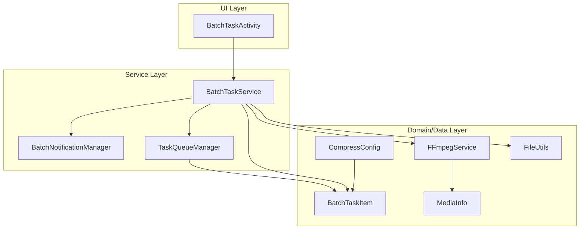
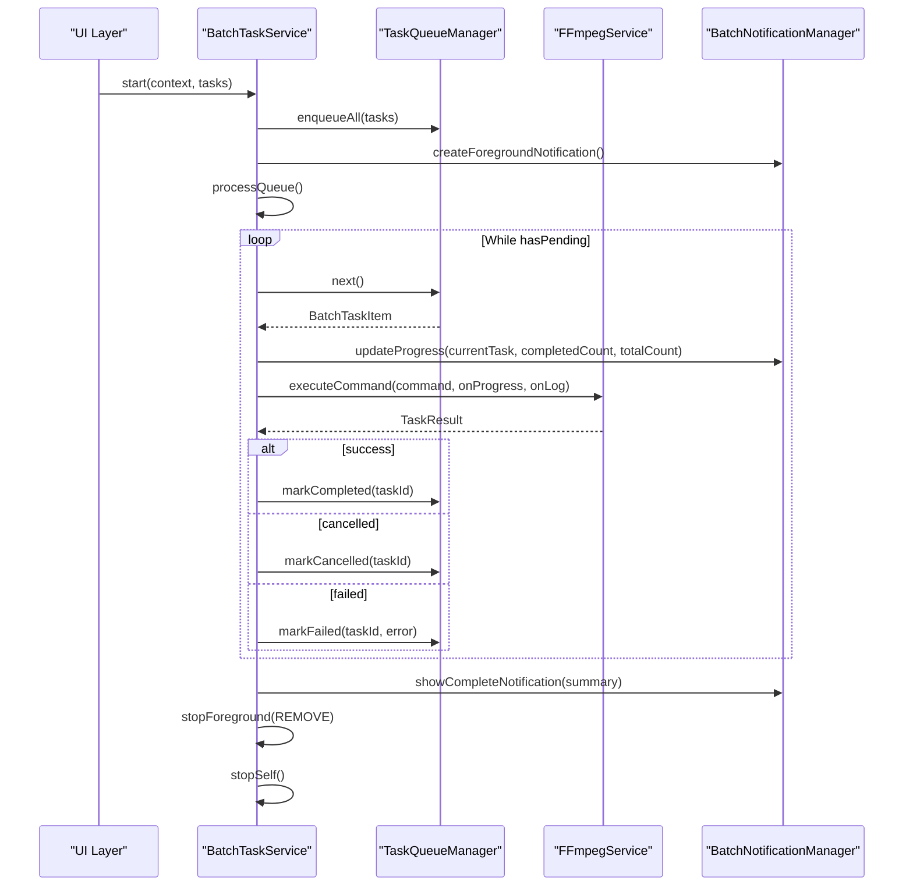
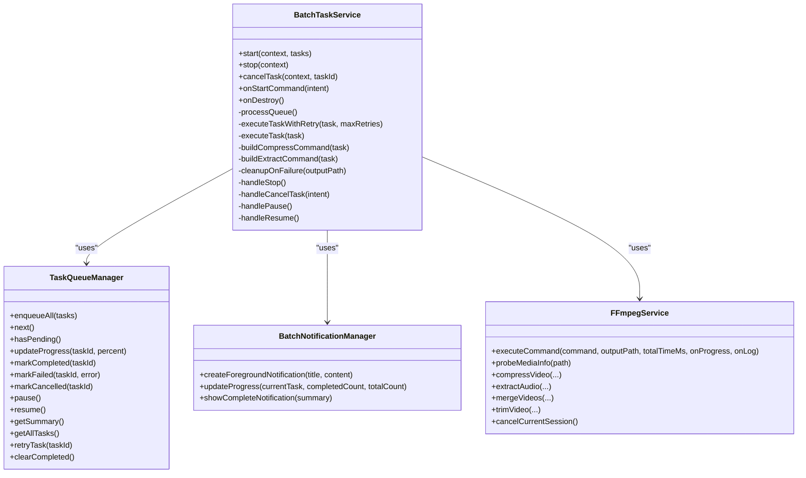
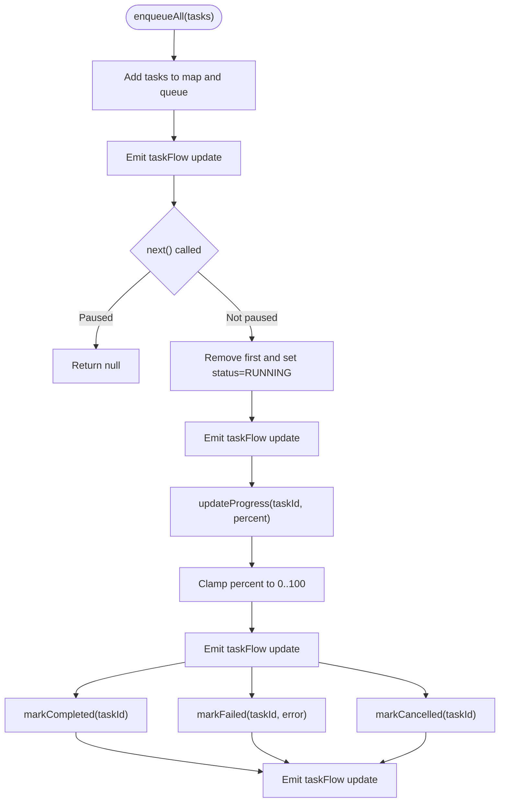
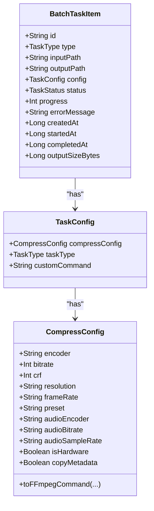
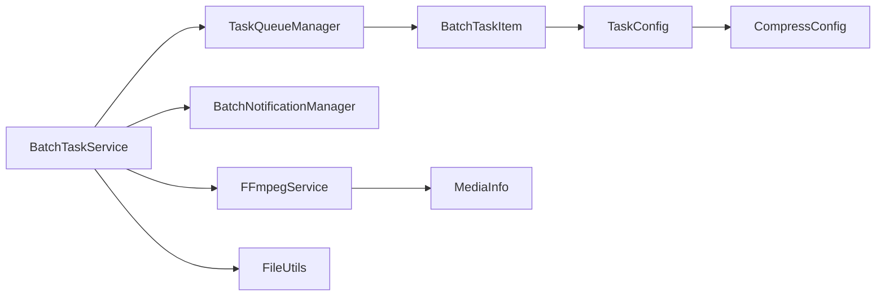

# BatchTaskService API

<cite>
**Referenced Files in This Document**
- [BatchTaskService.kt](file://app/src/main/java/com/pisces312/streamclip/service/BatchTaskService.kt)
- [TaskQueueManager.kt](file://app/src/main/java/com/pisces312/streamclip/service/TaskQueueManager.kt)
- [BatchNotificationManager.kt](file://app/src/main/java/com/pisces312/streamclip/service/BatchNotificationManager.kt)
- [BatchTaskItem.kt](file://app/src/main/java/com/pisces312/streamclip/model/BatchTaskItem.kt)
- [TaskConfig.kt](file://app/src/main/java/com/pisces312/streamclip/model/TaskConfig.kt)
- [TaskStatus.kt](file://app/src/main/java/com/pisces312/streamclip/model/TaskStatus.kt)
- [TaskType.kt](file://app/src/main/java/com/pisces312/streamclip/model/TaskType.kt)
- [CompressConfig.kt](file://app/src/main/java/com/pisces312/streamclip/model/CompressConfig.kt)
- [MediaInfo.kt](file://app/src/main/java/com/pisces312/streamclip/model/MediaInfo.kt)
- [FFmpegService.kt](file://app/src/main/java/com/pisces312/streamclip/service/FFmpegService.kt)
- [BatchTaskActivity.kt](file://app/src/main/java/com/pisces312/streamclip/ui/BatchTaskActivity.kt)
- [FileUtils.kt](file://app/src/main/java/com/pisces312/streamclip/util/FileUtils.kt)
- [batch-queue-design.md](file://docs/batch-queue-design.md)
</cite>

## Table of Contents
1. [Introduction](#introduction)
2. [Project Structure](#project-structure)
3. [Core Components](#core-components)
4. [Architecture Overview](#architecture-overview)
5. [Detailed Component Analysis](#detailed-component-analysis)
6. [Dependency Analysis](#dependency-analysis)
7. [Performance Considerations](#performance-considerations)
8. [Troubleshooting Guide](#troubleshooting-guide)
9. [Conclusion](#conclusion)
10. [Appendices](#appendices)

## Introduction
This document provides comprehensive API documentation for the BatchTaskService subsystem responsible for batch processing management and queue operations. It covers public APIs for adding tasks to the queue, starting/stopping batch processing, monitoring task progress, and managing task priorities. It also details the TaskQueueManager integration, including queue state management, task scheduling algorithms, and concurrent execution controls. The BatchTaskItem data structure is explained with property descriptions, serialization formats, and validation rules. Practical examples demonstrate batch workflow management, progress monitoring callbacks, and error recovery mechanisms. Foreground service integration, notification management, and system resource handling are documented alongside task persistence, resume capabilities, and graceful shutdown procedures. Guidance is provided on optimal queue sizing, performance tuning, and integration with external task management systems.

## Project Structure
The batch processing system is composed of a foreground service orchestrating task execution, a queue manager maintaining task state, a notification manager for user feedback, and supporting models and utilities for configuration, media probing, and file handling.

**Diagram sources**
- [BatchTaskService.kt:1-301](file://app/src/main/java/com/pisces312/streamclip/service/BatchTaskService.kt#L1-L301)
- [TaskQueueManager.kt:1-146](file://app/src/main/java/com/pisces312/streamclip/service/TaskQueueManager.kt#L1-L146)
- [BatchNotificationManager.kt:1-137](file://app/src/main/java/com/pisces312/streamclip/service/BatchNotificationManager.kt#L1-L137)
- [FFmpegService.kt:1-420](file://app/src/main/java/com/pisces312/streamclip/service/FFmpegService.kt#L1-L420)
- [BatchTaskItem.kt:1-32](file://app/src/main/java/com/pisces312/streamclip/model/BatchTaskItem.kt#L1-L32)
- [CompressConfig.kt:1-209](file://app/src/main/java/com/pisces312/streamclip/model/CompressConfig.kt#L1-L209)
- [MediaInfo.kt:1-165](file://app/src/main/java/com/pisces312/streamclip/model/MediaInfo.kt#L1-L165)
- [FileUtils.kt:1-362](file://app/src/main/java/com/pisces312/streamclip/util/FileUtils.kt#L1-L362)
- [BatchTaskActivity.kt:1-89](file://app/src/main/java/com/pisces312/streamclip/ui/BatchTaskActivity.kt#L1-L89)

**Section sources**
- [BatchTaskService.kt:1-301](file://app/src/main/java/com/pisces312/streamclip/service/BatchTaskService.kt#L1-L301)
- [TaskQueueManager.kt:1-146](file://app/src/main/java/com/pisces312/streamclip/service/TaskQueueManager.kt#L1-L146)
- [BatchNotificationManager.kt:1-137](file://app/src/main/java/com/pisces312/streamclip/service/BatchNotificationManager.kt#L1-L137)
- [FFmpegService.kt:1-420](file://app/src/main/java/com/pisces312/streamclip/service/FFmpegService.kt#L1-L420)
- [BatchTaskItem.kt:1-32](file://app/src/main/java/com/pisces312/streamclip/model/BatchTaskItem.kt#L1-L32)
- [CompressConfig.kt:1-209](file://app/src/main/java/com/pisces312/streamclip/model/CompressConfig.kt#L1-L209)
- [MediaInfo.kt:1-165](file://app/src/main/java/com/pisces312/streamclip/model/MediaInfo.kt#L1-L165)
- [FileUtils.kt:1-362](file://app/src/main/java/com/pisces312/streamclip/util/FileUtils.kt#L1-L362)
- [BatchTaskActivity.kt:1-89](file://app/src/main/java/com/pisces312/streamclip/ui/BatchTaskActivity.kt#L1-L89)

## Core Components
- BatchTaskService: Foreground service that manages batch processing lifecycle, task execution, progress updates, and notifications. Exposes static control methods for starting, stopping, pausing, resuming, and cancelling tasks.
- TaskQueueManager: Singleton managing an in-memory queue of BatchTaskItem instances, tracking counts, progress, and state transitions. Provides concurrency-safe operations and emits state updates via a StateFlow.
- BatchNotificationManager: Manages Android notification channels and displays progress and completion notifications, including actionable buttons for pause and cancel.
- FFmpegService: Executes FFmpeg commands asynchronously, reporting progress and logs, and supports cancellation of ongoing sessions.
- BatchTaskItem: Serializable data structure representing a queued task with identifiers, paths, configuration, status, progress, timestamps, and output metrics.
- Supporting models: TaskConfig, TaskType, TaskStatus, CompressConfig, MediaInfo define configuration, task types, statuses, compression parameters, and media metadata.

**Section sources**
- [BatchTaskService.kt:26-64](file://app/src/main/java/com/pisces312/streamclip/service/BatchTaskService.kt#L26-L64)
- [TaskQueueManager.kt:10-146](file://app/src/main/java/com/pisces312/streamclip/service/TaskQueueManager.kt#L10-L146)
- [BatchNotificationManager.kt:17-137](file://app/src/main/java/com/pisces312/streamclip/service/BatchNotificationManager.kt#L17-L137)
- [FFmpegService.kt:19-420](file://app/src/main/java/com/pisces312/streamclip/service/FFmpegService.kt#L19-L420)
- [BatchTaskItem.kt:5-18](file://app/src/main/java/com/pisces312/streamclip/model/BatchTaskItem.kt#L5-L18)
- [TaskConfig.kt:5-9](file://app/src/main/java/com/pisces312/streamclip/model/TaskConfig.kt#L5-L9)
- [TaskType.kt:3-7](file://app/src/main/java/com/pisces312/streamclip/model/TaskType.kt#L3-L7)
- [TaskStatus.kt:3-9](file://app/src/main/java/com/pisces312/streamclip/model/TaskStatus.kt#L3-L9)
- [CompressConfig.kt:3-15](file://app/src/main/java/com/pisces312/streamclip/model/CompressConfig.kt#L3-L15)
- [MediaInfo.kt:5-165](file://app/src/main/java/com/pisces312/streamclip/model/MediaInfo.kt#L5-L165)

## Architecture Overview
The system follows a service-driven architecture with explicit separation of concerns:
- UI triggers batch processing via BatchTaskService control methods.
- BatchTaskService enqueues tasks, starts a foreground service, and iterates the queue.
- TaskQueueManager coordinates task scheduling and state transitions.
- FFmpegService executes commands and reports progress.
- BatchNotificationManager updates the user via notifications.
- BatchTaskActivity observes TaskQueueManager state and provides UI actions.

**Diagram sources**
- [BatchTaskService.kt:92-165](file://app/src/main/java/com/pisces312/streamclip/service/BatchTaskService.kt#L92-L165)
- [TaskQueueManager.kt:24-86](file://app/src/main/java/com/pisces312/streamclip/service/TaskQueueManager.kt#L24-L86)
- [BatchNotificationManager.kt:40-89](file://app/src/main/java/com/pisces312/streamclip/service/BatchNotificationManager.kt#L40-L89)
- [FFmpegService.kt:152-241](file://app/src/main/java/com/pisces312/streamclip/service/FFmpegService.kt#L152-L241)

## Detailed Component Analysis

### BatchTaskService API
Public methods and lifecycle:
- Companion object control:
  - start(context, tasks): Enqueues tasks and starts the foreground service.
  - stop(context): Stops the service gracefully.
  - cancelTask(context, taskId): Cancels a specific task if running.
- Lifecycle:
  - onStartCommand(intent): Routes actions to handlers.
  - onDestroy(): Ensures cleanup and cancellation of scopes.

Key behaviors:
- Queue processing loop: Iterates pending tasks, updates progress, executes commands, and transitions states.
- Retry mechanism: Executes tasks with retry attempts on failure.
- Progress callbacks: Updates TaskQueueManager and notifications during execution.
- Cleanup on failure: Removes partial output files on errors.
- Foreground service: Starts with a persistent notification and removes it upon completion.

**Diagram sources**
- [BatchTaskService.kt:26-301](file://app/src/main/java/com/pisces312/streamclip/service/BatchTaskService.kt#L26-L301)
- [TaskQueueManager.kt:10-146](file://app/src/main/java/com/pisces312/streamclip/service/TaskQueueManager.kt#L10-L146)
- [BatchNotificationManager.kt:17-137](file://app/src/main/java/com/pisces312/streamclip/service/BatchNotificationManager.kt#L17-L137)
- [FFmpegService.kt:19-420](file://app/src/main/java/com/pisces312/streamclip/service/FFmpegService.kt#L19-L420)

**Section sources**
- [BatchTaskService.kt:26-64](file://app/src/main/java/com/pisces312/streamclip/service/BatchTaskService.kt#L26-L64)
- [BatchTaskService.kt:79-165](file://app/src/main/java/com/pisces312/streamclip/service/BatchTaskService.kt#L79-L165)
- [BatchTaskService.kt:265-299](file://app/src/main/java/com/pisces312/streamclip/service/BatchTaskService.kt#L265-L299)

### TaskQueueManager Integration
Responsibilities:
- Maintains an ArrayDeque for FIFO ordering and a map of all tasks for quick updates.
- Thread-safe operations using synchronized blocks and a StateFlow for reactive updates.
- State transitions: PENDING -> RUNNING -> COMPLETED/FAILED/CANCELLED.
- Progress tracking: Percent updates are clamped to 0–100 and persisted in the task.
- Pause/resume: Prevents dequeuing while paused.
- Summary computation: Aggregates totals and counts for UI and notifications.

**Diagram sources**
- [TaskQueueManager.kt:24-86](file://app/src/main/java/com/pisces312/streamclip/service/TaskQueueManager.kt#L24-L86)
- [TaskQueueManager.kt:95-144](file://app/src/main/java/com/pisces312/streamclip/service/TaskQueueManager.kt#L95-L144)

**Section sources**
- [TaskQueueManager.kt:10-146](file://app/src/main/java/com/pisces312/streamclip/service/TaskQueueManager.kt#L10-L146)

### BatchTaskItem Data Structure
Properties:
- id: Unique identifier for the task.
- type: TaskType indicating operation type.
- inputPath/outputPath: Absolute paths for source and destination.
- config: TaskConfig containing compression or custom command settings.
- status: TaskStatus enumeration for lifecycle state.
- progress: Integer percentage from 0 to 100.
- errorMessage: Optional error message on failure.
- createdAt/startedAt/completedAt: Timestamps for lifecycle events.
- outputSizeBytes: Final output file size.

Serialization:
- Implements java.io.Serializable for inter-process transport via intents.

Validation rules:
- inputPath/outputPath must be valid absolute paths.
- progress must be within 0..100.
- status transitions must follow TaskStatus semantics.
- For CUSTOM_COMMAND tasks, customCommand must not be null.

**Diagram sources**
- [BatchTaskItem.kt:5-18](file://app/src/main/java/com/pisces312/streamclip/model/BatchTaskItem.kt#L5-L18)
- [TaskConfig.kt:5-9](file://app/src/main/java/com/pisces312/streamclip/model/TaskConfig.kt#L5-L9)
- [CompressConfig.kt:3-15](file://app/src/main/java/com/pisces312/streamclip/model/CompressConfig.kt#L3-L15)

**Section sources**
- [BatchTaskItem.kt:5-18](file://app/src/main/java/com/pisces312/streamclip/model/BatchTaskItem.kt#L5-L18)
- [TaskConfig.kt:5-9](file://app/src/main/java/com/pisces312/streamclip/model/TaskConfig.kt#L5-L9)
- [CompressConfig.kt:21-114](file://app/src/main/java/com/pisces312/streamclip/model/CompressConfig.kt#L21-L114)

### FFmpegService Integration
Capabilities:
- Asynchronous command execution with progress and log callbacks.
- Media probing for duration and stream information.
- Specialized operations: trim, merge, extract audio, compress video/audio.
- Session cancellation support.

Progress calculation:
- Computes percentage from processed time vs total duration when available.
- Emits progress updates to the caller and TaskQueueManager.

**Section sources**
- [FFmpegService.kt:152-241](file://app/src/main/java/com/pisces312/streamclip/service/FFmpegService.kt#L152-L241)
- [FFmpegService.kt:56-147](file://app/src/main/java/com/pisces312/streamclip/service/FFmpegService.kt#L56-L147)
- [FFmpegService.kt:245-350](file://app/src/main/java/com/pisces312/streamclip/service/FFmpegService.kt#L245-L350)

### Foreground Service and Notifications
Foreground service:
- Starts with a persistent notification and stops it upon completion.
- Uses a dedicated notification channel with low importance.

Notifications:
- Progress notification shows current task, queue progress, and actionable buttons.
- Completion notification summarizes results and opens the task list.

**Section sources**
- [BatchTaskService.kt:112-160](file://app/src/main/java/com/pisces312/streamclip/service/BatchTaskService.kt#L112-L160)
- [BatchNotificationManager.kt:26-55](file://app/src/main/java/com/pisces312/streamclip/service/BatchNotificationManager.kt#L26-L55)
- [BatchNotificationManager.kt:57-89](file://app/src/main/java/com/pisces312/streamclip/service/BatchNotificationManager.kt#L57-L89)
- [BatchNotificationManager.kt:91-121](file://app/src/main/java/com/pisces312/streamclip/service/BatchNotificationManager.kt#L91-L121)

### UI Integration and Observability
BatchTaskActivity:
- Subscribes to TaskQueueManager.taskFlow to render live task updates.
- Supports retry, cancel, and open actions for each task.
- Provides a floating action button to clear completed tasks.

**Section sources**
- [BatchTaskActivity.kt:69-82](file://app/src/main/java/com/pisces312/streamclip/ui/BatchTaskActivity.kt#L69-L82)

## Dependency Analysis
- BatchTaskService depends on TaskQueueManager for queue operations, BatchNotificationManager for UI feedback, and FFmpegService for execution.
- TaskQueueManager depends on BatchTaskItem and TaskStatus for state tracking.
- FFmpegService depends on MediaInfo for duration and stream metadata.
- BatchTaskItem integrates with TaskConfig and CompressConfig for configuration.
- FileUtils supports scanning and time-stamping output files.

**Diagram sources**
- [BatchTaskService.kt:66-76](file://app/src/main/java/com/pisces312/streamclip/service/BatchTaskService.kt#L66-L76)
- [TaskQueueManager.kt:10-14](file://app/src/main/java/com/pisces312/streamclip/service/TaskQueueManager.kt#L10-L14)
- [BatchTaskItem.kt:5-18](file://app/src/main/java/com/pisces312/streamclip/model/BatchTaskItem.kt#L5-L18)
- [TaskConfig.kt:5-9](file://app/src/main/java/com/pisces312/streamclip/model/TaskConfig.kt#L5-L9)
- [CompressConfig.kt:3-15](file://app/src/main/java/com/pisces312/streamclip/model/CompressConfig.kt#L3-L15)
- [FFmpegService.kt:19-420](file://app/src/main/java/com/pisces312/streamclip/service/FFmpegService.kt#L19-L420)
- [MediaInfo.kt:5-165](file://app/src/main/java/com/pisces312/streamclip/model/MediaInfo.kt#L5-L165)
- [FileUtils.kt:268-331](file://app/src/main/java/com/pisces312/streamclip/util/FileUtils.kt#L268-L331)

**Section sources**
- [BatchTaskService.kt:66-76](file://app/src/main/java/com/pisces312/streamclip/service/BatchTaskService.kt#L66-L76)
- [TaskQueueManager.kt:10-14](file://app/src/main/java/com/pisces312/streamclip/service/TaskQueueManager.kt#L10-L14)
- [BatchTaskItem.kt:5-18](file://app/src/main/java/com/pisces312/streamclip/model/BatchTaskItem.kt#L5-L18)
- [TaskConfig.kt:5-9](file://app/src/main/java/com/pisces312/streamclip/model/TaskConfig.kt#L5-L9)
- [CompressConfig.kt:3-15](file://app/src/main/java/com/pisces312/streamclip/model/CompressConfig.kt#L3-L15)
- [FFmpegService.kt:19-420](file://app/src/main/java/com/pisces312/streamclip/service/FFmpegService.kt#L19-L420)
- [MediaInfo.kt:5-165](file://app/src/main/java/com/pisces312/streamclip/model/MediaInfo.kt#L5-L165)
- [FileUtils.kt:268-331](file://app/src/main/java/com/pisces312/streamclip/util/FileUtils.kt#L268-L331)

## Performance Considerations
- Concurrency: BatchTaskService uses a SupervisorJob with IO dispatcher for task execution. Individual tasks are launched as separate coroutines for cancellation support.
- Queue scheduling: FIFO order ensures predictable throughput. Pausing prevents dequeueing, enabling controlled backpressure.
- Progress updates: Frequent progress callbacks can be expensive; consider throttling in high-frequency scenarios.
- Resource handling: Output files are scanned into the media store and metadata/time stamps are preserved when available.
- Retries: Built-in retry with exponential backoff reduces transient failures.
- Memory footprint: TaskQueueManager stores all tasks in memory; consider pagination or persistence for very large batches.

[No sources needed since this section provides general guidance]

## Troubleshooting Guide
Common issues and remedies:
- Task stuck at PENDING: Verify queue is not paused and tasks were enqueued successfully.
- Progress not updating: Ensure onProgress callback is invoked and TaskQueueManager.updateProgress is called.
- Failure cleanup: Partial output files are deleted on errors; confirm storage permissions and available disk space.
- Cancellation: Use cancelTask(context, taskId) to cancel a running task; BatchTaskService cancels the associated coroutine.
- Graceful shutdown: Call stop(context) to cancel the service scope and stop the foreground service.

**Section sources**
- [BatchTaskService.kt:265-299](file://app/src/main/java/com/pisces312/streamclip/service/BatchTaskService.kt#L265-L299)
- [BatchTaskService.kt:257-263](file://app/src/main/java/com/pisces312/streamclip/service/BatchTaskService.kt#L257-L263)
- [TaskQueueManager.kt:88-93](file://app/src/main/java/com/pisces312/streamclip/service/TaskQueueManager.kt#L88-L93)

## Conclusion
The BatchTaskService provides a robust foundation for batch processing with clear separation of concerns, reliable queue management, and responsive user feedback. Its integration with FFmpegService enables efficient media transformations, while the notification system keeps users informed. The design supports extensibility for additional task types and future enhancements such as persistence and advanced scheduling.

[No sources needed since this section summarizes without analyzing specific files]

## Appendices

### API Reference: BatchTaskService
- start(context, tasks): Enqueue tasks and start the foreground service.
- stop(context): Stop the service and remove the foreground notification.
- cancelTask(context, taskId): Cancel a specific task if currently running.
- Actions handled: START, STOP, CANCEL_TASK, PAUSE, RESUME.

**Section sources**
- [BatchTaskService.kt:28-64](file://app/src/main/java/com/pisces312/streamclip/service/BatchTaskService.kt#L28-L64)
- [BatchTaskService.kt:79-88](file://app/src/main/java/com/pisces312/streamclip/service/BatchTaskService.kt#L79-L88)

### API Reference: TaskQueueManager
- enqueueAll(tasks): Add tasks to the queue and map.
- next(): Dequeue and mark the next task as RUNNING.
- hasPending(): Check if queue has pending tasks.
- updateProgress(taskId, percent): Update task progress and emit updates.
- markCompleted(taskId), markFailed(taskId, error), markCancelled(taskId): Transition task states.
- pause(), resume(): Control queue consumption.
- getSummary(): Compute batch summary statistics.
- getAllTasks(), retryTask(taskId), clearCompleted(): Utilities for UI and maintenance.

**Section sources**
- [TaskQueueManager.kt:24-139](file://app/src/main/java/com/pisces312/streamclip/service/TaskQueueManager.kt#L24-L139)

### Example Workflows

#### Starting a Batch
- Prepare a list of BatchTaskItem instances with appropriate TaskConfig.
- Call BatchTaskService.start(context, tasks).
- Observe progress via BatchTaskActivity and TaskQueueManager.taskFlow.

**Section sources**
- [BatchTaskService.kt:49-55](file://app/src/main/java/com/pisces312/streamclip/service/BatchTaskService.kt#L49-L55)
- [BatchTaskActivity.kt:69-76](file://app/src/main/java/com/pisces312/streamclip/ui/BatchTaskActivity.kt#L69-L76)

#### Monitoring Progress
- Subscribe to TaskQueueManager.taskFlow in the UI.
- Update progress bars and counters based on task.progress and queue counts.

**Section sources**
- [TaskQueueManager.kt:13-14](file://app/src/main/java/com/pisces312/streamclip/service/TaskQueueManager.kt#L13-L14)
- [BatchTaskService.kt:130-134](file://app/src/main/java/com/pisces312/streamclip/service/BatchTaskService.kt#L130-L134)

#### Error Recovery
- On failure, the service cleans up partial output files and marks the task FAILED.
- Users can retry failed tasks via TaskQueueManager.retryTask(taskId).

**Section sources**
- [BatchTaskService.kt:257-263](file://app/src/main/java/com/pisces312/streamclip/service/BatchTaskService.kt#L257-L263)
- [TaskQueueManager.kt:122-139](file://app/src/main/java/com/pisces312/streamclip/service/TaskQueueManager.kt#L122-L139)

#### Foreground Service and Notifications
- Foreground notification is created at start and updated during processing.
- Completion notification summarizes results and allows opening the task list.

**Section sources**
- [BatchTaskService.kt:112-160](file://app/src/main/java/com/pisces312/streamclip/service/BatchTaskService.kt#L112-L160)
- [BatchNotificationManager.kt:40-89](file://app/src/main/java/com/pisces312/streamclip/service/BatchNotificationManager.kt#L40-L89)
- [BatchNotificationManager.kt:91-121](file://app/src/main/java/com/pisces312/streamclip/service/BatchNotificationManager.kt#L91-L121)

### Design Notes and Future Enhancements
- Persistence: The design document outlines Phase 3 for task persistence across app restarts.
- Resume capabilities: Current implementation does not persist queue state; future versions may restore queues from storage.
- Queue sizing: Consider limiting queue size to prevent memory pressure; implement backpressure strategies.
- Performance tuning: Adjust concurrency based on device capabilities; monitor CPU and battery impact.
- External integration: Extend TaskType and TaskConfig to integrate with external task management systems.

**Section sources**
- [batch-queue-design.md:17-17](file://docs/batch-queue-design.md#L17-L17)
- [batch-queue-design.md:163-348](file://docs/batch-queue-design.md#L163-L348)