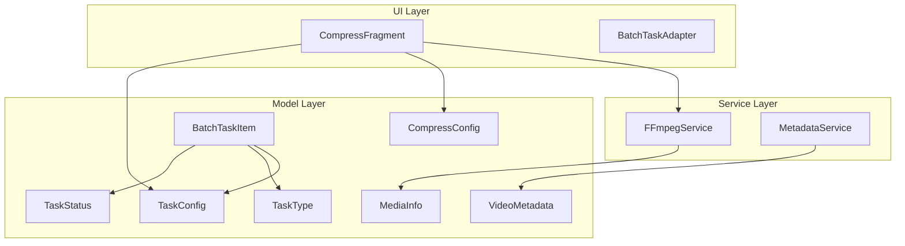
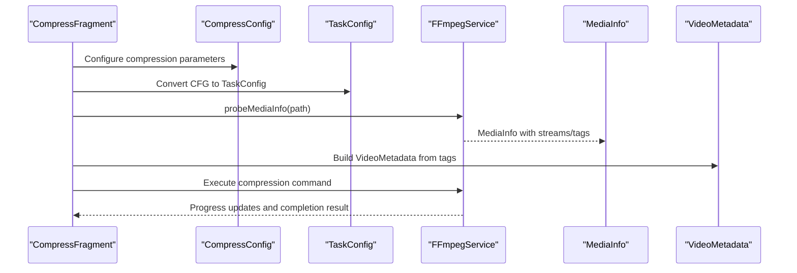
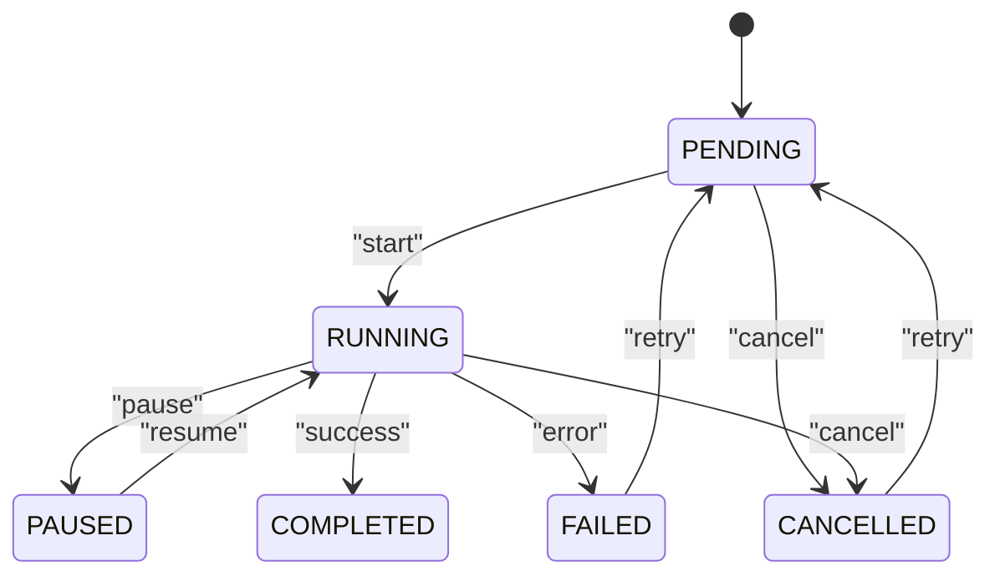
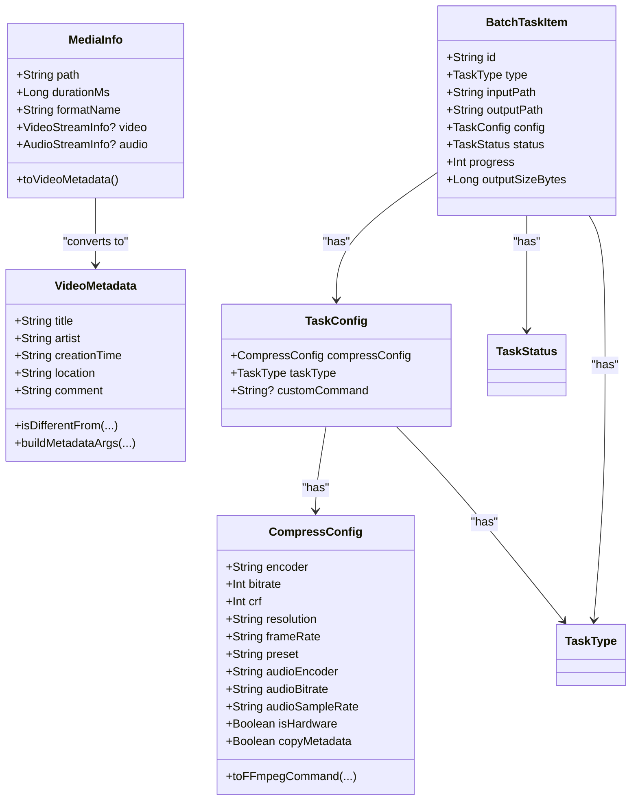

# Data Structures API

<cite>
**Referenced Files in This Document**
- [TaskConfig.kt](file://app/src/main/java/com/pisces312/streamclip/model/TaskConfig.kt)
- [CompressConfig.kt](file://app/src/main/java/com/pisces312/streamclip/model/CompressConfig.kt)
- [MediaInfo.kt](file://app/src/main/java/com/pisces312/streamclip/model/MediaInfo.kt)
- [VideoMetadata.kt](file://app/src/main/java/com/pisces312/streamclip/model/VideoMetadata.kt)
- [TaskStatus.kt](file://app/src/main/java/com/pisces312/streamclip/model/TaskStatus.kt)
- [TaskType.kt](file://app/src/main/java/com/pisces312/streamclip/model/TaskType.kt)
- [BatchTaskItem.kt](file://app/src/main/java/com/pisces312/streamclip/model/BatchTaskItem.kt)
- [FFmpegService.kt](file://app/src/main/java/com/pisces312/streamclip/service/FFmpegService.kt)
- [MetadataService.kt](file://app/src/main/java/com/pisces312/streamclip/service/MetadataService.kt)
- [CompressFragment.kt](file://app/src/main/java/com/pisces312/streamclip/fragment/CompressFragment.kt)
- [BatchTaskAdapter.kt](file://app/src/main/java/com/pisces312/streamclip/adapter/BatchTaskAdapter.kt)
- [resolution-design.md](file://docs/superpowers/plans/2026-05-09-resolution-design.md)
</cite>

## Table of Contents
1. [Introduction](#introduction)
2. [Project Structure](#project-structure)
3. [Core Components](#core-components)
4. [Architecture Overview](#architecture-overview)
5. [Detailed Component Analysis](#detailed-component-analysis)
6. [Dependency Analysis](#dependency-analysis)
7. [Performance Considerations](#performance-considerations)
8. [Troubleshooting Guide](#troubleshooting-guide)
9. [Conclusion](#conclusion)
10. [Appendices](#appendices)

## Introduction
This document provides comprehensive API documentation for StreamClip’s data structures focused on configuration models and status representations. It covers:
- TaskConfig: task-level configuration composition and conversion helpers
- CompressConfig: compression parameters, quality settings, encoder selection, and hardware acceleration options
- MediaInfo and VideoMetadata: media property extraction, format detection, metadata parsing, and editing support
- TaskStatus: task lifecycle states and progress tracking indicators
- TaskType: operation categorization and feature availability mappings

It also includes practical usage examples in UI binding, API calls, configuration persistence, and guidance on validation, defaults, migrations, and extensibility.

## Project Structure
The data model layer resides under the model package and is consumed by services and UI fragments:
- Model layer: TaskConfig, CompressConfig, MediaInfo, VideoMetadata, TaskStatus, TaskType, BatchTaskItem
- Service layer: FFmpegService (media probing, command execution), MetadataService (metadata read/save)
- UI layer: CompressFragment (configuration UI), BatchTaskAdapter (status UI)

**Diagram sources**
- [TaskConfig.kt:1-15](file://app/src/main/java/com/pisces312/streamclip/model/TaskConfig.kt#L1-L15)
- [CompressConfig.kt:1-209](file://app/src/main/java/com/pisces312/streamclip/model/CompressConfig.kt#L1-L209)
- [MediaInfo.kt:1-165](file://app/src/main/java/com/pisces312/streamclip/model/MediaInfo.kt#L1-L165)
- [VideoMetadata.kt:1-56](file://app/src/main/java/com/pisces312/streamclip/model/VideoMetadata.kt#L1-L56)
- [TaskStatus.kt:1-11](file://app/src/main/java/com/pisces312/streamclip/model/TaskStatus.kt#L1-L11)
- [TaskType.kt:1-8](file://app/src/main/java/com/pisces312/streamclip/model/TaskType.kt#L1-L8)
- [BatchTaskItem.kt:1-32](file://app/src/main/java/com/pisces312/streamclip/model/BatchTaskItem.kt#L1-L32)
- [FFmpegService.kt:1-420](file://app/src/main/java/com/pisces312/streamclip/service/FFmpegService.kt#L1-L420)
- [MetadataService.kt:1-92](file://app/src/main/java/com/pisces312/streamclip/service/MetadataService.kt#L1-L92)
- [CompressFragment.kt:1-839](file://app/src/main/java/com/pisces312/streamclip/fragment/CompressFragment.kt#L1-L839)
- [BatchTaskAdapter.kt:1-85](file://app/src/main/java/com/pisces312/streamclip/adapter/BatchTaskAdapter.kt#L1-L85)

**Section sources**
- [TaskConfig.kt:1-15](file://app/src/main/java/com/pisces312/streamclip/model/TaskConfig.kt#L1-L15)
- [CompressConfig.kt:1-209](file://app/src/main/java/com/pisces312/streamclip/model/CompressConfig.kt#L1-L209)
- [MediaInfo.kt:1-165](file://app/src/main/java/com/pisces312/streamclip/model/MediaInfo.kt#L1-L165)
- [VideoMetadata.kt:1-56](file://app/src/main/java/com/pisces312/streamclip/model/VideoMetadata.kt#L1-L56)
- [TaskStatus.kt:1-11](file://app/src/main/java/com/pisces312/streamclip/model/TaskStatus.kt#L1-L11)
- [TaskType.kt:1-8](file://app/src/main/java/com/pisces312/streamclip/model/TaskType.kt#L1-L8)
- [BatchTaskItem.kt:1-32](file://app/src/main/java/com/pisces312/streamclip/model/BatchTaskItem.kt#L1-L32)
- [FFmpegService.kt:1-420](file://app/src/main/java/com/pisces312/streamclip/service/FFmpegService.kt#L1-L420)
- [MetadataService.kt:1-92](file://app/src/main/java/com/pisces312/streamclip/service/MetadataService.kt#L1-L92)
- [CompressFragment.kt:1-839](file://app/src/main/java/com/pisces312/streamclip/fragment/CompressFragment.kt#L1-L839)
- [BatchTaskAdapter.kt:1-85](file://app/src/main/java/com/pisces312/streamclip/adapter/BatchTaskAdapter.kt#L1-L85)

## Core Components
This section documents the primary data structures and their roles.

- TaskConfig
  - Purpose: Encapsulates a compression configuration, task type, and optional custom command for task execution.
  - Properties:
    - compressConfig: CompressConfig (default initialized)
    - taskType: TaskType (default COMPRESS)
    - customCommand: String? (nullable)
  - Serialization: Implements Serializable for persistence and inter-process transfer.
  - Conversion helper: toTaskConfig() extension for CompressConfig to streamline creation.

- CompressConfig
  - Purpose: Defines compression parameters and encoder settings.
  - Key properties:
    - encoder: String (default "h264_mediacodec" or "hevc_mediacodec")
    - bitrate: Int (hardware bitrate in kbps)
    - crf: Int (software CRF, 0–51)
    - resolution: String (scale factor id or "original")
    - frameRate: String ("original" or fps)
    - preset: String (software preset)
    - audioEncoder: String ("copy", "aac", "libmp3lame", "flac")
    - audioBitrate: String ("copy" or kbps)
    - audioSampleRate: String ("copy" or Hz)
    - isHardware: Boolean (hardware acceleration flag)
    - copyMetadata: Boolean (copy all metadata from source)
  - FFmpeg command generation: toFFmpegCommand(...) builds a complete command string given input/output paths and color metadata.
  - Options and defaults:
    - HW_ENCODERS, SW_ENCODERS, BITRATES, SCALE_FACTORS, PRESETS, AUDIO_ENCODERS, AUDIO_BITRATES, AUDIO_SAMPLE_RATES, FRAME_RATES
    - HELP_TEXTS for UI tooltips

- MediaInfo
  - Purpose: Aggregates media probing results (format, streams, tags).
  - Fields:
    - path: String
    - durationMs: Long (-1 if unknown)
    - formatName: String
    - formatTags: JSONObject
    - video: VideoStreamInfo? (first video stream)
    - audio: AudioStreamInfo? (first audio stream)
  - Convenience accessors: width, height, videoCodec, audioCodec, frameRate, pixelFormat, rotation, videoBitrate, audioSampleRate, audioBitrate, creationTime, location, displayWidth, displayHeight, isLandscape, isPortrait, pixelCount, aspectRatio
  - Color info: colorSpace, colorPrimaries, colorTransfer
  - HDR detection: is10bit, isHdr, hdrTag
  - Compatibility checks: isCompatibleWith(...), getIncompatibleFields(...)
  - Audio extension mapping: audioExtension
  - Conversion: toVideoMetadata()

- VideoMetadata
  - Purpose: Editable metadata model for video files.
  - Fields: title, artist, creationTime, location, comment, rawTags
  - Methods:
    - isDifferentFrom(other): compare edited fields
    - buildMetadataArgs(original): produce FFmpeg -metadata arguments for changed fields only
  - Factory: fromTags(tags)

- TaskStatus
  - Enumerates task lifecycle states: PENDING, RUNNING, PAUSED, COMPLETED, FAILED, CANCELLED

- TaskType
  - Enumerates operation categories: COMPRESS, EXTRACT_AUDIO, CUSTOM_COMMAND

- BatchTaskItem
  - Purpose: Batch task representation with status, progress, timestamps, and output size.
  - Fields: id, type, inputPath, outputPath, config, status, progress, errorMessage, createdAt, startedAt, completedAt, outputSizeBytes

**Section sources**
- [TaskConfig.kt:1-15](file://app/src/main/java/com/pisces312/streamclip/model/TaskConfig.kt#L1-L15)
- [CompressConfig.kt:1-209](file://app/src/main/java/com/pisces312/streamclip/model/CompressConfig.kt#L1-L209)
- [MediaInfo.kt:1-165](file://app/src/main/java/com/pisces312/streamclip/model/MediaInfo.kt#L1-L165)
- [VideoMetadata.kt:1-56](file://app/src/main/java/com/pisces312/streamclip/model/VideoMetadata.kt#L1-L56)
- [TaskStatus.kt:1-11](file://app/src/main/java/com/pisces312/streamclip/model/TaskStatus.kt#L1-L11)
- [TaskType.kt:1-8](file://app/src/main/java/com/pisces312/streamclip/model/TaskType.kt#L1-L8)
- [BatchTaskItem.kt:1-32](file://app/src/main/java/com/pisces312/streamclip/model/BatchTaskItem.kt#L1-L32)

## Architecture Overview
The data structures integrate across UI, service, and model layers to orchestrate media operations.

**Diagram sources**
- [CompressFragment.kt:359-427](file://app/src/main/java/com/pisces312/streamclip/fragment/CompressFragment.kt#L359-L427)
- [CompressConfig.kt:21-114](file://app/src/main/java/com/pisces312/streamclip/model/CompressConfig.kt#L21-L114)
- [TaskConfig.kt:11-14](file://app/src/main/java/com/pisces312/streamclip/model/TaskConfig.kt#L11-L14)
- [FFmpegService.kt:56-147](file://app/src/main/java/com/pisces312/streamclip/service/FFmpegService.kt#L56-L147)
- [MediaInfo.kt:142-144](file://app/src/main/java/com/pisces312/streamclip/model/MediaInfo.kt#L142-L144)
- [VideoMetadata.kt:43-54](file://app/src/main/java/com/pisces312/streamclip/model/VideoMetadata.kt#L43-L54)

## Detailed Component Analysis

### TaskConfig
- Composition: Holds CompressConfig, TaskType, and optional custom command.
- Defaults: CompressConfig defaults are applied; TaskType defaults to COMPRESS.
- Serialization: Enables persistence and inter-process communication.
- Conversion helper: toTaskConfig() simplifies building a TaskConfig from a CompressConfig.

Usage examples:
- UI binding: CompressFragment constructs TaskConfig from user selections and passes it to services.
- Configuration persistence: TaskConfig can be serialized to storage or shared preferences for later reuse.

Validation and defaults:
- Defaults are defined in CompressConfig; TaskConfig ensures a valid baseline configuration.

Extensibility:
- To add a new operation, introduce a new TaskType variant and extend TaskConfig with optional fields as needed.

**Section sources**
- [TaskConfig.kt:1-15](file://app/src/main/java/com/pisces312/streamclip/model/TaskConfig.kt#L1-L15)
- [CompressFragment.kt:480-487](file://app/src/main/java/com/pisces312/streamclip/fragment/CompressFragment.kt#L480-L487)

### CompressConfig
- Compression parameters:
  - Hardware: encoder, bitrate, frameRate, resolution, audioEncoder, audioBitrate, audioSampleRate, isHardware, copyMetadata
  - Software: encoder, crf, preset, frameRate, resolution, audio settings
- Command generation: toFFmpegCommand(...) builds a complete FFmpeg command string, including color metadata for HDR, scaling filters, and format selection.
- Options and defaults:
  - Hardware encoders: h264_mediacodec, hevc_mediacodec
  - Software encoders: libx264, libx265
  - Bitrates, presets, audio encoders/bitrates/sample rates, frame rates, scale factors
  - Help texts for UI tooltips

Practical examples:
- UI binding: CompressFragment populates spinners and sliders from CompressConfig options and updates resolution options based on MediaInfo.
- API calls: FFmpegService.compressVideo uses CompressConfig-derived parameters to build commands.

Validation patterns:
- Use predefined lists (HW_ENCODERS, SW_ENCODERS, SCALE_FACTORS, etc.) to validate user selections.
- Default values ensure safe operation when fields are missing.

Migration strategies:
- Add new fields with sensible defaults; maintain backward compatibility by avoiding removal of existing keys.
- Keep option lists stable; append new items to preserve existing indices.

**Section sources**
- [CompressConfig.kt:1-209](file://app/src/main/java/com/pisces312/streamclip/model/CompressConfig.kt#L1-L209)
- [CompressFragment.kt:164-304](file://app/src/main/java/com/pisces312/streamclip/fragment/CompressFragment.kt#L164-L304)
- [resolution-design.md:54-114](file://docs/superpowers/plans/2026-05-09-resolution-design.md#L54-L114)

### MediaInfo
- Media property extraction:
  - Duration in milliseconds and seconds
  - Format name and tags
  - First video and audio streams with codecs, resolutions, frame rates, bitrates, sample rates, channel layouts, rotation, and color metadata
- Format detection and metadata parsing:
  - Accessors for common fields and derived properties (display width/height, aspect ratio, landscape/portrait)
  - HDR detection via color transfer and pixel format
  - Compatibility checks for merging videos
  - Audio extension mapping based on codec
- Conversion to metadata model: toVideoMetadata() creates a VideoMetadata instance from format tags.

Practical examples:
- UI binding: CompressFragment displays MediaInfo in a card and updates resolution options accordingly.
- API calls: FFmpegService.probeMediaInfo(...) parses ffprobe JSON output into MediaInfo.

Validation patterns:
- Guard against unknown values by checking for empty or "unknown" fields.
- Use lazy evaluation for computed properties to avoid repeated work.

**Section sources**
- [MediaInfo.kt:1-165](file://app/src/main/java/com/pisces312/streamclip/model/MediaInfo.kt#L1-L165)
- [FFmpegService.kt:56-147](file://app/src/main/java/com/pisces312/streamclip/service/FFmpegService.kt#L56-L147)
- [CompressFragment.kt:368-450](file://app/src/main/java/com/pisces312/streamclip/fragment/CompressFragment.kt#L368-L450)

### VideoMetadata
- Editable metadata fields: title, artist, creationTime, location, comment, rawTags
- Change detection: isDifferentFrom(...) compares fields to determine whether to apply changes.
- Argument building: buildMetadataArgs(original) generates FFmpeg -metadata arguments for only changed fields.
- Factory: fromTags(tags) constructs VideoMetadata from a JSONObject.

Practical examples:
- UI binding: MetadataFragment captures user edits and enables/disables save/reset buttons based on differences.
- API calls: MetadataService.saveMetadata(...) executes a lossless metadata update using FFmpeg.

Validation patterns:
- Validate location format and creation time formats before applying changes.
- Ensure changedArgs is non-empty before executing the command.

**Section sources**
- [VideoMetadata.kt:1-56](file://app/src/main/java/com/pisces312/streamclip/model/VideoMetadata.kt#L1-L56)
- [MetadataService.kt:15-67](file://app/src/main/java/com/pisces312/streamclip/service/MetadataService.kt#L15-L67)
- [CompressFragment.kt:138-169](file://app/src/main/java/com/pisces312/streamclip/fragment/CompressFragment.kt#L138-L169)

### TaskStatus
- Lifecycle states: PENDING, RUNNING, PAUSED, COMPLETED, FAILED, CANCELLED
- Progress tracking: Used by BatchTaskItem and UI adapters to reflect task state and enable actions (retry, cancel, open output).

State transitions:

**Diagram sources**
- [TaskStatus.kt:1-11](file://app/src/main/java/com/pisces312/streamclip/model/TaskStatus.kt#L1-L11)
- [BatchTaskAdapter.kt:59-78](file://app/src/main/java/com/pisces312/streamclip/adapter/BatchTaskAdapter.kt#L59-L78)

**Section sources**
- [TaskStatus.kt:1-11](file://app/src/main/java/com/pisces312/streamclip/model/TaskStatus.kt#L1-L11)
- [BatchTaskAdapter.kt:59-78](file://app/src/main/java/com/pisces312/streamclip/adapter/BatchTaskAdapter.kt#L59-L78)

### TaskType
- Operation categorization: COMPRESS, EXTRACT_AUDIO, CUSTOM_COMMAND
- Feature availability: UI fragments and services branch logic based on TaskType to select appropriate workflows.

**Section sources**
- [TaskType.kt:1-8](file://app/src/main/java/com/pisces312/streamclip/model/TaskType.kt#L1-L8)

### BatchTaskItem
- Batch task representation: encapsulates input/output paths, configuration, status, progress, timestamps, and output size.
- Integration: Used by TaskQueueManager and UI adapters to manage and render batch operations.

**Section sources**
- [BatchTaskItem.kt:1-32](file://app/src/main/java/com/pisces312/streamclip/model/BatchTaskItem.kt#L1-L32)
- [BatchTaskAdapter.kt:59-78](file://app/src/main/java/com/pisces312/streamclip/adapter/BatchTaskAdapter.kt#L59-L78)

## Dependency Analysis
The following diagram shows key dependencies among data structures and their consumers.

**Diagram sources**
- [TaskConfig.kt:1-15](file://app/src/main/java/com/pisces312/streamclip/model/TaskConfig.kt#L1-L15)
- [CompressConfig.kt:1-209](file://app/src/main/java/com/pisces312/streamclip/model/CompressConfig.kt#L1-L209)
- [MediaInfo.kt:1-165](file://app/src/main/java/com/pisces312/streamclip/model/MediaInfo.kt#L1-L165)
- [VideoMetadata.kt:1-56](file://app/src/main/java/com/pisces312/streamclip/model/VideoMetadata.kt#L1-L56)
- [TaskStatus.kt:1-11](file://app/src/main/java/com/pisces312/streamclip/model/TaskStatus.kt#L1-L11)
- [TaskType.kt:1-8](file://app/src/main/java/com/pisces312/streamclip/model/TaskType.kt#L1-L8)
- [BatchTaskItem.kt:1-32](file://app/src/main/java/com/pisces312/streamclip/model/BatchTaskItem.kt#L1-L32)

## Performance Considerations
- Prefer hardware encoders for speed when supported; software encoders offer finer quality control.
- Use "original" frame rate and resolution to minimize unnecessary processing.
- Avoid frequent recomputation of derived properties; rely on lazy evaluation where applicable.
- Limit UI updates during heavy operations; batch progress updates to reduce overhead.

## Troubleshooting Guide
Common issues and remedies:
- Unknown duration or metadata: durationMs defaults to -1; guard UI rendering and disable actions requiring duration.
- HDR color metadata: ensure color primaries/transfers/spaces are set when compressing HDR to preserve playback compatibility.
- Audio re-sample crashes: keep audioSampleRate as "copy" to avoid known native crashes.
- Merge compatibility: use MediaInfo.isCompatibleWith(...) to detect incompatible streams before concatenation.
- Metadata save failures: verify changedArgs is non-empty; ensure FFmpeg return code indicates success.

**Section sources**
- [MediaInfo.kt:101-121](file://app/src/main/java/com/pisces312/streamclip/model/MediaInfo.kt#L101-L121)
- [CompressConfig.kt:16-114](file://app/src/main/java/com/pisces312/streamclip/model/CompressConfig.kt#L16-L114)
- [MetadataService.kt:34-67](file://app/src/main/java/com/pisces312/streamclip/service/MetadataService.kt#L34-L67)

## Conclusion
StreamClip’s data structures provide a robust foundation for media configuration, probing, and task management. By leveraging defaults, validated option sets, and clear state transitions, the system supports reliable compression, metadata editing, and batch operations. Extensibility is achieved through enums and companion objects, while backward compatibility is maintained via default values and additive changes.

## Appendices

### Practical Usage Scenarios

- API calls
  - Probing media: Call FFmpegService.probeMediaInfo(path) to obtain MediaInfo, then convert to VideoMetadata via MediaInfo.toVideoMetadata().
  - Executing compression: Build a command using CompressConfig.toFFmpegCommand(...) and pass it to FFmpegService.executeCommand(...).
  - Saving metadata: Use VideoMetadata.buildMetadataArgs(original) to compute changed fields, then call MetadataService.saveMetadata(...).

- Configuration persistence
  - Serialize TaskConfig to storage for quick reuse across sessions.
  - Store CompressConfig defaults per user preference to prefill UI.

- UI binding
  - Populate spinners and sliders from CompressConfig companion lists.
  - Update resolution options dynamically using CompressConfig.SCALE_FACTORS and MediaInfo.displayWidth/Height.
  - Reflect TaskStatus in UI with BatchTaskAdapter to enable retry/cancel/open actions.

- Validation and defaults
  - Validate user selections against HW_ENCODERS, SW_ENCODERS, SCALE_FACTORS, PRESETS, AUDIO_ENCODERS, AUDIO_BITRATES, AUDIO_SAMPLE_RATES, FRAME_RATES.
  - Provide sensible defaults to ensure safe operation when fields are missing.

- Migration strategies
  - Add new fields with defaults; avoid removing existing keys.
  - Keep option lists stable; append new items to preserve compatibility.

- Extending for custom operations
  - Add a new TaskType variant and extend TaskConfig with optional fields.
  - Implement a new service method mirroring FFmpegService patterns and integrate with UI fragments.

**Section sources**
- [FFmpegService.kt:56-147](file://app/src/main/java/com/pisces312/streamclip/service/FFmpegService.kt#L56-L147)
- [CompressConfig.kt:116-207](file://app/src/main/java/com/pisces312/streamclip/model/CompressConfig.kt#L116-L207)
- [CompressFragment.kt:389-427](file://app/src/main/java/com/pisces312/streamclip/fragment/CompressFragment.kt#L389-L427)
- [BatchTaskAdapter.kt:59-78](file://app/src/main/java/com/pisces312/streamclip/adapter/BatchTaskAdapter.kt#L59-L78)
- [resolution-design.md:54-114](file://docs/superpowers/plans/2026-05-09-resolution-design.md#L54-L114)