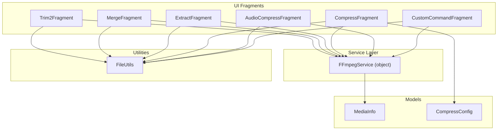
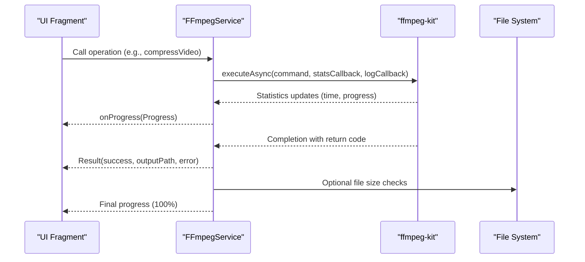
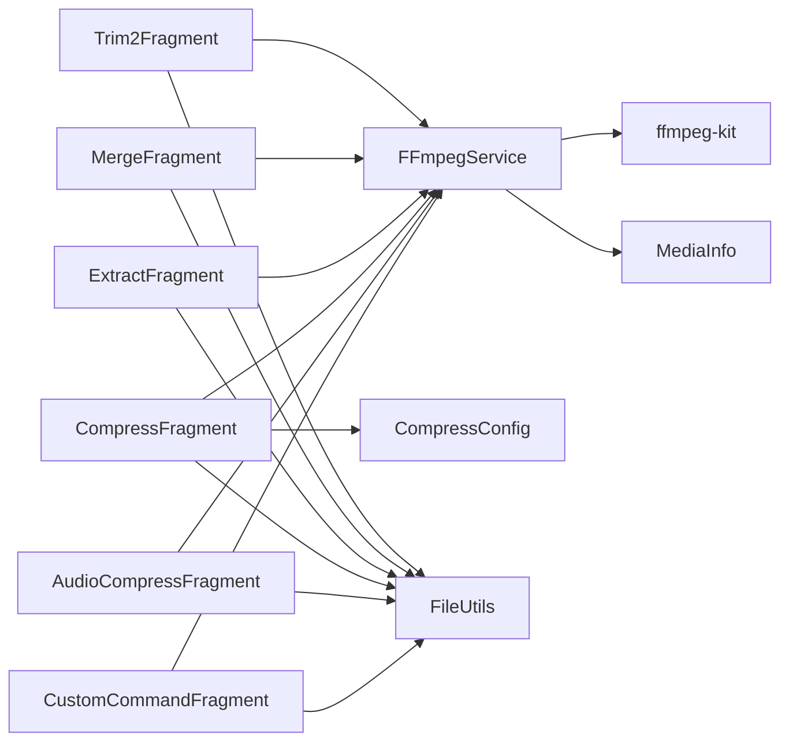

# FFmpegService API

<cite>
**Referenced Files in This Document**
- [FFmpegService.kt](file://app/src/main/java/com/pisces312/streamclip/service/FFmpegService.kt)
- [Trim2Fragment.kt](file://app/src/main/java/com/pisces312/streamclip/fragment/Trim2Fragment.kt)
- [MergeFragment.kt](file://app/src/main/java/com/pisces312/streamclip/fragment/MergeFragment.kt)
- [ExtractFragment.kt](file://app/src/main/java/com/pisces312/streamclip/fragment/ExtractFragment.kt)
- [CompressFragment.kt](file://app/src/main/java/com/pisces312/streamclip/fragment/CompressFragment.kt)
- [AudioCompressFragment.kt](file://app/src/main/java/com/pisces312/streamclip/fragment/AudioCompressFragment.kt)
- [CustomCommandFragment.kt](file://app/src/main/java/com/pisces312/streamclip/fragment/CustomCommandFragment.kt)
- [CompressConfig.kt](file://app/src/main/java/com/pisces312/streamclip/model/CompressConfig.kt)
- [MediaInfo.kt](file://app/src/main/java/com/pisces312/streamclip/model/MediaInfo.kt)
- [FileUtils.kt](file://app/src/main/java/com/pisces312/streamclip/util/FileUtils.kt)
</cite>

## Table of Contents
1. [Introduction](#introduction)
2. [Project Structure](#project-structure)
3. [Core Components](#core-components)
4. [Architecture Overview](#architecture-overview)
5. [Detailed Component Analysis](#detailed-component-analysis)
6. [Dependency Analysis](#dependency-analysis)
7. [Performance Considerations](#performance-considerations)
8. [Troubleshooting Guide](#troubleshooting-guide)
9. [Conclusion](#conclusion)
10. [Appendices](#appendices)

## Introduction
This document provides comprehensive API documentation for the FFmpegService public methods that power video processing operations in the application. It covers synchronous and asynchronous execution patterns, progress tracking via callbacks, parameter validation, input/output file handling, resource management, thread safety, concurrency limits, and lifecycle management for long-running operations. Practical integration examples demonstrate usage in UI components and best practices for robust operation.

## Project Structure
FFmpegService is implemented as a Kotlin object that encapsulates FFmpeg and FFprobe operations using ffmpeg-kit. UI fragments orchestrate operations and manage progress/logging callbacks. Data models represent media metadata and compression configuration.

**Diagram sources**
- [FFmpegService.kt:19-420](file://app/src/main/java/com/pisces312/streamclip/service/FFmpegService.kt#L19-L420)
- [Trim2Fragment.kt:1-286](file://app/src/main/java/com/pisces312/streamclip/fragment/Trim2Fragment.kt#L1-L286)
- [MergeFragment.kt:1-278](file://app/src/main/java/com/pisces312/streamclip/fragment/MergeFragment.kt#L1-L278)
- [ExtractFragment.kt:1-209](file://app/src/main/java/com/pisces312/streamclip/fragment/ExtractFragment.kt#L1-L209)
- [CompressFragment.kt:1-839](file://app/src/main/java/com/pisces312/streamclip/fragment/CompressFragment.kt#L1-L839)
- [AudioCompressFragment.kt:1-417](file://app/src/main/java/com/pisces312/streamclip/fragment/AudioCompressFragment.kt#L1-L417)
- [CustomCommandFragment.kt:1-331](file://app/src/main/java/com/pisces312/streamclip/fragment/CustomCommandFragment.kt#L1-L331)
- [MediaInfo.kt:1-165](file://app/src/main/java/com/pisces312/streamclip/model/MediaInfo.kt#L1-L165)
- [CompressConfig.kt:1-209](file://app/src/main/java/com/pisces312/streamclip/model/CompressConfig.kt#L1-L209)
- [FileUtils.kt:1-362](file://app/src/main/java/com/pisces312/streamclip/util/FileUtils.kt#L1-L362)

**Section sources**
- [FFmpegService.kt:19-420](file://app/src/main/java/com/pisces312/streamclip/service/FFmpegService.kt#L19-L420)
- [MediaInfo.kt:1-165](file://app/src/main/java/com/pisces312/streamclip/model/MediaInfo.kt#L1-L165)
- [CompressConfig.kt:1-209](file://app/src/main/java/com/pisces312/streamclip/model/CompressConfig.kt#L1-L209)
- [FileUtils.kt:1-362](file://app/src/main/java/com/pisces312/streamclip/util/FileUtils.kt#L1-L362)

## Core Components
- FFmpegService: Provides public methods for media probing, trimming, merging, extracting audio, compressing video/audio, and executing custom commands. It manages session cancellation, progress estimation, and logging callbacks.
- MediaInfo: Encapsulates parsed media metadata from ffprobe, including duration, format tags, and stream details.
- CompressConfig: Defines encoding parameters for compression operations and generates FFmpeg command strings.
- UI Fragments: Orchestrate operations, validate inputs, and render progress/logs via callbacks.

Key public APIs:
- probeMediaInfo(path: String): MediaInfo?
- executeCommand(command: String, outputPath: String?, totalTimeMs: Long, onProgress: ((Progress) -> Unit)?, onLog: ((LogLine) -> Unit)?): suspend Result
- trimVideo(context: Context, inputPath: String, outputPath: String, startSec: Double, durationSec: Double, onProgress: ((Progress) -> Unit)?): suspend Result
- mergeVideos(context: Context, inputPaths: List<String>, outputPath: String, onProgress: ((Progress) -> Unit)?): suspend Result
- extractAudio(context: Context, inputPath: String, outputPath: String, onProgress: ((Progress) -> Unit)?): suspend Result
- compressVideo(context: Context, inputPath: String, outputPath: String, width: Int, height: Int, videoBitrate: Int, audioBitrate: Int, useHwEncoder: Boolean, onProgress: ((Progress) -> Unit)?): suspend Result
- compressAudio(context: Context, inputPath: String, outputPath: String, audioBitrate: Int, onProgress: ((Progress) -> Unit)?): suspend Result
- cancelCurrentSession(): void

Return types and callback models:
- Result: success: Boolean, outputPath: String?, error: String?
- Progress: percent: Int, processedTimeMs: Long, totalTimeMs: Long, outputSizeBytes: Long, message: String
- LogLine: text: String, isError: Boolean

**Section sources**
- [FFmpegService.kt:33-420](file://app/src/main/java/com/pisces312/streamclip/service/FFmpegService.kt#L33-L420)
- [MediaInfo.kt:1-165](file://app/src/main/java/com/pisces312/streamclip/model/MediaInfo.kt#L1-L165)
- [CompressConfig.kt:1-209](file://app/src/main/java/com/pisces312/streamclip/model/CompressConfig.kt#L1-L209)

## Architecture Overview
FFmpegService abstracts ffmpeg-kit execution and ffprobe parsing behind a unified API. UI fragments call service methods, receive progress/log callbacks, and update the UI accordingly. The service tracks the current session ID for cancellation and ensures resources are cleaned up after operations.

**Diagram sources**
- [FFmpegService.kt:152-241](file://app/src/main/java/com/pisces312/streamclip/service/FFmpegService.kt#L152-L241)
- [CompressFragment.kt:602-680](file://app/src/main/java/com/pisces312/streamclip/fragment/CompressFragment.kt#L602-L680)
- [AudioCompressFragment.kt:284-345](file://app/src/main/java/com/pisces312/streamclip/fragment/AudioCompressFragment.kt#L284-L345)

## Detailed Component Analysis

### FFmpegService Public Methods

#### probeMediaInfo(path: String): MediaInfo?
- Purpose: Probe media metadata using ffprobe and parse JSON output into MediaInfo.
- Parameters:
  - path: Input media file path.
- Returns: MediaInfo? parsed from ffprobe JSON or null on failure.
- Validation: Returns null if ffprobe fails, output is empty, or JSON parsing fails.
- Side effects: Logs errors via LogCollector.

Usage pattern:
- Called by UI fragments before performing operations to validate compatibility or derive duration for progress estimation.

**Section sources**
- [FFmpegService.kt:56-147](file://app/src/main/java/com/pisces312/streamclip/service/FFmpegService.kt#L56-L147)
- [MergeFragment.kt:164-178](file://app/src/main/java/com/pisces312/streamclip/fragment/MergeFragment.kt#L164-L178)

#### executeCommand(command: String, outputPath: String?, totalTimeMs: Long, onProgress: ((Progress) -> Unit)?, onLog: ((LogLine) -> Unit)?): suspend Result
- Purpose: Execute arbitrary FFmpeg/FFprobe commands asynchronously with progress and log callbacks.
- Parameters:
  - command: FFmpeg/FFprobe command string.
  - outputPath: Optional path to compute output size during progress updates.
  - totalTimeMs: Total duration in milliseconds for percentage calculation; -1 if unknown.
  - onProgress: Callback receiving Progress updates.
  - onLog: Callback receiving LogLine entries.
- Returns: suspend Result indicating success/failure and optional error message.
- Concurrency: Tracks a single current session ID; supports cancellation via cancelCurrentSession().
- Progress estimation: Computes percentage from processed time and total time; estimates remaining time.
- Resource management: Deletes temporary files created during merge metadata application.

Asynchronous operation:
- Uses coroutine suspension with Dispatchers.IO.
- Cancels on coroutine cancellation and cleans up session ID.

**Section sources**
- [FFmpegService.kt:152-241](file://app/src/main/java/com/pisces312/streamclip/service/FFmpegService.kt#L152-L241)

#### trimVideo(context: Context, inputPath: String, outputPath: String, startSec: Double, durationSec: Double, onProgress: ((Progress) -> Unit)?): suspend Result
- Purpose: Perform lossless trim using stream copy.
- Parameters:
  - context: Android Context for file operations.
  - inputPath: Source video path.
  - outputPath: Destination path.
  - startSec: Start time in seconds.
  - durationSec: Duration in seconds.
  - onProgress: Optional progress callback.
- Returns: suspend Result.
- Validation: Creates output directory if missing.
- Implementation: Builds FFmpeg command with stream copy and MOV format to preserve metadata.

Integration note:
- UI fragments call this method and handle immediate completion feedback.

**Section sources**
- [FFmpegService.kt:246-272](file://app/src/main/java/com/pisces312/streamclip/service/FFmpegService.kt#L246-L272)
- [Trim2Fragment.kt:178-250](file://app/src/main/java/com/pisces312/streamclip/fragment/Trim2Fragment.kt#L178-L250)

#### mergeVideos(context: Context, inputPaths: List<String>, outputPath: String, onProgress: ((Progress) -> Unit)?): suspend Result
- Purpose: Concatenate multiple videos losslessly using concat demuxer.
- Parameters:
  - inputPaths: List of video paths (minimum 2).
  - outputPath: Destination path.
  - onProgress: Optional progress callback.
- Returns: suspend Result.
- Validation: Returns early Result with error code if less than two inputs.
- Implementation:
  - Writes a concat list to a temporary file.
  - Executes concat demuxer with stream copy.
  - Applies metadata from the first video by extracting tags to a sidecar file and re-multiplexing.

Resource management:
- Cleans up temporary concat and metadata files after operation.

**Section sources**
- [FFmpegService.kt:297-334](file://app/src/main/java/com/pisces312/streamclip/service/FFmpegService.kt#L297-L334)
- [MergeFragment.kt:135-231](file://app/src/main/java/com/pisces312/streamclip/fragment/MergeFragment.kt#L135-L231)

#### extractAudio(context: Context, inputPath: String, outputPath: String, onProgress: ((Progress) -> Unit)?): suspend Result
- Purpose: Extract audio stream losslessly.
- Parameters:
  - inputPath: Source video path.
  - outputPath: Destination audio path.
  - onProgress: Optional progress callback.
- Returns: suspend Result.
- Implementation: FFmpeg command copies audio stream and disables video.

**Section sources**
- [FFmpegService.kt:339-350](file://app/src/main/java/com/pisces312/streamclip/service/FFmpegService.kt#L339-L350)
- [ExtractFragment.kt:136-191](file://app/src/main/java/com/pisces312/streamclip/fragment/ExtractFragment.kt#L136-L191)

#### compressVideo(context: Context, inputPath: String, outputPath: String, width: Int, height: Int, videoBitrate: Int, audioBitrate: Int, useHwEncoder: Boolean, onProgress: ((Progress) -> Unit)?): suspend Result
- Purpose: Compress video with configurable encoder (hardware/software) and scaling.
- Parameters:
  - width/height: Target resolution (scaled using Lanczos filter).
  - videoBitrate/audioBitrate: Video and audio bitrate in kbps.
  - useHwEncoder: Select hardware encoder if true.
  - onProgress: Optional progress callback.
- Returns: suspend Result.
- Implementation:
  - Chooses encoder (hardware or software) and sets rate control.
  - Applies scale filter and copies audio with configurable bitrate.
  - Uses MOV format and sets faststart for web delivery.

Progress:
- Uses MediaInfo duration for percentage calculation.

**Section sources**
- [FFmpegService.kt:355-393](file://app/src/main/java/com/pisces312/streamclip/service/FFmpegService.kt#L355-L393)
- [CompressFragment.kt:572-680](file://app/src/main/java/com/pisces312/streamclip/fragment/CompressFragment.kt#L572-L680)

#### compressAudio(context: Context, inputPath: String, outputPath: String, audioBitrate: Int, onProgress: ((Progress) -> Unit)?): suspend Result
- Purpose: Re-encode audio to a target bitrate.
- Parameters:
  - audioBitrate: Target audio bitrate in kbps.
  - onProgress: Optional progress callback.
- Returns: suspend Result.
- Implementation: Configures AAC audio encoder with specified bitrate and copies video if present.

**Section sources**
- [FFmpegService.kt:398-418](file://app/src/main/java/com/pisces312/streamclip/service/FFmpegService.kt#L398-L418)
- [AudioCompressFragment.kt:225-345](file://app/src/main/java/com/pisces312/streamclip/fragment/AudioCompressFragment.kt#L225-L345)

#### cancelCurrentSession(): void
- Purpose: Cancel the currently running FFmpeg session.
- Behavior: Cancels the active session and resets the session ID tracker.

**Section sources**
- [FFmpegService.kt:24-31](file://app/src/main/java/com/pisces312/streamclip/service/FFmpegService.kt#L24-L31)

### Callback Interfaces and Models

#### Progress Model
- Fields: percent, processedTimeMs, totalTimeMs, outputSizeBytes, message.
- Usage: Provided to onProgress callbacks for UI updates.

#### LogLine Model
- Fields: text, isError.
- Usage: Provided to onLog callbacks for displaying logs.

#### UI Integration Examples

##### Synchronous Operation Mode (Lossless Trim)
- Triggers trimVideo with no progress callback.
- Updates UI immediately upon completion.

**Section sources**
- [Trim2Fragment.kt:178-250](file://app/src/main/java/com/pisces312/streamclip/fragment/Trim2Fragment.kt#L178-L250)

##### Asynchronous Operation Mode (Compression)
- Calls compressVideo/compressAudio with onProgress/onLog callbacks.
- Updates progress bar and log dialog in UI thread.

**Section sources**
- [CompressFragment.kt:602-680](file://app/src/main/java/com/pisces312/streamclip/fragment/CompressFragment.kt#L602-L680)
- [AudioCompressFragment.kt:284-345](file://app/src/main/java/com/pisces312/streamclip/fragment/AudioCompressFragment.kt#L284-L345)

##### Custom Command Execution
- Supports FFmpeg and FFprobe commands with progress/log callbacks.
- Parses input/output paths to estimate progress.

**Section sources**
- [CustomCommandFragment.kt:89-204](file://app/src/main/java/com/pisces312/streamclip/fragment/CustomCommandFragment.kt#L89-L204)

### Parameter Validation Rules
- mergeVideos requires at least two input paths; otherwise returns an error Result.
- trimVideo validates output directory existence and creates it if needed.
- compressVideo/compressAudio validate MediaInfo availability for duration-based progress; otherwise progress percentage remains unknown.
- CustomCommandFragment parses input/output paths from command strings to enable progress reporting.

**Section sources**
- [FFmpegService.kt:303-305](file://app/src/main/java/com/pisces312/streamclip/service/FFmpegService.kt#L303-L305)
- [FFmpegService.kt:355-393](file://app/src/main/java/com/pisces312/streamclip/service/FFmpegService.kt#L355-L393)
- [CustomCommandFragment.kt:105-114](file://app/src/main/java/com/pisces312/streamclip/fragment/CustomCommandFragment.kt#L105-L114)

### Input/Output File Handling and Resource Management
- Input resolution: UI fragments resolve URIs to real paths using FileUtils; some operations support direct read or cached copy.
- Output directories: Created automatically if missing; outputs scanned for gallery visibility.
- Temporary files: Used for concat lists and metadata sidecar during merge; deleted after operation.
- Metadata preservation: MOV format and metadata copying applied to maintain GPS/location tags.

**Section sources**
- [FileUtils.kt:108-229](file://app/src/main/java/com/pisces312/streamclip/util/FileUtils.kt#L108-L229)
- [MergeFragment.kt:307-331](file://app/src/main/java/com/pisces312/streamclip/fragment/MergeFragment.kt#L307-L331)
- [FFmpegService.kt:278-291](file://app/src/main/java/com/pisces312/streamclip/service/FFmpegService.kt#L278-L291)

### Thread Safety and Concurrency
- FFmpegService tracks a single current session ID and cancels it on coroutine cancellation.
- UI updates occur on the main thread via coroutine dispatchers.
- Concurrency limit: Only one active FFmpeg session at a time; subsequent operations replace the tracked session ID.

**Section sources**
- [FFmpegService.kt:21-31](file://app/src/main/java/com/pisces312/streamclip/service/FFmpegService.kt#L21-L31)
- [FFmpegService.kt:234-240](file://app/src/main/java/com/pisces312/streamclip/service/FFmpegService.kt#L234-L240)

### Error Handling Patterns
- Result encapsulates success flag, optional output path, and error message.
- FFprobe failures return null MediaInfo; UI fragments handle null gracefully.
- Session cancellation returns meaningful error messages; UI displays user-friendly messages.

**Section sources**
- [FFmpegService.kt:33-37](file://app/src/main/java/com/pisces312/streamclip/service/FFmpegService.kt#L33-L37)
- [FFmpegService.kt:61-64](file://app/src/main/java/com/pisces312/streamclip/service/FFmpegService.kt#L61-L64)
- [MergeFragment.kt:224-229](file://app/src/main/java/com/pisces312/streamclip/fragment/MergeFragment.kt#L224-L229)

## Dependency Analysis
FFmpegService depends on ffmpeg-kit for execution and ffprobe for metadata. UI fragments depend on FFmpegService and FileUtils for path resolution and output scanning. CompressConfig provides command generation for compression operations.

**Diagram sources**
- [FFmpegService.kt:3-17](file://app/src/main/java/com/pisces312/streamclip/service/FFmpegService.kt#L3-L17)
- [CompressConfig.kt:21-114](file://app/src/main/java/com/pisces312/streamclip/model/CompressConfig.kt#L21-L114)
- [FileUtils.kt:17-362](file://app/src/main/java/com/pisces312/streamclip/util/FileUtils.kt#L17-L362)
- [Trim2Fragment.kt:1-286](file://app/src/main/java/com/pisces312/streamclip/fragment/Trim2Fragment.kt#L1-L286)
- [MergeFragment.kt:1-278](file://app/src/main/java/com/pisces312/streamclip/fragment/MergeFragment.kt#L1-L278)
- [ExtractFragment.kt:1-209](file://app/src/main/java/com/pisces312/streamclip/fragment/ExtractFragment.kt#L1-L209)
- [CompressFragment.kt:1-839](file://app/src/main/java/com/pisces312/streamclip/fragment/CompressFragment.kt#L1-L839)
- [AudioCompressFragment.kt:1-417](file://app/src/main/java/com/pisces312/streamclip/fragment/AudioCompressFragment.kt#L1-L417)
- [CustomCommandFragment.kt:1-331](file://app/src/main/java/com/pisces312/streamclip/fragment/CustomCommandFragment.kt#L1-L331)

**Section sources**
- [FFmpegService.kt:1-420](file://app/src/main/java/com/pisces312/streamclip/service/FFmpegService.kt#L1-L420)
- [CompressConfig.kt:1-209](file://app/src/main/java/com/pisces312/streamclip/model/CompressConfig.kt#L1-L209)
- [FileUtils.kt:1-362](file://app/src/main/java/com/pisces312/streamclip/util/FileUtils.kt#L1-L362)

## Performance Considerations
- Prefer hardware encoders for faster compression when supported by devices.
- Use lossless operations (trim, merge) for instant completion without progress callbacks.
- Estimate progress using MediaInfo duration; unknown durations yield unknown percentages.
- Avoid unnecessary re-encoding when preserving quality and metadata is desired.
- Keep UI responsive by updating progress on the main thread and offloading I/O to IO dispatcher.

[No sources needed since this section provides general guidance]

## Troubleshooting Guide
Common issues and resolutions:
- Empty or invalid ffprobe output: probeMediaInfo returns null; UI should prompt user to select another file.
- Unknown duration: Progress percentage remains unknown; UI can display elapsed time and output size.
- Session cancellation: Use cancelCurrentSession() to abort long-running operations.
- File path resolution: Use FileUtils to resolve URIs to real paths; handle cached copies when direct read is unavailable.
- Metadata not preserved: Ensure MOV format and metadata copying steps are included in commands.

**Section sources**
- [FFmpegService.kt:56-147](file://app/src/main/java/com/pisces312/streamclip/service/FFmpegService.kt#L56-L147)
- [FFmpegService.kt:152-241](file://app/src/main/java/com/pisces312/streamclip/service/FFmpegService.kt#L152-L241)
- [FileUtils.kt:30-118](file://app/src/main/java/com/pisces312/streamclip/util/FileUtils.kt#L30-L118)

## Conclusion
FFmpegService offers a cohesive API for media processing with robust progress tracking, logging, and resource management. Its integration with UI fragments demonstrates both synchronous and asynchronous usage patterns, enabling efficient and user-friendly video editing workflows. Adhering to validation rules, managing concurrency, and leveraging progress callbacks ensures reliable operation across diverse device capabilities.

[No sources needed since this section summarizes without analyzing specific files]

## Appendices

### API Reference Summary

- probeMediaInfo(path: String): MediaInfo?
- executeCommand(command: String, outputPath: String?, totalTimeMs: Long, onProgress: ((Progress) -> Unit)?, onLog: ((LogLine) -> Unit)?): suspend Result
- trimVideo(context: Context, inputPath: String, outputPath: String, startSec: Double, durationSec: Double, onProgress: ((Progress) -> Unit)?): suspend Result
- mergeVideos(context: Context, inputPaths: List<String>, outputPath: String, onProgress: ((Progress) -> Unit)?): suspend Result
- extractAudio(context: Context, inputPath: String, outputPath: String, onProgress: ((Progress) -> Unit)?): suspend Result
- compressVideo(context: Context, inputPath: String, outputPath: String, width: Int, height: Int, videoBitrate: Int, audioBitrate: Int, useHwEncoder: Boolean, onProgress: ((Progress) -> Unit)?): suspend Result
- compressAudio(context: Context, inputPath: String, outputPath: String, audioBitrate: Int, onProgress: ((Progress) -> Unit)?): suspend Result
- cancelCurrentSession(): void

Return types:
- Result: success: Boolean, outputPath: String?, error: String?
- Progress: percent: Int, processedTimeMs: Long, totalTimeMs: Long, outputSizeBytes: Long, message: String
- LogLine: text: String, isError: Boolean

**Section sources**
- [FFmpegService.kt:33-420](file://app/src/main/java/com/pisces312/streamclip/service/FFmpegService.kt#L33-L420)