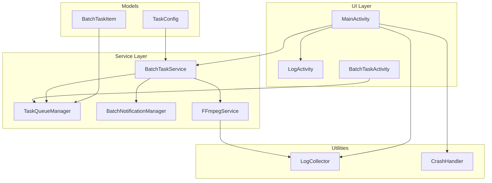
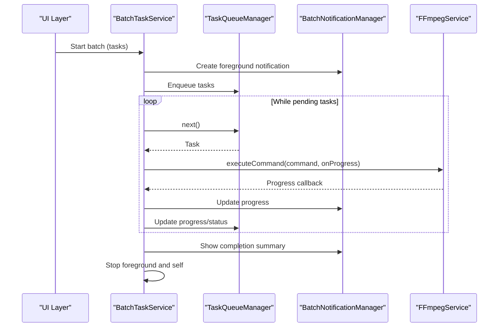
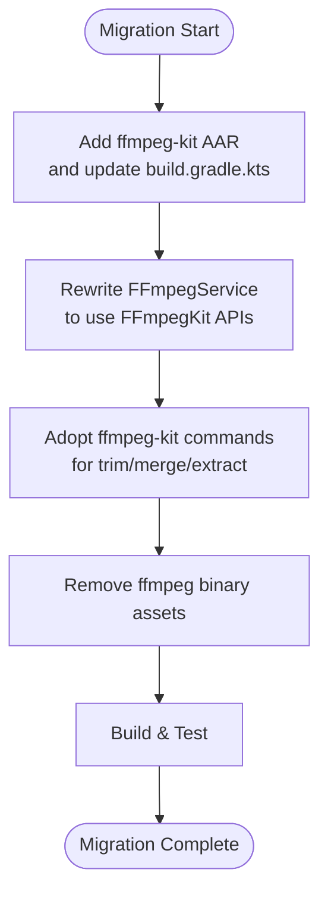
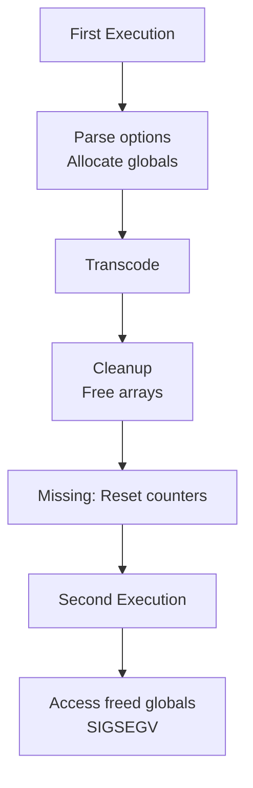
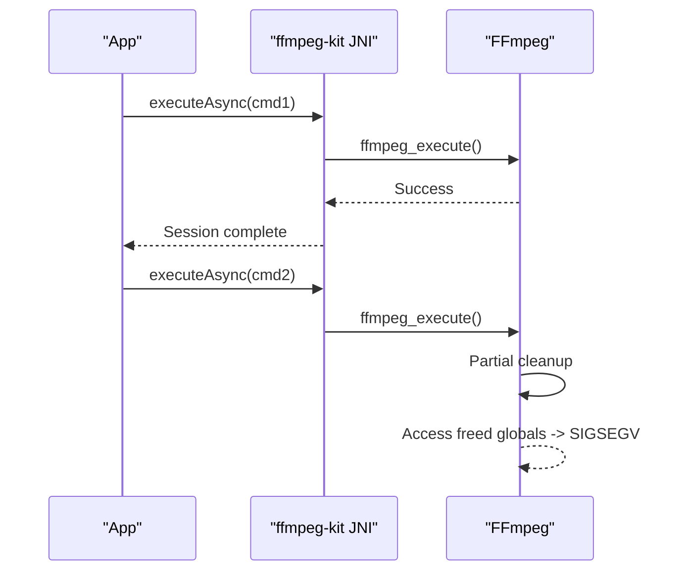
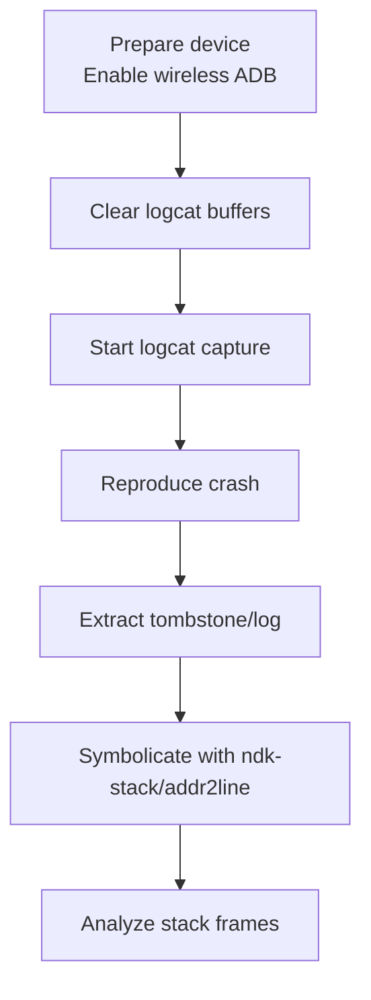
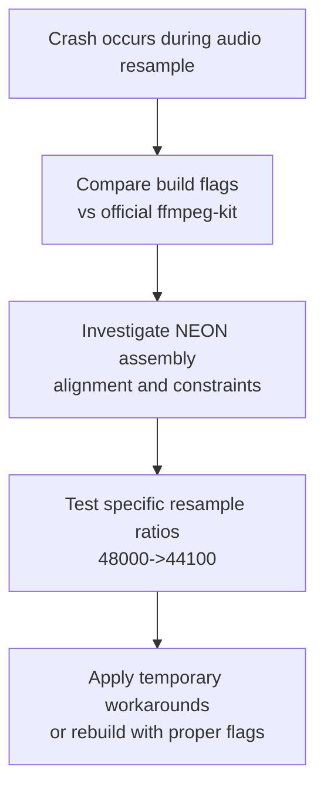
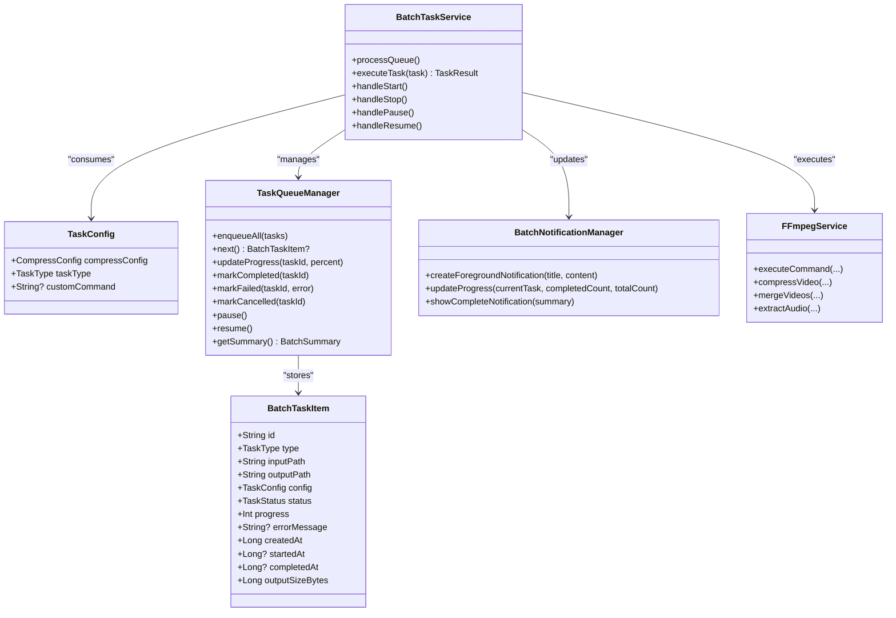
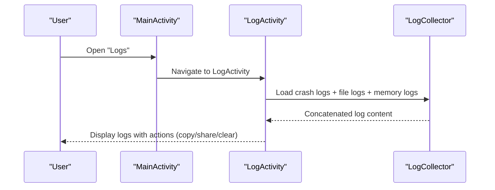
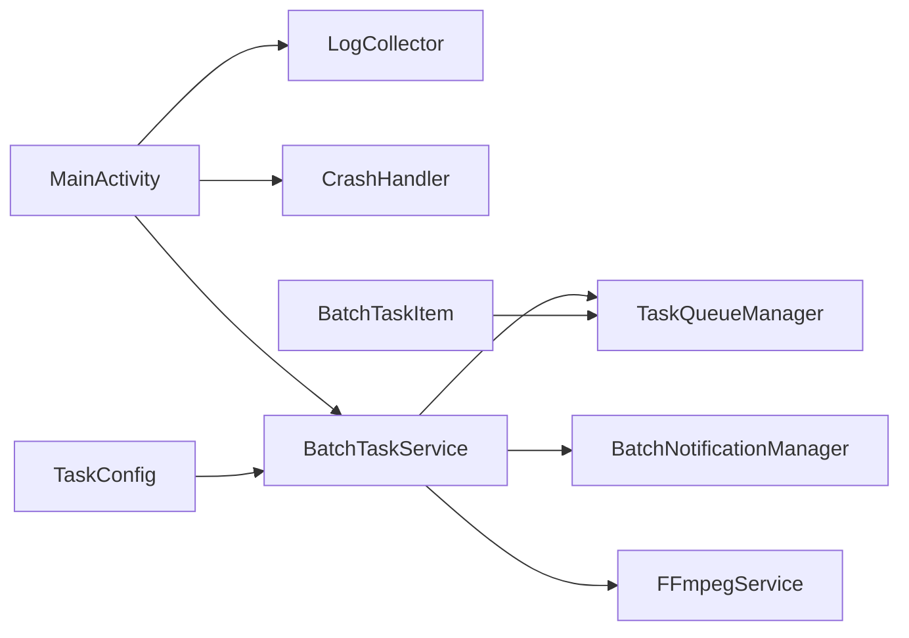

# Advanced Topics

<cite>
**Referenced Files in This Document**
- [FFmpegService.kt](file://app/src/main/java/com/pisces312/streamclip/service/FFmpegService.kt)
- [BatchTaskService.kt](file://app/src/main/java/com/pisces312/streamclip/service/BatchTaskService.kt)
- [TaskQueueManager.kt](file://app/src/main/java/com/pisces312/streamclip/service/TaskQueueManager.kt)
- [BatchNotificationManager.kt](file://app/src/main/java/com/pisces312/streamclip/service/BatchNotificationManager.kt)
- [LogCollector.kt](file://app/src/main/java/com/pisces312/streamclip/util/LogCollector.kt)
- [CrashHandler.kt](file://app/src/main/java/com/pisces312/streamclip/util/CrashHandler.kt)
- [LogActivity.kt](file://app/src/main/java/com/pisces312/streamclip/ui/LogActivity.kt)
- [MainActivity.kt](file://app/src/main/java/com/pisces312/streamclip/MainActivity.kt)
- [BatchTaskActivity.kt](file://app/src/main/java/com/pisces312/streamclip/ui/BatchTaskActivity.kt)
- [TaskConfig.kt](file://app/src/main/java/com/pisces312/streamclip/model/TaskConfig.kt)
- [BatchTaskItem.kt](file://app/src/main/java/com/pisces312/streamclip/model/BatchTaskItem.kt)
- [ffmpeg-kit-migration-plan.md](file://docs/ffmpeg-kit-migration-plan.md)
- [ffmpeg-8.1-consecutive-crash-analysis.md](file://docs/ffmpeg-8.1-consecutive-crash-analysis.md)
- [ffmpeg-kit-8.1-double-execute-crash.md](file://docs/ffmpeg-kit-8.1-double-execute-crash.md)
- [capture-native-crash-log.md](file://docs/capture-native-crash-log.md)
- [swresample-crash-analysis.md](file://docs/swresample-crash-analysis.md)
- [batch-queue-design.md](file://docs/batch-queue-design.md)
</cite>

## Table of Contents
1. [Introduction](#introduction)
2. [Project Structure](#project-structure)
3. [Core Components](#core-components)
4. [Architecture Overview](#architecture-overview)
5. [Detailed Component Analysis](#detailed-component-analysis)
6. [Dependency Analysis](#dependency-analysis)
7. [Performance Considerations](#performance-considerations)
8. [Troubleshooting Guide](#troubleshooting-guide)
9. [Conclusion](#conclusion)
10. [Appendices](#appendices)

## Introduction
This document presents advanced topics for StreamClip, focusing on complex technical implementations, troubleshooting strategies, and performance optimization techniques. It consolidates existing documentation artifacts and the codebase to guide expert-level usage, including FFmpegKit migration planning, consecutive crash analysis, double execution crash investigation, native crash log capture mechanisms, swresample crash analysis methodologies, and batch queue design principles. It also covers performance optimization strategies (hardware acceleration, memory management, background processing), advanced debugging techniques (LogActivity, performance profiling, system resource optimization), and guidance for extending capabilities with custom video processing operations.

## Project Structure
StreamClip is organized around modular Kotlin packages with clear separation of concerns:
- service: Background processing, queue orchestration, and notifications
- ui: Activities and fragments for user interaction
- util: Logging, crash handling, and utilities
- model: Data classes for tasks and configuration
- docs: Advanced topics and troubleshooting guides

**Diagram sources**
- [MainActivity.kt:35-52](file://app/src/main/java/com/pisces312/streamclip/MainActivity.kt#L35-L52)
- [LogActivity.kt:18-37](file://app/src/main/java/com/pisces312/streamclip/ui/LogActivity.kt#L18-L37)
- [BatchTaskActivity.kt:18-26](file://app/src/main/java/com/pisces312/streamclip/ui/BatchTaskActivity.kt#L18-L26)
- [BatchTaskService.kt:26-55](file://app/src/main/java/com/pisces312/streamclip/service/BatchTaskService.kt#L26-L55)
- [TaskQueueManager.kt:10-14](file://app/src/main/java/com/pisces312/streamclip/service/TaskQueueManager.kt#L10-L14)
- [BatchNotificationManager.kt:17-38](file://app/src/main/java/com/pisces312/streamclip/service/BatchNotificationManager.kt#L17-L38)
- [FFmpegService.kt:19-37](file://app/src/main/java/com/pisces312/streamclip/service/FFmpegService.kt#L19-L37)
- [LogCollector.kt:15-26](file://app/src/main/java/com/pisces312/streamclip/util/LogCollector.kt#L15-L26)
- [CrashHandler.kt:10-16](file://app/src/main/java/com/pisces312/streamclip/util/CrashHandler.kt#L10-L16)
- [TaskConfig.kt:5-9](file://app/src/main/java/com/pisces312/streamclip/model/TaskConfig.kt#L5-L9)
- [BatchTaskItem.kt:5-18](file://app/src/main/java/com/pisces312/streamclip/model/BatchTaskItem.kt#L5-L18)

**Section sources**
- [MainActivity.kt:35-52](file://app/src/main/java/com/pisces312/streamclip/MainActivity.kt#L35-L52)
- [batch-queue-design.md:25-60](file://docs/batch-queue-design.md#L25-L60)

## Core Components
- FFmpegService: Orchestrates FFmpegKit execution, progress callbacks, cancellation, and media probing. Provides convenience methods for trimming, merging, extracting audio, and compression with hardware/software encoders.
- BatchTaskService: Foreground service managing batch queues, per-task coroutines, retries, and notifications.
- TaskQueueManager: In-memory queue with StateFlow-driven updates, progress tracking, and task lifecycle transitions.
- BatchNotificationManager: Foreground notification management for ongoing batches and completion summaries.
- LogCollector: Dual-tracked logging (in-memory buffer and persistent file) with crash log persistence and retrieval.
- CrashHandler: Global uncaught exception handler capturing crashes and saving logs.
- LogActivity: UI for viewing, copying, sharing, and clearing logs, including crash logs.
- Models: TaskConfig and BatchTaskItem define task metadata, status, and serialization contracts.

Key implementation references:
- [FFmpegService.kt:152-241](file://app/src/main/java/com/pisces312/streamclip/service/FFmpegService.kt#L152-L241)
- [BatchTaskService.kt:123-165](file://app/src/main/java/com/pisces312/streamclip/service/BatchTaskService.kt#L123-L165)
- [TaskQueueManager.kt:23-42](file://app/src/main/java/com/pisces312/streamclip/service/TaskQueueManager.kt#L23-L42)
- [BatchNotificationManager.kt:57-89](file://app/src/main/java/com/pisces312/streamclip/service/BatchNotificationManager.kt#L57-L89)
- [LogCollector.kt:43-54](file://app/src/main/java/com/pisces312/streamclip/util/LogCollector.kt#L43-L54)
- [CrashHandler.kt:18-27](file://app/src/main/java/com/pisces312/streamclip/util/CrashHandler.kt#L18-L27)
- [LogActivity.kt:39-67](file://app/src/main/java/com/pisces312/streamclip/ui/LogActivity.kt#L39-L67)
- [TaskConfig.kt:5-9](file://app/src/main/java/com/pisces312/streamclip/model/TaskConfig.kt#L5-L9)
- [BatchTaskItem.kt:5-18](file://app/src/main/java/com/pisces312/streamclip/model/BatchTaskItem.kt#L5-L18)

**Section sources**
- [FFmpegService.kt:19-420](file://app/src/main/java/com/pisces312/streamclip/service/FFmpegService.kt#L19-L420)
- [BatchTaskService.kt:26-301](file://app/src/main/java/com/pisces312/streamclip/service/BatchTaskService.kt#L26-L301)
- [TaskQueueManager.kt:10-146](file://app/src/main/java/com/pisces312/streamclip/service/TaskQueueManager.kt#L10-L146)
- [BatchNotificationManager.kt:17-137](file://app/src/main/java/com/pisces312/streamclip/service/BatchNotificationManager.kt#L17-L137)
- [LogCollector.kt:15-202](file://app/src/main/java/com/pisces312/streamclip/util/LogCollector.kt#L15-L202)
- [CrashHandler.kt:10-29](file://app/src/main/java/com/pisces312/streamclip/util/CrashHandler.kt#L10-L29)
- [LogActivity.kt:18-126](file://app/src/main/java/com/pisces312/streamclip/ui/LogActivity.kt#L18-L126)
- [TaskConfig.kt:5-15](file://app/src/main/java/com/pisces312/streamclip/model/TaskConfig.kt#L5-L15)
- [BatchTaskItem.kt:5-32](file://app/src/main/java/com/pisces312/streamclip/model/BatchTaskItem.kt#L5-L32)

## Architecture Overview
The system follows a layered architecture:
- UI layer triggers operations and displays logs and batch status.
- Service layer runs long-running tasks in foreground services with structured concurrency.
- Data/domain layer encapsulates task models and configuration.
- Utilities provide logging, crash capture, and file/time utilities.

**Diagram sources**
- [BatchTaskService.kt:123-165](file://app/src/main/java/com/pisces312/streamclip/service/BatchTaskService.kt#L123-L165)
- [TaskQueueManager.kt:32-42](file://app/src/main/java/com/pisces312/streamclip/service/TaskQueueManager.kt#L32-L42)
- [BatchNotificationManager.kt:57-89](file://app/src/main/java/com/pisces312/streamclip/service/BatchNotificationManager.kt#L57-L89)
- [FFmpegService.kt:152-241](file://app/src/main/java/com/pisces312/streamclip/service/FFmpegService.kt#L152-L241)

**Section sources**
- [batch-queue-design.md:25-60](file://docs/batch-queue-design.md#L25-L60)
- [BatchTaskService.kt:123-165](file://app/src/main/java/com/pisces312/streamclip/service/BatchTaskService.kt#L123-L165)

## Detailed Component Analysis

### FFmpegKit Migration Planning
- Objective: Replace ProcessBuilder-based ffmpeg binary invocation with ffmpeg-kit AAR for improved reliability and progress reporting.
- Steps:
  - Add local AAR dependency and remove external binary assets handling.
  - Replace ProcessBuilder execution with FFmpegKit.executeAsync/execute.
  - Migrate progress callbacks to StatisticsCallback and result checks via ReturnCode.isSuccess.
  - Validate commands for trim, merge, and extract operations.
- Status: Migration documented and validated.

**Diagram sources**
- [ffmpeg-kit-migration-plan.md:11-41](file://docs/ffmpeg-kit-migration-plan.md#L11-L41)
- [FFmpegService.kt:152-241](file://app/src/main/java/com/pisces312/streamclip/service/FFmpegService.kt#L152-L241)

**Section sources**
- [ffmpeg-kit-migration-plan.md:1-61](file://docs/ffmpeg-kit-migration-plan.md#L1-L61)
- [FFmpegService.kt:152-241](file://app/src/main/java/com/pisces312/streamclip/service/FFmpegService.kt#L152-L241)

### Consecutive Crash Analysis (FFmpeg 8.1)
- Symptom: SIGSEGV SEGV_MAPERR after two sequential FFmpeg executions.
- Root cause: Global state not fully reset post-execution (e.g., input_files count not zeroed).
- Mitigations:
  - Application-level mutual exclusion between executions.
  - FFmpeg source fix to reset counters in cleanup routines.
  - Downgrade to FFmpeg 6.x LTS if unrecoverable.

**Diagram sources**
- [ffmpeg-8.1-consecutive-crash-analysis.md:72-82](file://docs/ffmpeg-8.1-consecutive-crash-analysis.md#L72-L82)
- [ffmpeg-kit-8.1-double-execute-crash.md:105-124](file://docs/ffmpeg-kit-8.1-double-execute-crash.md#L105-L124)

**Section sources**
- [ffmpeg-8.1-consecutive-crash-analysis.md:1-128](file://docs/ffmpeg-8.1-consecutive-crash-analysis.md#L1-L128)
- [ffmpeg-kit-8.1-double-execute-crash.md:1-174](file://docs/ffmpeg-kit-8.1-double-execute-crash.md#L1-L174)

### Double Execution Crash Investigation (ffmpeg-kit 8.1)
- Symptom: Second executeAsync always crashes with SIGSEGV.
- Evidence: Backtrace points to mux initialization functions where global pointers are accessed after partial cleanup.
- Resolution path: Fix cleanup to reset counters; validate with rebuilt AAR.

**Diagram sources**
- [ffmpeg-kit-8.1-double-execute-crash.md:17-31](file://docs/ffmpeg-kit-8.1-double-execute-crash.md#L17-L31)
- [ffmpeg-kit-8.1-double-execute-crash.md:105-124](file://docs/ffmpeg-kit-8.1-double-execute-crash.md#L105-L124)

**Section sources**
- [ffmpeg-kit-8.1-double-execute-crash.md:1-174](file://docs/ffmpeg-kit-8.1-double-execute-crash.md#L1-L174)

### Native Crash Log Capture Mechanisms
- Wireless ADB setup for remote debugging.
- Real-time logcat capture with filtering for tombstone and crash signals.
- Optional extraction of tombstone files via root or bugreport.
- Symbolication using ndk-stack or llvm-symbolizer for readable backtraces.

**Diagram sources**
- [capture-native-crash-log.md:13-57](file://docs/capture-native-crash-log.md#L13-L57)
- [capture-native-crash-log.md:113-128](file://docs/capture-native-crash-log.md#L113-L128)

**Section sources**
- [capture-native-crash-log.md:1-161](file://docs/capture-native-crash-log.md#L1-L161)

### Swresample Crash Analysis Methodologies
- Observation: Removing audio sampling rate conversion parameter resolves crash.
- Hypotheses:
  - Missing compiler optimization flags in custom FFmpeg builds.
  - Edge-case bug in FFmpeg 8.1 swresample for specific resampling ratios.
  - NEON assembly generation differences causing misaligned stores or invalid constraints.
- Validation steps:
  - Filter logcat for libswresample and resample symbols.
  - Test with controlled audio sample-rate conversions.
  - Temporarily disable NEON or lower optimization to isolate issue.

**Diagram sources**
- [swresample-crash-analysis.md:116-132](file://docs/swresample-crash-analysis.md#L116-L132)
- [swresample-crash-analysis.md:186-211](file://docs/swresample-crash-analysis.md#L186-L211)

**Section sources**
- [swresample-crash-analysis.md:1-244](file://docs/swresample-crash-analysis.md#L1-L244)

### Batch Queue Design Principles
- Purpose: Enable multi-video batch processing with progress tracking and notifications.
- Architecture:
  - Foreground service with coroutine-based task execution.
  - In-memory queue with StateFlow updates and retry logic.
  - Notification manager for progress and completion.
- Data models:
  - TaskConfig supports compression and custom commands.
  - BatchTaskItem tracks status, progress, timestamps, and sizes.

**Diagram sources**
- [TaskConfig.kt:5-9](file://app/src/main/java/com/pisces312/streamclip/model/TaskConfig.kt#L5-L9)
- [BatchTaskItem.kt:5-18](file://app/src/main/java/com/pisces312/streamclip/model/BatchTaskItem.kt#L5-L18)
- [TaskQueueManager.kt:10-146](file://app/src/main/java/com/pisces312/streamclip/service/TaskQueueManager.kt#L10-L146)
- [BatchTaskService.kt:26-301](file://app/src/main/java/com/pisces312/streamclip/service/BatchTaskService.kt#L26-L301)
- [BatchNotificationManager.kt:17-137](file://app/src/main/java/com/pisces312/streamclip/service/BatchNotificationManager.kt#L17-L137)
- [FFmpegService.kt:19-420](file://app/src/main/java/com/pisces312/streamclip/service/FFmpegService.kt#L19-L420)

**Section sources**
- [batch-queue-design.md:1-1218](file://docs/batch-queue-design.md#L1-L1218)
- [TaskConfig.kt:5-15](file://app/src/main/java/com/pisces312/streamclip/model/TaskConfig.kt#L5-L15)
- [BatchTaskItem.kt:5-32](file://app/src/main/java/com/pisces312/streamclip/model/BatchTaskItem.kt#L5-L32)
- [TaskQueueManager.kt:10-146](file://app/src/main/java/com/pisces312/streamclip/service/TaskQueueManager.kt#L10-L146)
- [BatchTaskService.kt:26-301](file://app/src/main/java/com/pisces312/streamclip/service/BatchTaskService.kt#L26-L301)
- [BatchNotificationManager.kt:17-137](file://app/src/main/java/com/pisces312/streamclip/service/BatchNotificationManager.kt#L17-L137)

### Advanced Debugging Techniques Using LogActivity
- View and export logs collected in-memory and persisted to disk.
- Copy/share logs for support and attach crash logs when present.
- Clear logs when needed to reduce noise.

**Diagram sources**
- [MainActivity.kt:116-130](file://app/src/main/java/com/pisces312/streamclip/MainActivity.kt#L116-L130)
- [LogActivity.kt:39-67](file://app/src/main/java/com/pisces312/streamclip/ui/LogActivity.kt#L39-L67)
- [LogCollector.kt:134-145](file://app/src/main/java/com/pisces312/streamclip/util/LogCollector.kt#L134-L145)

**Section sources**
- [LogActivity.kt:18-126](file://app/src/main/java/com/pisces312/streamclip/ui/LogActivity.kt#L18-L126)
- [LogCollector.kt:15-202](file://app/src/main/java/com/pisces312/streamclip/util/LogCollector.kt#L15-L202)
- [MainActivity.kt:116-130](file://app/src/main/java/com/pisces312/streamclip/MainActivity.kt#L116-L130)

## Dependency Analysis
- FFmpegService depends on ffmpeg-kit APIs and provides unified execution and progress callbacks.
- BatchTaskService orchestrates TaskQueueManager and BatchNotificationManager, and invokes FFmpegService.
- LogCollector and CrashHandler are globally initialized in MainActivity and used across the app.
- Models are serializable and consumed by services for task execution.

**Diagram sources**
- [MainActivity.kt:35-52](file://app/src/main/java/com/pisces312/streamclip/MainActivity.kt#L35-L52)
- [BatchTaskService.kt:26-55](file://app/src/main/java/com/pisces312/streamclip/service/BatchTaskService.kt#L26-L55)
- [TaskQueueManager.kt:10-14](file://app/src/main/java/com/pisces312/streamclip/service/TaskQueueManager.kt#L10-L14)
- [BatchNotificationManager.kt:17-38](file://app/src/main/java/com/pisces312/streamclip/service/BatchNotificationManager.kt#L17-L38)
- [FFmpegService.kt:19-37](file://app/src/main/java/com/pisces312/streamclip/service/FFmpegService.kt#L19-L37)
- [TaskConfig.kt:5-9](file://app/src/main/java/com/pisces312/streamclip/model/TaskConfig.kt#L5-L9)
- [BatchTaskItem.kt:5-18](file://app/src/main/java/com/pisces312/streamclip/model/BatchTaskItem.kt#L5-L18)

**Section sources**
- [MainActivity.kt:35-52](file://app/src/main/java/com/pisces312/streamclip/MainActivity.kt#L35-L52)
- [FFmpegService.kt:19-420](file://app/src/main/java/com/pisces312/streamclip/service/FFmpegService.kt#L19-L420)
- [BatchTaskService.kt:26-301](file://app/src/main/java/com/pisces312/streamclip/service/BatchTaskService.kt#L26-L301)
- [TaskQueueManager.kt:10-146](file://app/src/main/java/com/pisces312/streamclip/service/TaskQueueManager.kt#L10-L146)
- [BatchNotificationManager.kt:17-137](file://app/src/main/java/com/pisces312/streamclip/service/BatchNotificationManager.kt#L17-L137)
- [TaskConfig.kt:5-15](file://app/src/main/java/com/pisces312/streamclip/model/TaskConfig.kt#L5-L15)
- [BatchTaskItem.kt:5-32](file://app/src/main/java/com/pisces312/streamclip/model/BatchTaskItem.kt#L5-L32)

## Performance Considerations
- Hardware acceleration:
  - Use hardware encoders (e.g., hevc_mediacodec) for faster encoding on supported devices.
  - Adjust buffer sizing and bitrate modes to match encoder capabilities.
- Memory management:
  - Prefer streaming operations and avoid loading entire media into memory.
  - Clean up temporary files and concat lists promptly.
- Background processing:
  - Run long operations in foreground services with progress notifications.
  - Use structured concurrency (SupervisorJob + Dispatchers.IO) to manage task lifecycles.
- Multi-threaded processing:
  - Limit concurrent FFmpeg sessions to avoid contention; enforce mutual exclusion between executions if native library has global-state issues.
- Large file handling:
  - Probe media info first to estimate durations and progress.
  - Use lossless operations (e.g., -c copy) where possible to reduce CPU usage.
- Edge case management:
  - Validate input URIs and resolve direct-read vs cached paths.
  - Apply retry logic with exponential backoff for transient failures.

[No sources needed since this section provides general guidance]

## Troubleshooting Guide
- Continuous crash after second execution:
  - Apply application-level mutual exclusion between sessions.
  - Rebuild ffmpeg-kit with fixes to reset global counters post-execution.
  - Downgrade to FFmpeg 6.x LTS if necessary.
- Swresample crash:
  - Verify custom FFmpeg build includes required compiler flags.
  - Test with explicit audio sample-rate conversion disabled as a workaround.
  - Investigate NEON assembly constraints and alignment.
- Native crash logs:
  - Use wireless ADB and logcat capture with tombstone filtering.
  - Extract and symbolicate tombstones using ndk-stack or llvm-symbolizer.
- Logging and diagnostics:
  - Use LogActivity to review recent logs and crash logs.
  - Clear logs when investigating new issues to minimize noise.

**Section sources**
- [ffmpeg-8.1-consecutive-crash-analysis.md:96-114](file://docs/ffmpeg-8.1-consecutive-crash-analysis.md#L96-L114)
- [ffmpeg-kit-8.1-double-execute-crash.md:105-124](file://docs/ffmpeg-kit-8.1-double-execute-crash.md#L105-L124)
- [swresample-crash-analysis.md:186-211](file://docs/swresample-crash-analysis.md#L186-L211)
- [capture-native-crash-log.md:44-100](file://docs/capture-native-crash-log.md#L44-L100)
- [LogActivity.kt:39-67](file://app/src/main/java/com/pisces312/streamclip/ui/LogActivity.kt#L39-L67)

## Conclusion
StreamClip’s advanced architecture leverages ffmpeg-kit for robust media processing, a foreground service-based batch engine for scalable background operations, and comprehensive logging/crash capture for reliable diagnostics. By following the migration plan, applying targeted fixes for consecutive execution crashes, and adopting sound performance and debugging practices, developers can extend the application’s capabilities safely and efficiently.

[No sources needed since this section summarizes without analyzing specific files]

## Appendices
- Expert-level usage patterns:
  - Build custom commands via TaskConfig.customCommand and integrate with BatchTaskService.
  - Extend TaskType and buildXxxCommand builders to support new operations.
- Integration with external systems:
  - Use FFmpegService.probeMediaInfo for metadata-driven workflows.
  - Persist tasks with TaskConfig serialization and restore state via TaskQueueManager.
- Maintaining code quality at scale:
  - Centralize logging via LogCollector and crash handling via CrashHandler.
  - Keep progress callbacks lightweight and avoid blocking operations in UI threads.

[No sources needed since this section provides general guidance]