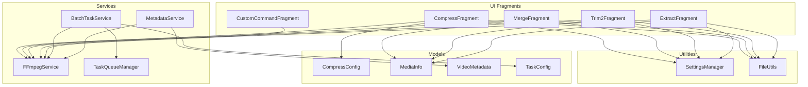
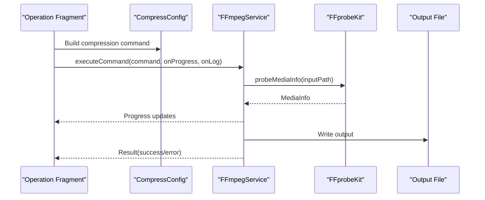
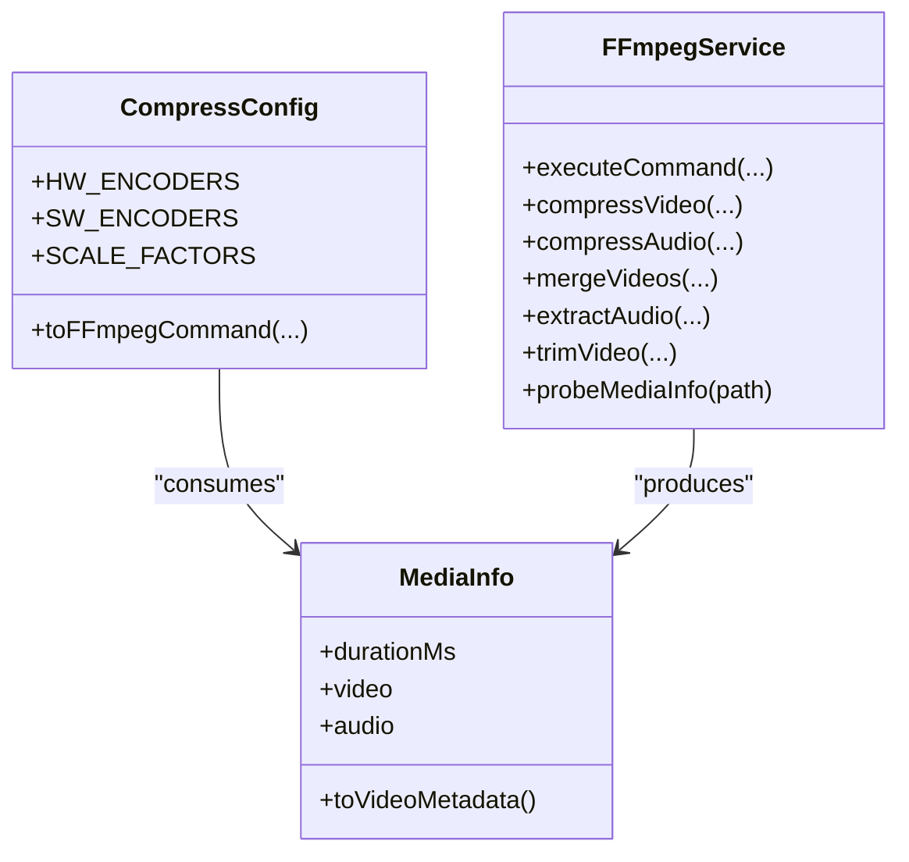
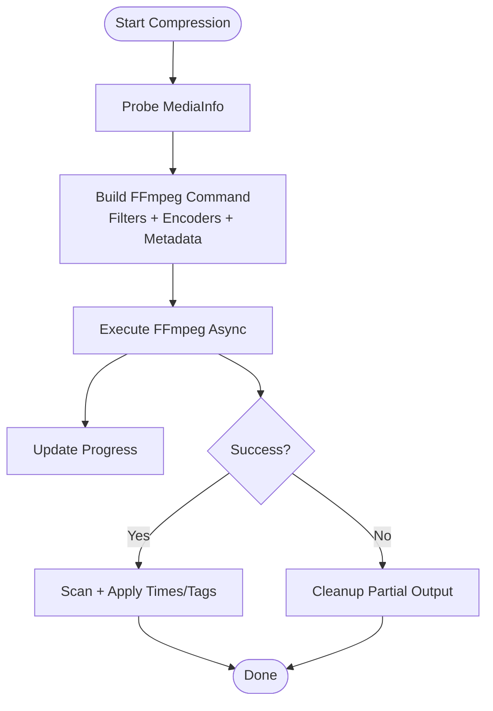
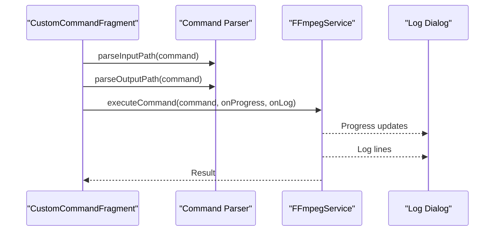
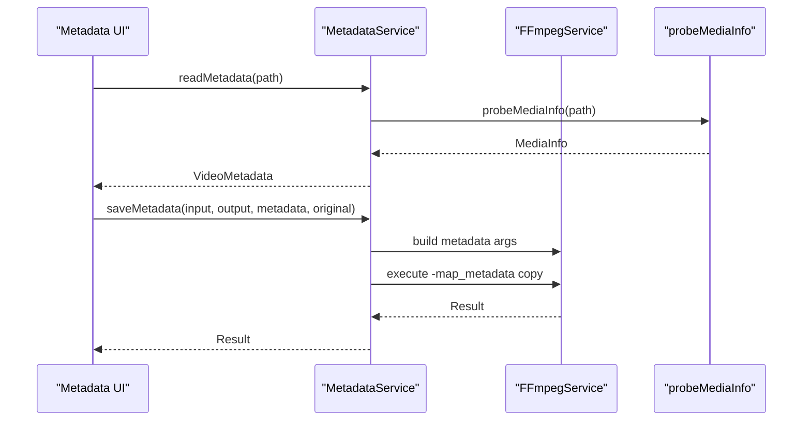
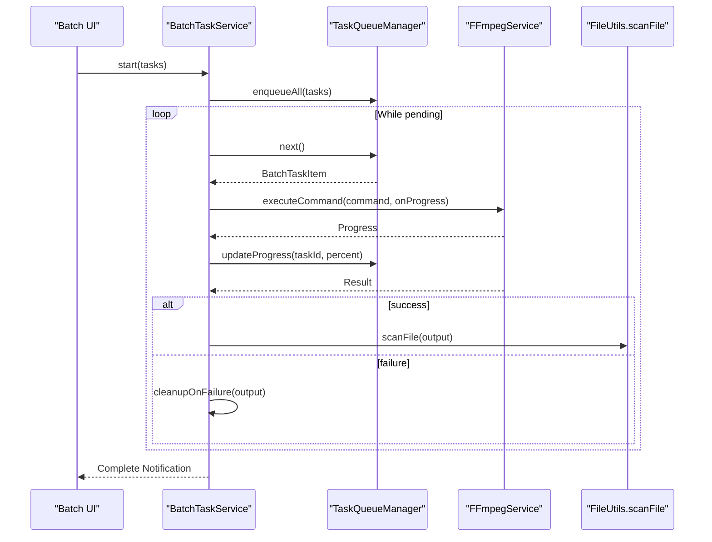
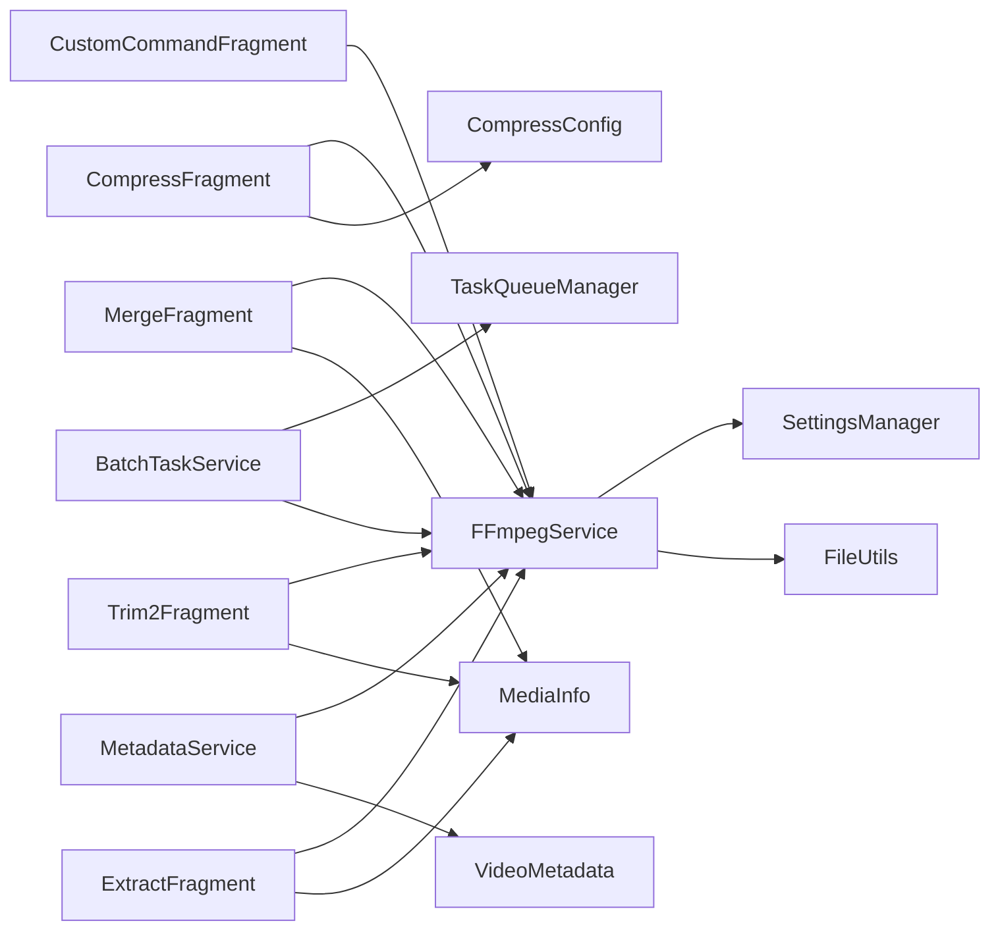

# Expert Usage Patterns and Extensions

<cite>
**Referenced Files in This Document**
- [SettingsManager.kt](file://app/src/main/java/com/pisces312/streamclip/util/SettingsManager.kt)
- [FFmpegService.kt](file://app/src/main/java/com/pisces312/streamclip/service/FFmpegService.kt)
- [CustomCommandFragment.kt](file://app/src/main/java/com/pisces312/streamclip/fragment/CustomCommandFragment.kt)
- [CompressConfig.kt](file://app/src/main/java/com/pisces312/streamclip/model/CompressConfig.kt)
- [BatchTaskService.kt](file://app/src/main/java/com/pisces312/streamclip/service/BatchTaskService.kt)
- [FileUtils.kt](file://app/src/main/java/com/pisces312/streamclip/util/FileUtils.kt)
- [CompressFragment.kt](file://app/src/main/java/com/pisces312/streamclip/fragment/CompressFragment.kt)
- [MergeFragment.kt](file://app/src/main/java/com/pisces312/streamclip/fragment/MergeFragment.kt)
- [Trim2Fragment.kt](file://app/src/main/java/com/pisces312/streamclip/fragment/Trim2Fragment.kt)
- [ExtractFragment.kt](file://app/src/main/java/com/pisces312/streamclip/fragment/ExtractFragment.kt)
- [MediaInfo.kt](file://app/src/main/java/com/pisces312/streamclip/model/MediaInfo.kt)
- [TaskQueueManager.kt](file://app/src/main/java/com/pisces312/streamclip/service/TaskQueueManager.kt)
- [VideoMetadata.kt](file://app/src/main/java/com/pisces312/streamclip/model/VideoMetadata.kt)
- [MetadataService.kt](file://app/src/main/java/com/pisces312/streamclip/service/MetadataService.kt)
- [TaskConfig.kt](file://app/src/main/java/com/pisces312/streamclip/model/TaskConfig.kt)
</cite>

## Table of Contents
1. [Introduction](#introduction)
2. [Project Structure](#project-structure)
3. [Core Components](#core-components)
4. [Architecture Overview](#architecture-overview)
5. [Detailed Component Analysis](#detailed-component-analysis)
6. [Dependency Analysis](#dependency-analysis)
7. [Performance Considerations](#performance-considerations)
8. [Troubleshooting Guide](#troubleshooting-guide)
9. [Conclusion](#conclusion)
10. [Appendices](#appendices)

## Introduction
This document provides expert-level guidance for extending and operating StreamClip at scale. It focuses on:
- Advanced FFmpeg command development with builder patterns, validation, and codec configurations
- Expert video processing workflows including complex filter chains, multi-pass encoding, and advanced metadata manipulation
- Application extension mechanisms for integrating custom fragments, operations, and service-layer enhancements
- Advanced configuration management via SettingsManager
- Integration patterns with external systems (formats, cloud storage, APIs)
- Deep troubleshooting, performance tuning, and advanced debugging
- Batch automation, scheduling, and workflow optimization

## Project Structure
StreamClip is organized around modular fragments (operations), a service layer (FFmpeg orchestration), models (data structures), utilities (file handling and settings), and a batch engine for background processing.

**Diagram sources**
- [CompressFragment.kt:1-839](file://app/src/main/java/com/pisces312/streamclip/fragment/CompressFragment.kt#L1-L839)
- [MergeFragment.kt:1-278](file://app/src/main/java/com/pisces312/streamclip/fragment/MergeFragment.kt#L1-L278)
- [Trim2Fragment.kt:1-286](file://app/src/main/java/com/pisces312/streamclip/fragment/Trim2Fragment.kt#L1-L286)
- [ExtractFragment.kt:1-209](file://app/src/main/java/com/pisces312/streamclip/fragment/ExtractFragment.kt#L1-L209)
- [CustomCommandFragment.kt:1-331](file://app/src/main/java/com/pisces312/streamclip/fragment/CustomCommandFragment.kt#L1-L331)
- [FFmpegService.kt:1-420](file://app/src/main/java/com/pisces312/streamclip/service/FFmpegService.kt#L1-L420)
- [BatchTaskService.kt:1-301](file://app/src/main/java/com/pisces312/streamclip/service/BatchTaskService.kt#L1-L301)
- [TaskQueueManager.kt:1-146](file://app/src/main/java/com/pisces312/streamclip/service/TaskQueueManager.kt#L1-L146)
- [MetadataService.kt:1-93](file://app/src/main/java/com/pisces312/streamclip/service/MetadataService.kt#L1-L93)
- [CompressConfig.kt:1-209](file://app/src/main/java/com/pisces312/streamclip/model/CompressConfig.kt#L1-L209)
- [MediaInfo.kt:1-165](file://app/src/main/java/com/pisces312/streamclip/model/MediaInfo.kt#L1-L165)
- [VideoMetadata.kt:1-56](file://app/src/main/java/com/pisces312/streamclip/model/VideoMetadata.kt#L1-L56)
- [TaskConfig.kt:1-15](file://app/src/main/java/com/pisces312/streamclip/model/TaskConfig.kt#L1-L15)
- [SettingsManager.kt:1-208](file://app/src/main/java/com/pisces312/streamclip/util/SettingsManager.kt#L1-L208)
- [FileUtils.kt:1-362](file://app/src/main/java/com/pisces312/streamclip/util/FileUtils.kt#L1-L362)

**Section sources**
- [CompressFragment.kt:1-839](file://app/src/main/java/com/pisces312/streamclip/fragment/CompressFragment.kt#L1-L839)
- [FFmpegService.kt:1-420](file://app/src/main/java/com/pisces312/streamclip/service/FFmpegService.kt#L1-L420)
- [SettingsManager.kt:1-208](file://app/src/main/java/com/pisces312/streamclip/util/SettingsManager.kt#L1-L208)

## Core Components
- SettingsManager: Centralized preferences for output paths, timestamps, screen-on behavior, and cache management.
- FFmpegService: Orchestration of FFmpeg/FFprobe operations, progress callbacks, and command execution.
- CompressConfig: Builder-style configuration for compression with hardware/software encoders, scaling, frame rates, and audio settings.
- BatchTaskService and TaskQueueManager: Background batch processing with retries, notifications, and cancellation.
- MetadataService and VideoMetadata: Lossless metadata read/write using FFmpeg’s copy path and sidecar tag files.
- FileUtils: Robust URI-to-path resolution, caching, scanning, and time-stamp preservation.
- Operation Fragments: Compress, Merge, Trim2, Extract, and CustomCommand provide UI and workflow integration.

**Section sources**
- [SettingsManager.kt:1-208](file://app/src/main/java/com/pisces312/streamclip/util/SettingsManager.kt#L1-L208)
- [FFmpegService.kt:1-420](file://app/src/main/java/com/pisces312/streamclip/service/FFmpegService.kt#L1-L420)
- [CompressConfig.kt:1-209](file://app/src/main/java/com/pisces312/streamclip/model/CompressConfig.kt#L1-L209)
- [BatchTaskService.kt:1-301](file://app/src/main/java/com/pisces312/streamclip/service/BatchTaskService.kt#L1-L301)
- [TaskQueueManager.kt:1-146](file://app/src/main/java/com/pisces312/streamclip/service/TaskQueueManager.kt#L1-L146)
- [MetadataService.kt:1-93](file://app/src/main/java/com/pisces312/streamclip/service/MetadataService.kt#L1-L93)
- [VideoMetadata.kt:1-56](file://app/src/main/java/com/pisces312/streamclip/model/VideoMetadata.kt#L1-L56)
- [FileUtils.kt:1-362](file://app/src/main/java/com/pisces312/streamclip/util/FileUtils.kt#L1-L362)

## Architecture Overview
The system follows a layered architecture:
- UI Layer: Operation fragments trigger processing and display progress/logs.
- Service Layer: FFmpegService encapsulates FFmpeg/FFprobe execution and progress/statistics.
- Model Layer: Data structures define configuration, media info, and metadata.
- Utility Layer: SettingsManager and FileUtils provide configuration and file/path handling.
- Batch Layer: BatchTaskService coordinates background tasks with TaskQueueManager.

**Diagram sources**
- [CompressFragment.kt:572-680](file://app/src/main/java/com/pisces312/streamclip/fragment/CompressFragment.kt#L572-L680)
- [FFmpegService.kt:152-241](file://app/src/main/java/com/pisces312/streamclip/service/FFmpegService.kt#L152-L241)
- [CompressConfig.kt:21-114](file://app/src/main/java/com/pisces312/streamclip/model/CompressConfig.kt#L21-L114)

**Section sources**
- [CompressFragment.kt:572-680](file://app/src/main/java/com/pisces312/streamclip/fragment/CompressFragment.kt#L572-L680)
- [FFmpegService.kt:152-241](file://app/src/main/java/com/pisces312/streamclip/service/FFmpegService.kt#L152-L241)
- [CompressConfig.kt:21-114](file://app/src/main/java/com/pisces312/streamclip/model/CompressConfig.kt#L21-L114)

## Detailed Component Analysis

### FFmpeg Command Builder and Execution
- Builder pattern: CompressConfig constructs FFmpeg commands with configurable encoders, scaling filters, frame rates, audio settings, and container choices.
- Validation: FFprobe-based probing ensures accurate duration and metadata for progress estimation and color metadata handling.
- Execution: FFmpegService wraps ffmpeg-kit execution with async callbacks, progress calculation, and cancellation support.
- Advanced codec configurations: H.264/H.265 hardware/software encoders, CRF/bitrate control, pixel formats, and HDR metadata injection.

**Diagram sources**
- [CompressConfig.kt:21-114](file://app/src/main/java/com/pisces312/streamclip/model/CompressConfig.kt#L21-L114)
- [FFmpegService.kt:355-418](file://app/src/main/java/com/pisces312/streamclip/service/FFmpegService.kt#L355-L418)
- [MediaInfo.kt:5-16](file://app/src/main/java/com/pisces312/streamclip/model/MediaInfo.kt#L5-L16)

**Section sources**
- [CompressConfig.kt:21-114](file://app/src/main/java/com/pisces312/streamclip/model/CompressConfig.kt#L21-L114)
- [FFmpegService.kt:355-418](file://app/src/main/java/com/pisces312/streamclip/service/FFmpegService.kt#L355-L418)
- [MediaInfo.kt:5-16](file://app/src/main/java/com/pisces312/streamclip/model/MediaInfo.kt#L5-L16)

### Expert Video Processing Operations
- Complex filter chains: Scaling with Lanczos, rotation clearing, and HDR color metadata injection via container-level flags.
- Multi-pass encoding: Not directly exposed; leverage software encoder presets and CRF for quality/performance balance.
- Advanced metadata manipulation: Lossless edits using sidecar tag files and -map_metadata for MOV containers to preserve GPS/location tags.

**Diagram sources**
- [FFmpegService.kt:152-241](file://app/src/main/java/com/pisces312/streamclip/service/FFmpegService.kt#L152-L241)
- [CompressFragment.kt:602-680](file://app/src/main/java/com/pisces312/streamclip/fragment/CompressFragment.kt#L602-L680)
- [BatchTaskService.kt:181-240](file://app/src/main/java/com/pisces312/streamclip/service/BatchTaskService.kt#L181-L240)

**Section sources**
- [CompressFragment.kt:572-680](file://app/src/main/java/com/pisces312/streamclip/fragment/CompressFragment.kt#L572-L680)
- [FFmpegService.kt:355-418](file://app/src/main/java/com/pisces312/streamclip/service/FFmpegService.kt#L355-L418)
- [BatchTaskService.kt:181-240](file://app/src/main/java/com/pisces312/streamclip/service/BatchTaskService.kt#L181-L240)

### Custom FFmpeg Command Development
- Pattern: Use CustomCommandFragment to parse input/output paths, execute FFmpeg or FFprobe, and stream logs/progress.
- Validation: Regex parsing of -i and output path; probe input duration for progress estimation.
- Integration: Hook into FFmpegService callbacks for unified progress/log handling.

**Diagram sources**
- [CustomCommandFragment.kt:89-204](file://app/src/main/java/com/pisces312/streamclip/fragment/CustomCommandFragment.kt#L89-L204)
- [FFmpegService.kt:152-241](file://app/src/main/java/com/pisces312/streamclip/service/FFmpegService.kt#L152-L241)

**Section sources**
- [CustomCommandFragment.kt:89-204](file://app/src/main/java/com/pisces312/streamclip/fragment/CustomCommandFragment.kt#L89-L204)
- [FFmpegService.kt:152-241](file://app/src/main/java/com/pisces312/streamclip/service/FFmpegService.kt#L152-L241)

### Metadata Manipulation Service
- Read: FFprobe-based MediaInfo to VideoMetadata conversion.
- Write: Sidecar tag extraction and -map_metadata copy to preserve tags losslessly.
- Container choice: MOV for GPS metadata preservation.

**Diagram sources**
- [MetadataService.kt:15-67](file://app/src/main/java/com/pisces312/streamclip/service/MetadataService.kt#L15-L67)
- [FFmpegService.kt:278-291](file://app/src/main/java/com/pisces312/streamclip/service/FFmpegService.kt#L278-L291)
- [MediaInfo.kt:142-144](file://app/src/main/java/com/pisces312/streamclip/model/MediaInfo.kt#L142-L144)

**Section sources**
- [MetadataService.kt:15-67](file://app/src/main/java/com/pisces312/streamclip/service/MetadataService.kt#L15-L67)
- [FFmpegService.kt:278-291](file://app/src/main/java/com/pisces312/streamclip/service/FFmpegService.kt#L278-L291)
- [MediaInfo.kt:142-144](file://app/src/main/java/com/pisces312/streamclip/model/MediaInfo.kt#L142-L144)

### Batch Processing and Automation
- Queue management: TaskQueueManager tracks pending/running/completed tasks with progress and retries.
- Service orchestration: BatchTaskService starts foreground processing, handles pause/resume/cancel, and integrates with notification manager.
- Workflow optimization: Pre-probe durations, lossless operations (-c copy), and time-stamp preservation.

**Diagram sources**
- [BatchTaskService.kt:123-165](file://app/src/main/java/com/pisces312/streamclip/service/BatchTaskService.kt#L123-L165)
- [TaskQueueManager.kt:24-53](file://app/src/main/java/com/pisces312/streamclip/service/TaskQueueManager.kt#L24-L53)
- [FFmpegService.kt:152-241](file://app/src/main/java/com/pisces312/streamclip/service/FFmpegService.kt#L152-L241)
- [FileUtils.kt:268-275](file://app/src/main/java/com/pisces312/streamclip/util/FileUtils.kt#L268-L275)

**Section sources**
- [BatchTaskService.kt:123-165](file://app/src/main/java/com/pisces312/streamclip/service/BatchTaskService.kt#L123-L165)
- [TaskQueueManager.kt:24-53](file://app/src/main/java/com/pisces312/streamclip/service/TaskQueueManager.kt#L24-L53)
- [FFmpegService.kt:152-241](file://app/src/main/java/com/pisces312/streamclip/service/FFmpegService.kt#L152-L241)
- [FileUtils.kt:268-275](file://app/src/main/java/com/pisces312/streamclip/util/FileUtils.kt#L268-L275)

### Extension Mechanisms
- New operation: Add a new fragment mirroring existing patterns (selection, probing, command building, execution, logging, output handling).
- Custom fragment integration: Implement command parsing and pass to FFmpegService.executeCommand with onProgress/onLog hooks.
- Service layer extensions: Extend FFmpegService with new methods (e.g., multi-pass encode wrappers) and integrate with TaskQueueManager for batch.

Practical steps:
- Define UI controls and event handlers similar to CompressFragment/MergeFragment/Trim2Fragment/ExtractFragment.
- Build command via CompressConfig or a dedicated builder.
- Use FFmpegService for execution and progress callbacks.
- Persist outputs and update MediaStore via FileUtils.scanFile.

**Section sources**
- [CompressFragment.kt:452-487](file://app/src/main/java/com/pisces312/streamclip/fragment/CompressFragment.kt#L452-L487)
- [MergeFragment.kt:135-232](file://app/src/main/java/com/pisces312/streamclip/fragment/MergeFragment.kt#L135-L232)
- [Trim2Fragment.kt:178-251](file://app/src/main/java/com/pisces312/streamclip/fragment/Trim2Fragment.kt#L178-L251)
- [ExtractFragment.kt:136-191](file://app/src/main/java/com/pisces312/streamclip/fragment/ExtractFragment.kt#L136-L191)
- [FFmpegService.kt:152-241](file://app/src/main/java/com/pisces312/streamclip/service/FFmpegService.kt#L152-L241)

### Advanced Configuration Management with SettingsManager
- Preferences: Output path selection, timestamp suffix, keep-screen-on, last video directory, cache size and clear.
- Output path resolution: Smart fallback logic for cache/private directories.
- Persistence: SharedPreferences-backed getters/setters with formatted sizes.

Best practices:
- Use SettingsManager.getOutputDir to honor user preferences and safety checks.
- Toggle SettingsManager.isKeepScreenOn for long-running operations.
- Periodically call SettingsManager.clearCache to reclaim space.

**Section sources**
- [SettingsManager.kt:67-136](file://app/src/main/java/com/pisces312/streamclip/util/SettingsManager.kt#L67-L136)
- [SettingsManager.kt:158-164](file://app/src/main/java/com/pisces312/streamclip/util/SettingsManager.kt#L158-L164)

### Integration Patterns with External Systems
- File format support: Leverage FFmpegService’s probeMediaInfo and MediaInfo to detect codecs/formats; choose appropriate containers (MOV for GPS metadata).
- Cloud storage: Use FileUtils.getPathResultFromUri to resolve URIs; when content URI cannot be resolved, copy to cache and process locally.
- API connectivity: Wrap external API calls in coroutines and feed results into FFmpegService commands; surface logs via onLog callbacks.

**Section sources**
- [FFmpegService.kt:56-147](file://app/src/main/java/com/pisces312/streamclip/service/FFmpegService.kt#L56-L147)
- [MediaInfo.kt:101-121](file://app/src/main/java/com/pisces312/streamclip/model/MediaInfo.kt#L101-L121)
- [FileUtils.kt:30-118](file://app/src/main/java/com/pisces312/streamclip/util/FileUtils.kt#L30-L118)

## Dependency Analysis
Key dependencies and coupling:
- Fragments depend on FFmpegService and SettingsManager for execution and configuration.
- BatchTaskService depends on TaskQueueManager and FileUtils for coordination and post-processing.
- MetadataService depends on FFmpegService for probing and on VideoMetadata for argument building.

**Diagram sources**
- [CompressFragment.kt:1-839](file://app/src/main/java/com/pisces312/streamclip/fragment/CompressFragment.kt#L1-L839)
- [MergeFragment.kt:1-278](file://app/src/main/java/com/pisces312/streamclip/fragment/MergeFragment.kt#L1-L278)
- [Trim2Fragment.kt:1-286](file://app/src/main/java/com/pisces312/streamclip/fragment/Trim2Fragment.kt#L1-L286)
- [ExtractFragment.kt:1-209](file://app/src/main/java/com/pisces312/streamclip/fragment/ExtractFragment.kt#L1-L209)
- [CustomCommandFragment.kt:1-331](file://app/src/main/java/com/pisces312/streamclip/fragment/CustomCommandFragment.kt#L1-L331)
- [FFmpegService.kt:1-420](file://app/src/main/java/com/pisces312/streamclip/service/FFmpegService.kt#L1-L420)
- [BatchTaskService.kt:1-301](file://app/src/main/java/com/pisces312/streamclip/service/BatchTaskService.kt#L1-L301)
- [TaskQueueManager.kt:1-146](file://app/src/main/java/com/pisces312/streamclip/service/TaskQueueManager.kt#L1-L146)
- [MetadataService.kt:1-93](file://app/src/main/java/com/pisces312/streamclip/service/MetadataService.kt#L1-L93)
- [CompressConfig.kt:1-209](file://app/src/main/java/com/pisces312/streamclip/model/CompressConfig.kt#L1-L209)
- [MediaInfo.kt:1-165](file://app/src/main/java/com/pisces312/streamclip/model/MediaInfo.kt#L1-L165)
- [VideoMetadata.kt:1-56](file://app/src/main/java/com/pisces312/streamclip/model/VideoMetadata.kt#L1-L56)
- [SettingsManager.kt:1-208](file://app/src/main/java/com/pisces312/streamclip/util/SettingsManager.kt#L1-L208)
- [FileUtils.kt:1-362](file://app/src/main/java/com/pisces312/streamclip/util/FileUtils.kt#L1-L362)

**Section sources**
- [FFmpegService.kt:1-420](file://app/src/main/java/com/pisces312/streamclip/service/FFmpegService.kt#L1-L420)
- [BatchTaskService.kt:1-301](file://app/src/main/java/com/pisces312/streamclip/service/BatchTaskService.kt#L1-L301)
- [TaskQueueManager.kt:1-146](file://app/src/main/java/com/pisces312/streamclip/service/TaskQueueManager.kt#L1-L146)
- [MetadataService.kt:1-93](file://app/src/main/java/com/pisces312/streamclip/service/MetadataService.kt#L1-L93)

## Performance Considerations
- Prefer lossless operations (-c copy) when possible (trim, merge, metadata edits) to reduce CPU and I/O.
- Use hardware encoders for speed; software encoders for fine-tuned quality (CRF/preset).
- Probing once per task and reusing MediaInfo reduces overhead.
- Batch processing with TaskQueueManager minimizes UI thread work and improves throughput.
- Keep screen on only during long operations to conserve battery.

[No sources needed since this section provides general guidance]

## Troubleshooting Guide
- Deep system analysis:
  - Inspect FFmpegService logs via onLog callbacks and CustomCommandFragment dialog.
  - Use FFprobeKit for targeted probing and return code inspection.
- Performance tuning:
  - Switch between hardware/software encoders based on device capability.
  - Adjust scaling filters and frame rates to balance quality and speed.
- Advanced debugging:
  - Validate commands built by CompressConfig and CustomCommandFragment.
  - Verify output directory resolution via SettingsManager.getOutputDir.
  - Confirm file time-stamp preservation using FileUtils.applyFileTimes/applyShootingDate.

**Section sources**
- [CustomCommandFragment.kt:150-174](file://app/src/main/java/com/pisces312/streamclip/fragment/CustomCommandFragment.kt#L150-L174)
- [FFmpegService.kt:179-232](file://app/src/main/java/com/pisces312/streamclip/service/FFmpegService.kt#L179-L232)
- [SettingsManager.kt:67-92](file://app/src/main/java/com/pisces312/streamclip/util/SettingsManager.kt#L67-L92)
- [FileUtils.kt:318-331](file://app/src/main/java/com/pisces312/streamclip/util/FileUtils.kt#L318-L331)

## Conclusion
StreamClip’s architecture supports expert-level customization and automation. By leveraging CompressConfig builders, FFmpegService orchestration, SettingsManager preferences, and BatchTaskService, developers can implement advanced video processing workflows, integrate external systems, and maintain high performance and reliability.

[No sources needed since this section summarizes without analyzing specific files]

## Appendices

### Expert Workflows
- Batch automation: Prepare tasks with TaskConfig and launch via BatchTaskService; monitor progress through TaskQueueManager.
- Scheduled operations: Schedule batch jobs using Android AlarmManager or WorkManager to trigger BatchTaskService.start.
- Workflow optimization: Pre-validate inputs, reuse probes, and prefer lossless operations to minimize processing time.

**Section sources**
- [TaskConfig.kt:5-14](file://app/src/main/java/com/pisces312/streamclip/model/TaskConfig.kt#L5-L14)
- [BatchTaskService.kt:49-56](file://app/src/main/java/com/pisces312/streamclip/service/BatchTaskService.kt#L49-L56)
- [TaskQueueManager.kt:16-30](file://app/src/main/java/com/pisces312/streamclip/service/TaskQueueManager.kt#L16-L30)