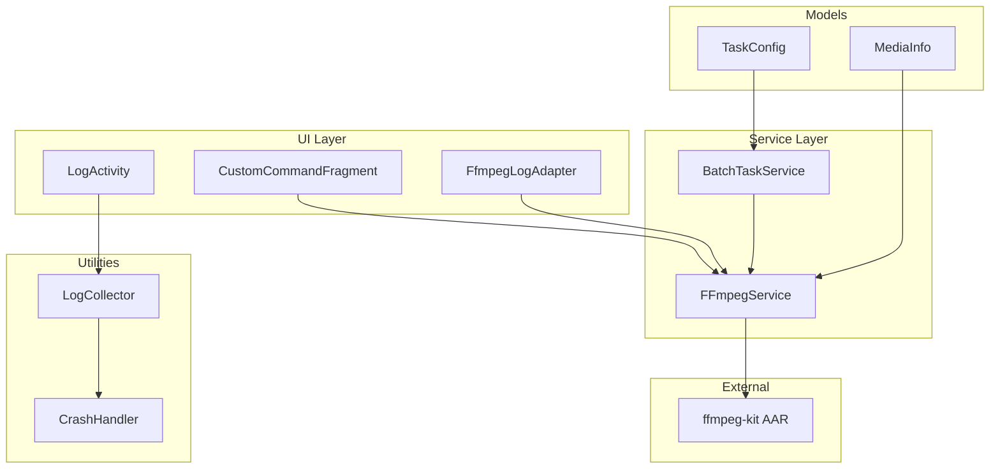
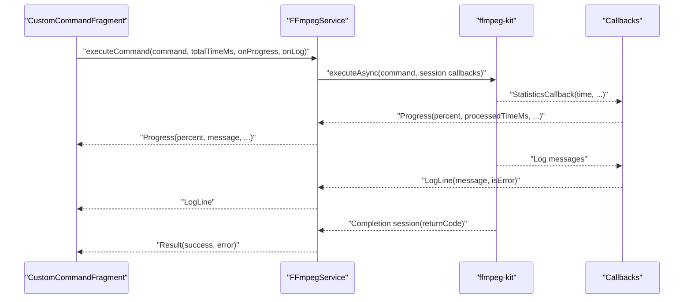
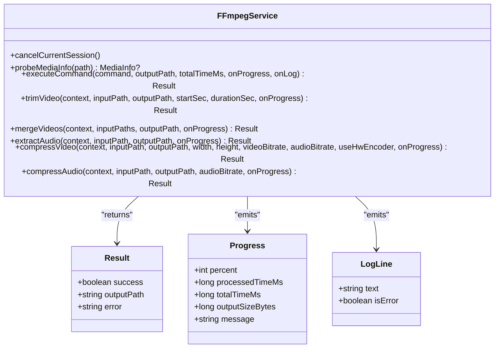
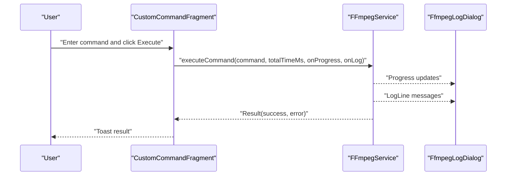
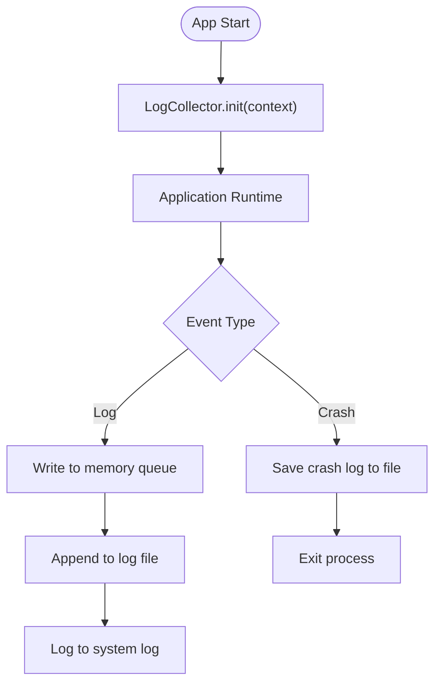
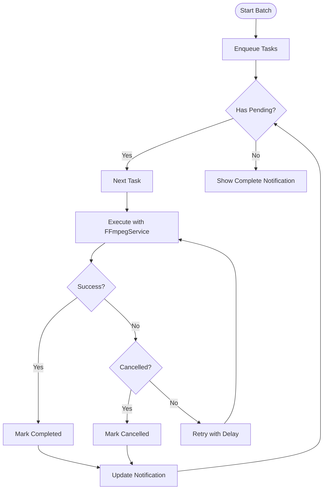
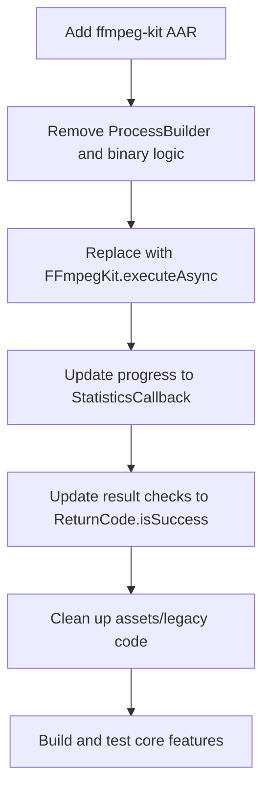
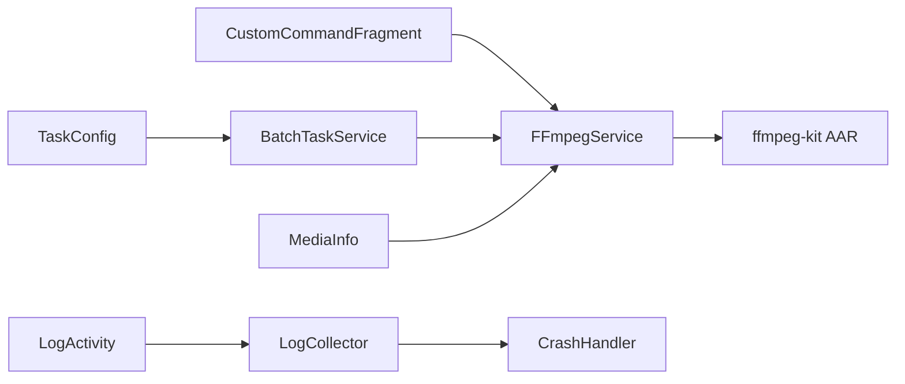
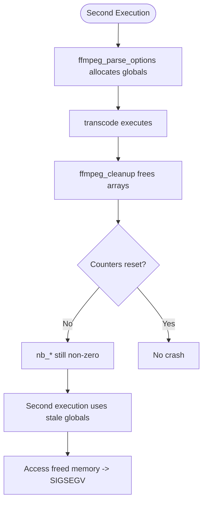
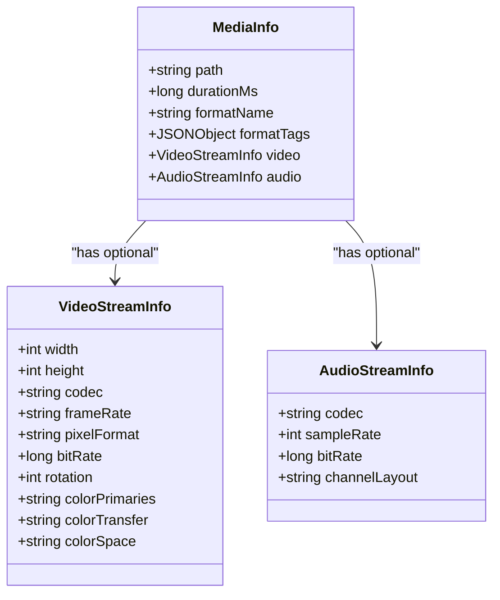

# FFmpeg Integration and Migration

<cite>
**Referenced Files in This Document**
- [FFmpegService.kt](file://app/src/main/java/com/pisces312/streamclip/service/FFmpegService.kt)
- [CustomCommandFragment.kt](file://app/src/main/java/com/pisces312/streamclip/fragment/CustomCommandFragment.kt)
- [FfmpegLogAdapter.kt](file://app/src/main/java/com/pisces312/streamclip/adapter/FfmpegLogAdapter.kt)
- [LogActivity.kt](file://app/src/main/java/com/pisces312/streamclip/LogActivity.kt)
- [LogCollector.kt](file://app/src/main/java/com/pisces312/streamclip/util/LogCollector.kt)
- [CrashHandler.kt](file://app/src/main/java/com/pisces312/streamclip/util/CrashHandler.kt)
- [BatchTaskService.kt](file://app/src/main/java/com/pisces312/streamclip/service/BatchTaskService.kt)
- [MediaInfo.kt](file://app/src/main/java/com/pisces312/streamclip/model/MediaInfo.kt)
- [TaskConfig.kt](file://app/src/main/java/com/pisces312/streamclip/model/TaskConfig.kt)
- [build.gradle.kts](file://app/build.gradle.kts)
- [ffmpeg-kit-migration-plan.md](file://docs/ffmpeg-kit-migration-plan.md)
- [ffmpeg-8.1-consecutive-crash-analysis.md](file://docs/ffmpeg-8.1-consecutive-crash-analysis.md)
- [ffmpeg-kit-8.1-double-execute-crash.md](file://docs/ffmpeg-kit-8.1-double-execute-crash.md)
- [swresample-crash-analysis.md](file://docs/swresample-crash-analysis.md)
</cite>

## Table of Contents
1. [Introduction](#introduction)
2. [Project Structure](#project-structure)
3. [Core Components](#core-components)
4. [Architecture Overview](#architecture-overview)
5. [Detailed Component Analysis](#detailed-component-analysis)
6. [Dependency Analysis](#dependency-analysis)
7. [Performance Considerations](#performance-considerations)
8. [Troubleshooting Guide](#troubleshooting-guide)
9. [Conclusion](#conclusion)
10. [Appendices](#appendices)

## Introduction
This document provides comprehensive guidance for FFmpeg integration and migration in StreamClip, focusing on the adoption of ffmpeg-kit, migration strategies, crash analysis methodologies, and robust operational practices. It consolidates the existing implementation and documented analyses to help developers upgrade FFmpeg safely, diagnose crashes, and optimize performance.

## Project Structure
StreamClip integrates FFmpeg via ffmpeg-kit AAR and exposes a Kotlin service layer for command execution, progress reporting, and logging. UI fragments orchestrate FFmpeg operations, while utilities provide crash-safe logging and global crash handling. Batch processing runs in a foreground service with retry and cancellation support.

**Diagram sources**
- [CustomCommandFragment.kt:89-204](file://app/src/main/java/com/pisces312/streamclip/fragment/CustomCommandFragment.kt#L89-L204)
- [FFmpegService.kt:152-241](file://app/src/main/java/com/pisces312/streamclip/service/FFmpegService.kt#L152-L241)
- [LogActivity.kt:39-67](file://app/src/main/java/com/pisces312/streamclip/LogActivity.kt#L39-L67)
- [FfmpegLogAdapter.kt:11-42](file://app/src/main/java/com/pisces312/streamclip/adapter/FfmpegLogAdapter.kt#L11-L42)
- [BatchTaskService.kt:181-240](file://app/src/main/java/com/pisces312/streamclip/service/BatchTaskService.kt#L181-L240)
- [LogCollector.kt:43-54](file://app/src/main/java/com/pisces312/streamclip/util/LogCollector.kt#L43-L54)
- [CrashHandler.kt:10-27](file://app/src/main/java/com/pisces312/streamclip/util/CrashHandler.kt#L10-L27)
- [MediaInfo.kt:5-16](file://app/src/main/java/com/pisces312/streamclip/model/MediaInfo.kt#L5-L16)
- [TaskConfig.kt:5-9](file://app/src/main/java/com/pisces312/streamclip/model/TaskConfig.kt#L5-L9)
- [build.gradle.kts:74-75](file://app/build.gradle.kts#L74-L75)

**Section sources**
- [build.gradle.kts:74-75](file://app/build.gradle.kts#L74-L75)
- [FFmpegService.kt:19-50](file://app/src/main/java/com/pisces312/streamclip/service/FFmpegService.kt#L19-L50)

## Core Components
- FFmpegService: Centralized execution of FFmpeg commands via ffmpeg-kit, progress and log callbacks, cancellation, and built-in commands for trimming, merging, extracting audio, and compression.
- CustomCommandFragment: UI for executing arbitrary FFmpeg/FFprobe commands with live progress and logs.
- LogCollector and CrashHandler: Dual-track logging (in-memory and persistent) with crash persistence and global crash handling.
- BatchTaskService: Foreground service orchestrating batch operations with retries, notifications, and per-task cancellation.
- MediaInfo and TaskConfig: Data models supporting media probing and task configuration.

Key responsibilities:
- Command construction and validation
- Progress estimation using ffprobe duration and StatisticsCallback
- Robust error handling and cancellation
- Persistent logging for diagnostics and crash analysis

**Section sources**
- [FFmpegService.kt:152-241](file://app/src/main/java/com/pisces312/streamclip/service/FFmpegService.kt#L152-L241)
- [CustomCommandFragment.kt:89-204](file://app/src/main/java/com/pisces312/streamclip/fragment/CustomCommandFragment.kt#L89-L204)
- [LogCollector.kt:43-54](file://app/src/main/java/com/pisces312/streamclip/util/LogCollector.kt#L43-L54)
- [CrashHandler.kt:10-27](file://app/src/main/java/com/pisces312/streamclip/util/CrashHandler.kt#L10-L27)
- [BatchTaskService.kt:181-240](file://app/src/main/java/com/pisces312/streamclip/service/BatchTaskService.kt#L181-L240)
- [MediaInfo.kt:5-16](file://app/src/main/java/com/pisces312/streamclip/model/MediaInfo.kt#L5-L16)
- [TaskConfig.kt:5-9](file://app/src/main/java/com/pisces312/streamclip/model/TaskConfig.kt#L5-L9)

## Architecture Overview
The system uses ffmpeg-kit to execute FFmpeg operations asynchronously. Commands are constructed in UI fragments or services, executed via FFmpegService, and progress/log callbacks update the UI. Persistent logging supports post-mortem analysis.

**Diagram sources**
- [CustomCommandFragment.kt:110-198](file://app/src/main/java/com/pisces312/streamclip/fragment/CustomCommandFragment.kt#L110-L198)
- [FFmpegService.kt:152-241](file://app/src/main/java/com/pisces312/streamclip/service/FFmpegService.kt#L152-L241)

## Detailed Component Analysis

### FFmpegService: Execution, Progress, and Logging
- Asynchronous execution with ffmpeg-kit and cancellation support.
- Progress estimation using total duration from ffprobe and StatisticsCallback.
- Built-in commands for trimming, merging, extracting audio, and compression.
- Robust error handling and logging via LogCollector.

**Diagram sources**
- [FFmpegService.kt:19-50](file://app/src/main/java/com/pisces312/streamclip/service/FFmpegService.kt#L19-L50)
- [FFmpegService.kt:152-241](file://app/src/main/java/com/pisces312/streamclip/service/FFmpegService.kt#L152-L241)

**Section sources**
- [FFmpegService.kt:152-241](file://app/src/main/java/com/pisces312/streamclip/service/FFmpegService.kt#L152-L241)
- [FFmpegService.kt:246-393](file://app/src/main/java/com/pisces312/streamclip/service/FFmpegService.kt#L246-L393)
- [FFmpegService.kt:398-418](file://app/src/main/java/com/pisces312/streamclip/service/FFmpegService.kt#L398-L418)

### CustomCommandFragment: Command Execution and UI Integration
- Parses input/output paths from user commands.
- Displays progress and logs in a dedicated dialog.
- Integrates with FFmpegService for execution and cancellation.

**Diagram sources**
- [CustomCommandFragment.kt:89-204](file://app/src/main/java/com/pisces312/streamclip/fragment/CustomCommandFragment.kt#L89-L204)
- [FFmpegService.kt:152-241](file://app/src/main/java/com/pisces312/streamclip/service/FFmpegService.kt#L152-L241)

**Section sources**
- [CustomCommandFragment.kt:89-204](file://app/src/main/java/com/pisces312/streamclip/fragment/CustomCommandFragment.kt#L89-L204)
- [CustomCommandFragment.kt:222-310](file://app/src/main/java/com/pisces312/streamclip/fragment/CustomCommandFragment.kt#L222-L310)

### LogCollector and CrashHandler: Logging and Crash Persistence
- Dual-track logging: in-memory ring buffer and persistent file.
- CrashHandler saves crash logs to storage and exits gracefully.
- LogActivity displays crash logs and normal logs for debugging.

**Diagram sources**
- [LogCollector.kt:43-88](file://app/src/main/java/com/pisces312/streamclip/util/LogCollector.kt#L43-L88)
- [CrashHandler.kt:18-27](file://app/src/main/java/com/pisces312/streamclip/util/CrashHandler.kt#L18-L27)
- [LogActivity.kt:39-67](file://app/src/main/java/com/pisces312/streamclip/LogActivity.kt#L39-L67)

**Section sources**
- [LogCollector.kt:43-88](file://app/src/main/java/com/pisces312/streamclip/util/LogCollector.kt#L43-L88)
- [CrashHandler.kt:10-27](file://app/src/main/java/com/pisces312/streamclip/util/CrashHandler.kt#L10-L27)
- [LogActivity.kt:39-67](file://app/src/main/java/com/pisces312/streamclip/LogActivity.kt#L39-L67)

### BatchTaskService: Concurrency, Retries, and Cleanup
- Foreground service managing batch queues with per-task jobs.
- Retry logic and per-task cancellation.
- Cleanup on failure and progress notifications.

**Diagram sources**
- [BatchTaskService.kt:118-165](file://app/src/main/java/com/pisces312/streamclip/service/BatchTaskService.kt#L118-L165)
- [BatchTaskService.kt:167-179](file://app/src/main/java/com/pisces312/streamclip/service/BatchTaskService.kt#L167-L179)
- [BatchTaskService.kt:181-240](file://app/src/main/java/com/pisces312/streamclip/service/BatchTaskService.kt#L181-L240)

**Section sources**
- [BatchTaskService.kt:118-165](file://app/src/main/java/com/pisces312/streamclip/service/BatchTaskService.kt#L118-L165)
- [BatchTaskService.kt:167-179](file://app/src/main/java/com/pisces312/streamclip/service/BatchTaskService.kt#L167-L179)
- [BatchTaskService.kt:181-240](file://app/src/main/java/com/pisces312/streamclip/service/BatchTaskService.kt#L181-L240)

### FFmpeg Integration Migration Plan
StreamClip migrated from ProcessBuilder + binary FFmpeg to ffmpeg-kit AAR. The migration plan documents steps to add the AAR, rewrite FFmpegService to use ffmpeg-kit APIs, and clean up legacy assets.

**Diagram sources**
- [ffmpeg-kit-migration-plan.md:11-41](file://docs/ffmpeg-kit-migration-plan.md#L11-L41)
- [build.gradle.kts:74-75](file://app/build.gradle.kts#L74-L75)

**Section sources**
- [ffmpeg-kit-migration-plan.md:1-61](file://docs/ffmpeg-kit-migration-plan.md#L1-L61)
- [build.gradle.kts:74-75](file://app/build.gradle.kts#L74-L75)

## Dependency Analysis
- FFmpegService depends on ffmpeg-kit for execution and statistics.
- UI fragments depend on FFmpegService for operations.
- LogCollector and CrashHandler provide cross-cutting concerns.
- BatchTaskService coordinates batch operations and interacts with FFmpegService.

**Diagram sources**
- [CustomCommandFragment.kt:125-149](file://app/src/main/java/com/pisces312/streamclip/fragment/CustomCommandFragment.kt#L125-L149)
- [BatchTaskService.kt:197-210](file://app/src/main/java/com/pisces312/streamclip/service/BatchTaskService.kt#L197-L210)
- [FFmpegService.kt:152-241](file://app/src/main/java/com/pisces312/streamclip/service/FFmpegService.kt#L152-L241)
- [LogActivity.kt:39-67](file://app/src/main/java/com/pisces312/streamclip/LogActivity.kt#L39-L67)
- [LogCollector.kt:43-54](file://app/src/main/java/com/pisces312/streamclip/util/LogCollector.kt#L43-L54)
- [CrashHandler.kt:10-27](file://app/src/main/java/com/pisces312/streamclip/util/CrashHandler.kt#L10-L27)
- [MediaInfo.kt:5-16](file://app/src/main/java/com/pisces312/streamclip/model/MediaInfo.kt#L5-L16)
- [TaskConfig.kt:5-9](file://app/src/main/java/com/pisces312/streamclip/model/TaskConfig.kt#L5-L9)
- [build.gradle.kts:74-75](file://app/build.gradle.kts#L74-L75)

**Section sources**
- [build.gradle.kts:74-75](file://app/build.gradle.kts#L74-L75)

## Performance Considerations
- Prefer hardware encoders when available to reduce CPU usage during compression.
- Use lossless copy modes (-c copy) for trimming and merging to avoid re-encoding.
- Estimate progress using ffprobe duration and StatisticsCallback to provide responsive UI feedback.
- Minimize file I/O by avoiding unnecessary temporary files; reuse metadata extraction when applying tags.
- Keep screen on during long operations only when configured to improve UX without draining battery unnecessarily.

[No sources needed since this section provides general guidance]

## Troubleshooting Guide

### Continuous Crash Analysis (FFmpeg 8.1)
- Symptom: SIGSEGV after second execution with wild pointer address.
- Root cause: Global state not reset after ffmpeg_cleanup; subsequent execution accesses freed pointers.
- Mitigations:
  - Application-level mutual exclusion around executions.
  - Patch ffmpeg_execute to reset counters after cleanup.
  - Downgrade to a known-stable version if upstream fix unavailable.

**Diagram sources**
- [ffmpeg-8.1-consecutive-crash-analysis.md:72-114](file://docs/ffmpeg-8.1-consecutive-crash-analysis.md#L72-L114)
- [ffmpeg-kit-8.1-double-execute-crash.md:84-102](file://docs/ffmpeg-kit-8.1-double-execute-crash.md#L84-L102)

**Section sources**
- [ffmpeg-8.1-consecutive-crash-analysis.md:1-128](file://docs/ffmpeg-8.1-consecutive-crash-analysis.md#L1-L128)
- [ffmpeg-kit-8.1-double-execute-crash.md:1-174](file://docs/ffmpeg-kit-8.1-double-execute-crash.md#L1-L174)

### Double Execute Crash Investigation
- Confirm crash occurs on second call with ffmpeg-kit 8.1 AAR.
- Use tombstone collection and ndk-stack to symbolicate stack traces.
- Verify that cleanup routines reset global counters.

**Section sources**
- [ffmpeg-kit-8.1-double-execute-crash.md:1-174](file://docs/ffmpeg-kit-8.1-double-execute-crash.md#L1-L174)

### Swresample Crash Analysis
- Symptom: Native crash in libswresample during audio resampling.
- Hypotheses:
  - Missing compiler flags causing unstable NEON code generation.
  - FFmpeg 8.1-specific edge case in resample filter bank.
- Mitigations:
  - Add missing compiler/linker flags to build scripts.
  - Temporarily avoid resampling by copying audio sample rate.
  - Apply upstream patches or upgrade FFmpeg version.

**Section sources**
- [swresample-crash-analysis.md:1-244](file://docs/swresample-crash-analysis.md#L1-L244)

### Practical Examples: Command Construction, Validation, and Error Handling
- Command construction:
  - Trimming: use -ss/-t with -c copy for lossless cut.
  - Merging: use concat demuxer with -safe 0 and -c copy.
  - Compression: choose hardware/software encoder based on device capabilities.
- Parameter validation:
  - Parse input/output paths from command strings.
  - Validate minimum input counts for merge operations.
- Error handling:
  - Use ReturnCode.isSuccess to determine success.
  - Capture session output/logs for diagnostics.
  - Provide user-friendly error messages and toast feedback.

**Section sources**
- [FFmpegService.kt:246-393](file://app/src/main/java/com/pisces312/streamclip/service/FFmpegService.kt#L246-L393)
- [CustomCommandFragment.kt:206-220](file://app/src/main/java/com/pisces312/streamclip/fragment/CustomCommandFragment.kt#L206-L220)
- [CustomCommandFragment.kt:125-149](file://app/src/main/java/com/pisces312/streamclip/fragment/CustomCommandFragment.kt#L125-L149)

### Monitoring Execution Progress
- Use StatisticsCallback to compute percentage from processed time and total duration.
- Display elapsed and estimated remaining time in UI dialogs.
- Persist logs for later inspection via LogActivity.

**Section sources**
- [FFmpegService.kt:182-214](file://app/src/main/java/com/pisces312/streamclip/service/FFmpegService.kt#L182-L214)
- [CustomCommandFragment.kt:288-308](file://app/src/main/java/com/pisces312/streamclip/fragment/CustomCommandFragment.kt#L288-L308)
- [LogActivity.kt:39-67](file://app/src/main/java/com/pisces312/streamclip/LogActivity.kt#L39-L67)

## Conclusion
StreamClip’s FFmpeg integration leverages ffmpeg-kit for reliable, asynchronous execution with robust progress and logging. The documented migration plan and crash analyses provide clear pathways to upgrade safely, diagnose native crashes, and optimize performance. By following the recommended practices—mutual exclusion for problematic versions, proper compiler flags, and comprehensive logging—developers can maintain stability and deliver a smooth user experience.

[No sources needed since this section summarizes without analyzing specific files]

## Appendices

### FFmpegKit Migration Checklist
- Add AAR dependency and remove legacy binary assets.
- Replace ProcessBuilder calls with FFmpegKit.executeAsync.
- Update progress callbacks to StatisticsCallback.
- Replace result checks with ReturnCode.isSuccess.
- Validate commands and clean up resources.

**Section sources**
- [ffmpeg-kit-migration-plan.md:11-41](file://docs/ffmpeg-kit-migration-plan.md#L11-L41)
- [build.gradle.kts:74-75](file://app/build.gradle.kts#L74-L75)

### Data Model Overview

**Diagram sources**
- [MediaInfo.kt:5-16](file://app/src/main/java/com/pisces312/streamclip/model/MediaInfo.kt#L5-L16)
- [MediaInfo.kt:146-165](file://app/src/main/java/com/pisces312/streamclip/model/MediaInfo.kt#L146-L165)