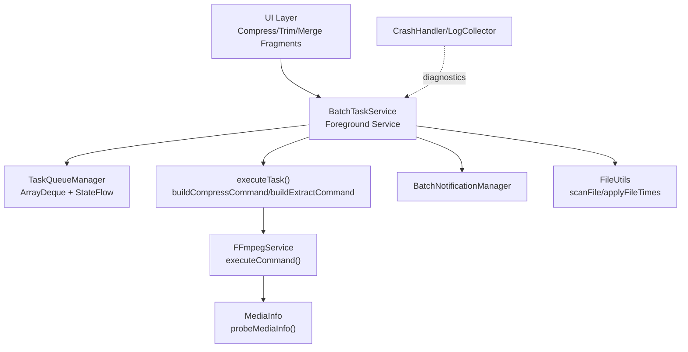
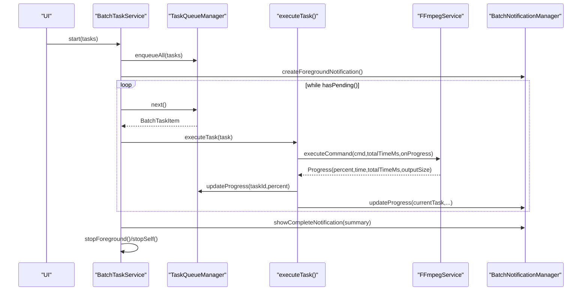
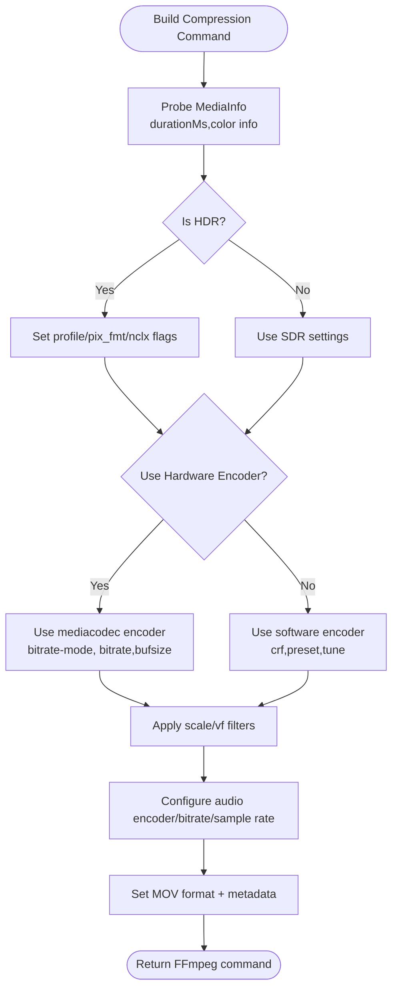
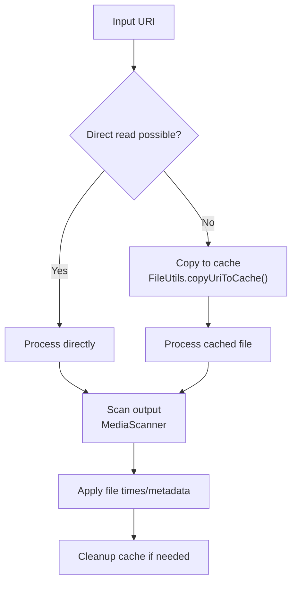
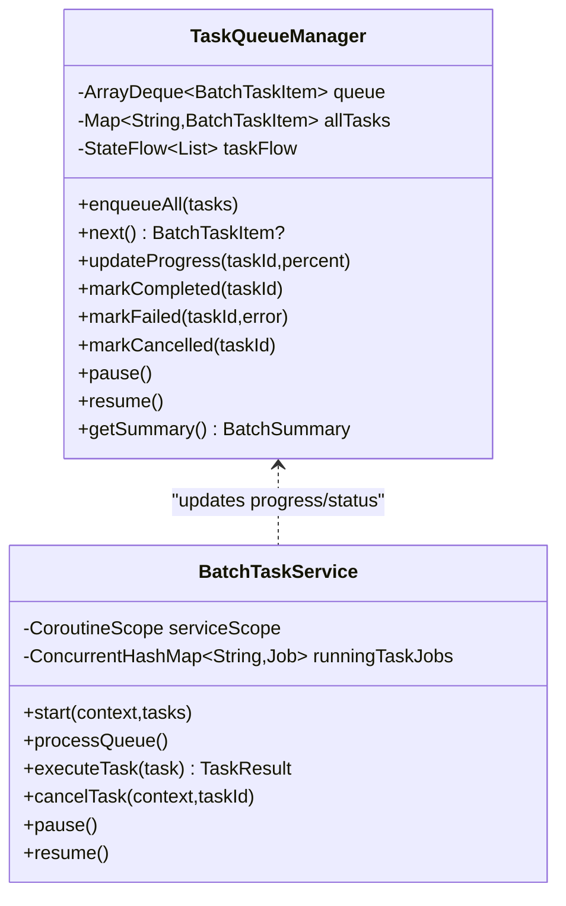
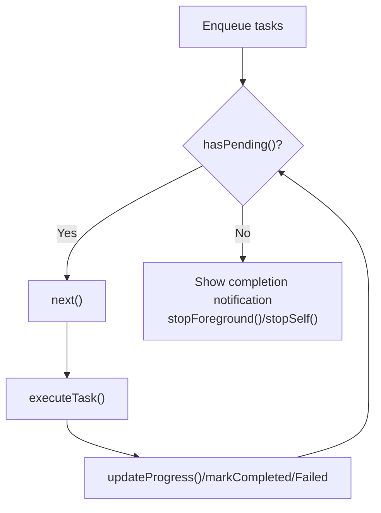
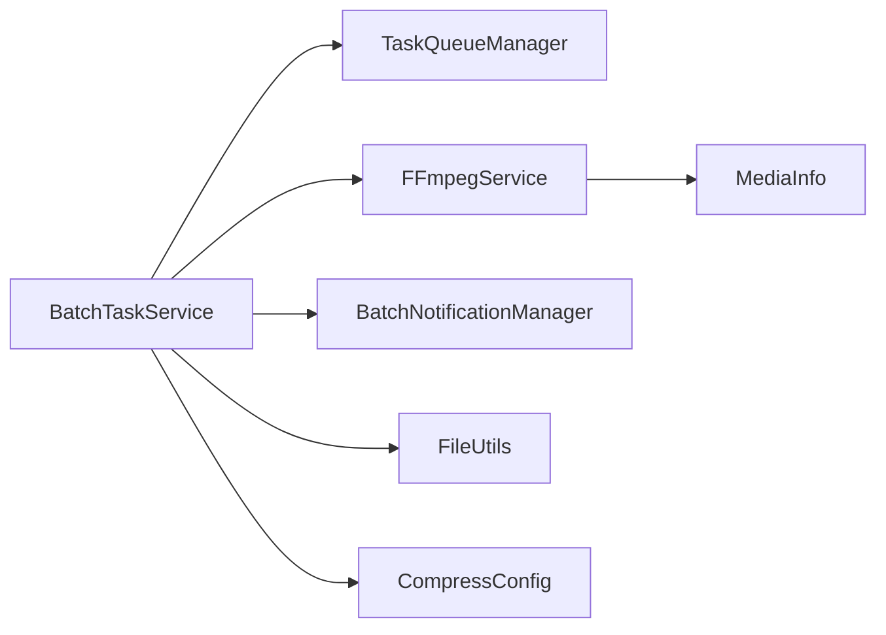

# Performance Optimization

<cite>
**Referenced Files in This Document**
- [TaskQueueManager.kt](file://app/src/main/java/com/pisces312/streamclip/service/TaskQueueManager.kt)
- [BatchTaskService.kt](file://app/src/main/java/com/pisces312/streamclip/service/BatchTaskService.kt)
- [FFmpegService.kt](file://app/src/main/java/com/pisces312/streamclip/service/FFmpegService.kt)
- [CompressConfig.kt](file://app/src/main/java/com/pisces312/streamclip/model/CompressConfig.kt)
- [MediaInfo.kt](file://app/src/main/java/com/pisces312/streamclip/model/MediaInfo.kt)
- [BatchTaskItem.kt](file://app/src/main/java/com/pisces312/streamclip/model/BatchTaskItem.kt)
- [FileUtils.kt](file://app/src/main/java/com/pisces312/streamclip/util/FileUtils.kt)
- [BatchNotificationManager.kt](file://app/src/main/java/com/pisces312/streamclip/service/BatchNotificationManager.kt)
- [CrashHandler.kt](file://app/src/main/java/com/pisces312/streamclip/util/CrashHandler.kt)
- [LogCollector.kt](file://app/src/main/java/com/pisces312/streamclip/util/LogCollector.kt)
- [batch-queue-design.md](file://docs/batch-queue-design.md)
</cite>

## Table of Contents
1. [Introduction](#introduction)
2. [Project Structure](#project-structure)
3. [Core Components](#core-components)
4. [Architecture Overview](#architecture-overview)
5. [Detailed Component Analysis](#detailed-component-analysis)
6. [Dependency Analysis](#dependency-analysis)
7. [Performance Considerations](#performance-considerations)
8. [Troubleshooting Guide](#troubleshooting-guide)
9. [Conclusion](#conclusion)
10. [Appendices](#appendices)

## Introduction
This document provides a comprehensive performance optimization guide for StreamClip, focusing on hardware acceleration techniques, memory management strategies, and background processing patterns. It documents how FFmpeg’s hardware encoders/decoders are selected and configured, outlines memory management approaches for large video files, details background processing using TaskQueueManager and BatchTaskService, and covers batch queue design principles for efficient task processing. It also includes file I/O optimization techniques, profiling methods, and scalability considerations for handling multiple simultaneous video processing tasks.

## Project Structure
The performance-critical subsystems are organized around:
- Background processing orchestration via a foreground service and a queue manager
- FFmpeg integration for media operations with progress callbacks
- Model and configuration classes that define encoding parameters
- File I/O utilities for path resolution, caching, and metadata preservation
- Logging and crash handling for diagnostics and stability

**Diagram sources**
- [BatchTaskService.kt:118-165](file://app/src/main/java/com/pisces312/streamclip/service/BatchTaskService.kt#L118-L165)
- [TaskQueueManager.kt:10-145](file://app/src/main/java/com/pisces312/streamclip/service/TaskQueueManager.kt#L10-L145)
- [FFmpegService.kt:152-241](file://app/src/main/java/com/pisces312/streamclip/service/FFmpegService.kt#L152-L241)
- [CompressConfig.kt:21-114](file://app/src/main/java/com/pisces312/streamclip/model/CompressConfig.kt#L21-L114)
- [MediaInfo.kt:5-165](file://app/src/main/java/com/pisces312/streamclip/model/MediaInfo.kt#L5-L165)
- [FileUtils.kt:268-331](file://app/src/main/java/com/pisces312/streamclip/util/FileUtils.kt#L268-L331)
- [BatchNotificationManager.kt:40-89](file://app/src/main/java/com/pisces312/streamclip/service/BatchNotificationManager.kt#L40-L89)

**Section sources**
- [batch-queue-design.md:25-74](file://docs/batch-queue-design.md#L25-L74)

## Core Components
- TaskQueueManager: In-memory queue with synchronized updates, progress tracking, and state transitions for batch tasks.
- BatchTaskService: Foreground service orchestrating task execution, progress notifications, and lifecycle control.
- FFmpegService: Encapsulates FFmpegKit execution with async callbacks, progress estimation, and cancellation support.
- CompressConfig: Defines encoder selection, bitrate/crf presets, scaling, and audio settings for compression.
- MediaInfo: Parses ffprobe output to inform encoding decisions and metadata handling.
- FileUtils: Path resolution, caching, scanning, and metadata time preservation.
- BatchNotificationManager: Foreground notification updates for progress and actions.
- CrashHandler and LogCollector: Global crash capture and persistent logging for diagnostics.

**Section sources**
- [TaskQueueManager.kt:10-145](file://app/src/main/java/com/pisces312/streamclip/service/TaskQueueManager.kt#L10-L145)
- [BatchTaskService.kt:26-301](file://app/src/main/java/com/pisces312/streamclip/service/BatchTaskService.kt#L26-L301)
- [FFmpegService.kt:19-420](file://app/src/main/java/com/pisces312/streamclip/service/FFmpegService.kt#L19-L420)
- [CompressConfig.kt:3-209](file://app/src/main/java/com/pisces312/streamclip/model/CompressConfig.kt#L3-L209)
- [MediaInfo.kt:5-165](file://app/src/main/java/com/pisces312/streamclip/model/MediaInfo.kt#L5-L165)
- [FileUtils.kt:17-362](file://app/src/main/java/com/pisces312/streamclip/util/FileUtils.kt#L17-L362)
- [BatchNotificationManager.kt:17-137](file://app/src/main/java/com/pisces312/streamclip/service/BatchNotificationManager.kt#L17-L137)
- [CrashHandler.kt:10-29](file://app/src/main/java/com/pisces312/streamclip/util/CrashHandler.kt#L10-L29)
- [LogCollector.kt:15-202](file://app/src/main/java/com/pisces312/streamclip/util/LogCollector.kt#L15-L202)

## Architecture Overview
The system uses a foreground service to process a queue of tasks. Each task builds an FFmpeg command based on CompressConfig and MediaInfo, executes asynchronously, and reports progress. Notifications keep users informed, while FileUtils ensures output visibility and metadata fidelity.

**Diagram sources**
- [BatchTaskService.kt:118-165](file://app/src/main/java/com/pisces312/streamclip/service/BatchTaskService.kt#L118-L165)
- [TaskQueueManager.kt:32-53](file://app/src/main/java/com/pisces312/streamclip/service/TaskQueueManager.kt#L32-L53)
- [FFmpegService.kt:152-241](file://app/src/main/java/com/pisces312/streamclip/service/FFmpegService.kt#L152-L241)
- [BatchNotificationManager.kt:57-89](file://app/src/main/java/com/pisces312/streamclip/service/BatchNotificationManager.kt#L57-L89)

## Detailed Component Analysis

### Hardware Acceleration with FFmpeg Hardware Encoders
- Encoder selection:
  - Hardware encoders: h264_mediacodec and hevc_mediacodec are supported for accelerated encoding.
  - Software encoders: libx264/libx265 with configurable presets and CRF for quality control.
- HDR handling:
  - Container-level color metadata is written for Android compatibility when using hardware encoders.
  - 10-bit pixel formats and transfer characteristics are considered for HDR workflows.
- Command construction:
  - Compression commands are built dynamically from CompressConfig, including scaling, frame rate, and audio settings.
  - MOV container is used to preserve GPS metadata atoms for Android retrieval.

**Diagram sources**
- [CompressConfig.kt:21-114](file://app/src/main/java/com/pisces312/streamclip/model/CompressConfig.kt#L21-L114)
- [FFmpegService.kt:355-393](file://app/src/main/java/com/pisces312/streamclip/service/FFmpegService.kt#L355-L393)
- [MediaInfo.kt:86-99](file://app/src/main/java/com/pisces312/streamclip/model/MediaInfo.kt#L86-L99)

**Section sources**
- [CompressConfig.kt:3-209](file://app/src/main/java/com/pisces312/streamclip/model/CompressConfig.kt#L3-L209)
- [FFmpegService.kt:355-393](file://app/src/main/java/com/pisces312/streamclip/service/FFmpegService.kt#L355-L393)
- [MediaInfo.kt:5-165](file://app/src/main/java/com/pisces312/streamclip/model/MediaInfo.kt#L5-L165)

### Memory Management Strategies for Large Video Files
- Streaming and caching:
  - Direct read vs cache copy is determined per URI; when direct read is not possible, content is copied to cache for processing.
  - Cache cleanup is available to reclaim space after processing.
- Output scanning and metadata:
  - After successful processing, files are scanned into the media store for gallery visibility.
  - Creation/modification times and shooting dates are preserved to maintain provenance.
- Buffer optimization:
  - Progress callbacks compute remaining time estimates using processed time and total duration, enabling adaptive UI updates without heavy computation.

**Diagram sources**
- [FileUtils.kt:30-118](file://app/src/main/java/com/pisces312/streamclip/util/FileUtils.kt#L30-L118)
- [FileUtils.kt:170-187](file://app/src/main/java/com/pisces312/streamclip/util/FileUtils.kt#L170-L187)
- [FileUtils.kt:268-331](file://app/src/main/java/com/pisces312/streamclip/util/FileUtils.kt#L268-L331)

**Section sources**
- [FileUtils.kt:17-362](file://app/src/main/java/com/pisces312/streamclip/util/FileUtils.kt#L17-L362)
- [BatchTaskService.kt:212-232](file://app/src/main/java/com/pisces312/streamclip/service/BatchTaskService.kt#L212-L232)

### Background Processing Patterns Using TaskQueueManager and BatchTaskService
- Thread pool and dispatchers:
  - Tasks run on Dispatchers.IO within a SupervisorJob-scoped CoroutineScope to isolate failures and enable cancellation.
- Queue management:
  - FIFO queue with synchronized operations; pause/resume toggles processing without losing state.
  - Progress updates and state transitions are reflected via a StateFlow for reactive UI updates.
- Retry and cancellation:
  - Execution supports retry with backoff; cancellation cancels the underlying FFmpeg session and cleans up partial outputs.
- Foreground service:
  - Ensures long-running operations continue under OS restrictions; notifications reflect progress and allow user control.

**Diagram sources**
- [TaskQueueManager.kt:10-145](file://app/src/main/java/com/pisces312/streamclip/service/TaskQueueManager.kt#L10-L145)
- [BatchTaskService.kt:66-165](file://app/src/main/java/com/pisces312/streamclip/service/BatchTaskService.kt#L66-L165)

**Section sources**
- [TaskQueueManager.kt:10-145](file://app/src/main/java/com/pisces312/streamclip/service/TaskQueueManager.kt#L10-L145)
- [BatchTaskService.kt:66-165](file://app/src/main/java/com/pisces312/streamclip/service/BatchTaskService.kt#L66-L165)

### Batch Queue Design Principles and Parallel Execution
- Sequential execution model:
  - The current design processes tasks sequentially in a foreground service, ensuring predictable resource usage and avoiding contention.
- Queue optimization:
  - Synchronized operations prevent race conditions; progress updates are emitted efficiently via StateFlow.
- Load balancing:
  - No intra-task parallelism is implemented; the focus is on throughput via efficient single-threaded processing and minimal overhead.
- Scalability:
  - To scale beyond a single executor, consider partitioning tasks by device capabilities or introducing worker pools per task type, while preserving fairness and preventing resource starvation.

**Diagram sources**
- [BatchTaskService.kt:123-165](file://app/src/main/java/com/pisces312/streamclip/service/BatchTaskService.kt#L123-L165)
- [TaskQueueManager.kt:32-104](file://app/src/main/java/com/pisces312/streamclip/service/TaskQueueManager.kt#L32-L104)

**Section sources**
- [batch-queue-design.md:25-74](file://docs/batch-queue-design.md#L25-L74)
- [BatchTaskService.kt:123-165](file://app/src/main/java/com/pisces312/streamclip/service/BatchTaskService.kt#L123-L165)
- [TaskQueueManager.kt:19-104](file://app/src/main/java/com/pisces312/streamclip/service/TaskQueueManager.kt#L19-L104)

### File I/O Optimization Techniques
- Path resolution:
  - Prefer direct reads when available; otherwise copy to cache to ensure reliable processing.
- Output scanning:
  - Trigger MediaScanner to publish outputs immediately for gallery/file manager visibility.
- Metadata preservation:
  - Apply original creation/modification times and shooting date metadata to outputs.
- Disk space management:
  - Provide cache cleanup APIs and monitor output sizes for progress reporting.

**Section sources**
- [FileUtils.kt:30-118](file://app/src/main/java/com/pisces312/streamclip/util/FileUtils.kt#L30-L118)
- [FileUtils.kt:268-331](file://app/src/main/java/com/pisces312/streamclip/util/FileUtils.kt#L268-L331)
- [BatchTaskService.kt:212-232](file://app/src/main/java/com/pisces312/streamclip/service/BatchTaskService.kt#L212-L232)

### Performance Profiling Methods
- CPU usage analysis:
  - Use Android Studio CPU profiler to identify hotspots in UI rendering, coroutine dispatchers, and FFmpeg execution.
- Memory profiling:
  - Monitor heap allocations during transcoding; watch for large intermediate buffers and excessive copying.
- Tracing:
  - Record method traces for FFmpeg command execution and progress callbacks to detect latency spikes.
- Logging and crash diagnostics:
  - Capture logs and crashes with LogCollector and CrashHandler to correlate performance issues with exceptions.

**Section sources**
- [LogCollector.kt:15-202](file://app/src/main/java/com/pisces312/streamclip/util/LogCollector.kt#L15-L202)
- [CrashHandler.kt:10-29](file://app/src/main/java/com/pisces312/streamclip/util/CrashHandler.kt#L10-L29)

## Dependency Analysis
- FFmpegService depends on FFmpegKit for asynchronous execution and statistics callbacks.
- BatchTaskService depends on TaskQueueManager for state and progress, and on FileUtils/Notifications for post-processing and UX.
- CompressConfig drives FFmpegService command generation and influences performance via encoder choice and rate control parameters.
- MediaInfo informs quality and format decisions, particularly for HDR and scaling.

**Diagram sources**
- [BatchTaskService.kt:181-240](file://app/src/main/java/com/pisces312/streamclip/service/BatchTaskService.kt#L181-L240)
- [FFmpegService.kt:56-147](file://app/src/main/java/com/pisces312/streamclip/service/FFmpegService.kt#L56-L147)
- [CompressConfig.kt:21-114](file://app/src/main/java/com/pisces312/streamclip/model/CompressConfig.kt#L21-L114)
- [MediaInfo.kt:5-165](file://app/src/main/java/com/pisces312/streamclip/model/MediaInfo.kt#L5-L165)

**Section sources**
- [BatchTaskService.kt:181-240](file://app/src/main/java/com/pisces312/streamclip/service/BatchTaskService.kt#L181-L240)
- [FFmpegService.kt:56-147](file://app/src/main/java/com/pisces312/streamclip/service/FFmpegService.kt#L56-L147)
- [CompressConfig.kt:21-114](file://app/src/main/java/com/pisces312/streamclip/model/CompressConfig.kt#L21-L114)
- [MediaInfo.kt:5-165](file://app/src/main/java/com/pisces312/streamclip/model/MediaInfo.kt#L5-L165)

## Performance Considerations
- Hardware vs software encoding:
  - Hardware encoders reduce CPU usage and power consumption but may limit HDR and advanced tuning; software encoders offer finer control over quality and HDR workflows.
- Quality trade-offs:
  - CRF vs bitrate: CRF targets constant quality; bitrate sets target data rate. Choose based on storage constraints and quality goals.
- Scaling and frame rate:
  - Reduce resolution and frame rate to decrease processing time and output size.
- Concurrency and fairness:
  - Current design runs tasks sequentially; introduce worker pools per task type only if device capabilities warrant it and ensure fair scheduling.
- Resource contention:
  - Avoid simultaneous heavy operations; stagger tasks or throttle based on device thermal and battery state.
- System resource monitoring:
  - Track CPU frequency, thermal throttling, and memory pressure during long sessions.

[No sources needed since this section provides general guidance]

## Troubleshooting Guide
- FFmpeg errors:
  - Inspect return codes and captured output; use LogCollector to persist logs for diagnosis.
- Cancellation and retries:
  - Verify cancellation triggers session termination and cleanup of partial outputs.
- Memory leaks:
  - Ensure coroutine scopes are cancelled on service destruction and that large intermediate buffers are released promptly.
- Stability:
  - Install CrashHandler to capture unhandled exceptions and save crash logs for later analysis.

**Section sources**
- [FFmpegService.kt:24-31](file://app/src/main/java/com/pisces312/streamclip/service/FFmpegService.kt#L24-L31)
- [BatchTaskService.kt:265-279](file://app/src/main/java/com/pisces312/streamclip/service/BatchTaskService.kt#L265-L279)
- [CrashHandler.kt:10-29](file://app/src/main/java/com/pisces312/streamclip/util/CrashHandler.kt#L10-L29)
- [LogCollector.kt:150-168](file://app/src/main/java/com/pisces312/streamclip/util/LogCollector.kt#L150-L168)

## Conclusion
StreamClip’s performance hinges on judicious use of hardware encoders, efficient memory management, and robust background processing. The current sequential queue design balances simplicity and reliability; future enhancements can explore worker pools and dynamic scheduling while preserving progress tracking and user feedback. Proper profiling, logging, and crash handling ensure sustainable performance improvements across diverse devices.

[No sources needed since this section summarizes without analyzing specific files]

## Appendices
- Encoder selection criteria:
  - Prefer hardware encoders for power efficiency; switch to software encoders for HDR and advanced tuning.
- Performance benchmarks:
  - Measure encode time, CPU utilization, and battery drain for different encoders and presets; compare output quality visually and via PSNR/SSIM.
- Quality trade-offs:
  - CRF provides consistent quality; bitrate controls data rate. HDR requires proper container metadata and compatible players.

[No sources needed since this section provides general guidance]