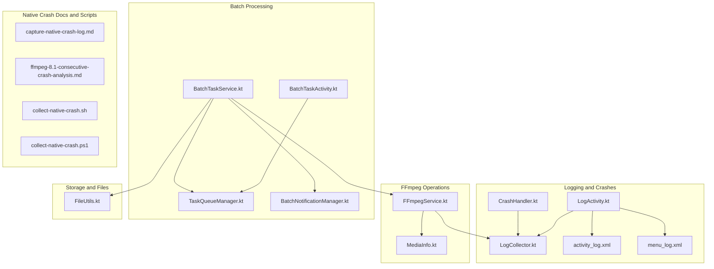
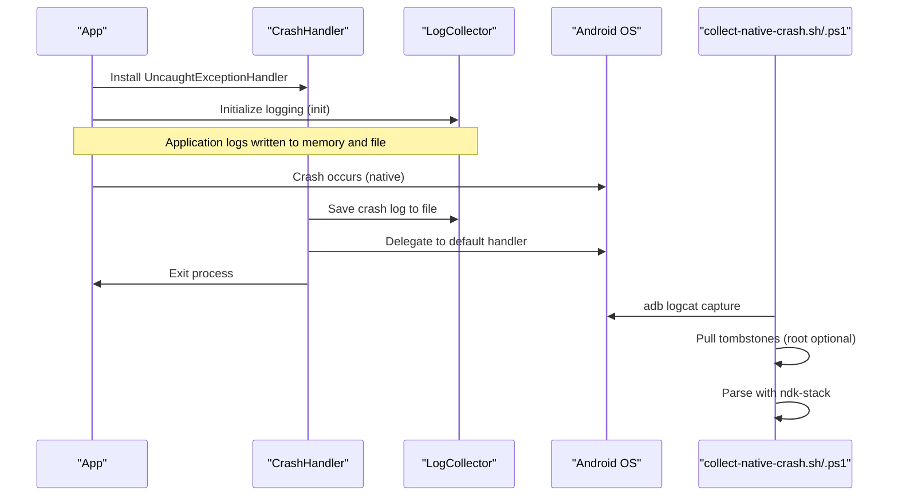
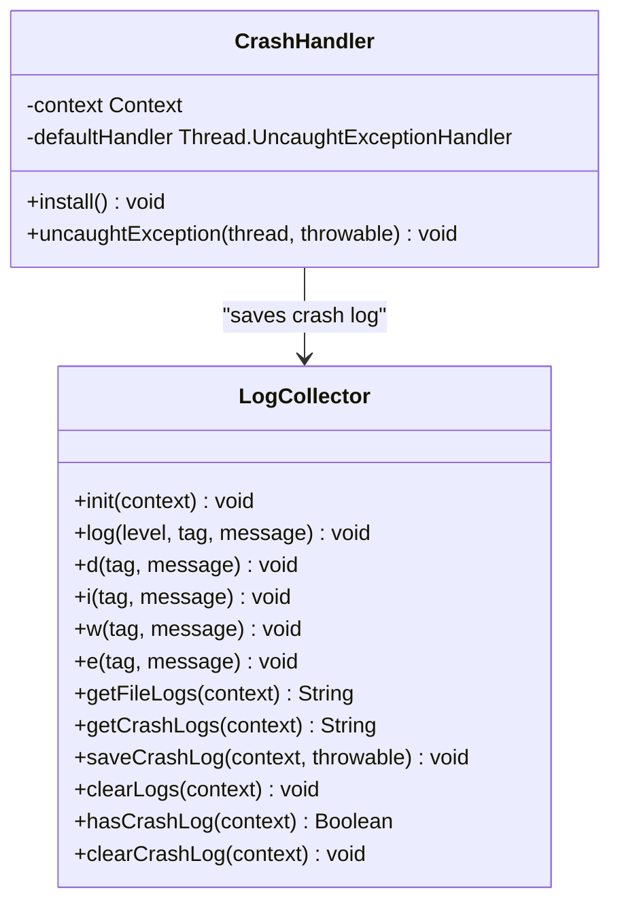
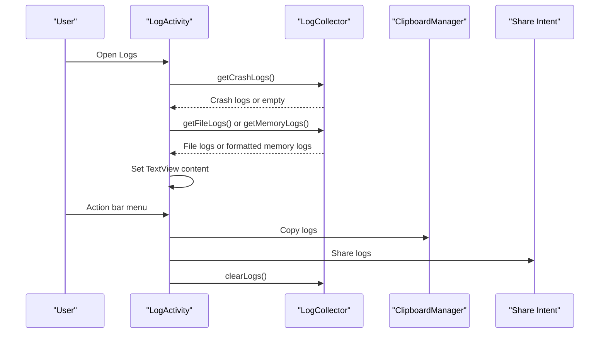
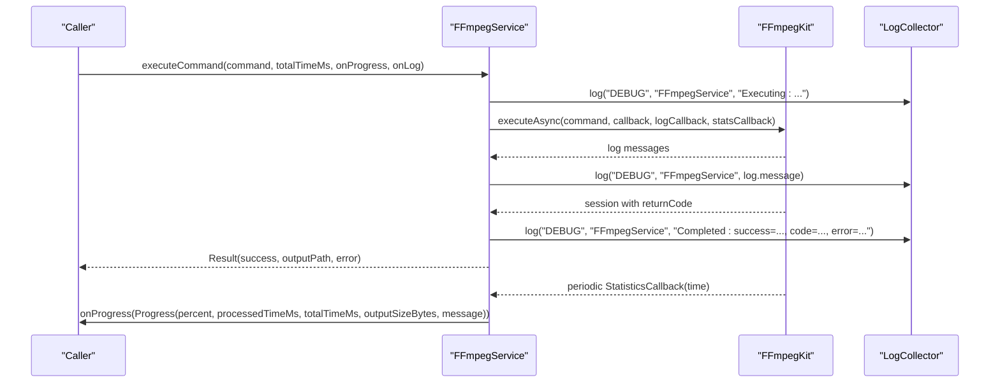
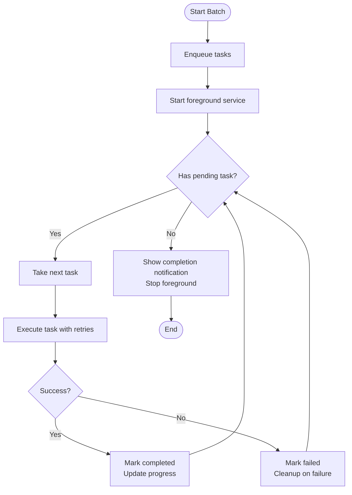
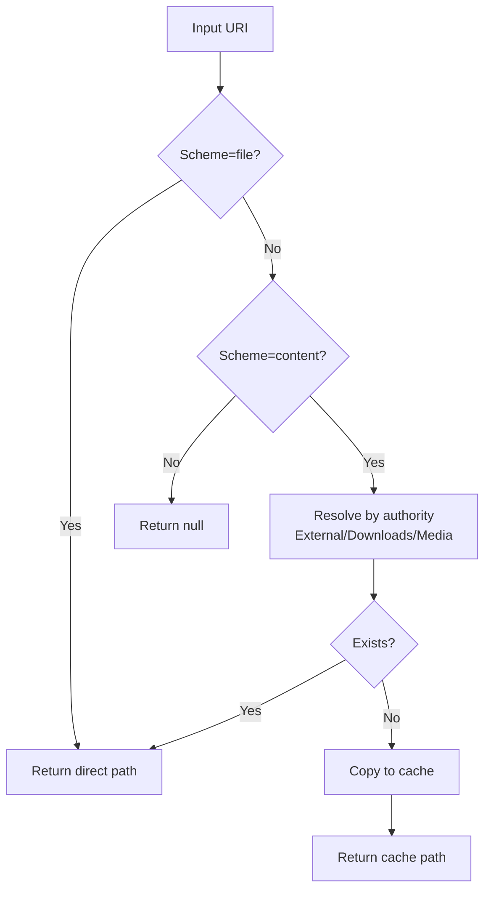
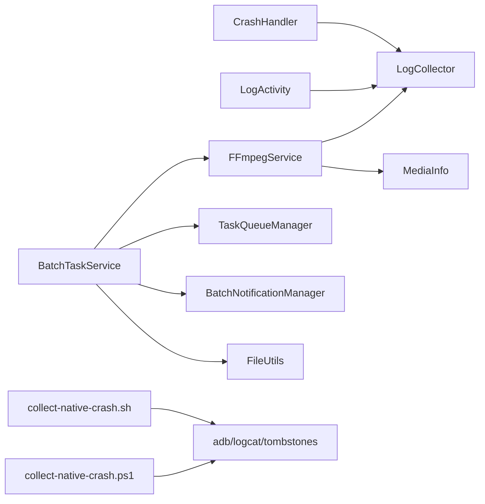
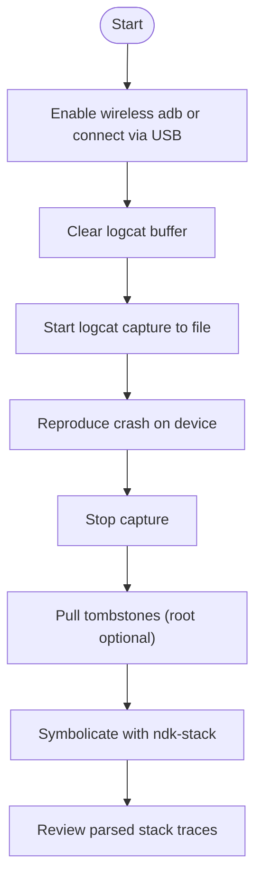

# Troubleshooting and Debugging

<cite>
**Referenced Files in This Document**
- [CrashHandler.kt](file://app/src/main/java/com/pisces312/streamclip/util/CrashHandler.kt)
- [LogCollector.kt](file://app/src/main/java/com/pisces312/streamclip/util/LogCollector.kt)
- [LogActivity.kt](file://app/src/main/java/com/pisces312/streamclip/LogActivity.kt)
- [activity_log.xml](file://app/src/main/res/layout/activity_log.xml)
- [menu_log.xml](file://app/src/main/res/menu/menu_log.xml)
- [FFmpegService.kt](file://app/src/main/java/com/pisces312/streamclip/service/FFmpegService.kt)
- [BatchTaskService.kt](file://app/src/main/java/com/pisces312/streamclip/service/BatchTaskService.kt)
- [TaskQueueManager.kt](file://app/src/main/java/com/pisces312/streamclip/service/TaskQueueManager.kt)
- [BatchNotificationManager.kt](file://app/src/main/java/com/pisces312/streamclip/service/BatchNotificationManager.kt)
- [FileUtils.kt](file://app/src/main/java/com/pisces312/streamclip/util/FileUtils.kt)
- [capture-native-crash-log.md](file://docs/capture-native-crash-log.md)
- [ffmpeg-8.1-consecutive-crash-analysis.md](file://docs/ffmpeg-8.1-consecutive-crash-analysis.md)
- [collect-native-crash.sh](file://collect-native-crash.sh)
- [collect-native-crash.ps1](file://collect-native-crash.ps1)
- [MediaInfo.kt](file://app/src/main/java/com/pisces312/streamclip/model/MediaInfo.kt)
- [BatchTaskActivity.kt](file://app/src/main/java/com/pisces312/streamclip/ui/BatchTaskActivity.kt)
</cite>

## Table of Contents
1. [Introduction](#introduction)
2. [Project Structure](#project-structure)
3. [Core Components](#core-components)
4. [Architecture Overview](#architecture-overview)
5. [Detailed Component Analysis](#detailed-component-analysis)
6. [Dependency Analysis](#dependency-analysis)
7. [Performance Considerations](#performance-considerations)
8. [Troubleshooting Guide](#troubleshooting-guide)
9. [Conclusion](#conclusion)
10. [Appendices](#appendices)

## Introduction
This document provides a comprehensive troubleshooting and debugging guide for StreamClip. It focuses on:
- Capturing and analyzing native crashes using built-in crash handlers and external native crash collection scripts
- Using LogActivity for real-time log viewing, filtering, copying, sharing, and clearing logs
- Investigating crashes via stack traces, memory dumps, and system state inspection
- Resolving common issues: video processing failures, memory leaks, permission/storage access problems
- Debugging FFmpeg operations: command logging, progress monitoring, and interpreting error codes
- Performance debugging: memory profiling and CPU usage analysis
- Network-related issues for cloud storage integration and file transfer
- Step-by-step diagnostics for complex scenarios, escalation paths, and preventive measures

## Project Structure
Key debugging and logging components are organized by responsibility:
- Logging and crash handling: CrashHandler, LogCollector, LogActivity
- FFmpeg operations: FFmpegService
- Batch processing: BatchTaskService, TaskQueueManager, BatchNotificationManager
- File handling and storage: FileUtils
- Documentation and automation: native crash capture docs and scripts

**Diagram sources**
- [CrashHandler.kt:1-29](file://app/src/main/java/com/pisces312/streamclip/util/CrashHandler.kt#L1-L29)
- [LogCollector.kt:1-202](file://app/src/main/java/com/pisces312/streamclip/util/LogCollector.kt#L1-L202)
- [LogActivity.kt:1-126](file://app/src/main/java/com/pisces312/streamclip/LogActivity.kt#L1-L126)
- [activity_log.xml:1-35](file://app/src/main/res/layout/activity_log.xml#L1-L35)
- [menu_log.xml:1-20](file://app/src/main/res/menu/menu_log.xml#L1-L20)
- [FFmpegService.kt:1-420](file://app/src/main/java/com/pisces312/streamclip/service/FFmpegService.kt#L1-L420)
- [MediaInfo.kt:1-165](file://app/src/main/java/com/pisces312/streamclip/model/MediaInfo.kt#L1-L165)
- [BatchTaskService.kt:1-301](file://app/src/main/java/com/pisces312/streamclip/service/BatchTaskService.kt#L1-L301)
- [TaskQueueManager.kt:1-146](file://app/src/main/java/com/pisces312/streamclip/service/TaskQueueManager.kt#L1-L146)
- [BatchNotificationManager.kt:1-137](file://app/src/main/java/com/pisces312/streamclip/service/BatchNotificationManager.kt#L1-L137)
- [BatchTaskActivity.kt:1-89](file://app/src/main/java/com/pisces312/streamclip/ui/BatchTaskActivity.kt#L1-L89)
- [FileUtils.kt:1-362](file://app/src/main/java/com/pisces312/streamclip/util/FileUtils.kt#L1-L362)
- [capture-native-crash-log.md:1-161](file://docs/capture-native-crash-log.md#L1-L161)
- [ffmpeg-8.1-consecutive-crash-analysis.md:1-128](file://docs/ffmpeg-8.1-consecutive-crash-analysis.md#L1-L128)
- [collect-native-crash.sh:1-152](file://collect-native-crash.sh#L1-L152)
- [collect-native-crash.ps1:1-152](file://collect-native-crash.ps1#L1-L152)

**Section sources**
- [CrashHandler.kt:1-29](file://app/src/main/java/com/pisces312/streamclip/util/CrashHandler.kt#L1-L29)
- [LogCollector.kt:1-202](file://app/src/main/java/com/pisces312/streamclip/util/LogCollector.kt#L1-L202)
- [LogActivity.kt:1-126](file://app/src/main/java/com/pisces312/streamclip/LogActivity.kt#L1-L126)
- [FFmpegService.kt:1-420](file://app/src/main/java/com/pisces312/streamclip/service/FFmpegService.kt#L1-L420)
- [BatchTaskService.kt:1-301](file://app/src/main/java/com/pisces312/streamclip/service/BatchTaskService.kt#L1-L301)
- [TaskQueueManager.kt:1-146](file://app/src/main/java/com/pisces312/streamclip/service/TaskQueueManager.kt#L1-L146)
- [BatchNotificationManager.kt:1-137](file://app/src/main/java/com/pisces312/streamclip/service/BatchNotificationManager.kt#L1-L137)
- [FileUtils.kt:1-362](file://app/src/main/java/com/pisces312/streamclip/util/FileUtils.kt#L1-L362)
- [capture-native-crash-log.md:1-161](file://docs/capture-native-crash-log.md#L1-L161)
- [ffmpeg-8.1-consecutive-crash-analysis.md:1-128](file://docs/ffmpeg-8.1-consecutive-crash-analysis.md#L1-L128)
- [collect-native-crash.sh:1-152](file://collect-native-crash.sh#L1-L152)
- [collect-native-crash.ps1:1-152](file://collect-native-crash.ps1#L1-L152)

## Core Components
- CrashHandler: Installs a global uncaught exception handler to capture native crashes, persist crash logs, and exit gracefully.
- LogCollector: Dual-trace logging (in-memory ring buffer and persistent file) with automatic trimming and system log forwarding.
- LogActivity: Real-time log viewer with copy/share/clear actions and auto-scroll to bottom.
- FFmpegService: Orchestrates FFmpeg operations with progress callbacks, statistics-based ETA estimation, and structured result/error reporting.
- BatchTaskService: Foreground service managing batch tasks with retries, per-task cancellation, and notifications.
- TaskQueueManager: Centralized state for batch tasks with progress updates and status transitions.
- BatchNotificationManager: Foreground notification management for batch processing.
- FileUtils: Robust file path resolution, caching, scanning, and time-stamp preservation for output files.

**Section sources**
- [CrashHandler.kt:10-27](file://app/src/main/java/com/pisces312/streamclip/util/CrashHandler.kt#L10-L27)
- [LogCollector.kt:15-54](file://app/src/main/java/com/pisces312/streamclip/util/LogCollector.kt#L15-L54)
- [LogActivity.kt:18-67](file://app/src/main/java/com/pisces312/streamclip/LogActivity.kt#L18-L67)
- [FFmpegService.kt:19-46](file://app/src/main/java/com/pisces312/streamclip/service/FFmpegService.kt#L19-L46)
- [BatchTaskService.kt:26-64](file://app/src/main/java/com/pisces312/streamclip/service/BatchTaskService.kt#L26-L64)
- [TaskQueueManager.kt:10-21](file://app/src/main/java/com/pisces312/streamclip/service/TaskQueueManager.kt#L10-L21)
- [BatchNotificationManager.kt:17-55](file://app/src/main/java/com/pisces312/streamclip/service/BatchNotificationManager.kt#L17-L55)
- [FileUtils.kt:17-31](file://app/src/main/java/com/pisces312/streamclip/util/FileUtils.kt#L17-L31)
- [MediaInfo.kt:5-16](file://app/src/main/java/com/pisces312/streamclip/model/MediaInfo.kt#L5-L16)

## Architecture Overview
The debugging architecture integrates application-level logging with native crash capture and automated collection scripts.

**Diagram sources**
- [CrashHandler.kt:14-27](file://app/src/main/java/com/pisces312/streamclip/util/CrashHandler.kt#L14-L27)
- [LogCollector.kt:43-54](file://app/src/main/java/com/pisces312/streamclip/util/LogCollector.kt#L43-L54)
- [collect-native-crash.sh:49-64](file://collect-native-crash.sh#L49-L64)
- [collect-native-crash.ps1:115-133](file://collect-native-crash.ps1#L115-L133)

## Detailed Component Analysis

### Crash Handler and Log Collection
- CrashHandler installs a global uncaught exception handler and delegates to the default handler to preserve system dialogs. It saves crash logs via LogCollector and exits the process.
- LogCollector maintains a bounded in-memory ring buffer and a rotating log file under the app’s external files directory. It forwards logs to Android’s system log and supports crash log persistence and retrieval.

**Diagram sources**
- [CrashHandler.kt:10-27](file://app/src/main/java/com/pisces312/streamclip/util/CrashHandler.kt#L10-L27)
- [LogCollector.kt:15-54](file://app/src/main/java/com/pisces312/streamclip/util/LogCollector.kt#L15-L54)
- [LogCollector.kt:134-168](file://app/src/main/java/com/pisces312/streamclip/util/LogCollector.kt#L134-L168)

**Section sources**
- [CrashHandler.kt:10-27](file://app/src/main/java/com/pisces312/streamclip/util/CrashHandler.kt#L10-L27)
- [LogCollector.kt:43-54](file://app/src/main/java/com/pisces312/streamclip/util/LogCollector.kt#L43-L54)
- [LogCollector.kt:134-168](file://app/src/main/java/com/pisces312/streamclip/util/LogCollector.kt#L134-L168)

### LogActivity: Real-Time Debugging UI
- Loads crash logs followed by file logs; falls back to memory logs if file logs are unavailable.
- Provides actions to copy logs to clipboard, share logs via system chooser, and clear logs.
- Auto-scrolls to bottom after loading.

**Diagram sources**
- [LogActivity.kt:39-67](file://app/src/main/java/com/pisces312/streamclip/LogActivity.kt#L39-L67)
- [LogActivity.kt:96-124](file://app/src/main/java/com/pisces312/streamclip/LogActivity.kt#L96-L124)
- [LogCollector.kt:123-130](file://app/src/main/java/com/pisces312/streamclip/util/LogCollector.kt#L123-L130)
- [LogCollector.kt:173-186](file://app/src/main/java/com/pisces312/streamclip/util/LogCollector.kt#L173-L186)
- [activity_log.xml:6-22](file://app/src/main/res/layout/activity_log.xml#L6-L22)
- [menu_log.xml:5-18](file://app/src/main/res/menu/menu_log.xml#L5-L18)

**Section sources**
- [LogActivity.kt:18-67](file://app/src/main/java/com/pisces312/streamclip/LogActivity.kt#L18-L67)
- [LogActivity.kt:96-124](file://app/src/main/java/com/pisces312/streamclip/LogActivity.kt#L96-L124)
- [activity_log.xml:6-22](file://app/src/main/res/layout/activity_log.xml#L6-L22)
- [menu_log.xml:5-18](file://app/src/main/res/menu/menu_log.xml#L5-L18)

### FFmpeg Operations: Command Logging, Progress, and Error Interpretation
- FFmpegService executes commands asynchronously, logs commands and outputs, and exposes progress derived from statistics (processed time, estimated remaining time).
- It parses ffprobe JSON output into MediaInfo for downstream operations.
- It cancels sessions and supports cancellation-aware coroutines.

**Diagram sources**
- [FFmpegService.kt:152-241](file://app/src/main/java/com/pisces312/streamclip/service/FFmpegService.kt#L152-L241)
- [FFmpegService.kt:179-214](file://app/src/main/java/com/pisces312/streamclip/service/FFmpegService.kt#L179-L214)
- [FFmpegService.kt:56-147](file://app/src/main/java/com/pisces312/streamclip/service/FFmpegService.kt#L56-L147)
- [MediaInfo.kt:5-16](file://app/src/main/java/com/pisces312/streamclip/model/MediaInfo.kt#L5-L16)

**Section sources**
- [FFmpegService.kt:152-241](file://app/src/main/java/com/pisces312/streamclip/service/FFmpegService.kt#L152-L241)
- [FFmpegService.kt:56-147](file://app/src/main/java/com/pisces312/streamclip/service/FFmpegService.kt#L56-L147)
- [MediaInfo.kt:5-16](file://app/src/main/java/com/pisces312/streamclip/model/MediaInfo.kt#L5-L16)

### Batch Processing: Queue, Notifications, and Retries
- BatchTaskService runs in the foreground, manages a queue, and supports pause/resume/cancel/retry.
- TaskQueueManager centralizes task state and progress updates.
- BatchNotificationManager provides ongoing notifications with actions.

**Diagram sources**
- [BatchTaskService.kt:123-165](file://app/src/main/java/com/pisces312/streamclip/service/BatchTaskService.kt#L123-L165)
- [BatchTaskService.kt:181-240](file://app/src/main/java/com/pisces312/streamclip/service/BatchTaskService.kt#L181-L240)
- [TaskQueueManager.kt:24-53](file://app/src/main/java/com/pisces312/streamclip/service/TaskQueueManager.kt#L24-L53)
- [BatchNotificationManager.kt:57-89](file://app/src/main/java/com/pisces312/streamclip/service/BatchNotificationManager.kt#L57-L89)

**Section sources**
- [BatchTaskService.kt:123-165](file://app/src/main/java/com/pisces312/streamclip/service/BatchTaskService.kt#L123-L165)
- [TaskQueueManager.kt:24-53](file://app/src/main/java/com/pisces312/streamclip/service/TaskQueueManager.kt#L24-L53)
- [BatchNotificationManager.kt:57-89](file://app/src/main/java/com/pisces312/streamclip/service/BatchNotificationManager.kt#L57-L89)

### Storage Access and File Handling
- FileUtils resolves URIs to real paths, caches content when direct reads are not possible, and preserves timestamps and scans files into the media store.
- BatchTaskService cleans up partial outputs on failure.

**Diagram sources**
- [FileUtils.kt:30-118](file://app/src/main/java/com/pisces312/streamclip/util/FileUtils.kt#L30-L118)
- [BatchTaskService.kt:257-263](file://app/src/main/java/com/pisces312/streamclip/service/BatchTaskService.kt#L257-L263)

**Section sources**
- [FileUtils.kt:30-118](file://app/src/main/java/com/pisces312/streamclip/util/FileUtils.kt#L30-L118)
- [BatchTaskService.kt:257-263](file://app/src/main/java/com/pisces312/streamclip/service/BatchTaskService.kt#L257-L263)

## Dependency Analysis
- CrashHandler depends on LogCollector for crash log persistence.
- LogActivity depends on LogCollector for retrieving and manipulating logs.
- FFmpegService depends on LogCollector for command and progress logging and on MediaInfo for probing.
- BatchTaskService depends on FFmpegService for execution, TaskQueueManager for state, BatchNotificationManager for UI, and FileUtils for file operations.
- Native crash capture scripts depend on adb and ndk-stack to collect and symbolicate tombstones.

**Diagram sources**
- [CrashHandler.kt:20-20](file://app/src/main/java/com/pisces312/streamclip/util/CrashHandler.kt#L20-L20)
- [LogCollector.kt:150-168](file://app/src/main/java/com/pisces312/streamclip/util/LogCollector.kt#L150-L168)
- [LogActivity.kt:43-58](file://app/src/main/java/com/pisces312/streamclip/LogActivity.kt#L43-L58)
- [FFmpegService.kt:159-181](file://app/src/main/java/com/pisces312/streamclip/service/FFmpegService.kt#L159-L181)
- [BatchTaskService.kt:197-210](file://app/src/main/java/com/pisces312/streamclip/service/BatchTaskService.kt#L197-L210)
- [collect-native-crash.sh:50-64](file://collect-native-crash.sh#L50-L64)
- [collect-native-crash.ps1:115-133](file://collect-native-crash.ps1#L115-L133)

**Section sources**
- [CrashHandler.kt:20-20](file://app/src/main/java/com/pisces312/streamclip/util/CrashHandler.kt#L20-L20)
- [LogCollector.kt:150-168](file://app/src/main/java/com/pisces312/streamclip/util/LogCollector.kt#L150-L168)
- [LogActivity.kt:43-58](file://app/src/main/java/com/pisces312/streamclip/LogActivity.kt#L43-L58)
- [FFmpegService.kt:159-181](file://app/src/main/java/com/pisces312/streamclip/service/FFmpegService.kt#L159-L181)
- [BatchTaskService.kt:197-210](file://app/src/main/java/com/pisces312/streamclip/service/BatchTaskService.kt#L197-L210)
- [collect-native-crash.sh:50-64](file://collect-native-crash.sh#L50-L64)
- [collect-native-crash.ps1:115-133](file://collect-native-crash.ps1#L115-L133)

## Performance Considerations
- Memory logging: LogCollector caps in-memory logs to a fixed size and trims the file when it exceeds a threshold to prevent excessive memory usage.
- Background I/O: FFmpegService executes on IO dispatcher and uses statistics callbacks to compute progress and ETA without blocking the main thread.
- Batch concurrency: BatchTaskService uses SupervisorJob to isolate task failures and supports cancellation and retry policies.
- File I/O: FileUtils caches inputs when direct reads are not possible and scans outputs into the media store to avoid UI delays.

[No sources needed since this section provides general guidance]

## Troubleshooting Guide

### Native Crash Log Capture Mechanisms
- Use the built-in crash handler to capture and persist crash logs automatically.
- Collect native crashes using the provided scripts:
  - Start logcat capture, reproduce the crash, then pull tombstones and symbolicate with ndk-stack.
  - The scripts support both Windows PowerShell and Linux Bash environments.

**Diagram sources**
- [collect-native-crash.sh:49-64](file://collect-native-crash.sh#L49-L64)
- [collect-native-crash.ps1:115-133](file://collect-native-crash.ps1#L115-L133)
- [capture-native-crash-log.md:44-58](file://docs/capture-native-crash-log.md#L44-L58)

**Section sources**
- [CrashHandler.kt:18-26](file://app/src/main/java/com/pisces312/streamclip/util/CrashHandler.kt#L18-L26)
- [LogCollector.kt:150-168](file://app/src/main/java/com/pisces312/streamclip/util/LogCollector.kt#L150-L168)
- [collect-native-crash.sh:49-64](file://collect-native-crash.sh#L49-L64)
- [collect-native-crash.ps1:115-133](file://collect-native-crash.ps1#L115-L133)
- [capture-native-crash-log.md:44-58](file://docs/capture-native-crash-log.md#L44-L58)

### LogActivity Usage for Real-Time Debugging
- Open the logs screen to view crash logs followed by file logs; if no file logs are present, memory logs are shown.
- Use the action bar to copy logs to clipboard, share logs, or clear logs.
- Auto-scroll to bottom for latest entries.

**Section sources**
- [LogActivity.kt:39-67](file://app/src/main/java/com/pisces312/streamclip/LogActivity.kt#L39-L67)
- [LogActivity.kt:96-124](file://app/src/main/java/com/pisces312/streamclip/LogActivity.kt#L96-L124)
- [activity_log.xml:6-22](file://app/src/main/res/layout/activity_log.xml#L6-L22)
- [menu_log.xml:5-18](file://app/src/main/res/menu/menu_log.xml#L5-L18)

### Crash Investigation Workflows
- Stack trace analysis: Use ndk-stack with symbol tables to resolve addresses to function names and line numbers.
- Memory dump examination: Pull tombstones from /data/tombstones/ when rooted; otherwise rely on logcat backtraces.
- System state inspection: Correlate crash timestamps with application logs and MediaStore events.

**Section sources**
- [ffmpeg-8.1-consecutive-crash-analysis.md:60-70](file://docs/ffmpeg-8.1-consecutive-crash-analysis.md#L60-L70)
- [collect-native-crash.sh:107-126](file://collect-native-crash.sh#L107-L126)
- [collect-native-crash.ps1:115-133](file://collect-native-crash.ps1#L115-L133)

### Common Issues and Solutions
- Video processing failures:
  - Verify ffprobe JSON parsing and MediaInfo extraction; inspect return codes and error messages.
  - For continuous execution crashes, ensure mutual exclusion between commands and allow cleanup intervals.
- Memory leaks:
  - Monitor memory logs and ensure long-lived queues are trimmed; avoid retaining references to UI contexts.
- Permission errors and storage access problems:
  - Use FileUtils.getPathResultFromUri to resolve URIs and cache when necessary; scan outputs into MediaStore.
  - Ensure proper file provider permissions when opening outputs externally.

**Section sources**
- [FFmpegService.kt:56-147](file://app/src/main/java/com/pisces312/streamclip/service/FFmpegService.kt#L56-L147)
- [ffmpeg-8.1-consecutive-crash-analysis.md:96-106](file://docs/ffmpeg-8.1-consecutive-crash-analysis.md#L96-L106)
- [LogCollector.kt:101-113](file://app/src/main/java/com/pisces312/streamclip/util/LogCollector.kt#L101-L113)
- [FileUtils.kt:30-118](file://app/src/main/java/com/pisces312/streamclip/util/FileUtils.kt#L30-L118)
- [BatchTaskActivity.kt:40-55](file://app/src/main/java/com/pisces312/streamclip/ui/BatchTaskActivity.kt#L40-L55)

### Debugging FFmpeg Operations
- Command logging: All executed commands and log lines are logged via LogCollector.
- Progress monitoring: Use StatisticsCallback to compute percentage and ETA; output size is tracked when available.
- Error code interpretation: Inspect return codes and session output; treat empty output as an error condition.

**Section sources**
- [FFmpegService.kt:159-214](file://app/src/main/java/com/pisces312/streamclip/service/FFmpegService.kt#L159-L214)
- [FFmpegService.kt:61-70](file://app/src/main/java/com/pisces312/streamclip/service/FFmpegService.kt#L61-L70)

### Performance Debugging Methods
- Memory profiling: Monitor LogCollector memory logs and file sizes; trim aggressively when exceeding thresholds.
- CPU usage analysis: Observe progress callbacks and adjust encoder settings; reduce concurrent batch tasks when CPU-bound.

**Section sources**
- [LogCollector.kt:101-113](file://app/src/main/java/com/pisces312/streamclip/util/LogCollector.kt#L101-L113)
- [FFmpegService.kt:372-381](file://app/src/main/java/com/pisces312/streamclip/service/FFmpegService.kt#L372-L381)

### Network-Related Issues (Cloud Storage Integration)
- File transfer problems: Validate URI resolution and caching behavior; ensure sufficient storage permissions.
- Connectivity troubleshooting: Confirm network availability and retry logic for remote operations; surface meaningful error messages to users.

[No sources needed since this section provides general guidance]

### Step-by-Step Diagnostic Procedures
- Immediate post-crash:
  - Open LogActivity to review crash logs and recent application logs.
  - Export logs via share/copy for submission.
- Native crash reproduction:
  - Run collect-native-crash.sh or collect-native-crash.ps1, reproduce the crash, and analyze symbolicated tombstones.
- FFmpeg-specific:
  - Inspect ffprobe JSON parsing and MediaInfo fields; verify return codes and session output.
  - For repeated executions, enforce mutual exclusion and allow cleanup intervals.
- Batch processing:
  - Pause/resume/cancel tasks via notifications; review TaskQueueManager state and logs.

**Section sources**
- [LogActivity.kt:96-124](file://app/src/main/java/com/pisces312/streamclip/LogActivity.kt#L96-L124)
- [collect-native-crash.sh:49-64](file://collect-native-crash.sh#L49-L64)
- [collect-native-crash.ps1:115-133](file://collect-native-crash.ps1#L115-L133)
- [FFmpegService.kt:56-147](file://app/src/main/java/com/pisces312/streamclip/service/FFmpegService.kt#L56-L147)
- [ffmpeg-8.1-consecutive-crash-analysis.md:96-106](file://docs/ffmpeg-8.1-consecutive-crash-analysis.md#L96-L106)
- [BatchNotificationManager.kt:76-89](file://app/src/main/java/com/pisces312/streamclip/service/BatchNotificationManager.kt#L76-L89)

### Escalation Paths and Preventive Measures
- Escalation path:
  - Internal: Review application logs and native tombstones; escalate to FFmpeg/FFmpegKit maintainers if library-level issues are suspected.
  - External: Provide reproducible steps, device info, and collected artifacts (logs, tombstones).
- Preventive measures:
  - Enforce single active FFmpeg session with cleanup intervals.
  - Keep logs trimmed and avoid excessive memory retention.
  - Validate file paths and permissions before writing outputs.

**Section sources**
- [ffmpeg-8.1-consecutive-crash-analysis.md:96-114](file://docs/ffmpeg-8.1-consecutive-crash-analysis.md#L96-L114)
- [LogCollector.kt:101-113](file://app/src/main/java/com/pisces312/streamclip/util/LogCollector.kt#L101-L113)

## Conclusion
StreamClip provides robust logging, crash capture, and native crash collection capabilities. By leveraging LogActivity for real-time inspection, FFmpegService for operation visibility, and the native crash scripts for deep analysis, most issues can be diagnosed and resolved efficiently. Adopt the recommended workflows and preventive measures to minimize recurrence and improve stability.

[No sources needed since this section summarizes without analyzing specific files]

## Appendices

### Quick Reference: Key Log Locations and Actions
- Crash logs: Under external files/logs with crash marker file
- File logs: Rotating file under external files/logs
- Memory logs: In-memory ring buffer retained across restarts
- Actions: Copy, share, clear logs from LogActivity

**Section sources**
- [LogCollector.kt:43-54](file://app/src/main/java/com/pisces312/streamclip/util/LogCollector.kt#L43-L54)
- [LogCollector.kt:134-168](file://app/src/main/java/com/pisces312/streamclip/util/LogCollector.kt#L134-L168)
- [LogCollector.kt:173-186](file://app/src/main/java/com/pisces312/streamclip/util/LogCollector.kt#L173-L186)
- [LogActivity.kt:96-124](file://app/src/main/java/com/pisces312/streamclip/LogActivity.kt#L96-L124)