# Build and Configuration

<cite>
**Referenced Files in This Document**
- [build.gradle.kts](file://build.gradle.kts)
- [app/build.gradle.kts](file://app/build.gradle.kts)
- [gradle.properties](file://gradle.properties)
- [settings.gradle.kts](file://settings.gradle.kts)
- [app/proguard-rules.pro](file://app/proguard-rules.pro)
- [build.sh](file://build.sh)
- [build-and-push.sh](file://build-and-push.sh)
- [start_ffmpeg_build.sh](file://start_ffmpeg_build.sh)
- [collect-native-crash.sh](file://collect-native-crash.sh)
- [collect-native-crash.ps1](file://collect-native-crash.ps1)
- [gradle/wrapper/gradle-wrapper.properties](file://gradle/wrapper/gradle-wrapper.properties)
- [docs/ffmpeg-kit-migration-plan.md](file://docs/ffmpeg-kit-migration-plan.md)
- [docs/ffmpeg-8.1-consecutive-crash-analysis.md](file://docs/ffmpeg-8.1-consecutive-crash-analysis.md)
- [docs/ffmpeg-kit-8.1-double-execute-crash.md](file://docs/ffmpeg-kit-8.1-double-execute-crash.md)
- [docs/swresample-crash-analysis.md](file://docs/swresample-crash-analysis.md)
- [app/src/main/AndroidManifest.xml](file://app/src/main/AndroidManifest.xml)
</cite>

## Table of Contents
1. [Introduction](#introduction)
2. [Project Structure](#project-structure)
3. [Core Components](#core-components)
4. [Architecture Overview](#architecture-overview)
5. [Detailed Component Analysis](#detailed-component-analysis)
6. [Dependency Analysis](#dependency-analysis)
7. [Performance Considerations](#performance-considerations)
8. [Troubleshooting Guide](#troubleshooting-guide)
9. [Conclusion](#conclusion)
10. [Appendices](#appendices)

## Introduction
This document explains the build and configuration system for StreamClip with a focus on the Gradle-based build pipeline and FFmpeg integration. It covers multi-flavor configuration, dependency management (including FFmpegKit 8.1), ProGuard/R8 configuration, signing, native library management for multiple CPU architectures, build script customization, platform-specific optimizations, FFmpeg compilation and NDK integration, CI and deployment preparation, and the relationship between build configuration and runtime performance and device compatibility.

## Project Structure
The project is organized around a root Gradle build with a single Android application module. Key build-related files include:
- Root Gradle plugin and version catalogs
- Module-level Gradle configuration with flavors and build types
- Gradle properties and repository configuration
- ProGuard/R8 rules for shrinking and obfuscation
- Shell scripts for building, signing, and installing APKs
- Scripts for collecting native crashes and analyzing FFmpeg-related issues
- Documentation detailing FFmpegKit migration and crash analysis

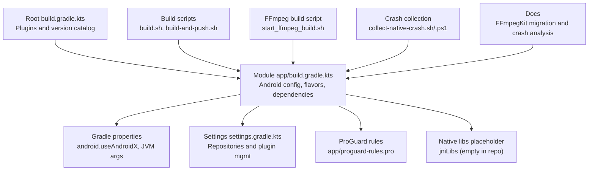

**Diagram sources**
- [build.gradle.kts:1-5](file://build.gradle.kts#L1-L5)
- [app/build.gradle.kts:1-85](file://app/build.gradle.kts#L1-L85)
- [gradle.properties:1-5](file://gradle.properties#L1-L5)
- [settings.gradle.kts:1-23](file://settings.gradle.kts#L1-L23)
- [app/proguard-rules.pro:1-32](file://app/proguard-rules.pro#L1-L32)
- [build.sh:1-126](file://build.sh#L1-L126)
- [build-and-push.sh:1-101](file://build-and-push.sh#L1-L101)
- [start_ffmpeg_build.sh:1-6](file://start_ffmpeg_build.sh#L1-L6)
- [collect-native-crash.sh:1-152](file://collect-native-crash.sh#L1-L152)
- [collect-native-crash.ps1:1-158](file://collect-native-crash.ps1#L1-L158)

**Section sources**
- [build.gradle.kts:1-5](file://build.gradle.kts#L1-L5)
- [app/build.gradle.kts:1-85](file://app/build.gradle.kts#L1-L85)
- [gradle.properties:1-5](file://gradle.properties#L1-L5)
- [settings.gradle.kts:1-23](file://settings.gradle.kts#L1-L23)

## Core Components
- Gradle plugin and version catalog: Declares Android and Kotlin plugins at the root level.
- Module configuration: Defines compile/target/min SDK, application ID, versioning, build types, flavor dimensions, product flavors, Java/Kotlin compatibility, and build features.
- Dependencies: Includes FFmpegKit AAR, Media3, and AndroidX libraries.
- ProGuard/R8 rules: Keeps FFmpegKit, Media3, AndroidX, Kotlin coroutines, ViewBinding, JNI/reflective classes, and exceptions.
- Build scripts: Automated build, signing, alignment, and installation to devices.
- FFmpeg build and crash analysis: Scripts and documentation for compiling FFmpeg with NDK and diagnosing native crashes.

**Section sources**
- [app/build.gradle.kts:6-62](file://app/build.gradle.kts#L6-L62)
- [app/build.gradle.kts:64-84](file://app/build.gradle.kts#L64-L84)
- [app/proguard-rules.pro:1-32](file://app/proguard-rules.pro#L1-L32)
- [build.sh:1-126](file://build.sh#L1-L126)
- [docs/ffmpeg-kit-migration-plan.md:1-61](file://docs/ffmpeg-kit-migration-plan.md#L1-L61)

## Architecture Overview
The build system integrates Gradle, Android NDK, and FFmpegKit to produce optimized APKs per distribution flavor. The flow includes:
- Gradle configuration with flavors and build types
- Dependency resolution and packaging
- Shrinker and resource shrinking toggles controlled by Gradle properties
- Native library packaging and ABI filtering
- Optional signing and alignment for release builds
- Continuous integration readiness via shell scripts

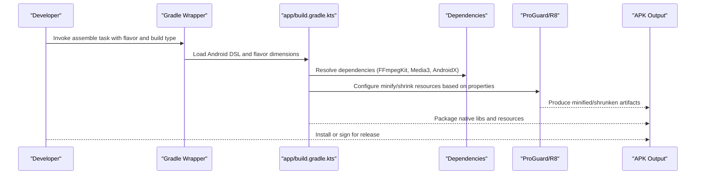

**Diagram sources**
- [app/build.gradle.kts:18-30](file://app/build.gradle.kts#L18-L30)
- [app/build.gradle.kts:23-28](file://app/build.gradle.kts#L23-L28)
- [app/build.gradle.kts:74-75](file://app/build.gradle.kts#L74-L75)
- [gradle-wrapper.properties:1-8](file://gradle/wrapper/gradle-wrapper.properties#L1-L8)

## Detailed Component Analysis

### Multi-Flavor Configuration
StreamClip defines a single flavor dimension named distribution with three product flavors: full, github, and store. Each flavor contributes a BuildConfig field for downstream logic and UI differentiation.

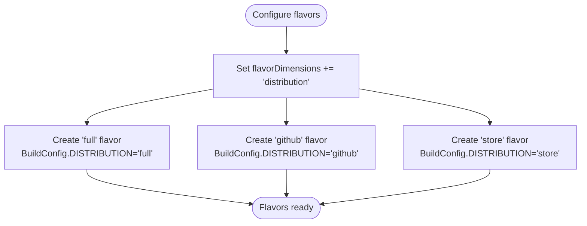

**Diagram sources**
- [app/build.gradle.kts:32-46](file://app/build.gradle.kts#L32-L46)

**Section sources**
- [app/build.gradle.kts:32-46](file://app/build.gradle.kts#L32-L46)

### Dependency Management and FFmpegKit 8.1 Integration
- FFmpegKit 8.1 is integrated via a local AAR placed under app/libs. This replaces previous asset-based binary execution.
- Media3 dependencies are included for video playback UI and runtime.
- AndroidX libraries and Kotlin coroutines support the UI and concurrency needs.

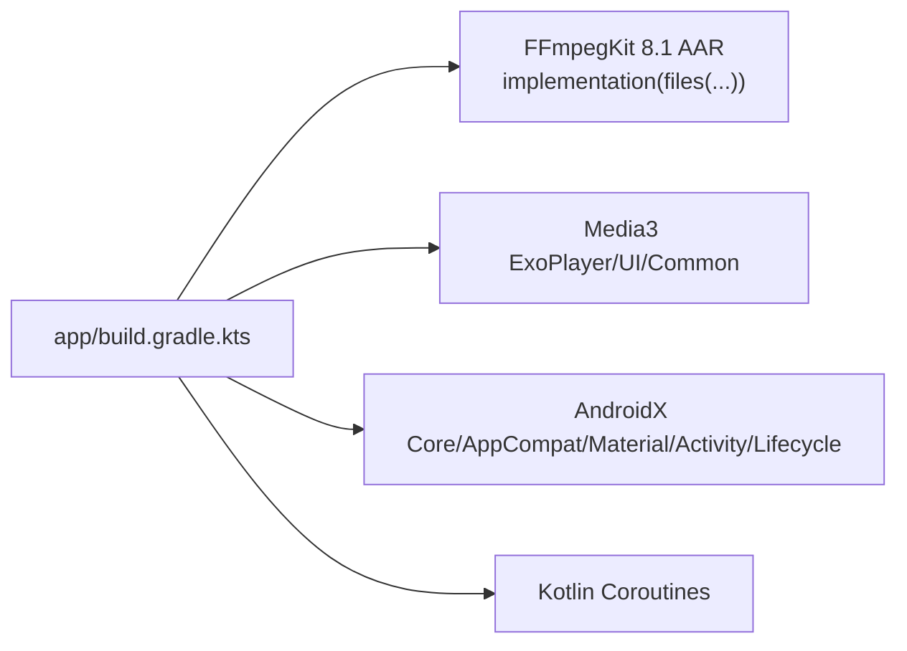

**Diagram sources**
- [app/build.gradle.kts:74-84](file://app/build.gradle.kts#L74-L84)
- [docs/ffmpeg-kit-migration-plan.md:9-18](file://docs/ffmpeg-kit-migration-plan.md#L9-L18)

**Section sources**
- [app/build.gradle.kts:74-75](file://app/build.gradle.kts#L74-L75)
- [docs/ffmpeg-kit-migration-plan.md:13-26](file://docs/ffmpeg-kit-migration-plan.md#L13-L26)

### ProGuard/R8 Configuration for Code Shrinking
The release build enables minification and resource shrinking. The ProGuard rules keep FFmpegKit, Media3, AndroidX, Kotlin coroutines, ViewBinding-generated classes, JNI/reflective classes, and exception types to prevent runtime failures.

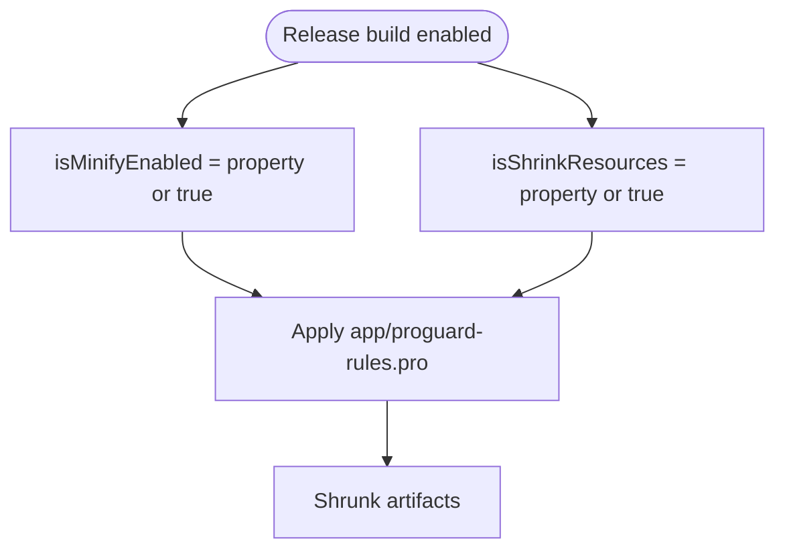

**Diagram sources**
- [app/build.gradle.kts:23-28](file://app/build.gradle.kts#L23-L28)
- [app/proguard-rules.pro:1-32](file://app/proguard-rules.pro#L1-L32)

**Section sources**
- [app/build.gradle.kts:23-28](file://app/build.gradle.kts#L23-L28)
- [app/proguard-rules.pro:1-32](file://app/proguard-rules.pro#L1-L32)

### Signing Configuration Requirements
Release builds require keystore credentials via environment variables. The build script validates presence of the keystore password and signs the aligned APK using apksigner.

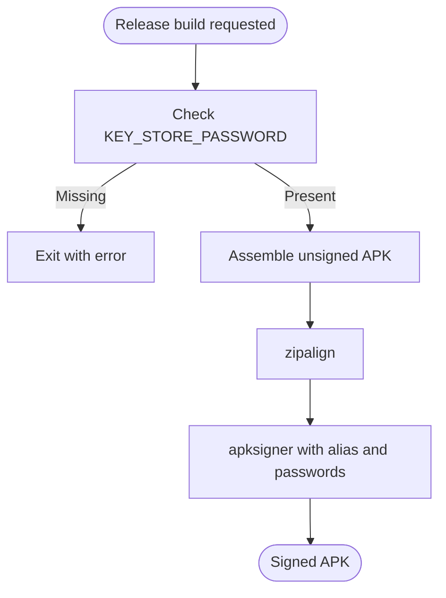

**Diagram sources**
- [build.sh:68-83](file://build.sh#L68-L83)
- [build.sh:100-119](file://build.sh#L100-L119)

**Section sources**
- [build.sh:68-83](file://build.sh#L68-L83)
- [build.sh:100-119](file://build.sh#L100-L119)

### Native Library Management and ABI Filtering
- The project includes empty jniLibs placeholders for arm64-v8a, armeabi-v7a, and x86_64.
- The current local FFmpegKit AAR is arm64-v8a only, validated by the build script.
- The Gradle task uses a Gradle property to filter the ABI during assembly.

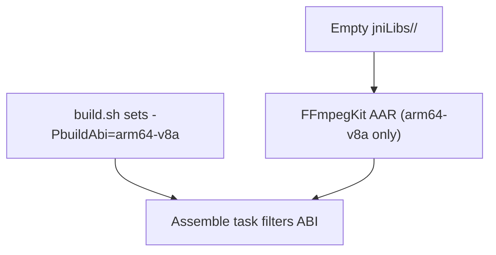

**Diagram sources**
- [build.sh:78-83](file://build.sh#L78-L83)
- [docs/ffmpeg-kit-migration-plan.md:50-53](file://docs/ffmpeg-kit-migration-plan.md#L50-L53)

**Section sources**
- [build.sh:55-64](file://build.sh#L55-L64)
- [build.sh:78-83](file://build.sh#L78-L83)
- [docs/ffmpeg-kit-migration-plan.md:50-53](file://docs/ffmpeg-kit-migration-plan.md#L50-L53)

### Build Script Configuration and Customization
- The primary build script supports build type, ABI, flavor, and an optional flag to disable minify/shrink resources.
- It auto-detects version from Gradle, validates arguments, invokes Gradle tasks, aligns, signs, and reports size.
- The push script wraps the build script and installs the resulting APK to a selected device.

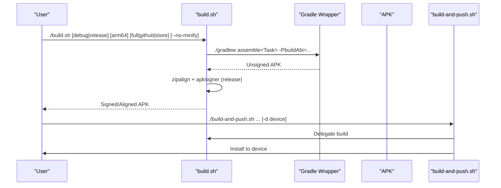

**Diagram sources**
- [build.sh:1-126](file://build.sh#L1-L126)
- [build-and-push.sh:1-101](file://build-and-push.sh#L1-L101)

**Section sources**
- [build.sh:1-126](file://build.sh#L1-L126)
- [build-and-push.sh:1-101](file://build-and-push.sh#L1-L101)

### FFmpeg Compilation Process and NDK Integration
- A dedicated script demonstrates configuring and building FFmpeg with NDK for Android, enabling Android MediaCodec and common encoders, and targeting API level 21.
- Documentation outlines migration from process-based ffmpeg binaries to FFmpegKit AAR and documents crash analysis for consecutive executions and swresample issues.

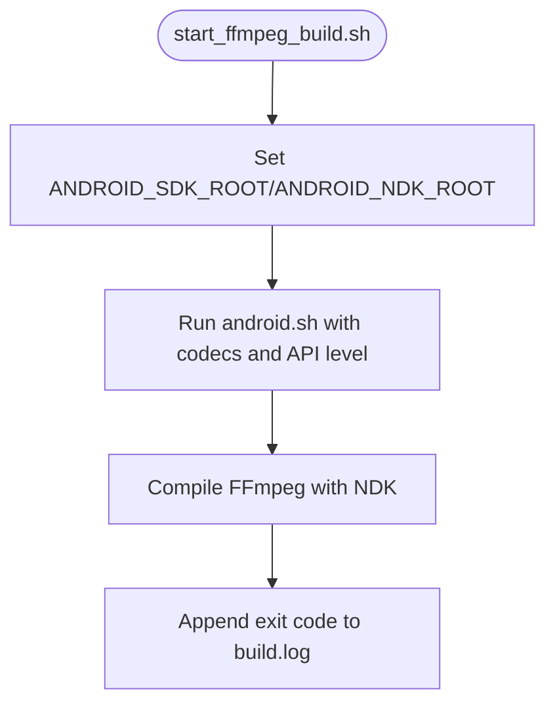

**Diagram sources**
- [start_ffmpeg_build.sh:1-6](file://start_ffmpeg_build.sh#L1-L6)

**Section sources**
- [start_ffmpeg_build.sh:1-6](file://start_ffmpeg_build.sh#L1-L6)
- [docs/ffmpeg-kit-migration-plan.md:1-61](file://docs/ffmpeg-kit-migration-plan.md#L1-L61)
- [docs/ffmpeg-8.1-consecutive-crash-analysis.md:1-128](file://docs/ffmpeg-8.1-consecutive-crash-analysis.md#L1-L128)
- [docs/ffmpeg-kit-8.1-double-execute-crash.md:1-174](file://docs/ffmpeg-kit-8.1-double-execute-crash.md#L1-L174)
- [docs/swresample-crash-analysis.md:1-244](file://docs/swresample-crash-analysis.md#L1-L244)

### Platform-Specific Optimizations
- Java/Kotlin compatibility is set to Java 17 with desugaring enabled.
- AndroidX is enabled globally.
- Permissions in the manifest enable broad media access and foreground service capabilities required by the app.

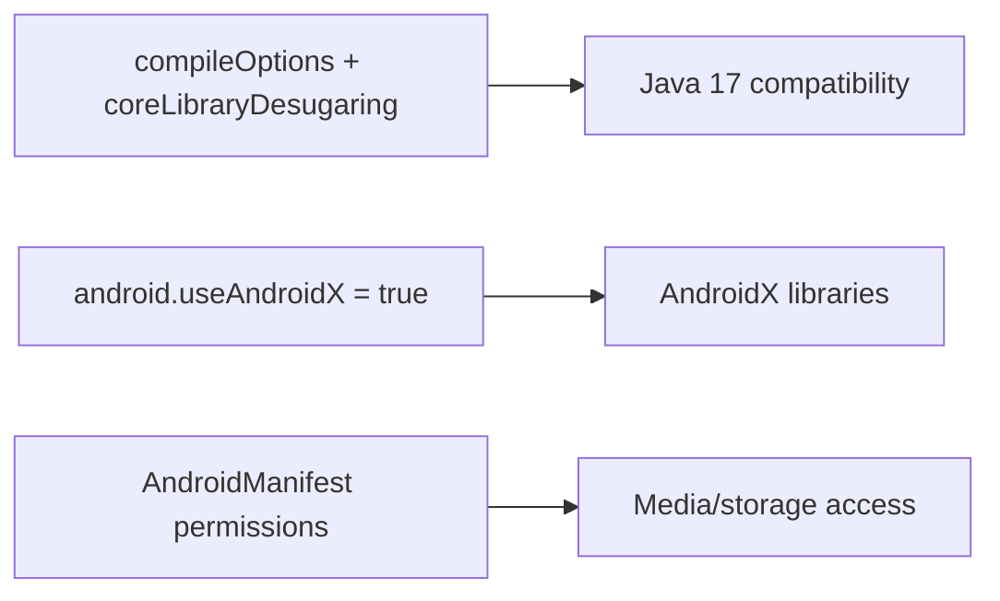

**Diagram sources**
- [app/build.gradle.kts:48-56](file://app/build.gradle.kts#L48-L56)
- [gradle.properties:2-2](file://gradle.properties#L2-L2)
- [app/src/main/AndroidManifest.xml:5-26](file://app/src/main/AndroidManifest.xml#L5-L26)

**Section sources**
- [app/build.gradle.kts:48-56](file://app/build.gradle.kts#L48-L56)
- [gradle.properties:2-2](file://gradle.properties#L2-L2)
- [app/src/main/AndroidManifest.xml:5-26](file://app/src/main/AndroidManifest.xml#L5-L26)

### Continuous Integration Setup and Deployment Preparation
- The build scripts are designed for automation and can be invoked from CI environments.
- The push script selects devices automatically or accepts a device ID, enabling scripted deployment to emulators or physical devices.
- Environment variables are used for signing credentials, suitable for CI secrets.

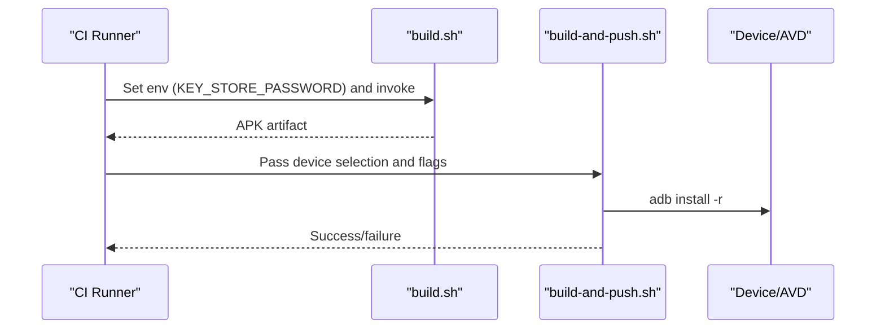

**Diagram sources**
- [build.sh:68-83](file://build.sh#L68-L83)
- [build-and-push.sh:18-98](file://build-and-push.sh#L18-L98)

**Section sources**
- [build.sh:68-83](file://build.sh#L68-L83)
- [build-and-push.sh:18-98](file://build-and-push.sh#L18-L98)

## Dependency Analysis
The module depends on FFmpegKit AAR, Media3, AndroidX, and Kotlin coroutines. The dependency graph is straightforward with no circular dependencies.

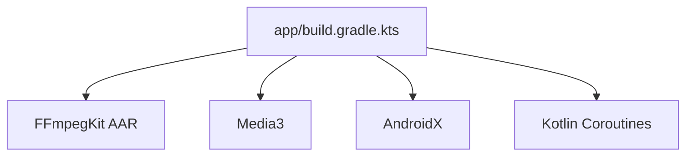

**Diagram sources**
- [app/build.gradle.kts:74-84](file://app/build.gradle.kts#L74-L84)

**Section sources**
- [app/build.gradle.kts:74-84](file://app/build.gradle.kts#L74-L84)

## Performance Considerations
- Enabling minification and resource shrinking reduces APK size but requires careful ProGuard rules to avoid runtime issues.
- Using FFmpegKit AAR eliminates process spawning overhead and simplifies lifecycle management compared to embedded binaries.
- ABI filtering to arm64-v8a reduces APK size and improves performance on modern devices, but excludes older devices and x86 emulators.
- Desugaring and Java 17 compatibility improve feature support and code generation quality.
- Proper NDK flags and optimization levels are essential to avoid unstable NEON code paths in FFmpeg components.

[No sources needed since this section provides general guidance]

## Troubleshooting Guide
Common build issues and resolutions:
- Missing keystore password for release builds: Ensure the environment variable is set before invoking the build script.
- APK not found after assembly: Verify the flavor and build type combination and inspect the generated build outputs.
- Consecutive FFmpeg executions causing native crashes: Apply mutual exclusion in the app layer or fix global state cleanup in FFmpegKit/FFmpeg.
- swresample crashes on specific audio conversions: Use a workaround to avoid resampling or rebuild FFmpeg with proper compiler flags.

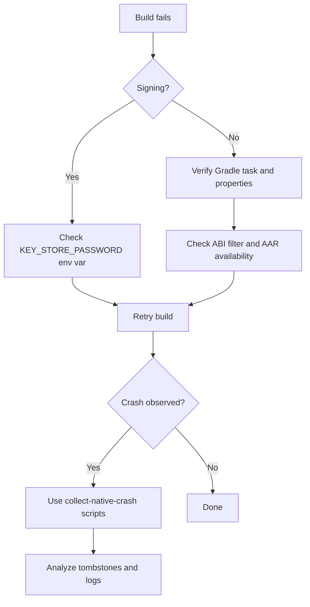

**Diagram sources**
- [build.sh:68-83](file://build.sh#L68-L83)
- [build.sh:85-98](file://build.sh#L85-L98)
- [collect-native-crash.sh:1-152](file://collect-native-crash.sh#L1-L152)
- [collect-native-crash.ps1:1-158](file://collect-native-crash.ps1#L1-L158)

**Section sources**
- [build.sh:68-83](file://build.sh#L68-L83)
- [build.sh:85-98](file://build.sh#L85-L98)
- [docs/ffmpeg-8.1-consecutive-crash-analysis.md:94-115](file://docs/ffmpeg-8.1-consecutive-crash-analysis.md#L94-L115)
- [docs/swresample-crash-analysis.md:186-236](file://docs/swresample-crash-analysis.md#L186-L236)
- [collect-native-crash.sh:1-152](file://collect-native-crash.sh#L1-L152)
- [collect-native-crash.ps1:1-158](file://collect-native-crash.ps1#L1-L158)

## Conclusion
StreamClip’s build system centers on a clean Gradle configuration with multi-flavor distribution, FFmpegKit 8.1 integration via a local AAR, and robust ProGuard/R8 rules. The build scripts automate assembling, aligning, signing, and installing APKs, while documentation and crash collection scripts aid in diagnosing native issues. ABI filtering to arm64-v8a optimizes performance and reduces APK size, with documented workarounds for known FFmpeg-related crashes. These configurations prepare the project for CI/CD and production deployments.

[No sources needed since this section summarizes without analyzing specific files]

## Appendices

### Practical Build Customization Examples
- Disable minification and resource shrinking for debugging: pass the no-minify flag to the build script.
- Target a specific ABI: set the ABI argument to arm64 in the build script.
- Add new distribution flavors: extend the flavor dimension and define BuildConfig fields accordingly.

**Section sources**
- [build.sh:18-23](file://build.sh#L18-L23)
- [build.sh:78-82](file://build.sh#L78-L82)
- [app/build.gradle.kts:32-46](file://app/build.gradle.kts#L32-L46)

### Relationship Between Build Configuration and Runtime Performance/Memory/Compatibility
- Minification and resource shrinking reduce APK size and can slightly improve cold-start performance by reducing dex size.
- Using FFmpegKit AAR avoids process creation overhead and simplifies lifecycle management, improving responsiveness.
- ABI filtering to arm64-v8a improves performance on modern devices but excludes older ARM and x86 targets.
- Proper NDK flags and compiler optimizations mitigate NEON-related instability in audio resampling paths.

**Section sources**
- [app/build.gradle.kts:23-28](file://app/build.gradle.kts#L23-L28)
- [docs/swresample-crash-analysis.md:186-236](file://docs/swresample-crash-analysis.md#L186-L236)
- [docs/ffmpeg-kit-migration-plan.md:50-53](file://docs/ffmpeg-kit-migration-plan.md#L50-L53)