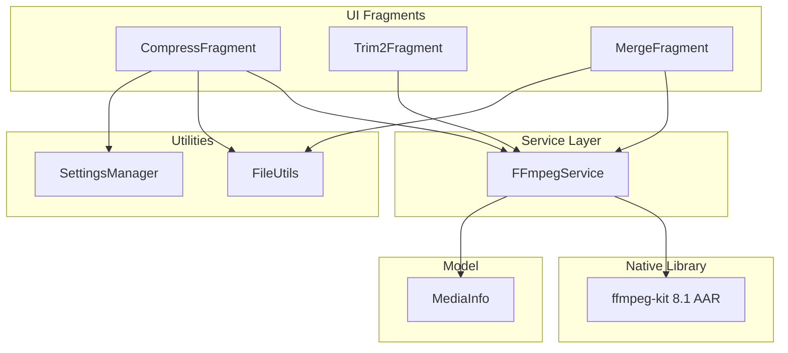
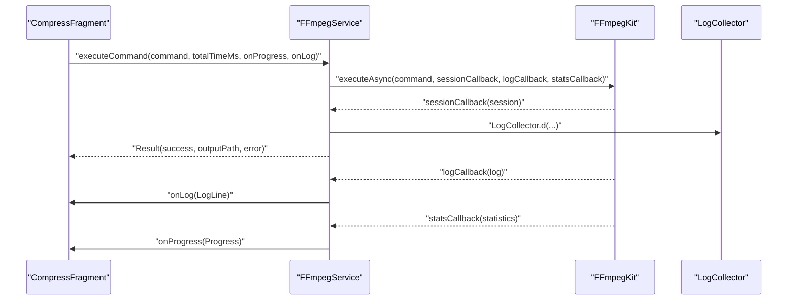
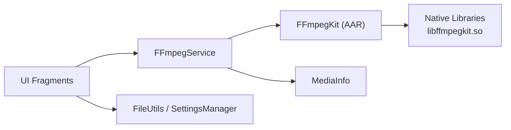
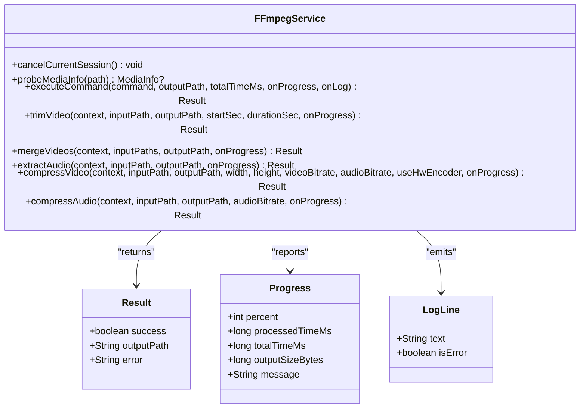
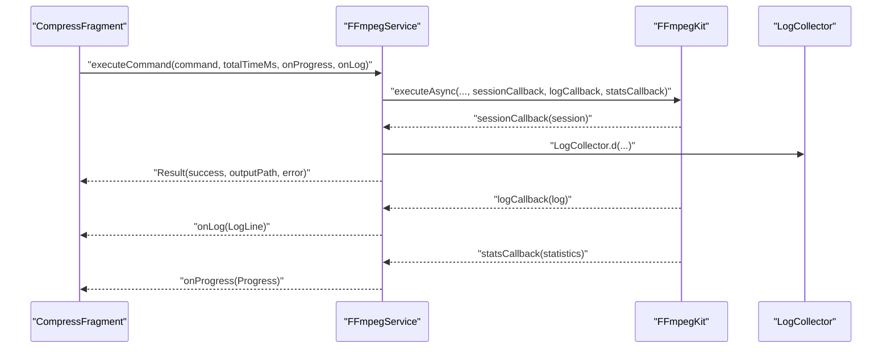
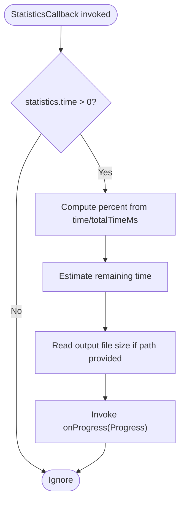
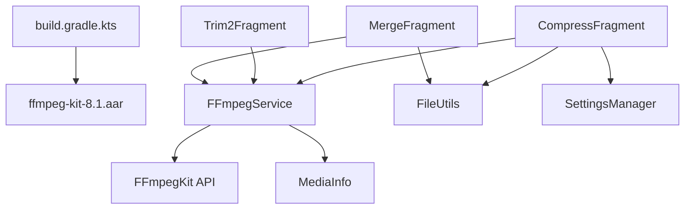

# FFmpeg Integration

<cite>
**Referenced Files in This Document**
- [FFmpegService.kt](file://app/src/main/java/com/pisces312/streamclip/service/FFmpegService.kt)
- [build.gradle.kts](file://app/build.gradle.kts)
- [ffmpeg-kit-migration-plan.md](file://docs/ffmpeg-kit-migration-plan.md)
- [ffmpeg-8.1-consecutive-crash-analysis.md](file://docs/ffmpeg-8.1-consecutive-crash-analysis.md)
- [ffmpeg-kit-8.1-double-execute-crash.md](file://docs/ffmpeg-kit-8.1-double-execute-crash.md)
- [CompressFragment.kt](file://app/src/main/java/com/pisces312/streamclip/fragment/CompressFragment.kt)
- [Trim2Fragment.kt](file://app/src/main/java/com/pisces312/streamclip/fragment/Trim2Fragment.kt)
- [MergeFragment.kt](file://app/src/main/java/com/pisces312/streamclip/fragment/MergeFragment.kt)
- [MediaInfo.kt](file://app/src/main/java/com/pisces312/streamclip/model/MediaInfo.kt)
- [FileUtils.kt](file://app/src/main/java/com/pisces312/streamclip/util/FileUtils.kt)
- [SettingsManager.kt](file://app/src/main/java/com/pisces312/streamclip/util/SettingsManager.kt)
</cite>

## Table of Contents
1. [Introduction](#introduction)
2. [Project Structure](#project-structure)
3. [Core Components](#core-components)
4. [Architecture Overview](#architecture-overview)
5. [Detailed Component Analysis](#detailed-component-analysis)
6. [Dependency Analysis](#dependency-analysis)
7. [Performance Considerations](#performance-considerations)
8. [Troubleshooting Guide](#troubleshooting-guide)
9. [Conclusion](#conclusion)
10. [Appendices](#appendices)

## Introduction
This document explains the FFmpeg integration in StreamClip with FFmpegKit 8.1. It covers the FFmpegService implementation, initialization, command execution, progress tracking, and integration with the ffmpeg-kit library. It also documents the migration from a previous binary-based approach to using the AAR distribution, native library loading, architecture-specific binary management, and runtime selection. Practical command construction, validation, error handling, and performance/compatibility guidance are included, along with mitigation strategies for known crashes observed during consecutive executions.

## Project Structure
The FFmpeg integration centers around a Kotlin service that wraps FFmpegKit APIs, with UI fragments orchestrating operations and utilities managing file paths and settings.

**Diagram sources**
- [FFmpegService.kt:1-420](file://app/src/main/java/com/pisces312/streamclip/service/FFmpegService.kt#L1-L420)
- [build.gradle.kts:74-75](file://app/build.gradle.kts#L74-L75)
- [CompressFragment.kt:1-839](file://app/src/main/java/com/pisces312/streamclip/fragment/CompressFragment.kt#L1-L839)
- [Trim2Fragment.kt:1-286](file://app/src/main/java/com/pisces312/streamclip/fragment/Trim2Fragment.kt#L1-L286)
- [MergeFragment.kt:1-278](file://app/src/main/java/com/pisces312/streamclip/fragment/MergeFragment.kt#L1-L278)
- [MediaInfo.kt:1-165](file://app/src/main/java/com/pisces312/streamclip/model/MediaInfo.kt#L1-L165)
- [FileUtils.kt:1-362](file://app/src/main/java/com/pisces312/streamclip/util/FileUtils.kt#L1-L362)
- [SettingsManager.kt:1-208](file://app/src/main/java/com/pisces312/streamclip/util/SettingsManager.kt#L1-L208)

**Section sources**
- [FFmpegService.kt:1-420](file://app/src/main/java/com/pisces312/streamclip/service/FFmpegService.kt#L1-L420)
- [build.gradle.kts:74-75](file://app/build.gradle.kts#L74-L75)

## Core Components
- FFmpegService: Centralized orchestration for probing media, executing commands, trimming, merging, extracting audio, and compressing video/audio. It integrates FFmpegKit’s async execution, statistics callbacks, and logging.
- UI Fragments: CompressFragment, Trim2Fragment, and MergeFragment drive operations, construct commands, and render progress/log feedback.
- Utilities: FileUtils resolves URIs to real paths (including caching), SettingsManager controls output directories and keep-screen-on behavior, and MediaInfo models parsed metadata.

Key responsibilities:
- Command construction and validation
- Progress estimation via StatisticsCallback
- Logging via callback and structured LogLine
- Cancellation support and session management
- Lossless operations (trim, merge) and encode-based compression

**Section sources**
- [FFmpegService.kt:33-420](file://app/src/main/java/com/pisces312/streamclip/service/FFmpegService.kt#L33-L420)
- [CompressFragment.kt:572-680](file://app/src/main/java/com/pisces312/streamclip/fragment/CompressFragment.kt#L572-L680)
- [Trim2Fragment.kt:178-251](file://app/src/main/java/com/pisces312/streamclip/fragment/Trim2Fragment.kt#L178-L251)
- [MergeFragment.kt:135-232](file://app/src/main/java/com/pisces312/streamclip/fragment/MergeFragment.kt#L135-L232)
- [MediaInfo.kt:5-165](file://app/src/main/java/com/pisces312/streamclip/model/MediaInfo.kt#L5-L165)
- [FileUtils.kt:30-118](file://app/src/main/java/com/pisces312/streamclip/util/FileUtils.kt#L30-L118)
- [SettingsManager.kt:67-114](file://app/src/main/java/com/pisces312/streamclip/util/SettingsManager.kt#L67-L114)

## Architecture Overview
The integration uses FFmpegKit’s Java API via an AAR dependency. Commands are executed asynchronously, with progress derived from statistics and logs captured for UI display. The service encapsulates session lifecycle and cancellation.

**Diagram sources**
- [FFmpegService.kt:152-241](file://app/src/main/java/com/pisces312/streamclip/service/FFmpegService.kt#L152-L241)
- [CompressFragment.kt:602-629](file://app/src/main/java/com/pisces312/streamclip/fragment/CompressFragment.kt#L602-L629)

**Section sources**
- [FFmpegService.kt:152-241](file://app/src/main/java/com/pisces312/streamclip/service/FFmpegService.kt#L152-L241)
- [CompressFragment.kt:602-629](file://app/src/main/java/com/pisces312/streamclip/fragment/CompressFragment.kt#L602-L629)

## Detailed Component Analysis

### FFmpegService Implementation
- Initialization and lifecycle
  - Tracks current session ID for cancellation.
  - Provides cancelCurrentSession to abort ongoing work.
- Command execution
  - executeCommand: Async execution with optional progress and log callbacks; returns Result with success flag and error message.
  - Uses StatisticsCallback to compute percentage from elapsed time and total duration; estimates remaining time.
  - Uses log callback to forward FFmpeg logs to UI.
- Probing media
  - probeMediaInfo: Executes ffprobe JSON and parses format, streams, and tags; returns MediaInfo.
- Specialized operations
  - trimVideo: Lossless cut using -c copy.
  - mergeVideos: Concat demuxer lossless merge; applies metadata from first file.
  - extractAudio: Audio extraction using -c:a copy.
  - compressVideo: Hardware (hevc_mediacodec) or software (libx265) encoding with scaling and AAC audio.
  - compressAudio: Re-encode audio to AAC at target bitrate.

Progress tracking mechanism
- Calculates percent from statistics.time and totalTimeMs.
- Computes remaining time estimate based on elapsed time and percent.
- Reports output size by querying file length.

Cancellation and robustness
- Cancels current session on coroutine cancellation.
- Ensures only one active session at a time via currentSessionId.

**Section sources**
- [FFmpegService.kt:19-420](file://app/src/main/java/com/pisces312/streamclip/service/FFmpegService.kt#L19-L420)

### UI Integration Examples
- CompressFragment
  - Builds configuration, constructs FFmpeg command, and invokes executeCommand with onProgress and onLog.
  - Updates UI progress bar and displays logs in a dialog.
  - Applies file timestamps and scans output into media scanner.
- Trim2Fragment
  - Uses trimVideo for lossless trimming; no progress callback needed.
- MergeFragment
  - Validates compatibility using MediaInfo and merges via mergeVideos.

**Section sources**
- [CompressFragment.kt:572-680](file://app/src/main/java/com/pisces312/streamclip/fragment/CompressFragment.kt#L572-L680)
- [Trim2Fragment.kt:178-251](file://app/src/main/java/com/pisces312/streamclip/fragment/Trim2Fragment.kt#L178-L251)
- [MergeFragment.kt:135-232](file://app/src/main/java/com/pisces312/streamclip/fragment/MergeFragment.kt#L135-L232)

### Data Models and Utilities
- MediaInfo: Encapsulates parsed video/audio metadata and convenience accessors for UI.
- FileUtils: Resolves URIs to real paths, caches content when needed, and manages output directories and file scanning.
- SettingsManager: Controls output directory policy, timestamp suffix, and keep-screen-on behavior.

**Section sources**
- [MediaInfo.kt:5-165](file://app/src/main/java/com/pisces312/streamclip/model/MediaInfo.kt#L5-L165)
- [FileUtils.kt:30-118](file://app/src/main/java/com/pisces312/streamclip/util/FileUtils.kt#L30-L118)
- [SettingsManager.kt:67-114](file://app/src/main/java/com/pisces312/streamclip/util/SettingsManager.kt#L67-L114)

## Architecture Overview
The system relies on FFmpegKit 8.1 distributed as an AAR. The service abstracts command execution, progress, and logging, while UI fragments coordinate user actions and present results.

**Diagram sources**
- [build.gradle.kts:74-75](file://app/build.gradle.kts#L74-L75)
- [FFmpegService.kt:1-420](file://app/src/main/java/com/pisces312/streamclip/service/FFmpegService.kt#L1-L420)

**Section sources**
- [build.gradle.kts:74-75](file://app/build.gradle.kts#L74-L75)
- [FFmpegService.kt:1-420](file://app/src/main/java/com/pisces312/streamclip/service/FFmpegService.kt#L1-L420)

## Detailed Component Analysis

### FFmpegService Class Diagram

**Diagram sources**
- [FFmpegService.kt:33-420](file://app/src/main/java/com/pisces312/streamclip/service/FFmpegService.kt#L33-L420)

**Section sources**
- [FFmpegService.kt:33-420](file://app/src/main/java/com/pisces312/streamclip/service/FFmpegService.kt#L33-L420)

### Execution Flow: Compress Operation

**Diagram sources**
- [CompressFragment.kt:602-629](file://app/src/main/java/com/pisces312/streamclip/fragment/CompressFragment.kt#L602-L629)
- [FFmpegService.kt:152-241](file://app/src/main/java/com/pisces312/streamclip/service/FFmpegService.kt#L152-L241)

**Section sources**
- [CompressFragment.kt:602-629](file://app/src/main/java/com/pisces312/streamclip/fragment/CompressFragment.kt#L602-L629)
- [FFmpegService.kt:152-241](file://app/src/main/java/com/pisces312/streamclip/service/FFmpegService.kt#L152-L241)

### Progress Estimation Flow

**Diagram sources**
- [FFmpegService.kt:182-214](file://app/src/main/java/com/pisces312/streamclip/service/FFmpegService.kt#L182-L214)

**Section sources**
- [FFmpegService.kt:182-214](file://app/src/main/java/com/pisces312/streamclip/service/FFmpegService.kt#L182-L214)

## Dependency Analysis
- FFmpegKit AAR dependency is declared locally in the app module.
- The service depends on FFmpegKit classes for execution, statistics, and return code evaluation.
- UI fragments depend on the service for all operations and on utilities for file handling and settings.

**Diagram sources**
- [build.gradle.kts:74-75](file://app/build.gradle.kts#L74-L75)
- [FFmpegService.kt:1-420](file://app/src/main/java/com/pisces312/streamclip/service/FFmpegService.kt#L1-L420)
- [CompressFragment.kt:1-839](file://app/src/main/java/com/pisces312/streamclip/fragment/CompressFragment.kt#L1-L839)
- [Trim2Fragment.kt:1-286](file://app/src/main/java/com/pisces312/streamclip/fragment/Trim2Fragment.kt#L1-L286)
- [MergeFragment.kt:1-278](file://app/src/main/java/com/pisces312/streamclip/fragment/MergeFragment.kt#L1-L278)

**Section sources**
- [build.gradle.kts:74-75](file://app/build.gradle.kts#L74-L75)
- [FFmpegService.kt:1-420](file://app/src/main/java/com/pisces312/streamclip/service/FFmpegService.kt#L1-L420)

## Performance Considerations
- Hardware vs software encoding
  - Hardware encoder (hevc_mediacodec) offers speed and power efficiency; suitable for modern devices.
  - Software encoder (libx265) provides higher quality control and broader compatibility.
- Scaling and bitrate
  - Use appropriate scale filters and maintain aspect ratio to avoid unnecessary computation.
  - Tune video and audio bitrates to balance quality and file size.
- Faststart and container flags
  - movflags +faststart improves playback readiness for MP4.
- Concurrency and stability
  - Avoid consecutive executions without proper cleanup; see crash analysis for mitigations.

[No sources needed since this section provides general guidance]

## Troubleshooting Guide
Common issues and remedies:
- Library loading failures
  - Ensure the AAR is present and properly referenced in build.gradle.kts.
  - Verify architecture alignment; the AAR used in the project targets a specific ABI.
- Permission problems
  - Confirm read/write permissions for input/output locations; cache fallback is supported via FileUtils.
- Memory management
  - Avoid holding large intermediate files unnecessarily; use temporary files and delete after use.
- Consecutive execution crashes (FFmpeg 8.1)
  - Known issue documented in crash analyses; mitigate by ensuring only one session runs at a time and allowing cleanup between executions.

**Section sources**
- [ffmpeg-kit-8.1-double-execute-crash.md:1-174](file://docs/ffmpeg-kit-8.1-double-execute-crash.md#L1-L174)
- [ffmpeg-8.1-consecutive-crash-analysis.md:1-128](file://docs/ffmpeg-8.1-consecutive-crash-analysis.md#L1-L128)
- [build.gradle.kts:74-75](file://app/build.gradle.kts#L74-L75)
- [FileUtils.kt:170-187](file://app/src/main/java/com/pisces312/streamclip/util/FileUtils.kt#L170-L187)

## Conclusion
StreamClip integrates FFmpeg via FFmpegKit 8.1 using a clean service abstraction that supports probing, trimming, merging, extracting audio, and compressing video/audio. The UI fragments orchestrate operations and present progress and logs. The project migrated from a binary-based approach to an AAR distribution, simplifying deployment and reducing maintenance overhead. Known stability issues with consecutive executions are documented and mitigated through careful session management.

[No sources needed since this section summarizes without analyzing specific files]

## Appendices

### Migration from Binary-Based FFmpeg to FFmpegKit 8.1 AAR
- Background: Previous implementation used ProcessBuilder to execute bundled ffmpeg binaries.
- New approach: Use ffmpeg-kit AAR for direct API access.
- Steps:
  - Add local AAR dependency in build.gradle.kts.
  - Replace binary execution logic with FFmpegKit.executeAsync and StatisticsCallback.
  - Remove asset-based binary management and parsing logic.
- Outcome: Simplified build, reduced APK size, and centralized progress/logging.

**Section sources**
- [ffmpeg-kit-migration-plan.md:1-61](file://docs/ffmpeg-kit-migration-plan.md#L1-L61)
- [build.gradle.kts:74-75](file://app/build.gradle.kts#L74-L75)
- [FFmpegService.kt:152-241](file://app/src/main/java/com/pisces312/streamclip/service/FFmpegService.kt#L152-L241)

### Practical Command Construction and Validation
- Trimming: Use -c copy for lossless cuts; specify -ss and -t appropriately.
- Merging: Use concat demuxer with -safe 0 and -f concat; preserve metadata from first file.
- Compression: Choose hardware or software encoder; set bitrate and buffer sizes; scale video with lanczos filter.
- Validation: Probe media beforehand to derive totalTimeMs and format metadata; enforce minimum durations and compatibility checks.

**Section sources**
- [FFmpegService.kt:246-418](file://app/src/main/java/com/pisces312/streamclip/service/FFmpegService.kt#L246-L418)
- [CompressFragment.kt:572-680](file://app/src/main/java/com/pisces312/streamclip/fragment/CompressFragment.kt#L572-L680)
- [MergeFragment.kt:135-232](file://app/src/main/java/com/pisces312/streamclip/fragment/MergeFragment.kt#L135-L232)

### Native Library Loading and Architecture-Specific Binaries
- The project uses a local AAR containing FFmpegKit 8.1. The AAR bundles native libraries for the targeted architecture.
- Ensure the device ABI matches the AAR; otherwise, consider building or acquiring an AAR for the correct architecture.

**Section sources**
- [build.gradle.kts:74-75](file://app/build.gradle.kts#L74-L75)