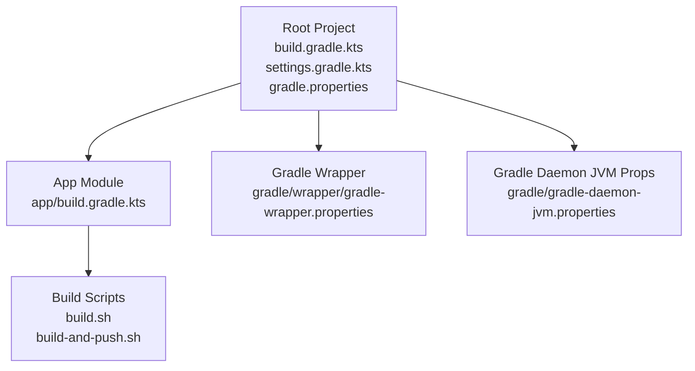
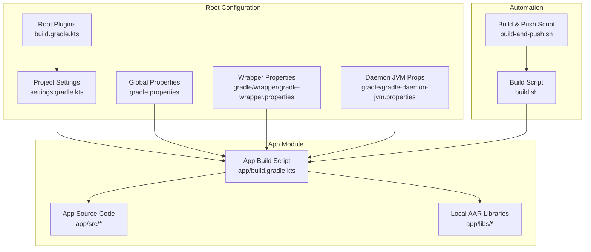
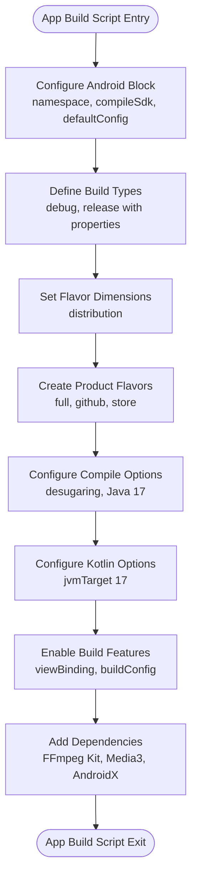
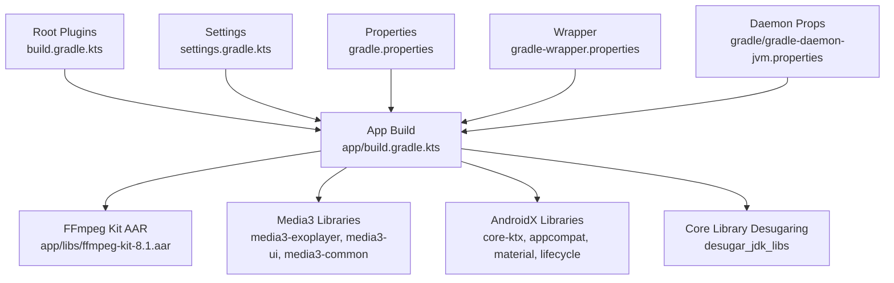

# Gradle Build System

<cite>
**Referenced Files in This Document**
- [build.gradle.kts](file://build.gradle.kts)
- [app/build.gradle.kts](file://app/build.gradle.kts)
- [gradle.properties](file://gradle.properties)
- [settings.gradle.kts](file://settings.gradle.kts)
- [gradle/wrapper/gradle-wrapper.properties](file://gradle/wrapper/gradle-wrapper.properties)
- [gradle/gradle-daemon-jvm.properties](file://gradle/gradle-daemon-jvm.properties)
- [build.sh](file://build.sh)
- [build-and-push.sh](file://build-and-push.sh)
- [README.md](file://README.md)
</cite>

## Table of Contents
1. [Introduction](#introduction)
2. [Project Structure](#project-structure)
3. [Core Components](#core-components)
4. [Architecture Overview](#architecture-overview)
5. [Detailed Component Analysis](#detailed-component-analysis)
6. [Dependency Analysis](#dependency-analysis)
7. [Performance Considerations](#performance-considerations)
8. [Troubleshooting Guide](#troubleshooting-guide)
9. [Conclusion](#conclusion)

## Introduction
This document provides comprehensive documentation for StreamClip's Gradle build system, focusing on the multi-module project structure and configuration management. StreamClip is a single-module Android application project centered around the app module, configured with Android Application and Kotlin Android plugins. The build system leverages Gradle Kotlin DSL (.kts) for modern, type-safe configuration, integrates FFmpeg Kit for video processing capabilities, and includes shell scripts for streamlined local builds and device deployment.

Key aspects covered:
- Root build script plugin declarations and version management
- App module Android configuration, flavor dimensions, build types, and product flavors
- Global Gradle properties for JVM arguments, AndroidX usage, and code style
- Project inclusion and repository configuration in settings
- Practical build customization examples and optimization strategies
- Common build issues and their resolutions
- Relationship between build configuration and development workflow, testing, and release preparation

## Project Structure
StreamClip follows a straightforward single-module structure with a primary app module and shared Gradle configuration files at the root level. The project uses Gradle Kotlin DSL for build scripts and includes a Gradle wrapper for consistent builds across environments.

**Diagram sources**
- [build.gradle.kts:1-5](file://build.gradle.kts#L1-L5)
- [settings.gradle.kts:1-23](file://settings.gradle.kts#L1-L23)
- [app/build.gradle.kts:1-85](file://app/build.gradle.kts#L1-L85)
- [gradle/wrapper/gradle-wrapper.properties:1-8](file://gradle/wrapper/gradle-wrapper.properties#L1-L8)
- [gradle/gradle-daemon-jvm.properties:1-13](file://gradle/gradle-daemon-jvm.properties#L1-L13)
- [build.sh:1-126](file://build.sh#L1-L126)
- [build-and-push.sh:1-101](file://build-and-push.sh#L1-L101)

**Section sources**
- [build.gradle.kts:1-5](file://build.gradle.kts#L1-L5)
- [settings.gradle.kts:1-23](file://settings.gradle.kts#L1-L23)
- [app/build.gradle.kts:1-85](file://app/build.gradle.kts#L1-L85)
- [gradle/wrapper/gradle-wrapper.properties:1-8](file://gradle/wrapper/gradle-wrapper.properties#L1-L8)
- [gradle/gradle-daemon-jvm.properties:1-13](file://gradle/gradle-daemon-jvm.properties#L1-L13)
- [build.sh:1-126](file://build.sh#L1-L126)
- [build-and-push.sh:1-101](file://build-and-push.sh#L1-L101)

## Core Components
This section documents the core Gradle configuration files and their roles in the build system.

- Root build script (build.gradle.kts): Declares Android Application and Kotlin Android plugins with explicit version pinning and deferred application to submodules. This ensures consistent plugin versions across the project and prevents accidental application to the root project.
- App module build script (app/build.gradle.kts): Defines Android application configuration, compile SDK, default configuration, build types, flavor dimensions, product flavors, compile options, Kotlin options, and dependencies including FFmpeg Kit and Media3 libraries.
- Global properties (gradle.properties): Sets JVM arguments for Gradle daemon, enables AndroidX, configures non-transitive R class generation, and enforces official Kotlin code style.
- Project settings (settings.gradle.kts): Configures plugin management repositories, dependency resolution management with multiple repositories, sets project name, and includes the app module.
- Gradle wrapper (gradle/wrapper/gradle-wrapper.properties): Specifies the Gradle distribution URL and wrapper storage configuration.
- Gradle daemon JVM properties (gradle/gradle-daemon-jvm.properties): Provides toolchain URLs and version for the Gradle daemon across platforms.

Practical examples:
- Adding a new dependency: Add implementation entries in the app module build script under the dependencies block.
- Configuring signing variants: Use Gradle properties or environment variables to pass keystore information to the build process.
- Optimizing build performance: Adjust JVM arguments in gradle.properties and leverage Gradle's build cache and daemon settings.

**Section sources**
- [build.gradle.kts:1-5](file://build.gradle.kts#L1-L5)
- [app/build.gradle.kts:1-85](file://app/build.gradle.kts#L1-L85)
- [gradle.properties:1-5](file://gradle.properties#L1-L5)
- [settings.gradle.kts:1-23](file://settings.gradle.kts#L1-L23)
- [gradle/wrapper/gradle-wrapper.properties:1-8](file://gradle/wrapper/gradle-wrapper.properties#L1-L8)
- [gradle/gradle-daemon-jvm.properties:1-13](file://gradle/gradle-daemon-jvm.properties#L1-L13)

## Architecture Overview
The build architecture centers on a single app module with centralized plugin and dependency management at the root level. The settings script defines repositories and includes the app module, while the app module configures Android specifics and dependencies. Shell scripts provide convenient automation for building and deploying artifacts.

**Diagram sources**
- [build.gradle.kts:1-5](file://build.gradle.kts#L1-L5)
- [settings.gradle.kts:1-23](file://settings.gradle.kts#L1-L23)
- [gradle.properties:1-5](file://gradle.properties#L1-L5)
- [gradle/wrapper/gradle-wrapper.properties:1-8](file://gradle/wrapper/gradle-wrapper.properties#L1-L8)
- [gradle/gradle-daemon-jvm.properties:1-13](file://gradle/gradle-daemon-jvm.properties#L1-L13)
- [app/build.gradle.kts:1-85](file://app/build.gradle.kts#L1-L85)
- [build.sh:1-126](file://build.sh#L1-L126)
- [build-and-push.sh:1-101](file://build-and-push.sh#L1-L101)

## Detailed Component Analysis

### Root Build Script (build.gradle.kts)
The root build script declares Android Application and Kotlin Android plugins with explicit versions and defers their application to submodules. This pattern centralizes plugin version management and ensures the root project remains lightweight.

Implementation highlights:
- Plugin declarations with version pinning
- Deferred application to prevent accidental root application

Best practices:
- Keep plugin versions synchronized across the project
- Use deferred application for root-level plugin declarations

**Section sources**
- [build.gradle.kts:1-5](file://build.gradle.kts#L1-L5)

### App Module Build Script (app/build.gradle.kts)
The app module build script configures the Android application with comprehensive settings for SDK versions, default configuration, build types, flavor dimensions, product flavors, compile options, Kotlin options, and dependencies.

Key configurations:
- Android block with namespace, compile SDK, default configuration, and build features
- Build types with debug suffix and release minification/shrinking controlled by project properties
- Flavor dimensions and product flavors for distribution variants
- Compile options enabling desugaring and setting Java 17 compatibility
- Kotlin options targeting JVM 17
- Dependencies including FFmpeg Kit AAR, Media3 libraries, and AndroidX components

Practical examples:
- Adding new dependencies: Append implementation entries in the dependencies block
- Configuring signing variants: Use Gradle properties or environment variables to pass keystore information
- Optimizing build performance: Adjust JVM arguments in gradle.properties and enable Gradle's build cache

**Diagram sources**
- [app/build.gradle.kts:6-62](file://app/build.gradle.kts#L6-L62)
- [app/build.gradle.kts:64-84](file://app/build.gradle.kts#L64-L84)

**Section sources**
- [app/build.gradle.kts:1-85](file://app/build.gradle.kts#L1-L85)

### Gradle Properties (gradle.properties)
The global properties file controls Gradle daemon behavior and Android project settings. It sets JVM arguments for heap size, enables AndroidX, configures non-transitive R class generation, and enforces official Kotlin code style.

Configuration highlights:
- JVM arguments with increased heap size for better performance
- AndroidX usage enabled
- Non-transitive R class generation for reduced dependency graph size
- Official Kotlin code style enforcement

Optimization tips:
- Increase heap size for large projects
- Enable non-transitive R class for faster builds
- Use official Kotlin code style for consistency

**Section sources**
- [gradle.properties:1-5](file://gradle.properties#L1-L5)

### Settings Script (settings.gradle.kts)
The settings script manages plugin repositories, dependency resolution, project naming, and module inclusion. It configures repositories with multiple sources including Aliyun mirrors, Google, Maven Central, JitPack, and legacy JCenter, and includes the app module.

Repository configuration highlights:
- Plugin management with Google, Maven Central, and Gradle Plugin Portal
- Dependency resolution with multiple repositories for broader artifact availability
- Project name assignment and app module inclusion

Best practices:
- Maintain multiple repositories for artifact availability
- Keep repository lists updated and secure
- Use explicit module inclusion for clarity

**Section sources**
- [settings.gradle.kts:1-23](file://settings.gradle.kts#L1-L23)

### Gradle Wrapper (gradle/wrapper/gradle-wrapper.properties)
The wrapper properties define the Gradle distribution URL and wrapper storage configuration. This ensures consistent Gradle versions across development environments.

Configuration highlights:
- Distribution URL pointing to Gradle 9.4.1
- Wrapper storage configuration for distribution caching

**Section sources**
- [gradle/wrapper/gradle-wrapper.properties:1-8](file://gradle/wrapper/gradle-wrapper.properties#L1-L8)

### Gradle Daemon JVM Properties (gradle/gradle-daemon-jvm.properties)
The daemon JVM properties file provides toolchain URLs and version for the Gradle daemon across different platforms. This supports cross-platform development with consistent toolchains.

Configuration highlights:
- Platform-specific toolchain URLs for Windows, macOS, Linux, and Unix
- Toolchain version specification

**Section sources**
- [gradle/gradle-daemon-jvm.properties:1-13](file://gradle/gradle-daemon-jvm.properties#L1-L13)

### Build Scripts (build.sh and build-and-push.sh)
The build scripts provide automation for building and deploying StreamClip artifacts. They support multiple build types, ABI filters, and distribution flavors, with optional minification control and device installation.

Build script capabilities:
- Parameter parsing for build type, ABI, flavor, and minification flags
- Environment variable validation for release signing
- APK alignment and signing for release builds
- Device selection and installation for debug builds

Integration with Gradle:
- Passes build arguments to Gradle tasks
- Uses Gradle properties for minification control
- Supports both local and CI/CD environments

**Section sources**
- [build.sh:1-126](file://build.sh#L1-L126)
- [build-and-push.sh:1-101](file://build-and-push.sh#L1-L101)

## Dependency Analysis
This section examines the relationships between build configuration components and their impact on the overall build process.

**Diagram sources**
- [build.gradle.kts:1-5](file://build.gradle.kts#L1-L5)
- [settings.gradle.kts:1-23](file://settings.gradle.kts#L1-L23)
- [gradle.properties:1-5](file://gradle.properties#L1-L5)
- [gradle/wrapper/gradle-wrapper.properties:1-8](file://gradle/wrapper/gradle-wrapper.properties#L1-L8)
- [gradle/gradle-daemon-jvm.properties:1-13](file://gradle/gradle-daemon-jvm.properties#L1-L13)
- [app/build.gradle.kts:64-84](file://app/build.gradle.kts#L64-L84)

Dependency relationships:
- Root plugins influence app module plugin application
- Settings repositories affect dependency resolution
- Global properties impact build performance and Android configuration
- Wrapper ensures consistent Gradle versions
- Daemon JVM properties support cross-platform development

**Section sources**
- [app/build.gradle.kts:64-84](file://app/build.gradle.kts#L64-L84)
- [settings.gradle.kts:9-19](file://settings.gradle.kts#L9-L19)

## Performance Considerations
The build system incorporates several performance optimizations and configuration options:

- JVM heap sizing: The gradle.properties file sets a substantial heap size to accommodate large builds and reduce out-of-memory errors.
- AndroidX adoption: Enabling AndroidX improves compatibility and potentially reduces build overhead.
- Non-transitive R class: Reduces dependency graph size and speeds up dependency resolution.
- Desugaring: Enables Java 8+ language features on older Android versions without increasing build complexity.
- Gradle daemon: The wrapper and daemon properties support persistent Gradle daemon operation for faster subsequent builds.
- Repository diversity: Multiple repositories improve artifact availability and reduce build failures due to network issues.

Recommendations:
- Monitor build performance and adjust JVM arguments as needed
- Consider enabling Gradle's build cache for CI/CD environments
- Use incremental compilation features judiciously
- Keep plugin and library versions updated to benefit from performance improvements

## Troubleshooting Guide
Common build issues and their resolutions:

Dependency conflicts:
- Symptom: Build fails with conflicting dependencies
- Resolution: Review app module dependencies and resolve version conflicts
- Prevention: Use consistent version catalogs or centralized version management

Memory problems:
- Symptom: Out-of-memory errors during compilation
- Resolution: Increase heap size in gradle.properties
- Prevention: Monitor memory usage and adjust JVM arguments based on project size

Incremental compilation failures:
- Symptom: Incremental compilation errors or inconsistent builds
- Resolution: Clean build directory and rebuild
- Prevention: Keep source code organized and avoid manual modifications to generated files

Signing issues:
- Symptom: Release build fails due to missing keystore information
- Resolution: Set environment variables for keystore path, alias, and passwords
- Prevention: Use CI/CD secrets management for sensitive signing information

Repository connectivity:
- Symptom: Dependency resolution failures
- Resolution: Verify repository URLs and network connectivity
- Prevention: Maintain multiple repositories and monitor their availability

Build script errors:
- Symptom: Shell script failures during build or deployment
- Resolution: Check parameter validation and environment variable setup
- Prevention: Validate script parameters and environment before execution

**Section sources**
- [gradle.properties:1-5](file://gradle.properties#L1-L5)
- [build.sh:68-83](file://build.sh#L68-L83)
- [build-and-push.sh:48-98](file://build-and-push.sh#L48-L98)

## Conclusion
StreamClip's Gradle build system demonstrates a well-structured, single-module approach with centralized configuration management. The combination of root-level plugin declarations, comprehensive app module configuration, and automation scripts provides a robust foundation for development, testing, and release preparation. The build system effectively balances performance optimization with flexibility, supporting multiple distribution variants and streamlined local development workflows. By following the documented best practices and troubleshooting guidelines, developers can maintain a reliable and efficient build process tailored to StreamClip's requirements.