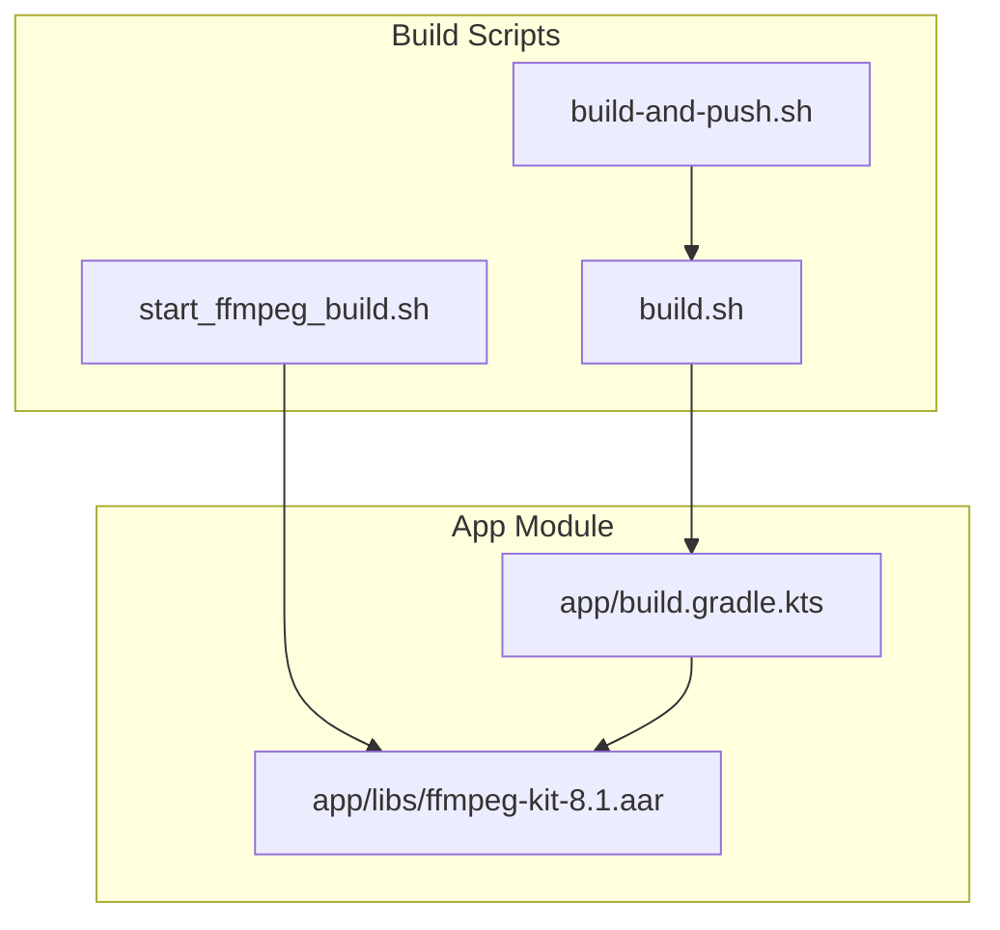
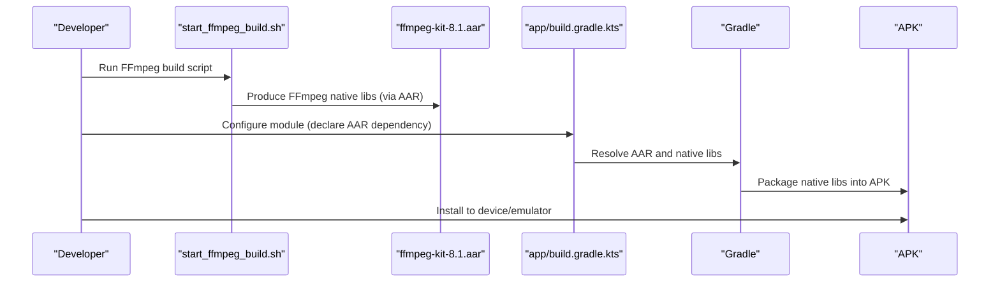
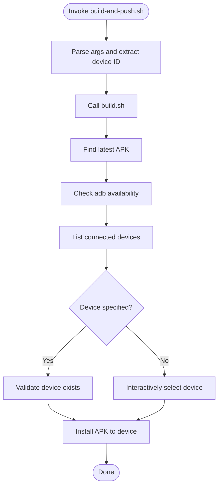
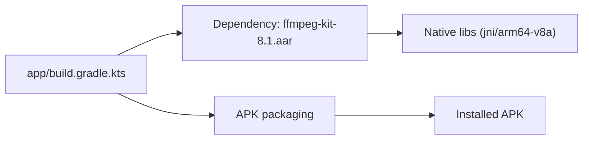

# Native Compilation

<cite>
**Referenced Files in This Document**
- [start_ffmpeg_build.sh](file://start_ffmpeg_build.sh)
- [build.sh](file://build.sh)
- [build-and-push.sh](file://build-and-push.sh)
- [app/build.gradle.kts](file://app/build.gradle.kts)
- [app/libs/ffmpeg-kit-8.1.aar](file://app/libs/ffmpeg-kit-8.1.aar)
- [docs/swresample-crash-analysis.md](file://docs/swresample-crash-analysis.md)
</cite>

## Table of Contents
1. [Introduction](#introduction)
2. [Project Structure](#project-structure)
3. [Core Components](#core-components)
4. [Architecture Overview](#architecture-overview)
5. [Detailed Component Analysis](#detailed-component-analysis)
6. [Dependency Analysis](#dependency-analysis)
7. [Performance Considerations](#performance-considerations)
8. [Troubleshooting Guide](#troubleshooting-guide)
9. [Conclusion](#conclusion)

## Introduction
This document explains the native compilation processes used in StreamClip to build and distribute FFmpeg-related native libraries for Android. It focuses on:
- The FFmpeg native library build script and its configuration flags
- The Gradle/AAPT-based build pipeline that packages prebuilt native binaries into the app
- The jniLibs directory structure and how native libraries are organized per ABI
- Practical customization tips for compilation flags, encoder/filter inclusion, and troubleshooting common build issues
- How build-time choices influence runtime performance, APK size, and device compatibility

## Project Structure
StreamClip integrates FFmpeg via a prebuilt AAR artifact. The repository includes:
- A top-level FFmpeg build script that configures and compiles FFmpeg for Android
- A Gradle build script that declares the AAR dependency and controls packaging
- A convenience build-and-push script that builds the app and installs it to a device/emulator
- Documentation that highlights critical compiler/linker flags impacting stability and performance

**Diagram sources**
- [start_ffmpeg_build.sh](file://start_ffmpeg_build.sh)
- [build.sh](file://build.sh)
- [build-and-push.sh](file://build-and-push.sh)
- [app/build.gradle.kts](file://app/build.gradle.kts)
- [app/libs/ffmpeg-kit-8.1.aar](file://app/libs/ffmpeg-kit-8.1.aar)

**Section sources**
- [start_ffmpeg_build.sh](file://start_ffmpeg_build.sh)
- [build.sh](file://build.sh)
- [build-and-push.sh](file://build-and-push.sh)
- [app/build.gradle.kts](file://app/build.gradle.kts)
- [app/libs/ffmpeg-kit-8.1.aar](file://app/libs/ffmpeg-kit-8.1.aar)

## Core Components
- FFmpeg build script: Configures and compiles FFmpeg for Android with selected codecs and APIs. It sets Android SDK/NDK roots and passes flags for GPL, encoders, and API level.
- Gradle build: Declares the FFmpeg Kit AAR dependency and enables minification/shrinking for release builds.
- Build-and-push script: Wraps the Gradle build, finds the generated APK, aligns/signs it (for release), and installs to a connected device.

Key responsibilities:
- start_ffmpeg_build.sh: Orchestrates FFmpeg native build with specific feature flags and target API level
- build.sh: Drives Gradle tasks, manages signing and alignment for release builds, and produces the final APK
- build-and-push.sh: Builds the app and installs to a device/emulator for quick testing
- app/build.gradle.kts: Declares the AAR dependency and build type configuration
- app/libs/ffmpeg-kit-8.1.aar: Prebuilt FFmpeg Kit artifact containing native libraries

**Section sources**
- [start_ffmpeg_build.sh](file://start_ffmpeg_build.sh)
- [build.sh](file://build.sh)
- [build-and-push.sh](file://build-and-push.sh)
- [app/build.gradle.kts](file://app/build.gradle.kts)
- [app/libs/ffmpeg-kit-8.1.aar](file://app/libs/ffmpeg-kit-8.1.aar)

## Architecture Overview
The native compilation pipeline integrates external native builds with the Android Gradle build system. FFmpeg is built separately and packaged into an AAR, which the app module consumes as a dependency. The Gradle build then packages the AAR’s native libraries alongside Kotlin/Java code into the final APK.

**Diagram sources**
- [start_ffmpeg_build.sh](file://start_ffmpeg_build.sh)
- [app/build.gradle.kts](file://app/build.gradle.kts)
- [app/libs/ffmpeg-kit-8.1.aar](file://app/libs/ffmpeg-kit-8.1.aar)

## Detailed Component Analysis

### FFmpeg Native Build Script (start_ffmpeg_build.sh)
Purpose:
- Configure and compile FFmpeg for Android with specific features and target API level
- Set Android SDK/NDK environment variables
- Disable legacy ABIs to focus on modern ARM64

Key behaviors:
- Sets ANDROID_SDK_ROOT and ANDROID_NDK_ROOT
- Invokes the FFmpeg Kit Android build helper with flags enabling Android Media Codec, GPL, x264/x265, LTS, and API level
- Disables legacy ABIs (ARMv7, x86, x86_64) to streamline the build

Optimization and configuration notes:
- The script demonstrates a minimal FFmpeg configuration tailored for Android
- For production builds, consider adding explicit compiler/linker flags to improve performance and reduce binary size (see Troubleshooting Guide)

Practical customization examples (conceptual):
- Add encoder/decoder features by extending the feature flags passed to the build helper
- Adjust API level to match app’s minSdk
- Integrate additional filters or muxers as needed

**Section sources**
- [start_ffmpeg_build.sh](file://start_ffmpeg_build.sh)

### Gradle Build and Packaging (app/build.gradle.kts)
Purpose:
- Declare the FFmpeg Kit AAR dependency
- Control minification and resource shrinking for release builds
- Define product flavors and build types

Key behaviors:
- Declares the AAR dependency for FFmpeg Kit
- Enables minify and shrink resources by default for release builds
- Defines product flavors (full/github/store) and build types (debug/release)

Packaging implications:
- The AAR contains prebuilt native libraries; Gradle will package them into the APK according to the selected ABI filter

**Section sources**
- [app/build.gradle.kts](file://app/build.gradle.kts)

### Build-and-Push Workflow (build-and-push.sh)
Purpose:
- Automate the end-to-end process: build → locate APK → install to device/emulator

Key behaviors:
- Parses arguments to pass through to build.sh
- Calls build.sh to produce the APK
- Locates the latest APK, checks for adb availability, lists devices, selects one, and installs the APK

Operational flow:

**Diagram sources**
- [build-and-push.sh](file://build-and-push.sh)

**Section sources**
- [build-and-push.sh](file://build-and-push.sh)

### JNI Libraries Packaging and Distribution
Current state:
- The repository includes an AAR that contains native libraries for specific ABIs
- The AAR manifest indicates presence of native libraries under jni/arm64-v8a

Implications:
- The app’s Gradle build will package the AAR’s native libraries into the APK
- The build-and-push script installs the resulting APK, which includes the native libraries

Note:
- The project’s build scripts currently target ARM64 only, so only arm64-v8a is produced and packaged

**Section sources**
- [app/libs/ffmpeg-kit-8.1.aar](file://app/libs/ffmpeg-kit-8.1.aar)

## Dependency Analysis
The app depends on a prebuilt FFmpeg Kit AAR. The Gradle build resolves this dependency and packages the included native libraries into the APK. The build-and-push script orchestrates the entire process from build to installation.

**Diagram sources**
- [app/build.gradle.kts](file://app/build.gradle.kts)
- [app/libs/ffmpeg-kit-8.1.aar](file://app/libs/ffmpeg-kit-8.1.aar)

**Section sources**
- [app/build.gradle.kts](file://app/build.gradle.kts)
- [app/libs/ffmpeg-kit-8.1.aar](file://app/libs/ffmpeg-kit-8.1.aar)

## Performance Considerations
- Compiler/linker flags: Adding optimization flags (e.g., architecture-specific flags, strict aliasing, section garbage collection) can reduce binary size and improve runtime performance. See the Troubleshooting Guide for recommended flags.
- Minification/shrinking: Enabled by default for release builds; consider disabling for debugging or when investigating native crashes.
- ABI targeting: Building only for ARM64 reduces APK size and simplifies distribution while maintaining broad device coverage on modern Android devices.

[No sources needed since this section provides general guidance]

## Troubleshooting Guide

Common issues and resolutions:
- Missing dependencies or toolchain problems
  - Ensure ANDROID_SDK_ROOT and ANDROID_NDK_ROOT are correctly set in the FFmpeg build script
  - Verify that the Android NDK version supports the configured API level
- Architecture-specific build errors
  - Confirm that only ARM64 is targeted if the AAR only contains arm64-v8a
  - Validate that the selected API level matches the app’s minSdk
- Runtime instability (e.g., native crashes in audio resampling)
  - Review the documented analysis of swresample crashes and the importance of compiler/linker flags
  - Consider adding missing optimization flags to stabilize NEON-generated code paths

Practical steps:
- Rebuild FFmpeg with recommended flags (see below)
- Temporarily disable minification/shrinking to isolate native issues
- Test on devices/emulators with varying hardware capabilities to reproduce edge-case failures

Recommended compiler/linker flags (conceptual):
- Architecture flags: e.g., -march=armv8-a
- Optimization flags: e.g., -O2 or -O3, -Os
- Strict aliasing: -fstrict-aliasing
- Section garbage collection: -Wl,--gc-sections
- Platform macros: -DANDROID -D__ANDROID__ -D__ANDROID_MIN_SDK_VERSION__=24
- Function/data sections: -ffunction-sections -fdata-sections

Evidence and rationale:
- The swresample crash analysis documents missing flags and their impact on NEON code generation and memory alignment
- The analysis links specific assembly routines and CPU capability detection that can trigger crashes when compiled without proper flags

**Section sources**
- [docs/swresample-crash-analysis.md](file://docs/swresample-crash-analysis.md)

## Conclusion
StreamClip’s native compilation relies on a prebuilt FFmpeg Kit AAR integrated via Gradle. The build pipeline is streamlined by:
- A dedicated FFmpeg build script that configures Android-specific features and targets ARM64
- A Gradle module that declares the AAR and packages native libraries into the APK
- An automation script that builds, signs, and installs the app for quick iteration

For robustness and optimal performance:
- Supplement the FFmpeg build with recommended compiler/linker flags
- Keep ABI targeting aligned with the app’s minSdk and device support matrix
- Use minification/shrinking judiciously during development and testing

[No sources needed since this section summarizes without analyzing specific files]