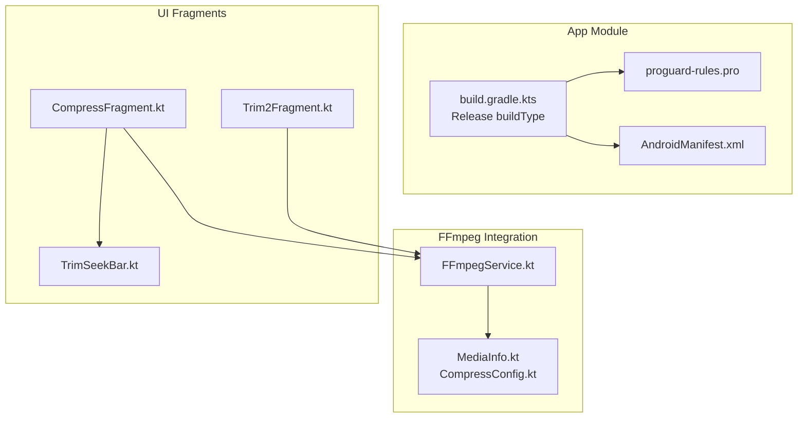
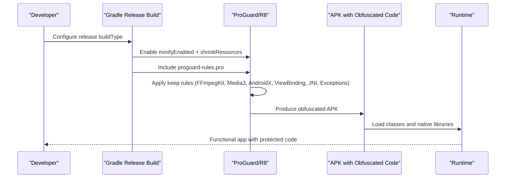
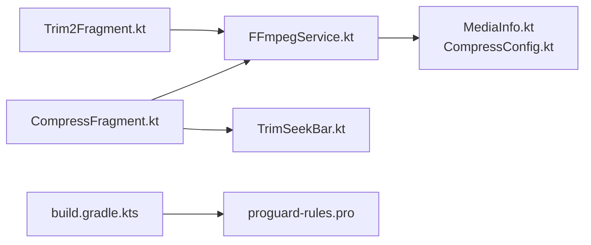

# ProGuard and Code Obfuscation

<cite>
**Referenced Files in This Document**
- [proguard-rules.pro](file://app/proguard-rules.pro)
- [build.gradle.kts](file://app/build.gradle.kts)
- [FFmpegService.kt](file://app/src/main/java/com/pisces312/streamclip/service/FFmpegService.kt)
- [CompressFragment.kt](file://app/src/main/java/com/pisces312/streamclip/fragment/CompressFragment.kt)
- [Trim2Fragment.kt](file://app/src/main/java/com/pisces312/streamclip/fragment/Trim2Fragment.kt)
- [MediaInfo.kt](file://app/src/main/java/com/pisces312/streamclip/model/MediaInfo.kt)
- [CompressConfig.kt](file://app/src/main/java/com/pisces312/streamclip/model/CompressConfig.kt)
- [TrimSeekBar.kt](file://app/src/main/java/com/pisces312/streamclip/ui/TrimSeekBar.kt)
- [AndroidManifest.xml](file://app/src/main/AndroidManifest.xml)
</cite>

## Table of Contents
1. [Introduction](#introduction)
2. [Project Structure](#project-structure)
3. [Core Components](#core-components)
4. [Architecture Overview](#architecture-overview)
5. [Detailed Component Analysis](#detailed-component-analysis)
6. [Dependency Analysis](#dependency-analysis)
7. [Performance Considerations](#performance-considerations)
8. [Troubleshooting Guide](#troubleshooting-guide)
9. [Conclusion](#conclusion)
10. [Appendices](#appendices)

## Introduction
This document explains the ProGuard and code obfuscation configuration for StreamClip with a focus on protecting application code and native libraries. It covers the proguard-rules.pro configuration, the Gradle build settings that enable code shrinking, obfuscation, and optimization, and the specific keep rules needed for FFmpeg integration, fragment classes, and Android framework components. It also provides guidance on balancing protection with functionality, testing strategies for obfuscated builds, and practical examples for adding new keep rules and debugging obfuscation issues.

## Project Structure
The obfuscation-related configuration is primarily located in:
- app/proguard-rules.pro: Custom keep rules for third-party libraries, reflection, and JNI.
- app/build.gradle.kts: Build types and ProGuard configuration enabling minification and resource shrinking.
- app/src/main/java/com/pisces312/streamclip/service/FFmpegService.kt: Core FFmpeg integration used by fragments.
- app/src/main/java/com/pisces312/streamclip/fragment/*: UI fragments that call FFmpegService and rely on reflection/view binding.
- app/src/main/java/com/pisces312/streamclip/model/*: Data classes used by FFmpegService and UI.
- app/src/main/java/com/pisces312/streamclip/ui/TrimSeekBar.kt: UI component with constructors and attributes used by layouts.
- app/src/main/AndroidManifest.xml: Application and service declarations.

**Diagram sources**
- [build.gradle.kts:18-30](file://app/build.gradle.kts#L18-L30)
- [proguard-rules.pro:1-32](file://app/proguard-rules.pro#L1-L32)
- [FFmpegService.kt:19-420](file://app/src/main/java/com/pisces312/streamclip/service/FFmpegService.kt#L19-L420)
- [CompressFragment.kt:40-839](file://app/src/main/java/com/pisces312/streamclip/fragment/CompressFragment.kt#L40-L839)
- [Trim2Fragment.kt:31-286](file://app/src/main/java/com/pisces312/streamclip/fragment/Trim2Fragment.kt#L31-L286)
- [MediaInfo.kt:5-165](file://app/src/main/java/com/pisces312/streamclip/model/MediaInfo.kt#L5-L165)
- [CompressConfig.kt:3-209](file://app/src/main/java/com/pisces312/streamclip/model/CompressConfig.kt#L3-L209)
- [TrimSeekBar.kt:20-238](file://app/src/main/java/com/pisces312/streamclip/ui/TrimSeekBar.kt#L20-L238)
- [AndroidManifest.xml:27-139](file://app/src/main/AndroidManifest.xml#L27-L139)

**Section sources**
- [build.gradle.kts:18-30](file://app/build.gradle.kts#L18-L30)
- [proguard-rules.pro:1-32](file://app/proguard-rules.pro#L1-L32)
- [AndroidManifest.xml:27-139](file://app/src/main/AndroidManifest.xml#L27-L139)

## Core Components
- ProGuard rules file defines:
  - FFmpegKit and Media3 keep rules.
  - AndroidX keep rules.
  - Kotlin coroutines keep rules for reflection-safe dispatchers.
  - ViewBinding keep rules for generated binding classes.
  - JNI/native method keep rules.
  - Exception base class keep rules for crash reporting.
- Build configuration enables minification and resource shrinking in the release build type and references the custom rules file.

Key implications:
- FFmpegService is used extensively by UI fragments and must remain accessible to the runtime.
- ViewBinding-generated classes must be preserved to avoid runtime binding failures.
- Kotlin coroutines internals must be kept to support dispatcher factories and exception handlers.
- JNI/native methods must be preserved to ensure native library loading and invocation succeed.

**Section sources**
- [proguard-rules.pro:1-32](file://app/proguard-rules.pro#L1-L32)
- [build.gradle.kts:22-29](file://app/build.gradle.kts#L22-L29)

## Architecture Overview
The obfuscation pipeline integrates with the release build to shrink code, remove unused resources, and rename identifiers. The FFmpegService orchestrates FFmpegKit commands invoked by UI fragments. The keep rules ensure that:
- FFmpegKit and Media3 classes remain accessible.
- ViewBinding classes are preserved.
- Kotlin coroutines internals are kept.
- JNI/native methods are preserved.
- Exceptions are preserved for crash reporting.

**Diagram sources**
- [build.gradle.kts:22-29](file://app/build.gradle.kts#L22-L29)
- [proguard-rules.pro:1-32](file://app/proguard-rules.pro#L1-L32)

## Detailed Component Analysis

### FFmpegService and FFmpeg Integration
FFmpegService is the central component that executes FFmpegKit commands and exposes progress/log callbacks. It is consumed by UI fragments and must remain accessible post-obfuscation.

- FFmpegService is an object with public methods and data classes used by UI.
- It relies on FFmpegKit and FFprobeKit for media probing and command execution.
- It uses coroutines and statistics callbacks, which require reflection-safe keep rules.

Recommended keep rules for FFmpegService:
- Keep FFmpegKit and FFprobeKit packages.
- Keep FFmpegService and its nested data classes.
- Keep coroutines dispatcher and exception handler classes referenced by the service.

Practical example:
- Add a keep rule for FFmpegService and its nested classes to prevent renaming.
- Add keep rules for FFmpegKit/FFprobeKit classes used by the service.

**Section sources**
- [FFmpegService.kt:19-420](file://app/src/main/java/com/pisces312/streamclip/service/FFmpegService.kt#L19-L420)
- [proguard-rules.pro:3-5](file://app/proguard-rules.pro#L3-L5)

### Fragment Classes and ViewBinding
UI fragments depend on ViewBinding-generated classes and may use reflection for UI interactions. The keep rules ensure ViewBinding classes are preserved.

- CompressFragment.kt uses FragmentCompressBinding and interacts with FFmpegService.
- Trim2Fragment.kt uses FragmentTrim2Binding and interacts with FFmpegService.
- Both fragments rely on ViewBinding classes generated from layout files.

Recommended keep rules for fragments:
- Keep ViewBinding classes to prevent runtime binding failures.
- Keep fragment classes and their inner interfaces used by UI.

Practical example:
- Ensure ViewBinding keep rule remains active to preserve generated binding classes.

**Section sources**
- [CompressFragment.kt:40-839](file://app/src/main/java/com/pisces312/streamclip/fragment/CompressFragment.kt#L40-L839)
- [Trim2Fragment.kt:31-286](file://app/src/main/java/com/pisces312/streamclip/fragment/Trim2Fragment.kt#L31-L286)
- [proguard-rules.pro:19-23](file://app/proguard-rules.pro#L19-L23)

### Android Framework Components and Kotlin Coroutines
Kotlin coroutines and AndroidX components require specific keep rules to avoid reflection failures and ensure dispatcher factories and exception handlers remain accessible.

- Coroutines keep rules preserve MainDispatcherFactory and CoroutineExceptionHandler.
- AndroidX keep rules preserve androidx.* classes.

Recommended keep rules:
- Keep coroutines dispatcher factory and exception handler classes.
- Keep AndroidX classes to avoid runtime reflection failures.

**Section sources**
- [proguard-rules.pro:15-17](file://app/proguard-rules.pro#L15-L17)
- [proguard-rules.pro:11-13](file://app/proguard-rules.pro#L11-L13)

### JNI/Native Methods and Native Library Loading
JNI/native method keep rules ensure native libraries are loaded and invoked correctly after obfuscation.

- Preserve native methods in classes that interact with native libraries.
- Ensure native library loading paths and JNI entry points remain intact.

Recommended keep rules:
- Keep native methods in classes that use JNI.
- Verify native library loading logic remains accessible.

**Section sources**
- [proguard-rules.pro:25-28](file://app/proguard-rules.pro#L25-L28)

### Exceptions and Crash Reporting
Exception base classes must be preserved to ensure crash logs are meaningful and actionable.

- Keep public classes extending java.lang.Exception.
- Ensure stack traces retain useful class names for debugging.

**Section sources**
- [proguard-rules.pro:30-31](file://app/proguard-rules.pro#L30-L31)

### Model Classes Used by FFmpegService
Model classes used by FFmpegService (e.g., MediaInfo, CompressConfig) should be kept to avoid reflection or serialization issues.

- Keep data classes used by FFmpegService and UI.
- Ensure JSON parsing and serialization continue to work post-obfuscation.

**Section sources**
- [MediaInfo.kt:5-165](file://app/src/main/java/com/pisces312/streamclip/model/MediaInfo.kt#L5-L165)
- [CompressConfig.kt:3-209](file://app/src/main/java/com/pisces312/streamclip/model/CompressConfig.kt#L3-L209)

### UI Component with Constructors and Attributes
TrimSeekBar demonstrates typical UI component usage with constructors and attributes. While not directly using JNI, it illustrates the importance of keeping constructors and attributes accessible for layout inflation.

- Keep TrimSeekBar class and its constructors to ensure layout inflation succeeds.
- Ensure attributes and interfaces remain accessible.

**Section sources**
- [TrimSeekBar.kt:20-238](file://app/src/main/java/com/pisces312/streamclip/ui/TrimSeekBar.kt#L20-L238)

## Dependency Analysis
The obfuscation configuration depends on:
- FFmpegKit and Media3 libraries declared in dependencies.
- ViewBinding enabled in build features.
- Kotlin coroutines used by FFmpegService.
- AndroidX components used by fragments and UI.

**Diagram sources**
- [FFmpegService.kt:19-420](file://app/src/main/java/com/pisces312/streamclip/service/FFmpegService.kt#L19-L420)
- [CompressFragment.kt:40-839](file://app/src/main/java/com/pisces312/streamclip/fragment/CompressFragment.kt#L40-L839)
- [Trim2Fragment.kt:31-286](file://app/src/main/java/com/pisces312/streamclip/fragment/Trim2Fragment.kt#L31-L286)
- [MediaInfo.kt:5-165](file://app/src/main/java/com/pisces312/streamclip/model/MediaInfo.kt#L5-L165)
- [CompressConfig.kt:3-209](file://app/src/main/java/com/pisces312/streamclip/model/CompressConfig.kt#L3-L209)
- [TrimSeekBar.kt:20-238](file://app/src/main/java/com/pisces312/streamclip/ui/TrimSeekBar.kt#L20-L238)
- [proguard-rules.pro:1-32](file://app/proguard-rules.pro#L1-L32)
- [build.gradle.kts:64-84](file://app/build.gradle.kts#L64-L84)

**Section sources**
- [build.gradle.kts:64-84](file://app/build.gradle.kts#L64-L84)
- [proguard-rules.pro:1-32](file://app/proguard-rules.pro#L1-L32)

## Performance Considerations
- App size reduction: Enabling minification and resource shrinking reduces APK size by removing unused code and resources.
- Runtime performance: Obfuscation introduces minimal overhead; the primary cost is during build time.
- Compatibility: Keep rules ensure runtime reflection and native library loading continue to work across Android versions.

[No sources needed since this section provides general guidance]

## Troubleshooting Guide
Common obfuscation issues and resolutions:
- Missing classes after obfuscation:
  - Cause: Overly aggressive shrinking removed essential classes.
  - Resolution: Add keep rules for FFmpegService, FFmpegKit, Media3, and model classes.
- Reflection failures with dynamic components:
  - Cause: Reflection-based code cannot resolve renamed classes.
  - Resolution: Keep coroutines dispatcher and exception handler classes; ensure ViewBinding classes are preserved.
- Native library loading issues:
  - Cause: Native method signatures changed or stripped.
  - Resolution: Keep native methods and ensure native library loading paths remain accessible.

Testing strategies for obfuscated builds:
- Build a release variant with minification enabled and test core flows (compress, trim, extract).
- Monitor crash reports and adjust keep rules as needed.
- Validate UI binding and fragment navigation after obfuscation.

**Section sources**
- [proguard-rules.pro:1-32](file://app/proguard-rules.pro#L1-L32)
- [build.gradle.kts:22-29](file://app/build.gradle.kts#L22-L29)

## Conclusion
StreamClip’s obfuscation configuration balances strong code protection with functional integrity by preserving FFmpegKit, Media3, AndroidX, ViewBinding, Kotlin coroutines, JNI/native methods, and exception classes. The recommended keep rules ensure FFmpegService remains accessible, UI fragments operate correctly, and native libraries load without issues. Testing obfuscated builds and iterating on keep rules is essential for maintaining compatibility across Android versions.

[No sources needed since this section summarizes without analyzing specific files]

## Appendices

### Practical Examples

- Adding a new keep rule for a FFmpegService-related class:
  - Identify the class used by FFmpegService or UI.
  - Add a keep rule in proguard-rules.pro to preserve the class and its members.
  - Rebuild the release variant and test.

- Debugging reflection failures:
  - Confirm coroutines dispatcher and exception handler classes are kept.
  - Verify ViewBinding classes are preserved.
  - Re-run with verbose logging to inspect class renames.

- Optimizing the obfuscation process:
  - Keep minification enabled for release.
  - Use shrinkResources to reduce APK size.
  - Add targeted keep rules only for essential classes to minimize retention.

**Section sources**
- [proguard-rules.pro:1-32](file://app/proguard-rules.pro#L1-L32)
- [build.gradle.kts:22-29](file://app/build.gradle.kts#L22-L29)