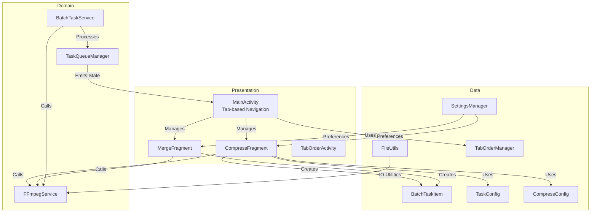
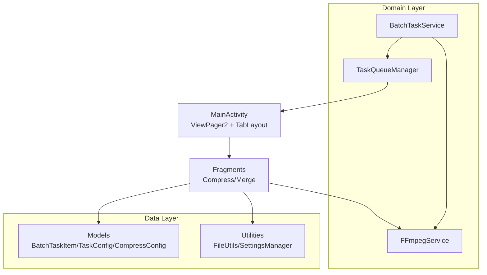
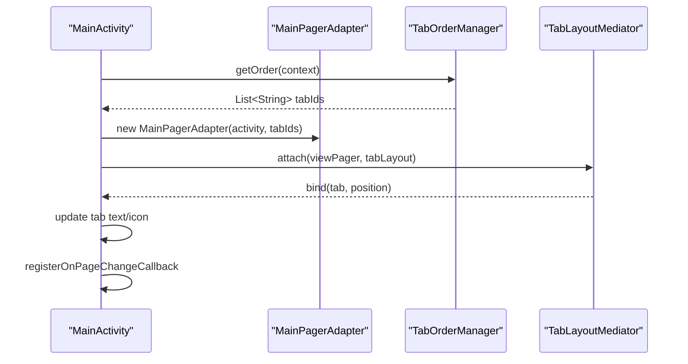
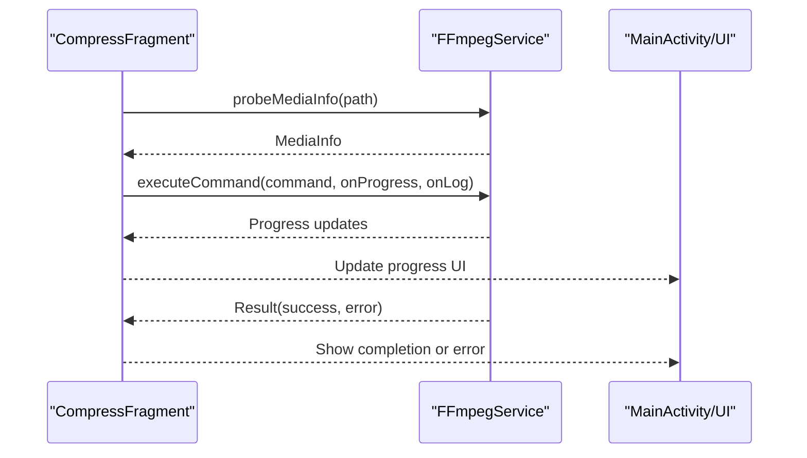
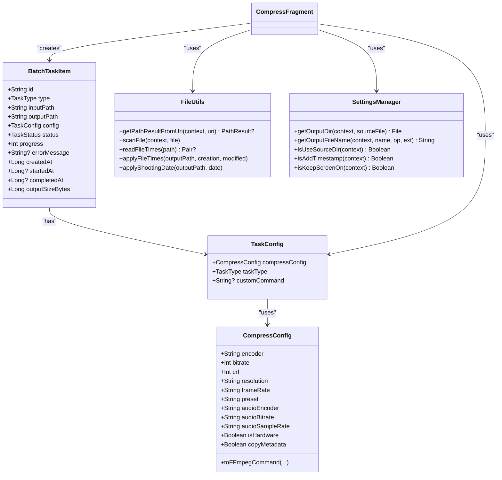
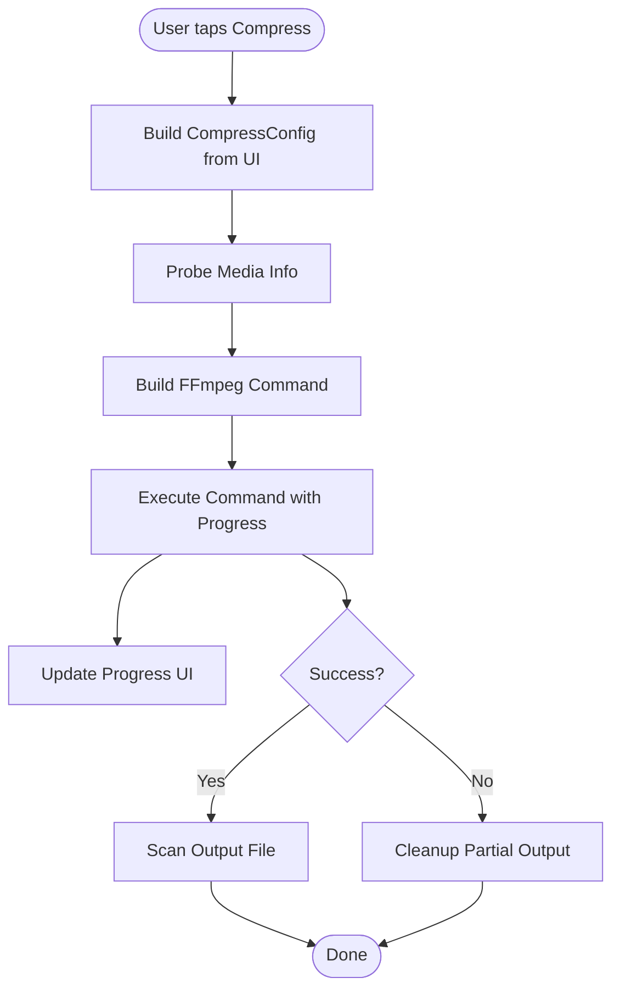
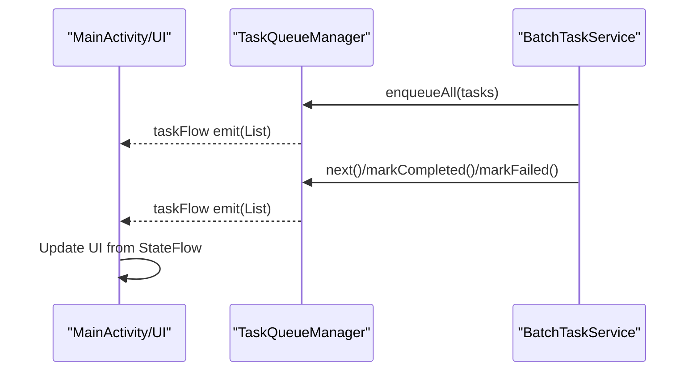
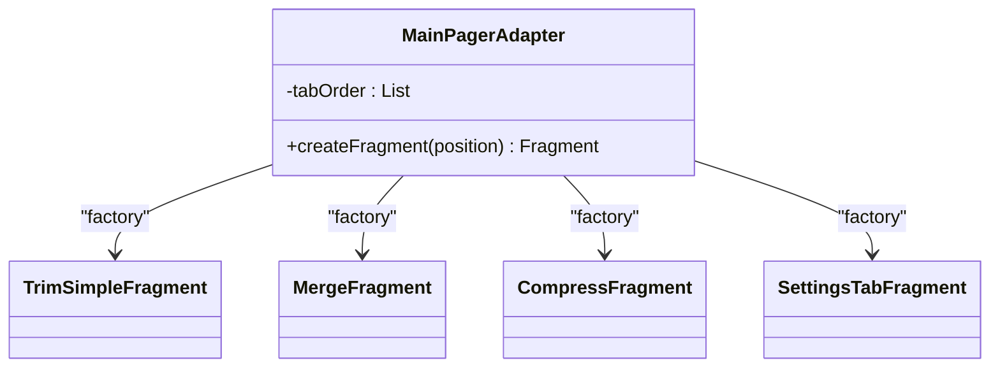
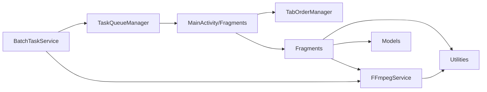

# Application Layering

<cite>
**Referenced Files in This Document**
- [MainActivity.kt](file://app/src/main/java/com/pisces312/streamclip/MainActivity.kt)
- [BaseActivity.kt](file://app/src/main/java/com/pisces312/streamclip/BaseActivity.kt)
- [MainPagerAdapter.kt](file://app/src/main/java/com/pisces312/streamclip/adapter/MainPagerAdapter.kt)
- [TabOrderManager.kt](file://app/src/main/java/com/pisces312/streamclip/util/TabOrderManager.kt)
- [CompressFragment.kt](file://app/src/main/java/com/pisces312/streamclip/fragment/CompressFragment.kt)
- [MergeFragment.kt](file://app/src/main/java/com/pisces312/streamclip/fragment/MergeFragment.kt)
- [FFmpegService.kt](file://app/src/main/java/com/pisces312/streamclip/service/FFmpegService.kt)
- [BatchTaskService.kt](file://app/src/main/java/com/pisces312/streamclip/service/BatchTaskService.kt)
- [TaskQueueManager.kt](file://app/src/main/java/com/pisces312/streamclip/service/TaskQueueManager.kt)
- [BatchTaskItem.kt](file://app/src/main/java/com/pisces312/streamclip/model/BatchTaskItem.kt)
- [TaskConfig.kt](file://app/src/main/java/com/pisces312/streamclip/model/TaskConfig.kt)
- [CompressConfig.kt](file://app/src/main/java/com/pisces312/streamclip/model/CompressConfig.kt)
- [FileUtils.kt](file://app/src/main/java/com/pisces312/streamclip/util/FileUtils.kt)
- [SettingsManager.kt](file://app/src/main/java/com/pisces312/streamclip/util/SettingsManager.kt)
- [TabOrderActivity.kt](file://app/src/main/java/com/pisces312/streamclip/ui/TabOrderActivity.kt)
</cite>

## Table of Contents
1. [Introduction](#introduction)
2. [Project Structure](#project-structure)
3. [Core Components](#core-components)
4. [Architecture Overview](#architecture-overview)
5. [Detailed Component Analysis](#detailed-component-analysis)
6. [Dependency Analysis](#dependency-analysis)
7. [Performance Considerations](#performance-considerations)
8. [Troubleshooting Guide](#troubleshooting-guide)
9. [Conclusion](#conclusion)

## Introduction
This document explains StreamClip’s application layering architecture grounded in Clean Architecture principles. The application is organized into three primary layers:
- Presentation layer: Activities and Fragments that manage UI, navigation, and user interactions.
- Domain layer: Service classes that encapsulate business logic and orchestrate operations.
- Data layer: Models and utilities that represent data structures and provide supporting utilities.

We focus on how MainActivity orchestrates tab-based navigation via ViewPager2 and TabLayout, how BaseActivity centralizes cross-cutting concerns, how fragments implement domain logic, and how services coordinate FFmpeg operations and batch processing. We also highlight architectural patterns such as Repository-like centralized data access, Factory pattern for fragment creation, and Observer pattern for state management.

## Project Structure
The application follows a feature-based package structure with clear separation of concerns:
- Presentation: Activities and Fragments under ui and fragment packages.
- Domain: Services under service package.
- Data: Models and Utilities under model and util packages.
- Adapters: UI adapters under adapter package.

**Diagram sources**
- [MainActivity.kt:35-101](file://app/src/main/java/com/pisces312/streamclip/MainActivity.kt#L35-L101)
- [MainPagerAdapter.kt:24-38](file://app/src/main/java/com/pisces312/streamclip/adapter/MainPagerAdapter.kt#L24-L38)
- [TabOrderManager.kt:32-52](file://app/src/main/java/com/pisces312/streamclip/util/TabOrderManager.kt#L32-L52)
- [CompressFragment.kt:452-570](file://app/src/main/java/com/pisces312/streamclip/fragment/CompressFragment.kt#L452-L570)
- [MergeFragment.kt:135-232](file://app/src/main/java/com/pisces312/streamclip/fragment/MergeFragment.kt#L135-L232)
- [FFmpegService.kt:152-241](file://app/src/main/java/com/pisces312/streamclip/service/FFmpegService.kt#L152-L241)
- [BatchTaskService.kt:92-165](file://app/src/main/java/com/pisces312/streamclip/service/BatchTaskService.kt#L92-L165)
- [TaskQueueManager.kt:24-42](file://app/src/main/java/com/pisces312/streamclip/service/TaskQueueManager.kt#L24-L42)
- [BatchTaskItem.kt:5-18](file://app/src/main/java/com/pisces312/streamclip/model/BatchTaskItem.kt#L5-L18)
- [TaskConfig.kt:5-9](file://app/src/main/java/com/pisces312/streamclip/model/TaskConfig.kt#L5-L9)
- [CompressConfig.kt:21-114](file://app/src/main/java/com/pisces312/streamclip/model/CompressConfig.kt#L21-L114)
- [FileUtils.kt:30-118](file://app/src/main/java/com/pisces312/streamclip/util/FileUtils.kt#L30-L118)
- [SettingsManager.kt:67-92](file://app/src/main/java/com/pisces312/streamclip/util/SettingsManager.kt#L67-L92)
- [TabOrderActivity.kt:44-86](file://app/src/main/java/com/pisces312/streamclip/ui/TabOrderActivity.kt#L44-L86)

**Section sources**
- [MainActivity.kt:35-101](file://app/src/main/java/com/pisces312/streamclip/MainActivity.kt#L35-L101)
- [MainPagerAdapter.kt:24-38](file://app/src/main/java/com/pisces312/streamclip/adapter/MainPagerAdapter.kt#L24-L38)
- [TabOrderManager.kt:32-52](file://app/src/main/java/com/pisces312/streamclip/util/TabOrderManager.kt#L32-L52)

## Core Components
- Presentation layer
  - MainActivity: Orchestrates ViewPager2 and TabLayout, handles permissions, version display, and menu actions. It applies language localization via BaseActivity and manages tab ordering through TabOrderManager.
  - BaseActivity: Base class that applies locale changes early in the lifecycle.
  - TabOrderActivity: Manages user-configurable tab order persisted by TabOrderManager.
  - Fragments (CompressFragment, MergeFragment): Implement domain logic for compression and merging, including UI state, progress reporting, and invoking FFmpegService.

- Domain layer
  - FFmpegService: Centralized media processing service exposing probing, trimming, merging, extracting, and compression operations with progress and logging callbacks.
  - BatchTaskService: Foreground service that enqueues and executes BatchTaskItem tasks, manages retries, progress notifications, and cancellation.
  - TaskQueueManager: Centralized state holder for batch tasks using Kotlin Flows to emit updates.

- Data layer
  - Models: BatchTaskItem, TaskConfig, TaskResult, BatchSummary, CompressConfig define the data contracts.
  - Utilities: FileUtils provides path resolution, scanning, and file time manipulation; SettingsManager persists user preferences; TabOrderManager persists tab order.

**Section sources**
- [BaseActivity.kt:8-13](file://app/src/main/java/com/pisces312/streamclip/BaseActivity.kt#L8-L13)
- [TabOrderActivity.kt:44-86](file://app/src/main/java/com/pisces312/streamclip/ui/TabOrderActivity.kt#L44-L86)
- [CompressFragment.kt:452-570](file://app/src/main/java/com/pisces312/streamclip/fragment/CompressFragment.kt#L452-L570)
- [MergeFragment.kt:135-232](file://app/src/main/java/com/pisces312/streamclip/fragment/MergeFragment.kt#L135-L232)
- [FFmpegService.kt:19-147](file://app/src/main/java/com/pisces312/streamclip/service/FFmpegService.kt#L19-L147)
- [BatchTaskService.kt:26-64](file://app/src/main/java/com/pisces312/streamclip/service/BatchTaskService.kt#L26-L64)
- [TaskQueueManager.kt:10-30](file://app/src/main/java/com/pisces312/streamclip/service/TaskQueueManager.kt#L10-L30)
- [BatchTaskItem.kt:5-18](file://app/src/main/java/com/pisces312/streamclip/model/BatchTaskItem.kt#L5-L18)
- [TaskConfig.kt:5-9](file://app/src/main/java/com/pisces312/streamclip/model/TaskConfig.kt#L5-L9)
- [CompressConfig.kt:21-114](file://app/src/main/java/com/pisces312/streamclip/model/CompressConfig.kt#L21-L114)
- [FileUtils.kt:30-118](file://app/src/main/java/com/pisces312/streamclip/util/FileUtils.kt#L30-L118)
- [SettingsManager.kt:67-92](file://app/src/main/java/com/pisces312/streamclip/util/SettingsManager.kt#L67-L92)

## Architecture Overview
Clean Architecture separates concerns into layers:
- Presentation depends on Domain abstractions (services) and reacts to state emitted by the Domain.
- Domain encapsulates business logic and coordinates with Data utilities.
- Data provides models and utilities without knowledge of UI or business rules.

**Diagram sources**
- [MainActivity.kt:62-81](file://app/src/main/java/com/pisces312/streamclip/MainActivity.kt#L62-L81)
- [CompressFragment.kt:602-680](file://app/src/main/java/com/pisces312/streamclip/fragment/CompressFragment.kt#L602-L680)
- [MergeFragment.kt:141-232](file://app/src/main/java/com/pisces312/streamclip/fragment/MergeFragment.kt#L141-L232)
- [FFmpegService.kt:152-241](file://app/src/main/java/com/pisces312/streamclip/service/FFmpegService.kt#L152-L241)
- [BatchTaskService.kt:92-165](file://app/src/main/java/com/pisces312/streamclip/service/BatchTaskService.kt#L92-L165)
- [TaskQueueManager.kt:24-42](file://app/src/main/java/com/pisces312/streamclip/service/TaskQueueManager.kt#L24-L42)

## Detailed Component Analysis

### Presentation Layer: MainActivity and Navigation
- MainActivity initializes logging, crash handling, permissions, and sets up ViewPager2 with TabLayoutMediator.
- It retrieves tab order from TabOrderManager and inflates icons and titles per tab.
- It listens to page changes to update the tab indicator and supports long-press on tabs to open TabOrderActivity.

**Diagram sources**
- [MainActivity.kt:62-81](file://app/src/main/java/com/pisces312/streamclip/MainActivity.kt#L62-L81)
- [MainPagerAdapter.kt:24-38](file://app/src/main/java/com/pisces312/streamclip/adapter/MainPagerAdapter.kt#L24-L38)
- [TabOrderManager.kt:32-52](file://app/src/main/java/com/pisces312/streamclip/util/TabOrderManager.kt#L32-L52)

**Section sources**
- [MainActivity.kt:35-101](file://app/src/main/java/com/pisces312/streamclip/MainActivity.kt#L35-L101)
- [BaseActivity.kt:8-13](file://app/src/main/java/com/pisces312/streamclip/BaseActivity.kt#L8-L13)
- [MainPagerAdapter.kt:24-38](file://app/src/main/java/com/pisces312/streamclip/adapter/MainPagerAdapter.kt#L24-L38)
- [TabOrderManager.kt:32-52](file://app/src/main/java/com/pisces312/streamclip/util/TabOrderManager.kt#L32-L52)

### Domain Layer: FFmpegService and BatchTaskService
- FFmpegService exposes:
  - Media probing (probeMediaInfo)
  - Command execution with progress and logs (executeCommand)
  - Specialized operations (trimVideo, mergeVideos, extractAudio, compressVideo, compressAudio)
- BatchTaskService:
  - Starts/stops/batches tasks via intents
  - Enqueues tasks into TaskQueueManager
  - Executes commands via FFmpegService with retries and progress updates
  - Emits foreground notifications and cleans up on failure

**Diagram sources**
- [CompressFragment.kt:368-383](file://app/src/main/java/com/pisces312/streamclip/fragment/CompressFragment.kt#L368-L383)
- [CompressFragment.kt:602-680](file://app/src/main/java/com/pisces312/streamclip/fragment/CompressFragment.kt#L602-L680)
- [FFmpegService.kt:56-147](file://app/src/main/java/com/pisces312/streamclip/service/FFmpegService.kt#L56-L147)
- [FFmpegService.kt:152-241](file://app/src/main/java/com/pisces312/streamclip/service/FFmpegService.kt#L152-L241)

**Section sources**
- [FFmpegService.kt:19-147](file://app/src/main/java/com/pisces312/streamclip/service/FFmpegService.kt#L19-L147)
- [FFmpegService.kt:152-241](file://app/src/main/java/com/pisces312/streamclip/service/FFmpegService.kt#L152-L241)
- [BatchTaskService.kt:92-165](file://app/src/main/java/com/pisces312/streamclip/service/BatchTaskService.kt#L92-L165)

### Data Layer: Models and Utilities
- Models:
  - BatchTaskItem: Encapsulates task identity, paths, configuration, status, and timestamps.
  - TaskConfig: Holds compression/audio extraction/custom command configuration.
  - CompressConfig: Converts UI selections into FFmpeg command strings.
- Utilities:
  - FileUtils: Resolves URIs to real paths, copies to cache when needed, scans files, and manipulates file times.
  - SettingsManager: Persists user preferences for output directories, timestamps, and screen-on behavior.
  - TabOrderManager: Persists and merges default tab order with user preferences.

**Diagram sources**
- [BatchTaskItem.kt:5-18](file://app/src/main/java/com/pisces312/streamclip/model/BatchTaskItem.kt#L5-L18)
- [TaskConfig.kt:5-9](file://app/src/main/java/com/pisces312/streamclip/model/TaskConfig.kt#L5-L9)
- [CompressConfig.kt:21-114](file://app/src/main/java/com/pisces312/streamclip/model/CompressConfig.kt#L21-L114)
- [FileUtils.kt:30-118](file://app/src/main/java/com/pisces312/streamclip/util/FileUtils.kt#L30-L118)
- [SettingsManager.kt:67-92](file://app/src/main/java/com/pisces312/streamclip/util/SettingsManager.kt#L67-L92)

**Section sources**
- [BatchTaskItem.kt:5-18](file://app/src/main/java/com/pisces312/streamclip/model/BatchTaskItem.kt#L5-L18)
- [TaskConfig.kt:5-9](file://app/src/main/java/com/pisces312/streamclip/model/TaskConfig.kt#L5-L9)
- [CompressConfig.kt:21-114](file://app/src/main/java/com/pisces312/streamclip/model/CompressConfig.kt#L21-L114)
- [FileUtils.kt:30-118](file://app/src/main/java/com/pisces312/streamclip/util/FileUtils.kt#L30-L118)
- [SettingsManager.kt:67-92](file://app/src/main/java/com/pisces312/streamclip/util/SettingsManager.kt#L67-L92)

### Fragment Domain Logic: Compression and Merging
- CompressFragment:
  - Builds CompressConfig from UI selections.
  - Probes media info, constructs FFmpeg command, and executes with progress/log callbacks.
  - Supports single-file and batch compression, emitting logs and updating UI.
- MergeFragment:
  - Collects multiple video URIs, resolves paths, probes compatibility, and merges via FFmpegService.mergeVideos.

**Diagram sources**
- [CompressFragment.kt:682-719](file://app/src/main/java/com/pisces312/streamclip/fragment/CompressFragment.kt#L682-L719)
- [CompressFragment.kt:602-680](file://app/src/main/java/com/pisces312/streamclip/fragment/CompressFragment.kt#L602-L680)
- [FFmpegService.kt:152-241](file://app/src/main/java/com/pisces312/streamclip/service/FFmpegService.kt#L152-L241)

**Section sources**
- [CompressFragment.kt:452-570](file://app/src/main/java/com/pisces312/streamclip/fragment/CompressFragment.kt#L452-L570)
- [CompressFragment.kt:602-680](file://app/src/main/java/com/pisces312/streamclip/fragment/CompressFragment.kt#L602-L680)
- [MergeFragment.kt:135-232](file://app/src/main/java/com/pisces312/streamclip/fragment/MergeFragment.kt#L135-L232)

### Observer Pattern: TaskQueueManager State
- TaskQueueManager maintains a synchronized queue and emits StateFlow updates for task lists.
- UI observes taskFlow to reflect progress and status changes.

**Diagram sources**
- [TaskQueueManager.kt:24-42](file://app/src/main/java/com/pisces312/streamclip/service/TaskQueueManager.kt#L24-L42)
- [BatchTaskService.kt:118-165](file://app/src/main/java/com/pisces312/streamclip/service/BatchTaskService.kt#L118-L165)

**Section sources**
- [TaskQueueManager.kt:10-30](file://app/src/main/java/com/pisces312/streamclip/service/TaskQueueManager.kt#L10-L30)
- [BatchTaskService.kt:118-165](file://app/src/main/java/com/pisces312/streamclip/service/BatchTaskService.kt#L118-L165)

### Factory Pattern: Fragment Creation
- MainPagerAdapter acts as a factory mapping tab identifiers to concrete fragment instances, enabling dynamic tab ordering and easy extension.

**Diagram sources**
- [MainPagerAdapter.kt:24-38](file://app/src/main/java/com/pisces312/streamclip/adapter/MainPagerAdapter.kt#L24-L38)

**Section sources**
- [MainPagerAdapter.kt:24-38](file://app/src/main/java/com/pisces312/streamclip/adapter/MainPagerAdapter.kt#L24-L38)

## Dependency Analysis
- Presentation depends on:
  - TabOrderManager for tab ordering
  - Fragments depend on FFmpegService and models
- Domain depends on:
  - FFmpegService for media operations
  - TaskQueueManager for state
- Data depends on:
  - Models and utilities for IO and preferences

**Diagram sources**
- [MainActivity.kt:62-81](file://app/src/main/java/com/pisces312/streamclip/MainActivity.kt#L62-L81)
- [CompressFragment.kt:602-680](file://app/src/main/java/com/pisces312/streamclip/fragment/CompressFragment.kt#L602-L680)
- [FFmpegService.kt:152-241](file://app/src/main/java/com/pisces312/streamclip/service/FFmpegService.kt#L152-L241)
- [BatchTaskService.kt:92-165](file://app/src/main/java/com/pisces312/streamclip/service/BatchTaskService.kt#L92-L165)
- [TaskQueueManager.kt:24-42](file://app/src/main/java/com/pisces312/streamclip/service/TaskQueueManager.kt#L24-L42)

**Section sources**
- [MainActivity.kt:62-81](file://app/src/main/java/com/pisces312/streamclip/MainActivity.kt#L62-L81)
- [CompressFragment.kt:602-680](file://app/src/main/java/com/pisces312/streamclip/fragment/CompressFragment.kt#L602-L680)
- [FFmpegService.kt:152-241](file://app/src/main/java/com/pisces312/streamclip/service/FFmpegService.kt#L152-L241)
- [BatchTaskService.kt:92-165](file://app/src/main/java/com/pisces312/streamclip/service/BatchTaskService.kt#L92-L165)
- [TaskQueueManager.kt:24-42](file://app/src/main/java/com/pisces312/streamclip/service/TaskQueueManager.kt#L24-L42)

## Performance Considerations
- Asynchronous execution: FFmpegService uses coroutines and async execution to avoid blocking the main thread.
- Progress callbacks: UI updates are performed on the main dispatcher to keep the interface responsive.
- Batch processing: BatchTaskService runs in a foreground service with SupervisorJob to isolate task failures and support cancellation.
- I/O optimization: FileUtils prefers direct reads when possible and caches only when necessary to reduce disk overhead.

## Troubleshooting Guide
- Permission handling: MainActivity checks storage permissions and requests appropriate permissions at runtime.
- Crash detection: MainActivity checks for crash logs and prompts the user to view logs.
- Logging: LogCollector is initialized early in MainActivity and used across services and fragments.
- File operations: FileUtils provides fallback copying and scanning to ensure media becomes discoverable.

**Section sources**
- [MainActivity.kt:455-503](file://app/src/main/java/com/pisces312/streamclip/MainActivity.kt#L455-L503)
- [MainActivity.kt:117-131](file://app/src/main/java/com/pisces312/streamclip/MainActivity.kt#L117-L131)
- [FileUtils.kt:268-275](file://app/src/main/java/com/pisces312/streamclip/util/FileUtils.kt#L268-L275)

## Conclusion
StreamClip’s Clean Architecture implementation cleanly separates presentation, domain, and data concerns. MainActivity orchestrates navigation and integrates with utilities and services, while fragments encapsulate domain logic for media operations. FFmpegService centralizes media processing, and BatchTaskService coordinates batch execution with robust state management via TaskQueueManager. Patterns like Factory (MainPagerAdapter), Repository-like centralized state (TaskQueueManager), and Observer (StateFlow) reinforce maintainability and testability.