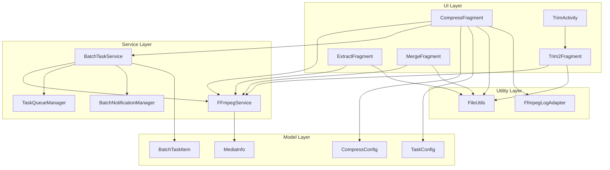
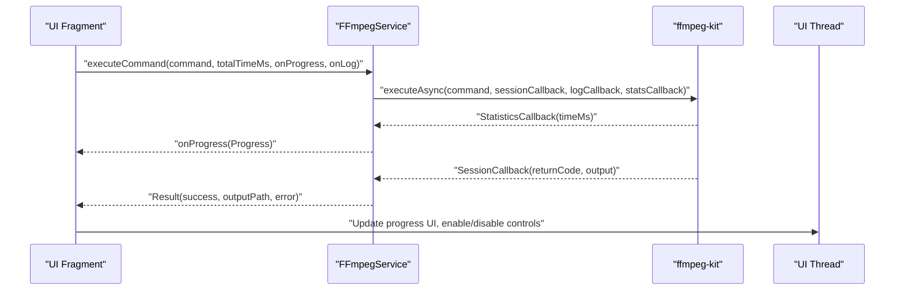
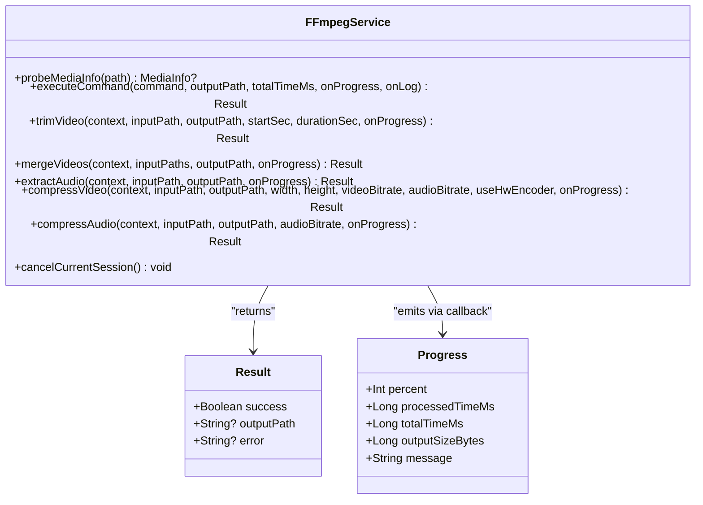
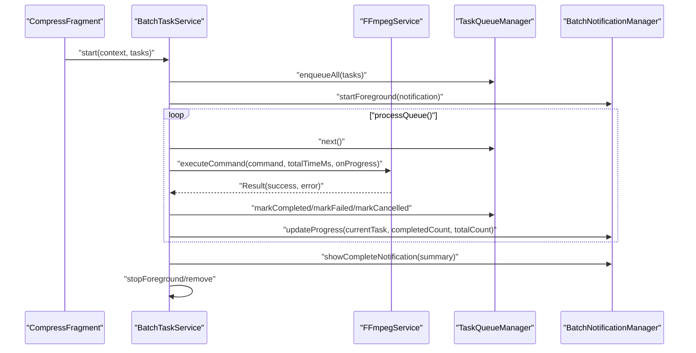
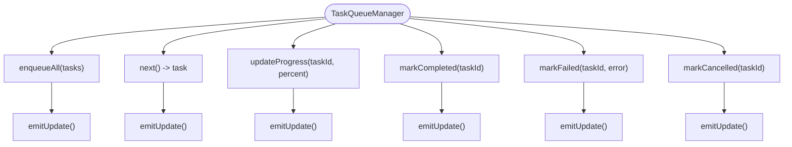
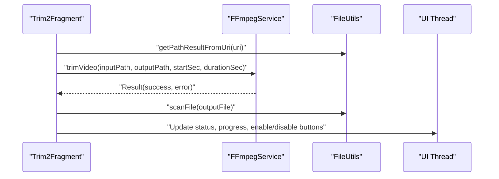
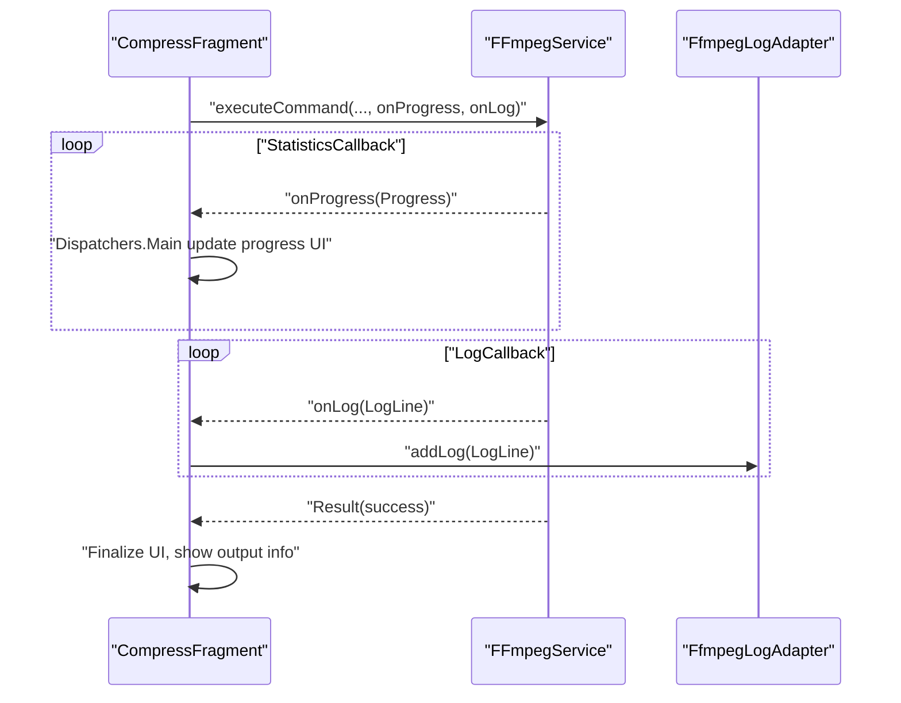
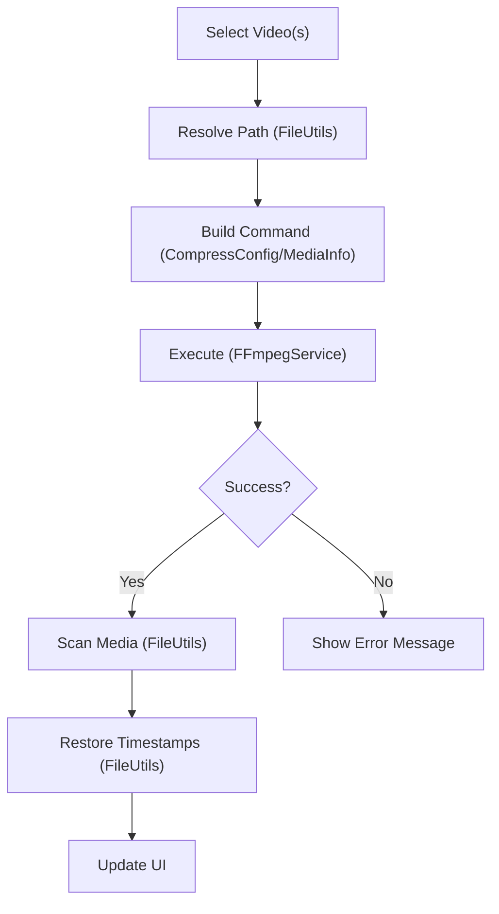
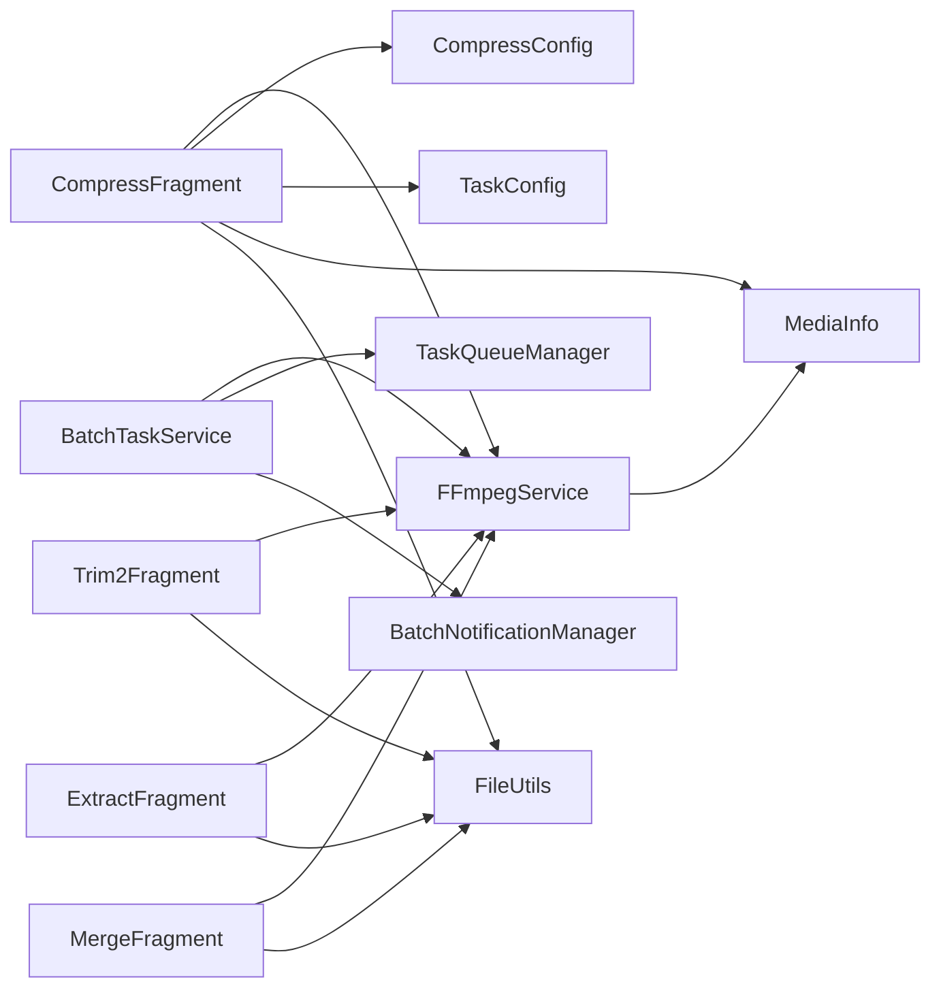

# Component Interactions

<cite>
**Referenced Files in This Document**
- [FFmpegService.kt](file://app/src/main/java/com/pisces312/streamclip/service/FFmpegService.kt)
- [BatchTaskService.kt](file://app/src/main/java/com/pisces312/streamclip/service/BatchTaskService.kt)
- [TaskQueueManager.kt](file://app/src/main/java/com/pisces312/streamclip/service/TaskQueueManager.kt)
- [BatchNotificationManager.kt](file://app/src/main/java/com/pisces312/streamclip/service/BatchNotificationManager.kt)
- [Trim2Fragment.kt](file://app/src/main/java/com/pisces312/streamclip/fragment/Trim2Fragment.kt)
- [CompressFragment.kt](file://app/src/main/java/com/pisces312/streamclip/fragment/CompressFragment.kt)
- [ExtractFragment.kt](file://app/src/main/java/com/pisces312/streamclip/fragment/ExtractFragment.kt)
- [MergeFragment.kt](file://app/src/main/java/com/pisces312/streamclip/fragment/MergeFragment.kt)
- [MediaInfo.kt](file://app/src/main/java/com/pisces312/streamclip/model/MediaInfo.kt)
- [CompressConfig.kt](file://app/src/main/java/com/pisces312/streamclip/model/CompressConfig.kt)
- [TaskConfig.kt](file://app/src/main/java/com/pisces312/streamclip/model/TaskConfig.kt)
- [BatchTaskItem.kt](file://app/src/main/java/com/pisces312/streamclip/model/BatchTaskItem.kt)
- [FileUtils.kt](file://app/src/main/java/com/pisces312/streamclip/util/FileUtils.kt)
- [TrimActivity.kt](file://app/src/main/java/com/pisces312/streamclip/ui/TrimActivity.kt)
- [FfmpegLogAdapter.kt](file://app/src/main/java/com/pisces312/streamclip/adapter/FfmpegLogAdapter.kt)
</cite>

## Table of Contents
1. [Introduction](#introduction)
2. [Project Structure](#project-structure)
3. [Core Components](#core-components)
4. [Architecture Overview](#architecture-overview)
5. [Detailed Component Analysis](#detailed-component-analysis)
6. [Dependency Analysis](#dependency-analysis)
7. [Performance Considerations](#performance-considerations)
8. [Troubleshooting Guide](#troubleshooting-guide)
9. [Conclusion](#conclusion)

## Introduction
This document explains StreamClip’s component interaction patterns, focusing on how UI fragments communicate with the service layer and how FFmpeg operations are orchestrated. It covers:
- Data flow from fragment-based user interactions to FFmpegService and back to UI updates
- Observer patterns via Kotlin Flow for real-time progress tracking
- Callback mechanisms for asynchronous operations
- State management patterns and UI synchronization across component boundaries
- Fragment-to-service communication protocols, parameter passing, and result handling
- Interaction diagrams for typical workflows: video trimming, compression, and batch processing
- Error propagation, progress reporting, and UI state synchronization

## Project Structure
The application follows a layered architecture:
- UI Layer: Fragments and Activities that capture user actions and render results
- Service Layer: FFmpegService for command execution and BatchTaskService for background queue management
- Model Layer: Data classes representing configuration, media info, and task state
- Utility Layer: Helpers for file handling, logging, and settings

**Diagram sources**
- [Trim2Fragment.kt:178-251](file://app/src/main/java/com/pisces312/streamclip/fragment/Trim2Fragment.kt#L178-L251)
- [CompressFragment.kt:572-680](file://app/src/main/java/com/pisces312/streamclip/fragment/CompressFragment.kt#L572-L680)
- [ExtractFragment.kt:136-191](file://app/src/main/java/com/pisces312/streamclip/fragment/ExtractFragment.kt#L136-L191)
- [MergeFragment.kt:135-232](file://app/src/main/java/com/pisces312/streamclip/fragment/MergeFragment.kt#L135-L232)
- [FFmpegService.kt:152-241](file://app/src/main/java/com/pisces312/streamclip/service/FFmpegService.kt#L152-L241)
- [BatchTaskService.kt:181-240](file://app/src/main/java/com/pisces312/streamclip/service/BatchTaskService.kt#L181-L240)
- [TaskQueueManager.kt:10-145](file://app/src/main/java/com/pisces312/streamclip/service/TaskQueueManager.kt#L10-L145)
- [BatchNotificationManager.kt:17-137](file://app/src/main/java/com/pisces312/streamclip/service/BatchNotificationManager.kt#L17-L137)
- [MediaInfo.kt:5-165](file://app/src/main/java/com/pisces312/streamclip/model/MediaInfo.kt#L5-L165)
- [CompressConfig.kt:1-209](file://app/src/main/java/com/pisces312/streamclip/model/CompressConfig.kt#L1-L209)
- [TaskConfig.kt:5-15](file://app/src/main/java/com/pisces312/streamclip/model/TaskConfig.kt#L5-L15)
- [BatchTaskItem.kt:5-32](file://app/src/main/java/com/pisces312/streamclip/model/BatchTaskItem.kt#L5-L32)
- [FileUtils.kt:17-362](file://app/src/main/java/com/pisces312/streamclip/util/FileUtils.kt#L17-L362)
- [TrimActivity.kt:12-36](file://app/src/main/java/com/pisces312/streamclip/ui/TrimActivity.kt#L12-L36)
- [FfmpegLogAdapter.kt:11-43](file://app/src/main/java/com/pisces312/streamclip/adapter/FfmpegLogAdapter.kt#L11-L43)

**Section sources**
- [FFmpegService.kt:19-420](file://app/src/main/java/com/pisces312/streamclip/service/FFmpegService.kt#L19-L420)
- [BatchTaskService.kt:26-301](file://app/src/main/java/com/pisces312/streamclip/service/BatchTaskService.kt#L26-L301)
- [TaskQueueManager.kt:10-146](file://app/src/main/java/com/pisces312/streamclip/service/TaskQueueManager.kt#L10-L146)
- [BatchNotificationManager.kt:17-137](file://app/src/main/java/com/pisces312/streamclip/service/BatchNotificationManager.kt#L17-L137)
- [Trim2Fragment.kt:31-286](file://app/src/main/java/com/pisces312/streamclip/fragment/Trim2Fragment.kt#L31-L286)
- [CompressFragment.kt:40-800](file://app/src/main/java/com/pisces312/streamclip/fragment/CompressFragment.kt#L40-L800)
- [ExtractFragment.kt:25-209](file://app/src/main/java/com/pisces312/streamclip/fragment/ExtractFragment.kt#L25-L209)
- [MergeFragment.kt:28-278](file://app/src/main/java/com/pisces312/streamclip/fragment/MergeFragment.kt#L28-L278)
- [MediaInfo.kt:5-165](file://app/src/main/java/com/pisces312/streamclip/model/MediaInfo.kt#L5-L165)
- [CompressConfig.kt:1-209](file://app/src/main/java/com/pisces312/streamclip/model/CompressConfig.kt#L1-L209)
- [TaskConfig.kt:5-15](file://app/src/main/java/com/pisces312/streamclip/model/TaskConfig.kt#L5-L15)
- [BatchTaskItem.kt:5-32](file://app/src/main/java/com/pisces312/streamclip/model/BatchTaskItem.kt#L5-L32)
- [FileUtils.kt:17-362](file://app/src/main/java/com/pisces312/streamclip/util/FileUtils.kt#L17-L362)
- [TrimActivity.kt:12-36](file://app/src/main/java/com/pisces312/streamclip/ui/TrimActivity.kt#L12-L36)
- [FfmpegLogAdapter.kt:11-43](file://app/src/main/java/com/pisces312/streamclip/adapter/FfmpegLogAdapter.kt#L11-L43)

## Core Components
- FFmpegService: Central orchestrator for media probing and FFmpeg command execution. Provides suspend functions for async execution, progress callbacks, and cancellation support.
- BatchTaskService: Foreground service managing a persistent queue of tasks, driving progress notifications and result handling.
- TaskQueueManager: State-managed queue with Flow emission for UI observers.
- BatchNotificationManager: Foreground notification management for batch operations.
- UI Fragments: Capture user inputs, build commands, observe progress, and update UI.
- Models: MediaInfo, CompressConfig, TaskConfig, BatchTaskItem define data contracts.
- Utilities: FileUtils resolves URIs to paths, manages output directories, and applies timestamps.

Key interaction patterns:
- UI fragments call FFmpegService APIs with callbacks for progress and logs
- BatchTaskService builds tasks from UI selections and delegates execution to FFmpegService
- TaskQueueManager exposes StateFlow for UI to reactively update lists and statuses
- BatchNotificationManager keeps users informed during long-running operations

**Section sources**
- [FFmpegService.kt:19-420](file://app/src/main/java/com/pisces312/streamclip/service/FFmpegService.kt#L19-L420)
- [BatchTaskService.kt:26-301](file://app/src/main/java/com/pisces312/streamclip/service/BatchTaskService.kt#L26-L301)
- [TaskQueueManager.kt:10-146](file://app/src/main/java/com/pisces312/streamclip/service/TaskQueueManager.kt#L10-L146)
- [BatchNotificationManager.kt:17-137](file://app/src/main/java/com/pisces312/streamclip/service/BatchNotificationManager.kt#L17-L137)
- [CompressFragment.kt:572-680](file://app/src/main/java/com/pisces312/streamclip/fragment/CompressFragment.kt#L572-L680)
- [Trim2Fragment.kt:178-251](file://app/src/main/java/com/pisces312/streamclip/fragment/Trim2Fragment.kt#L178-L251)
- [ExtractFragment.kt:136-191](file://app/src/main/java/com/pisces312/streamclip/fragment/ExtractFragment.kt#L136-L191)
- [MergeFragment.kt:135-232](file://app/src/main/java/com/pisces312/streamclip/fragment/MergeFragment.kt#L135-L232)

## Architecture Overview
The system integrates UI, service, and model layers around FFmpegService. UI fragments trigger operations, FFmpegService executes commands asynchronously, and callbacks propagate progress/logs back to UI. BatchTaskService coordinates background work with persistent notifications and state updates.

**Diagram sources**
- [FFmpegService.kt:152-241](file://app/src/main/java/com/pisces312/streamclip/service/FFmpegService.kt#L152-L241)
- [CompressFragment.kt:611-629](file://app/src/main/java/com/pisces312/streamclip/fragment/CompressFragment.kt#L611-L629)

**Section sources**
- [FFmpegService.kt:152-241](file://app/src/main/java/com/pisces312/streamclip/service/FFmpegService.kt#L152-L241)
- [CompressFragment.kt:611-629](file://app/src/main/java/com/pisces312/streamclip/fragment/CompressFragment.kt#L611-L629)

## Detailed Component Analysis

### FFmpegService: Command Execution and Progress
FFmpegService encapsulates:
- Media probing via ffprobe
- Async command execution via ffmpeg-kit
- Progress calculation using StatisticsCallback
- Cancellation via session ID
- Specialized operations: trim, merge, extract, compress

Implementation highlights:
- Progress computation uses session time vs. total duration to derive percentage
- Optional onProgress/onLog callbacks allow UI to update in real time
- Cancellation cancels the active session and resets current session ID

**Diagram sources**
- [FFmpegService.kt:33-45](file://app/src/main/java/com/pisces312/streamclip/service/FFmpegService.kt#L33-L45)
- [FFmpegService.kt:152-241](file://app/src/main/java/com/pisces312/streamclip/service/FFmpegService.kt#L152-L241)

**Section sources**
- [FFmpegService.kt:56-147](file://app/src/main/java/com/pisces312/streamclip/service/FFmpegService.kt#L56-L147)
- [FFmpegService.kt:152-241](file://app/src/main/java/com/pisces312/streamclip/service/FFmpegService.kt#L152-L241)
- [FFmpegService.kt:246-393](file://app/src/main/java/com/pisces312/streamclip/service/FFmpegService.kt#L246-L393)
- [FFmpegService.kt:398-418](file://app/src/main/java/com/pisces312/streamclip/service/FFmpegService.kt#L398-L418)

### BatchTaskService: Background Queue and Notifications
BatchTaskService runs as a foreground service, manages a queue of BatchTaskItem entries, and drives progress updates:
- Enqueues tasks from UI, starts processing loop
- Executes tasks with retries, updates TaskQueueManager and notifications
- Supports pause/resume/cancel per task and global stop
- Cleans up partial outputs on failure

**Diagram sources**
- [BatchTaskService.kt:92-165](file://app/src/main/java/com/pisces312/streamclip/service/BatchTaskService.kt#L92-L165)
- [BatchTaskService.kt:181-240](file://app/src/main/java/com/pisces312/streamclip/service/BatchTaskService.kt#L181-L240)
- [TaskQueueManager.kt:23-53](file://app/src/main/java/com/pisces312/streamclip/service/TaskQueueManager.kt#L23-L53)
- [BatchNotificationManager.kt:57-89](file://app/src/main/java/com/pisces312/streamclip/service/BatchNotificationManager.kt#L57-L89)

**Section sources**
- [BatchTaskService.kt:26-301](file://app/src/main/java/com/pisces312/streamclip/service/BatchTaskService.kt#L26-L301)
- [TaskQueueManager.kt:10-146](file://app/src/main/java/com/pisces312/streamclip/service/TaskQueueManager.kt#L10-L146)
- [BatchNotificationManager.kt:17-137](file://app/src/main/java/com/pisces312/streamclip/service/BatchNotificationManager.kt#L17-L137)

### TaskQueueManager: Reactive State Management
TaskQueueManager maintains a concurrent queue and emits StateFlow updates for UI observers. It tracks task status, progress, and completion metrics.

**Diagram sources**
- [TaskQueueManager.kt:23-86](file://app/src/main/java/com/pisces312/streamclip/service/TaskQueueManager.kt#L23-L86)
- [TaskQueueManager.kt:142-144](file://app/src/main/java/com/pisces312/streamclip/service/TaskQueueManager.kt#L142-L144)

**Section sources**
- [TaskQueueManager.kt:10-146](file://app/src/main/java/com/pisces312/streamclip/service/TaskQueueManager.kt#L10-L146)

### UI Fragments: Trimming, Compression, Extraction, Merging
- Trim2Fragment: Selects video, configures ExoPlayer, computes trim window, invokes lossless trim via FFmpegService, updates UI on completion.
- CompressFragment: Builds CompressConfig, constructs FFmpeg command, displays progress/log dialog, handles cancellation and post-processing.
- ExtractFragment: Probes audio info, extracts audio losslessly, scans media, and updates UI.
- MergeFragment: Validates compatibility across multiple videos, merges via concat demuxer, preserves metadata, and reports results.

**Diagram sources**
- [Trim2Fragment.kt:178-251](file://app/src/main/java/com/pisces312/streamclip/fragment/Trim2Fragment.kt#L178-L251)
- [FFmpegService.kt:246-272](file://app/src/main/java/com/pisces312/streamclip/service/FFmpegService.kt#L246-L272)
- [FileUtils.kt:268-275](file://app/src/main/java/com/pisces312/streamclip/util/FileUtils.kt#L268-L275)

**Section sources**
- [Trim2Fragment.kt:178-251](file://app/src/main/java/com/pisces312/streamclip/fragment/Trim2Fragment.kt#L178-L251)
- [CompressFragment.kt:572-680](file://app/src/main/java/com/pisces312/streamclip/fragment/CompressFragment.kt#L572-L680)
- [ExtractFragment.kt:136-191](file://app/src/main/java/com/pisces312/streamclip/fragment/ExtractFragment.kt#L136-L191)
- [MergeFragment.kt:135-232](file://app/src/main/java/com/pisces312/streamclip/fragment/MergeFragment.kt#L135-L232)

### Observer Pattern and Real-Time Progress Tracking
- FFmpegService provides callbacks for progress and logs during async execution.
- CompressFragment registers onProgress/onLog callbacks to update UI and log dialogs.
- TaskQueueManager exposes StateFlow for reactive UI updates in batch processing.

**Diagram sources**
- [CompressFragment.kt:611-629](file://app/src/main/java/com/pisces312/streamclip/fragment/CompressFragment.kt#L611-L629)
- [FFmpegService.kt:179-214](file://app/src/main/java/com/pisces312/streamclip/service/FFmpegService.kt#L179-L214)
- [FfmpegLogAdapter.kt:11-43](file://app/src/main/java/com/pisces312/streamclip/adapter/FfmpegLogAdapter.kt#L11-L43)

**Section sources**
- [CompressFragment.kt:611-629](file://app/src/main/java/com/pisces312/streamclip/fragment/CompressFragment.kt#L611-L629)
- [FFmpegService.kt:179-214](file://app/src/main/java/com/pisces312/streamclip/service/FFmpegService.kt#L179-L214)
- [FfmpegLogAdapter.kt:11-43](file://app/src/main/java/com/pisces312/streamclip/adapter/FfmpegLogAdapter.kt#L11-L43)

### Parameter Passing and Result Handling Strategies
- Fragments resolve URIs to paths via FileUtils, compute output locations, and pass parameters to FFmpegService.
- Commands are built from CompressConfig and MediaInfo-derived metadata.
- Results are handled on the main thread; UI enables/disables controls and updates status messages.
- Batch tasks are serialized via TaskConfig and BatchTaskItem for persistence across service restarts.

**Section sources**
- [FileUtils.kt:30-118](file://app/src/main/java/com/pisces312/streamclip/util/FileUtils.kt#L30-L118)
- [CompressConfig.kt:21-114](file://app/src/main/java/com/pisces312/streamclip/model/CompressConfig.kt#L21-L114)
- [TaskConfig.kt:5-15](file://app/src/main/java/com/pisces312/streamclip/model/TaskConfig.kt#L5-L15)
- [BatchTaskItem.kt:5-18](file://app/src/main/java/com/pisces312/streamclip/model/BatchTaskItem.kt#L5-L18)

### Typical Workflows: Trimming, Compression, Batch Processing
- Trimming: Select video -> compute trim window -> lossless trim -> scan media -> restore timestamps -> update UI.
- Compression: Select video -> build config -> construct command -> execute with progress/logs -> scan media -> probe output -> update UI.
- Batch Processing: Select multiple videos -> build tasks -> start service -> monitor progress via notifications -> summarize results.

**Diagram sources**
- [CompressFragment.kt:572-680](file://app/src/main/java/com/pisces312/streamclip/fragment/CompressFragment.kt#L572-L680)
- [FileUtils.kt:268-331](file://app/src/main/java/com/pisces312/streamclip/util/FileUtils.kt#L268-L331)
- [FFmpegService.kt:152-241](file://app/src/main/java/com/pisces312/streamclip/service/FFmpegService.kt#L152-L241)

**Section sources**
- [Trim2Fragment.kt:178-251](file://app/src/main/java/com/pisces312/streamclip/fragment/Trim2Fragment.kt#L178-L251)
- [CompressFragment.kt:572-680](file://app/src/main/java/com/pisces312/streamclip/fragment/CompressFragment.kt#L572-L680)
- [BatchTaskService.kt:181-240](file://app/src/main/java/com/pisces312/streamclip/service/BatchTaskService.kt#L181-L240)

## Dependency Analysis
- UI fragments depend on FFmpegService and FileUtils for execution and IO.
- BatchTaskService depends on FFmpegService, TaskQueueManager, and BatchNotificationManager.
- Models are shared across UI, service, and utilities for consistent data contracts.
- FFmpegService depends on ffmpeg-kit and MediaInfo for parsing.

**Diagram sources**
- [Trim2Fragment.kt:178-251](file://app/src/main/java/com/pisces312/streamclip/fragment/Trim2Fragment.kt#L178-L251)
- [CompressFragment.kt:572-680](file://app/src/main/java/com/pisces312/streamclip/fragment/CompressFragment.kt#L572-L680)
- [ExtractFragment.kt:136-191](file://app/src/main/java/com/pisces312/streamclip/fragment/ExtractFragment.kt#L136-L191)
- [MergeFragment.kt:135-232](file://app/src/main/java/com/pisces312/streamclip/fragment/MergeFragment.kt#L135-L232)
- [FFmpegService.kt:152-241](file://app/src/main/java/com/pisces312/streamclip/service/FFmpegService.kt#L152-L241)
- [BatchTaskService.kt:181-240](file://app/src/main/java/com/pisces312/streamclip/service/BatchTaskService.kt#L181-L240)
- [TaskQueueManager.kt:10-146](file://app/src/main/java/com/pisces312/streamclip/service/TaskQueueManager.kt#L10-L146)
- [BatchNotificationManager.kt:17-137](file://app/src/main/java/com/pisces312/streamclip/service/BatchNotificationManager.kt#L17-L137)
- [MediaInfo.kt:5-165](file://app/src/main/java/com/pisces312/streamclip/model/MediaInfo.kt#L5-L165)
- [CompressConfig.kt:1-209](file://app/src/main/java/com/pisces312/streamclip/model/CompressConfig.kt#L1-L209)
- [TaskConfig.kt:5-15](file://app/src/main/java/com/pisces312/streamclip/model/TaskConfig.kt#L5-L15)
- [FileUtils.kt:17-362](file://app/src/main/java/com/pisces312/streamclip/util/FileUtils.kt#L17-L362)

**Section sources**
- [FFmpegService.kt:19-420](file://app/src/main/java/com/pisces312/streamclip/service/FFmpegService.kt#L19-L420)
- [BatchTaskService.kt:26-301](file://app/src/main/java/com/pisces312/streamclip/service/BatchTaskService.kt#L26-L301)
- [TaskQueueManager.kt:10-146](file://app/src/main/java/com/pisces312/streamclip/service/TaskQueueManager.kt#L10-L146)
- [BatchNotificationManager.kt:17-137](file://app/src/main/java/com/pisces312/streamclip/service/BatchNotificationManager.kt#L17-L137)
- [CompressFragment.kt:572-680](file://app/src/main/java/com/pisces312/streamclip/fragment/CompressFragment.kt#L572-L680)

## Performance Considerations
- Prefer lossless operations (e.g., trim -c copy, merge concat) when possible to minimize CPU usage and preserve quality.
- Use hardware encoders for compression when supported by devices to reduce processing time.
- Avoid frequent UI updates; batch progress updates and throttle log emissions to maintain responsiveness.
- Probe media info once and reuse durations and metadata to avoid redundant ffprobe calls.
- Manage foreground service lifecycles carefully to prevent ANRs during long operations.

## Troubleshooting Guide
Common issues and handling strategies:
- Unknown total duration: Progress percentage may be unavailable; UI should fall back to indeterminate indicators.
- FFmpeg errors: Errors are propagated via Result.error; UI should present actionable messages and allow retry/cancel.
- Cancellation: Use FFmpegService.cancelCurrentSession() to abort ongoing operations; ensure UI reflects cancellation state.
- Batch failures: TaskQueueManager marks failed tasks; provide retry or remove options; BatchNotificationManager summarizes outcomes.
- File path resolution: If FileUtils cannot resolve a URI, prompt users to select accessible files or copy to cache.

**Section sources**
- [FFmpegService.kt:152-241](file://app/src/main/java/com/pisces312/streamclip/service/FFmpegService.kt#L152-L241)
- [BatchTaskService.kt:233-240](file://app/src/main/java/com/pisces312/streamclip/service/BatchTaskService.kt#L233-L240)
- [TaskQueueManager.kt:68-86](file://app/src/main/java/com/pisces312/streamclip/service/TaskQueueManager.kt#L68-L86)
- [FileUtils.kt:30-118](file://app/src/main/java/com/pisces312/streamclip/util/FileUtils.kt#L30-L118)

## Conclusion
StreamClip’s component interactions form a robust pipeline from UI to FFmpeg execution and back to user feedback. The design leverages Kotlin coroutines, callbacks, and reactive state to keep UI responsive and informative. Batch processing is managed through a dedicated service with persistent notifications and state tracking. By following the patterns documented here—parameter passing, progress callbacks, cancellation, and error propagation—developers can extend functionality while maintaining reliability and usability.