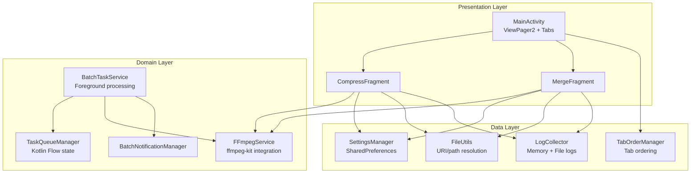
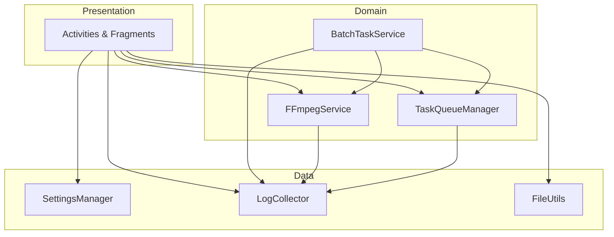
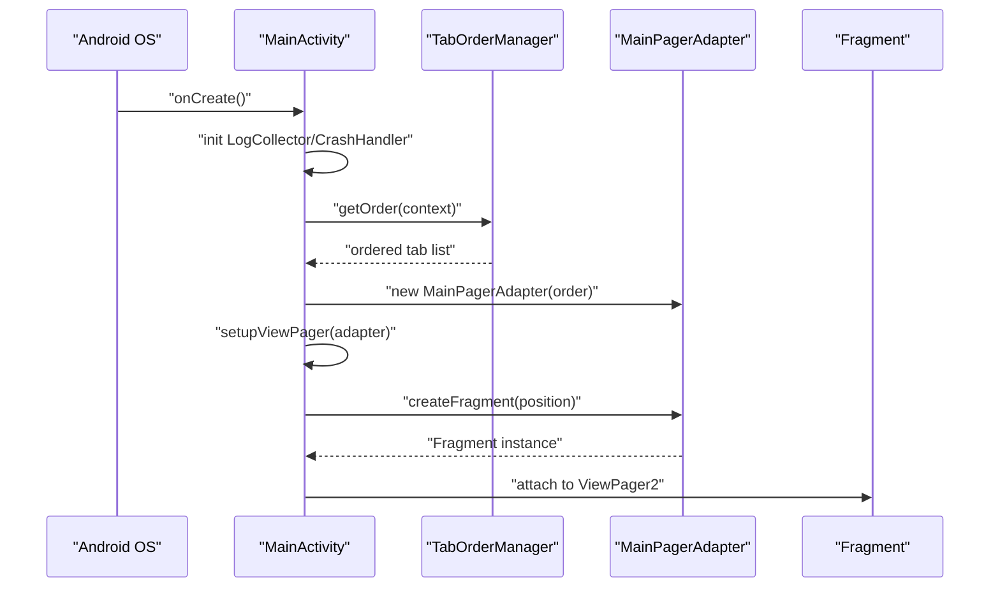
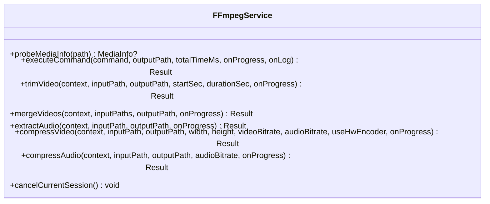
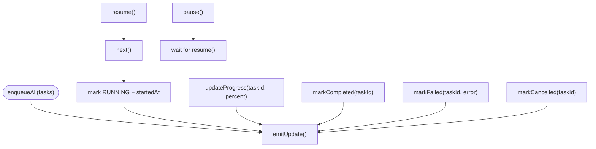
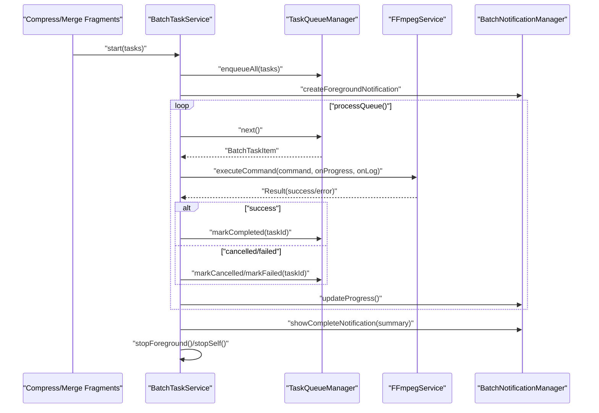
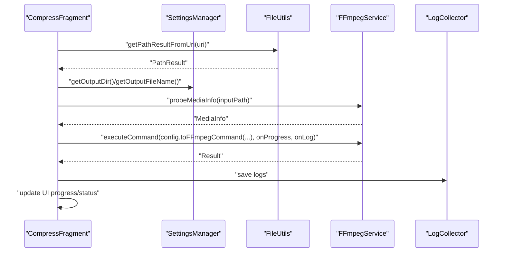
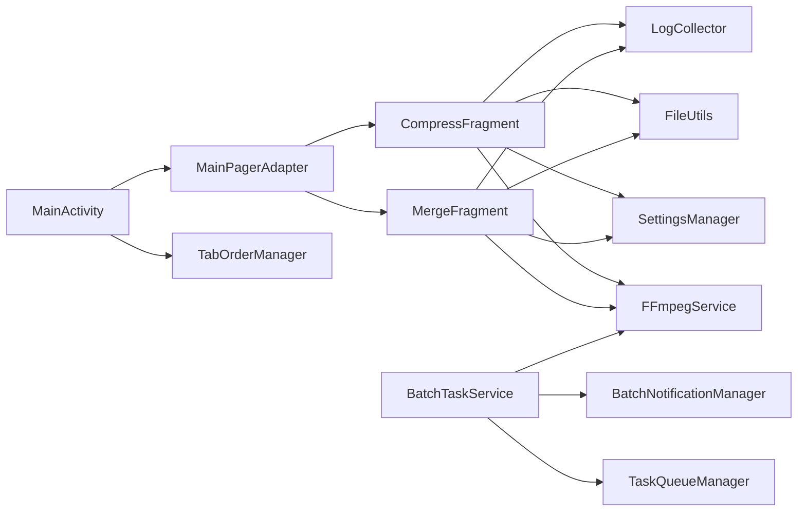

# Core Architecture

<cite>
**Referenced Files in This Document**
- [MainActivity.kt](file://app/src/main/java/com/pisces312/streamclip/MainActivity.kt)
- [BaseActivity.kt](file://app/src/main/java/com/pisces312/streamclip/BaseActivity.kt)
- [MainPagerAdapter.kt](file://app/src/main/java/com/pisces312/streamclip/adapter/MainPagerAdapter.kt)
- [FFmpegService.kt](file://app/src/main/java/com/pisces312/streamclip/service/FFmpegService.kt)
- [TaskQueueManager.kt](file://app/src/main/java/com/pisces312/streamclip/service/TaskQueueManager.kt)
- [BatchTaskService.kt](file://app/src/main/java/com/pisces312/streamclip/service/BatchTaskService.kt)
- [BatchNotificationManager.kt](file://app/src/main/java/com/pisces312/streamclip/service/BatchNotificationManager.kt)
- [CompressFragment.kt](file://app/src/main/java/com/pisces312/streamclip/fragment/CompressFragment.kt)
- [MergeFragment.kt](file://app/src/main/java/com/pisces312/streamclip/fragment/MergeFragment.kt)
- [FileUtils.kt](file://app/src/main/java/com/pisces312/streamclip/util/FileUtils.kt)
- [SettingsManager.kt](file://app/src/main/java/com/pisces312/streamclip/util/SettingsManager.kt)
- [LogCollector.kt](file://app/src/main/java/com/pisces312/streamclip/util/LogCollector.kt)
- [CrashHandler.kt](file://app/src/main/java/com/pisces312/streamclip/util/CrashHandler.kt)
- [TabOrderManager.kt](file://app/src/main/java/com/pisces312/streamclip/util/TabOrderManager.kt)
- [CompressConfig.kt](file://app/src/main/java/com/pisces312/streamclip/model/CompressConfig.kt)
- [BatchTaskItem.kt](file://app/src/main/java/com/pisces312/streamclip/model/BatchTaskItem.kt)
</cite>

## Table of Contents
1. [Introduction](#introduction)
2. [Project Structure](#project-structure)
3. [Core Components](#core-components)
4. [Architecture Overview](#architecture-overview)
5. [Detailed Component Analysis](#detailed-component-analysis)
6. [Dependency Analysis](#dependency-analysis)
7. [Performance Considerations](#performance-considerations)
8. [Troubleshooting Guide](#troubleshooting-guide)
9. [Conclusion](#conclusion)

## Introduction
This document describes the core system design of StreamClip using a Clean Architecture-inspired layered approach. The application is structured around three primary layers:
- Presentation Layer: Activities and Fragments manage UI, user interactions, and lifecycle-aware coroutines.
- Domain Layer: Services encapsulate business logic for media processing, task orchestration, and configuration.
- Data Layer: Utilities and models provide file handling, logging, settings persistence, and shared data structures.

Key architectural components include:
- MainActivity orchestrating tab-based navigation via ViewPager2 and a custom adapter.
- FFmpegService as the central video processing engine integrating ffmpeg-kit.
- TaskQueueManager managing state for batch operations with Kotlin Flow.
- BatchTaskService coordinating long-running tasks with foreground notifications.
- Utility services for file handling, settings, logging, and crash reporting.

Design patterns implemented:
- Repository pattern for centralized data access (via SettingsManager and LogCollector).
- Observer pattern for state management using Kotlin Flow (TaskQueueManager).
- Factory pattern for fragment instantiation (MainPagerAdapter).
- Singleton pattern for global configuration and logging (SettingsManager, LogCollector, TabOrderManager).

Cross-cutting concerns:
- Asynchronous processing with Kotlin Coroutines and IO dispatchers.
- Robust error handling and lifecycle-aware cancellation.
- Lifecycle management through BaseActivity and Android components.

## Project Structure
The project follows a feature-based organization with clear separation of concerns:
- app/src/main/java/com/pisces312/streamclip/
  - adapter/: UI adapters for ViewPager2 and RecyclerView.
  - fragment/: Feature-specific UI fragments.
  - service/: Background services and managers for processing and state.
  - util/: Cross-cutting utilities for file handling, settings, logging, and crash handling.
  - model/: Shared data classes and configuration models.
  - ui/: Activities backing fragments and specialized screens.
  - BaseActivity.kt: Base class applying locale configuration.

**Diagram sources**
- [MainActivity.kt:62-81](file://app/src/main/java/com/pisces312/streamclip/MainActivity.kt#L62-L81)
- [MainPagerAdapter.kt:16-36](file://app/src/main/java/com/pisces312/streamclip/adapter/MainPagerAdapter.kt#L16-L36)
- [CompressFragment.kt:112-137](file://app/src/main/java/com/pisces312/streamclip/fragment/CompressFragment.kt#L112-L137)
- [MergeFragment.kt:58-97](file://app/src/main/java/com/pisces312/streamclip/fragment/MergeFragment.kt#L58-L97)
- [FFmpegService.kt:19-420](file://app/src/main/java/com/pisces312/streamclip/service/FFmpegService.kt#L19-L420)
- [TaskQueueManager.kt:10-146](file://app/src/main/java/com/pisces312/streamclip/service/TaskQueueManager.kt#L10-L146)
- [BatchTaskService.kt:26-301](file://app/src/main/java/com/pisces312/streamclip/service/BatchTaskService.kt#L26-L301)
- [BatchNotificationManager.kt:17-137](file://app/src/main/java/com/pisces312/streamclip/service/BatchNotificationManager.kt#L17-L137)
- [SettingsManager.kt:6-208](file://app/src/main/java/com/pisces312/streamclip/util/SettingsManager.kt#L6-L208)
- [LogCollector.kt:15-202](file://app/src/main/java/com/pisces312/streamclip/util/LogCollector.kt#L15-L202)
- [FileUtils.kt:17-362](file://app/src/main/java/com/pisces312/streamclip/util/FileUtils.kt#L17-L362)
- [TabOrderManager.kt:7-61](file://app/src/main/java/com/pisces312/streamclip/util/TabOrderManager.kt#L7-L61)

**Section sources**
- [MainActivity.kt:26-130](file://app/src/main/java/com/pisces312/streamclip/MainActivity.kt#L26-L130)
- [MainPagerAdapter.kt:16-36](file://app/src/main/java/com/pisces312/streamclip/adapter/MainPagerAdapter.kt#L16-L36)
- [BaseActivity.kt:8-13](file://app/src/main/java/com/pisces312/streamclip/BaseActivity.kt#L8-L13)

## Core Components
- MainActivity: Initializes logging and crash handling, sets up ViewPager2 with tab order, handles menu actions, and displays version and guide dialogs. It delegates tab creation to MainPagerAdapter and applies locale via BaseActivity.
- FFmpegService: Singleton orchestrating ffmpeg-kit commands, probing media info, and streaming progress/log callbacks. Provides suspend APIs for trimming, merging, extracting, and compressing.
- TaskQueueManager: Singleton managing batch task state with Kotlin Flow, supporting enqueue, progress updates, completion/failure/cancellation, and summaries.
- BatchTaskService: Foreground service receiving batch tasks, driving TaskQueueManager, notifying progress, and handling pause/resume/cancel.
- Utilities:
  - SettingsManager: Global preferences backed by SharedPreferences.
  - LogCollector: Dual-channel logging (memory buffer + external file) with crash log persistence.
  - FileUtils: Robust URI-to-path resolution, caching, scanning, and time-stamp preservation.
  - CrashHandler: Global uncaught exception handler saving crash logs and exiting cleanly.
  - TabOrderManager: Persists and merges tab order with defaults.

**Section sources**
- [MainActivity.kt:35-130](file://app/src/main/java/com/pisces312/streamclip/MainActivity.kt#L35-L130)
- [FFmpegService.kt:19-420](file://app/src/main/java/com/pisces312/streamclip/service/FFmpegService.kt#L19-L420)
- [TaskQueueManager.kt:10-146](file://app/src/main/java/com/pisces312/streamclip/service/TaskQueueManager.kt#L10-L146)
- [BatchTaskService.kt:26-301](file://app/src/main/java/com/pisces312/streamclip/service/BatchTaskService.kt#L26-L301)
- [SettingsManager.kt:6-208](file://app/src/main/java/com/pisces312/streamclip/util/SettingsManager.kt#L6-L208)
- [LogCollector.kt:15-202](file://app/src/main/java/com/pisces312/streamclip/util/LogCollector.kt#L15-L202)
- [FileUtils.kt:17-362](file://app/src/main/java/com/pisces312/streamclip/util/FileUtils.kt#L17-L362)
- [CrashHandler.kt:10-28](file://app/src/main/java/com/pisces312/streamclip/util/CrashHandler.kt#L10-L28)
- [TabOrderManager.kt:7-61](file://app/src/main/java/com/pisces312/streamclip/util/TabOrderManager.kt#L7-L61)

## Architecture Overview
StreamClip adopts a Clean Architecture-inspired layered design:
- Presentation: Activities and Fragments manage UI and user interactions.
- Domain: Services encapsulate business logic for media processing and task orchestration.
- Data: Utilities and models provide configuration, logging, file handling, and shared data.

**Diagram sources**
- [MainActivity.kt:26-130](file://app/src/main/java/com/pisces312/streamclip/MainActivity.kt#L26-L130)
- [FFmpegService.kt:19-420](file://app/src/main/java/com/pisces312/streamclip/service/FFmpegService.kt#L19-L420)
- [TaskQueueManager.kt:10-146](file://app/src/main/java/com/pisces312/streamclip/service/TaskQueueManager.kt#L10-L146)
- [BatchTaskService.kt:26-301](file://app/src/main/java/com/pisces312/streamclip/service/BatchTaskService.kt#L26-L301)
- [SettingsManager.kt:6-208](file://app/src/main/java/com/pisces312/streamclip/util/SettingsManager.kt#L6-L208)
- [LogCollector.kt:15-202](file://app/src/main/java/com/pisces312/streamclip/util/LogCollector.kt#L15-L202)
- [FileUtils.kt:17-362](file://app/src/main/java/com/pisces312/streamclip/util/FileUtils.kt#L17-L362)

## Detailed Component Analysis

### MainActivity and Navigation
MainActivity initializes logging and crash handling, checks runtime permissions, sets up ViewPager2 with tab order, and exposes menu actions. It delegates tab creation to MainPagerAdapter, which acts as a factory for fragments based on the configured order.

**Diagram sources**
- [MainActivity.kt:35-81](file://app/src/main/java/com/pisces312/streamclip/MainActivity.kt#L35-L81)
- [TabOrderManager.kt:31-51](file://app/src/main/java/com/pisces312/streamclip/util/TabOrderManager.kt#L31-L51)
- [MainPagerAdapter.kt:23-36](file://app/src/main/java/com/pisces312/streamclip/adapter/MainPagerAdapter.kt#L23-L36)

**Section sources**
- [MainActivity.kt:35-130](file://app/src/main/java/com/pisces312/streamclip/MainActivity.kt#L35-L130)
- [MainPagerAdapter.kt:16-36](file://app/src/main/java/com/pisces312/streamclip/adapter/MainPagerAdapter.kt#L16-L36)
- [TabOrderManager.kt:31-51](file://app/src/main/java/com/pisces312/streamclip/util/TabOrderManager.kt#L31-L51)

### FFmpegService: Central Processing Engine
FFmpegService integrates ffmpeg-kit for media probing and processing. It supports:
- Media probing (format, streams, tags, duration).
- Command execution with async callbacks and progress/log streaming.
- Specialized operations: trim, merge, extract, compress (video/audio).

**Diagram sources**
- [FFmpegService.kt:19-420](file://app/src/main/java/com/pisces312/streamclip/service/FFmpegService.kt#L19-L420)

**Section sources**
- [FFmpegService.kt:56-147](file://app/src/main/java/com/pisces312/streamclip/service/FFmpegService.kt#L56-L147)
- [FFmpegService.kt:152-241](file://app/src/main/java/com/pisces312/streamclip/service/FFmpegService.kt#L152-L241)
- [FFmpegService.kt:246-393](file://app/src/main/java/com/pisces312/streamclip/service/FFmpegService.kt#L246-L393)

### TaskQueueManager: State Management with Kotlin Flow
TaskQueueManager maintains a queue of BatchTaskItem entries and exposes a StateFlow for UI observers. It supports enqueue, next, progress updates, completion/failure/cancellation, and summaries.

**Diagram sources**
- [TaskQueueManager.kt:24-93](file://app/src/main/java/com/pisces312/streamclip/service/TaskQueueManager.kt#L24-L93)
- [TaskQueueManager.kt:142-144](file://app/src/main/java/com/pisces312/streamclip/service/TaskQueueManager.kt#L142-L144)

**Section sources**
- [TaskQueueManager.kt:10-146](file://app/src/main/java/com/pisces312/streamclip/service/TaskQueueManager.kt#L10-L146)
- [BatchTaskItem.kt:5-18](file://app/src/main/java/com/pisces312/streamclip/model/BatchTaskItem.kt#L5-L18)

### BatchTaskService: Foreground Processing and Notifications
BatchTaskService runs as a foreground service, coordinates TaskQueueManager, executes FFmpegService commands, and manages notifications for progress and completion.

**Diagram sources**
- [BatchTaskService.kt:92-165](file://app/src/main/java/com/pisces312/streamclip/service/BatchTaskService.kt#L92-L165)
- [BatchTaskService.kt:181-240](file://app/src/main/java/com/pisces312/streamclip/service/BatchTaskService.kt#L181-L240)
- [BatchNotificationManager.kt:40-89](file://app/src/main/java/com/pisces312/streamclip/service/BatchNotificationManager.kt#L40-L89)

**Section sources**
- [BatchTaskService.kt:26-301](file://app/src/main/java/com/pisces312/streamclip/service/BatchTaskService.kt#L26-L301)
- [BatchNotificationManager.kt:17-137](file://app/src/main/java/com/pisces312/streamclip/service/BatchNotificationManager.kt#L17-L137)

### Fragment Workflows: Compression and Merging
- CompressFragment: Builds CompressConfig, resolves output paths via SettingsManager and FileUtils, launches FFmpegService with progress/log callbacks, and updates UI on Main dispatcher.
- MergeFragment: Collects multiple URIs, validates compatibility, probes media info, and executes merge via FFmpegService.

**Diagram sources**
- [CompressFragment.kt:359-387](file://app/src/main/java/com/pisces312/streamclip/fragment/CompressFragment.kt#L359-L387)
- [CompressFragment.kt:602-680](file://app/src/main/java/com/pisces312/streamclip/fragment/CompressFragment.kt#L602-L680)
- [CompressConfig.kt:21-114](file://app/src/main/java/com/pisces312/streamclip/model/CompressConfig.kt#L21-L114)
- [FileUtils.kt:30-118](file://app/src/main/java/com/pisces312/streamclip/util/FileUtils.kt#L30-L118)
- [SettingsManager.kt:67-114](file://app/src/main/java/com/pisces312/streamclip/util/SettingsManager.kt#L67-L114)

**Section sources**
- [CompressFragment.kt:112-137](file://app/src/main/java/com/pisces312/streamclip/fragment/CompressFragment.kt#L112-L137)
- [CompressFragment.kt:572-680](file://app/src/main/java/com/pisces312/streamclip/fragment/CompressFragment.kt#L572-L680)
- [MergeFragment.kt:135-232](file://app/src/main/java/com/pisces312/streamclip/fragment/MergeFragment.kt#L135-L232)

### Design Patterns and Architectural Decisions
- Repository pattern: Centralized access to configuration (SettingsManager) and logs (LogCollector) across components.
- Observer pattern: TaskQueueManager exposes StateFlow for reactive UI updates.
- Factory pattern: MainPagerAdapter creates fragments based on tab order.
- Singleton pattern: Global configuration and logging via SettingsManager, LogCollector, and TabOrderManager.
- Integration with ffmpeg-kit: FFmpegService encapsulates all ffmpeg/probe operations, enabling unified progress/log callbacks and cancellation.

**Section sources**
- [SettingsManager.kt:6-208](file://app/src/main/java/com/pisces312/streamclip/util/SettingsManager.kt#L6-L208)
- [LogCollector.kt:15-202](file://app/src/main/java/com/pisces312/streamclip/util/LogCollector.kt#L15-L202)
- [MainPagerAdapter.kt:23-36](file://app/src/main/java/com/pisces312/streamclip/adapter/MainPagerAdapter.kt#L23-L36)
- [TaskQueueManager.kt:13-14](file://app/src/main/java/com/pisces312/streamclip/service/TaskQueueManager.kt#L13-L14)

## Dependency Analysis
The following diagram highlights key dependencies among core components:

**Diagram sources**
- [MainActivity.kt:62-81](file://app/src/main/java/com/pisces312/streamclip/MainActivity.kt#L62-L81)
- [MainPagerAdapter.kt:23-36](file://app/src/main/java/com/pisces312/streamclip/adapter/MainPagerAdapter.kt#L23-L36)
- [CompressFragment.kt:602-680](file://app/src/main/java/com/pisces312/streamclip/fragment/CompressFragment.kt#L602-L680)
- [MergeFragment.kt:211-232](file://app/src/main/java/com/pisces312/streamclip/fragment/MergeFragment.kt#L211-L232)
- [BatchTaskService.kt:118-165](file://app/src/main/java/com/pisces312/streamclip/service/BatchTaskService.kt#L118-L165)

**Section sources**
- [MainActivity.kt:62-81](file://app/src/main/java/com/pisces312/streamclip/MainActivity.kt#L62-L81)
- [BatchTaskService.kt:118-165](file://app/src/main/java/com/pisces312/streamclip/service/BatchTaskService.kt#L118-L165)

## Performance Considerations
- Asynchronous processing: All heavy operations (probing, encoding, merging) run on Dispatchers.IO with lifecycle-aware cancellation to prevent leaks.
- Memory efficiency: LogCollector maintains bounded memory logs and trims large log files to control overhead.
- I/O optimization: FileUtils caches URIs to disk only when necessary, reducing repeated reads and improving batch performance.
- Foreground execution: BatchTaskService runs as a foreground service to minimize OS termination risk during long operations.

[No sources needed since this section provides general guidance]

## Troubleshooting Guide
Common issues and diagnostics:
- Crash logs: Saved automatically on unhandled exceptions via CrashHandler and persisted by LogCollector. Users can review logs from MainActivity menu.
- Permission failures: MainActivity checks storage and media permissions per Android version and guides users to system settings.
- Batch failures: BatchTaskService cleans up partial outputs and reports errors; users can retry failed tasks via TaskQueueManager.
- Progress reporting: FFmpegService streams progress and logs; CompressFragment/MergeFragment update UI accordingly.

**Section sources**
- [CrashHandler.kt:18-27](file://app/src/main/java/com/pisces312/streamclip/util/CrashHandler.kt#L18-L27)
- [LogCollector.kt:150-168](file://app/src/main/java/com/pisces312/streamclip/util/LogCollector.kt#L150-L168)
- [LogCollector.kt:191-200](file://app/src/main/java/com/pisces312/streamclip/util/LogCollector.kt#L191-L200)
- [MainActivity.kt:454-502](file://app/src/main/java/com/pisces312/streamclip/MainActivity.kt#L454-L502)
- [BatchTaskService.kt:257-263](file://app/src/main/java/com/pisces312/streamclip/service/BatchTaskService.kt#L257-L263)

## Conclusion
StreamClip’s architecture cleanly separates presentation, domain, and data concerns, leveraging Android-specific technologies (ViewPager2, Services, Foreground Execution) and ffmpeg-kit for robust media processing. The design emphasizes:
- Reactive state management via Kotlin Flow.
- Centralized processing through FFmpegService.
- Foreground task execution with comprehensive notifications.
- Cross-cutting utilities for configuration, logging, file handling, and crash reporting.

This foundation supports extensibility, maintainability, and reliable user experiences across diverse video editing workflows.