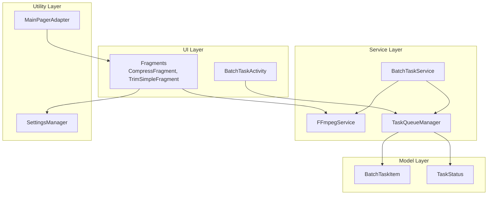
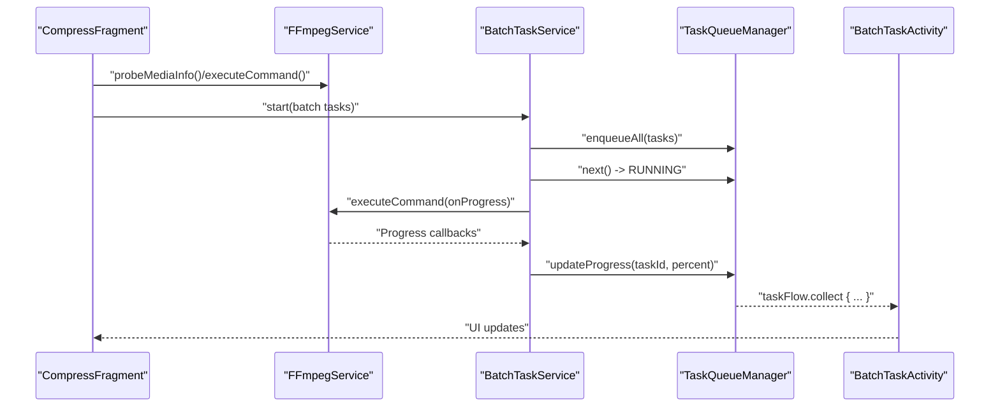
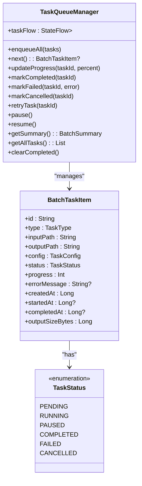
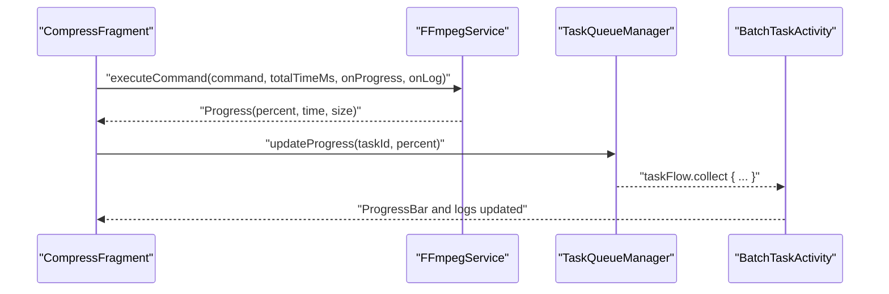
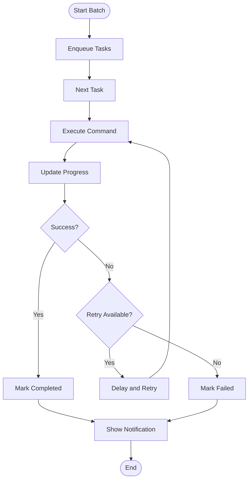
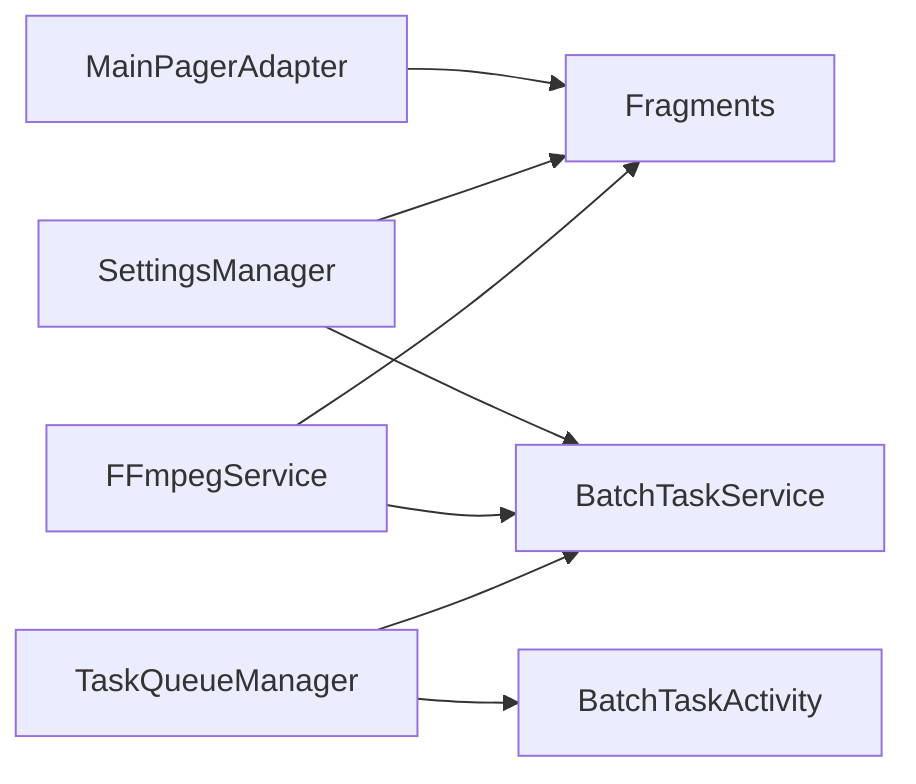

# Design Patterns

<cite>
**Referenced Files in This Document**
- [FFmpegService.kt](file://app/src/main/java/com/pisces312/streamclip/service/FFmpegService.kt)
- [MainPagerAdapter.kt](file://app/src/main/java/com/pisces312/streamclip/adapter/MainPagerAdapter.kt)
- [SettingsManager.kt](file://app/src/main/java/com/pisces312/streamclip/util/SettingsManager.kt)
- [TaskQueueManager.kt](file://app/src/main/java/com/pisces312/streamclip/service/TaskQueueManager.kt)
- [BatchTaskActivity.kt](file://app/src/main/java/com/pisces312/streamclip/ui/BatchTaskActivity.kt)
- [BatchTaskService.kt](file://app/src/main/java/com/pisces312/streamclip/service/BatchTaskService.kt)
- [CompressFragment.kt](file://app/src/main/java/com/pisces312/streamclip/fragment/CompressFragment.kt)
- [TrimSimpleFragment.kt](file://app/src/main/java/com/pisces312/streamclip/fragment/TrimSimpleFragment.kt)
- [TaskStatus.kt](file://app/src/main/java/com/pisces312/streamclip/model/TaskStatus.kt)
- [BatchTaskItem.kt](file://app/src/main/java/com/pisces312/streamclip/model/BatchTaskItem.kt)
</cite>

## Table of Contents
1. [Introduction](#introduction)
2. [Project Structure](#project-structure)
3. [Core Components](#core-components)
4. [Architecture Overview](#architecture-overview)
5. [Detailed Component Analysis](#detailed-component-analysis)
6. [Dependency Analysis](#dependency-analysis)
7. [Performance Considerations](#performance-considerations)
8. [Troubleshooting Guide](#troubleshooting-guide)
9. [Conclusion](#conclusion)

## Introduction
This document analyzes StreamClip’s design patterns implementation, focusing on four key architectural patterns:
- Repository pattern in FFmpegService for centralized media processing access
- Factory pattern in MainPagerAdapter for fragment instantiation
- Singleton pattern in SettingsManager for global configuration
- Observer pattern with Kotlin Flow for state management

We explain implementation details, class relationships, usage examples, benefits, trade-offs, and alternatives, and demonstrate how these patterns improve maintainability, testability, and scalability.

## Project Structure
The application follows a layered structure:
- UI layer: Activities and Fragments
- Service layer: Background processing and orchestration
- Utility layer: Shared helpers and configuration
- Model layer: Data structures for tasks and statuses

**Diagram sources**
- [CompressFragment.kt:40-839](file://app/src/main/java/com/pisces312/streamclip/fragment/CompressFragment.kt#L40-L839)
- [TrimSimpleFragment.kt:35-387](file://app/src/main/java/com/pisces312/streamclip/fragment/TrimSimpleFragment.kt#L35-L387)
- [FFmpegService.kt:19-420](file://app/src/main/java/com/pisces312/streamclip/service/FFmpegService.kt#L19-L420)
- [TaskQueueManager.kt:10-146](file://app/src/main/java/com/pisces312/streamclip/service/TaskQueueManager.kt#L10-L146)
- [BatchTaskService.kt:26-301](file://app/src/main/java/com/pisces312/streamclip/service/BatchTaskService.kt#L26-L301)
- [SettingsManager.kt:6-208](file://app/src/main/java/com/pisces312/streamclip/util/SettingsManager.kt#L6-L208)
- [MainPagerAdapter.kt:17-40](file://app/src/main/java/com/pisces312/streamclip/adapter/MainPagerAdapter.kt#L17-L40)
- [BatchTaskItem.kt:5-32](file://app/src/main/java/com/pisces312/streamclip/model/BatchTaskItem.kt#L5-L32)
- [TaskStatus.kt:3-11](file://app/src/main/java/com/pisces312/streamclip/model/TaskStatus.kt#L3-L11)

**Section sources**
- [FFmpegService.kt:19-420](file://app/src/main/java/com/pisces312/streamclip/service/FFmpegService.kt#L19-L420)
- [MainPagerAdapter.kt:17-40](file://app/src/main/java/com/pisces312/streamclip/adapter/MainPagerAdapter.kt#L17-L40)
- [SettingsManager.kt:6-208](file://app/src/main/java/com/pisces312/streamclip/util/SettingsManager.kt#L6-L208)
- [TaskQueueManager.kt:10-146](file://app/src/main/java/com/pisces312/streamclip/service/TaskQueueManager.kt#L10-L146)
- [BatchTaskActivity.kt:18-89](file://app/src/main/java/com/pisces312/streamclip/ui/BatchTaskActivity.kt#L18-L89)
- [BatchTaskService.kt:26-301](file://app/src/main/java/com/pisces312/streamclip/service/BatchTaskService.kt#L26-L301)
- [CompressFragment.kt:40-839](file://app/src/main/java/com/pisces312/streamclip/fragment/CompressFragment.kt#L40-L839)
- [TrimSimpleFragment.kt:35-387](file://app/src/main/java/com/pisces312/streamclip/fragment/TrimSimpleFragment.kt#L35-L387)
- [BatchTaskItem.kt:5-32](file://app/src/main/java/com/pisces312/streamclip/model/BatchTaskItem.kt#L5-L32)
- [TaskStatus.kt:3-11](file://app/src/main/java/com/pisces312/streamclip/model/TaskStatus.kt#L3-L11)

## Core Components
- FFmpegService: Centralized media processing API encapsulating FFmpegKit operations, progress callbacks, and cancellation.
- MainPagerAdapter: Factory for fragment instances based on tab order configuration.
- SettingsManager: Global configuration provider backed by SharedPreferences.
- TaskQueueManager: State manager using Kotlin Flow to publish task updates.
- BatchTaskActivity and BatchTaskService: UI and background orchestration integrating FFmpegService and TaskQueueManager.

**Section sources**
- [FFmpegService.kt:19-420](file://app/src/main/java/com/pisces312/streamclip/service/FFmpegService.kt#L19-L420)
- [MainPagerAdapter.kt:17-40](file://app/src/main/java/com/pisces312/streamclip/adapter/MainPagerAdapter.kt#L17-L40)
- [SettingsManager.kt:6-208](file://app/src/main/java/com/pisces312/streamclip/util/SettingsManager.kt#L6-L208)
- [TaskQueueManager.kt:10-146](file://app/src/main/java/com/pisces312/streamclip/service/TaskQueueManager.kt#L10-L146)
- [BatchTaskActivity.kt:18-89](file://app/src/main/java/com/pisces312/streamclip/ui/BatchTaskActivity.kt#L18-L89)
- [BatchTaskService.kt:26-301](file://app/src/main/java/com/pisces312/streamclip/service/BatchTaskService.kt#L26-L301)

## Architecture Overview
The system uses a reactive, event-driven architecture:
- UI fragments trigger operations via FFmpegService.
- Background processing is orchestrated by BatchTaskService.
- TaskQueueManager publishes state updates via Flow to BatchTaskActivity.
- SettingsManager provides global configuration to UI and services.

**Diagram sources**
- [CompressFragment.kt:602-680](file://app/src/main/java/com/pisces312/streamclip/fragment/CompressFragment.kt#L602-L680)
- [FFmpegService.kt:152-241](file://app/src/main/java/com/pisces312/streamclip/service/FFmpegService.kt#L152-L241)
- [BatchTaskService.kt:118-165](file://app/src/main/java/com/pisces312/streamclip/service/BatchTaskService.kt#L118-L165)
- [TaskQueueManager.kt:24-78](file://app/src/main/java/com/pisces312/streamclip/service/TaskQueueManager.kt#L24-L78)
- [BatchTaskActivity.kt:69-76](file://app/src/main/java/com/pisces312/streamclip/ui/BatchTaskActivity.kt#L69-L76)

## Detailed Component Analysis

### Repository Pattern in FFmpegService
FFmpegService centralizes media processing operations, acting as a repository for FFmpegKit interactions:
- Encapsulates probing, trimming, merging, extracting, and compression commands
- Provides unified Result and Progress data classes
- Supports cancellation and progress/statistics callbacks
- Uses suspend functions and coroutines for asynchronous execution

Implementation highlights:
- Centralized command building and execution
- Unified error reporting and logging
- Cancellation support via session IDs
- Progress estimation using total duration and statistics

Benefits:
- Single source of truth for media operations
- Simplifies UI code by abstracting FFmpegKit complexity
- Enables consistent progress and error handling

Trade-offs:
- Tight coupling to FFmpegKit library
- Requires careful resource cleanup and cancellation handling

Alternatives considered:
- Interface abstraction around FFmpegKit for testability
- Pluggable backend for different media engines

Usage example paths:
- [FFmpegService.probeMediaInfo:56-147](file://app/src/main/java/com/pisces312/streamclip/service/FFmpegService.kt#L56-L147)
- [FFmpegService.executeCommand:152-241](file://app/src/main/java/com/pisces312/streamclip/service/FFmpegService.kt#L152-L241)
- [FFmpegService.trimVideo:246-272](file://app/src/main/java/com/pisces312/streamclip/service/FFmpegService.kt#L246-L272)
- [FFmpegService.mergeVideos:297-334](file://app/src/main/java/com/pisces312/streamclip/service/FFmpegService.kt#L297-L334)
- [FFmpegService.compressVideo:355-393](file://app/src/main/java/com/pisces312/streamclip/service/FFmpegService.kt#L355-L393)

**Section sources**
- [FFmpegService.kt:19-420](file://app/src/main/java/com/pisces312/streamclip/service/FFmpegService.kt#L19-L420)

### Factory Pattern in MainPagerAdapter
MainPagerAdapter acts as a factory for fragment instantiation:
- Receives a tab order list
- Returns appropriate fragment instance based on tab identifier
- Centralizes fragment creation logic

Implementation highlights:
- Switch-based factory mapping
- Delegated to fragment classes for UI logic
- Configurable tab order for flexibility

Benefits:
- Decouples UI navigation from fragment implementations
- Simplifies ViewPager2 adapter usage
- Enables dynamic tab ordering

Trade-offs:
- Requires updating factory mapping when adding new tabs
- No runtime reflection or DI framework

Usage example paths:
- [MainPagerAdapter.createFragment:24-38](file://app/src/main/java/com/pisces312/streamclip/adapter/MainPagerAdapter.kt#L24-L38)

**Section sources**
- [MainPagerAdapter.kt:17-40](file://app/src/main/java/com/pisces312/streamclip/adapter/MainPagerAdapter.kt#L17-L40)

### Singleton Pattern in SettingsManager
SettingsManager provides global configuration access:
- Uses object declaration for singleton behavior
- Encapsulates SharedPreferences operations
- Offers convenience methods for output directory, timestamps, and cache management

Implementation highlights:
- Private SharedPreferences accessor
- Centralized getters/setters for settings keys
- Output directory logic considering source vs. custom paths

Benefits:
- Consistent configuration access across the app
- Easy testing by mocking or replacing the singleton
- Encapsulation of storage logic

Trade-offs:
- Global mutable state can complicate testing
- Potential for scattered dependencies if misused

Usage example paths:
- [SettingsManager.getOutputDir:67-92](file://app/src/main/java/com/pisces312/streamclip/util/SettingsManager.kt#L67-L92)
- [SettingsManager.generateOutputFileName:99-106](file://app/src/main/java/com/pisces312/streamclip/util/SettingsManager.kt#L99-L106)
- [SettingsManager.getCustomOutputPath:55-61](file://app/src/main/java/com/pisces312/streamclip/util/SettingsManager.kt#L55-L61)

**Section sources**
- [SettingsManager.kt:6-208](file://app/src/main/java/com/pisces312/streamclip/util/SettingsManager.kt#L6-L208)

### Observer Pattern with Kotlin Flow in TaskQueueManager
TaskQueueManager implements an observer pattern using Kotlin Flow:
- Publishes task list updates via StateFlow
- Emits updates on state changes (enqueue, progress, completion, failure)
- BatchTaskActivity subscribes to receive UI updates

Implementation highlights:
- MutableStateFlow for internal state
- Synchronized operations for thread safety
- Immutable snapshot emission for UI consumption

Benefits:
- Reactive UI updates without manual listeners
- Backpressure-safe stream of immutable snapshots
- Clear separation between state mutation and observation

Trade-offs:
- Requires lifecycle-aware collection in UI
- Potential memory overhead if not collected properly

Usage example paths:
- [TaskQueueManager.taskFlow](file://app/src/main/java/com/pisces312/streamclip/service/TaskQueueManager.kt#L14)
- [TaskQueueManager.enqueueAll:24-30](file://app/src/main/java/com/pisces312/streamclip/service/TaskQueueManager.kt#L24-L30)
- [TaskQueueManager.updateProgress:48-53](file://app/src/main/java/com/pisces312/streamclip/service/TaskQueueManager.kt#L48-L53)
- [BatchTaskActivity.observeTasks:69-76](file://app/src/main/java/com/pisces312/streamclip/ui/BatchTaskActivity.kt#L69-L76)

**Diagram sources**
- [TaskQueueManager.kt:10-146](file://app/src/main/java/com/pisces312/streamclip/service/TaskQueueManager.kt#L10-L146)
- [BatchTaskItem.kt:5-32](file://app/src/main/java/com/pisces312/streamclip/model/BatchTaskItem.kt#L5-L32)
- [TaskStatus.kt:3-11](file://app/src/main/java/com/pisces312/streamclip/model/TaskStatus.kt#L3-L11)

**Section sources**
- [TaskQueueManager.kt:10-146](file://app/src/main/java/com/pisces312/streamclip/service/TaskQueueManager.kt#L10-L146)
- [BatchTaskActivity.kt:69-76](file://app/src/main/java/com/pisces312/streamclip/ui/BatchTaskActivity.kt#L69-L76)
- [BatchTaskItem.kt:5-32](file://app/src/main/java/com/pisces312/streamclip/model/BatchTaskItem.kt#L5-L32)
- [TaskStatus.kt:3-11](file://app/src/main/java/com/pisces312/streamclip/model/TaskStatus.kt#L3-L11)

### Real-World Usage Scenarios

#### Scenario 1: Compress Video with Progress Updates
- UI triggers compression via FFmpegService
- Progress callbacks update UI and TaskQueueManager
- BatchTaskActivity observes Flow to reflect state changes

**Diagram sources**
- [CompressFragment.kt:602-680](file://app/src/main/java/com/pisces312/streamclip/fragment/CompressFragment.kt#L602-L680)
- [FFmpegService.kt:152-241](file://app/src/main/java/com/pisces312/streamclip/service/FFmpegService.kt#L152-L241)
- [TaskQueueManager.kt:48-53](file://app/src/main/java/com/pisces312/streamclip/service/TaskQueueManager.kt#L48-L53)
- [BatchTaskActivity.kt:69-76](file://app/src/main/java/com/pisces312/streamclip/ui/BatchTaskActivity.kt#L69-L76)

**Section sources**
- [CompressFragment.kt:602-680](file://app/src/main/java/com/pisces312/streamclip/fragment/CompressFragment.kt#L602-L680)
- [FFmpegService.kt:152-241](file://app/src/main/java/com/pisces312/streamclip/service/FFmpegService.kt#L152-L241)
- [TaskQueueManager.kt:48-53](file://app/src/main/java/com/pisces312/streamclip/service/TaskQueueManager.kt#L48-L53)
- [BatchTaskActivity.kt:69-76](file://app/src/main/java/com/pisces312/streamclip/ui/BatchTaskActivity.kt#L69-L76)

#### Scenario 2: Batch Processing with Retry and Cancellation
- BatchTaskService enqueues tasks and processes sequentially
- Progress updates are forwarded to TaskQueueManager
- UI can retry or cancel individual tasks

**Diagram sources**
- [BatchTaskService.kt:118-165](file://app/src/main/java/com/pisces312/streamclip/service/BatchTaskService.kt#L118-L165)
- [TaskQueueManager.kt:56-78](file://app/src/main/java/com/pisces312/streamclip/service/TaskQueueManager.kt#L56-L78)

**Section sources**
- [BatchTaskService.kt:118-165](file://app/src/main/java/com/pisces312/streamclip/service/BatchTaskService.kt#L118-L165)
- [TaskQueueManager.kt:56-78](file://app/src/main/java/com/pisces312/streamclip/service/TaskQueueManager.kt#L56-L78)

## Dependency Analysis
- FFmpegService depends on FFmpegKit and LogCollector for media operations and logging.
- MainPagerAdapter depends on fragment classes for UI composition.
- SettingsManager depends on SharedPreferences and FileUtils for configuration and output paths.
- TaskQueueManager depends on model types for state representation.
- BatchTaskActivity depends on TaskQueueManager for reactive state.
- BatchTaskService orchestrates TaskQueueManager and FFmpegService for background processing.

**Diagram sources**
- [MainPagerAdapter.kt:17-40](file://app/src/main/java/com/pisces312/streamclip/adapter/MainPagerAdapter.kt#L17-L40)
- [SettingsManager.kt:6-208](file://app/src/main/java/com/pisces312/streamclip/util/SettingsManager.kt#L6-L208)
- [FFmpegService.kt:19-420](file://app/src/main/java/com/pisces312/streamclip/service/FFmpegService.kt#L19-L420)
- [TaskQueueManager.kt:10-146](file://app/src/main/java/com/pisces312/streamclip/service/TaskQueueManager.kt#L10-L146)
- [BatchTaskActivity.kt:18-89](file://app/src/main/java/com/pisces312/streamclip/ui/BatchTaskActivity.kt#L18-L89)
- [BatchTaskService.kt:26-301](file://app/src/main/java/com/pisces312/streamclip/service/BatchTaskService.kt#L26-L301)

**Section sources**
- [MainPagerAdapter.kt:17-40](file://app/src/main/java/com/pisces312/streamclip/adapter/MainPagerAdapter.kt#L17-L40)
- [SettingsManager.kt:6-208](file://app/src/main/java/com/pisces312/streamclip/util/SettingsManager.kt#L6-L208)
- [FFmpegService.kt:19-420](file://app/src/main/java/com/pisces312/streamclip/service/FFmpegService.kt#L19-L420)
- [TaskQueueManager.kt:10-146](file://app/src/main/java/com/pisces312/streamclip/service/TaskQueueManager.kt#L10-L146)
- [BatchTaskActivity.kt:18-89](file://app/src/main/java/com/pisces312/streamclip/ui/BatchTaskActivity.kt#L18-L89)
- [BatchTaskService.kt:26-301](file://app/src/main/java/com/pisces312/streamclip/service/BatchTaskService.kt#L26-L301)

## Performance Considerations
- Repository pattern reduces UI-thread blocking by delegating heavy operations to FFmpegService with coroutines.
- Factory pattern minimizes UI adapter complexity and improves navigation responsiveness.
- Singleton pattern avoids repeated SharedPreferences initialization overhead.
- Flow-based state management ensures efficient UI updates with immutable snapshots and backpressure handling.

## Troubleshooting Guide
Common issues and remedies:
- FFmpeg operations fail silently: Verify FFmpegService error handling and logging paths.
- Progress not updating: Ensure onProgress callbacks are invoked and TaskQueueManager.updateProgress is called.
- Batch tasks stuck: Check TaskQueueManager pause/resume state and BatchTaskService queue processing loop.
- Settings not applied: Confirm SettingsManager getters/setters and SharedPreferences persistence.

**Section sources**
- [FFmpegService.kt:152-241](file://app/src/main/java/com/pisces312/streamclip/service/FFmpegService.kt#L152-L241)
- [TaskQueueManager.kt:48-53](file://app/src/main/java/com/pisces312/streamclip/service/TaskQueueManager.kt#L48-L53)
- [BatchTaskService.kt:118-165](file://app/src/main/java/com/pisces312/streamclip/service/BatchTaskService.kt#L118-L165)
- [SettingsManager.kt:67-92](file://app/src/main/java/com/pisces312/streamclip/util/SettingsManager.kt#L67-L92)

## Conclusion
StreamClip’s design leverages practical patterns to achieve a clean separation of concerns:
- FFmpegService as a centralized repository simplifies media operations.
- MainPagerAdapter as a factory enhances UI modularity.
- SettingsManager as a singleton centralizes configuration.
- TaskQueueManager with Flow enables reactive, scalable state management.

These patterns collectively improve maintainability, testability, and scalability, enabling robust media processing workflows across the application.