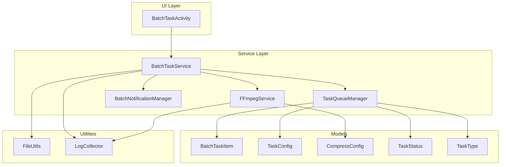
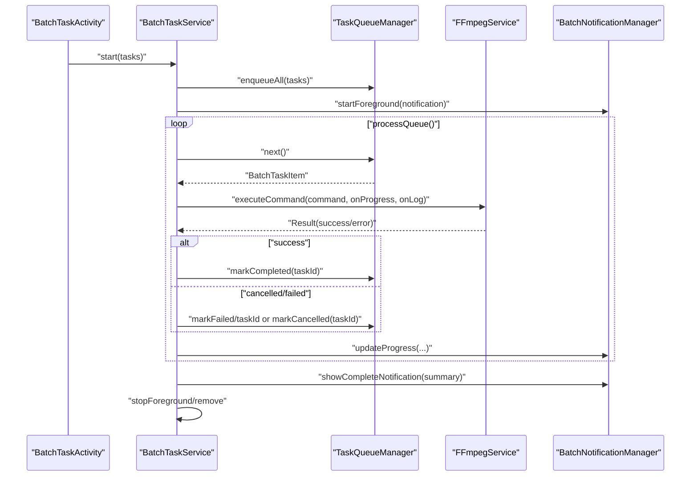
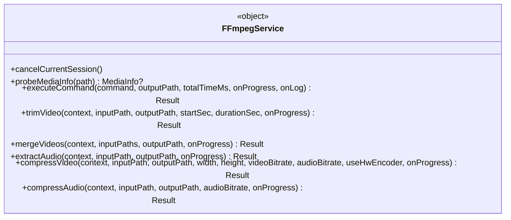
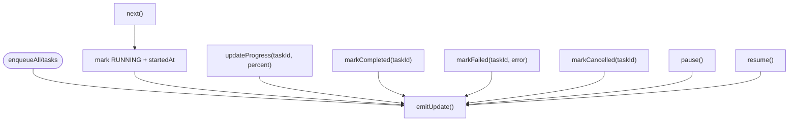
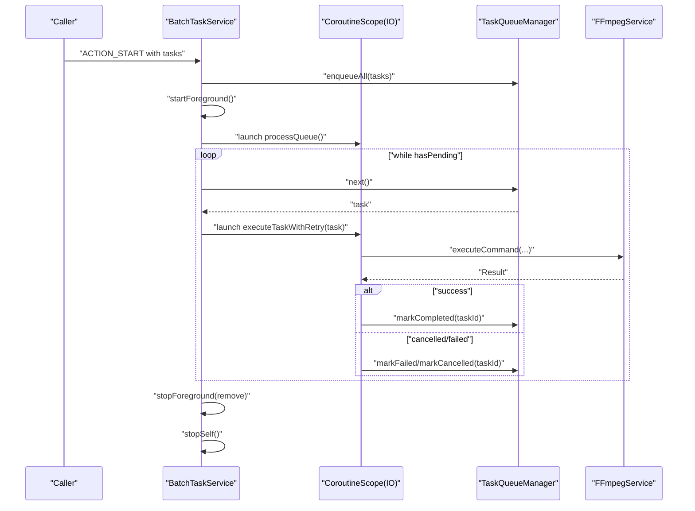
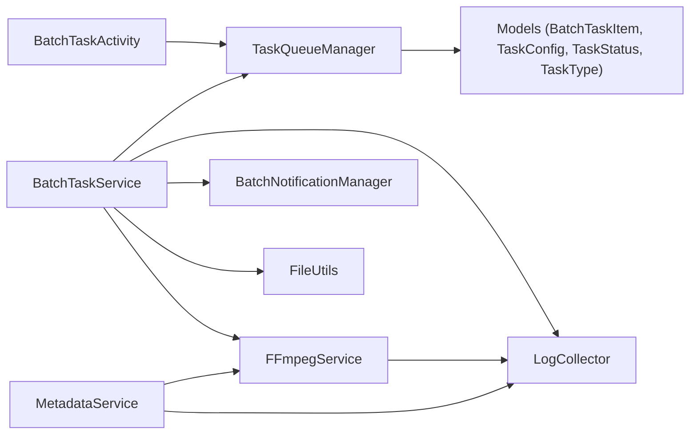

# Service Architecture

<cite>
**Referenced Files in This Document**
- [FFmpegService.kt](file://app/src/main/java/com/pisces312/streamclip/service/FFmpegService.kt)
- [TaskQueueManager.kt](file://app/src/main/java/com/pisces312/streamclip/service/TaskQueueManager.kt)
- [BatchTaskService.kt](file://app/src/main/java/com/pisces312/streamclip/service/BatchTaskService.kt)
- [BatchNotificationManager.kt](file://app/src/main/java/com/pisces312/streamclip/service/BatchNotificationManager.kt)
- [MetadataService.kt](file://app/src/main/java/com/pisces312/streamclip/service/MetadataService.kt)
- [BatchTaskActivity.kt](file://app/src/main/java/com/pisces312/streamclip/ui/BatchTaskActivity.kt)
- [BatchTaskItem.kt](file://app/src/main/java/com/pisces312/streamclip/model/BatchTaskItem.kt)
- [TaskConfig.kt](file://app/src/main/java/com/pisces312/streamclip/model/TaskConfig.kt)
- [CompressConfig.kt](file://app/src/main/java/com/pisces312/streamclip/model/CompressConfig.kt)
- [TaskStatus.kt](file://app/src/main/java/com/pisces312/streamclip/model/TaskStatus.kt)
- [TaskType.kt](file://app/src/main/java/com/pisces312/streamclip/model/TaskType.kt)
- [FileUtils.kt](file://app/src/main/java/com/pisces312/streamclip/util/FileUtils.kt)
- [LogCollector.kt](file://app/src/main/java/com/pisces312/streamclip/util/LogCollector.kt)
</cite>

## Table of Contents
1. [Introduction](#introduction)
2. [Project Structure](#project-structure)
3. [Core Components](#core-components)
4. [Architecture Overview](#architecture-overview)
5. [Detailed Component Analysis](#detailed-component-analysis)
6. [Dependency Analysis](#dependency-analysis)
7. [Performance Considerations](#performance-considerations)
8. [Troubleshooting Guide](#troubleshooting-guide)
9. [Conclusion](#conclusion)

## Introduction
This document explains StreamClip’s centralized service architecture with a focus on the service layer design and component relationships. It details:
- FFmpegService as the singleton video processing engine integrating with ffmpeg-kit
- TaskQueueManager for state management and task coordination
- BatchTaskService for background processing with proper lifecycle management
- Service communication patterns, asynchronous processing using Kotlin Coroutines
- Foreground service implementation for long-running operations
- Initialization sequences, dependency injection patterns, and error handling strategies
- Performance considerations, memory management, and resource cleanup
- Concrete examples of service interactions during video processing and batch task execution

## Project Structure
The service layer resides under app/src/main/java/com/pisces312/streamclip/service and integrates with models, utilities, and UI components. The architecture centers around a foreground service orchestrating a queue of tasks, delegating actual media processing to FFmpegService.

**Diagram sources**
- [BatchTaskActivity.kt:1-89](file://app/src/main/java/com/pisces312/streamclip/ui/BatchTaskActivity.kt#L1-L89)
- [BatchTaskService.kt:1-301](file://app/src/main/java/com/pisces312/streamclip/service/BatchTaskService.kt#L1-L301)
- [FFmpegService.kt:1-420](file://app/src/main/java/com/pisces312/streamclip/service/FFmpegService.kt#L1-L420)
- [TaskQueueManager.kt:1-146](file://app/src/main/java/com/pisces312/streamclip/service/TaskQueueManager.kt#L1-L146)
- [BatchNotificationManager.kt:1-137](file://app/src/main/java/com/pisces312/streamclip/service/BatchNotificationManager.kt#L1-L137)
- [BatchTaskItem.kt:1-32](file://app/src/main/java/com/pisces312/streamclip/model/BatchTaskItem.kt#L1-L32)
- [TaskConfig.kt:1-15](file://app/src/main/java/com/pisces312/streamclip/model/TaskConfig.kt#L1-L15)
- [CompressConfig.kt:1-209](file://app/src/main/java/com/pisces312/streamclip/model/CompressConfig.kt#L1-L209)
- [TaskStatus.kt:1-11](file://app/src/main/java/com/pisces312/streamclip/model/TaskStatus.kt#L1-L11)
- [TaskType.kt:1-8](file://app/src/main/java/com/pisces312/streamclip/model/TaskType.kt#L1-L8)
- [FileUtils.kt:1-362](file://app/src/main/java/com/pisces312/streamclip/util/FileUtils.kt#L1-L362)
- [LogCollector.kt:1-202](file://app/src/main/java/com/pisces312/streamclip/util/LogCollector.kt#L1-L202)

**Section sources**
- [BatchTaskActivity.kt:1-89](file://app/src/main/java/com/pisces312/streamclip/ui/BatchTaskActivity.kt#L1-L89)
- [BatchTaskService.kt:1-301](file://app/src/main/java/com/pisces312/streamclip/service/BatchTaskService.kt#L1-L301)
- [FFmpegService.kt:1-420](file://app/src/main/java/com/pisces312/streamclip/service/FFmpegService.kt#L1-L420)
- [TaskQueueManager.kt:1-146](file://app/src/main/java/com/pisces312/streamclip/service/TaskQueueManager.kt#L1-L146)
- [BatchNotificationManager.kt:1-137](file://app/src/main/java/com/pisces312/streamclip/service/BatchNotificationManager.kt#L1-L137)
- [BatchTaskItem.kt:1-32](file://app/src/main/java/com/pisces312/streamclip/model/BatchTaskItem.kt#L1-L32)
- [TaskConfig.kt:1-15](file://app/src/main/java/com/pisces312/streamclip/model/TaskConfig.kt#L1-L15)
- [CompressConfig.kt:1-209](file://app/src/main/java/com/pisces312/streamclip/model/CompressConfig.kt#L1-L209)
- [TaskStatus.kt:1-11](file://app/src/main/java/com/pisces312/streamclip/model/TaskStatus.kt#L1-L11)
- [TaskType.kt:1-8](file://app/src/main/java/com/pisces312/streamclip/model/TaskType.kt#L1-L8)
- [FileUtils.kt:1-362](file://app/src/main/java/com/pisces312/streamclip/util/FileUtils.kt#L1-L362)
- [LogCollector.kt:1-202](file://app/src/main/java/com/pisces312/streamclip/util/LogCollector.kt#L1-L202)

## Core Components
- FFmpegService: Singleton orchestrating ffmpeg-kit commands, progress callbacks, and cancellation. Provides probing, trimming, merging, extracting, and compression operations.
- TaskQueueManager: Centralized state holder for batch tasks using StateFlow, managing statuses, counts, and progress updates.
- BatchTaskService: Foreground service coordinating task execution, notifications, retries, and lifecycle management.
- BatchNotificationManager: Manages persistent foreground notifications and actions for pause/cancel.
- MetadataService: Wraps FFmpegService for metadata read/save operations.
- Utilities: FileUtils for I/O and file time handling; LogCollector for logging and crash logs.

**Section sources**
- [FFmpegService.kt:19-420](file://app/src/main/java/com/pisces312/streamclip/service/FFmpegService.kt#L19-L420)
- [TaskQueueManager.kt:10-146](file://app/src/main/java/com/pisces312/streamclip/service/TaskQueueManager.kt#L10-L146)
- [BatchTaskService.kt:26-301](file://app/src/main/java/com/pisces312/streamclip/service/BatchTaskService.kt#L26-L301)
- [BatchNotificationManager.kt:17-137](file://app/src/main/java/com/pisces312/streamclip/service/BatchNotificationManager.kt#L17-L137)
- [MetadataService.kt:10-93](file://app/src/main/java/com/pisces312/streamclip/service/MetadataService.kt#L10-L93)
- [FileUtils.kt:17-362](file://app/src/main/java/com/pisces312/streamclip/util/FileUtils.kt#L17-L362)
- [LogCollector.kt:15-202](file://app/src/main/java/com/pisces312/streamclip/util/LogCollector.kt#L15-L202)

## Architecture Overview
The system follows a centralized service pattern:
- UI triggers BatchTaskService via explicit intents
- BatchTaskService enqueues tasks into TaskQueueManager and starts a foreground process
- Each task delegates to FFmpegService for actual media processing
- Progress and logs are propagated to UI via TaskQueueManager’s StateFlow and notifications
- Lifecycle events (pause/resume/stop/cancel) are handled centrally

**Diagram sources**
- [BatchTaskActivity.kt:69-82](file://app/src/main/java/com/pisces312/streamclip/ui/BatchTaskActivity.kt#L69-L82)
- [BatchTaskService.kt:92-165](file://app/src/main/java/com/pisces312/streamclip/service/BatchTaskService.kt#L92-L165)
- [TaskQueueManager.kt:33-86](file://app/src/main/java/com/pisces312/streamclip/service/TaskQueueManager.kt#L33-L86)
- [FFmpegService.kt:152-241](file://app/src/main/java/com/pisces312/streamclip/service/FFmpegService.kt#L152-L241)
- [BatchNotificationManager.kt:57-89](file://app/src/main/java/com/pisces312/streamclip/service/BatchNotificationManager.kt#L57-L89)

## Detailed Component Analysis

### FFmpegService
FFmpegService is a singleton that encapsulates:
- Media probing using FFprobeKit
- Async execution via FFmpegKit.executeAsync with StatisticsCallback and log callback
- Cancellation via sessionId tracking
- High-level operations: trim, merge, extract, compress, compress audio
- Progress estimation using total duration and StatisticsCallback

Key behaviors:
- Uses Dispatchers.IO and suspendCancellableCoroutine to bridge blocking ffmpeg-kit calls into coroutines
- Emits progress updates and logs to callbacks
- Cancels current session on demand and cancels on coroutine cancellation

**Diagram sources**
- [FFmpegService.kt:19-420](file://app/src/main/java/com/pisces312/streamclip/service/FFmpegService.kt#L19-L420)

**Section sources**
- [FFmpegService.kt:24-33](file://app/src/main/java/com/pisces312/streamclip/service/FFmpegService.kt#L24-L33)
- [FFmpegService.kt:56-147](file://app/src/main/java/com/pisces312/streamclip/service/FFmpegService.kt#L56-L147)
- [FFmpegService.kt:152-241](file://app/src/main/java/com/pisces312/streamclip/service/FFmpegService.kt#L152-L241)
- [FFmpegService.kt:246-334](file://app/src/main/java/com/pisces312/streamclip/service/FFmpegService.kt#L246-L334)
- [FFmpegService.kt:339-418](file://app/src/main/java/com/pisces312/streamclip/service/FFmpegService.kt#L339-L418)

### TaskQueueManager
Central state manager for batch tasks:
- Maintains a queue and a map of all tasks
- Exposes StateFlow<List<BatchTaskItem>> for UI observation
- Thread-safe updates for progress, completion, failure, cancellation, pause/resume
- Provides summaries and retry/clear operations

**Diagram sources**
- [TaskQueueManager.kt:24-93](file://app/src/main/java/com/pisces312/streamclip/service/TaskQueueManager.kt#L24-L93)
- [TaskQueueManager.kt:142-144](file://app/src/main/java/com/pisces312/streamclip/service/TaskQueueManager.kt#L142-L144)

**Section sources**
- [TaskQueueManager.kt:10-146](file://app/src/main/java/com/pisces312/streamclip/service/TaskQueueManager.kt#L10-L146)
- [BatchTaskItem.kt:5-18](file://app/src/main/java/com/pisces312/streamclip/model/BatchTaskItem.kt#L5-L18)
- [TaskStatus.kt:3-10](file://app/src/main/java/com/pisces312/streamclip/model/TaskStatus.kt#L3-L10)

### BatchTaskService
Foreground service implementing:
- Intent-driven actions: start, stop, pause, resume, cancel task
- CoroutineScope with SupervisorJob for resilient child tasks
- Queue processing loop with per-task jobs for cancellation
- Retry logic with exponential delays
- Cleanup on failures and file time preservation

**Diagram sources**
- [BatchTaskService.kt:79-165](file://app/src/main/java/com/pisces312/streamclip/service/BatchTaskService.kt#L79-L165)
- [BatchTaskService.kt:167-240](file://app/src/main/java/com/pisces312/streamclip/service/BatchTaskService.kt#L167-L240)
- [TaskQueueManager.kt:33-86](file://app/src/main/java/com/pisces312/streamclip/service/TaskQueueManager.kt#L33-L86)
- [FFmpegService.kt:152-241](file://app/src/main/java/com/pisces312/streamclip/service/FFmpegService.kt#L152-L241)

**Section sources**
- [BatchTaskService.kt:26-64](file://app/src/main/java/com/pisces312/streamclip/service/BatchTaskService.kt#L26-L64)
- [BatchTaskService.kt:74-121](file://app/src/main/java/com/pisces312/streamclip/service/BatchTaskService.kt#L74-L121)
- [BatchTaskService.kt:123-165](file://app/src/main/java/com/pisces312/streamclip/service/BatchTaskService.kt#L123-L165)
- [BatchTaskService.kt:167-240](file://app/src/main/java/com/pisces312/streamclip/service/BatchTaskService.kt#L167-L240)
- [BatchTaskService.kt:257-263](file://app/src/main/java/com/pisces312/streamclip/service/BatchTaskService.kt#L257-L263)
- [BatchTaskService.kt:265-293](file://app/src/main/java/com/pisces312/streamclip/service/BatchTaskService.kt#L265-L293)

### BatchNotificationManager
Manages persistent foreground notifications:
- Creates notification channel
- Builds start/progress/update notifications with actions
- Integrates with BatchTaskActivity via PendingIntent

**Section sources**
- [BatchNotificationManager.kt:17-55](file://app/src/main/java/com/pisces312/streamclip/service/BatchNotificationManager.kt#L17-L55)
- [BatchNotificationManager.kt:57-89](file://app/src/main/java/com/pisces312/streamclip/service/BatchNotificationManager.kt#L57-L89)
- [BatchNotificationManager.kt:91-121](file://app/src/main/java/com/pisces312/streamclip/service/BatchNotificationManager.kt#L91-L121)
- [BatchNotificationManager.kt:123-131](file://app/src/main/java/com/pisces312/streamclip/service/BatchNotificationManager.kt#L123-L131)

### MetadataService
Provides metadata read/save operations:
- Reads metadata via FFmpegService.probeMediaInfo and converts to VideoMetadata
- Saves metadata using FFmpeg with -c copy for lossless modification
- Generates output path for edited files

**Section sources**
- [MetadataService.kt:10-28](file://app/src/main/java/com/pisces312/streamclip/service/MetadataService.kt#L10-L28)
- [MetadataService.kt:34-67](file://app/src/main/java/com/pisces312/streamclip/service/MetadataService.kt#L34-L67)
- [MetadataService.kt:73-80](file://app/src/main/java/com/pisces312/streamclip/service/MetadataService.kt#L73-L80)

### UI Integration: BatchTaskActivity
Observes TaskQueueManager.taskFlow to render task list and supports retry/cancel/open actions.

**Section sources**
- [BatchTaskActivity.kt:69-82](file://app/src/main/java/com/pisces312/streamclip/ui/BatchTaskActivity.kt#L69-L82)

## Dependency Analysis
- FFmpegService depends on ffmpeg-kit and LogCollector
- TaskQueueManager depends on models (BatchTaskItem, TaskConfig, TaskStatus, TaskType)
- BatchTaskService depends on TaskQueueManager, FFmpegService, BatchNotificationManager, FileUtils, LogCollector
- MetadataService depends on FFmpegService and model conversions
- UI depends on TaskQueueManager for reactive updates

**Diagram sources**
- [BatchTaskActivity.kt:69-82](file://app/src/main/java/com/pisces312/streamclip/ui/BatchTaskActivity.kt#L69-L82)
- [BatchTaskService.kt:66-77](file://app/src/main/java/com/pisces312/streamclip/service/BatchTaskService.kt#L66-L77)
- [FFmpegService.kt:1-17](file://app/src/main/java/com/pisces312/streamclip/service/FFmpegService.kt#L1-L17)
- [TaskQueueManager.kt:1-14](file://app/src/main/java/com/pisces312/streamclip/service/TaskQueueManager.kt#L1-L14)
- [BatchNotificationManager.kt:1-15](file://app/src/main/java/com/pisces312/streamclip/service/BatchNotificationManager.kt#L1-L15)
- [FileUtils.kt:1-15](file://app/src/main/java/com/pisces312/streamclip/util/FileUtils.kt#L1-L15)
- [LogCollector.kt:1-20](file://app/src/main/java/com/pisces312/streamclip/util/LogCollector.kt#L1-L20)
- [MetadataService.kt:1-8](file://app/src/main/java/com/pisces312/streamclip/service/MetadataService.kt#L1-L8)

**Section sources**
- [BatchTaskService.kt:66-77](file://app/src/main/java/com/pisces312/streamclip/service/BatchTaskService.kt#L66-L77)
- [FFmpegService.kt:1-17](file://app/src/main/java/com/pisces312/streamclip/service/FFmpegService.kt#L1-L17)
- [TaskQueueManager.kt:1-14](file://app/src/main/java/com/pisces312/streamclip/service/TaskQueueManager.kt#L1-L14)
- [BatchNotificationManager.kt:1-15](file://app/src/main/java/com/pisces312/streamclip/service/BatchNotificationManager.kt#L1-L15)
- [FileUtils.kt:1-15](file://app/src/main/java/com/pisces312/streamclip/util/FileUtils.kt#L1-L15)
- [LogCollector.kt:1-20](file://app/src/main/java/com/pisces312/streamclip/util/LogCollector.kt#L1-L20)
- [MetadataService.kt:1-8](file://app/src/main/java/com/pisces312/streamclip/service/MetadataService.kt#L1-L8)

## Performance Considerations
- Concurrency and cancellation: BatchTaskService uses SupervisorJob to isolate task failures and allows per-task cancellation via stored Job references.
- Progress estimation: FFmpegService computes percentage from StatisticsCallback time and total duration; estimates remaining time using elapsed time.
- I/O and scanning: FileUtils scans new files into MediaStore and preserves timestamps; BatchTaskService applies creation/modification times post-processing.
- Memory and logs: LogCollector maintains bounded in-memory logs and truncates files to limit overhead.
- Retries: BatchTaskService retries failed tasks with backoff to mitigate transient failures.

[No sources needed since this section provides general guidance]

## Troubleshooting Guide
Common areas to check:
- Session cancellation: Ensure FFmpegService.cancelCurrentSession is called when stopping or cancelling tasks.
- Progress reporting: Verify StatisticsCallback and onProgress handlers update TaskQueueManager and notifications.
- Failure cleanup: Confirm BatchTaskService.cleanupOnFailure removes partial outputs.
- Logging: Use LogCollector to capture errors and review crash logs after exceptions.
- Notifications: Validate notification channel creation and PendingIntent flags for actions.

**Section sources**
- [FFmpegService.kt:24-31](file://app/src/main/java/com/pisces312/streamclip/service/FFmpegService.kt#L24-L31)
- [BatchTaskService.kt:257-263](file://app/src/main/java/com/pisces312/streamclip/service/BatchTaskService.kt#L257-L263)
- [LogCollector.kt:150-168](file://app/src/main/java/com/pisces312/streamclip/util/LogCollector.kt#L150-L168)
- [BatchNotificationManager.kt:26-38](file://app/src/main/java/com/pisces312/streamclip/service/BatchNotificationManager.kt#L26-L38)

## Conclusion
StreamClip’s service architecture centers on a robust foreground service orchestrator (BatchTaskService), a centralized task state manager (TaskQueueManager), and a singleton media engine (FFmpegService). The design leverages Kotlin Coroutines for asynchronous processing, proper foreground lifecycle management, and comprehensive progress and error reporting. Utilities and models provide cohesive data structures and I/O handling, enabling reliable batch processing workflows.