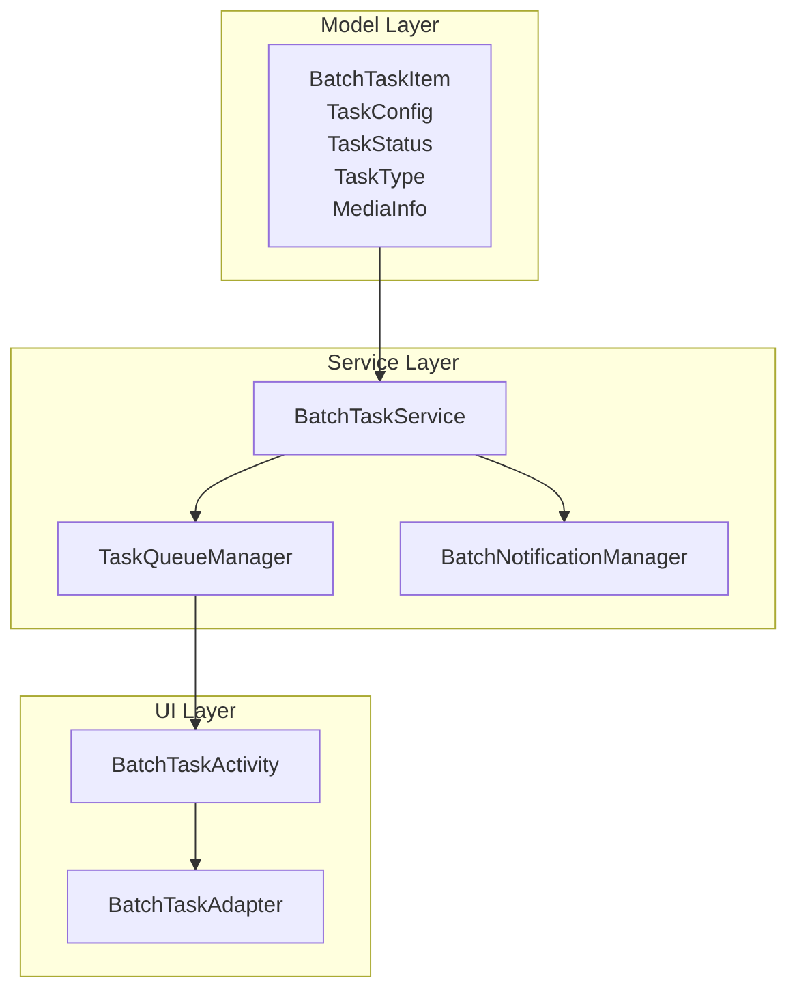
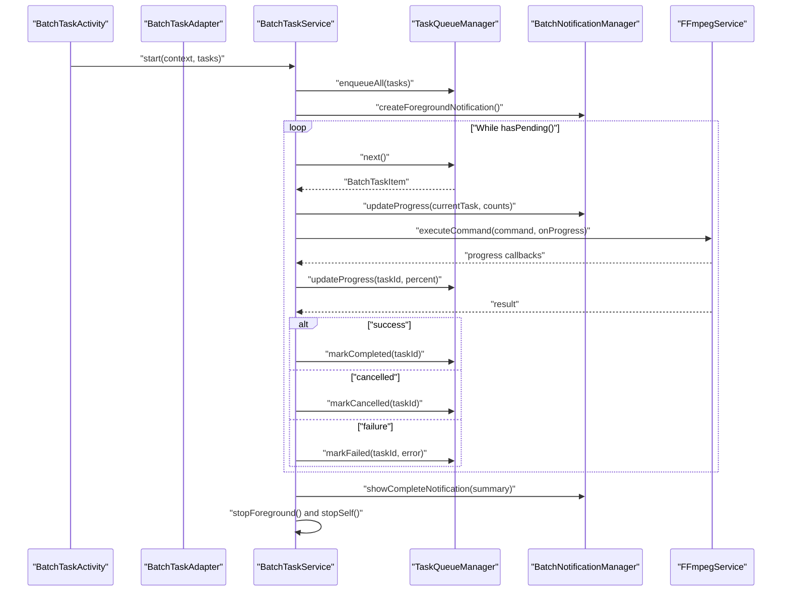
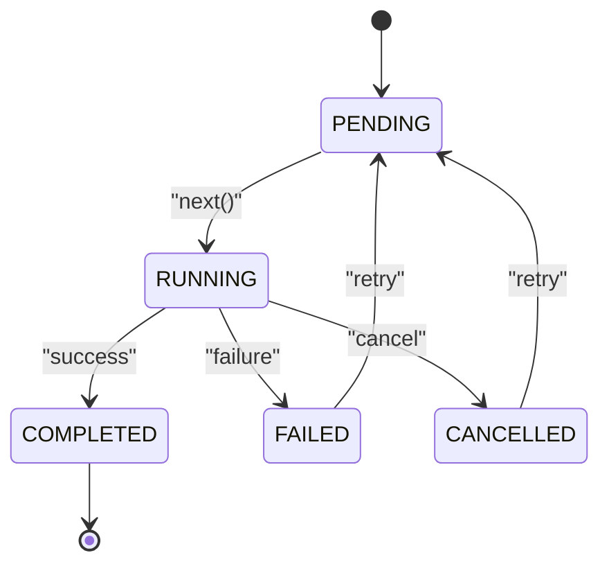
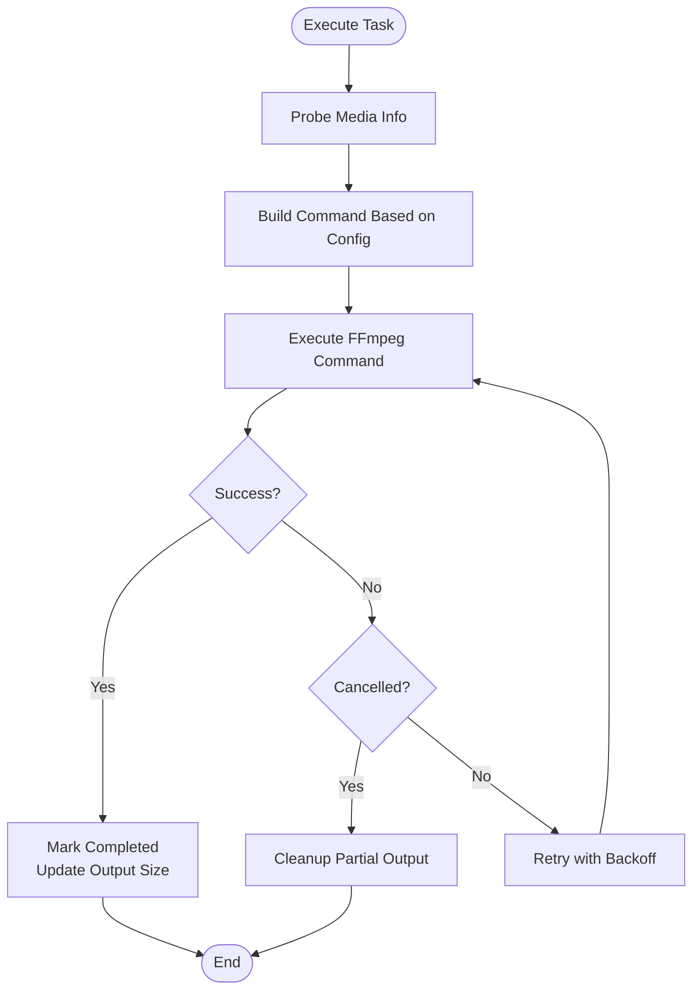
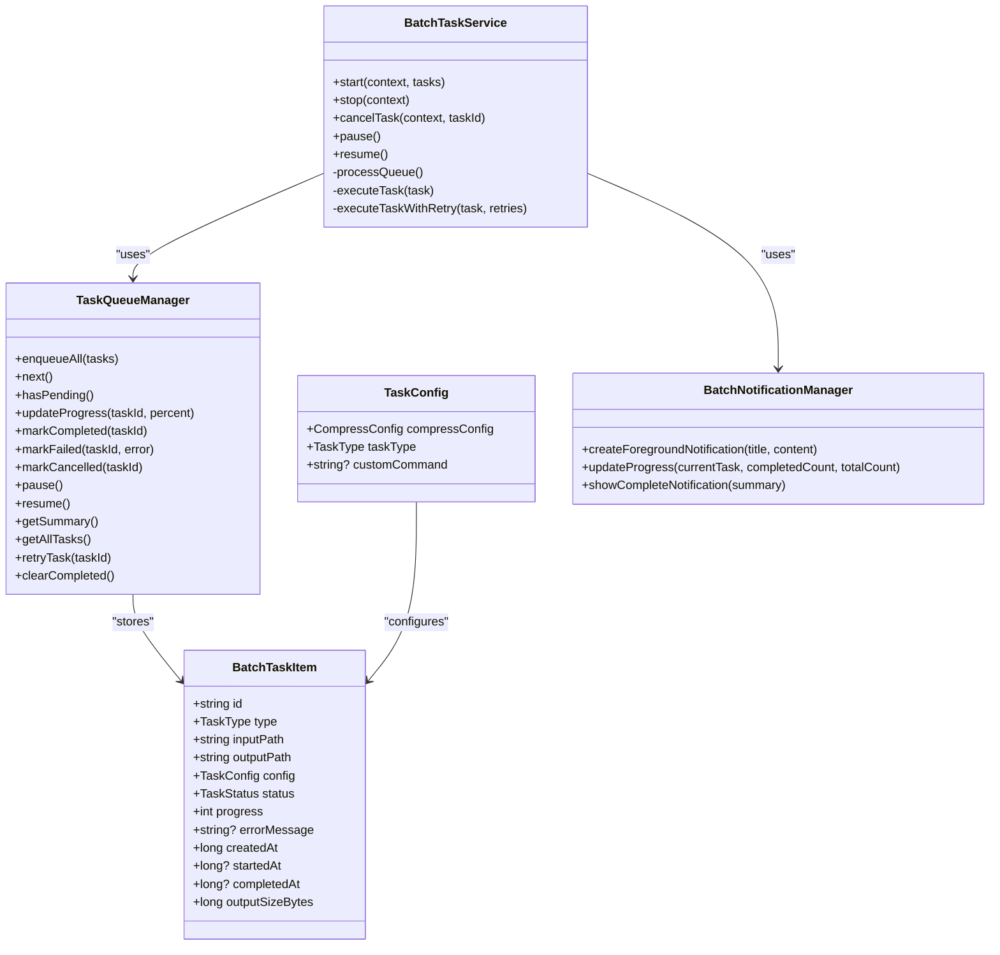

# Batch Task Item Model

<cite>
**Referenced Files in This Document**
- [BatchTaskItem.kt](file://app/src/main/java/com/pisces312/streamclip/model/BatchTaskItem.kt)
- [TaskStatus.kt](file://app/src/main/java/com/pisces312/streamclip/model/TaskStatus.kt)
- [TaskConfig.kt](file://app/src/main/java/com/pisces312/streamclip/model/TaskConfig.kt)
- [TaskType.kt](file://app/src/main/java/com/pisces312/streamclip/model/TaskType.kt)
- [CompressConfig.kt](file://app/src/main/java/com/pisces312/streamclip/model/CompressConfig.kt)
- [MediaInfo.kt](file://app/src/main/java/com/pisces312/streamclip/model/MediaInfo.kt)
- [BatchTaskService.kt](file://app/src/main/java/com/pisces312/streamclip/service/BatchTaskService.kt)
- [TaskQueueManager.kt](file://app/src/main/java/com/pisces312/streamclip/service/TaskQueueManager.kt)
- [BatchNotificationManager.kt](file://app/src/main/java/com/pisces312/streamclip/service/BatchNotificationManager.kt)
- [BatchTaskActivity.kt](file://app/src/main/java/com/pisces312/streamclip/ui/BatchTaskActivity.kt)
- [BatchTaskAdapter.kt](file://app/src/main/java/com/pisces312/streamclip/adapter/BatchTaskAdapter.kt)
- [batch-queue-design.md](file://docs/batch-queue-design.md)
</cite>

## Table of Contents
1. [Introduction](#introduction)
2. [Project Structure](#project-structure)
3. [Core Components](#core-components)
4. [Architecture Overview](#architecture-overview)
5. [Detailed Component Analysis](#detailed-component-analysis)
6. [Dependency Analysis](#dependency-analysis)
7. [Performance Considerations](#performance-considerations)
8. [Troubleshooting Guide](#troubleshooting-guide)
9. [Conclusion](#conclusion)
10. [Appendices](#appendices)

## Introduction
This document provides comprehensive documentation for the BatchTaskItem data class used to manage individual items in the batch processing queue within StreamClip. It explains the structure of batch task items, including task configuration, status tracking, progress monitoring, and result handling. It also details the relationship between BatchTaskItem and the overall batch processing workflow managed by BatchTaskService and TaskQueueManager, covering task lifecycle management, status transitions, error handling, retry mechanisms, integration with notifications and UI updates, and practical examples for creation, monitoring, and completion handling. Serialization requirements, thread-safety considerations, and memory management strategies for large batch queues are included.

## Project Structure
The batch processing system is organized into layered components:
- Data model layer: defines BatchTaskItem, TaskConfig, TaskStatus, TaskType, and related media metadata.
- Service layer: orchestrates batch execution via BatchTaskService and manages the in-memory queue via TaskQueueManager.
- Notification layer: BatchNotificationManager handles foreground notifications and progress updates.
- UI layer: BatchTaskActivity and BatchTaskAdapter present task lists, actions, and real-time updates.

**Diagram sources**
- [BatchTaskItem.kt:1-32](file://app/src/main/java/com/pisces312/streamclip/model/BatchTaskItem.kt#L1-L32)
- [TaskConfig.kt:1-15](file://app/src/main/java/com/pisces312/streamclip/model/TaskConfig.kt#L1-L15)
- [TaskStatus.kt:1-11](file://app/src/main/java/com/pisces312/streamclip/model/TaskStatus.kt#L1-L11)
- [TaskType.kt:1-8](file://app/src/main/java/com/pisces312/streamclip/model/TaskType.kt#L1-L8)
- [MediaInfo.kt:1-165](file://app/src/main/java/com/pisces312/streamclip/model/MediaInfo.kt#L1-L165)
- [BatchTaskService.kt:1-301](file://app/src/main/java/com/pisces312/streamclip/service/BatchTaskService.kt#L1-L301)
- [TaskQueueManager.kt:1-146](file://app/src/main/java/com/pisces312/streamclip/service/TaskQueueManager.kt#L1-L146)
- [BatchNotificationManager.kt:1-137](file://app/src/main/java/com/pisces312/streamclip/service/BatchNotificationManager.kt#L1-L137)
- [BatchTaskActivity.kt:1-89](file://app/src/main/java/com/pisces312/streamclip/ui/BatchTaskActivity.kt#L1-L89)
- [BatchTaskAdapter.kt:1-86](file://app/src/main/java/com/pisces312/streamclip/adapter/BatchTaskAdapter.kt#L1-L86)

**Section sources**
- [batch-queue-design.md:25-74](file://docs/batch-queue-design.md#L25-L74)

## Core Components
- BatchTaskItem: Immutable data class representing a single queued task with identifiers, configuration, status, progress, timestamps, and output metrics. It is serializable to support passing via intents and future persistence.
- TaskConfig: Encapsulates encoding parameters and task type, including compression settings and optional custom commands.
- TaskStatus: Enumerates lifecycle states (PENDING, RUNNING, PAUSED, COMPLETED, FAILED, CANCELLED).
- TaskType: Enumerates supported task categories (COMPRESS, EXTRACT_AUDIO, CUSTOM_COMMAND).
- MediaInfo: Provides probing metadata for input media to inform command construction and post-processing.

Key characteristics of BatchTaskItem:
- Unique identifier generated at creation.
- Immutable snapshot semantics via Kotlin data class, enabling safe sharing across threads and flows.
- Serializable for inter-process communication and potential persistence.
- Timestamps for creation, start, and completion enable audit and analytics.
- Progress and output size support UI rendering and completion reporting.

**Section sources**
- [BatchTaskItem.kt:5-18](file://app/src/main/java/com/pisces312/streamclip/model/BatchTaskItem.kt#L5-L18)
- [TaskConfig.kt:5-9](file://app/src/main/java/com/pisces312/streamclip/model/TaskConfig.kt#L5-L9)
- [TaskStatus.kt:3-10](file://app/src/main/java/com/pisces312/streamclip/model/TaskStatus.kt#L3-L10)
- [TaskType.kt:3-7](file://app/src/main/java/com/pisces312/streamclip/model/TaskType.kt#L3-L7)
- [MediaInfo.kt:5-165](file://app/src/main/java/com/pisces312/streamclip/model/MediaInfo.kt#L5-L165)

## Architecture Overview
The batch processing workflow is driven by a ForegroundService that coordinates a queue manager and a notification manager. The service executes tasks sequentially, updates progress, and notifies the UI via a reactive StateFlow.

**Diagram sources**
- [BatchTaskService.kt:92-165](file://app/src/main/java/com/pisces312/streamclip/service/BatchTaskService.kt#L92-L165)
- [TaskQueueManager.kt:32-86](file://app/src/main/java/com/pisces312/streamclip/service/TaskQueueManager.kt#L32-L86)
- [BatchNotificationManager.kt:40-89](file://app/src/main/java/com/pisces312/streamclip/service/BatchNotificationManager.kt#L40-L89)

**Section sources**
- [BatchTaskService.kt:26-301](file://app/src/main/java/com/pisces312/streamclip/service/BatchTaskService.kt#L26-L301)
- [TaskQueueManager.kt:10-146](file://app/src/main/java/com/pisces312/streamclip/service/TaskQueueManager.kt#L10-L146)
- [BatchNotificationManager.kt:17-137](file://app/src/main/java/com/pisces312/streamclip/service/BatchNotificationManager.kt#L17-L137)

## Detailed Component Analysis

### BatchTaskItem Data Model
BatchTaskItem encapsulates all essential attributes for a queued task:
- Identity: id, type, inputPath, outputPath
- Configuration: config (TaskConfig)
- Lifecycle: status, progress, timestamps (createdAt, startedAt, completedAt)
- Outcome: errorMessage, outputSizeBytes

Serialization and immutability:
- Implements Serializable to support passing via intents and future persistence.
- Uses immutable snapshots via data class semantics, enabling safe sharing across coroutines and flows.

Integration points:
- Used by TaskQueueManager for state tracking and UI updates.
- Consumed by BatchTaskService during execution and progress reporting.
- Drives UI rendering via BatchTaskAdapter and BatchTaskActivity.

**Section sources**
- [BatchTaskItem.kt:5-18](file://app/src/main/java/com/pisces312/streamclip/model/BatchTaskItem.kt#L5-L18)

### Task Configuration and Command Construction
TaskConfig consolidates encoding parameters and task type:
- Compression: CompressConfig fields (encoder, bitrate/crf, resolution, frameRate, preset, audio settings, hardware/software mode, metadata copying).
- Task type: TaskType determines command building (compress, extract audio, custom command).
- Custom command: Optional free-form command string for advanced scenarios.

CompressConfig.toFFmpegCommand constructs the FFmpeg command using MediaInfo-provided color metadata and scaling factors, ensuring correct color space and resolution handling.

**Section sources**
- [TaskConfig.kt:5-9](file://app/src/main/java/com/pisces312/streamclip/model/TaskConfig.kt#L5-L9)
- [CompressConfig.kt:21-114](file://app/src/main/java/com/pisces312/streamclip/model/CompressConfig.kt#L21-L114)
- [MediaInfo.kt:5-165](file://app/src/main/java/com/pisces312/streamclip/model/MediaInfo.kt#L5-L165)

### Task Lifecycle and Status Transitions
The lifecycle is modeled as a finite state machine with explicit transitions:
- PENDING → RUNNING (when dequeued)
- RUNNING → COMPLETED (on success)
- RUNNING → FAILED (on error)
- RUNNING → CANCELLED (on user cancellation)
- FAILED/CANCELLED → PENDING (retry creates a new task with reset state)

TaskQueueManager enforces thread-safe state transitions and emits updates via StateFlow to keep UI synchronized.

**Diagram sources**
- [TaskStatus.kt:3-10](file://app/src/main/java/com/pisces312/streamclip/model/TaskStatus.kt#L3-L10)
- [TaskQueueManager.kt:36-86](file://app/src/main/java/com/pisces312/streamclip/service/TaskQueueManager.kt#L36-L86)

**Section sources**
- [TaskStatus.kt:3-10](file://app/src/main/java/com/pisces312/streamclip/model/TaskStatus.kt#L3-L10)
- [TaskQueueManager.kt:36-86](file://app/src/main/java/com/pisces312/streamclip/service/TaskQueueManager.kt#L36-L86)

### Execution Pipeline and Retry Mechanisms
BatchTaskService drives execution:
- Enqueues tasks and starts a foreground service.
- Iteratively dequeues tasks, updates progress, and executes commands via FFmpegService.
- Implements automatic retry with exponential backoff for transient failures.
- Cleans up partial outputs on failure and marks tasks accordingly.

**Diagram sources**
- [BatchTaskService.kt:167-240](file://app/src/main/java/com/pisces312/streamclip/service/BatchTaskService.kt#L167-L240)
- [BatchTaskService.kt:257-263](file://app/src/main/java/com/pisces312/streamclip/service/BatchTaskService.kt#L257-L263)

**Section sources**
- [BatchTaskService.kt:167-240](file://app/src/main/java/com/pisces312/streamclip/service/BatchTaskService.kt#L167-L240)
- [BatchTaskService.kt:257-263](file://app/src/main/java/com/pisces312/streamclip/service/BatchTaskService.kt#L257-L263)

### Notification and UI Integration
BatchNotificationManager provides:
- Foreground notification with ongoing progress and action buttons (pause, cancel).
- Completion notification summarizing results.
- Channel creation for Android O+.

BatchTaskActivity and BatchTaskAdapter:
- Observe TaskQueueManager.taskFlow to render live updates.
- Provide actions: retry failed tasks, cancel running/pending tasks, open outputs.
- Use DiffUtil for efficient list updates.

**Section sources**
- [BatchNotificationManager.kt:40-121](file://app/src/main/java/com/pisces312/streamclip/service/BatchNotificationManager.kt#L40-L121)
- [BatchTaskActivity.kt:69-82](file://app/src/main/java/com/pisces312/streamclip/ui/BatchTaskActivity.kt#L69-L82)
- [BatchTaskAdapter.kt:33-78](file://app/src/main/java/com/pisces312/streamclip/adapter/BatchTaskAdapter.kt#L33-L78)

### Example Workflows

#### Creating and Starting a Batch
- Build a list of BatchTaskItem entries with appropriate TaskConfig and output paths.
- Start the service with the task list to enqueue and begin processing.

References:
- [BatchTaskService.kt:49-55](file://app/src/main/java/com/pisces312/streamclip/service/BatchTaskService.kt#L49-L55)
- [batch-queue-design.md:1144-1157](file://docs/batch-queue-design.md#L1144-L1157)

#### Monitoring Progress and Status
- Subscribe to TaskQueueManager.taskFlow to receive updates.
- UI renders progress bars and status messages based on BatchTaskItem fields.

References:
- [TaskQueueManager.kt:13-14](file://app/src/main/java/com/pisces312/streamclip/service/TaskQueueManager.kt#L13-L14)
- [BatchTaskAdapter.kt:33-78](file://app/src/main/java/com/pisces312/streamclip/adapter/BatchTaskAdapter.kt#L33-L78)

#### Handling Completion and Post-Processing
- On success, output size is recorded and file times/metadata are restored.
- On failure, partial outputs are cleaned up.

References:
- [BatchTaskService.kt:211-232](file://app/src/main/java/com/pisces312/streamclip/service/BatchTaskService.kt#L211-L232)
- [BatchTaskService.kt:257-263](file://app/src/main/java/com/pisces312/streamclip/service/BatchTaskService.kt#L257-L263)

## Dependency Analysis
The following diagram shows the primary dependencies among core components:

**Diagram sources**
- [BatchTaskItem.kt:5-18](file://app/src/main/java/com/pisces312/streamclip/model/BatchTaskItem.kt#L5-L18)
- [TaskConfig.kt:5-9](file://app/src/main/java/com/pisces312/streamclip/model/TaskConfig.kt#L5-L9)
- [TaskQueueManager.kt:10-146](file://app/src/main/java/com/pisces312/streamclip/service/TaskQueueManager.kt#L10-L146)
- [BatchTaskService.kt:26-301](file://app/src/main/java/com/pisces312/streamclip/service/BatchTaskService.kt#L26-L301)
- [BatchNotificationManager.kt:17-137](file://app/src/main/java/com/pisces312/streamclip/service/BatchNotificationManager.kt#L17-L137)

**Section sources**
- [BatchTaskService.kt:26-301](file://app/src/main/java/com/pisces312/streamclip/service/BatchTaskService.kt#L26-L301)
- [TaskQueueManager.kt:10-146](file://app/src/main/java/com/pisces312/streamclip/service/TaskQueueManager.kt#L10-L146)

## Performance Considerations
- Concurrency model: Single-threaded queue processing ensures deterministic state transitions and avoids race conditions. Coroutines are used for cancellation support and non-blocking progress updates.
- Memory management: Queue stores lightweight BatchTaskItem snapshots (paths, config, timestamps). Large media is not loaded; only metadata is probed when needed.
- UI updates: RecyclerView with DiffUtil minimizes redraw overhead. Notifications throttle updates to reduce system overhead.
- I/O efficiency: Output scanning and metadata restoration occur after successful completion; partial outputs are cleaned up on failure.

[No sources needed since this section provides general guidance]

## Troubleshooting Guide
Common issues and resolutions:
- Task stuck in PENDING or RUNNING:
  - Verify TaskQueueManager.next() is invoked and not paused.
  - Check for exceptions in BatchTaskService.executeTask and ensure cleanupOnFailure is executed on failure.
- Progress not updating:
  - Confirm onProgress callbacks are invoked and TaskQueueManager.updateProgress is called.
  - Ensure UI observes TaskQueueManager.taskFlow and adapter receives updates.
- Notifications not appearing:
  - Verify notification channel creation and permissions (Android 13+).
  - Confirm foreground service is started and notifications are posted with correct IDs.
- Retries not working:
  - Ensure executeTaskWithRetry is invoked and TaskQueueManager.retryTask creates a new task with reset state.

**Section sources**
- [BatchTaskService.kt:167-240](file://app/src/main/java/com/pisces312/streamclip/service/BatchTaskService.kt#L167-L240)
- [BatchTaskService.kt:257-263](file://app/src/main/java/com/pisces312/streamclip/service/BatchTaskService.kt#L257-L263)
- [TaskQueueManager.kt:122-139](file://app/src/main/java/com/pisces312/streamclip/service/TaskQueueManager.kt#L122-L139)
- [BatchNotificationManager.kt:26-38](file://app/src/main/java/com/pisces312/streamclip/service/BatchNotificationManager.kt#L26-L38)

## Conclusion
BatchTaskItem serves as the central data structure for StreamClip’s batch processing workflow. Its immutable design, serialization support, and integration with TaskQueueManager, BatchTaskService, and UI components enable robust, observable, and user-friendly batch operations. The lifecycle model, retry mechanisms, and notification system provide reliability and transparency during long-running batch jobs.

[No sources needed since this section summarizes without analyzing specific files]

## Appendices

### Serialization Requirements
- BatchTaskItem and TaskConfig implement Serializable to support passing via intents and future persistence.
- Ensure all nested types (e.g., CompressConfig) remain serializable if persisted.

**Section sources**
- [BatchTaskItem.kt:18](file://app/src/main/java/com/pisces312/streamclip/model/BatchTaskItem.kt#L18)
- [TaskConfig.kt:9](file://app/src/main/java/com/pisces312/streamclip/model/TaskConfig.kt#L9)

### Thread Safety and Concurrency
- TaskQueueManager uses synchronized methods and a concurrent map to guard state transitions.
- StateFlow ensures reactive updates without manual synchronization in consumers.
- BatchTaskService uses SupervisorJob and Dispatchers.IO for cancellable, non-fault-propagating concurrency.

**Section sources**
- [TaskQueueManager.kt:23-144](file://app/src/main/java/com/pisces312/streamclip/service/TaskQueueManager.kt#L23-L144)
- [BatchTaskService.kt:66](file://app/src/main/java/com/pisces312/streamclip/service/BatchTaskService.kt#L66)

### Memory Management Strategies
- Queue holds only task snapshots; media is not loaded.
- Output size is recorded upon completion to avoid repeated I/O.
- Completed tasks can be cleared to reclaim memory.

**Section sources**
- [TaskQueueManager.kt:62-64](file://app/src/main/java/com/pisces312/streamclip/service/TaskQueueManager.kt#L62-L64)
- [TaskQueueManager.kt:113-119](file://app/src/main/java/com/pisces312/streamclip/service/TaskQueueManager.kt#L113-L119)