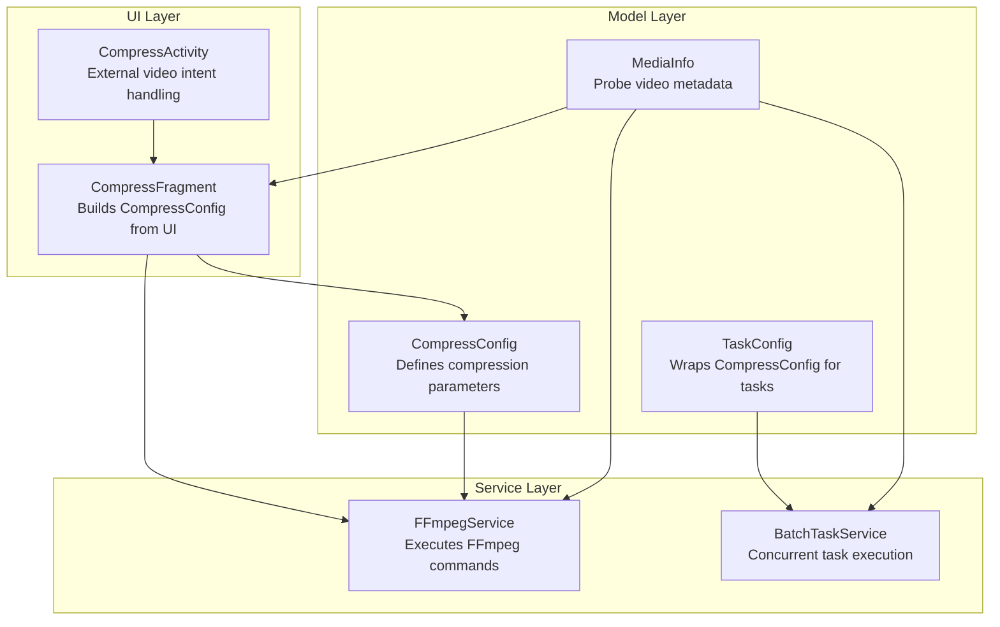
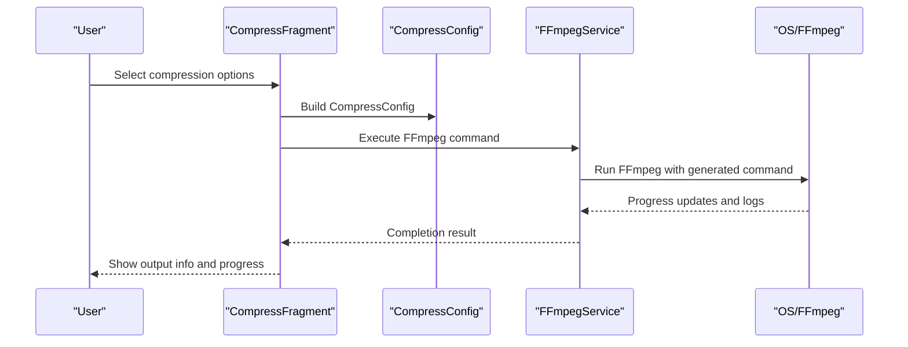
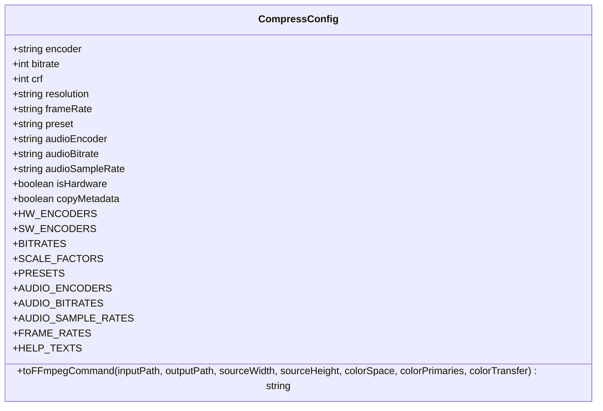
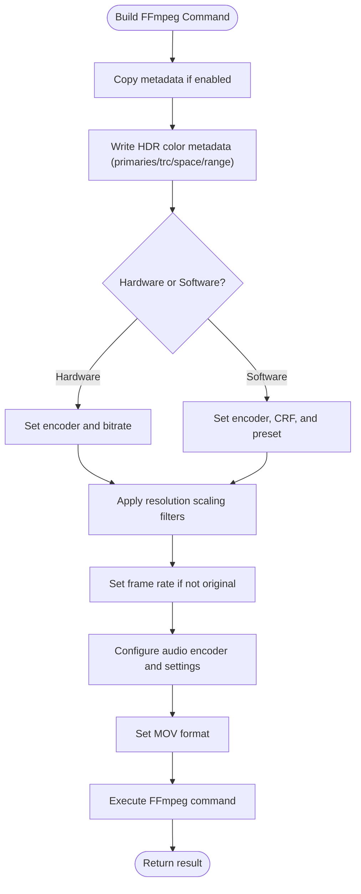
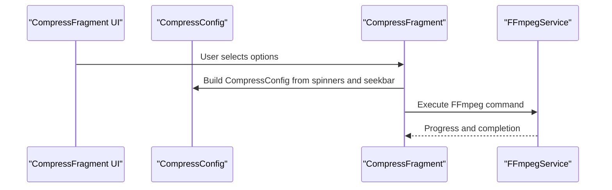
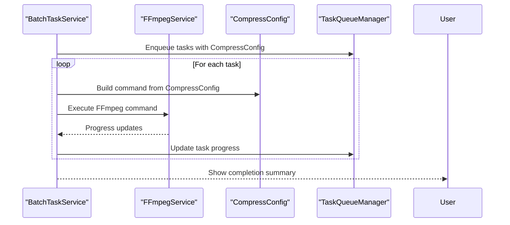
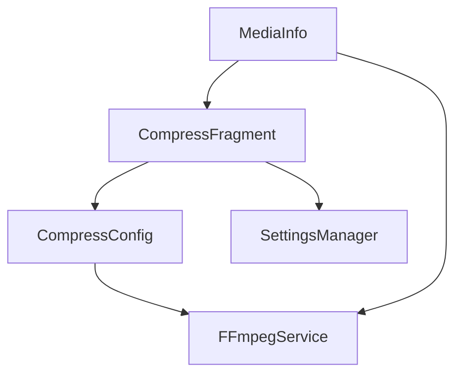

# Compression Configuration Model

<cite>
**Referenced Files in This Document**
- [CompressConfig.kt](file://app/src/main/java/com/pisces312/streamclip/model/CompressConfig.kt)
- [FFmpegService.kt](file://app/src/main/java/com/pisces312/streamclip/service/FFmpegService.kt)
- [CompressFragment.kt](file://app/src/main/java/com/pisces312/streamclip/fragment/CompressFragment.kt)
- [CompressActivity.kt](file://app/src/main/java/com/pisces312/streamclip/ui/CompressActivity.kt)
- [BatchTaskService.kt](file://app/src/main/java/com/pisces312/streamclip/service/BatchTaskService.kt)
- [TaskConfig.kt](file://app/src/main/java/com/pisces312/streamclip/model/TaskConfig.kt)
- [MediaInfo.kt](file://app/src/main/java/com/pisces312/streamclip/model/MediaInfo.kt)
- [SettingsManager.kt](file://app/src/main/java/com/pisces312/streamclip/util/SettingsManager.kt)
- [README.md](file://README.md)
</cite>

## Table of Contents
1. [Introduction](#introduction)
2. [Project Structure](#project-structure)
3. [Core Components](#core-components)
4. [Architecture Overview](#architecture-overview)
5. [Detailed Component Analysis](#detailed-component-analysis)
6. [Dependency Analysis](#dependency-analysis)
7. [Performance Considerations](#performance-considerations)
8. [Troubleshooting Guide](#troubleshooting-guide)
9. [Conclusion](#conclusion)

## Introduction
This document provides comprehensive documentation for the CompressConfig data class used to manage video compression parameters in StreamClip. It explains all compression-related fields, including quality settings, bitrate configurations, encoder selection, and format options. It also covers the relationship between hardware and software encoding, quality presets, and performance trade-offs, along with default value handling, validation rules, and constraint enforcement. The document details how CompressConfig integrates with FFmpeg encoding operations and affects output file size and quality, provides examples of different compression scenarios, optimal parameter combinations, and thread-safety considerations for concurrent processing environments.

## Project Structure
The compression configuration model is part of the StreamClip Android application, which provides video processing capabilities using FFmpeg. The relevant components are organized as follows:
- Model layer: CompressConfig defines compression parameters and generates FFmpeg commands.
- Service layer: FFmpegService executes FFmpeg operations and manages progress and logs.
- UI layer: CompressFragment and CompressActivity orchestrate user interactions and build CompressConfig instances.
- Batch processing: BatchTaskService uses CompressConfig to run compression tasks concurrently.

**Diagram sources**
- [CompressConfig.kt:1-209](file://app/src/main/java/com/pisces312/streamclip/model/CompressConfig.kt#L1-L209)
- [FFmpegService.kt:1-420](file://app/src/main/java/com/pisces312/streamclip/service/FFmpegService.kt#L1-L420)
- [CompressFragment.kt:1-839](file://app/src/main/java/com/pisces312/streamclip/fragment/CompressFragment.kt#L1-L839)
- [CompressActivity.kt:1-37](file://app/src/main/java/com/pisces312/streamclip/ui/CompressActivity.kt#L1-L37)
- [BatchTaskService.kt:1-301](file://app/src/main/java/com/pisces312/streamclip/service/BatchTaskService.kt#L1-L301)
- [TaskConfig.kt:1-15](file://app/src/main/java/com/pisces312/streamclip/model/TaskConfig.kt#L1-L15)
- [MediaInfo.kt:1-165](file://app/src/main/java/com/pisces312/streamclip/model/MediaInfo.kt#L1-L165)

**Section sources**
- [README.md:1-150](file://README.md#L1-L150)
- [CompressConfig.kt:1-209](file://app/src/main/java/com/pisces312/streamclip/model/CompressConfig.kt#L1-L209)
- [FFmpegService.kt:1-420](file://app/src/main/java/com/pisces312/streamclip/service/FFmpegService.kt#L1-L420)
- [CompressFragment.kt:1-839](file://app/src/main/java/com/pisces312/streamclip/fragment/CompressFragment.kt#L1-L839)
- [CompressActivity.kt:1-37](file://app/src/main/java/com/pisces312/streamclip/ui/CompressActivity.kt#L1-L37)
- [BatchTaskService.kt:1-301](file://app/src/main/java/com/pisces312/streamclip/service/BatchTaskService.kt#L1-L301)
- [TaskConfig.kt:1-15](file://app/src/main/java/com/pisces312/streamclip/model/TaskConfig.kt#L1-L15)
- [MediaInfo.kt:1-165](file://app/src/main/java/com/pisces312/streamclip/model/MediaInfo.kt#L1-L165)

## Core Components
CompressConfig encapsulates all compression parameters and generates the FFmpeg command string used for encoding. It includes:
- Encoder selection: hardware (MediaCodec) or software (libx264/libx265).
- Bitrate configuration: hardware bitrate in kbps; software CRF and preset.
- Resolution scaling: predefined scale factors.
- Frame rate control: fixed frame rates or original.
- Audio configuration: encoder, bitrate, and sample rate.
- Metadata handling: copy metadata flag and HDR color metadata writing.
- Format output: MOV container for metadata preservation.

Key constants define available options for encoders, bitrates, presets, audio encoders, audio bitrates, audio sample rates, and frame rates. These lists are used by the UI to populate spinners and sliders.

Default values:
- Hardware: H.264 MediaCodec encoder, 2000 kbps bitrate, original resolution, original frame rate, medium preset, copy audio, 128 kbps audio bitrate, copy audio sample rate, hardware mode enabled, copy metadata enabled.
- Software: H.264 libx264 encoder, CRF 23, medium preset, original resolution, original frame rate, copy audio, 128 kbps audio bitrate, copy audio sample rate, software mode disabled, copy metadata enabled.

Validation and constraints:
- Resolution scaling uses predefined scale factors; invalid selections fall back to original.
- Frame rate accepts numeric values or "original".
- Audio bitrate and sample rate accept "copy" or numeric values.
- HDR handling writes color primaries/trc/spaces to MOV container for Android compatibility.

Integration with FFmpeg:
- toFFmpegCommand builds a complete command string with metadata, color metadata, encoder selection, rate control, filters, frame rate, audio settings, and MOV output format.

**Section sources**
- [CompressConfig.kt:3-15](file://app/src/main/java/com/pisces312/streamclip/model/CompressConfig.kt#L3-L15)
- [CompressConfig.kt:21-114](file://app/src/main/java/com/pisces312/streamclip/model/CompressConfig.kt#L21-L114)
- [CompressConfig.kt:116-207](file://app/src/main/java/com/pisces312/streamclip/model/CompressConfig.kt#L116-L207)

## Architecture Overview
The compression pipeline connects UI interactions to FFmpeg execution through CompressConfig. The flow is:
- CompressFragment constructs a CompressConfig from user selections.
- CompressActivity handles external intents to open videos directly for compression.
- FFmpegService probes media info and executes the generated FFmpeg command.
- BatchTaskService runs multiple compression tasks concurrently, using CompressConfig for each task.

**Diagram sources**
- [CompressFragment.kt:682-719](file://app/src/main/java/com/pisces312/streamclip/fragment/CompressFragment.kt#L682-L719)
- [CompressConfig.kt:21-114](file://app/src/main/java/com/pisces312/streamclip/model/CompressConfig.kt#L21-L114)
- [FFmpegService.kt:152-241](file://app/src/main/java/com/pisces312/streamclip/service/FFmpegService.kt#L152-L241)

**Section sources**
- [CompressFragment.kt:682-719](file://app/src/main/java/com/pisces312/streamclip/fragment/CompressFragment.kt#L682-L719)
- [CompressActivity.kt:12-31](file://app/src/main/java/com/pisces312/streamclip/ui/CompressActivity.kt#L12-L31)
- [FFmpegService.kt:152-241](file://app/src/main/java/com/pisces312/streamclip/service/FFmpegService.kt#L152-L241)

## Detailed Component Analysis

### CompressConfig Data Class
CompressConfig is a serializable data class that defines all compression parameters and generates the FFmpeg command string. It includes:
- Encoder selection: hardware (h264_mediacodec, hevc_mediacodec) or software (libx264, libx265).
- Bitrate configuration: hardware bitrate in kbps; software CRF (0-51) and preset.
- Resolution scaling: predefined scale factors (1.5x, 2.25x, 3x).
- Frame rate control: numeric frame rates or "original".
- Audio configuration: encoder, bitrate, and sample rate.
- Metadata handling: copy metadata flag and HDR color metadata writing.
- Format output: MOV container for metadata preservation.

**Diagram sources**
- [CompressConfig.kt:3-15](file://app/src/main/java/com/pisces312/streamclip/model/CompressConfig.kt#L3-L15)
- [CompressConfig.kt:116-207](file://app/src/main/java/com/pisces312/streamclip/model/CompressConfig.kt#L116-L207)

**Section sources**
- [CompressConfig.kt:3-15](file://app/src/main/java/com/pisces312/streamclip/model/CompressConfig.kt#L3-L15)
- [CompressConfig.kt:21-114](file://app/src/main/java/com/pisces312/streamclip/model/CompressConfig.kt#L21-L114)
- [CompressConfig.kt:116-207](file://app/src/main/java/com/pisces312/streamclip/model/CompressConfig.kt#L116-L207)

### FFmpeg Command Generation and Execution
CompressConfig.toFFmpegCommand builds a complete FFmpeg command string that includes:
- Input and metadata copying.
- Color metadata writing for HDR (color primaries, transfer, space, range).
- Encoder selection and rate control (hardware bitrate vs. software CRF/preset).
- Resolution scaling filters and rotation metadata clearing.
- Frame rate setting.
- Audio encoder and settings.
- MOV output format for metadata preservation.

FFmpegService executes the command asynchronously, providing progress callbacks and logging. It also supports probing media info to estimate total processing time.

**Diagram sources**
- [CompressConfig.kt:21-114](file://app/src/main/java/com/pisces312/streamclip/model/CompressConfig.kt#L21-L114)
- [FFmpegService.kt:152-241](file://app/src/main/java/com/pisces312/streamclip/service/FFmpegService.kt#L152-L241)

**Section sources**
- [CompressConfig.kt:21-114](file://app/src/main/java/com/pisces312/streamclip/model/CompressConfig.kt#L21-L114)
- [FFmpegService.kt:152-241](file://app/src/main/java/com/pisces312/streamclip/service/FFmpegService.kt#L152-L241)

### UI Integration and Parameter Building
CompressFragment builds CompressConfig from user selections in the UI:
- Hardware panel: encoder, bitrate, resolution, frame rate, audio settings.
- Software panel: encoder, CRF, preset, resolution, frame rate, audio settings.
- Spinner adapters populate options from CompressConfig companion object lists.
- Audio visibility toggles based on encoder selection ("copy" hides advanced audio settings).

CompressActivity handles external intents to open videos directly for compression.

**Diagram sources**
- [CompressFragment.kt:164-292](file://app/src/main/java/com/pisces312/streamclip/fragment/CompressFragment.kt#L164-L292)
- [CompressFragment.kt:682-719](file://app/src/main/java/com/pisces312/streamclip/fragment/CompressFragment.kt#L682-L719)
- [CompressActivity.kt:12-31](file://app/src/main/java/com/pisces312/streamclip/ui/CompressActivity.kt#L12-L31)

**Section sources**
- [CompressFragment.kt:164-292](file://app/src/main/java/com/pisces312/streamclip/fragment/CompressFragment.kt#L164-L292)
- [CompressFragment.kt:682-719](file://app/src/main/java/com/pisces312/streamclip/fragment/CompressFragment.kt#L682-L719)
- [CompressActivity.kt:12-31](file://app/src/main/java/com/pisces312/streamclip/ui/CompressActivity.kt#L12-L31)

### Batch Processing and Concurrency
BatchTaskService runs multiple compression tasks concurrently:
- Enqueues tasks and processes them sequentially with progress notifications.
- Builds FFmpeg commands using CompressConfig for each task.
- Supports cancellation and retry mechanisms.

**Diagram sources**
- [BatchTaskService.kt:92-165](file://app/src/main/java/com/pisces312/streamclip/service/BatchTaskService.kt#L92-L165)
- [BatchTaskService.kt:242-251](file://app/src/main/java/com/pisces312/streamclip/service/BatchTaskService.kt#L242-L251)
- [TaskConfig.kt:5-14](file://app/src/main/java/com/pisces312/streamclip/model/TaskConfig.kt#L5-L14)

**Section sources**
- [BatchTaskService.kt:92-165](file://app/src/main/java/com/pisces312/streamclip/service/BatchTaskService.kt#L92-L165)
- [BatchTaskService.kt:242-251](file://app/src/main/java/com/pisces312/streamclip/service/BatchTaskService.kt#L242-L251)
- [TaskConfig.kt:5-14](file://app/src/main/java/com/pisces312/streamclip/model/TaskConfig.kt#L5-L14)

## Dependency Analysis
CompressConfig depends on:
- Companion object lists for encoder, bitrate, preset, audio encoder, audio bitrate, audio sample rate, and frame rate options.
- MediaInfo for color metadata and resolution information used in command generation.

FFmpegService depends on:
- CompressConfig for building commands.
- MediaInfo for probing video metadata to estimate total processing time.

CompressFragment depends on:
- CompressConfig for building configuration from UI selections.
- SettingsManager for output directory and filename generation.

**Diagram sources**
- [CompressConfig.kt:116-207](file://app/src/main/java/com/pisces312/streamclip/model/CompressConfig.kt#L116-L207)
- [MediaInfo.kt:5-165](file://app/src/main/java/com/pisces312/streamclip/model/MediaInfo.kt#L5-L165)
- [FFmpegService.kt:152-241](file://app/src/main/java/com/pisces312/streamclip/service/FFmpegService.kt#L152-L241)
- [CompressFragment.kt:682-719](file://app/src/main/java/com/pisces312/streamclip/fragment/CompressFragment.kt#L682-L719)
- [SettingsManager.kt:67-114](file://app/src/main/java/com/pisces312/streamclip/util/SettingsManager.kt#L67-L114)

**Section sources**
- [CompressConfig.kt:116-207](file://app/src/main/java/com/pisces312/streamclip/model/CompressConfig.kt#L116-L207)
- [MediaInfo.kt:5-165](file://app/src/main/java/com/pisces312/streamclip/model/MediaInfo.kt#L5-L165)
- [FFmpegService.kt:152-241](file://app/src/main/java/com/pisces312/streamclip/service/FFmpegService.kt#L152-L241)
- [CompressFragment.kt:682-719](file://app/src/main/java/com/pisces312/streamclip/fragment/CompressFragment.kt#L682-L719)
- [SettingsManager.kt:67-114](file://app/src/main/java/com/pisces312/streamclip/util/SettingsManager.kt#L67-L114)

## Performance Considerations
- Hardware vs. software encoding:
  - Hardware encoding (MediaCodec) prioritizes speed and power efficiency, using bitrate control. It is suitable for general sharing and mobile playback.
  - Software encoding (libx264/libx265) prioritizes quality and compression efficiency, using CRF and presets. It is suitable for archiving and higher fidelity output.
- Quality presets:
  - Faster presets reduce encoding time but may increase file size for the same perceived quality.
  - Slower presets improve compression efficiency and quality at the cost of longer encoding times.
- Bitrate vs. CRF:
  - Hardware bitrate targets a specific data rate; output size varies with scene complexity.
  - Software CRF targets a constant quality level; output size varies with scene complexity.
- Resolution scaling:
  - Reducing resolution significantly reduces file size and encoding time.
  - Scaling factors are predefined to maintain common aspect ratios.
- Frame rate:
  - Lower frame rates reduce file size but may affect smoothness.
- Audio settings:
  - Copying audio avoids re-encoding and preserves quality.
  - Re-encoding audio allows reducing bitrate for smaller files.
- HDR handling:
  - HDR requires additional color metadata writing for Android compatibility.
  - Hardware HDR uses main10 profile and MOV metadata flags; software HDR uses 10-bit pixel formats.

[No sources needed since this section provides general guidance]

## Troubleshooting Guide
Common issues and resolutions:
- Playback problems with HDR:
  - Ensure color metadata is written to the MOV container for Android compatibility.
  - Use hardware encoder with main10 profile for HDR content.
- Audio sample rate crashes:
  - Default to "copy" for audio sample rate to avoid swresample native crashes.
- Progress estimation:
  - FFmpegService estimates remaining time using total duration from MediaInfo.
- Batch processing failures:
  - BatchTaskService retries failed tasks and cleans up partial outputs.
- Thread safety:
  - CompressConfig is immutable and serializable, safe for concurrent use.
  - FFmpegService uses coroutines and cancellation tokens for safe async operations.

**Section sources**
- [CompressConfig.kt:40-58](file://app/src/main/java/com/pisces312/streamclip/model/CompressConfig.kt#L40-L58)
- [FFmpegService.kt:182-241](file://app/src/main/java/com/pisces312/streamclip/service/FFmpegService.kt#L182-L241)
- [BatchTaskService.kt:167-240](file://app/src/main/java/com/pisces312/streamclip/service/BatchTaskService.kt#L167-L240)

## Conclusion
CompressConfig provides a comprehensive and flexible model for configuring video compression in StreamClip. It supports both hardware and software encoding, offers fine-grained quality and bitrate controls, and integrates seamlessly with FFmpeg operations. The UI layer translates user selections into validated CompressConfig instances, while the service layer executes commands with progress tracking and robust error handling. Batch processing enables efficient concurrent compression tasks. By understanding the trade-offs between hardware and software encoding, quality presets, and resolution/frame rate adjustments, users can optimize compression for their specific use cases while maintaining metadata and HDR compatibility.