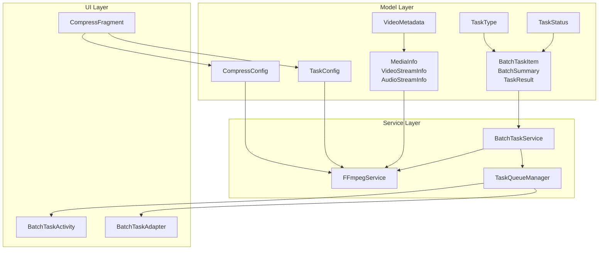
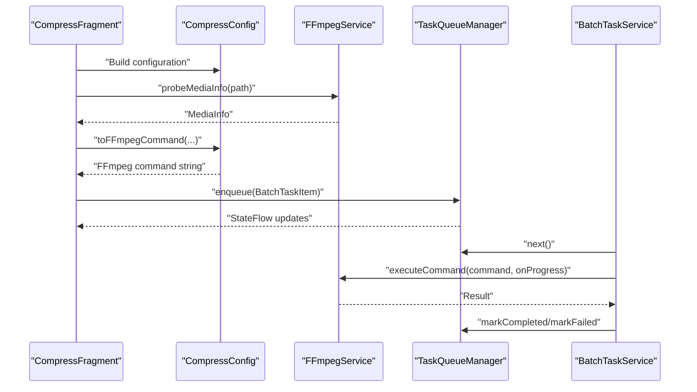
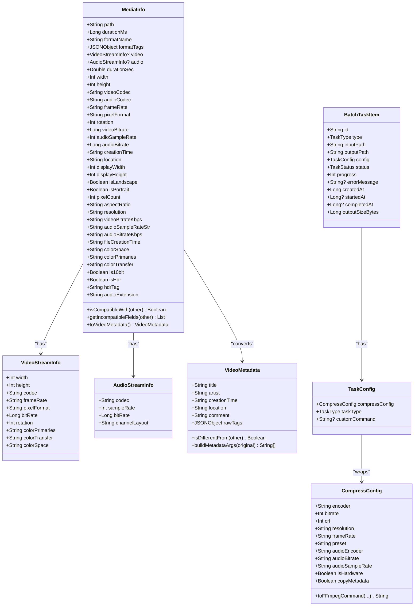
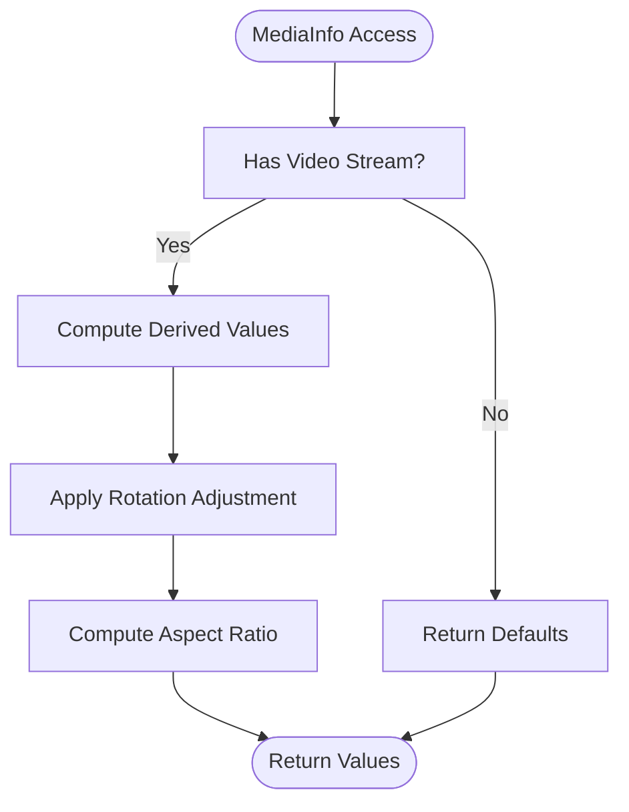
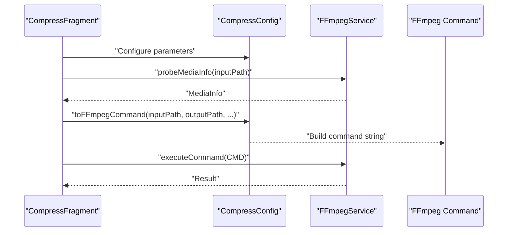
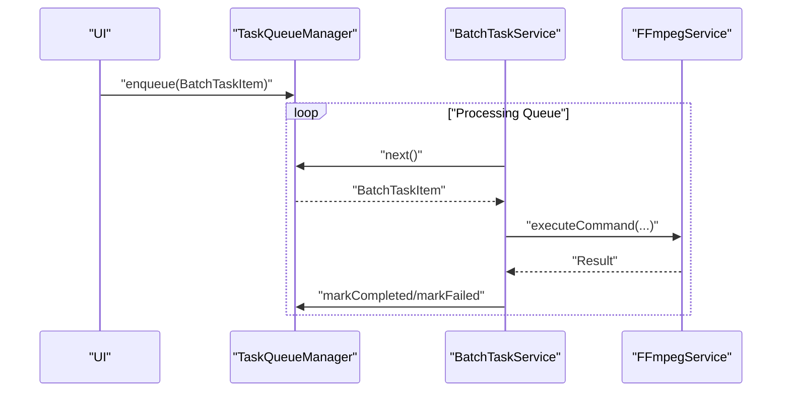
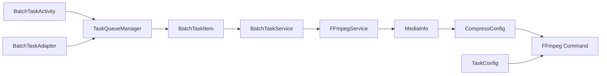
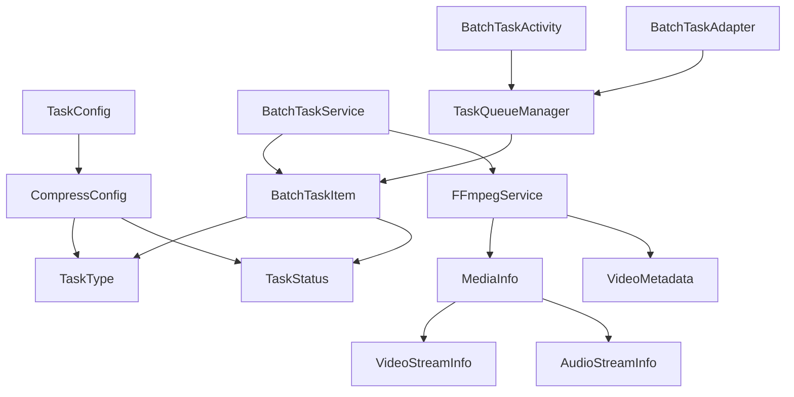

# Core Data Models

<cite>
**Referenced Files in This Document**
- [MediaInfo.kt](file://app/src/main/java/com/pisces312/streamclip/model/MediaInfo.kt)
- [CompressConfig.kt](file://app/src/main/java/com/pisces312/streamclip/model/CompressConfig.kt)
- [TaskConfig.kt](file://app/src/main/java/com/pisces312/streamclip/model/TaskConfig.kt)
- [BatchTaskItem.kt](file://app/src/main/java/com/pisces312/streamclip/model/BatchTaskItem.kt)
- [VideoMetadata.kt](file://app/src/main/java/com/pisces312/streamclip/model/VideoMetadata.kt)
- [TaskType.kt](file://app/src/main/java/com/pisces312/streamclip/model/TaskType.kt)
- [TaskStatus.kt](file://app/src/main/java/com/pisces312/streamclip/model/TaskStatus.kt)
- [FFmpegService.kt](file://app/src/main/java/com/pisces312/streamclip/service/FFmpegService.kt)
- [BatchTaskService.kt](file://app/src/main/java/com/pisces312/streamclip/service/BatchTaskService.kt)
- [TaskQueueManager.kt](file://app/src/main/java/com/pisces312/streamclip/service/TaskQueueManager.kt)
- [CompressFragment.kt](file://app/src/main/java/com/pisces312/streamclip/fragment/CompressFragment.kt)
- [BatchTaskActivity.kt](file://app/src/main/java/com/pisces312/streamclip/ui/BatchTaskActivity.kt)
- [BatchTaskAdapter.kt](file://app/src/main/java/com/pisces312/streamclip/adapter/BatchTaskAdapter.kt)
</cite>

## Table of Contents
1. [Introduction](#introduction)
2. [Project Structure](#project-structure)
3. [Core Components](#core-components)
4. [Architecture Overview](#architecture-overview)
5. [Detailed Component Analysis](#detailed-component-analysis)
6. [Dependency Analysis](#dependency-analysis)
7. [Performance Considerations](#performance-considerations)
8. [Troubleshooting Guide](#troubleshooting-guide)
9. [Conclusion](#conclusion)

## Introduction
This document provides comprehensive data model documentation for StreamClip’s core data structures focused on MediaInfo, CompressConfig, TaskConfig, and BatchTaskItem. It explains the structure and semantics of each model, including field definitions, data types, convenience accessors, helper methods, validation rules, defaults, and integration with FFmpeg operations. It also covers serialization formats, data transformation patterns, usage examples across UI and service layers, data lifecycle management, and thread-safety considerations for concurrent access.

## Project Structure
The core data models reside under the model package and are consumed by services and UI components. The primary integration points are:
- FFmpegService for probing media and executing FFmpeg commands
- BatchTaskService for orchestrating batch operations
- TaskQueueManager for managing task queues and state
- UI fragments and activities for user-driven configuration and presentation

**Diagram sources**
- [MediaInfo.kt:1-165](file://app/src/main/java/com/pisces312/streamclip/model/MediaInfo.kt#L1-L165)
- [CompressConfig.kt:1-209](file://app/src/main/java/com/pisces312/streamclip/model/CompressConfig.kt#L1-L209)
- [TaskConfig.kt:1-15](file://app/src/main/java/com/pisces312/streamclip/model/TaskConfig.kt#L1-L15)
- [BatchTaskItem.kt:1-32](file://app/src/main/java/com/pisces312/streamclip/model/BatchTaskItem.kt#L1-L32)
- [VideoMetadata.kt:1-56](file://app/src/main/java/com/pisces312/streamclip/model/VideoMetadata.kt#L1-L56)
- [TaskType.kt:1-8](file://app/src/main/java/com/pisces312/streamclip/model/TaskType.kt#L1-L8)
- [TaskStatus.kt:1-11](file://app/src/main/java/com/pisces312/streamclip/model/TaskStatus.kt#L1-L11)
- [FFmpegService.kt:1-420](file://app/src/main/java/com/pisces312/streamclip/service/FFmpegService.kt#L1-L420)
- [BatchTaskService.kt:1-301](file://app/src/main/java/com/pisces312/streamclip/service/BatchTaskService.kt#L1-L301)
- [TaskQueueManager.kt:1-146](file://app/src/main/java/com/pisces312/streamclip/service/TaskQueueManager.kt#L1-L146)
- [CompressFragment.kt:1-713](file://app/src/main/java/com/pisces312/streamclip/fragment/CompressFragment.kt#L1-L713)
- [BatchTaskActivity.kt:1-89](file://app/src/main/java/com/pisces312/streamclip/ui/BatchTaskActivity.kt#L1-L89)
- [BatchTaskAdapter.kt:1-86](file://app/src/main/java/com/pisces312/streamclip/adapter/BatchTaskAdapter.kt#L1-L86)

**Section sources**
- [MediaInfo.kt:1-165](file://app/src/main/java/com/pisces312/streamclip/model/MediaInfo.kt#L1-L165)
- [CompressConfig.kt:1-209](file://app/src/main/java/com/pisces312/streamclip/model/CompressConfig.kt#L1-L209)
- [TaskConfig.kt:1-15](file://app/src/main/java/com/pisces312/streamclip/model/TaskConfig.kt#L1-L15)
- [BatchTaskItem.kt:1-32](file://app/src/main/java/com/pisces312/streamclip/model/BatchTaskItem.kt#L1-L32)
- [VideoMetadata.kt:1-56](file://app/src/main/java/com/pisces312/streamclip/model/VideoMetadata.kt#L1-L56)
- [TaskType.kt:1-8](file://app/src/main/java/com/pisces312/streamclip/model/TaskType.kt#L1-L8)
- [TaskStatus.kt:1-11](file://app/src/main/java/com/pisces312/streamclip/model/TaskStatus.kt#L1-L11)

## Core Components
This section documents the four core data models and their relationships.

- MediaInfo: Encapsulates media metadata, including format, duration, and first video/audio streams. Provides convenience accessors for resolution, codecs, frame rate, color metadata, HDR detection, and formatted display strings. Includes helpers for compatibility checks and audio extension mapping.
- CompressConfig: Manages compression parameters including encoder selection, bitrate/crf, resolution scaling, frame rate, audio settings, and HDR-related flags. Exposes a builder method to produce FFmpeg command strings tailored to hardware/software encoders and HDR content.
- TaskConfig: Wraps a CompressConfig with a task type and optional custom command, enabling unified task configuration for different operations.
- BatchTaskItem: Represents a queued task with identity, type, input/output paths, configuration, status, progress, timestamps, and output size. Supports batch orchestration and UI presentation.

**Section sources**
- [MediaInfo.kt:5-165](file://app/src/main/java/com/pisces312/streamclip/model/MediaInfo.kt#L5-L165)
- [CompressConfig.kt:3-209](file://app/src/main/java/com/pisces312/streamclip/model/CompressConfig.kt#L3-L209)
- [TaskConfig.kt:5-14](file://app/src/main/java/com/pisces312/streamclip/model/TaskConfig.kt#L5-L14)
- [BatchTaskItem.kt:5-18](file://app/src/main/java/com/pisces312/streamclip/model/BatchTaskItem.kt#L5-L18)

## Architecture Overview
The models integrate with FFmpeg operations through FFmpegService, which probes media and executes commands. BatchTaskService coordinates batch execution, while TaskQueueManager maintains state and progress. UI components construct configurations and present task lists.

**Diagram sources**
- [CompressFragment.kt:695-713](file://app/src/main/java/com/pisces312/streamclip/fragment/CompressFragment.kt#L695-L713)
- [CompressConfig.kt:21-114](file://app/src/main/java/com/pisces312/streamclip/model/CompressConfig.kt#L21-L114)
- [FFmpegService.kt:56-147](file://app/src/main/java/com/pisces312/streamclip/service/FFmpegService.kt#L56-L147)
- [TaskQueueManager.kt:33-66](file://app/src/main/java/com/pisces312/streamclip/service/TaskQueueManager.kt#L33-L66)
- [BatchTaskService.kt:181-240](file://app/src/main/java/com/pisces312/streamclip/service/BatchTaskService.kt#L181-L240)

## Detailed Component Analysis

### MediaInfo Model
MediaInfo represents media metadata and provides convenience accessors and helpers for downstream operations.

- Fields
  - path: String
  - durationMs: Long (default -1 for unknown)
  - formatName: String
  - formatTags: JSONObject (default empty)
  - video: VideoStreamInfo? (nullable)
  - audio: AudioStreamInfo? (nullable)
- Derived/accessor properties
  - durationSec: Double computed from durationMs
  - width/height/videoCodec/audioCodec/frameRate/pixelFormat/rotation/videoBitrate/audioSampleRate/audioBitrate: safe defaults when streams are missing
  - creationTime/location: derived from formatTags
  - displayWidth/displayHeight/isLandscape/isPortrait/pixelCount/aspectRatio: computed from rotation-aware dimensions
  - resolution/videoBitrateKbps/audioSampleRateStr/audioBitrateKbps: formatted strings
  - fileCreationTime: lazy evaluation preferring tag-derived creation time
  - colorSpace/colorPrimaries/colorTransfer: from video stream
  - is10bit/isHdr/hdrTag: HDR detection and tagging
  - audioExtension: codec-to-extension mapping
  - toVideoMetadata(): converts format tags to VideoMetadata
- Methods
  - isCompatibleWith(other): compares essential attributes for merging
  - getIncompatibleFields(other): returns differences for diagnostics
- Nested classes
  - VideoStreamInfo: width, height, codec, frameRate, pixelFormat, bitRate, rotation, colorPrimaries, colorTransfer, colorSpace
  - AudioStreamInfo: codec, sampleRate, bitRate, channelLayout

Validation and defaults
- Unknown durations represented as -1; derived properties return sensible defaults
- Missing streams yield zero/default values for numeric fields and empty strings for text fields
- Aspect ratio simplification uses GCD and common ratio labels

Integration with FFmpeg
- FFmpegService.probeMediaInfo parses ffprobe JSON into MediaInfo, extracting format, streams, and side data (rotation)
- MediaInfo is used to inform FFmpeg command construction (e.g., color metadata, resolution scaling)

Serialization
- MediaInfo is not marked serializable; it is constructed from ffprobe JSON and passed around as value objects

Thread safety
- Accessors are pure functions; no shared mutable state; safe for concurrent reads

**Section sources**
- [MediaInfo.kt:5-165](file://app/src/main/java/com/pisces312/streamclip/model/MediaInfo.kt#L5-L165)
- [FFmpegService.kt:56-147](file://app/src/main/java/com/pisces312/streamclip/service/FFmpegService.kt#L56-L147)

### CompressConfig Model
CompressConfig encapsulates compression parameters and builds FFmpeg command strings.

- Fields
  - encoder: String (default "h264_mediacodec")
  - bitrate: Int (default 2000 kbps)
  - crf: Int (default 23)
  - resolution: String (default "original")
  - frameRate: String (default "original")
  - preset: String (default "medium")
  - audioEncoder: String (default "copy")
  - audioBitrate: String (default "128")
  - audioSampleRate: String (default "copy")
  - isHardware: Boolean (default true)
  - copyMetadata: Boolean (default true)
- Command builder
  - toFFmpegCommand(inputPath, outputPath, sourceWidth, sourceHeight, colorSpace, colorPrimaries, colorTransfer): constructs a complete FFmpeg command string
  - Behavior:
    - Optionally copies metadata
    - Writes color metadata (primaries/trc/space) and range flags
    - Applies HDR profile/pixel format when detected
    - Selects hardware vs software encoder and rate control mode
    - Applies resolution scaling filters and clears rotation metadata when resizing
    - Sets frame rate and audio encoding/bitrate/sample rate
    - Uses MOV format to preserve GPS metadata
- Options and enumerations
  - Companion object defines:
    - HW_ENCODERS/SW_ENCODERS
    - BITRATES
    - SCALE_FACTORS
    - PRESETS
    - AUDIO_ENCODERS
    - AUDIO_BITRATES
    - AUDIO_SAMPLE_RATES
    - FRAME_RATES
    - HELP_TEXTS
- Validation and constraints
  - bitrate and crf are constrained by encoder choice (hardware uses bitrate, software uses crf)
  - resolution scaling uses predefined factors
  - frameRate accepts "original" or specific FPS values
  - audioSampleRate defaults to "copy" to avoid resampling crashes

Integration with FFmpeg
- Used by BatchTaskService to build commands for compression operations
- FFmpegService.probeMediaInfo supplies color metadata and duration for progress estimation

Serialization
- Implements Serializable for persistence across process boundaries

**Section sources**
- [CompressConfig.kt:3-209](file://app/src/main/java/com/pisces312/streamclip/model/CompressConfig.kt#L3-L209)
- [BatchTaskService.kt:242-251](file://app/src/main/java/com/pisces312/streamclip/service/BatchTaskService.kt#L242-L251)
- [FFmpegService.kt:355-393](file://app/src/main/java/com/pisces312/streamclip/service/FFmpegService.kt#L355-L393)

### TaskConfig Model
TaskConfig wraps compression configuration with a task type and optional custom command.

- Fields
  - compressConfig: CompressConfig (default initialized)
  - taskType: TaskType (default COMPRESS)
  - customCommand: String? (optional)
- Helper
  - toTaskConfig(): extension function to convert CompressConfig to TaskConfig with default task type

Integration
- UI fragments construct TaskConfig from user selections
- BatchTaskService routes execution based on taskType

**Section sources**
- [TaskConfig.kt:5-14](file://app/src/main/java/com/pisces312/streamclip/model/TaskConfig.kt#L5-L14)
- [CompressFragment.kt:695-713](file://app/src/main/java/com/pisces312/streamclip/fragment/CompressFragment.kt#L695-L713)

### BatchTaskItem Model
BatchTaskItem represents a queued task for batch processing.

- Fields
  - id: String (UUID default)
  - type: TaskType
  - inputPath: String
  - outputPath: String
  - config: TaskConfig
  - status: TaskStatus (default PENDING)
  - progress: Int (default 0)
  - errorMessage: String?
  - createdAt: Long (default current time)
  - startedAt: Long?
  - completedAt: Long?
  - outputSizeBytes: Long (default 0)
- Supporting types
  - BatchSummary: total, completed, failed, cancelled counts
  - TaskResult: success flag, error message, cancellation flag

Lifecycle management
- Enqueued with PENDING status
- Transitions to RUNNING, then COMPLETED/FAILED/CANCELLED
- Progress tracked and updated during execution
- Output size recorded upon completion

Integration
- Enqueued by UI and managed by TaskQueueManager
- Executed by BatchTaskService using FFmpegService
- Presented in BatchTaskActivity with BatchTaskAdapter

Thread safety
- TaskQueueManager synchronizes state updates and exposes a StateFlow for reactive UI updates
- BatchTaskService uses coroutines and ConcurrentHashMap for per-task job management

**Section sources**
- [BatchTaskItem.kt:5-32](file://app/src/main/java/com/pisces312/streamclip/model/BatchTaskItem.kt#L5-L32)
- [TaskQueueManager.kt:10-146](file://app/src/main/java/com/pisces312/streamclip/service/TaskQueueManager.kt#L10-L146)
- [BatchTaskService.kt:181-240](file://app/src/main/java/com/pisces312/streamclip/service/BatchTaskService.kt#L181-L240)
- [BatchTaskActivity.kt:69-82](file://app/src/main/java/com/pisces312/streamclip/ui/BatchTaskActivity.kt#L69-L82)
- [BatchTaskAdapter.kt:33-78](file://app/src/main/java/com/pisces312/streamclip/adapter/BatchTaskAdapter.kt#L33-L78)

### VideoMetadata Model
VideoMetadata represents editable metadata extracted from format tags for editing.

- Fields
  - title, artist, creationTime, location, comment: String
  - rawTags: JSONObject
- Methods
  - isDifferentFrom(other): compares editable fields
  - buildMetadataArgs(original): generates FFmpeg -metadata arguments for changed fields
- Companion
  - fromTags(tags): constructs VideoMetadata from a JSONObject

Integration
- MediaInfo.toVideoMetadata() converts format tags into VideoMetadata for editing workflows

**Section sources**
- [VideoMetadata.kt:5-56](file://app/src/main/java/com/pisces312/streamclip/model/VideoMetadata.kt#L5-L56)
- [MediaInfo.kt:142-144](file://app/src/main/java/com/pisces312/streamclip/model/MediaInfo.kt#L142-L144)

## Architecture Overview
The following diagram shows how models flow through the system from UI configuration to FFmpeg execution and batch orchestration.

**Diagram sources**
- [MediaInfo.kt:5-165](file://app/src/main/java/com/pisces312/streamclip/model/MediaInfo.kt#L5-L165)
- [CompressConfig.kt:3-209](file://app/src/main/java/com/pisces312/streamclip/model/CompressConfig.kt#L3-L209)
- [TaskConfig.kt:5-14](file://app/src/main/java/com/pisces312/streamclip/model/TaskConfig.kt#L5-L14)
- [BatchTaskItem.kt:5-18](file://app/src/main/java/com/pisces312/streamclip/model/BatchTaskItem.kt#L5-L18)
- [VideoMetadata.kt:5-56](file://app/src/main/java/com/pisces312/streamclip/model/VideoMetadata.kt#L5-L56)

## Detailed Component Analysis

### MediaInfo Class Analysis
MediaInfo centralizes media metadata and provides derived properties for UI and FFmpeg command construction.

Key behaviors
- Safe accessors for missing streams
- Rotation-aware display dimensions and aspect ratio computation
- HDR detection and tagging
- Compatibility checks for merging operations
- Audio extension mapping for output containers

**Diagram sources**
- [MediaInfo.kt:17-44](file://app/src/main/java/com/pisces312/streamclip/model/MediaInfo.kt#L17-L44)

**Section sources**
- [MediaInfo.kt:17-121](file://app/src/main/java/com/pisces312/streamclip/model/MediaInfo.kt#L17-L121)

### CompressConfig Class Analysis
CompressConfig encapsulates compression parameters and produces FFmpeg commands.

Key behaviors
- Encoder selection toggles hardware/software mode
- Rate control switches between bitrate and CRF
- Resolution scaling via filter chain
- HDR-aware color metadata and pixel format handling
- Audio encoder and sample rate handling

**Diagram sources**
- [CompressFragment.kt:695-713](file://app/src/main/java/com/pisces312/streamclip/fragment/CompressFragment.kt#L695-L713)
- [CompressConfig.kt:21-114](file://app/src/main/java/com/pisces312/streamclip/model/CompressConfig.kt#L21-L114)
- [FFmpegService.kt:355-393](file://app/src/main/java/com/pisces312/streamclip/service/FFmpegService.kt#L355-L393)

**Section sources**
- [CompressConfig.kt:21-114](file://app/src/main/java/com/pisces312/streamclip/model/CompressConfig.kt#L21-L114)

### TaskConfig and BatchTaskItem Class Analysis
TaskConfig and BatchTaskItem coordinate task execution across the system.

Key behaviors
- TaskConfig wraps CompressConfig and task type for unified configuration
- BatchTaskItem tracks lifecycle, progress, and outcomes
- TaskQueueManager manages concurrency and state updates
- BatchTaskService executes tasks and updates state

**Diagram sources**
- [TaskConfig.kt:11-14](file://app/src/main/java/com/pisces312/streamclip/model/TaskConfig.kt#L11-L14)
- [BatchTaskItem.kt:5-18](file://app/src/main/java/com/pisces312/streamclip/model/BatchTaskItem.kt#L5-L18)
- [TaskQueueManager.kt:33-66](file://app/src/main/java/com/pisces312/streamclip/service/TaskQueueManager.kt#L33-L66)
- [BatchTaskService.kt:181-240](file://app/src/main/java/com/pisces312/streamclip/service/BatchTaskService.kt#L181-L240)

**Section sources**
- [TaskConfig.kt:5-14](file://app/src/main/java/com/pisces312/streamclip/model/TaskConfig.kt#L5-L14)
- [BatchTaskItem.kt:5-18](file://app/src/main/java/com/pisces312/streamclip/model/BatchTaskItem.kt#L5-L18)
- [TaskQueueManager.kt:10-146](file://app/src/main/java/com/pisces312/streamclip/service/TaskQueueManager.kt#L10-L146)
- [BatchTaskService.kt:181-240](file://app/src/main/java/com/pisces312/streamclip/service/BatchTaskService.kt#L181-L240)

### Conceptual Overview
The models form a cohesive pipeline:
- MediaInfo is produced by FFmpegService from ffprobe JSON
- CompressConfig is configured by UI and transformed into FFmpeg commands
- TaskConfig packages configuration for execution
- BatchTaskItem represents queued work with lifecycle and progress
- TaskQueueManager and BatchTaskService orchestrate execution and state

[No sources needed since this diagram shows conceptual workflow, not actual code structure]

## Dependency Analysis
The models depend on each other and on external libraries:
- MediaInfo depends on VideoStreamInfo and AudioStreamInfo
- CompressConfig depends on TaskType and TaskStatus for command construction
- TaskConfig depends on CompressConfig
- BatchTaskItem depends on TaskType and TaskStatus
- FFmpegService depends on MediaInfo and VideoMetadata for probing and metadata handling
- BatchTaskService depends on TaskQueueManager and FFmpegService
- UI components depend on models for configuration and presentation

**Diagram sources**
- [MediaInfo.kt:5-165](file://app/src/main/java/com/pisces312/streamclip/model/MediaInfo.kt#L5-L165)
- [CompressConfig.kt:3-209](file://app/src/main/java/com/pisces312/streamclip/model/CompressConfig.kt#L3-L209)
- [TaskConfig.kt:5-14](file://app/src/main/java/com/pisces312/streamclip/model/TaskConfig.kt#L5-L14)
- [BatchTaskItem.kt:5-18](file://app/src/main/java/com/pisces312/streamclip/model/BatchTaskItem.kt#L5-L18)
- [VideoMetadata.kt:5-56](file://app/src/main/java/com/pisces312/streamclip/model/VideoMetadata.kt#L5-L56)
- [TaskType.kt:3-7](file://app/src/main/java/com/pisces312/streamclip/model/TaskType.kt#L3-L7)
- [TaskStatus.kt:3-10](file://app/src/main/java/com/pisces312/streamclip/model/TaskStatus.kt#L3-L10)
- [FFmpegService.kt:56-147](file://app/src/main/java/com/pisces312/streamclip/service/FFmpegService.kt#L56-L147)
- [BatchTaskService.kt:181-240](file://app/src/main/java/com/pisces312/streamclip/service/BatchTaskService.kt#L181-L240)
- [TaskQueueManager.kt:10-146](file://app/src/main/java/com/pisces312/streamclip/service/TaskQueueManager.kt#L10-L146)
- [BatchTaskActivity.kt:69-82](file://app/src/main/java/com/pisces312/streamclip/ui/BatchTaskActivity.kt#L69-L82)
- [BatchTaskAdapter.kt:33-78](file://app/src/main/java/com/pisces312/streamclip/adapter/BatchTaskAdapter.kt#L33-L78)

**Section sources**
- [TaskType.kt:3-7](file://app/src/main/java/com/pisces312/streamclip/model/TaskType.kt#L3-L7)
- [TaskStatus.kt:3-10](file://app/src/main/java/com/pisces312/streamclip/model/TaskStatus.kt#L3-L10)

## Performance Considerations
- MediaInfo parsing uses a single ffprobe JSON call; avoid repeated probing to minimize overhead
- CompressConfig.toFFmpegCommand constructs strings incrementally; keep encoder choices and scaling factors precomputed
- TaskQueueManager uses synchronized methods and a StateFlow to minimize contention; avoid frequent UI updates by batching
- BatchTaskService runs tasks in coroutines with SupervisorJob to isolate failures; consider limiting concurrency for resource-bound devices

[No sources needed since this section provides general guidance]

## Troubleshooting Guide
Common issues and resolutions:
- Unknown duration or missing streams: MediaInfo defaults to -1 or empty strings; verify ffprobe availability and permissions
- HDR playback issues: CompressConfig applies container-level color metadata; ensure MOV format and correct color primaries/trc/space
- Audio sample rate changes causing crashes: Prefer "copy" for audioSampleRate to avoid resampling
- Progress calculation: FFmpegService estimates remaining time from processed time and total duration; ensure durationMs is available
- Batch task failures: TaskQueueManager marks FAILED with error messages; use retryTask to re-enqueue failed items

**Section sources**
- [FFmpegService.kt:152-241](file://app/src/main/java/com/pisces312/streamclip/service/FFmpegService.kt#L152-L241)
- [BatchTaskService.kt:167-240](file://app/src/main/java/com/pisces312/streamclip/service/BatchTaskService.kt#L167-L240)
- [TaskQueueManager.kt:68-86](file://app/src/main/java/com/pisces312/streamclip/service/TaskQueueManager.kt#L68-L86)

## Conclusion
StreamClip’s core data models provide a robust foundation for media metadata handling, compression configuration, task orchestration, and batch processing. MediaInfo consolidates metadata and derived properties, CompressConfig encapsulates compression parameters and FFmpeg command building, TaskConfig unifies configuration with task types, and BatchTaskItem tracks lifecycle and progress. Together with FFmpegService, TaskQueueManager, and BatchTaskService, they enable reliable, efficient media processing with clear separation of concerns and strong integration points across UI and service layers.