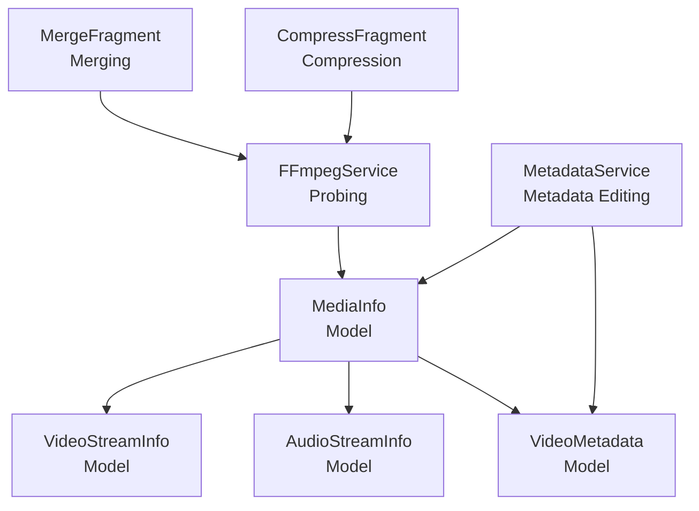
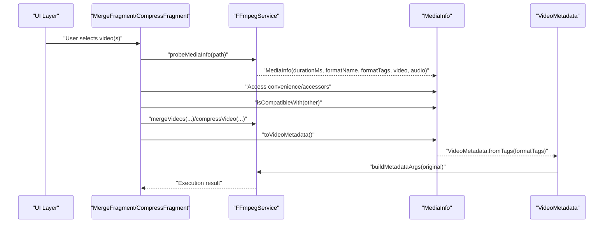
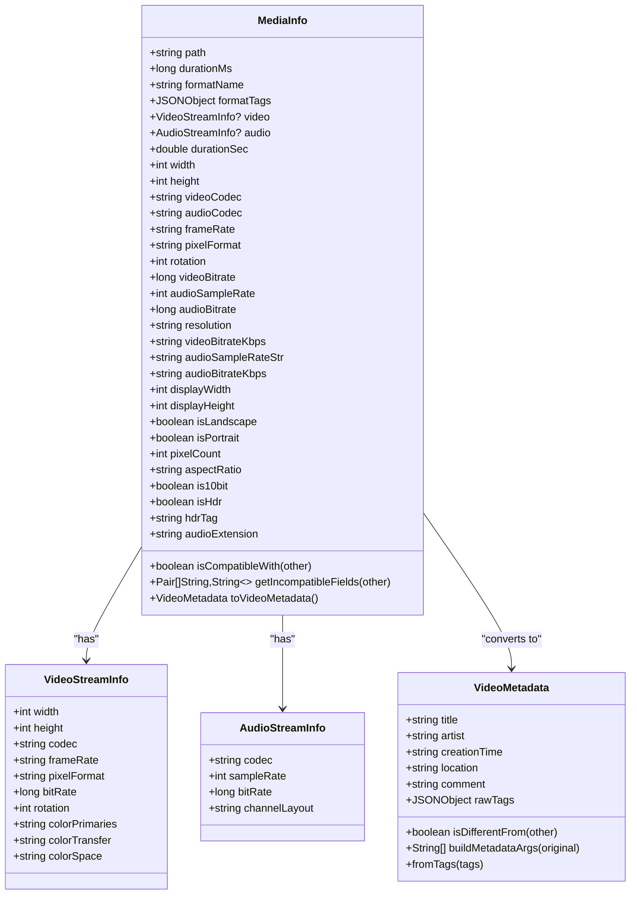
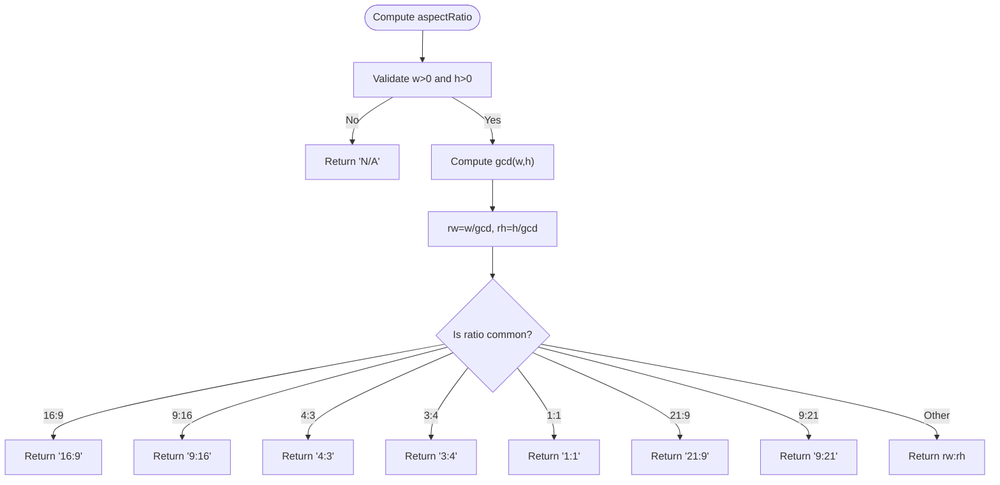
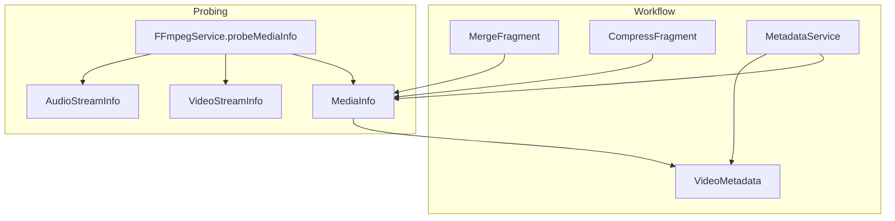
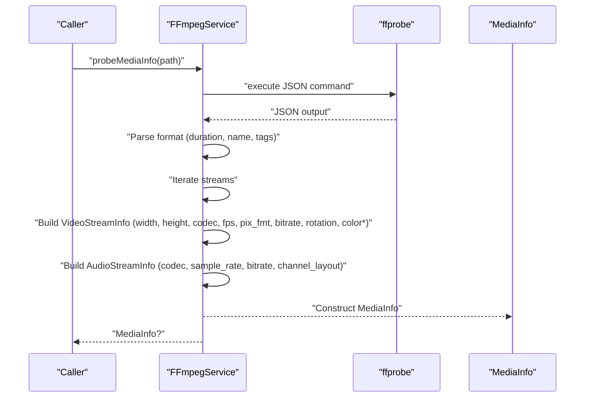
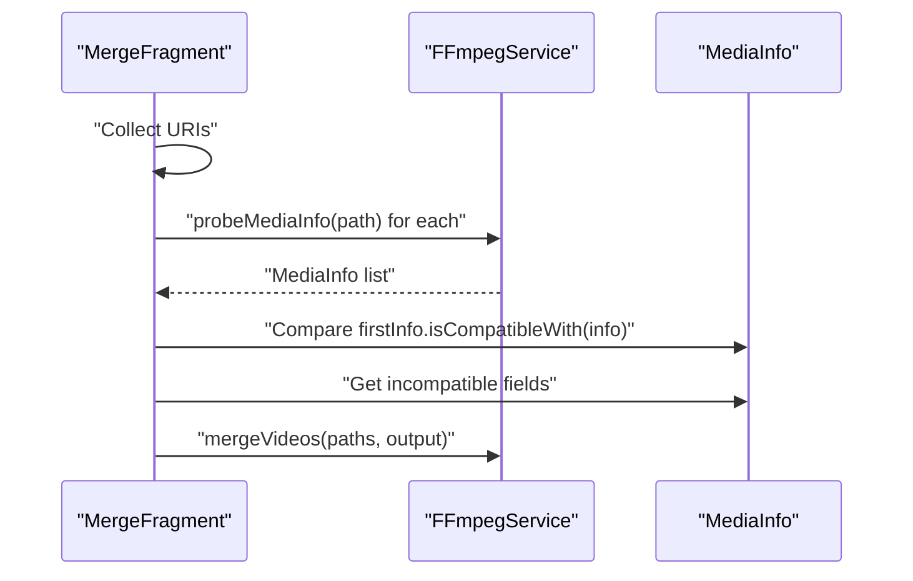
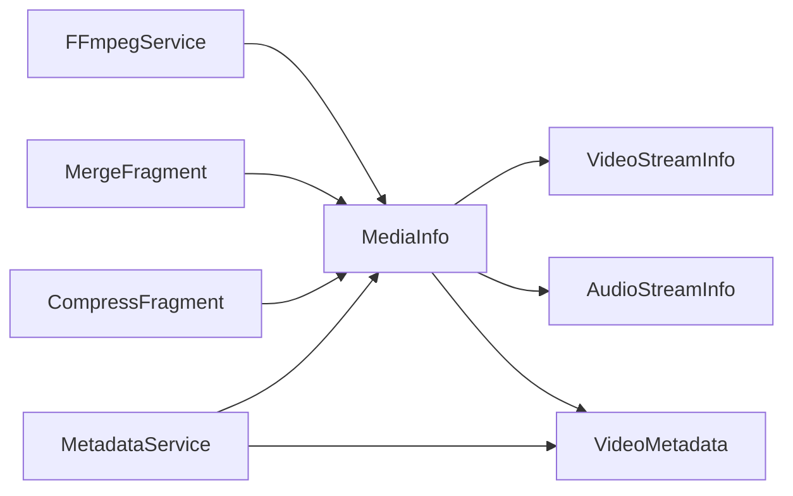

# MediaInfo Model

<cite>
**Referenced Files in This Document**
- [MediaInfo.kt](file://app/src/main/java/com/pisces312/streamclip/model/MediaInfo.kt)
- [VideoMetadata.kt](file://app/src/main/java/com/pisces312/streamclip/model/VideoMetadata.kt)
- [FFmpegService.kt](file://app/src/main/java/com/pisces312/streamclip/service/FFmpegService.kt)
- [MergeFragment.kt](file://app/src/main/java/com/pisces312/streamclip/fragment/MergeFragment.kt)
- [CompressFragment.kt](file://app/src/main/java/com/pisces312/streamclip/fragment/CompressFragment.kt)
- [MetadataService.kt](file://app/src/main/java/com/pisces312/streamclip/service/MetadataService.kt)
</cite>

## Table of Contents
1. [Introduction](#introduction)
2. [Project Structure](#project-structure)
3. [Core Components](#core-components)
4. [Architecture Overview](#architecture-overview)
5. [Detailed Component Analysis](#detailed-component-analysis)
6. [Dependency Analysis](#dependency-analysis)
7. [Performance Considerations](#performance-considerations)
8. [Troubleshooting Guide](#troubleshooting-guide)
9. [Conclusion](#conclusion)

## Introduction
This document provides comprehensive documentation for the MediaInfo data class that represents video and audio metadata in StreamClip. It explains the structure of MediaInfo, its nested VideoStreamInfo and AudioStreamInfo classes, convenience accessors, formatted helpers, advanced features like orientation and HDR detection, compatibility checks for merging, codec-to-extension mapping, and conversion to VideoMetadata. It also covers usage patterns in FFmpeg operations and integration points across the application.

## Project Structure
MediaInfo resides in the model package alongside VideoMetadata. FFmpegService is responsible for probing media files and constructing MediaInfo instances. MergeFragment and CompressFragment demonstrate practical usage for merging and compression workflows. MetadataService integrates MediaInfo with metadata editing.

**Diagram sources**
- [MediaInfo.kt:5-164](file://app/src/main/java/com/pisces312/streamclip/model/MediaInfo.kt#L5-L164)
- [FFmpegService.kt:56-147](file://app/src/main/java/com/pisces312/streamclip/service/FFmpegService.kt#L56-L147)
- [MergeFragment.kt:164-232](file://app/src/main/java/com/pisces312/streamclip/fragment/MergeFragment.kt#L164-L232)
- [CompressFragment.kt:429-450](file://app/src/main/java/com/pisces312/streamclip/fragment/CompressFragment.kt#L429-L450)
- [MetadataService.kt:15-28](file://app/src/main/java/com/pisces312/streamclip/service/MetadataService.kt#L15-L28)

**Section sources**
- [MediaInfo.kt:1-165](file://app/src/main/java/com/pisces312/streamclip/model/MediaInfo.kt#L1-L165)
- [FFmpegService.kt:1-420](file://app/src/main/java/com/pisces312/streamclip/service/FFmpegService.kt#L1-L420)

## Core Components
- MediaInfo: Top-level metadata container with path, duration, formatName, formatTags, and optional video/audio streams.
- VideoStreamInfo: Describes video stream properties including dimensions, codec, frame rate, pixel format, bitrate, rotation, and color metadata.
- AudioStreamInfo: Describes audio stream properties including codec, sample rate, bitrate, and channel layout.
- VideoMetadata: Represents editable metadata extracted from format tags for editing.

Key responsibilities:
- MediaInfo exposes convenience accessors for common fields and formatted helpers.
- MediaInfo computes derived properties like orientation-aware display dimensions, aspect ratio, and HDR indicators.
- MediaInfo provides compatibility checks for merging and codec-to-extension mapping for audio export.
- VideoMetadata encapsulates editable fields and generates FFmpeg metadata arguments.

**Section sources**
- [MediaInfo.kt:5-164](file://app/src/main/java/com/pisces312/streamclip/model/MediaInfo.kt#L5-L164)
- [VideoMetadata.kt:5-56](file://app/src/main/java/com/pisces312/streamclip/model/VideoMetadata.kt#L5-L56)

## Architecture Overview
MediaInfo is constructed by FFmpegService during probing. Fragments consume MediaInfo for UI display and workflow decisions. MetadataService converts MediaInfo to VideoMetadata for editing and back to MediaInfo for downstream operations.

**Diagram sources**
- [FFmpegService.kt:56-147](file://app/src/main/java/com/pisces312/streamclip/service/FFmpegService.kt#L56-L147)
- [MergeFragment.kt:164-232](file://app/src/main/java/com/pisces312/streamclip/fragment/MergeFragment.kt#L164-L232)
- [CompressFragment.kt:429-450](file://app/src/main/java/com/pisces312/streamclip/fragment/CompressFragment.kt#L429-L450)
- [MediaInfo.kt:142-143](file://app/src/main/java/com/pisces312/streamclip/model/MediaInfo.kt#L142-L143)
- [VideoMetadata.kt:44-54](file://app/src/main/java/com/pisces312/streamclip/model/VideoMetadata.kt#L44-L54)

## Detailed Component Analysis

### MediaInfo Class
MediaInfo holds:
- path: Absolute path to the media file.
- durationMs: Duration in milliseconds; -1 if unknown.
- formatName: Container/format name.
- formatTags: JSON object containing metadata tags.
- video: Optional VideoStreamInfo.
- audio: Optional AudioStreamInfo.

Convenience accessors:
- durationSec: Converts durationMs to seconds; -1.0 if unknown.
- width/height: Defaults to 0 if no video stream.
- videoCodec/audioCodec: Defaults to empty string if no stream.
- frameRate: Empty string if no video stream.
- pixelFormat: Empty string if no video stream.
- rotation: Defaults to 0 if no video stream.
- videoBitrate/audioSampleRate/audioBitrate: Numeric defaults for streams.

Formatted helpers:
- resolution: "WxH" if both dimensions > 0, otherwise "N/A".
- videoBitrateKbps/audioBitrateKbps: "X kbps" if > 0, otherwise "N/A".
- audioSampleRateStr: "X Hz" if > 0, otherwise "N/A".

Orientation and aspect ratio:
- displayWidth/displayHeight: Swapped if rotation is 90 or 270 degrees.
- isLandscape/isPortrait: Derived from display dimensions.
- pixelCount: Width × Height.
- aspectRatio: Simplified ratio using gcd with common ratios.

HDR detection:
- is10bit: True if pixelFormat contains "10".
- isHdr: True if colorTransfer is "arib-std-b67" or "smpte2084".
- hdrTag: Concatenated tag indicating HDR/10-bit status.

Compatibility for merging:
- isCompatibleWith: Checks width, height, videoCodec, audioCodec, frameRate, pixelFormat, rotation.
- getIncompatibleFields: Returns human-readable differences.

Audio extension mapping:
- audioExtension: Maps audio codecs to likely extensions.

Conversion to VideoMetadata:
- toVideoMetadata: Builds VideoMetadata from formatTags.

**Section sources**
- [MediaInfo.kt:5-164](file://app/src/main/java/com/pisces312/streamclip/model/MediaInfo.kt#L5-L164)

#### Class Diagram

**Diagram sources**
- [MediaInfo.kt:5-164](file://app/src/main/java/com/pisces312/streamclip/model/MediaInfo.kt#L5-L164)
- [VideoMetadata.kt:5-56](file://app/src/main/java/com/pisces312/streamclip/model/VideoMetadata.kt#L5-L56)

### VideoStreamInfo and AudioStreamInfo
- VideoStreamInfo: Encapsulates video stream metadata including dimensions, codec identifiers, timing, pixel format, bitrate, rotation, and color metadata.
- AudioStreamInfo: Encapsulates audio stream metadata including codec, sample rate, bitrate, and channel layout.

These classes are populated by FFmpegService during probing and consumed by MediaInfo for convenience accessors and formatted helpers.

**Section sources**
- [MediaInfo.kt:146-164](file://app/src/main/java/com/pisces312/streamclip/model/MediaInfo.kt#L146-L164)
- [FFmpegService.kt:111-130](file://app/src/main/java/com/pisces312/streamclip/service/FFmpegService.kt#L111-L130)

### Aspect Ratio Simplification Algorithm
The aspect ratio calculation uses:
- gcd to reduce width/height to simplest form.
- Common ratio mapping for typical 16:9, 9:16, 4:3, 3:4, 1:1, 21:9, 9:21.
- Returns "N/A" for invalid dimensions.

**Diagram sources**
- [MediaInfo.kt:45-61](file://app/src/main/java/com/pisces312/streamclip/model/MediaInfo.kt#L45-L61)

### HDR Detection Logic
- is10bit: True if pixelFormat contains "10".
- isHdr: True if colorTransfer equals "arib-std-b67" or "smpte2084".
- hdrTag: Concatenated tag indicating HDR/10-bit status.

**Section sources**
- [MediaInfo.kt:91-99](file://app/src/main/java/com/pisces312/streamclip/model/MediaInfo.kt#L91-L99)

### Codec-to-Extension Mapping
Maps audio codecs to likely file extensions for output naming and export decisions.

Supported mappings include:
- AAC, MP3 variants -> mp3
- FLAC -> flac
- PCM variants -> wav
- Opus -> opus
- Vorbis -> ogg
- AC-3/EAC-3 -> ac3/eac3
- DTS/TrueHD -> dts/thd
- ALAC -> m4a
- WMA variants -> wma
- Others -> audio

**Section sources**
- [MediaInfo.kt:126-140](file://app/src/main/java/com/pisces312/streamclip/model/MediaInfo.kt#L126-L140)

### VideoMetadata Conversion Methods
- toVideoMetadata(): Converts MediaInfo.formatTags to VideoMetadata using fromTags factory.
- VideoMetadata.fromTags(): Creates VideoMetadata from a JSONObject of tags.
- VideoMetadata.buildMetadataArgs(): Generates FFmpeg -metadata arguments for changed fields only.

**Section sources**
- [MediaInfo.kt:142-143](file://app/src/main/java/com/pisces312/streamclip/model/MediaInfo.kt#L142-L143)
- [VideoMetadata.kt:44-54](file://app/src/main/java/com/pisces312/streamclip/model/VideoMetadata.kt#L44-L54)
- [VideoMetadata.kt:23-41](file://app/src/main/java/com/pisces312/streamclip/model/VideoMetadata.kt#L23-L41)

## Architecture Overview
MediaInfo is central to metadata representation and workflow decisions. FFmpegService constructs MediaInfo from ffprobe JSON. MergeFragment and CompressFragment use MediaInfo for UI display and compatibility checks. MetadataService uses MediaInfo for metadata extraction and editing.

**Diagram sources**
- [FFmpegService.kt:56-147](file://app/src/main/java/com/pisces312/streamclip/service/FFmpegService.kt#L56-L147)
- [MergeFragment.kt:164-232](file://app/src/main/java/com/pisces312/streamclip/fragment/MergeFragment.kt#L164-L232)
- [CompressFragment.kt:429-450](file://app/src/main/java/com/pisces312/streamclip/fragment/CompressFragment.kt#L429-L450)
- [MetadataService.kt:15-28](file://app/src/main/java/com/pisces312/streamclip/service/MetadataService.kt#L15-L28)

## Detailed Component Analysis

### Probing and Construction
FFmpegService.probeMediaInfo parses ffprobe JSON to construct MediaInfo:
- Extracts format duration (converted to milliseconds), format_name, and tags.
- Iterates streams to find the first video and audio streams.
- Parses rotation from side_data entries.
- Populates VideoStreamInfo and AudioStreamInfo with relevant fields.
- Returns MediaInfo with all parsed data.

**Diagram sources**
- [FFmpegService.kt:56-147](file://app/src/main/java/com/pisces312/streamclip/service/FFmpegService.kt#L56-L147)

**Section sources**
- [FFmpegService.kt:56-147](file://app/src/main/java/com/pisces312/streamclip/service/FFmpegService.kt#L56-L147)

### Usage in Merge Operations
MergeFragment probes all selected files and validates compatibility:
- Collects MediaInfo for each path.
- Compares against the first file using isCompatibleWith.
- Builds a human-readable list of incompatible fields using getIncompatibleFields.
- Executes mergeVideos if compatible.

**Diagram sources**
- [MergeFragment.kt:164-232](file://app/src/main/java/com/pisces312/streamclip/fragment/MergeFragment.kt#L164-L232)
- [MediaInfo.kt:102-121](file://app/src/main/java/com/pisces312/streamclip/model/MediaInfo.kt#L102-L121)

**Section sources**
- [MergeFragment.kt:164-232](file://app/src/main/java/com/pisces312/streamclip/fragment/MergeFragment.kt#L164-L232)
- [MediaInfo.kt:102-121](file://app/src/main/java/com/pisces312/streamclip/model/MediaInfo.kt#L102-L121)

### Usage in Compression Operations
CompressFragment displays MediaInfo-derived information:
- Shows video codec, resolution, frame rate, video bitrate, HDR tag, rotation, audio codec, sample rate, audio bitrate, color metadata, creation time, file creation time, and location.
- Uses displayWidth/displayHeight for accurate orientation-aware sizing.

**Section sources**
- [CompressFragment.kt:429-450](file://app/src/main/java/com/pisces312/streamclip/fragment/CompressFragment.kt#L429-L450)

### Metadata Editing Integration
MetadataService reads and writes metadata:
- Reads MediaInfo via FFmpegService.probeMediaInfo and converts to VideoMetadata.
- Builds FFmpeg -metadata arguments only for changed fields.
- Executes lossless metadata updates using -c copy.

**Section sources**
- [MetadataService.kt:15-28](file://app/src/main/java/com/pisces312/streamclip/service/MetadataService.kt#L15-L28)
- [MetadataService.kt:34-67](file://app/src/main/java/com/pisces312/streamclip/service/MetadataService.kt#L34-L67)
- [MediaInfo.kt:142-143](file://app/src/main/java/com/pisces312/streamclip/model/MediaInfo.kt#L142-L143)

## Dependency Analysis
- MediaInfo depends on VideoStreamInfo and AudioStreamInfo for stream data.
- MediaInfo depends on VideoMetadata for conversion.
- FFmpegService constructs MediaInfo from ffprobe JSON.
- MergeFragment and CompressFragment depend on MediaInfo for UI and logic.
- MetadataService depends on MediaInfo for reading and converting metadata.

**Diagram sources**
- [FFmpegService.kt:56-147](file://app/src/main/java/com/pisces312/streamclip/service/FFmpegService.kt#L56-L147)
- [MergeFragment.kt:164-232](file://app/src/main/java/com/pisces312/streamclip/fragment/MergeFragment.kt#L164-L232)
- [CompressFragment.kt:429-450](file://app/src/main/java/com/pisces312/streamclip/fragment/CompressFragment.kt#L429-L450)
- [MetadataService.kt:15-28](file://app/src/main/java/com/pisces312/streamclip/service/MetadataService.kt#L15-L28)

**Section sources**
- [MediaInfo.kt:5-164](file://app/src/main/java/com/pisces312/streamclip/model/MediaInfo.kt#L5-L164)
- [FFmpegService.kt:56-147](file://app/src/main/java/com/pisces312/streamclip/service/FFmpegService.kt#L56-L147)

## Performance Considerations
- Probing cost: FFmpegService.probeMediaInfo performs a single ffprobe JSON call per file; batch operations should reuse probing results.
- Computed properties: Aspect ratio simplification and HDR detection are O(1) operations; gcd computation is efficient for small integers.
- Memory footprint: MediaInfo stores minimal references; avoid retaining unnecessary large objects after probing.

## Troubleshooting Guide
Common issues and remedies:
- Unknown duration: durationMs remains -1; durationSec returns -1.0. Ensure ffprobe succeeds and duration is present in JSON.
- No video/audio streams: width/height/videoCodec/audioCodec/frameRate/pixelFormat/audioSampleRate/audioBitrate default to 0 or empty strings. Verify codec_type values in ffprobe output.
- Rotation not reflected: Rotation parsing occurs from side_data; if missing, rotation defaults to 0. Confirm side_data entries in ffprobe JSON.
- Incompatible merge: Use getIncompatibleFields to identify differences in resolution, codecs, frame rate, pixel format, or rotation.
- HDR detection false negatives: Ensure color metadata is present in ffprobe JSON; is10bit relies on pixelFormat substring match.
- Codec extension mapping: Some codecs map to generic "audio"; verify codec_name in ffprobe JSON.

**Section sources**
- [FFmpegService.kt:56-147](file://app/src/main/java/com/pisces312/streamclip/service/FFmpegService.kt#L56-L147)
- [MediaInfo.kt:102-121](file://app/src/main/java/com/pisces312/streamclip/model/MediaInfo.kt#L102-L121)
- [MediaInfo.kt:91-99](file://app/src/main/java/com/pisces312/streamclip/model/MediaInfo.kt#L91-L99)
- [MediaInfo.kt:126-140](file://app/src/main/java/com/pisces312/streamclip/model/MediaInfo.kt#L126-L140)

## Conclusion
MediaInfo serves as the central metadata model in StreamClip, providing robust accessors, formatted helpers, orientation-aware computations, HDR detection, and compatibility checks. Its integration with FFmpegService enables efficient probing and with MergeFragment/CompressFragment ensures practical usage across merging and compression workflows. The conversion to VideoMetadata supports seamless metadata editing operations.