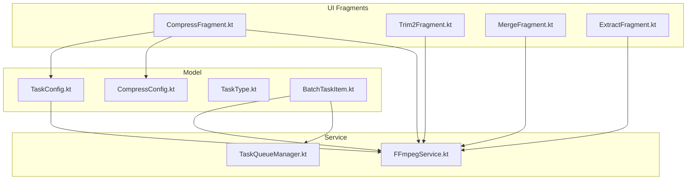
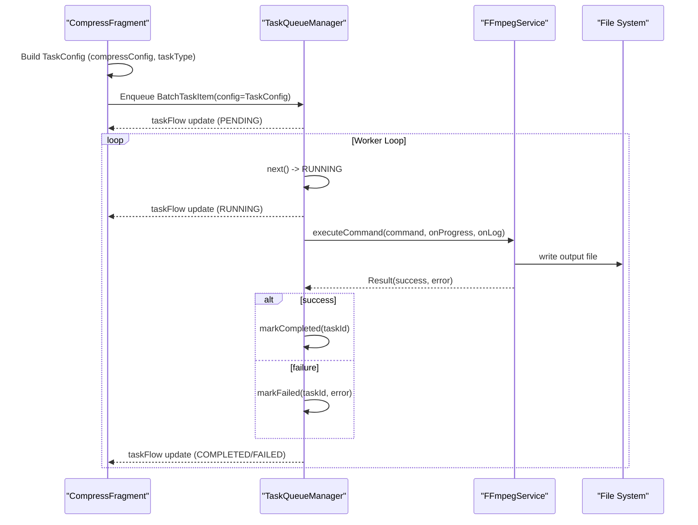
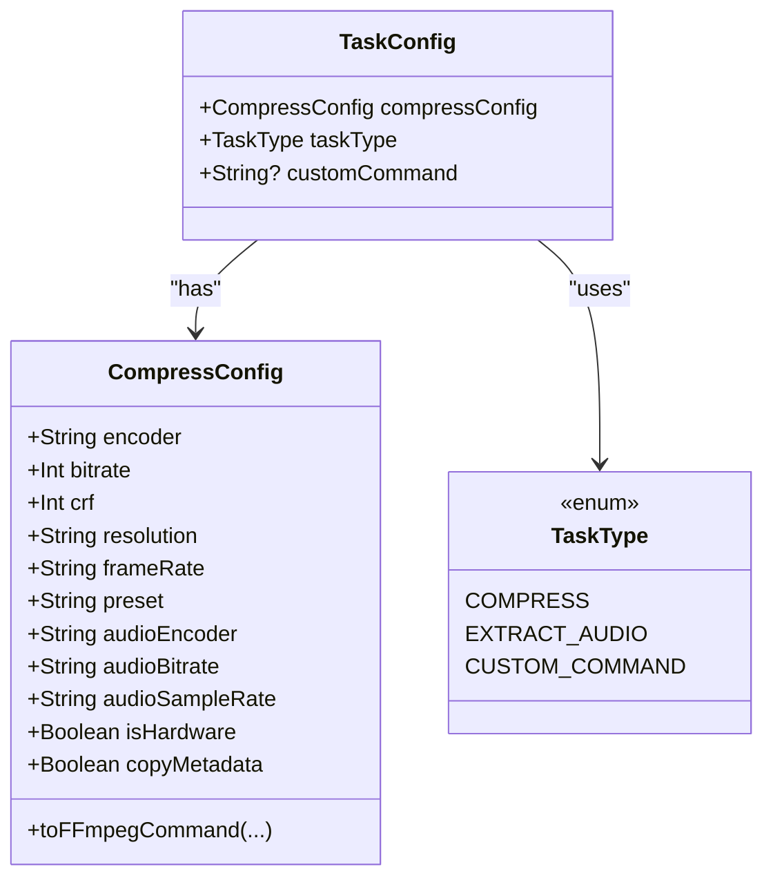
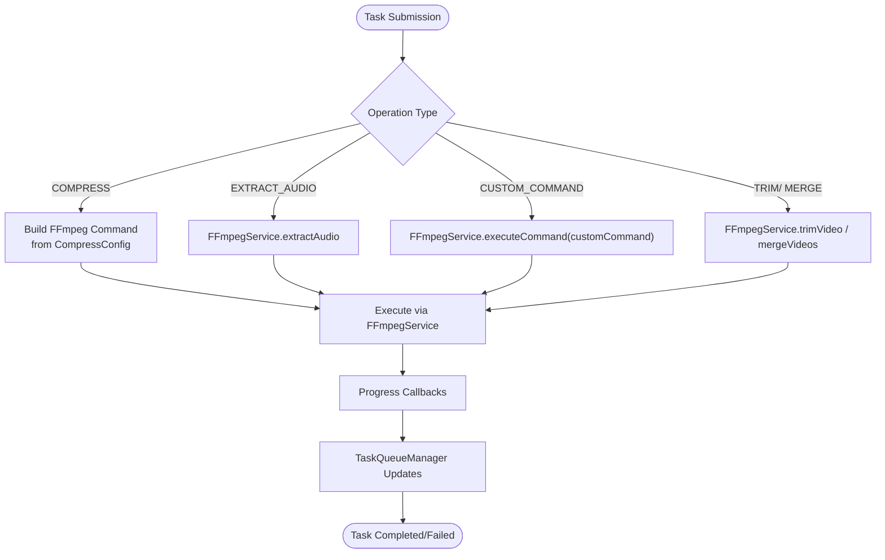
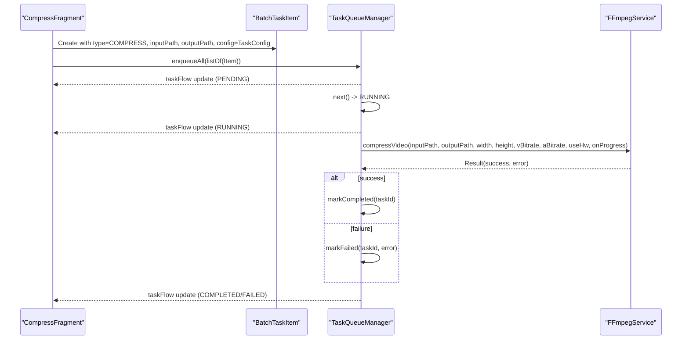
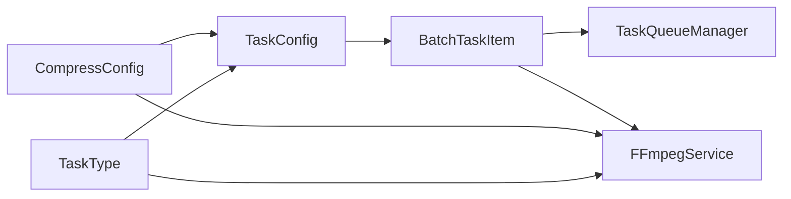

# Task Configuration Model

<cite>
**Referenced Files in This Document**
- [TaskConfig.kt](file://app/src/main/java/com/pisces312/streamclip/model/TaskConfig.kt)
- [CompressConfig.kt](file://app/src/main/java/com/pisces312/streamclip/model/CompressConfig.kt)
- [TaskType.kt](file://app/src/main/java/com/pisces312/streamclip/model/TaskType.kt)
- [BatchTaskItem.kt](file://app/src/main/java/com/pisces312/streamclip/model/BatchTaskItem.kt)
- [FFmpegService.kt](file://app/src/main/java/com/pisces312/streamclip/service/FFmpegService.kt)
- [TaskQueueManager.kt](file://app/src/main/java/com/pisces312/streamclip/service/TaskQueueManager.kt)
- [CompressFragment.kt](file://app/src/main/java/com/pisces312/streamclip/fragment/CompressFragment.kt)
- [Trim2Fragment.kt](file://app/src/main/java/com/pisces312/streamclip/fragment/Trim2Fragment.kt)
- [MergeFragment.kt](file://app/src/main/java/com/pisces312/streamclip/fragment/MergeFragment.kt)
- [ExtractFragment.kt](file://app/src/main/java/com/pisces312/streamclip/fragment/ExtractFragment.kt)
</cite>

## Table of Contents
1. [Introduction](#introduction)
2. [Project Structure](#project-structure)
3. [Core Components](#core-components)
4. [Architecture Overview](#architecture-overview)
5. [Detailed Component Analysis](#detailed-component-analysis)
6. [Dependency Analysis](#dependency-analysis)
7. [Performance Considerations](#performance-considerations)
8. [Troubleshooting Guide](#troubleshooting-guide)
9. [Conclusion](#conclusion)
10. [Appendices](#appendices)

## Introduction
This document describes the TaskConfig data class and its role in managing operation configuration for video processing tasks in StreamClip. It explains how TaskConfig relates to different operations (trimming, merging, compression, extraction), how defaults and validation are handled, and how it integrates with FFmpegService and TaskQueueManager for background processing. It also covers serialization, persistence considerations, and state management for long-running tasks.

## Project Structure
TaskConfig resides in the model package alongside related configuration and task types. Operation-specific UI fragments construct TaskConfig instances and pass them to FFmpegService for execution. Background processing is coordinated via TaskQueueManager and BatchTaskService.

**Diagram sources**
- [TaskConfig.kt:1-15](file://app/src/main/java/com/pisces312/streamclip/model/TaskConfig.kt#L1-L15)
- [CompressConfig.kt:1-209](file://app/src/main/java/com/pisces312/streamclip/model/CompressConfig.kt#L1-L209)
- [TaskType.kt:1-8](file://app/src/main/java/com/pisces312/streamclip/model/TaskType.kt#L1-L8)
- [BatchTaskItem.kt:1-32](file://app/src/main/java/com/pisces312/streamclip/model/BatchTaskItem.kt#L1-L32)
- [FFmpegService.kt:1-420](file://app/src/main/java/com/pisces312/streamclip/service/FFmpegService.kt#L1-L420)
- [TaskQueueManager.kt:1-146](file://app/src/main/java/com/pisces312/streamclip/service/TaskQueueManager.kt#L1-L146)
- [CompressFragment.kt:1-839](file://app/src/main/java/com/pisces312/streamclip/fragment/CompressFragment.kt#L1-L839)
- [Trim2Fragment.kt:1-286](file://app/src/main/java/com/pisces312/streamclip/fragment/Trim2Fragment.kt#L1-L286)
- [MergeFragment.kt:1-278](file://app/src/main/java/com/pisces312/streamclip/fragment/MergeFragment.kt#L1-L278)
- [ExtractFragment.kt:1-209](file://app/src/main/java/com/pisces312/streamclip/fragment/ExtractFragment.kt#L1-L209)

**Section sources**
- [TaskConfig.kt:1-15](file://app/src/main/java/com/pisces312/streamclip/model/TaskConfig.kt#L1-L15)
- [CompressConfig.kt:1-209](file://app/src/main/java/com/pisces312/streamclip/model/CompressConfig.kt#L1-L209)
- [TaskType.kt:1-8](file://app/src/main/java/com/pisces312/streamclip/model/TaskType.kt#L1-L8)
- [BatchTaskItem.kt:1-32](file://app/src/main/java/com/pisces312/streamclip/model/BatchTaskItem.kt#L1-L32)
- [FFmpegService.kt:1-420](file://app/src/main/java/com/pisces312/streamclip/service/FFmpegService.kt#L1-L420)
- [TaskQueueManager.kt:1-146](file://app/src/main/java/com/pisces312/streamclip/service/TaskQueueManager.kt#L1-L146)
- [CompressFragment.kt:1-839](file://app/src/main/java/com/pisces312/streamclip/fragment/CompressFragment.kt#L1-L839)
- [Trim2Fragment.kt:1-286](file://app/src/main/java/com/pisces312/streamclip/fragment/Trim2Fragment.kt#L1-L286)
- [MergeFragment.kt:1-278](file://app/src/main/java/com/pisces312/streamclip/fragment/MergeFragment.kt#L1-L278)
- [ExtractFragment.kt:1-209](file://app/src/main/java/com/pisces312/streamclip/fragment/ExtractFragment.kt#L1-L209)

## Core Components
- TaskConfig: Holds per-task configuration including compression settings, operation type, and optional custom command. It is serializable to support persistence and inter-process communication.
- CompressConfig: Encapsulates compression parameters (encoder, bitrate/CNF, resolution scaling, frame rate, presets, audio settings, metadata copying) and generates FFmpeg commands.
- TaskType: Enumerates supported operations (compression, audio extraction, custom command).
- BatchTaskItem: Wraps TaskConfig with input/output paths and runtime state for queue management.
- FFmpegService: Executes FFmpeg operations and exposes progress/log callbacks.
- TaskQueueManager: Manages a persistent queue of tasks with state transitions and summary metrics.

Key relationships:
- TaskConfig is embedded inside BatchTaskItem to define the operation to execute.
- CompressConfig is used to derive FFmpeg command strings for compression tasks.
- FFmpegService executes operations and updates progress; TaskQueueManager tracks task lifecycle.

**Section sources**
- [TaskConfig.kt:5-9](file://app/src/main/java/com/pisces312/streamclip/model/TaskConfig.kt#L5-L9)
- [CompressConfig.kt:3-15](file://app/src/main/java/com/pisces312/streamclip/model/CompressConfig.kt#L3-L15)
- [TaskType.kt:3-7](file://app/src/main/java/com/pisces312/streamclip/model/TaskType.kt#L3-L7)
- [BatchTaskItem.kt:5-18](file://app/src/main/java/com/pisces312/streamclip/model/BatchTaskItem.kt#L5-L18)
- [FFmpegService.kt:19-420](file://app/src/main/java/com/pisces312/streamclip/service/FFmpegService.kt#L19-L420)
- [TaskQueueManager.kt:10-146](file://app/src/main/java/com/pisces312/streamclip/service/TaskQueueManager.kt#L10-L146)

## Architecture Overview
The system orchestrates video processing tasks through a clear separation of concerns:
- UI fragments assemble TaskConfig and submit tasks.
- FFmpegService executes commands and reports progress/logs.
- TaskQueueManager maintains task state and emits updates.

**Diagram sources**
- [CompressFragment.kt:549-562](file://app/src/main/java/com/pisces312/streamclip/fragment/CompressFragment.kt#L549-L562)
- [TaskQueueManager.kt:32-86](file://app/src/main/java/com/pisces312/streamclip/service/TaskQueueManager.kt#L32-L86)
- [FFmpegService.kt:152-241](file://app/src/main/java/com/pisces312/streamclip/service/FFmpegService.kt#L152-L241)

## Detailed Component Analysis

### TaskConfig Data Model
TaskConfig is a compact, serializable configuration container:
- compressConfig: Compression settings for compression tasks.
- taskType: Operation type (COMPRESS, EXTRACT_AUDIO, CUSTOM_COMMAND).
- customCommand: Optional free-form FFmpeg command for advanced users.

Default values ensure safe operation when not explicitly set. Serialization enables persistence across process boundaries.

**Diagram sources**
- [TaskConfig.kt:5-9](file://app/src/main/java/com/pisces312/streamclip/model/TaskConfig.kt#L5-L9)
- [CompressConfig.kt:3-15](file://app/src/main/java/com/pisces312/streamclip/model/CompressConfig.kt#L3-L15)
- [TaskType.kt:3-7](file://app/src/main/java/com/pisces312/streamclip/model/TaskType.kt#L3-L7)

**Section sources**
- [TaskConfig.kt:5-9](file://app/src/main/java/com/pisces312/streamclip/model/TaskConfig.kt#L5-L9)
- [CompressConfig.kt:3-15](file://app/src/main/java/com/pisces312/streamclip/model/CompressConfig.kt#L3-L15)
- [TaskType.kt:3-7](file://app/src/main/java/com/pisces312/streamclip/model/TaskType.kt#L3-L7)

### Relationship to Operations

- Trimming (Lossless, no re-encoding):
  - Implemented by FFmpegService.trimVideo with fixed parameters for stream copy.
  - TaskType is not used here; the fragment constructs output paths and invokes FFmpegService directly.

- Merging (Concat demuxer, lossless):
  - Implemented by FFmpegService.mergeVideos with safety checks and metadata propagation.
  - TaskType is not used here; the fragment constructs output paths and invokes FFmpegService directly.

- Extraction (Audio copy):
  - Implemented by FFmpegService.extractAudio with stream copy.
  - TaskType is not used here; the fragment constructs output paths and invokes FFmpegService directly.

- Compression:
  - Implemented by FFmpegService.compressVideo/compressAudio using CompressConfig to build commands.
  - TaskType is COMPRESS; TaskConfig encapsulates CompressConfig and is passed to FFmpegService.

- Custom Command:
  - Supported via TaskConfig.customCommand; TaskType is CUSTOM_COMMAND.
  - FFmpegService.executeCommand runs the provided command string.

**Diagram sources**
- [CompressConfig.kt:21-114](file://app/src/main/java/com/pisces312/streamclip/model/CompressConfig.kt#L21-L114)
- [FFmpegService.kt:246-393](file://app/src/main/java/com/pisces312/streamclip/service/FFmpegService.kt#L246-L393)
- [FFmpegService.kt:339-350](file://app/src/main/java/com/pisces312/streamclip/service/FFmpegService.kt#L339-L350)
- [FFmpegService.kt:152-241](file://app/src/main/java/com/pisces312/streamclip/service/FFmpegService.kt#L152-L241)
- [TaskType.kt:3-7](file://app/src/main/java/com/pisces312/streamclip/model/TaskType.kt#L3-L7)

**Section sources**
- [CompressConfig.kt:21-114](file://app/src/main/java/com/pisces312/streamclip/model/CompressConfig.kt#L21-L114)
- [FFmpegService.kt:246-393](file://app/src/main/java/com/pisces312/streamclip/service/FFmpegService.kt#L246-L393)
- [FFmpegService.kt:339-350](file://app/src/main/java/com/pisces312/streamclip/service/FFmpegService.kt#L339-L350)
- [FFmpegService.kt:152-241](file://app/src/main/java/com/pisces312/streamclip/service/FFmpegService.kt#L152-L241)
- [TaskType.kt:3-7](file://app/src/main/java/com/pisces312/streamclip/model/TaskType.kt#L3-L7)

### Validation Rules, Defaults, and Constraints
- TaskConfig defaults:
  - compressConfig defaults to a new CompressConfig with built-in defaults.
  - taskType defaults to COMPRESS.
  - customCommand defaults to null.

- CompressConfig defaults and constraints:
  - Encoder defaults to a hardware encoder.
  - Bitrate defaults to a moderate value; CRF defaults to a balanced quality setting.
  - Resolution defaults to "original"; frameRate defaults to "original".
  - Preset defaults to a balanced speed/quality trade-off for software encoding.
  - Audio encoder defaults to "copy" to avoid resampling; audio bitrate defaults to "128".
  - Audio sample rate defaults to "copy" to prevent swresample crashes.
  - isHardware defaults to true; copyMetadata defaults to true.

- Operation-specific constraints:
  - Merging requires at least two inputs; otherwise returns a specific error code.
  - Trimming requires a minimum duration; the UI enforces a minimum segment length.

- Parameter inheritance patterns:
  - Compression tasks inherit parameters from CompressConfig; UI fragments translate user selections into CompressConfig, then convert to TaskConfig.
  - Custom command tasks bypass CompressConfig and rely solely on the provided command string.

**Section sources**
- [TaskConfig.kt:6-8](file://app/src/main/java/com/pisces312/streamclip/model/TaskConfig.kt#L6-L8)
- [CompressConfig.kt:3-15](file://app/src/main/java/com/pisces312/streamclip/model/CompressConfig.kt#L3-L15)
- [FFmpegService.kt:303-305](file://app/src/main/java/com/pisces312/streamclip/service/FFmpegService.kt#L303-L305)
- [Trim2Fragment.kt:188-191](file://app/src/main/java/com/pisces312/streamclip/fragment/Trim2Fragment.kt#L188-L191)

### Integration with FFmpegService and TaskQueueManager
- FFmpegService:
  - Provides executeCommand for generic command execution with progress and log callbacks.
  - Specialized methods for trimVideo, mergeVideos, extractAudio, compressVideo, compressAudio.
  - Uses MediaInfo probing to estimate durations for progress calculation.

- TaskQueueManager:
  - Maintains a queue of BatchTaskItem entries.
  - Transitions task states (PENDING, RUNNING, COMPLETED, FAILED, CANCELLED).
  - Emits StateFlow updates for UI consumption.

- Serialization and persistence:
  - TaskConfig and BatchTaskItem are serializable, enabling persistence and inter-process communication.
  - TaskQueueManager stores tasks in memory with IDs; summaries and counts are exposed for monitoring.

- Long-running task state management:
  - Progress percentage is derived from processed time vs. total duration.
  - Output size is tracked post-execution.
  - Errors are propagated with descriptive messages.

**Diagram sources**
- [CompressFragment.kt:549-562](file://app/src/main/java/com/pisces312/streamclip/fragment/CompressFragment.kt#L549-L562)
- [BatchTaskItem.kt:5-18](file://app/src/main/java/com/pisces312/streamclip/model/BatchTaskItem.kt#L5-L18)
- [TaskQueueManager.kt:32-86](file://app/src/main/java/com/pisces312/streamclip/service/TaskQueueManager.kt#L32-L86)
- [FFmpegService.kt:355-393](file://app/src/main/java/com/pisces312/streamclip/service/FFmpegService.kt#L355-L393)

**Section sources**
- [FFmpegService.kt:152-241](file://app/src/main/java/com/pisces312/streamclip/service/FFmpegService.kt#L152-L241)
- [FFmpegService.kt:355-393](file://app/src/main/java/com/pisces312/streamclip/service/FFmpegService.kt#L355-L393)
- [TaskQueueManager.kt:10-146](file://app/src/main/java/com/pisces312/streamclip/service/TaskQueueManager.kt#L10-L146)
- [BatchTaskItem.kt:5-18](file://app/src/main/java/com/pisces312/streamclip/model/BatchTaskItem.kt#L5-L18)

### Examples of Task Configurations
- Compression task:
  - Build CompressConfig from UI selections, then convert to TaskConfig with taskType=COMPRESS.
  - Submit as BatchTaskItem with input/output paths to TaskQueueManager.

- Custom command task:
  - Set taskType=CUSTOM_COMMAND and provide a non-null customCommand.
  - FFmpegService.executeCommand runs the provided command string.

- Trimming/Merging/Extraction tasks:
  - These operations are invoked directly via FFmpegService methods in their respective fragments.
  - They do not use TaskConfig.taskType but still leverage FFmpegService for execution.

Note: The examples below reference file paths and line ranges rather than code content.

**Section sources**
- [CompressFragment.kt:533-562](file://app/src/main/java/com/pisces312/streamclip/fragment/CompressFragment.kt#L533-L562)
- [TaskConfig.kt:11-14](file://app/src/main/java/com/pisces312/streamclip/model/TaskConfig.kt#L11-L14)
- [FFmpegService.kt:246-393](file://app/src/main/java/com/pisces312/streamclip/service/FFmpegService.kt#L246-L393)

### Error Handling Strategies
- FFmpegService:
  - Returns Result(success, outputPath?, error?) with descriptive messages on failure.
  - Uses ReturnCode.isSuccess to determine success.
  - Cancellation support via cancelCurrentSession.

- TaskQueueManager:
  - Marks tasks FAILED with error messages and sets completion timestamps.
  - Supports retryTask by cloning failed/cancelled tasks with new IDs.

- UI-level checks:
  - Trimming enforces a minimum segment duration.
  - Merging validates input count and compatibility before execution.

**Section sources**
- [FFmpegService.kt:33-45](file://app/src/main/java/com/pisces312/streamclip/service/FFmpegService.kt#L33-L45)
- [FFmpegService.kt:236-240](file://app/src/main/java/com/pisces312/streamclip/service/FFmpegService.kt#L236-L240)
- [TaskQueueManager.kt:68-86](file://app/src/main/java/com/pisces312/streamclip/service/TaskQueueManager.kt#L68-L86)
- [Trim2Fragment.kt:188-191](file://app/src/main/java/com/pisces312/streamclip/fragment/Trim2Fragment.kt#L188-L191)
- [MergeFragment.kt:136-139](file://app/src/main/java/com/pisces312/streamclip/fragment/MergeFragment.kt#L136-L139)

## Dependency Analysis
TaskConfig depends on CompressConfig and TaskType. BatchTaskItem depends on TaskConfig and TaskStatus. FFmpegService depends on CompressConfig for compression commands and on TaskType for dispatching operations. TaskQueueManager depends on BatchTaskItem for state management.

**Diagram sources**
- [TaskConfig.kt:5-9](file://app/src/main/java/com/pisces312/streamclip/model/TaskConfig.kt#L5-L9)
- [CompressConfig.kt:3-15](file://app/src/main/java/com/pisces312/streamclip/model/CompressConfig.kt#L3-L15)
- [TaskType.kt:3-7](file://app/src/main/java/com/pisces312/streamclip/model/TaskType.kt#L3-L7)
- [BatchTaskItem.kt:5-18](file://app/src/main/java/com/pisces312/streamclip/model/BatchTaskItem.kt#L5-L18)
- [TaskQueueManager.kt:10-146](file://app/src/main/java/com/pisces312/streamclip/service/TaskQueueManager.kt#L10-L146)
- [FFmpegService.kt:19-420](file://app/src/main/java/com/pisces312/streamclip/service/FFmpegService.kt#L19-L420)

**Section sources**
- [TaskConfig.kt:5-9](file://app/src/main/java/com/pisces312/streamclip/model/TaskConfig.kt#L5-L9)
- [CompressConfig.kt:3-15](file://app/src/main/java/com/pisces312/streamclip/model/CompressConfig.kt#L3-L15)
- [TaskType.kt:3-7](file://app/src/main/java/com/pisces312/streamclip/model/TaskType.kt#L3-L7)
- [BatchTaskItem.kt:5-18](file://app/src/main/java/com/pisces312/streamclip/model/BatchTaskItem.kt#L5-L18)
- [TaskQueueManager.kt:10-146](file://app/src/main/java/com/pisces312/streamclip/service/TaskQueueManager.kt#L10-L146)
- [FFmpegService.kt:19-420](file://app/src/main/java/com/pisces312/streamclip/service/FFmpegService.kt#L19-L420)

## Performance Considerations
- Hardware vs. software encoding:
  - Hardware encoders offer faster processing but less fine-grained control; software encoders provide CRF/Preset tuning.
- Resolution scaling:
  - Using scale factors reduces compute load; ensure even dimensions for compatibility.
- Frame rate adjustments:
  - Changing frame rates introduces re-sampling; prefer "original" for minimal processing.
- Metadata copying:
  - Copying metadata preserves GPS and color info but adds overhead; disable if unnecessary.
- Progress estimation:
  - Duration-based progress requires accurate probing; fallbacks are handled when duration is unknown.

[No sources needed since this section provides general guidance]

## Troubleshooting Guide
- Common failures:
  - Merge needs at least two inputs; ensure multiple files are selected.
  - Trimming requires a minimum segment length; adjust slider handles.
  - Audio resampling can cause crashes; keep audio sample rate as "copy".

- Diagnosing issues:
  - Inspect FFmpegService.Result.error for operation-specific messages.
  - Use FFmpegService logs via onLog callback to capture stderr/stdout.
  - Verify output file sizes and timestamps after completion.

- Recovering from failure:
  - Retry failed tasks via TaskQueueManager.retryTask.
  - Cancel in-progress sessions using FFmpegService.cancelCurrentSession.

**Section sources**
- [FFmpegService.kt:303-305](file://app/src/main/java/com/pisces312/streamclip/service/FFmpegService.kt#L303-L305)
- [FFmpegService.kt:236-240](file://app/src/main/java/com/pisces312/streamclip/service/FFmpegService.kt#L236-L240)
- [TaskQueueManager.kt:122-139](file://app/src/main/java/com/pisces312/streamclip/service/TaskQueueManager.kt#L122-L139)
- [Trim2Fragment.kt:188-191](file://app/src/main/java/com/pisces312/streamclip/fragment/Trim2Fragment.kt#L188-L191)

## Conclusion
TaskConfig centralizes per-task configuration for StreamClip’s video processing pipeline. It integrates seamlessly with CompressConfig for compression, supports custom commands, and works with FFmpegService and TaskQueueManager for robust background execution. Defaults and validation ensure safe operation, while progress tracking and error reporting provide reliable feedback for long-running tasks.

[No sources needed since this section summarizes without analyzing specific files]

## Appendices

### Appendix A: Serialization and Persistence Notes
- Both TaskConfig and BatchTaskItem are serializable, enabling storage and IPC.
- TaskQueueManager maintains in-memory state with ID-based lookups and summary metrics.
- For durable persistence, serialize TaskConfig to disk or database and reconstruct on app restart.

[No sources needed since this section provides general guidance]