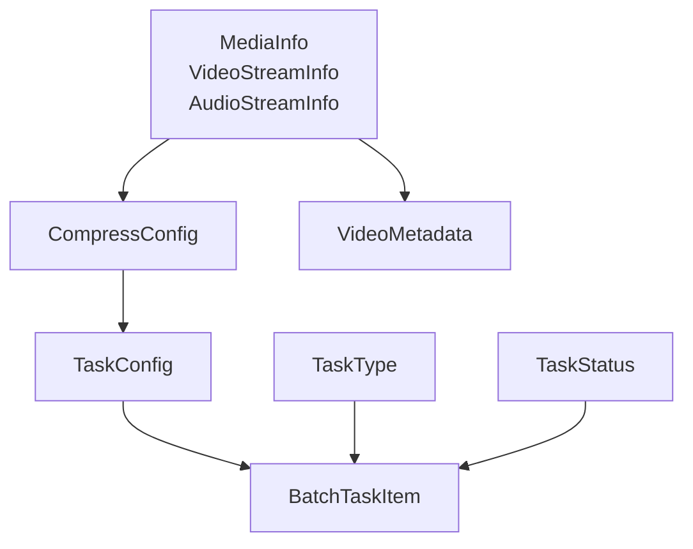
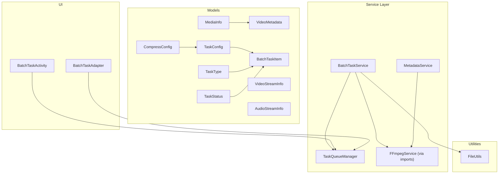
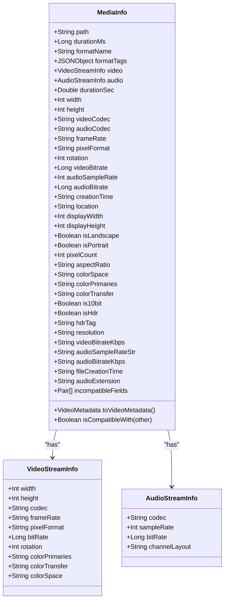
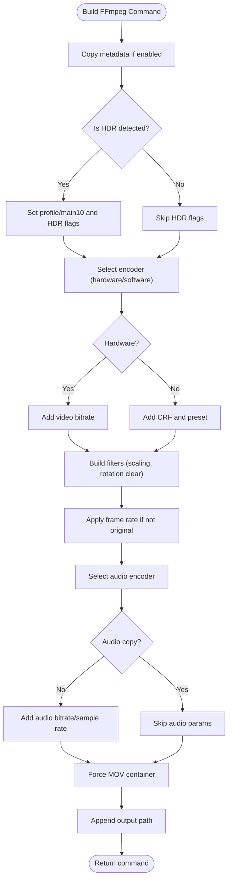
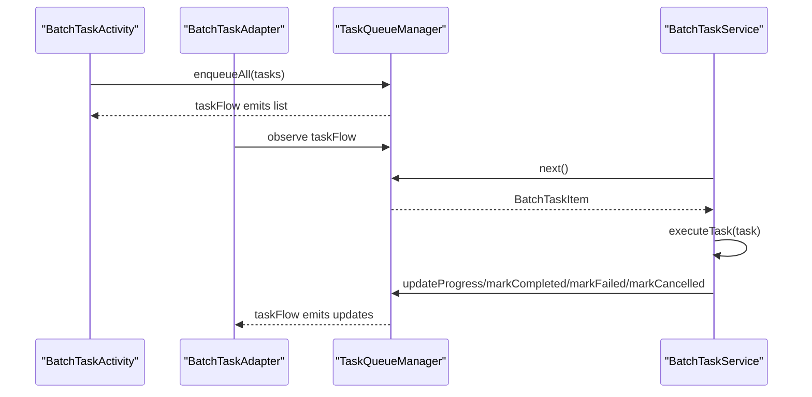
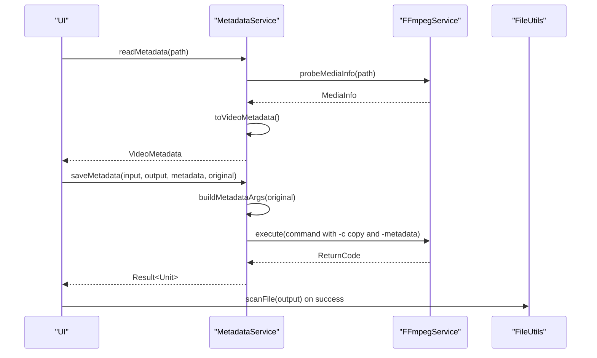
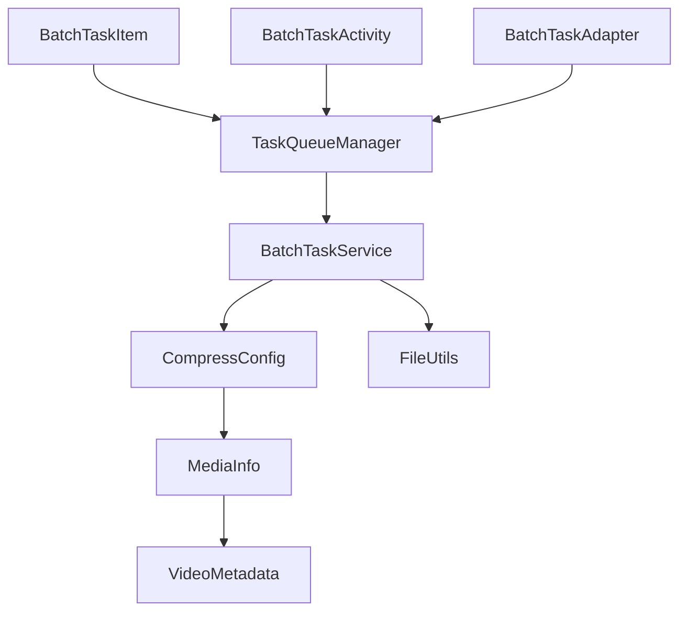

# Data Models and Structures

<cite>
**Referenced Files in This Document**
- [MediaInfo.kt](file://app/src/main/java/com/pisces312/streamclip/model/MediaInfo.kt)
- [CompressConfig.kt](file://app/src/main/java/com/pisces312/streamclip/model/CompressConfig.kt)
- [TaskConfig.kt](file://app/src/main/java/com/pisces312/streamclip/model/TaskConfig.kt)
- [BatchTaskItem.kt](file://app/src/main/java/com/pisces312/streamclip/model/BatchTaskItem.kt)
- [TaskStatus.kt](file://app/src/main/java/com/pisces312/streamclip/model/TaskStatus.kt)
- [TaskType.kt](file://app/src/main/java/com/pisces312/streamclip/model/TaskType.kt)
- [VideoMetadata.kt](file://app/src/main/java/com/pisces312/streamclip/model/VideoMetadata.kt)
- [BatchTaskService.kt](file://app/src/main/java/com/pisces312/streamclip/service/BatchTaskService.kt)
- [TaskQueueManager.kt](file://app/src/main/java/com/pisces312/streamclip/service/TaskQueueManager.kt)
- [BatchTaskAdapter.kt](file://app/src/main/java/com/pisces312/streamclip/adapter/BatchTaskAdapter.kt)
- [BatchTaskActivity.kt](file://app/src/main/java/com/pisces312/streamclip/ui/BatchTaskActivity.kt)
- [MetadataService.kt](file://app/src/main/java/com/pisces312/streamclip/service/MetadataService.kt)
- [FileUtils.kt](file://app/src/main/java/com/pisces312/streamclip/util/FileUtils.kt)
</cite>

## Table of Contents
1. [Introduction](#introduction)
2. [Project Structure](#project-structure)
3. [Core Components](#core-components)
4. [Architecture Overview](#architecture-overview)
5. [Detailed Component Analysis](#detailed-component-analysis)
6. [Dependency Analysis](#dependency-analysis)
7. [Performance Considerations](#performance-considerations)
8. [Troubleshooting Guide](#troubleshooting-guide)
9. [Conclusion](#conclusion)

## Introduction
This document provides comprehensive data model documentation for StreamClip’s core entities that represent application state and configuration. It focuses on:
- MediaInfo for video/audio metadata representation
- CompressConfig for compression parameters
- TaskConfig for operation configuration
- BatchTaskItem for queue management
- TaskStatus and TaskType enumerations
- VideoMetadata for GPS and EXIF-like metadata handling

It explains field definitions, data types, validation rules, business logic constraints, serialization formats, data access patterns, performance considerations, and integration with the service layer, UI components, and persistent storage. It also covers data lifecycle management, memory optimization, and thread-safety considerations for concurrent access.

## Project Structure
The data models are located under the model package and are consumed by the service layer (batch processing, metadata editing), UI components (batch task list), and utilities (file handling and scanning). The following diagram shows the primary model files and their relationships.

**Diagram sources**
- [MediaInfo.kt:5-165](file://app/src/main/java/com/pisces312/streamclip/model/MediaInfo.kt#L5-L165)
- [CompressConfig.kt:3-209](file://app/src/main/java/com/pisces312/streamclip/model/CompressConfig.kt#L3-L209)
- [TaskConfig.kt:5-15](file://app/src/main/java/com/pisces312/streamclip/model/TaskConfig.kt#L5-L15)
- [BatchTaskItem.kt:5-32](file://app/src/main/java/com/pisces312/streamclip/model/BatchTaskItem.kt#L5-L32)
- [TaskStatus.kt:3-11](file://app/src/main/java/com/pisces312/streamclip/model/TaskStatus.kt#L3-L11)
- [TaskType.kt:3-8](file://app/src/main/java/com/pisces312/streamclip/model/TaskType.kt#L3-L8)
- [VideoMetadata.kt:5-56](file://app/src/main/java/com/pisces312/streamclip/model/VideoMetadata.kt#L5-L56)

**Section sources**
- [MediaInfo.kt:1-165](file://app/src/main/java/com/pisces312/streamclip/model/MediaInfo.kt#L1-L165)
- [CompressConfig.kt:1-209](file://app/src/main/java/com/pisces312/streamclip/model/CompressConfig.kt#L1-L209)
- [TaskConfig.kt:1-15](file://app/src/main/java/com/pisces312/streamclip/model/TaskConfig.kt#L1-L15)
- [BatchTaskItem.kt:1-32](file://app/src/main/java/com/pisces312/streamclip/model/BatchTaskItem.kt#L1-L32)
- [TaskStatus.kt:1-11](file://app/src/main/java/com/pisces312/streamclip/model/TaskStatus.kt#L1-L11)
- [TaskType.kt:1-8](file://app/src/main/java/com/pisces312/streamclip/model/TaskType.kt#L1-L8)
- [VideoMetadata.kt:1-56](file://app/src/main/java/com/pisces312/streamclip/model/VideoMetadata.kt#L1-L56)

## Core Components
This section documents each core model with its fields, types, semantics, and constraints.

- MediaInfo
  - Purpose: Encapsulates media metadata and convenience accessors for video/audio streams and derived properties (resolution, aspect ratio, HDR indicators).
  - Key fields and types:
    - path: String
    - durationMs: Long (default -1 if unknown)
    - formatName: String
    - formatTags: JSONObject
    - video: VideoStreamInfo? (nullable)
    - audio: AudioStreamInfo? (nullable)
  - Derived properties:
    - durationSec: Double computed from durationMs
    - width/height/videoCodec/audioCodec/frameRate/pixelFormat/rotation/videoBitrate/audioSampleRate/audioBitrate: Int/String/Long with safe defaults
    - creationTime/location: Strings extracted from formatTags
    - displayWidth/displayHeight/isLandscape/isPortrait/pixelCount/aspectRatio: Geometry and ratio helpers
    - colorSpace/colorPrimaries/colorTransfer: Strings from video stream
    - is10bit/isHdr/hdrTag: HDR detection helpers
    - resolution/videoBitrateKbps/audioSampleRateStr/audioBitrateKbps: Formatted helpers
    - fileCreationTime: Lazy string preferring tag value
    - audioExtension: Codec-to-extension mapping
    - isCompatibleWith/getIncompatibleFields: Compatibility checks for merging
    - toVideoMetadata: Converts format tags to VideoMetadata
  - Validation and constraints:
    - durationMs defaults to -1; derived durationSec is -1.0 when unknown
    - Safe defaults for missing streams (0 or empty string)
    - Aspect ratio simplification avoids division by zero
    - Rotation affects displayWidth/Height calculation
  - Serialization: Not explicitly declared; used as data class for transport and persistence via service layer.
  - Access patterns: Convenience getters; lazy initialization for fileCreationTime.

- VideoStreamInfo
  - Purpose: Represents the first video stream metadata.
  - Fields: width, height, codec, frameRate, pixelFormat, bitRate (default 0), rotation (default 0), colorPrimaries, colorTransfer, colorSpace.

- AudioStreamInfo
  - Purpose: Represents the first audio stream metadata.
  - Fields: codec, sampleRate (default 0), bitRate (default 0), channelLayout.

- CompressConfig
  - Purpose: Encapsulates compression parameters and generates FFmpeg commands.
  - Fields:
    - encoder: String (default "h264_mediacodec")
    - bitrate: Int (hardware kbps; default 2000)
    - crf: Int (software; default 23, range 0–51)
    - resolution: String (default "original"; scale factors defined)
    - frameRate: String (default "original")
    - preset: String (default "medium"; software presets)
    - audioEncoder: String (default "copy")
    - audioBitrate: String (default "128"; "copy" supported)
    - audioSampleRate: String (default "copy"; avoids resampling crashes)
    - isHardware: Boolean (default true)
    - copyMetadata: Boolean (default true)
  - Methods:
    - toFFmpegCommand(...): Builds a command string using encoder, bitrate/crf, resolution scaling, frame rate, audio settings, and container/format considerations.
  - Constants and options:
    - HW_ENCODERS/SW_ENCODERS: Available encoders
    - BITRATES: Hardware bitrate choices
    - SCALE_FACTORS: Resolution reduction factors
    - PRESETS: Software encoding speed presets
    - AUDIO_ENCODERS/AUDIO_BITRATES/AUDIO_SAMPLE_RATES: Audio options
    - FRAME_RATES: Frame rate choices
    - HELP_TEXTS: UI help keys
  - Validation and constraints:
    - Resolution scaling uses predefined factors
    - H.265 hardware profile set to main10 when HDR detected
    - Container forced to MOV to preserve GPS metadata on Android
    - Rotation metadata cleared when resizing to prevent orientation confusion

- TaskConfig
  - Purpose: Bundles compression configuration and task type for a single operation.
  - Fields:
    - compressConfig: CompressConfig (default initialized)
    - taskType: TaskType (default COMPRESS)
    - customCommand: String? (optional)
  - Utility:
    - toTaskConfig(): Extension to convert CompressConfig to TaskConfig with COMPRESS type.

- BatchTaskItem
  - Purpose: Represents a queued task with lifecycle and progress.
  - Fields:
    - id: String (UUID)
    - type: TaskType
    - inputPath/outputPath: String
    - config: TaskConfig
    - status: TaskStatus (default PENDING)
    - progress: Int (percent; coerced to 0–100)
    - errorMessage: String?
    - createdAt/startedAt/completedAt: Long timestamps
    - outputSizeBytes: Long
  - Supporting types:
    - BatchSummary: total/completed/failed/cancelled counts
    - TaskResult: success/error/isCancelled

- TaskStatus
  - Enumerates task lifecycle: PENDING, RUNNING, PAUSED, COMPLETED, FAILED, CANCELLED.

- TaskType
  - Enumerates task kinds: COMPRESS, EXTRACT_AUDIO, CUSTOM_COMMAND.

- VideoMetadata
  - Purpose: Encapsulates editable metadata fields and provides diff-based argument generation for FFmpeg.
  - Fields:
    - title, artist, creationTime, location, comment: String
    - rawTags: JSONObject
  - Methods:
    - isDifferentFrom(other): Compares editable fields
    - buildMetadataArgs(original): Generates -metadata arguments for changed fields only
  - Companion:
    - fromTags(tags): Creates VideoMetadata from JSONObject

**Section sources**
- [MediaInfo.kt:5-165](file://app/src/main/java/com/pisces312/streamclip/model/MediaInfo.kt#L5-L165)
- [CompressConfig.kt:3-209](file://app/src/main/java/com/pisces312/streamclip/model/CompressConfig.kt#L3-L209)
- [TaskConfig.kt:5-15](file://app/src/main/java/com/pisces312/streamclip/model/TaskConfig.kt#L5-L15)
- [BatchTaskItem.kt:5-32](file://app/src/main/java/com/pisces312/streamclip/model/BatchTaskItem.kt#L5-L32)
- [TaskStatus.kt:3-11](file://app/src/main/java/com/pisces312/streamclip/model/TaskStatus.kt#L3-L11)
- [TaskType.kt:3-8](file://app/src/main/java/com/pisces312/streamclip/model/TaskType.kt#L3-L8)
- [VideoMetadata.kt:5-56](file://app/src/main/java/com/pisces312/streamclip/model/VideoMetadata.kt#L5-L56)

## Architecture Overview
The models integrate across the service layer, UI, and utilities as follows:

**Diagram sources**
- [BatchTaskService.kt:1-301](file://app/src/main/java/com/pisces312/streamclip/service/BatchTaskService.kt#L1-L301)
- [TaskQueueManager.kt:1-146](file://app/src/main/java/com/pisces312/streamclip/service/TaskQueueManager.kt#L1-L146)
- [BatchTaskActivity.kt:1-89](file://app/src/main/java/com/pisces312/streamclip/ui/BatchTaskActivity.kt#L1-L89)
- [BatchTaskAdapter.kt:1-86](file://app/src/main/java/com/pisces312/streamclip/adapter/BatchTaskAdapter.kt#L1-L86)
- [MetadataService.kt:1-93](file://app/src/main/java/com/pisces312/streamclip/service/MetadataService.kt#L1-L93)
- [FileUtils.kt:1-362](file://app/src/main/java/com/pisces312/streamclip/util/FileUtils.kt#L1-L362)
- [MediaInfo.kt:1-165](file://app/src/main/java/com/pisces312/streamclip/model/MediaInfo.kt#L1-L165)
- [CompressConfig.kt:1-209](file://app/src/main/java/com/pisces312/streamclip/model/CompressConfig.kt#L1-L209)
- [TaskConfig.kt:1-15](file://app/src/main/java/com/pisces312/streamclip/model/TaskConfig.kt#L1-L15)
- [BatchTaskItem.kt:1-32](file://app/src/main/java/com/pisces312/streamclip/model/BatchTaskItem.kt#L1-L32)
- [VideoMetadata.kt:1-56](file://app/src/main/java/com/pisces312/streamclip/model/VideoMetadata.kt#L1-L56)

## Detailed Component Analysis

### MediaInfo and Video/Audio Streams
MediaInfo aggregates media metadata and exposes derived properties for UI and processing logic. It includes:
- Stream-specific accessors for width/height, codecs, frame rate, pixel format, rotation, and bitrate
- Color metadata (color primaries, transfer, space) and HDR detection
- Aspect ratio computation with rotation-aware display dimensions
- Compatibility checks for merging operations
- Conversion to VideoMetadata for editing workflows

**Diagram sources**
- [MediaInfo.kt:5-165](file://app/src/main/java/com/pisces312/streamclip/model/MediaInfo.kt#L5-L165)

**Section sources**
- [MediaInfo.kt:5-165](file://app/src/main/java/com/pisces312/streamclip/model/MediaInfo.kt#L5-L165)

### CompressConfig and Command Generation
CompressConfig encapsulates compression parameters and produces FFmpeg commands tailored to hardware/software encoders, resolution scaling, frame rates, and audio settings. It enforces:
- H.265 hardware profile set to main10 when HDR is detected
- MOV container to preserve GPS metadata on Android
- Rotation metadata cleared when resizing to avoid orientation confusion
- Safe defaults to avoid resampling crashes

**Diagram sources**
- [CompressConfig.kt:21-114](file://app/src/main/java/com/pisces312/streamclip/model/CompressConfig.kt#L21-L114)

**Section sources**
- [CompressConfig.kt:3-209](file://app/src/main/java/com/pisces312/streamclip/model/CompressConfig.kt#L3-L209)

### TaskConfig and BatchTaskItem Lifecycle
TaskConfig bundles compression configuration and task type, while BatchTaskItem tracks per-task state and progress. Together they form the queue entry for batch processing.

**Diagram sources**
- [BatchTaskActivity.kt:69-76](file://app/src/main/java/com/pisces312/streamclip/ui/BatchTaskActivity.kt#L69-L76)
- [BatchTaskAdapter.kt:33-79](file://app/src/main/java/com/pisces312/streamclip/adapter/BatchTaskAdapter.kt#L33-L79)
- [TaskQueueManager.kt:24-144](file://app/src/main/java/com/pisces312/streamclip/service/TaskQueueManager.kt#L24-L144)
- [BatchTaskService.kt:123-240](file://app/src/main/java/com/pisces312/streamclip/service/BatchTaskService.kt#L123-L240)

**Section sources**
- [TaskConfig.kt:5-15](file://app/src/main/java/com/pisces312/streamclip/model/TaskConfig.kt#L5-L15)
- [BatchTaskItem.kt:5-32](file://app/src/main/java/com/pisces312/streamclip/model/BatchTaskItem.kt#L5-L32)
- [TaskQueueManager.kt:10-146](file://app/src/main/java/com/pisces312/streamclip/service/TaskQueueManager.kt#L10-L146)
- [BatchTaskService.kt:92-240](file://app/src/main/java/com/pisces312/streamclip/service/BatchTaskService.kt#L92-L240)

### VideoMetadata and Metadata Editing
VideoMetadata supports reading and writing editable metadata fields. MetadataService orchestrates reading and saving metadata using FFmpeg with lossless copying and selective metadata updates.

**Diagram sources**
- [MetadataService.kt:15-67](file://app/src/main/java/com/pisces312/streamclip/service/MetadataService.kt#L15-L67)
- [MediaInfo.kt:142-144](file://app/src/main/java/com/pisces312/streamclip/model/MediaInfo.kt#L142-L144)
- [FileUtils.kt:268-275](file://app/src/main/java/com/pisces312/streamclip/util/FileUtils.kt#L268-L275)

**Section sources**
- [VideoMetadata.kt:5-56](file://app/src/main/java/com/pisces312/streamclip/model/VideoMetadata.kt#L5-L56)
- [MetadataService.kt:10-93](file://app/src/main/java/com/pisces312/streamclip/service/MetadataService.kt#L10-L93)
- [MediaInfo.kt:142-144](file://app/src/main/java/com/pisces312/streamclip/model/MediaInfo.kt#L142-L144)
- [FileUtils.kt:268-275](file://app/src/main/java/com/pisces312/streamclip/util/FileUtils.kt#L268-L275)

## Dependency Analysis
The models are tightly coupled to the service layer and UI via explicit imports and shared state. TaskQueueManager holds the canonical task list and exposes it via a StateFlow for reactive UI updates. BatchTaskService coordinates execution, progress reporting, and cleanup.

**Diagram sources**
- [BatchTaskItem.kt:5-32](file://app/src/main/java/com/pisces312/streamclip/model/BatchTaskItem.kt#L5-L32)
- [TaskQueueManager.kt:10-146](file://app/src/main/java/com/pisces312/streamclip/service/TaskQueueManager.kt#L10-L146)
- [BatchTaskService.kt:181-240](file://app/src/main/java/com/pisces312/streamclip/service/BatchTaskService.kt#L181-L240)
- [CompressConfig.kt:21-114](file://app/src/main/java/com/pisces312/streamclip/model/CompressConfig.kt#L21-L114)
- [MediaInfo.kt:5-165](file://app/src/main/java/com/pisces312/streamclip/model/MediaInfo.kt#L5-L165)
- [VideoMetadata.kt:5-56](file://app/src/main/java/com/pisces312/streamclip/model/VideoMetadata.kt#L5-L56)
- [BatchTaskActivity.kt:69-76](file://app/src/main/java/com/pisces312/streamclip/ui/BatchTaskActivity.kt#L69-L76)
- [BatchTaskAdapter.kt:33-79](file://app/src/main/java/com/pisces312/streamclip/adapter/BatchTaskAdapter.kt#L33-L79)
- [FileUtils.kt:268-275](file://app/src/main/java/com/pisces312/streamclip/util/FileUtils.kt#L268-L275)

**Section sources**
- [TaskQueueManager.kt:10-146](file://app/src/main/java/com/pisces312/streamclip/service/TaskQueueManager.kt#L10-L146)
- [BatchTaskService.kt:181-240](file://app/src/main/java/com/pisces312/streamclip/service/BatchTaskService.kt#L181-L240)
- [BatchTaskActivity.kt:69-76](file://app/src/main/java/com/pisces312/streamclip/ui/BatchTaskActivity.kt#L69-L76)
- [BatchTaskAdapter.kt:33-79](file://app/src/main/java/com/pisces312/streamclip/adapter/BatchTaskAdapter.kt#L33-L79)

## Performance Considerations
- Data models are lightweight data classes with minimal overhead; they are suitable for frequent serialization/deserialization across service boundaries.
- MediaInfo uses lazy initialization for fileCreationTime to avoid unnecessary work when tags are unavailable.
- TaskQueueManager synchronizes access to shared state and uses a StateFlow to efficiently propagate updates to UI components.
- BatchTaskService leverages coroutines and SupervisorJob to isolate task failures and support cancellation.
- FileUtils provides efficient file scanning and time-stamp operations, with caching for input URIs to reduce I/O when possible.
- CompressConfig avoids expensive operations by predefining encoder and quality options, and by generating concise FFmpeg commands.

[No sources needed since this section provides general guidance]

## Troubleshooting Guide
- Batch processing failures:
  - BatchTaskService executes tasks with retry logic and cleans up partial outputs on failure. Inspect TaskResult and error messages propagated to the UI.
  - Use the UI’s retry action to re-enqueue failed or cancelled tasks with a new ID.
- Metadata editing:
  - MetadataService reports failure when no metadata changes are present or when FFmpeg returns a non-success return code. Verify that edited fields differ from originals and that the command is valid.
- File times and dates:
  - FileUtils applies shooting date or preserves original file times. If dates appear incorrect, verify the source metadata and supported Android API levels for file attributes.
- Concurrency and state:
  - TaskQueueManager uses synchronized methods and a concurrent map to manage task state safely. Avoid mutating models outside of TaskQueueManager APIs to prevent inconsistent UI state.

**Section sources**
- [BatchTaskService.kt:167-240](file://app/src/main/java/com/pisces312/streamclip/service/BatchTaskService.kt#L167-L240)
- [TaskQueueManager.kt:48-86](file://app/src/main/java/com/pisces312/streamclip/service/TaskQueueManager.kt#L48-L86)
- [MetadataService.kt:34-67](file://app/src/main/java/com/pisces312/streamclip/service/MetadataService.kt#L34-L67)
- [FileUtils.kt:281-331](file://app/src/main/java/com/pisces312/streamclip/util/FileUtils.kt#L281-L331)

## Conclusion
StreamClip’s data models provide a cohesive foundation for media metadata handling, compression configuration, and batch task orchestration. They are designed for clarity, performance, and robustness, integrating seamlessly with the service layer and UI through well-defined interfaces and state management. The models support HDR-aware encoding, GPS metadata preservation, and lossless metadata editing, while maintaining thread-safe operations and efficient UI updates.

[No sources needed since this section summarizes without analyzing specific files]