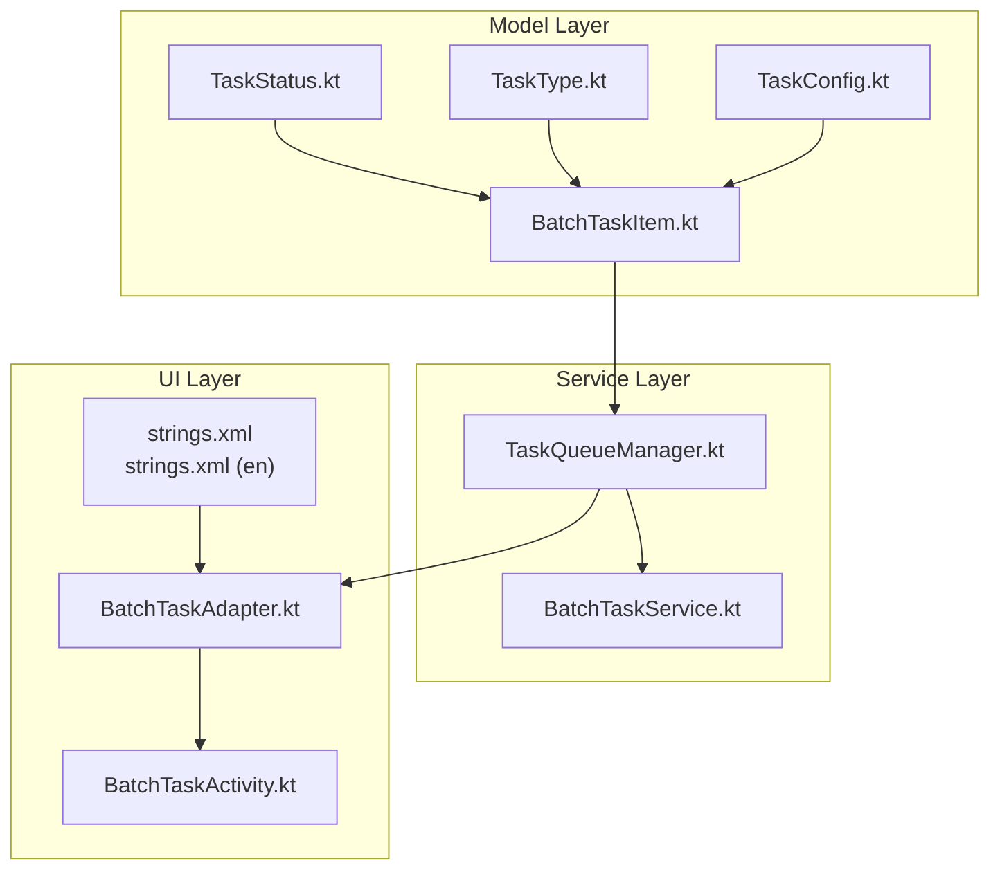
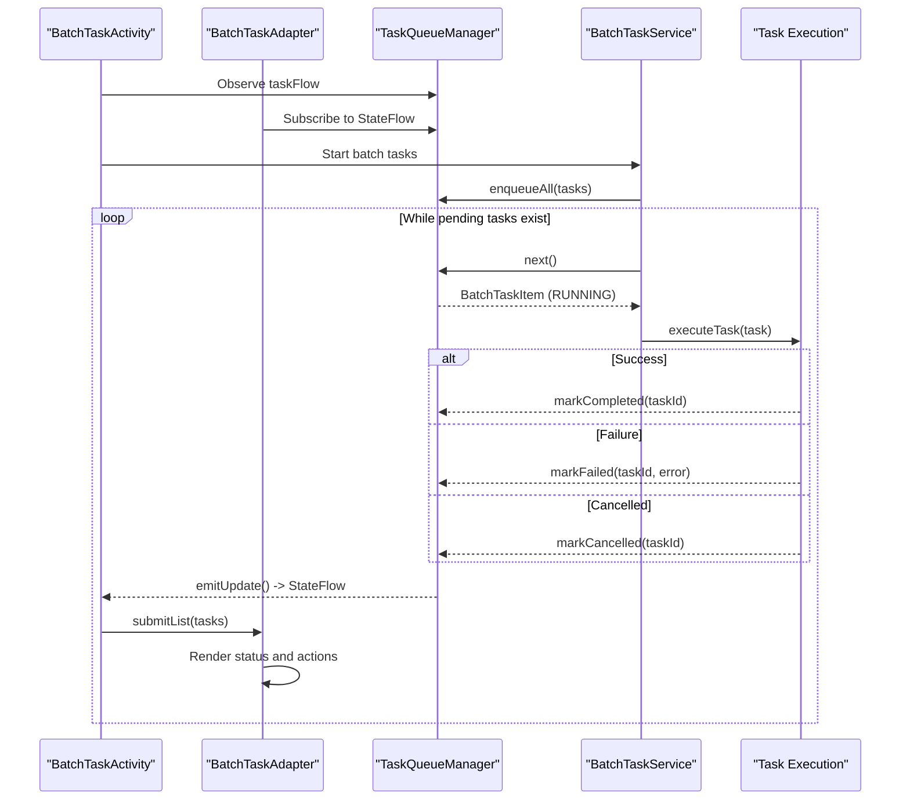
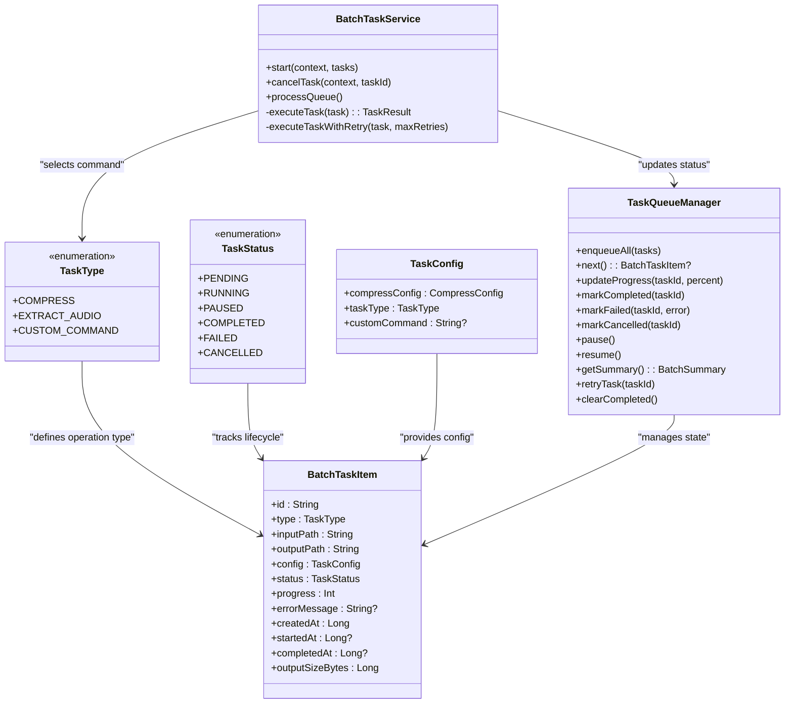

# Status and Type Enumerations

<cite>
**Referenced Files in This Document**
- [TaskStatus.kt](file://app/src/main/java/com/pisces312/streamclip/model/TaskStatus.kt)
- [TaskType.kt](file://app/src/main/java/com/pisces312/streamclip/model/TaskType.kt)
- [BatchTaskItem.kt](file://app/src/main/java/com/pisces312/streamclip/model/BatchTaskItem.kt)
- [TaskConfig.kt](file://app/src/main/java/com/pisces312/streamclip/model/TaskConfig.kt)
- [TaskQueueManager.kt](file://app/src/main/java/com/pisces312/streamclip/service/TaskQueueManager.kt)
- [BatchTaskService.kt](file://app/src/main/java/com/pisces312/streamclip/service/BatchTaskService.kt)
- [BatchTaskAdapter.kt](file://app/src/main/java/com/pisces312/streamclip/adapter/BatchTaskAdapter.kt)
- [BatchTaskActivity.kt](file://app/src/main/java/com/pisces312/streamclip/ui/BatchTaskActivity.kt)
- [strings.xml](file://app/src/main/res/values/strings.xml)
- [strings.xml (en)](file://app/src/main/res/values-en/strings.xml)
</cite>

## Table of Contents
1. [Introduction](#introduction)
2. [Project Structure](#project-structure)
3. [Core Components](#core-components)
4. [Architecture Overview](#architecture-overview)
5. [Detailed Component Analysis](#detailed-component-analysis)
6. [Dependency Analysis](#dependency-analysis)
7. [Performance Considerations](#performance-considerations)
8. [Troubleshooting Guide](#troubleshooting-guide)
9. [Conclusion](#conclusion)

## Introduction
This document focuses on StreamClip's status and type enumerations that govern task lifecycle management and operation classification. It explains the TaskStatus enumeration covering task lifecycle states (PENDING, RUNNING, PAUSED, COMPLETED, FAILED, CANCELLED) and their transitions, and the TaskType enumeration for operation categorization (COMPRESS, EXTRACT_AUDIO, CUSTOM_COMMAND). It also documents state machine patterns, validation rules, integration with the task queue system, usage examples for state transitions and error handling, UI synchronization, and thread-safety considerations for concurrent status updates.

## Project Structure
The status and type enumerations are part of the model layer and are consumed by the service layer (task execution and queue management), UI adapters, and activities. The following diagram shows the relationship between the core files involved in status and type management.

**Diagram sources**
- [TaskStatus.kt:1-10](file://app/src/main/java/com/pisces312/streamclip/model/TaskStatus.kt#L1-L10)
- [TaskType.kt:1-7](file://app/src/main/java/com/pisces312/streamclip/model/TaskType.kt#L1-L7)
- [BatchTaskItem.kt:1-32](file://app/src/main/java/com/pisces312/streamclip/model/BatchTaskItem.kt#L1-L32)
- [TaskConfig.kt:1-15](file://app/src/main/java/com/pisces312/streamclip/model/TaskConfig.kt#L1-L15)
- [TaskQueueManager.kt:1-146](file://app/src/main/java/com/pisces312/streamclip/service/TaskQueueManager.kt#L1-L146)
- [BatchTaskService.kt:1-301](file://app/src/main/java/com/pisces312/streamclip/service/BatchTaskService.kt#L1-L301)
- [BatchTaskAdapter.kt:1-86](file://app/src/main/java/com/pisces312/streamclip/adapter/BatchTaskAdapter.kt#L1-L86)
- [BatchTaskActivity.kt:1-89](file://app/src/main/java/com/pisces312/streamclip/ui/BatchTaskActivity.kt#L1-L89)
- [strings.xml:148-170](file://app/src/main/res/values/strings.xml#L148-L170)
- [strings.xml (en):148-170](file://app/src/main/res/values-en/strings.xml#L148-L170)

**Section sources**
- [TaskStatus.kt:1-10](file://app/src/main/java/com/pisces312/streamclip/model/TaskStatus.kt#L1-L10)
- [TaskType.kt:1-7](file://app/src/main/java/com/pisces312/streamclip/model/TaskType.kt#L1-L7)
- [BatchTaskItem.kt:1-32](file://app/src/main/java/com/pisces312/streamclip/model/BatchTaskItem.kt#L1-L32)
- [TaskConfig.kt:1-15](file://app/src/main/java/com/pisces312/streamclip/model/TaskConfig.kt#L1-L15)
- [TaskQueueManager.kt:1-146](file://app/src/main/java/com/pisces312/streamclip/service/TaskQueueManager.kt#L1-L146)
- [BatchTaskService.kt:1-301](file://app/src/main/java/com/pisces312/streamclip/service/BatchTaskService.kt#L1-L301)
- [BatchTaskAdapter.kt:1-86](file://app/src/main/java/com/pisces312/streamclip/adapter/BatchTaskAdapter.kt#L1-L86)
- [BatchTaskActivity.kt:1-89](file://app/src/main/java/com/pisces312/streamclip/ui/BatchTaskActivity.kt#L1-L89)
- [strings.xml:148-170](file://app/src/main/res/values/strings.xml#L148-L170)
- [strings.xml (en):148-170](file://app/src/main/res/values-en/strings.xml#L148-L170)

## Core Components
- TaskStatus: Defines the lifecycle states for tasks, including PENDING, RUNNING, PAUSED, COMPLETED, FAILED, and CANCELLED.
- TaskType: Classifies operations into COMPRESS, EXTRACT_AUDIO, and CUSTOM_COMMAND.
- BatchTaskItem: Encapsulates task identity, type, paths, configuration, status, progress, timestamps, and error information.
- TaskConfig: Holds operation-specific configuration and the TaskType selection.
- TaskQueueManager: Manages the in-memory task queue, state transitions, progress updates, and emits UI updates via StateFlow.
- BatchTaskService: Executes tasks, coordinates with TaskQueueManager, handles retries, and manages foreground notifications.
- UI Integration: BatchTaskAdapter and BatchTaskActivity synchronize UI with TaskQueueManager updates and reflect TaskStatus in localized strings.

**Section sources**
- [TaskStatus.kt:1-10](file://app/src/main/java/com/pisces312/streamclip/model/TaskStatus.kt#L1-L10)
- [TaskType.kt:1-7](file://app/src/main/java/com/pisces312/streamclip/model/TaskType.kt#L1-L7)
- [BatchTaskItem.kt:1-32](file://app/src/main/java/com/pisces312/streamclip/model/BatchTaskItem.kt#L1-L32)
- [TaskConfig.kt:1-15](file://app/src/main/java/com/pisces312/streamclip/model/TaskConfig.kt#L1-L15)
- [TaskQueueManager.kt:1-146](file://app/src/main/java/com/pisces312/streamclip/service/TaskQueueManager.kt#L1-L146)
- [BatchTaskService.kt:1-301](file://app/src/main/java/com/pisces312/streamclip/service/BatchTaskService.kt#L1-L301)
- [BatchTaskAdapter.kt:1-86](file://app/src/main/java/com/pisces312/streamclip/adapter/BatchTaskAdapter.kt#L1-L86)
- [BatchTaskActivity.kt:1-89](file://app/src/main/java/com/pisces312/streamclip/ui/BatchTaskActivity.kt#L1-L89)

## Architecture Overview
The status and type enumerations underpin a state machine that governs task lifecycle and operation classification. The TaskQueueManager acts as the central state coordinator, while BatchTaskService executes tasks and updates statuses. UI components observe TaskQueueManager updates and render localized status messages.

**Diagram sources**
- [BatchTaskActivity.kt:69-82](file://app/src/main/java/com/pisces312/streamclip/ui/BatchTaskActivity.kt#L69-L82)
- [BatchTaskAdapter.kt:33-79](file://app/src/main/java/com/pisces312/streamclip/adapter/BatchTaskAdapter.kt#L33-L79)
- [TaskQueueManager.kt:23-144](file://app/src/main/java/com/pisces312/streamclip/service/TaskQueueManager.kt#L23-L144)
- [BatchTaskService.kt:118-165](file://app/src/main/java/com/pisces312/streamclip/service/BatchTaskService.kt#L118-L165)

## Detailed Component Analysis

### TaskStatus Enumeration
TaskStatus defines the canonical states for a task:
- PENDING: Task is queued but not yet executed.
- RUNNING: Task is currently executing.
- PAUSED: Task is paused (manual user action).
- COMPLETED: Task finished successfully.
- FAILED: Task terminated with an error.
- CANCELLED: Task was cancelled (e.g., by user or system).

State machine pattern and transitions:
- Enqueue sets status to PENDING.
- Dequeue sets status to RUNNING and records startedAt.
- Completion sets status to COMPLETED, progress to 100, records completedAt, and captures outputSizeBytes.
- Failure sets status to FAILED, records completedAt, and stores errorMessage.
- Cancellation sets status to CANCELLED.
- Retry creates a new PENDING task from FAILED or CANCELLED tasks.

Validation rules:
- Progress is coerced to 0–100 during updates.
- Completed tasks set progress to 100 and record completion metrics.
- Summary counts are derived from status comparisons.

Thread-safety:
- All mutation points are guarded by synchronized methods and @Synchronized annotations.
- Internal state is protected by synchronized(this) blocks and @Volatile flags for pause state.

Usage examples:
- Transition from PENDING to RUNNING occurs when TaskQueueManager.next() removes a task from the queue and updates its status.
- Transition to COMPLETED occurs when BatchTaskService.executeTask() succeeds and TaskQueueManager.markCompleted() is called.
- Transition to FAILED occurs when an exception is caught and TaskQueueManager.markFailed() is invoked.
- Transition to CANCELLED occurs when the user cancels a task or the system cancels a running coroutine.

UI synchronization:
- TaskQueueManager emits updates via a StateFlow, observed by BatchTaskActivity and rendered by BatchTaskAdapter.
- BatchTaskAdapter maps TaskStatus to localized strings and action icons.

**Section sources**
- [TaskStatus.kt:1-10](file://app/src/main/java/com/pisces312/streamclip/model/TaskStatus.kt#L1-L10)
- [TaskQueueManager.kt:23-144](file://app/src/main/java/com/pisces312/streamclip/service/TaskQueueManager.kt#L23-L144)
- [BatchTaskService.kt:167-240](file://app/src/main/java/com/pisces312/streamclip/service/BatchTaskService.kt#L167-L240)
- [BatchTaskAdapter.kt:33-79](file://app/src/main/java/com/pisces312/streamclip/adapter/BatchTaskAdapter.kt#L33-L79)
- [strings.xml:161-169](file://app/src/main/res/values/strings.xml#L161-L169)
- [strings.xml (en):161-166](file://app/src/main/res/values-en/strings.xml#L161-L166)

### TaskType Enumeration
TaskType classifies operations:
- COMPRESS: Video compression using configured encoding parameters.
- EXTRACT_AUDIO: Audio extraction from video.
- CUSTOM_COMMAND: Arbitrary FFmpeg command execution.

Integration with TaskConfig:
- TaskConfig holds taskType and other operation-specific settings.
- TaskType determines which command builder is used in BatchTaskService.executeTask().

Operation-specific behavior:
- COMPRESS: Builds a command using CompressConfig.toFFmpegCommand() and probes media info for timing and metadata preservation.
- EXTRACT_AUDIO: Uses a simple audio-copy extraction command.
- CUSTOM_COMMAND: Requires a non-null custom command string; otherwise returns a failure result.

Validation rules:
- CUSTOM_COMMAND requires a non-null command; otherwise returns an error result.
- Progress updates are validated to remain within 0–100.

**Section sources**
- [TaskType.kt:1-7](file://app/src/main/java/com/pisces312/streamclip/model/TaskType.kt#L1-L7)
- [TaskConfig.kt:1-15](file://app/src/main/java/com/pisces312/streamclip/model/TaskConfig.kt#L1-L15)
- [BatchTaskService.kt:181-255](file://app/src/main/java/com/pisces312/streamclip/service/BatchTaskService.kt#L181-L255)

### TaskQueueManager State Machine
TaskQueueManager orchestrates task lifecycle transitions and maintains UI state:
- enqueueAll: Adds tasks to internal map and queue; emits updates.
- next: Removes from queue, marks RUNNING, records startedAt; emits updates.
- updateProgress: Validates and updates progress; emits updates.
- markCompleted: Sets COMPLETED, progress to 100, records completedAt and outputSizeBytes; emits updates.
- markFailed: Sets FAILED, records completedAt and errorMessage; emits updates.
- markCancelled: Sets CANCELLED; emits updates.
- pause/resume: Controls queue consumption via isPaused flag.
- getSummary: Computes totals for COMPLETED, FAILED, CANCELLED.
- retryTask: Re-queues FAILED or CANCELLED tasks as new PENDING entries.
- clearCompleted: Removes COMPLETED or CANCELLED tasks and emits updates.

Concurrency model:
- Methods are annotated with @Synchronized or guarded by synchronized(this) blocks.
- Internal state is protected by synchronized(this) around pause/resume and emitUpdate.
- StateFlow emission is performed atomically by replacing the entire list.

**Section sources**
- [TaskQueueManager.kt:1-146](file://app/src/main/java/com/pisces312/streamclip/service/TaskQueueManager.kt#L1-L146)

### BatchTaskService Execution Flow
BatchTaskService coordinates task execution and status updates:
- Receives tasks via intents and enqueues them.
- Processes the queue by calling TaskQueueManager.next() and launching per-task coroutines.
- Updates progress via TaskQueueManager.updateProgress().
- Finalizes tasks by calling markCompleted, markFailed, or markCancelled.
- Handles retries with exponential backoff-like delays.
- Manages foreground notifications and cancellation of running coroutines.

Cancellation and error handling:
- Catches CancellationException and marks tasks as cancelled.
- Catches generic exceptions, cleans up partial outputs, and marks tasks as failed.
- Supports per-task cancellation by cancelling the associated coroutine job.

**Section sources**
- [BatchTaskService.kt:1-301](file://app/src/main/java/com/pisces312/streamclip/service/BatchTaskService.kt#L1-L301)

### UI State Synchronization
BatchTaskActivity observes TaskQueueManager.taskFlow and updates the RecyclerView:
- Submits lists of tasks to BatchTaskAdapter.
- Shows empty state when no tasks exist.
- Provides actions for retry and cancel.

BatchTaskAdapter renders:
- File name, progress bar visibility, localized status text, and action icons based on TaskStatus.
- Action buttons: retry for FAILED, cancel for RUNNING/PENDING, open output for COMPLETED.

Localization:
- Status strings are provided in both Chinese and English resources.

**Section sources**
- [BatchTaskActivity.kt:69-82](file://app/src/main/java/com/pisces312/streamclip/ui/BatchTaskActivity.kt#L69-L82)
- [BatchTaskAdapter.kt:33-79](file://app/src/main/java/com/pisces312/streamclip/adapter/BatchTaskAdapter.kt#L33-L79)
- [strings.xml:161-169](file://app/src/main/res/values/strings.xml#L161-L169)
- [strings.xml (en):161-166](file://app/src/main/res/values-en/strings.xml#L161-L166)

## Dependency Analysis
The following diagram shows how TaskStatus and TaskType influence the task lifecycle and UI rendering.

**Diagram sources**
- [TaskStatus.kt:1-10](file://app/src/main/java/com/pisces312/streamclip/model/TaskStatus.kt#L1-L10)
- [TaskType.kt:1-7](file://app/src/main/java/com/pisces312/streamclip/model/TaskType.kt#L1-L7)
- [BatchTaskItem.kt:1-32](file://app/src/main/java/com/pisces312/streamclip/model/BatchTaskItem.kt#L1-L32)
- [TaskConfig.kt:1-15](file://app/src/main/java/com/pisces312/streamclip/model/TaskConfig.kt#L1-L15)
- [TaskQueueManager.kt:1-146](file://app/src/main/java/com/pisces312/streamclip/service/TaskQueueManager.kt#L1-L146)
- [BatchTaskService.kt:1-301](file://app/src/main/java/com/pisces312/streamclip/service/BatchTaskService.kt#L1-L301)

**Section sources**
- [TaskStatus.kt:1-10](file://app/src/main/java/com/pisces312/streamclip/model/TaskStatus.kt#L1-L10)
- [TaskType.kt:1-7](file://app/src/main/java/com/pisces312/streamclip/model/TaskType.kt#L1-L7)
- [BatchTaskItem.kt:1-32](file://app/src/main/java/com/pisces312/streamclip/model/BatchTaskItem.kt#L1-L32)
- [TaskConfig.kt:1-15](file://app/src/main/java/com/pisces312/streamclip/model/TaskConfig.kt#L1-L15)
- [TaskQueueManager.kt:1-146](file://app/src/main/java/com/pisces312/streamclip/service/TaskQueueManager.kt#L1-L146)
- [BatchTaskService.kt:1-301](file://app/src/main/java/com/pisces312/streamclip/service/BatchTaskService.kt#L1-L301)

## Performance Considerations
- State updates are atomic and emitted as a single list replacement to minimize UI thrashing.
- Progress updates are clamped to 0–100 to prevent invalid UI states.
- Retries use bounded attempts with delays to balance responsiveness and resource usage.
- Foreground service ensures long-running tasks continue reliably; cancellation targets specific coroutine jobs to avoid blocking the queue.

## Troubleshooting Guide
Common issues and resolutions:
- Task remains stuck in PENDING:
  - Verify TaskQueueManager.enqueueAll was called and emitUpdate occurred.
  - Confirm BatchTaskService.processQueue is running and not paused.
- Task never progresses:
  - Ensure progress callbacks are invoked and TaskQueueManager.updateProgress is called.
  - Check that the underlying FFmpeg execution reports progress.
- Task shows FAILED but no error message:
  - Verify that exceptions are caught and errorMessage is populated in markFailed.
- Cancel button ineffective:
  - Ensure BatchTaskService.cancelTask triggers TaskQueueManager.markCancelled and cancels the running coroutine job.
- UI not updating:
  - Confirm TaskQueueManager.emitUpdate replaces the entire list and StateFlow subscribers receive updates.
  - Verify BatchTaskActivity observes taskFlow and BatchTaskAdapter submits lists.

**Section sources**
- [TaskQueueManager.kt:141-144](file://app/src/main/java/com/pisces312/streamclip/service/TaskQueueManager.kt#L141-L144)
- [BatchTaskService.kt:272-279](file://app/src/main/java/com/pisces312/streamclip/service/BatchTaskService.kt#L272-L279)
- [BatchTaskAdapter.kt:33-79](file://app/src/main/java/com/pisces312/streamclip/adapter/BatchTaskAdapter.kt#L33-L79)

## Conclusion
TaskStatus and TaskType form the backbone of StreamClip’s task lifecycle and operation classification. TaskStatus governs canonical states and transitions, while TaskType selects operation-specific commands. TaskQueueManager enforces thread-safe state transitions and UI synchronization, and BatchTaskService executes tasks with robust error handling and cancellation support. Together, these components deliver a reliable, observable, and user-friendly task management system.