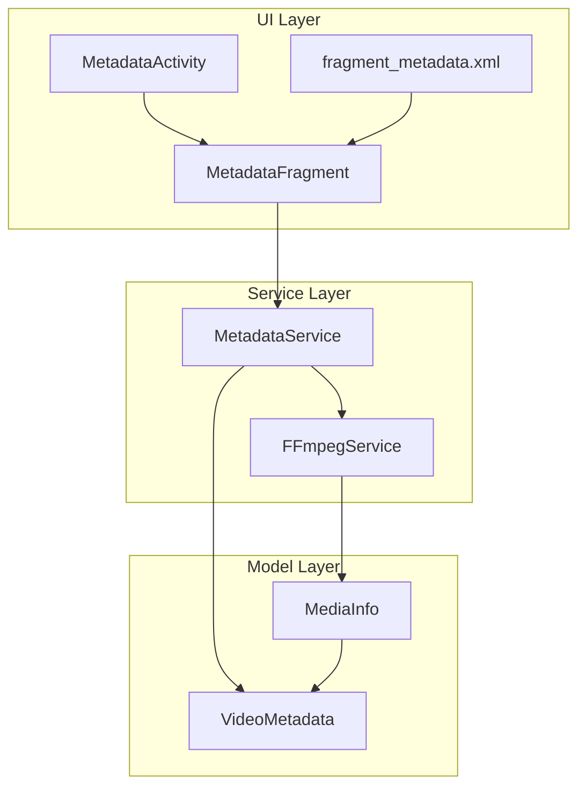
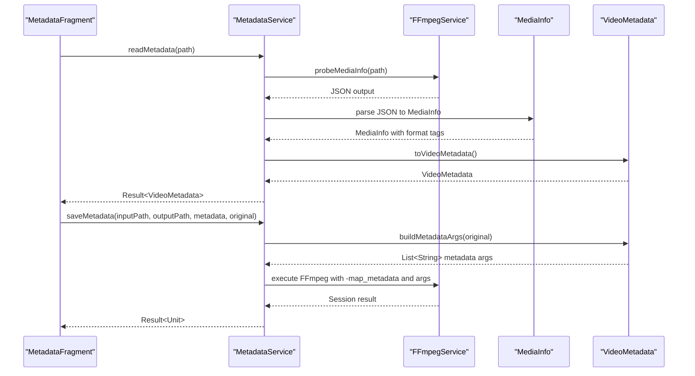
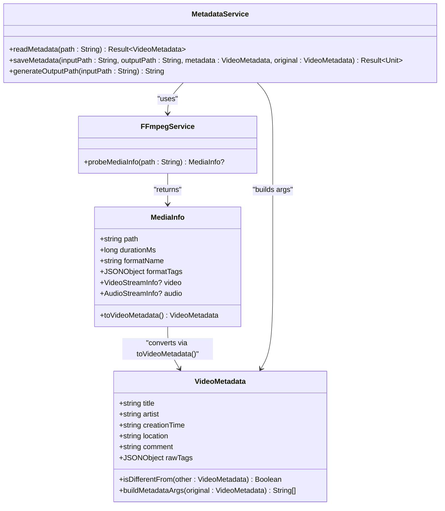
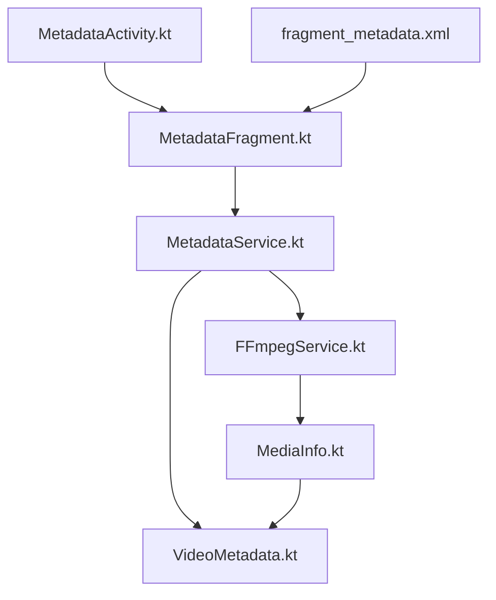

# Video Metadata Model

<cite>
**Referenced Files in This Document**
- [VideoMetadata.kt](file://app/src/main/java/com/pisces312/streamclip/model/VideoMetadata.kt)
- [MediaInfo.kt](file://app/src/main/java/com/pisces312/streamclip/model/MediaInfo.kt)
- [FFmpegService.kt](file://app/src/main/java/com/pisces312/streamclip/service/FFmpegService.kt)
- [MetadataService.kt](file://app/src/main/java/com/pisces312/streamclip/service/MetadataService.kt)
- [MetadataFragment.kt](file://app/src/main/java/com/pisces312/streamclip/fragment/MetadataFragment.kt)
- [MetadataActivity.kt](file://app/src/main/java/com/pisces312/streamclip/ui/MetadataActivity.kt)
- [fragment_metadata.xml](file://app/src/main/res/layout/fragment_metadata.xml)
</cite>

## Table of Contents
1. [Introduction](#introduction)
2. [Project Structure](#project-structure)
3. [Core Components](#core-components)
4. [Architecture Overview](#architecture-overview)
5. [Detailed Component Analysis](#detailed-component-analysis)
6. [Dependency Analysis](#dependency-analysis)
7. [Performance Considerations](#performance-considerations)
8. [Troubleshooting Guide](#troubleshooting-guide)
9. [Conclusion](#conclusion)

## Introduction
This document provides comprehensive technical documentation for StreamClip's VideoMetadata class, focusing on GPS and EXIF data handling for video files. It covers metadata extraction and modification capabilities, including location tagging, creation time handling, and format tag management. The documentation explains the fromTags factory method, tag parsing mechanisms, and metadata validation rules. It also details integration with FFmpegKit for automatic metadata extraction and manual metadata editing workflows, including examples of GPS coordinate handling, time zone considerations, and metadata preservation during video processing operations. Additionally, it addresses format compatibility, tag standard compliance, edge cases in metadata handling, and performance considerations for large metadata objects.

## Project Structure
The metadata system is organized around three primary layers:
- Model Layer: Defines data structures for video metadata and media information.
- Service Layer: Provides FFmpeg-based extraction and modification operations.
- UI Layer: Offers a user interface for selecting videos, viewing/editing metadata, and saving changes.

**Diagram sources**
- [MetadataFragment.kt:26-224](file://app/src/main/java/com/pisces312/streamclip/fragment/MetadataFragment.kt#L26-L224)
- [MetadataActivity.kt:12-36](file://app/src/main/java/com/pisces312/streamclip/ui/MetadataActivity.kt#L12-L36)
- [fragment_metadata.xml:1-225](file://app/src/main/res/layout/fragment_metadata.xml#L1-L225)
- [MetadataService.kt:10-92](file://app/src/main/java/com/pisces312/streamclip/service/MetadataService.kt#L10-L92)
- [FFmpegService.kt:56-147](file://app/src/main/java/com/pisces312/streamclip/service/FFmpegService.kt#L56-L147)
- [VideoMetadata.kt:5-55](file://app/src/main/java/com/pisces312/streamclip/model/VideoMetadata.kt#L5-L55)
- [MediaInfo.kt:5-144](file://app/src/main/java/com/pisces312/streamclip/model/MediaInfo.kt#L5-L144)

**Section sources**
- [VideoMetadata.kt:1-56](file://app/src/main/java/com/pisces312/streamclip/model/VideoMetadata.kt#L1-L56)
- [MediaInfo.kt:1-165](file://app/src/main/java/com/pisces312/streamclip/model/MediaInfo.kt#L1-L165)
- [FFmpegService.kt:1-420](file://app/src/main/java/com/pisces312/streamclip/service/FFmpegService.kt#L1-L420)
- [MetadataService.kt:1-93](file://app/src/main/java/com/pisces312/streamclip/service/MetadataService.kt#L1-L93)
- [MetadataFragment.kt:1-224](file://app/src/main/java/com/pisces312/streamclip/fragment/MetadataFragment.kt#L1-L224)
- [MetadataActivity.kt:1-37](file://app/src/main/java/com/pisces312/streamclip/ui/MetadataActivity.kt#L1-L37)
- [fragment_metadata.xml:1-225](file://app/src/main/res/layout/fragment_metadata.xml#L1-L225)

## Core Components
This section focuses on the VideoMetadata class and its supporting components for GPS and EXIF data handling.

- VideoMetadata: A data class representing editable metadata fields for videos, including title, artist, creation time, location, comment, and raw tags. It provides change detection and FFmpeg argument generation for selective updates.
- MediaInfo: A comprehensive data class that parses FFprobe JSON output to extract format tags, including creation time and location. It exposes convenience accessors for GPS location and integrates with VideoMetadata via a conversion method.
- FFmpegService: Orchestrates FFprobe calls to extract media information and convert it into MediaInfo objects. It supports rotation detection from side data and robust error handling.
- MetadataService: Implements the end-to-end workflow for reading and writing metadata using FFmpegKit. It builds targeted FFmpeg commands to preserve existing metadata while applying only changed fields.

Key capabilities:
- GPS/EXIF location parsing from format tags with fallback logic.
- Creation time extraction from format tags.
- Change detection to minimize unnecessary FFmpeg operations.
- Lossless metadata preservation during video processing via -map_metadata.

**Section sources**
- [VideoMetadata.kt:5-55](file://app/src/main/java/com/pisces312/streamclip/model/VideoMetadata.kt#L5-L55)
- [MediaInfo.kt:5-144](file://app/src/main/java/com/pisces312/streamclip/model/MediaInfo.kt#L5-L144)
- [FFmpegService.kt:56-147](file://app/src/main/java/com/pisces312/streamclip/service/FFmpegService.kt#L56-L147)
- [MetadataService.kt:10-92](file://app/src/main/java/com/pisces312/streamclip/service/MetadataService.kt#L10-L92)

## Architecture Overview
The metadata architecture follows a layered design with clear separation of concerns:
- UI Layer: Presents metadata fields and handles user interactions.
- Service Layer: Performs FFmpeg-based operations and manages command construction.
- Model Layer: Encapsulates data structures and parsing logic.

**Diagram sources**
- [MetadataFragment.kt:96-113](file://app/src/main/java/com/pisces312/streamclip/fragment/MetadataFragment.kt#L96-L113)
- [MetadataService.kt:15-67](file://app/src/main/java/com/pisces312/streamclip/service/MetadataService.kt#L15-L67)
- [FFmpegService.kt:56-147](file://app/src/main/java/com/pisces312/streamclip/service/FFmpegService.kt#L56-L147)
- [MediaInfo.kt:142-144](file://app/src/main/java/com/pisces312/streamclip/model/MediaInfo.kt#L142-L144)
- [VideoMetadata.kt:22-41](file://app/src/main/java/com/pisces312/streamclip/model/VideoMetadata.kt#L22-L41)

## Detailed Component Analysis

### VideoMetadata Class
The VideoMetadata class encapsulates editable metadata fields and provides:
- Field comparison via isDifferentFrom to detect changes.
- FFmpeg argument generation via buildMetadataArgs to apply only modified fields.
- Factory method fromTags to construct instances from parsed JSON tags.

Implementation highlights:
- Location field uses FFmpeg format "+latitude+longitude/".
- Raw tags are preserved for downstream processing and sidecar file generation.
- Change detection ensures minimal command construction and avoids redundant writes.

**Diagram sources**
- [VideoMetadata.kt:5-55](file://app/src/main/java/com/pisces312/streamclip/model/VideoMetadata.kt#L5-L55)
- [MediaInfo.kt:5-144](file://app/src/main/java/com/pisces312/streamclip/model/MediaInfo.kt#L5-L144)
- [MetadataService.kt:10-92](file://app/src/main/java/com/pisces312/streamclip/service/MetadataService.kt#L10-L92)
- [FFmpegService.kt:56-147](file://app/src/main/java/com/pisces312/streamclip/service/FFmpegService.kt#L56-L147)

**Section sources**
- [VideoMetadata.kt:5-55](file://app/src/main/java/com/pisces312/streamclip/model/VideoMetadata.kt#L5-L55)

### MediaInfo and Tag Parsing
MediaInfo parses FFprobe JSON output to extract:
- Format tags including creation_time and location.
- Video and audio stream details with rotation detection from side_data.
- Convenience accessors for GPS location with fallback logic.

Parsing mechanisms:
- Creation time is extracted from formatTags.optString("creation_time").
- Location is prioritized from "location" and falls back to "location-eng".
- Rotation is parsed from stream side_data for accurate orientation handling.

Integration with VideoMetadata:
- MediaInfo exposes toVideoMetadata() to convert parsed tags into VideoMetadata instances.

**Section sources**
- [MediaInfo.kt:5-144](file://app/src/main/java/com/pisces312/streamclip/model/MediaInfo.kt#L5-L144)
- [FFmpegService.kt:56-147](file://app/src/main/java/com/pisces312/streamclip/service/FFmpegService.kt#L56-L147)

### MetadataService Workflow
MetadataService coordinates metadata operations:
- readMetadata: Executes FFprobe, parses JSON, converts to VideoMetadata, and logs results.
- saveMetadata: Builds targeted FFmpeg commands with -map_metadata to preserve existing tags while applying only changed fields.
- generateOutputPath: Creates output file names with a deterministic suffix pattern.

Command construction:
- Uses -map_metadata 0 to inherit metadata from the input file.
- Applies only changed fields via buildMetadataArgs to minimize overhead.
- Employs -c copy for lossless modifications.

**Section sources**
- [MetadataService.kt:10-92](file://app/src/main/java/com/pisces312/streamclip/service/MetadataService.kt#L10-L92)

### UI Integration and Manual Editing
The UI layer provides:
- MetadataActivity for external intents to open metadata editing.
- MetadataFragment for selecting videos, displaying metadata fields, and saving changes.
- Layout definition for metadata fields including GPS location and creation time.

Manual editing workflow:
- Users select a video, and the app reads metadata asynchronously.
- Editable fields are populated into EditText components.
- Changes are validated via isDifferentFrom; save button enables only when differences exist.
- On save, MetadataService constructs and executes FFmpeg commands with -map_metadata.

**Section sources**
- [MetadataActivity.kt:12-36](file://app/src/main/java/com/pisces312/streamclip/ui/MetadataActivity.kt#L12-L36)
- [MetadataFragment.kt:26-224](file://app/src/main/java/com/pisces312/streamclip/fragment/MetadataFragment.kt#L26-L224)
- [fragment_metadata.xml:1-225](file://app/src/main/res/layout/fragment_metadata.xml#L1-L225)

### GPS Coordinate Handling and Time Zone Considerations
GPS location handling:
- Location format follows FFmpeg convention "+latitude+longitude/".
- MediaInfo provides convenience accessors with fallback from "location" to "location-eng".
- UI hints guide users to use the expected format.

Time zone considerations:
- Creation time is stored as-is from format tags; no automatic time zone conversion occurs.
- The hint indicates ISO-like formatting for creation time.
- Date handling utilities exist elsewhere in the codebase for file timestamps, but metadata creation time is treated as a string.

**Section sources**
- [VideoMetadata.kt:9-9](file://app/src/main/java/com/pisces312/streamclip/model/VideoMetadata.kt#L9-L9)
- [MediaInfo.kt:33-35](file://app/src/main/java/com/pisces312/streamclip/model/MediaInfo.kt#L33-L35)
- [fragment_metadata.xml:119-130](file://app/src/main/res/layout/fragment_metadata.xml#L119-L130)

### Metadata Preservation During Processing
Preservation mechanisms:
- FFmpeg commands consistently use -map_metadata 0 to retain existing metadata.
- buildMetadataArgs generates only changed fields, avoiding overwrite of unchanged tags.
- Sidecar file approach is supported for complex scenarios, enabling precise tag application.

Compatibility:
- Commands preserve video/audio codecs and other stream attributes during lossless operations.

**Section sources**
- [MetadataService.kt:46-51](file://app/src/main/java/com/pisces312/streamclip/service/MetadataService.kt#L46-L51)
- [VideoMetadata.kt:22-41](file://app/src/main/java/com/pisces312/streamclip/model/VideoMetadata.kt#L22-L41)

### Format Compatibility and Tag Standard Compliance
Format compatibility:
- FFprobe JSON parsing supports various containers and stream configurations.
- Rotation is detected from side_data for accurate orientation handling.

Tag standard compliance:
- Uses standard FFmpeg format tags for creation_time and location.
- Ensures backward compatibility by preserving unknown tags via -map_metadata.

**Section sources**
- [FFmpegService.kt:56-147](file://app/src/main/java/com/pisces312/streamclip/service/FFmpegService.kt#L56-L147)
- [MediaInfo.kt:33-35](file://app/src/main/java/com/pisces312/streamclip/model/MediaInfo.kt#L33-L35)

### Edge Cases in Metadata Handling
Common edge cases:
- Empty or missing creation_time or location tags are handled gracefully via optString with empty defaults.
- No changes detected results in early termination of save operations.
- FFprobe failures return structured errors to the UI layer.
- Large metadata objects are represented as JSON objects; memory footprint depends on tag count and string lengths.

Validation rules:
- isDifferentFrom compares only editable fields; rawTags are not considered for equality checks.
- buildMetadataArgs produces empty lists when no fields differ, preventing unnecessary FFmpeg invocations.

**Section sources**
- [VideoMetadata.kt:13-20](file://app/src/main/java/com/pisces312/streamclip/model/VideoMetadata.kt#L13-L20)
- [VideoMetadata.kt:22-41](file://app/src/main/java/com/pisces312/streamclip/model/VideoMetadata.kt#L22-L41)
- [MetadataService.kt:41-44](file://app/src/main/java/com/pisces312/streamclip/service/MetadataService.kt#L41-L44)

## Dependency Analysis
The following diagram illustrates dependencies among components:

**Diagram sources**
- [VideoMetadata.kt:5-55](file://app/src/main/java/com/pisces312/streamclip/model/VideoMetadata.kt#L5-L55)
- [MediaInfo.kt:5-144](file://app/src/main/java/com/pisces312/streamclip/model/MediaInfo.kt#L5-L144)
- [FFmpegService.kt:56-147](file://app/src/main/java/com/pisces312/streamclip/service/FFmpegService.kt#L56-L147)
- [MetadataService.kt:10-92](file://app/src/main/java/com/pisces312/streamclip/service/MetadataService.kt#L10-L92)
- [MetadataFragment.kt:26-224](file://app/src/main/java/com/pisces312/streamclip/fragment/MetadataFragment.kt#L26-L224)
- [MetadataActivity.kt:12-36](file://app/src/main/java/com/pisces312/streamclip/ui/MetadataActivity.kt#L12-L36)
- [fragment_metadata.xml:1-225](file://app/src/main/res/layout/fragment_metadata.xml#L1-L225)

**Section sources**
- [VideoMetadata.kt:1-56](file://app/src/main/java/com/pisces312/streamclip/model/VideoMetadata.kt#L1-L56)
- [MediaInfo.kt:1-165](file://app/src/main/java/com/pisces312/streamclip/model/MediaInfo.kt#L1-L165)
- [FFmpegService.kt:1-420](file://app/src/main/java/com/pisces312/streamclip/service/FFmpegService.kt#L1-L420)
- [MetadataService.kt:1-93](file://app/src/main/java/com/pisces312/streamclip/service/MetadataService.kt#L1-L93)
- [MetadataFragment.kt:1-224](file://app/src/main/java/com/pisces312/streamclip/fragment/MetadataFragment.kt#L1-L224)
- [MetadataActivity.kt:1-37](file://app/src/main/java/com/pisces312/streamclip/ui/MetadataActivity.kt#L1-L37)
- [fragment_metadata.xml:1-225](file://app/src/main/res/layout/fragment_metadata.xml#L1-L225)

## Performance Considerations
Performance characteristics and optimization strategies:
- JSON parsing: FFprobe JSON is parsed once per operation; MediaInfo caches parsed fields to avoid repeated lookups.
- Memory optimization: VideoMetadata stores rawTags as a JSONObject; for very large tag sets, consider streaming or limiting tag extraction to essential fields.
- Command efficiency: buildMetadataArgs minimizes FFmpeg argument lists to changed fields, reducing command complexity and execution time.
- Concurrency: MetadataService operations run on IO dispatcher to prevent blocking the main thread.
- Lossless operations: Using -c copy and -map_metadata avoids re-encoding, significantly reducing processing time and preserving quality.

Recommendations:
- Batch operations: Group multiple metadata edits to reduce the number of FFmpeg executions.
- Caching: Reuse MediaInfo instances when performing multiple operations on the same file.
- Validation: Early exit when no changes are detected to avoid unnecessary processing.

[No sources needed since this section provides general guidance]

## Troubleshooting Guide
Common issues and resolutions:
- FFprobe failures: MetadataService.readMetadata returns structured errors; check logs for failure reasons and retry conditions.
- No changes detected: saveMetadata returns failure when buildMetadataArgs produces an empty list; ensure at least one editable field is modified.
- Invalid GPS format: Ensure location follows "+latitude+longitude/" format; otherwise, FFmpeg may reject the input.
- Time zone handling: Creation time is stored as provided; if timezone conversion is required, handle it at the application level before setting the field.
- Permission issues: Access to file paths must be granted; UI displays user-friendly messages on failures.

**Section sources**
- [MetadataService.kt:15-28](file://app/src/main/java/com/pisces312/streamclip/service/MetadataService.kt#L15-L28)
- [MetadataService.kt:41-44](file://app/src/main/java/com/pisces312/streamclip/service/MetadataService.kt#L41-L44)
- [fragment_metadata.xml:132-152](file://app/src/main/res/layout/fragment_metadata.xml#L132-L152)

## Conclusion
StreamClip's VideoMetadata model provides a robust foundation for GPS and EXIF data handling in video files. By leveraging FFmpegKit for metadata extraction and targeted FFmpeg commands for preservation and modification, the system ensures compatibility, performance, and user control. The layered architecture separates concerns effectively, enabling maintainable enhancements and reliable operations across diverse video formats and metadata scenarios.