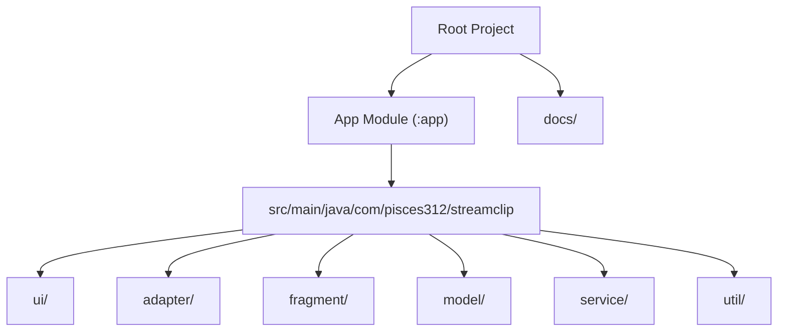
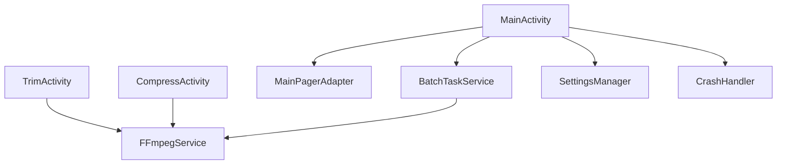
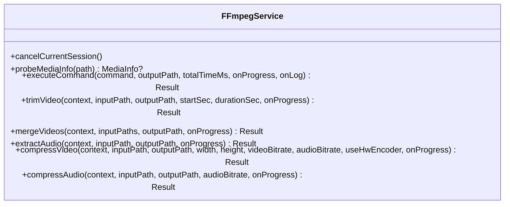
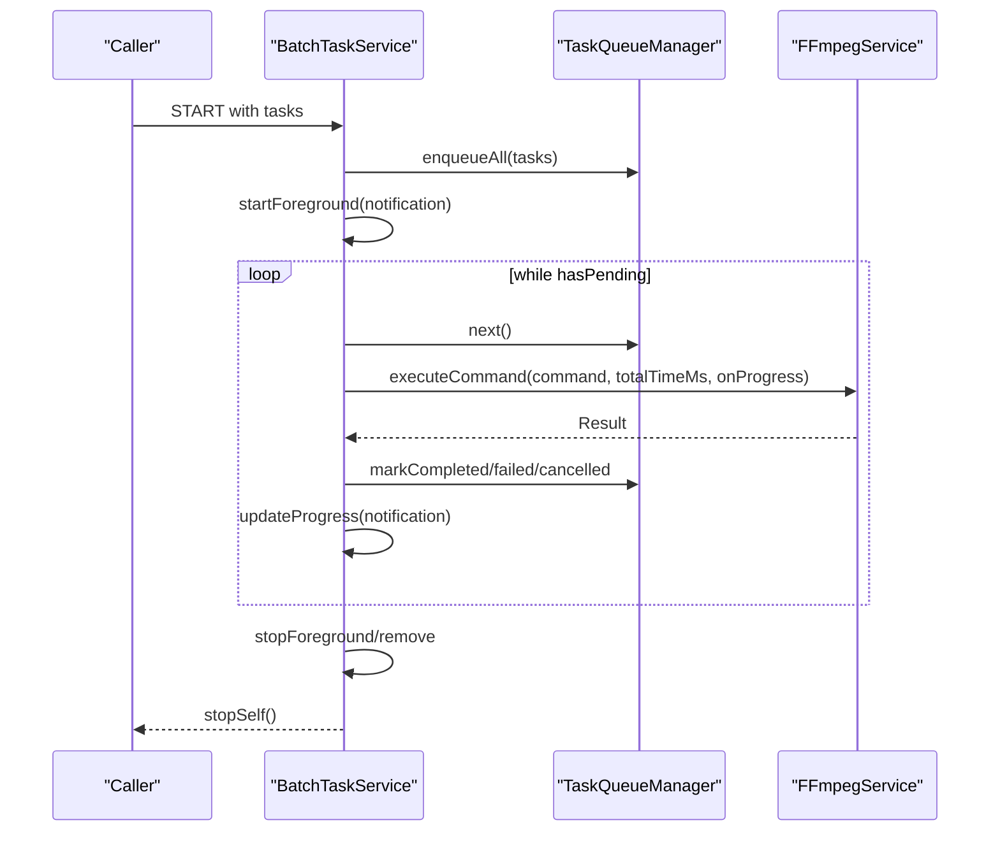
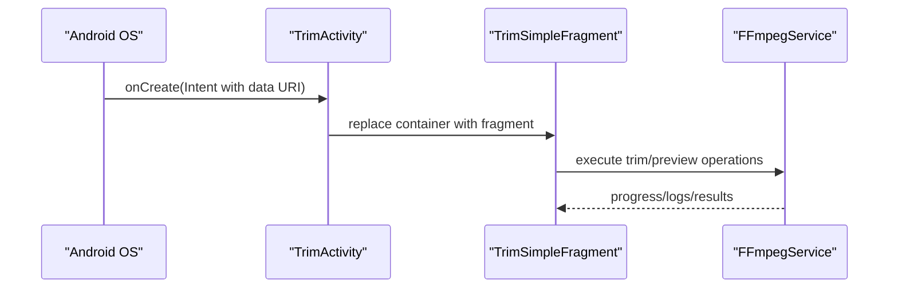
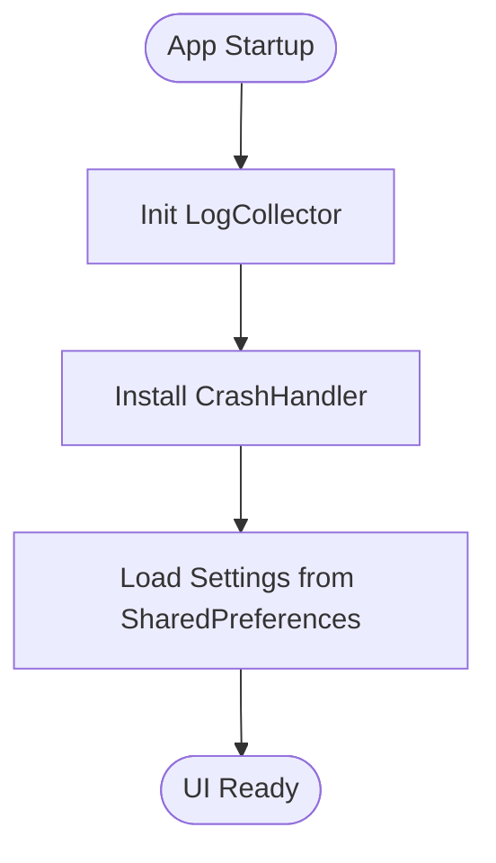
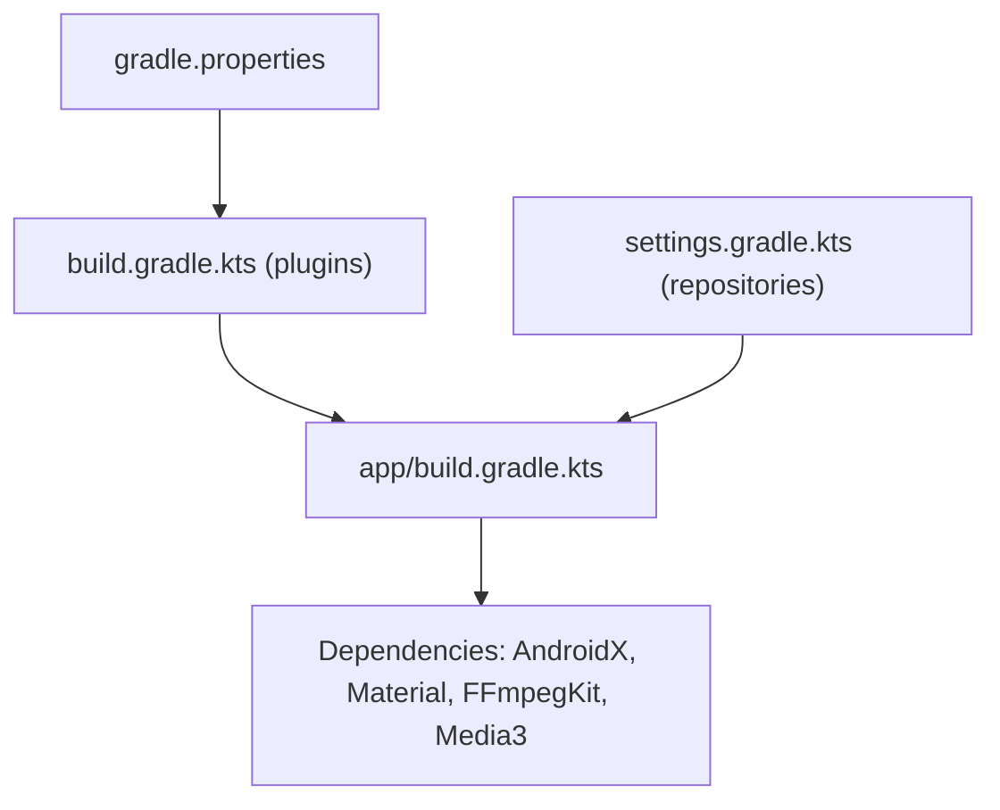

# Development Guidelines

<cite>
**Referenced Files in This Document**
- [README.md](file://README.md)
- [build.gradle.kts](file://build.gradle.kts)
- [app/build.gradle.kts](file://app/build.gradle.kts)
- [settings.gradle.kts](file://settings.gradle.kts)
- [gradle.properties](file://gradle.properties)
- [MainActivity.kt](file://app/src/main/java/com/pisces312/streamclip/MainActivity.kt)
- [BaseActivity.kt](file://app/src/main/java/com/pisces312/streamclip/BaseActivity.kt)
- [FFmpegService.kt](file://app/src/main/java/com/pisces312/streamclip/service/FFmpegService.kt)
- [BatchTaskService.kt](file://app/src/main/java/com/pisces312/streamclip/service/BatchTaskService.kt)
- [MainPagerAdapter.kt](file://app/src/main/java/com/pisces312/streamclip/adapter/MainPagerAdapter.kt)
- [SettingsManager.kt](file://app/src/main/java/com/pisces312/streamclip/util/SettingsManager.kt)
- [CrashHandler.kt](file://app/src/main/java/com/pisces312/streamclip/util/CrashHandler.kt)
- [TrimActivity.kt](file://app/src/main/java/com/pisces312/streamclip/ui/TrimActivity.kt)
- [CompressActivity.kt](file://app/src/main/java/com/pisces312/streamclip/ui/CompressActivity.kt)
- [TaskConfig.kt](file://app/src/main/java/com/pisces312/streamclip/model/TaskConfig.kt)
- [batch-queue-design.md](file://docs/batch-queue-design.md)
- [ffmpeg-kit-migration-plan.md](file://docs/ffmpeg-kit-migration-plan.md)
- [capture-native-crash-log.md](file://docs/capture-native-crash-log.md)
- [ffmpeg-8.1-consecutive-crash-analysis.md](file://docs/ffmpeg-8.1-consecutive-crash-analysis.md)
- [ffmpeg-kit-8.1-double-execute-crash.md](file://docs/ffmpeg-kit-8.1-double-execute-crash.md)
- [swresample-crash-analysis.md](file://docs/swresample-crash-analysis.md)
- [resolution-design.md](file://docs/resolution-design.md)
- [superpowers/plans/2026-05-09-compress-video-info-display.md](file://docs/superpowers/plans/2026-05-09-compress-video-info-display.md)
- [superpowers/specs/2026-05-09-compress-video-info-display-design.md](file://docs/superpowers/specs/2026-05-09-compress-video-info-display-design.md)
</cite>

## Table of Contents
1. [Introduction](#introduction)
2. [Project Structure](#project-structure)
3. [Core Components](#core-components)
4. [Architecture Overview](#architecture-overview)
5. [Detailed Component Analysis](#detailed-component-analysis)
6. [Dependency Analysis](#dependency-analysis)
7. [Performance Considerations](#performance-considerations)
8. [Testing Requirements and Coverage](#testing-requirements-and-coverage)
9. [Pull Request Processes and Review Criteria](#pull-request-processes-and-review-criteria)
10. [Issue Reporting Procedures](#issue-reporting-procedures)
11. [Code Style and Formatting Standards](#code-style-and-formatting-standards)
12. [Extending Functionality and Adding Operations](#extending-functionality-and-adding-operations)
13. [Third-Party Library Integration Guidelines](#third-party-library-integration-guidelines)
14. [Roadmap, Feature Planning, and Evolution Strategies](#roadmap-feature-planning-and-evolution-strategies)
15. [Code Review Practices and Documentation Requirements](#code-review-practices-and-documentation-requirements)
16. [Community Contribution Guidelines](#community-contribution-guidelines)
17. [Debugging Techniques and Troubleshooting](#debugging-techniques-and-troubleshooting)
18. [Maintaining Backward Compatibility](#maintaining-backward-compatibility)
19. [Conclusion](#conclusion)

## Introduction
This document defines development guidelines for StreamClip, an Android video processing app built on FFmpeg. It consolidates contributing standards, code organization principles, architectural practices, testing expectations, and maintenance procedures. The guidelines aim to ensure consistent, reliable, and extensible development across features, batch processing, and integrations with FFmpegKit.

## Project Structure
StreamClip follows a feature-based module layout with a primary Android application module and a dedicated docs directory for design specs and operational notes. The app module is organized by packages for UI, adapters, services, models, and utilities. Build configuration is centralized in Gradle Kotlin DSL files at root and module level.

**Diagram sources**
- [app/build.gradle.kts:1-85](file://app/build.gradle.kts#L1-L85)
- [settings.gradle.kts:21-23](file://settings.gradle.kts#L21-L23)

**Section sources**
- [app/build.gradle.kts:1-85](file://app/build.gradle.kts#L1-L85)
- [settings.gradle.kts:1-23](file://settings.gradle.kts#L1-L23)
- [gradle.properties:1-5](file://gradle.properties#L1-L5)

## Core Components
- UI Layer: Activities and Fragments manage user interactions and navigation. External Intent handling enables opening videos directly for trimming or compression.
- Service Layer: FFmpegService encapsulates FFmpegKit execution, progress callbacks, and media probing. BatchTaskService orchestrates queueing, retries, notifications, and per-task cancellation.
- Utilities: SettingsManager centralizes preferences and cache management; CrashHandler installs a global uncaught exception handler.
- Adapters and Models: MainPagerAdapter maps tab identifiers to fragments; TaskConfig and related models define task execution parameters.

Key responsibilities and integration points:
- Activities initialize logging and crash handlers, set up permission flows, and present dialogs for help, about, and licenses.
- Services coordinate long-running operations, maintain progress, and update notifications.
- Utilities provide cross-cutting concerns like localization, settings persistence, and crash log collection.

**Section sources**
- [MainActivity.kt:1-505](file://app/src/main/java/com/pisces312/streamclip/MainActivity.kt#L1-L505)
- [BaseActivity.kt:1-14](file://app/src/main/java/com/pisces312/streamclip/BaseActivity.kt#L1-L14)
- [FFmpegService.kt:1-420](file://app/src/main/java/com/pisces312/streamclip/service/FFmpegService.kt#L1-L420)
- [BatchTaskService.kt:1-301](file://app/src/main/java/com/pisces312/streamclip/service/BatchTaskService.kt#L1-L301)
- [MainPagerAdapter.kt:1-40](file://app/src/main/java/com/pisces312/streamclip/adapter/MainPagerAdapter.kt#L1-L40)
- [SettingsManager.kt:1-208](file://app/src/main/java/com/pisces312/streamclip/util/SettingsManager.kt#L1-L208)
- [CrashHandler.kt:1-29](file://app/src/main/java/com/pisces312/streamclip/util/CrashHandler.kt#L1-L29)
- [TrimActivity.kt:1-37](file://app/src/main/java/com/pisces312/streamclip/ui/TrimActivity.kt#L1-L37)
- [CompressActivity.kt:1-37](file://app/src/main/java/com/pisces312/streamclip/ui/CompressActivity.kt#L1-L37)
- [TaskConfig.kt:1-15](file://app/src/main/java/com/pisces312/streamclip/model/TaskConfig.kt#L1-L15)

## Architecture Overview
StreamClip employs a layered architecture:
- Presentation: Activities and Fragments driven by ViewPager2 and TabLayout.
- Domain/Service: FFmpegService and BatchTaskService orchestrate media operations and batch execution.
- Persistence/Preferences: SettingsManager manages user preferences and cache.
- Utilities: Logging, crash handling, and localization helpers.

**Diagram sources**
- [MainActivity.kt:26-131](file://app/src/main/java/com/pisces312/streamclip/MainActivity.kt#L26-L131)
- [MainPagerAdapter.kt:17-39](file://app/src/main/java/com/pisces312/streamclip/adapter/MainPagerAdapter.kt#L17-L39)
- [FFmpegService.kt:19-420](file://app/src/main/java/com/pisces312/streamclip/service/FFmpegService.kt#L19-L420)
- [BatchTaskService.kt:26-301](file://app/src/main/java/com/pisces312/streamclip/service/BatchTaskService.kt#L26-L301)
- [SettingsManager.kt:6-208](file://app/src/main/java/com/pisces312/streamclip/util/SettingsManager.kt#L6-L208)
- [CrashHandler.kt:10-29](file://app/src/main/java/com/pisces312/streamclip/util/CrashHandler.kt#L10-L29)
- [TrimActivity.kt:12-36](file://app/src/main/java/com/pisces312/streamclip/ui/TrimActivity.kt#L12-L36)
- [CompressActivity.kt:12-36](file://app/src/main/java/com/pisces312/streamclip/ui/CompressActivity.kt#L12-L36)

## Detailed Component Analysis

### FFmpegService
FFmpegService is the central executor for media operations:
- Media probing via FFprobeKit to extract format and stream metadata.
- Asynchronous execution via FFmpegKit with progress and log callbacks.
- Built-in commands for trim, merge, extract, and compression with hardware/software encoder selection.
- Session cancellation and robust error handling.

**Diagram sources**
- [FFmpegService.kt:19-420](file://app/src/main/java/com/pisces312/streamclip/service/FFmpegService.kt#L19-L420)

**Section sources**
- [FFmpegService.kt:19-420](file://app/src/main/java/com/pisces312/streamclip/service/FFmpegService.kt#L19-L420)

### BatchTaskService
BatchTaskService runs tasks in the foreground with notifications, supports pause/resume, per-task cancellation, and retry logic. It integrates with TaskQueueManager and updates progress and notifications.

**Diagram sources**
- [BatchTaskService.kt:92-165](file://app/src/main/java/com/pisces312/streamclip/service/BatchTaskService.kt#L92-L165)
- [BatchTaskService.kt:181-240](file://app/src/main/java/com/pisces312/streamclip/service/BatchTaskService.kt#L181-L240)
- [FFmpegService.kt:152-241](file://app/src/main/java/com/pisces312/streamclip/service/FFmpegService.kt#L152-L241)

**Section sources**
- [BatchTaskService.kt:26-301](file://app/src/main/java/com/pisces312/streamclip/service/BatchTaskService.kt#L26-L301)

### UI Activities and External Intents
Activities for trimming and compressing accept external video URIs and pass them to their respective fragments, enabling “Open with” workflows.

**Diagram sources**
- [TrimActivity.kt:14-31](file://app/src/main/java/com/pisces312/streamclip/ui/TrimActivity.kt#L14-L31)
- [CompressActivity.kt:14-31](file://app/src/main/java/com/pisces312/streamclip/ui/CompressActivity.kt#L14-L31)
- [FFmpegService.kt:246-272](file://app/src/main/java/com/pisces312/streamclip/service/FFmpegService.kt#L246-L272)

**Section sources**
- [TrimActivity.kt:1-37](file://app/src/main/java/com/pisces312/streamclip/ui/TrimActivity.kt#L1-L37)
- [CompressActivity.kt:1-37](file://app/src/main/java/com/pisces312/streamclip/ui/CompressActivity.kt#L1-L37)

### Settings and Crash Handling
SettingsManager persists user preferences and computes derived values like output directories and formatted sizes. CrashHandler installs a global exception handler to save logs and exit gracefully.

**Diagram sources**
- [MainActivity.kt:38-41](file://app/src/main/java/com/pisces312/streamclip/MainActivity.kt#L38-L41)
- [CrashHandler.kt:14-27](file://app/src/main/java/com/pisces312/streamclip/util/CrashHandler.kt#L14-L27)
- [SettingsManager.kt:15-92](file://app/src/main/java/com/pisces312/streamclip/util/SettingsManager.kt#L15-L92)

**Section sources**
- [SettingsManager.kt:1-208](file://app/src/main/java/com/pisces312/streamclip/util/SettingsManager.kt#L1-L208)
- [CrashHandler.kt:1-29](file://app/src/main/java/com/pisces312/streamclip/util/CrashHandler.kt#L1-L29)

## Dependency Analysis
Build-time dependencies include AndroidX libraries, Material Design components, FFmpegKit AAR, and Media3 for preview. The project uses Gradle Kotlin DSL and centralized plugin management.

**Diagram sources**
- [gradle.properties:1-5](file://gradle.properties#L1-L5)
- [build.gradle.kts:1-5](file://build.gradle.kts#L1-L5)
- [app/build.gradle.kts:64-84](file://app/build.gradle.kts#L64-L84)
- [settings.gradle.kts:9-19](file://settings.gradle.kts#L9-L19)

**Section sources**
- [app/build.gradle.kts:1-85](file://app/build.gradle.kts#L1-L85)
- [settings.gradle.kts:1-23](file://settings.gradle.kts#L1-L23)
- [gradle.properties:1-5](file://gradle.properties#L1-L5)

## Performance Considerations
- Prefer lossless operations where possible (e.g., trim/merge with stream copy) to minimize CPU and preserve quality.
- Use hardware encoders when available; fall back to software encoders for compatibility.
- Monitor and cap memory usage during batch processing; avoid loading large media into memory unnecessarily.
- Keep UI responsive by offloading work to IO dispatcher and updating progress on main thread only for UI updates.
- Minimize repeated probing by caching MediaInfo where appropriate.

## Testing Requirements and Coverage
- Unit tests for utility functions (e.g., SettingsManager helpers, filename generation).
- Instrumented tests for Activities and Fragments focusing on lifecycle, permission flows, and UI interactions.
- Integration tests for FFmpegService operations (command building, progress callbacks, error propagation).
- Batch processing tests covering queueing, retries, cancellation, and notification updates.
- Regression tests for known FFmpegKit issues documented in docs.

[No sources needed since this section provides general guidance]

## Pull Request Processes and Review Criteria
- Branch naming: feature/short-description, bugfix/short-description, chore/short-description.
- Commit messages: present tense, concise, scoped; reference issues/PRs.
- PR checklist:
  - All checks pass (CI builds, lint, tests).
  - New features include unit/integration tests.
  - Changes documented in docs or release notes where applicable.
  - No hardcoded strings; use resource files for UI text.
  - Follow existing code style and architectural patterns.
- Review criteria:
  - Correctness and completeness of functionality.
  - Performance impact and resource usage.
  - Backward compatibility and migration notes.
  - Security and privacy considerations (e.g., file access permissions).

[No sources needed since this section provides general guidance]

## Issue Reporting Procedures
- Use the repository’s issue templates when available.
- Provide environment details: Android version, device model, FFmpegKit version.
- Include reproducible steps, expected vs. actual behavior, and logs if possible.
- For crashes, attach crash logs collected via the app’s logging mechanism.

[No sources needed since this section provides general guidance]

## Code Style and Formatting Standards
- Kotlin official style enforced via Gradle property.
- Naming conventions:
  - Classes: PascalCase (e.g., MainActivity).
  - Functions/Variables: camelCase (e.g., executeCommand).
  - Constants: UPPER_SNAKE_CASE (e.g., ACTION_START).
- Package naming: com.pisces312.streamclip.<layer>.<name>.
- Imports: sorted alphabetically; wildcard imports discouraged.
- Formatting: rely on IDE/Kotlin formatter; keep lines under 120 characters where feasible.
- Comments: explain “why,” not “what”; keep public APIs documented.

**Section sources**
- [gradle.properties:4](file://gradle.properties#L4)

## Extending Functionality and Adding Operations
- Define a new fragment under fragment/ and add its identifier to the tab order list.
- Add a new method in FFmpegService for the operation, returning Result and accepting progress/log callbacks.
- Wire the fragment to call FFmpegService and update UI with progress.
- For batch processing, add a new TaskType and integrate with BatchTaskService command builder.
- Preserve metadata when applicable (e.g., map_metadata) and handle edge cases (e.g., missing streams).
- Update MainActivity tab mapping and icons accordingly.

**Section sources**
- [MainPagerAdapter.kt:24-38](file://app/src/main/java/com/pisces312/streamclip/adapter/MainPagerAdapter.kt#L24-L38)
- [FFmpegService.kt:246-418](file://app/src/main/java/com/pisces312/streamclip/service/FFmpegService.kt#L246-L418)
- [BatchTaskService.kt:184-192](file://app/src/main/java/com/pisces312/streamclip/service/BatchTaskService.kt#L184-L192)
- [MainActivity.kt:103-115](file://app/src/main/java/com/pisces312/streamclip/MainActivity.kt#L103-L115)

## Third-Party Library Integration Guidelines
- FFmpegKit: Use the provided AAR; ensure consistent version across architectures; test on multiple devices.
- Media3: Use for preview UI; keep versions aligned with app’s compile/target SDK.
- DocumentFile: Use for SAF access; handle nullable URIs and permissions.
- Dependencies: Centralize in app/build.gradle.kts; avoid duplicating versions; verify licenses.
- ProGuard/R8: Keep rules minimal; test release builds after changes.

**Section sources**
- [app/build.gradle.kts:74-84](file://app/build.gradle.kts#L74-L84)

## Roadmap, Feature Planning, and Evolution Strategies
- Feature planning documents outline future enhancements and designs.
- Migration plans address library upgrades (e.g., FFmpegKit) and stability improvements.
- Resolution and design docs guide UI/UX decisions for video operations.
- Superpowers plans/specs track detailed feature intents and acceptance criteria.

**Section sources**
- [superpowers/plans/2026-05-09-compress-video-info-display.md](file://docs/superpowers/plans/2026-05-09-compress-video-info-display.md)
- [superpowers/specs/2026-05-09-compress-video-info-display-design.md](file://docs/superpowers/specs/2026-05-09-compress-video-info-display-design.md)
- [ffmpeg-kit-migration-plan.md](file://docs/ffmpeg-kit-migration-plan.md)
- [resolution-design.md](file://docs/resolution-design.md)

## Code Review Practices and Documentation Requirements
- Every change should include:
  - Updated unit/integration tests.
  - Inline comments for complex logic.
  - Public API documentation for new functions/classes.
  - Release notes entries for user-visible changes.
- Review focus areas:
  - Error handling and cancellation semantics.
  - Resource cleanup and file I/O safety.
  - Localization and accessibility compliance.
  - Security posture (e.g., file path sanitization, permission checks).

[No sources needed since this section provides general guidance]

## Community Contribution Guidelines
- Fork and branch from the latest main.
- Follow commit and PR standards outlined above.
- Engage respectfully in discussions; provide reproduction steps for bug reports.
- Acknowledge licensing obligations (GPL-3.0) for FFmpeg-related components.

[No sources needed since this section provides general guidance]

## Debugging Techniques and Troubleshooting
- Use LogCollector to capture runtime logs and crash logs.
- Reproduce issues with documented FFmpegKit crash analyses and native crash capture scripts.
- Validate media probing results and command construction before execution.
- For batch failures, inspect TaskQueueManager state and per-task logs.

**Section sources**
- [capture-native-crash-log.md](file://docs/capture-native-crash-log.md)
- [ffmpeg-8.1-consecutive-crash-analysis.md](file://docs/ffmpeg-8.1-consecutive-crash-analysis.md)
- [ffmpeg-kit-8.1-double-execute-crash.md](file://docs/ffmpeg-kit-8.1-double-execute-crash.md)
- [swresample-crash-analysis.md](file://docs/swresample-crash-analysis.md)

## Maintaining Backward Compatibility
- Avoid breaking changes to public APIs; deprecate old methods before removal.
- Preserve behavior for existing TaskType values and tab identifiers.
- Keep FFmpegKit version aligned across releases; document migration steps.
- Ensure SettingsManager keys remain stable; provide migration logic if renaming is necessary.

[No sources needed since this section provides general guidance]

## Conclusion
These guidelines establish a consistent foundation for developing StreamClip. By adhering to the architectural patterns, testing requirements, and maintenance practices outlined here, contributors can deliver reliable, performant, and user-friendly enhancements while preserving compatibility and quality.