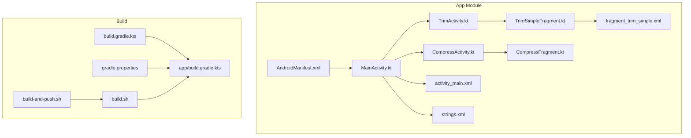
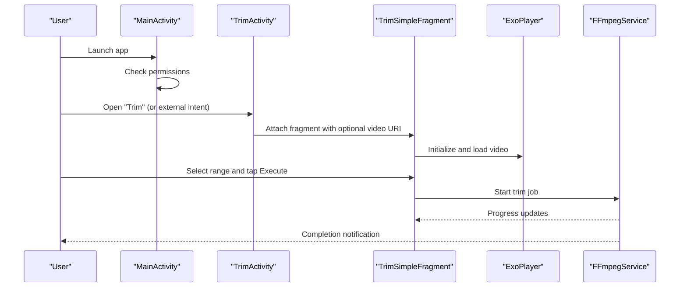
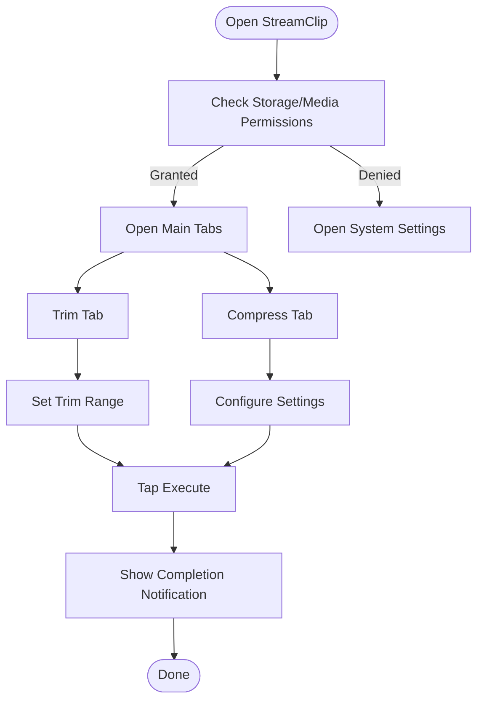
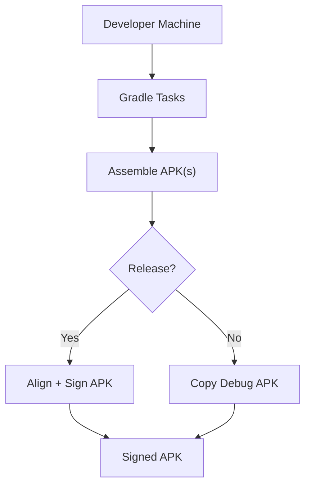

# Getting Started

<cite>
**Referenced Files in This Document**
- [README.md](file://README.md)
- [build.gradle.kts](file://build.gradle.kts)
- [app/build.gradle.kts](file://app/build.gradle.kts)
- [gradle.properties](file://gradle.properties)
- [build.sh](file://build.sh)
- [build-and-push.sh](file://build-and-push.sh)
- [app/src/main/AndroidManifest.xml](file://app/src/main/AndroidManifest.xml)
- [app/src/main/java/com/pisces312/streamclip/MainActivity.kt](file://app/src/main/java/com/pisces312/streamclip/MainActivity.kt)
- [app/src/main/java/com/pisces312/streamclip/ui/TrimActivity.kt](file://app/src/main/java/com/pisces312/streamclip/ui/TrimActivity.kt)
- [app/src/main/java/com/pisces312/streamclip/ui/CompressActivity.kt](file://app/src/main/java/com/pisces312/streamclip/ui/CompressActivity.kt)
- [app/src/main/java/com/pisces312/streamclip/fragment/TrimSimpleFragment.kt](file://app/src/main/java/com/pisces312/streamclip/fragment/TrimSimpleFragment.kt)
- [app/src/main/java/com/pisces312/streamclip/fragment/CompressFragment.kt](file://app/src/main/java/com/pisces312/streamclip/fragment/CompressFragment.kt)
- [app/src/main/res/layout/activity_main.xml](file://app/src/main/res/layout/activity_main.xml)
- [app/src/main/res/layout/fragment_trim_simple.xml](file://app/src/main/res/layout/fragment_trim_simple.xml)
- [app/src/main/res/values/strings.xml](file://app/src/main/res/values/strings.xml)
</cite>

## Table of Contents
1. [Introduction](#introduction)
2. [Project Structure](#project-structure)
3. [Core Components](#core-components)
4. [Architecture Overview](#architecture-overview)
5. [Installation and Setup](#installation-and-setup)
6. [First Run and Permissions](#first-run-and-permissions)
7. [Basic Usage Tutorial](#basic-usage-tutorial)
8. [Build From Source](#build-from-source)
9. [Troubleshooting Guide](#troubleshooting-guide)
10. [Conclusion](#conclusion)

## Introduction
StreamClip is an Android video processing app built on FFmpeg. It enables lossless operations like trimming and merging, plus hardware-accelerated compression with full metadata preservation. The app supports multiple languages, real-time progress, and batch processing.

Key highlights:
- Lossless trim, extract, and merge via stream copying
- Hardware-accelerated H.264/H.265 compression with automatic fallback
- Full metadata retention and anti-sleep during processing
- Multi-language UI and batch queue

**Section sources**
- [README.md:10-85](file://README.md#L10-L85)

## Project Structure
At a high level, the project consists of:
- Android app module with Activities, Fragments, Services, and UI layouts
- FFmpeg integration via a bundled AAR
- Build scripts for assembling and signing APKs
- Localization resources and manifest permissions

**Diagram sources**
- [app/src/main/AndroidManifest.xml:1-139](file://app/src/main/AndroidManifest.xml#L1-L139)
- [app/src/main/java/com/pisces312/streamclip/MainActivity.kt:1-504](file://app/src/main/java/com/pisces312/streamclip/MainActivity.kt#L1-L504)
- [app/src/main/java/com/pisces312/streamclip/ui/TrimActivity.kt:1-37](file://app/src/main/java/com/pisces312/streamclip/ui/TrimActivity.kt#L1-L37)
- [app/src/main/java/com/pisces312/streamclip/ui/CompressActivity.kt:1-37](file://app/src/main/java/com/pisces312/streamclip/ui/CompressActivity.kt#L1-L37)
- [app/src/main/java/com/pisces312/streamclip/fragment/TrimSimpleFragment.kt:1-200](file://app/src/main/java/com/pisces312/streamclip/fragment/TrimSimpleFragment.kt#L1-L200)
- [app/src/main/java/com/pisces312/streamclip/fragment/CompressFragment.kt:1-200](file://app/src/main/java/com/pisces312/streamclip/fragment/CompressFragment.kt#L1-L200)
- [app/src/main/res/layout/activity_main.xml:1-61](file://app/src/main/res/layout/activity_main.xml#L1-L61)
- [app/src/main/res/layout/fragment_trim_simple.xml:1-155](file://app/src/main/res/layout/fragment_trim_simple.xml#L1-L155)
- [app/src/main/res/values/strings.xml:1-312](file://app/src/main/res/values/strings.xml#L1-L312)
- [build.gradle.kts:1-5](file://build.gradle.kts#L1-L5)
- [app/build.gradle.kts:1-85](file://app/build.gradle.kts#L1-L85)
- [gradle.properties:1-5](file://gradle.properties#L1-L5)
- [build.sh:1-126](file://build.sh#L1-L126)
- [build-and-push.sh:1-101](file://build-and-push.sh#L1-L101)

**Section sources**
- [build.gradle.kts:1-5](file://build.gradle.kts#L1-L5)
- [app/build.gradle.kts:1-85](file://app/build.gradle.kts#L1-L85)
- [gradle.properties:1-5](file://gradle.properties#L1-L5)

## Core Components
- Main launcher activity with tabbed navigation for features
- Dedicated activities for trim and compress that accept external intents
- Fragments implementing core operations (trim, compress, extract, merge, metadata)
- FFmpeg service for background processing and progress updates
- Permission handling for storage and media access across Android versions

**Section sources**
- [app/src/main/java/com/pisces312/streamclip/MainActivity.kt:26-130](file://app/src/main/java/com/pisces312/streamclip/MainActivity.kt#L26-L130)
- [app/src/main/java/com/pisces312/streamclip/ui/TrimActivity.kt:12-36](file://app/src/main/java/com/pisces312/streamclip/ui/TrimActivity.kt#L12-L36)
- [app/src/main/java/com/pisces312/streamclip/ui/CompressActivity.kt:12-36](file://app/src/main/java/com/pisces312/streamclip/ui/CompressActivity.kt#L12-L36)
- [app/src/main/java/com/pisces312/streamclip/fragment/TrimSimpleFragment.kt:35-133](file://app/src/main/java/com/pisces312/streamclip/fragment/TrimSimpleFragment.kt#L35-L133)
- [app/src/main/java/com/pisces312/streamclip/fragment/CompressFragment.kt:40-148](file://app/src/main/java/com/pisces312/streamclip/fragment/CompressFragment.kt#L40-L148)

## Architecture Overview
The app follows a modular Android architecture:
- Activities host Fragments for each feature
- Media playback uses Media3 ExoPlayer
- Background processing leverages FFmpegKit through a foreground service
- Permissions are requested at runtime depending on Android version

**Diagram sources**
- [app/src/main/java/com/pisces312/streamclip/MainActivity.kt:454-502](file://app/src/main/java/com/pisces312/streamclip/MainActivity.kt#L454-L502)
- [app/src/main/java/com/pisces312/streamclip/ui/TrimActivity.kt:14-31](file://app/src/main/java/com/pisces312/streamclip/ui/TrimActivity.kt#L14-L31)
- [app/src/main/java/com/pisces312/streamclip/fragment/TrimSimpleFragment.kt:68-133](file://app/src/main/java/com/pisces312/streamclip/fragment/TrimSimpleFragment.kt#L68-L133)

## Installation and Setup
There are two primary ways to get StreamClip running:

- Download a pre-built APK from Releases
- Build from source using Gradle or the provided shell scripts

Prerequisites:
- Android SDK and platform-tools (for adb)
- Java 17-compatible JDK
- Android Gradle Plugin and Kotlin Android plugin versions declared in the project
- For release builds, configure signing variables (see Build From Source section)

Where to start:
- Pre-built APKs are available at the Releases page linked from the README
- To build locally, follow the Build From Source section below

**Section sources**
- [README.md:88-98](file://README.md#L88-L98)
- [build.gradle.kts:1-5](file://build.gradle.kts#L1-L5)
- [app/build.gradle.kts:48-56](file://app/build.gradle.kts#L48-L56)

## First Run and Permissions
On first launch, the app requests necessary permissions:
- On Android 11+ (all-files access): prompts to allow managing all files
- On Android 13+ (media permissions): requests READ_MEDIA_VIDEO/AUDIO and notifications
- On older versions: requests legacy storage permissions

What to expect:
- If “Manage all files” is denied, the app cannot access media stored outside its app directory
- On Android 13+, you may need to grant media permissions and notification permission

How to proceed:
- Tap “Go to settings” when prompted and enable the required permissions
- Reopen the app to continue

Note: The app also exposes an About dialog with version and changelog information.

**Section sources**
- [app/src/main/java/com/pisces312/streamclip/MainActivity.kt:454-502](file://app/src/main/java/com/pisces312/streamclip/MainActivity.kt#L454-L502)
- [app/src/main/res/values/strings.xml:115-119](file://app/src/main/res/values/strings.xml#L115-L119)
- [app/src/main/AndroidManifest.xml:5-26](file://app/src/main/AndroidManifest.xml#L5-L26)

## Basic Usage Tutorial
This tutorial covers common operations using the UI and external intents.

### Trim a Video (Lossless)
Workflow:
- Open the Trim tab or use the external intent “Open in Trim”
- Select a video file
- Drag the range selector or enter start/end times in MM:SS
- Tap Execute to start the operation

UI elements:
- File selection button
- Video preview area with play/pause indicator
- Custom seek bar for selecting the trim range
- Start/End time buttons and Execute button

Tip: Use the external intent to open a video directly in Trim from your file manager.

**Section sources**
- [app/src/main/java/com/pisces312/streamclip/ui/TrimActivity.kt:12-36](file://app/src/main/java/com/pisces312/streamclip/ui/TrimActivity.kt#L12-L36)
- [app/src/main/java/com/pisces312/streamclip/fragment/TrimSimpleFragment.kt:68-133](file://app/src/main/java/com/pisces312/streamclip/fragment/TrimSimpleFragment.kt#L68-L133)
- [app/src/main/res/layout/fragment_trim_simple.xml:15-129](file://app/src/main/res/layout/fragment_trim_simple.xml#L15-L129)

### Compress a Video (Hardware-Accelerated)
Workflow:
- Open the Compress tab or use the external intent “Open in Compress”
- Choose encoder (H.264/H.265), bitrate, frame rate, resolution, and audio settings
- Tap Execute to start compression

UI elements:
- Tabbed panels for Hardware vs Software encoding
- Spinner controls for encoder, bitrate, frame rate, resolution, and audio
- Execute button and progress/status indicators

Tip: Use the external intent to open a video directly in Compress from your file manager.

**Section sources**
- [app/src/main/java/com/pisces312/streamclip/ui/CompressActivity.kt:12-36](file://app/src/main/java/com/pisces312/streamclip/ui/CompressActivity.kt#L12-L36)
- [app/src/main/java/com/pisces312/streamclip/fragment/CompressFragment.kt:121-162](file://app/src/main/java/com/pisces312/streamclip/fragment/CompressFragment.kt#L121-L162)
- [app/src/main/res/values/strings.xml:236-266](file://app/src/main/res/values/strings.xml#L236-L266)

### Conceptual Overview

[No sources needed since this diagram shows conceptual workflow, not actual code structure]

## Build From Source
You can build StreamClip using Gradle or the convenience scripts.

### Prerequisites
- Android SDK with platform-tools (for adb)
- Java 17-compatible JDK
- Android Gradle Plugin and Kotlin Android plugin versions as declared in the project
- For release builds, configure signing environment variables

### Configure Signing Variables (Release Builds)
Release builds require the following environment variables:
- KEY_ALIAS
- KEY_PASSWORD
- KEY_STORE
- KEY_STORE_PASSWORD

These are referenced in the build script and Gradle tasks.

### Build Steps
Option A: Gradle CLI
- Use the assembleRelease task from the app module

Option B: Shell Scripts
- Use the provided build scripts for convenience:
  - build.sh: assemble and optionally sign APKs
  - build-and-push.sh: build and install to a connected device

Notes:
- The scripts auto-detect version from the app module and align/sign release APKs
- Debug builds are copied without signing

**Diagram sources**
- [build.sh:76-125](file://build.sh#L76-L125)
- [build-and-push.sh:36-99](file://build-and-push.sh#L36-L99)

**Section sources**
- [README.md:88-98](file://README.md#L88-L98)
- [build.sh:35-116](file://build.sh#L35-L116)
- [build-and-push.sh:14-99](file://build-and-push.sh#L14-L99)
- [app/build.gradle.kts:48-56](file://app/build.gradle.kts#L48-L56)

## Troubleshooting Guide
Common setup and build issues:

- Missing signing variables for release
  - Symptom: Build fails with missing KEY_STORE_PASSWORD
  - Fix: Set the required environment variables before building

- Android SDK or platform-tools not found
  - Symptom: adb not found during build-and-push
  - Fix: Add Android SDK platform-tools to PATH

- Permission denied for all-files access (Android 11+)
  - Symptom: Cannot browse or save media
  - Fix: Grant “Allow access to all files” in Settings

- Storage permissions on Android 13+
  - Symptom: Cannot read media or post notifications
  - Fix: Enable READ_MEDIA_VIDEO/AUDIO and POST_NOTIFICATIONS

- Build fails due to Java version mismatch
  - Symptom: Compilation errors related to Java version
  - Fix: Use a JDK compatible with Java 17 settings

- External intents not opening activities
  - Symptom: Opening a video in Trim/Compress does nothing
  - Fix: Ensure the external intent filters are present in the manifest and the app is installed

**Section sources**
- [build.sh:68-74](file://build.sh#L68-L74)
- [build-and-push.sh:48-54](file://build-and-push.sh#L48-L54)
- [app/src/main/AndroidManifest.xml:5-26](file://app/src/main/AndroidManifest.xml#L5-L26)
- [app/src/main/java/com/pisces312/streamclip/MainActivity.kt:454-502](file://app/src/main/java/com/pisces312/streamclip/MainActivity.kt#L454-L502)

## Conclusion
You now have the essentials to install StreamClip, configure permissions, and perform common operations like trimming and compressing videos. For advanced scenarios, use the external intents to open videos directly in Trim or Compress, and leverage the batch processing capabilities for multiple files. If you encounter build or runtime issues, consult the troubleshooting section to resolve environment and permission-related problems.