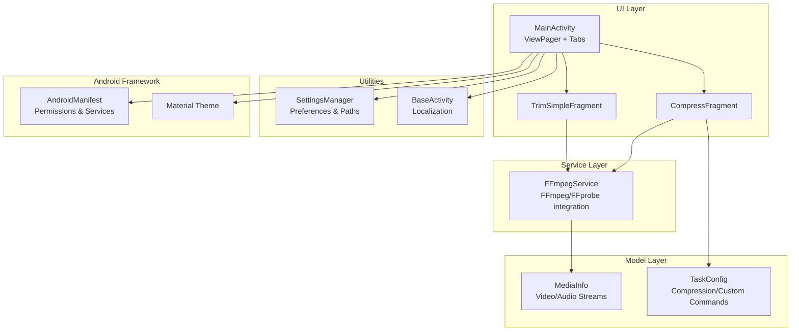
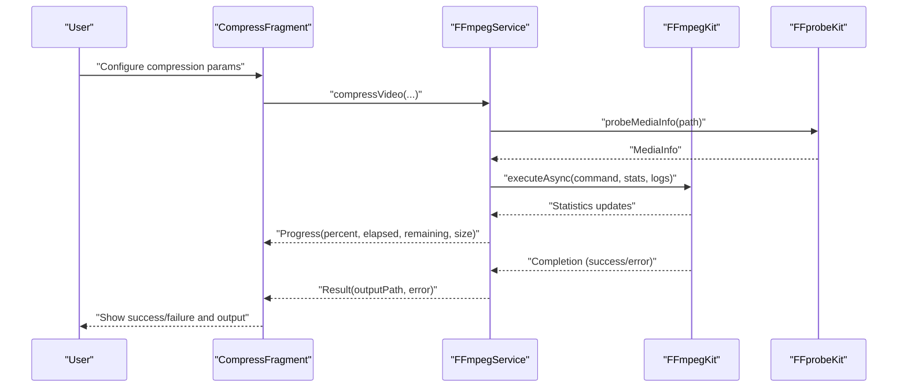
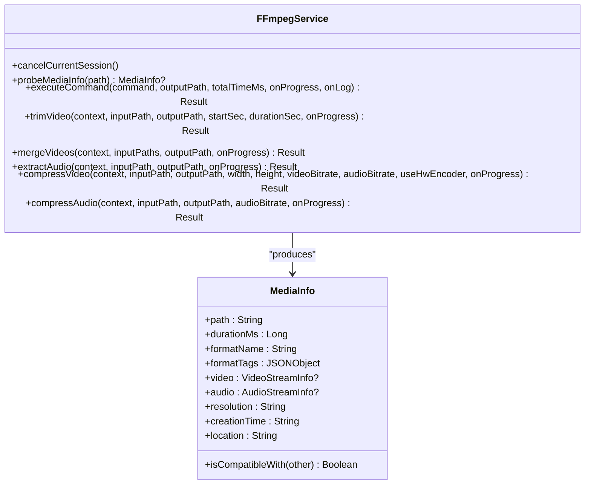
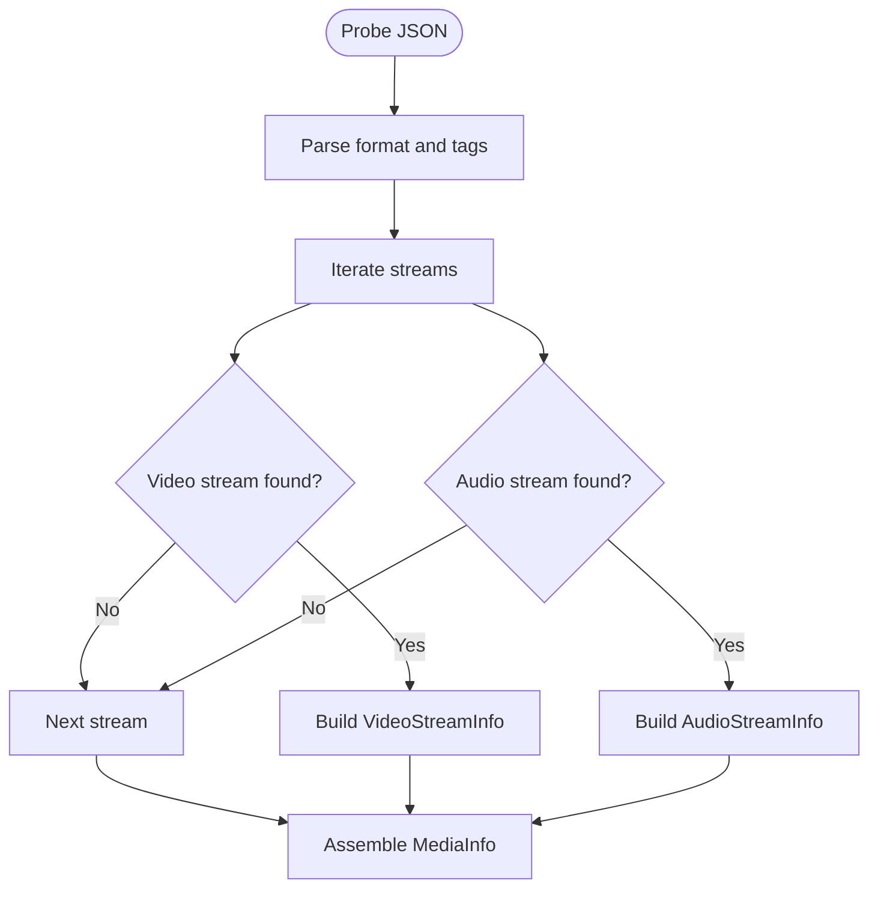
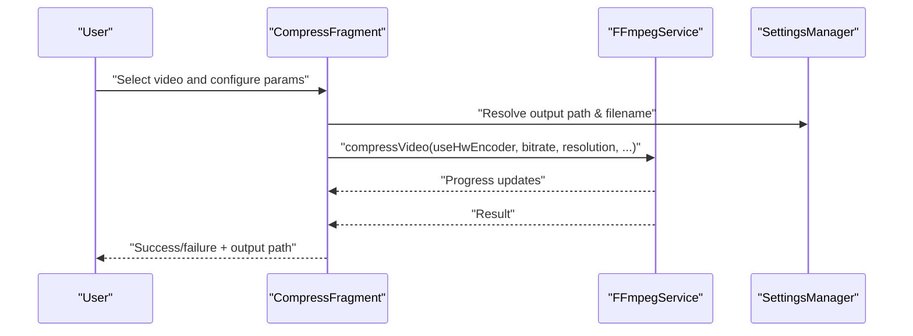
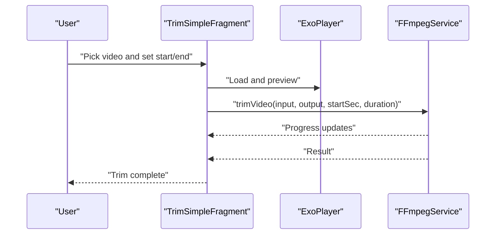
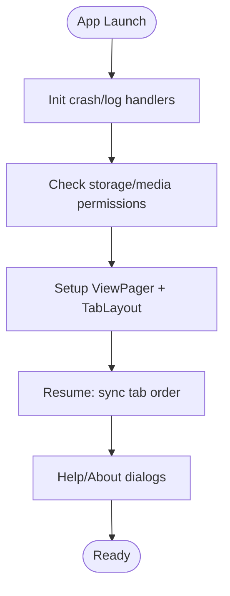
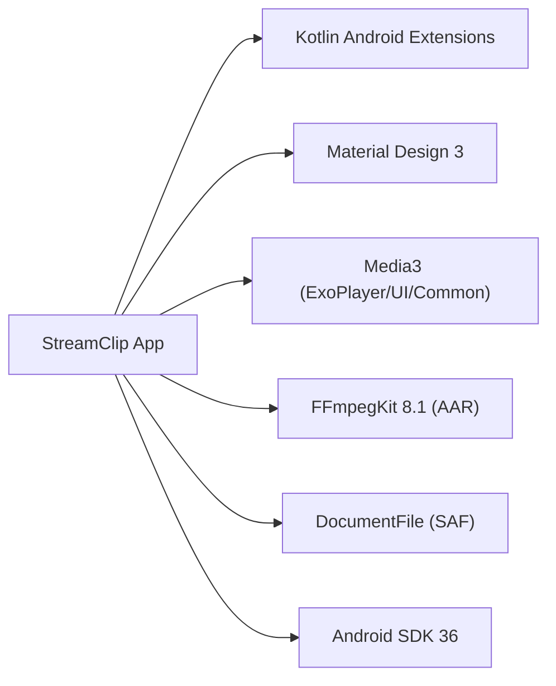

# Project Overview

<cite>
**Referenced Files in This Document**
- [README.md](file://README.md)
- [AndroidManifest.xml](file://app/src/main/AndroidManifest.xml)
- [build.gradle.kts](file://app/build.gradle.kts)
- [MainActivity.kt](file://app/src/main/java/com/pisces312/streamclip/MainActivity.kt)
- [BaseActivity.kt](file://app/src/main/java/com/pisces312/streamclip/BaseActivity.kt)
- [FFmpegService.kt](file://app/src/main/java/com/pisces312/streamclip/service/FFmpegService.kt)
- [MediaInfo.kt](file://app/src/main/java/com/pisces312/streamclip/model/MediaInfo.kt)
- [MainPagerAdapter.kt](file://app/src/main/java/com/pisces312/streamclip/adapter/MainPagerAdapter.kt)
- [CompressFragment.kt](file://app/src/main/java/com/pisces312/streamclip/fragment/CompressFragment.kt)
- [TrimSimpleFragment.kt](file://app/src/main/java/com/pisces312/streamclip/fragment/TrimSimpleFragment.kt)
- [SettingsManager.kt](file://app/src/main/java/com/pisces312/streamclip/util/SettingsManager.kt)
- [strings.xml](file://app/src/main/res/values/strings.xml)
- [themes.xml](file://app/src/main/res/values/themes.xml)
</cite>

## Table of Contents
1. [Introduction](#introduction)
2. [Project Structure](#project-structure)
3. [Core Components](#core-components)
4. [Architecture Overview](#architecture-overview)
5. [Detailed Component Analysis](#detailed-component-analysis)
6. [Dependency Analysis](#dependency-analysis)
7. [Performance Considerations](#performance-considerations)
8. [Troubleshooting Guide](#troubleshooting-guide)
9. [Conclusion](#conclusion)

## Introduction
StreamClip is a professional Android video processing application designed for efficient, high-quality video editing. Built on FFmpeg technology, it delivers lossless operations wherever possible, preserving original quality and metadata while enabling fast, real-time processing. The app targets both everyday users who need quick, reliable video edits and power users who require advanced customization and automation.

Key strengths:
- Lossless editing using stream copying for trimming, merging, and audio extraction
- Full metadata preservation, including creation time, GPS coordinates, device info, and rotation
- Hardware-accelerated compression leveraging MediaCodec for speed, with graceful fallback to software encoding
- Real-time progress tracking and batch processing support
- Extensible custom FFmpeg command execution with live logging

Positioning in the Android ecosystem:
- StreamClip sits alongside other Android media apps but emphasizes speed and quality preservation through FFmpeg-based workflows
- It complements Android’s native media frameworks by providing advanced editing operations not readily available through platform APIs alone

## Project Structure
The application follows a modular Android architecture with clear separation between UI, business logic, and media processing:
- UI layer: Activities and Fragments manage user interactions and present results
- Service layer: FFmpegService orchestrates FFmpeg operations and exposes progress/log callbacks
- Model layer: Data classes represent media info and task configurations
- Utilities: SettingsManager and other helpers encapsulate cross-cutting concerns like preferences and file handling
- Permissions and lifecycle: AndroidManifest defines required permissions and foreground services; BaseActivity applies localization

**Diagram sources**
- [MainActivity.kt:26-101](file://app/src/main/java/com/pisces312/streamclip/MainActivity.kt#L26-L101)
- [CompressFragment.kt:40-137](file://app/src/main/java/com/pisces312/streamclip/fragment/CompressFragment.kt#L40-L137)
- [TrimSimpleFragment.kt:35-123](file://app/src/main/java/com/pisces312/streamclip/fragment/TrimSimpleFragment.kt#L35-L123)
- [FFmpegService.kt:19-147](file://app/src/main/java/com/pisces312/streamclip/service/FFmpegService.kt#L19-L147)
- [MediaInfo.kt:5-165](file://app/src/main/java/com/pisces312/streamclip/model/MediaInfo.kt#L5-L165)
- [SettingsManager.kt:6-136](file://app/src/main/java/com/pisces312/streamclip/util/SettingsManager.kt#L6-L136)
- [AndroidManifest.xml:27-138](file://app/src/main/AndroidManifest.xml#L27-L138)
- [themes.xml:1-29](file://app/src/main/res/values/themes.xml#L1-L29)

**Section sources**
- [MainActivity.kt:26-101](file://app/src/main/java/com/pisces312/streamclip/MainActivity.kt#L26-L101)
- [MainPagerAdapter.kt:16-36](file://app/src/main/java/com/pisces312/streamclip/adapter/MainPagerAdapter.kt#L16-L36)
- [AndroidManifest.xml:27-138](file://app/src/main/AndroidManifest.xml#L27-L138)

## Core Components
- FFmpegService: Centralized media processing engine wrapping FFmpegKit. Provides probing, trimming, merging, audio extraction, compression (hardware/software), and custom command execution with real-time progress and logs.
- MediaInfo: Rich model for probing media characteristics (duration, format, streams, tags) and compatibility checks for merging.
- CompressFragment and TrimSimpleFragment: Feature-specific UIs exposing controls for compression and trimming, integrating with FFmpegService and SettingsManager.
- SettingsManager: Handles output directory selection, keep-screen-on behavior, timestamps, and cache management.
- MainActivity: Hosts the tabbed interface, manages permissions, and provides help/about dialogs.

Key capabilities:
- Instant lossless operations: trim, extract audio, merge via stream copying
- Full metadata preservation: creation time, GPS, device info, rotation
- Hardware-accelerated compression: H.264/H.265 via MediaCodec with fallback to software encoders
- Real-time progress: percentage, elapsed/remaining time, output size
- Batch processing: queue and track multiple tasks
- Custom FFmpeg commands: flexible parameter input with live logs

**Section sources**
- [FFmpegService.kt:19-420](file://app/src/main/java/com/pisces312/streamclip/service/FFmpegService.kt#L19-L420)
- [MediaInfo.kt:5-165](file://app/src/main/java/com/pisces312/streamclip/model/MediaInfo.kt#L5-L165)
- [CompressFragment.kt:40-137](file://app/src/main/java/com/pisces312/streamclip/fragment/CompressFragment.kt#L40-L137)
- [TrimSimpleFragment.kt:35-123](file://app/src/main/java/com/pisces312/streamclip/fragment/TrimSimpleFragment.kt#L35-L123)
- [SettingsManager.kt:6-136](file://app/src/main/java/com/pisces312/streamclip/util/SettingsManager.kt#L6-L136)
- [strings.xml:1-312](file://app/src/main/res/values/strings.xml#L1-L312)

## Architecture Overview
StreamClip employs a layered architecture:
- Presentation: Fragments and Activities render UI and gather user inputs
- Domain: FFmpegService encapsulates FFmpeg operations and statistics callbacks
- Data: MediaInfo models parsed from FFprobe JSON for downstream UI and logic
- Infrastructure: Android permissions, foreground services, and file providers

**Diagram sources**
- [CompressFragment.kt:40-137](file://app/src/main/java/com/pisces312/streamclip/fragment/CompressFragment.kt#L40-L137)
- [FFmpegService.kt:152-241](file://app/src/main/java/com/pisces312/streamclip/service/FFmpegService.kt#L152-L241)
- [MediaInfo.kt:56-147](file://app/src/main/java/com/pisces312/streamclip/model/MediaInfo.kt#L56-L147)

## Detailed Component Analysis

### FFmpegService: Media Processing Engine
FFmpegService is the backbone of StreamClip’s video editing capabilities:
- Probing: Single-call JSON parsing of format and streams for accurate metadata and compatibility checks
- Trimming: Lossless stream copy with precise start/duration and MOV container output
- Merging: Concat demuxer for lossless concatenation with metadata propagation from the first input
- Extraction: Audio-only copy from video containers
- Compression: Hardware encoding via MediaCodec (H.265 preferred) with automatic fallback to software encoders (libx265); preserves metadata and optimizes for faststart
- Progress and logs: StatisticsCallback and log callbacks enable real-time UI updates and diagnostics

**Diagram sources**
- [FFmpegService.kt:19-420](file://app/src/main/java/com/pisces312/streamclip/service/FFmpegService.kt#L19-L420)
- [MediaInfo.kt:5-165](file://app/src/main/java/com/pisces312/streamclip/model/MediaInfo.kt#L5-L165)

**Section sources**
- [FFmpegService.kt:19-420](file://app/src/main/java/com/pisces312/streamclip/service/FFmpegService.kt#L19-L420)
- [MediaInfo.kt:5-165](file://app/src/main/java/com/pisces312/streamclip/model/MediaInfo.kt#L5-L165)

### MediaInfo: Rich Media Metadata and Compatibility
MediaInfo parses FFprobe JSON to expose:
- Format-level details (name, tags, duration)
- First video and audio streams (codec, resolution, framerate, pixel format, bitrate)
- Derived properties (aspect ratio, HDR indicators, file creation time)
- Compatibility checks for merging multiple clips

**Diagram sources**
- [FFmpegService.kt:56-147](file://app/src/main/java/com/pisces312/streamclip/service/FFmpegService.kt#L56-L147)
- [MediaInfo.kt:5-165](file://app/src/main/java/com/pisces312/streamclip/model/MediaInfo.kt#L5-L165)

**Section sources**
- [FFmpegService.kt:56-147](file://app/src/main/java/com/pisces312/streamclip/service/FFmpegService.kt#L56-L147)
- [MediaInfo.kt:5-165](file://app/src/main/java/com/pisces312/streamclip/model/MediaInfo.kt#L5-L165)

### CompressFragment: Hardware/Software Compression UI
CompressFragment provides:
- Tabbed panels for hardware (MediaCodec) and software (libx265) encoders
- Controls for bitrate, resolution, frame rate, and audio encoding
- Real-time progress updates and log collection
- Batch mode for multiple videos with unified configuration
- External Intent integration for “Open with” workflows

**Diagram sources**
- [CompressFragment.kt:40-137](file://app/src/main/java/com/pisces312/streamclip/fragment/CompressFragment.kt#L40-L137)
- [SettingsManager.kt:67-114](file://app/src/main/java/com/pisces312/streamclip/util/SettingsManager.kt#L67-L114)
- [FFmpegService.kt:355-393](file://app/src/main/java/com/pisces312/streamclip/service/FFmpegService.kt#L355-L393)

**Section sources**
- [CompressFragment.kt:40-137](file://app/src/main/java/com/pisces312/streamclip/fragment/CompressFragment.kt#L40-L137)
- [SettingsManager.kt:67-114](file://app/src/main/java/com/pisces312/streamclip/util/SettingsManager.kt#L67-L114)

### TrimSimpleFragment: Lossless Trimming UI
TrimSimpleFragment enables:
- Precise time-range selection with seekable preview using ExoPlayer
- Lossless trimming via stream copy with metadata preservation
- External Intent integration for “Open with” trimming
- Real-time playback and scrubbing

**Diagram sources**
- [TrimSimpleFragment.kt:35-123](file://app/src/main/java/com/pisces312/streamclip/fragment/TrimSimpleFragment.kt#L35-L123)
- [FFmpegService.kt:246-272](file://app/src/main/java/com/pisces312/streamclip/service/FFmpegService.kt#L246-L272)

**Section sources**
- [TrimSimpleFragment.kt:35-123](file://app/src/main/java/com/pisces312/streamclip/fragment/TrimSimpleFragment.kt#L35-L123)
- [FFmpegService.kt:246-272](file://app/src/main/java/com/pisces312/streamclip/service/FFmpegService.kt#L246-L272)

### MainActivity: Tabbed Interface and Lifecycle
MainActivity initializes logging, enforces permissions, sets up the tabbed interface, and provides help/about dialogs. It also supports long-press tab reordering and displays version information.

**Diagram sources**
- [MainActivity.kt:35-101](file://app/src/main/java/com/pisces312/streamclip/MainActivity.kt#L35-L101)
- [BaseActivity.kt:8-13](file://app/src/main/java/com/pisces312/streamclip/BaseActivity.kt#L8-L13)

**Section sources**
- [MainActivity.kt:35-101](file://app/src/main/java/com/pisces312/streamclip/MainActivity.kt#L35-L101)
- [BaseActivity.kt:8-13](file://app/src/main/java/com/pisces312/streamclip/BaseActivity.kt#L8-L13)

## Dependency Analysis
Technology stack and key dependencies:
- Kotlin + Android SDK 36 (compile/target), with Java 17 toolchain
- FFmpegKit 8.1 (local AAR) for media processing
- Material Design 3 for modern UI theming
- Media3 for video preview and playback
- DocumentFile for SAF access

**Diagram sources**
- [build.gradle.kts:64-84](file://app/build.gradle.kts#L64-L84)
- [AndroidManifest.xml:27-138](file://app/src/main/AndroidManifest.xml#L27-L138)

**Section sources**
- [build.gradle.kts:64-84](file://app/build.gradle.kts#L64-L84)
- [AndroidManifest.xml:27-138](file://app/src/main/AndroidManifest.xml#L27-L138)

## Performance Considerations
- Lossless operations: Stream copying avoids re-encoding, minimizing CPU/GPU usage and preserving quality
- Hardware acceleration: MediaCodec-based H.265/H.264 encoding prioritizes speed; fallback to software ensures compatibility
- Real-time progress: StatisticsCallback provides smooth UI updates without blocking the main thread
- Batch processing: Queued execution reduces per-task overhead and improves throughput
- Metadata handling: Efficient sidecar tag writing minimizes extra passes during merges

## Troubleshooting Guide
Common scenarios and guidance:
- Permission prompts: On Android 11+, the app requests broad storage access; on Android 13+, granular media permissions are required
- Keep screen on: Enabled by default to prevent device sleep during processing
- Logs and crashes: Built-in log viewer and crash detection dialog help diagnose issues
- Output path: Automatic fallback to Movies/StreamClip when source is in cache/private directories

**Section sources**
- [MainActivity.kt:454-502](file://app/src/main/java/com/pisces312/streamclip/MainActivity.kt#L454-L502)
- [strings.xml:90-119](file://app/src/main/res/values/strings.xml#L90-L119)
- [SettingsManager.kt:67-92](file://app/src/main/java/com/pisces312/streamclip/util/SettingsManager.kt#L67-L92)

## Conclusion
StreamClip delivers a powerful, efficient, and user-friendly video editing experience on Android by combining FFmpeg’s robust processing capabilities with a modern, intuitive interface. Its emphasis on lossless operations, metadata preservation, and hardware-accelerated compression positions it as a strong choice for both casual and professional users seeking fast, high-quality video editing without sacrificing fidelity.