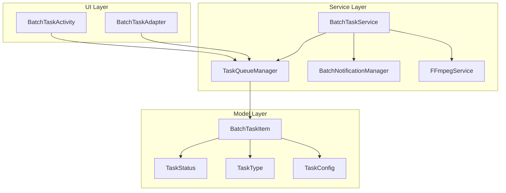
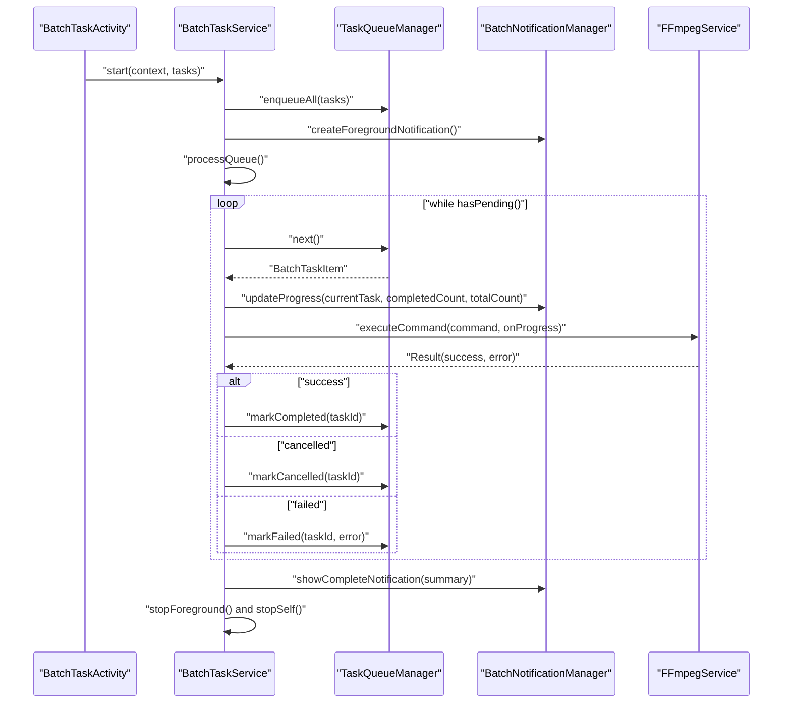
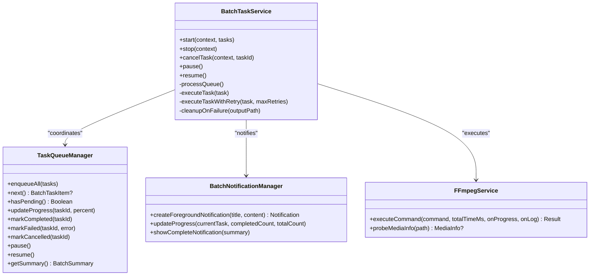
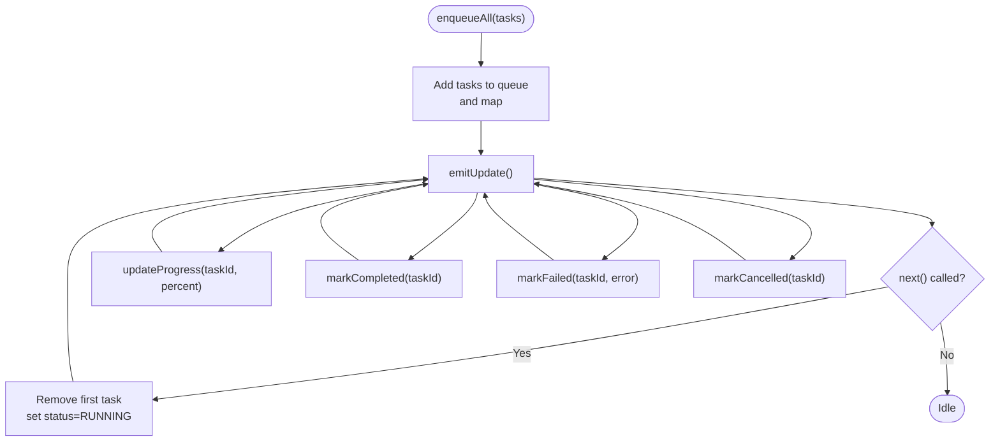
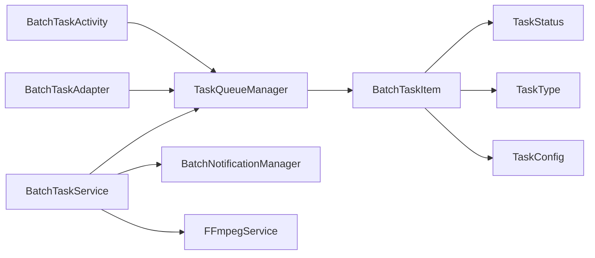

# Batch Processing System

<cite>
**Referenced Files in This Document**
- [BatchTaskService.kt](file://app/src/main/java/com/pisces312/streamclip/service/BatchTaskService.kt)
- [TaskQueueManager.kt](file://app/src/main/java/com/pisces312/streamclip/service/TaskQueueManager.kt)
- [BatchNotificationManager.kt](file://app/src/main/java/com/pisces312/streamclip/service/BatchNotificationManager.kt)
- [BatchTaskActivity.kt](file://app/src/main/java/com/pisces312/streamclip/ui/BatchTaskActivity.kt)
- [BatchTaskAdapter.kt](file://app/src/main/java/com/pisces312/streamclip/adapter/BatchTaskAdapter.kt)
- [FFmpegService.kt](file://app/src/main/java/com/pisces312/streamclip/service/FFmpegService.kt)
- [BatchTaskItem.kt](file://app/src/main/java/com/pisces312/streamclip/model/BatchTaskItem.kt)
- [TaskStatus.kt](file://app/src/main/java/com/pisces312/streamclip/model/TaskStatus.kt)
- [TaskType.kt](file://app/src/main/java/com/pisces312/streamclip/model/TaskType.kt)
- [TaskConfig.kt](file://app/src/main/java/com/pisces312/streamclip/model/TaskConfig.kt)
- [batch-queue-design.md](file://docs/batch-queue-design.md)
- [README.md](file://README.md)
</cite>

## Table of Contents
1. [Introduction](#introduction)
2. [Project Structure](#project-structure)
3. [Core Components](#core-components)
4. [Architecture Overview](#architecture-overview)
5. [Detailed Component Analysis](#detailed-component-analysis)
6. [Dependency Analysis](#dependency-analysis)
7. [Performance Considerations](#performance-considerations)
8. [Troubleshooting Guide](#troubleshooting-guide)
9. [Conclusion](#conclusion)

## Introduction
This document describes StreamClip’s batch processing system architecture with a focus on the foreground service that executes queued tasks, the queue manager that persists state and tracks progress, and the notification manager that provides user feedback. It explains how the system manages concurrency, handles service lifecycle events, processes task completion callbacks, and maintains data consistency across app restarts. It also covers error handling, retry mechanisms, cleanup procedures, and performance considerations for large task queues.

## Project Structure
The batch processing system spans several packages:
- service: core orchestration and state management
- ui: user interface for monitoring and controlling tasks
- adapter: UI adapters for displaying task lists
- model: data models for tasks, statuses, and configurations
- docs: design documents and specifications

**Diagram sources**
- [BatchTaskService.kt:1-301](file://app/src/main/java/com/pisces312/streamclip/service/BatchTaskService.kt#L1-L301)
- [TaskQueueManager.kt:1-146](file://app/src/main/java/com/pisces312/streamclip/service/TaskQueueManager.kt#L1-L146)
- [BatchNotificationManager.kt:1-137](file://app/src/main/java/com/pisces312/streamclip/service/BatchNotificationManager.kt#L1-L137)
- [BatchTaskActivity.kt:1-89](file://app/src/main/java/com/pisces312/streamclip/ui/BatchTaskActivity.kt#L1-L89)
- [BatchTaskAdapter.kt:1-86](file://app/src/main/java/com/pisces312/streamclip/adapter/BatchTaskAdapter.kt#L1-L86)
- [FFmpegService.kt:1-420](file://app/src/main/java/com/pisces312/streamclip/service/FFmpegService.kt#L1-L420)
- [BatchTaskItem.kt:1-32](file://app/src/main/java/com/pisces312/streamclip/model/BatchTaskItem.kt#L1-L32)
- [TaskStatus.kt:1-11](file://app/src/main/java/com/pisces312/streamclip/model/TaskStatus.kt#L1-L11)
- [TaskType.kt:1-8](file://app/src/main/java/com/pisces312/streamclip/model/TaskType.kt#L1-L8)
- [TaskConfig.kt:1-15](file://app/src/main/java/com/pisces312/streamclip/model/TaskConfig.kt#L1-L15)

**Section sources**
- [README.md:61-64](file://README.md#L61-L64)
- [batch-queue-design.md:25-73](file://docs/batch-queue-design.md#L25-L73)

## Core Components
- BatchTaskService: Foreground service responsible for starting, running, pausing, resuming, and stopping batch tasks. It coordinates queue processing, task execution, and notifications.
- TaskQueueManager: Singleton managing an in-memory queue of tasks, their state, counts, and progress. Emits StateFlow updates for UI observation.
- BatchNotificationManager: Manages notification channels and displays progress and completion notifications with actionable buttons.
- FFmpegService: Provides FFmpeg execution and probing capabilities used by BatchTaskService to run tasks.
- UI: BatchTaskActivity and BatchTaskAdapter present the task list, actions, and status updates.

**Section sources**
- [BatchTaskService.kt:26-64](file://app/src/main/java/com/pisces312/streamclip/service/BatchTaskService.kt#L26-L64)
- [TaskQueueManager.kt:10-146](file://app/src/main/java/com/pisces312/streamclip/service/TaskQueueManager.kt#L10-L146)
- [BatchNotificationManager.kt:17-137](file://app/src/main/java/com/pisces312/streamclip/service/BatchNotificationManager.kt#L17-L137)
- [FFmpegService.kt:19-420](file://app/src/main/java/com/pisces312/streamclip/service/FFmpegService.kt#L19-L420)
- [BatchTaskActivity.kt:18-89](file://app/src/main/java/com/pisces312/streamclip/ui/BatchTaskActivity.kt#L18-L89)
- [BatchTaskAdapter.kt:15-86](file://app/src/main/java/com/pisces312/streamclip/adapter/BatchTaskAdapter.kt#L15-L86)

## Architecture Overview
The system follows a foreground service pattern with a dedicated queue manager and notification manager. Tasks are executed sequentially with progress updates and completion notifications. The UI observes state changes via StateFlow.

**Diagram sources**
- [BatchTaskService.kt:92-165](file://app/src/main/java/com/pisces312/streamclip/service/BatchTaskService.kt#L92-L165)
- [TaskQueueManager.kt:32-86](file://app/src/main/java/com/pisces312/streamclip/service/TaskQueueManager.kt#L32-L86)
- [BatchNotificationManager.kt:40-89](file://app/src/main/java/com/pisces312/streamclip/service/BatchNotificationManager.kt#L40-L89)
- [FFmpegService.kt:152-241](file://app/src/main/java/com/pisces312/streamclip/service/FFmpegService.kt#L152-L241)

## Detailed Component Analysis

### BatchTaskService
Responsibilities:
- Lifecycle management: start, stop, pause, resume, and destroy.
- Queue orchestration: enqueues initial tasks, processes sequentially, and updates state.
- Concurrency control: runs one task at a time; stores per-task jobs for cancellation.
- Execution: builds task-specific commands, invokes FFmpegService, and handles cleanup on failure.
- Retry: attempts up to a configured number of retries with backoff.
- Notifications: updates progress and completion notifications.

Key behaviors:
- Foreground service with a persistent notification while running.
- Uses a SupervisorJob-based coroutine scope to isolate child task coroutines.
- Stores running task jobs in a ConcurrentHashMap keyed by task ID for targeted cancellation.
- On stop/cancel, cancels the service scope and removes the foreground notification.

**Diagram sources**
- [BatchTaskService.kt:26-301](file://app/src/main/java/com/pisces312/streamclip/service/BatchTaskService.kt#L26-L301)
- [TaskQueueManager.kt:10-146](file://app/src/main/java/com/pisces312/streamclip/service/TaskQueueManager.kt#L10-L146)
- [BatchNotificationManager.kt:17-137](file://app/src/main/java/com/pisces312/streamclip/service/BatchNotificationManager.kt#L17-L137)
- [FFmpegService.kt:19-420](file://app/src/main/java/com/pisces312/streamclip/service/FFmpegService.kt#L19-L420)

**Section sources**
- [BatchTaskService.kt:74-165](file://app/src/main/java/com/pisces312/streamclip/service/BatchTaskService.kt#L74-L165)
- [BatchTaskService.kt:167-240](file://app/src/main/java/com/pisces312/streamclip/service/BatchTaskService.kt#L167-L240)
- [BatchTaskService.kt:257-263](file://app/src/main/java/com/pisces312/streamclip/service/BatchTaskService.kt#L257-L263)
- [BatchTaskService.kt:265-293](file://app/src/main/java/com/pisces312/streamclip/service/BatchTaskService.kt#L265-L293)

### TaskQueueManager
Responsibilities:
- Maintains an in-memory queue of tasks and a map of all tasks.
- Exposes counts for total, completed, and pending tasks.
- Updates task progress and status transitions.
- Emits StateFlow updates for UI observation.
- Supports pause/resume and retry operations.

Concurrency and thread-safety:
- Uses synchronized methods to protect internal collections and counters.
- Exposes a StateFlow for reactive UI updates.

**Diagram sources**
- [TaskQueueManager.kt:24-144](file://app/src/main/java/com/pisces312/streamclip/service/TaskQueueManager.kt#L24-L144)

**Section sources**
- [TaskQueueManager.kt:10-146](file://app/src/main/java/com/pisces312/streamclip/service/TaskQueueManager.kt#L10-L146)

### BatchNotificationManager
Responsibilities:
- Creates and manages a notification channel for batch processing.
- Builds a persistent foreground notification with progress and action buttons.
- Updates progress notifications during task execution.
- Shows a completion notification summarizing results.

User interaction:
- Action buttons for pause and cancel are backed by PendingIntent intents targeting BatchTaskService actions.

**Section sources**
- [BatchNotificationManager.kt:17-137](file://app/src/main/java/com/pisces312/streamclip/service/BatchNotificationManager.kt#L17-L137)

### FFmpegService
Responsibilities:
- Executes FFmpeg commands asynchronously and reports progress via a StatisticsCallback.
- Probes media info to derive durations for percentage calculation.
- Supports cancellation of the current session.

Integration with BatchTaskService:
- BatchTaskService invokes executeCommand with onProgress to update UI and queue progress.
- BatchTaskService cleans up partial outputs on failure.

**Section sources**
- [FFmpegService.kt:19-420](file://app/src/main/java/com/pisces312/streamclip/service/FFmpegService.kt#L19-L420)
- [BatchTaskService.kt:197-232](file://app/src/main/java/com/pisces312/streamclip/service/BatchTaskService.kt#L197-L232)

### UI Integration: BatchTaskActivity and BatchTaskAdapter
- BatchTaskActivity observes TaskQueueManager.taskFlow and renders tasks in a RecyclerView.
- BatchTaskAdapter displays task status, progress, and action buttons (retry, cancel, open).
- Actions trigger TaskQueueManager operations and UI refresh.

**Section sources**
- [BatchTaskActivity.kt:18-89](file://app/src/main/java/com/pisces312/streamclip/ui/BatchTaskActivity.kt#L18-L89)
- [BatchTaskAdapter.kt:15-86](file://app/src/main/java/com/pisces312/streamclip/adapter/BatchTaskAdapter.kt#L15-L86)

## Dependency Analysis
- BatchTaskService depends on TaskQueueManager for state and queue operations, BatchNotificationManager for user feedback, and FFmpegService for execution.
- TaskQueueManager is a singleton that exposes a StateFlow consumed by UI components.
- UI components depend on TaskQueueManager for reactive updates.

**Diagram sources**
- [BatchTaskService.kt:26-301](file://app/src/main/java/com/pisces312/streamclip/service/BatchTaskService.kt#L26-L301)
- [TaskQueueManager.kt:10-146](file://app/src/main/java/com/pisces312/streamclip/service/TaskQueueManager.kt#L10-L146)
- [BatchNotificationManager.kt:17-137](file://app/src/main/java/com/pisces312/streamclip/service/BatchNotificationManager.kt#L17-L137)
- [BatchTaskActivity.kt:18-89](file://app/src/main/java/com/pisces312/streamclip/ui/BatchTaskActivity.kt#L18-L89)
- [BatchTaskAdapter.kt:15-86](file://app/src/main/java/com/pisces312/streamclip/adapter/BatchTaskAdapter.kt#L15-L86)
- [FFmpegService.kt:19-420](file://app/src/main/java/com/pisces312/streamclip/service/FFmpegService.kt#L19-L420)
- [BatchTaskItem.kt:1-32](file://app/src/main/java/com/pisces312/streamclip/model/BatchTaskItem.kt#L1-L32)
- [TaskStatus.kt:1-11](file://app/src/main/java/com/pisces312/streamclip/model/TaskStatus.kt#L1-L11)
- [TaskType.kt:1-8](file://app/src/main/java/com/pisces312/streamclip/model/TaskType.kt#L1-L8)
- [TaskConfig.kt:1-15](file://app/src/main/java/com/pisces312/streamclip/model/TaskConfig.kt#L1-L15)

## Performance Considerations
- Concurrency: The system processes tasks sequentially to avoid contention and simplify state management. This reduces CPU/GPU pressure and avoids conflicts with FFmpeg sessions.
- Memory: The queue holds task metadata and paths, not media content. Large queues remain lightweight.
- Background execution: As a foreground service, it is less likely to be terminated by the system. Use appropriate notification channels and keep the service running only while necessary.
- Progress updates: Frequent progress updates are handled by the underlying FFmpeg callback and propagated to the queue and notification manager. Consider throttling UI updates if needed.
- Storage checks: Before starting, ensure sufficient storage space to prevent failures mid-execution.
- Cleanup: Partial outputs are deleted on failure to prevent disk bloat.

[No sources needed since this section provides general guidance]

## Troubleshooting Guide
Common issues and resolutions:
- Service termination: If the service stops unexpectedly, verify foreground service registration and notification channel creation. Ensure the service remains active while processing.
- Task stuck in PENDING/RUNNING: Confirm that TaskQueueManager.next() is invoked and that progress updates are emitted. Check for exceptions in FFmpegService execution.
- No progress updates: Verify onProgress callbacks are invoked and that TaskQueueManager.updateProgress is called. Ensure the notification manager receives updates.
- Failure cleanup: Confirm cleanupOnFailure deletes partial outputs and logs warnings on failure.
- Retry behavior: The system retries failed tasks once with a small delay. Review error messages captured in TaskResult and adjust retry policy if needed.
- Pause/Resume: Ensure pause/resume toggles are respected by the queue and that resume triggers processQueue again.

**Section sources**
- [BatchTaskService.kt:257-263](file://app/src/main/java/com/pisces312/streamclip/service/BatchTaskService.kt#L257-L263)
- [BatchTaskService.kt:167-179](file://app/src/main/java/com/pisces312/streamclip/service/BatchTaskService.kt#L167-L179)
- [TaskQueueManager.kt:48-53](file://app/src/main/java/com/pisces312/streamclip/service/TaskQueueManager.kt#L48-L53)
- [BatchNotificationManager.kt:57-89](file://app/src/main/java/com/pisces312/streamclip/service/BatchNotificationManager.kt#L57-L89)

## Conclusion
StreamClip’s batch processing system centers around a robust foreground service that orchestrates sequential task execution, a reliable queue manager for state and progress tracking, and a notification manager for user feedback. The design emphasizes simplicity, reliability, and user visibility. While the current implementation processes tasks sequentially, the architecture supports future enhancements such as task persistence across app restarts, improved concurrency controls, and finer-grained cancellation.

[No sources needed since this section summarizes without analyzing specific files]