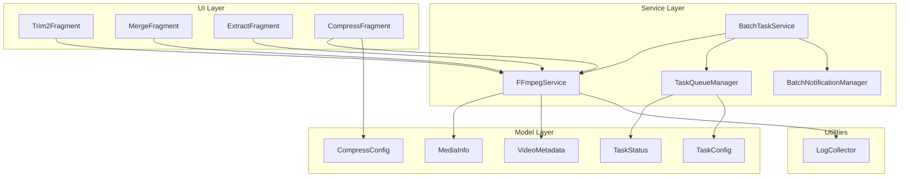
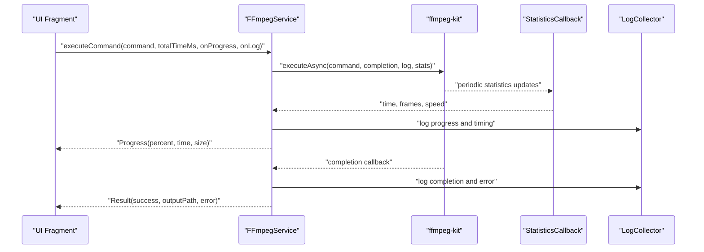
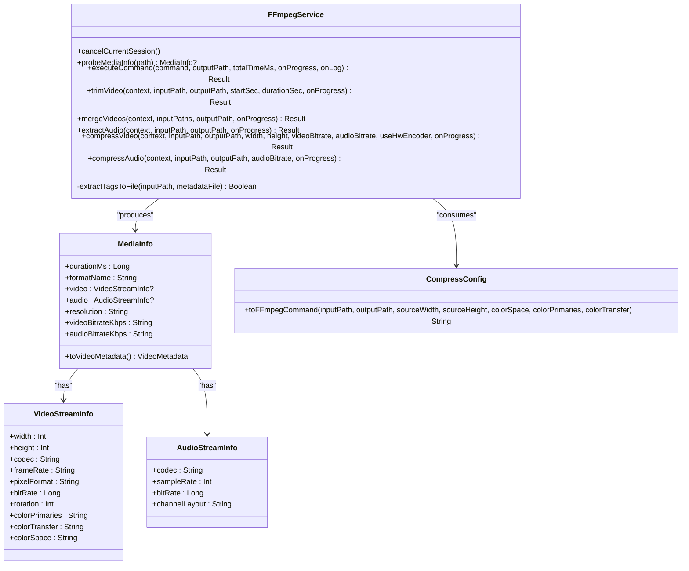
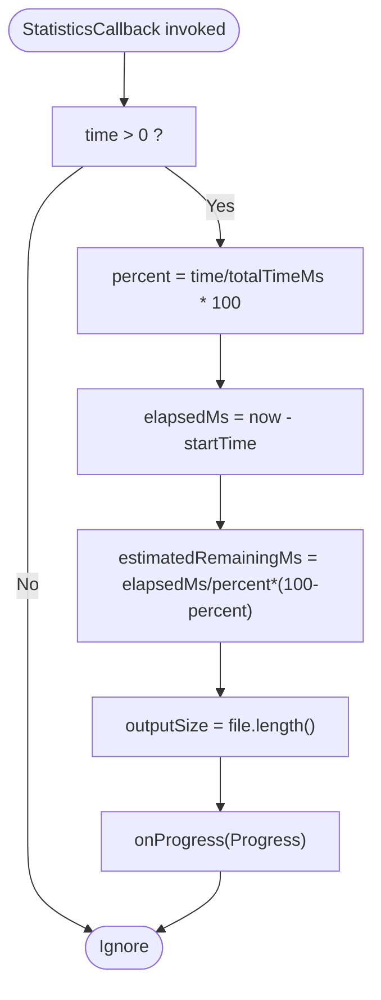
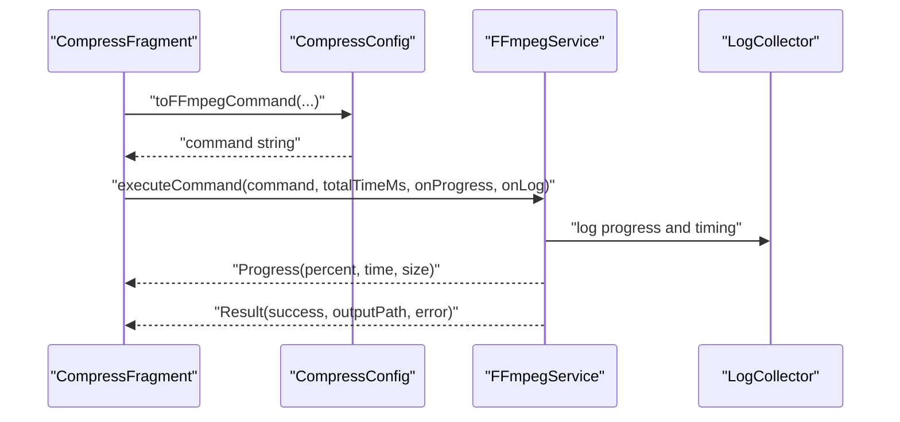
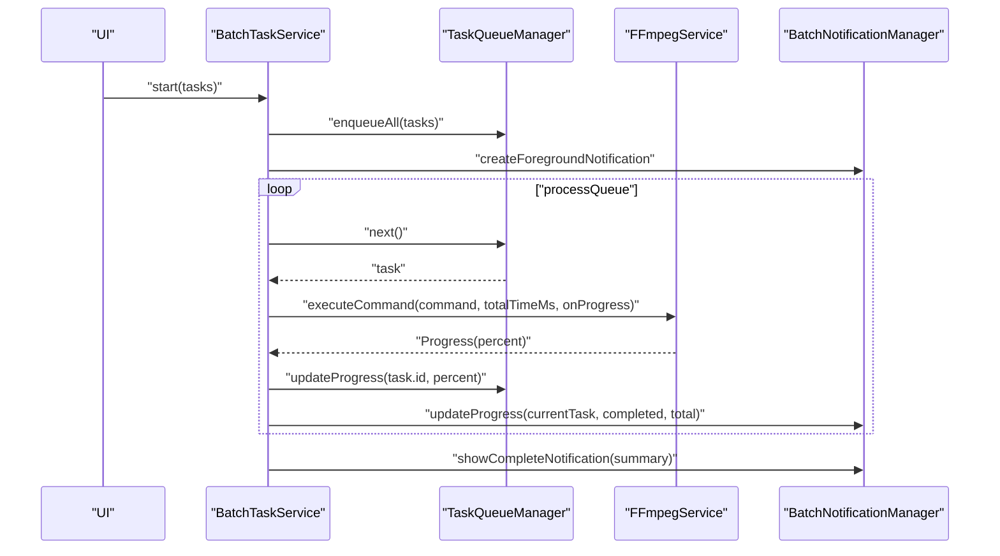
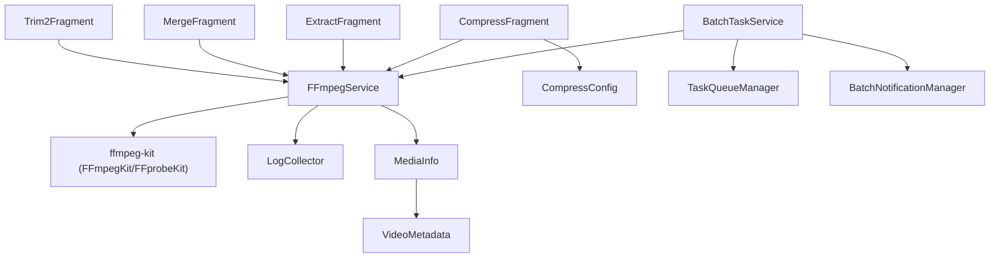

# FFmpegService Core Engine

<cite>
**Referenced Files in This Document**
- [FFmpegService.kt](file://app/src/main/java/com/pisces312/streamclip/service/FFmpegService.kt)
- [MediaInfo.kt](file://app/src/main/java/com/pisces312/streamclip/model/MediaInfo.kt)
- [VideoMetadata.kt](file://app/src/main/java/com/pisces312/streamclip/model/VideoMetadata.kt)
- [CompressConfig.kt](file://app/src/main/java/com/pisces312/streamclip/model/CompressConfig.kt)
- [TaskConfig.kt](file://app/src/main/java/com/pisces312/streamclip/model/TaskConfig.kt)
- [TaskStatus.kt](file://app/src/main/java/com/pisces312/streamclip/model/TaskStatus.kt)
- [LogCollector.kt](file://app/src/main/java/com/pisces312/streamclip/util/LogCollector.kt)
- [Trim2Fragment.kt](file://app/src/main/java/com/pisces312/streamclip/fragment/Trim2Fragment.kt)
- [MergeFragment.kt](file://app/src/main/java/com/pisces312/streamclip/fragment/MergeFragment.kt)
- [ExtractFragment.kt](file://app/src/main/java/com/pisces312/streamclip/fragment/ExtractFragment.kt)
- [CompressFragment.kt](file://app/src/main/java/com/pisces312/streamclip/fragment/CompressFragment.kt)
- [TaskQueueManager.kt](file://app/src/main/java/com/pisces312/streamclip/service/TaskQueueManager.kt)
- [BatchTaskService.kt](file://app/src/main/java/com/pisces312/streamclip/service/BatchTaskService.kt)
- [BatchNotificationManager.kt](file://app/src/main/java/com/pisces312/streamclip/service/BatchNotificationManager.kt)
</cite>

## Table of Contents
1. [Introduction](#introduction)
2. [Project Structure](#project-structure)
3. [Core Components](#core-components)
4. [Architecture Overview](#architecture-overview)
5. [Detailed Component Analysis](#detailed-component-analysis)
6. [Dependency Analysis](#dependency-analysis)
7. [Performance Considerations](#performance-considerations)
8. [Troubleshooting Guide](#troubleshooting-guide)
9. [Conclusion](#conclusion)
10. [Appendices](#appendices)

## Introduction
FFmpegService is the core video processing engine of the application. It integrates ffmpeg-kit to execute FFmpeg commands asynchronously, manage progress and logs, and expose high-level operations such as trimming, merging, extracting audio, and compressing video and audio. The service is implemented as a Kotlin object (singleton) to ensure centralized control of ffmpeg-kit sessions, cancellation, and resource cleanup. It provides structured data classes for results, progress, and media metadata, and coordinates with UI components and background services for batch operations.

## Project Structure
The FFmpegService resides in the service package and collaborates with models, UI fragments, and background services:
- Service layer: FFmpegService, TaskQueueManager, BatchTaskService, BatchNotificationManager
- Model layer: MediaInfo, VideoMetadata, CompressConfig, TaskConfig, TaskStatus
- UI layer: Fragments for Trim, Merge, Extract, Compress
- Utilities: LogCollector for logging and crash handling

**Diagram sources**
- [FFmpegService.kt:19-419](file://app/src/main/java/com/pisces312/streamclip/service/FFmpegService.kt#L19-L419)
- [MediaInfo.kt:5-144](file://app/src/main/java/com/pisces312/streamclip/model/MediaInfo.kt#L5-L144)
- [VideoMetadata.kt:5-55](file://app/src/main/java/com/pisces312/streamclip/model/VideoMetadata.kt#L5-L55)
- [CompressConfig.kt:3-114](file://app/src/main/java/com/pisces312/streamclip/model/CompressConfig.kt#L3-L114)
- [TaskConfig.kt:5-9](file://app/src/main/java/com/pisces312/streamclip/model/TaskConfig.kt#L5-L9)
- [TaskStatus.kt:3-10](file://app/src/main/java/com/pisces312/streamclip/model/TaskStatus.kt#L3-L10)
- [LogCollector.kt:15-201](file://app/src/main/java/com/pisces312/streamclip/util/LogCollector.kt#L15-L201)
- [Trim2Fragment.kt:178-251](file://app/src/main/java/com/pisces312/streamclip/fragment/Trim2Fragment.kt#L178-L251)
- [MergeFragment.kt:135-232](file://app/src/main/java/com/pisces312/streamclip/fragment/MergeFragment.kt#L135-L232)
- [ExtractFragment.kt:136-191](file://app/src/main/java/com/pisces312/streamclip/fragment/ExtractFragment.kt#L136-L191)
- [CompressFragment.kt:572-680](file://app/src/main/java/com/pisces312/streamclip/fragment/CompressFragment.kt#L572-L680)
- [TaskQueueManager.kt:10-145](file://app/src/main/java/com/pisces312/streamclip/service/TaskQueueManager.kt#L10-L145)
- [BatchTaskService.kt:26-301](file://app/src/main/java/com/pisces312/streamclip/service/BatchTaskService.kt#L26-L301)
- [BatchNotificationManager.kt:17-137](file://app/src/main/java/com/pisces312/streamclip/service/BatchNotificationManager.kt#L17-L137)

**Section sources**
- [FFmpegService.kt:19-419](file://app/src/main/java/com/pisces312/streamclip/service/FFmpegService.kt#L19-L419)
- [CompressFragment.kt:572-680](file://app/src/main/java/com/pisces312/streamclip/fragment/CompressFragment.kt#L572-L680)

## Core Components
- Singleton Pattern: FFmpegService is implemented as an object, ensuring a single shared instance for managing ffmpeg-kit sessions and cancellation.
- Data Classes:
  - Result: Encapsulates success flag, output path, and error message.
  - Progress: Provides percentage, processed time, total time, output size, and a message.
  - LogLine: Wraps log messages with an isError flag for UI rendering.
- Async Execution with Coroutines: executeCommand uses Dispatchers.IO and suspendCancellableCoroutine to run ffmpeg-kit commands asynchronously, supporting cancellation via coroutine cancellation.
- ffmpeg-kit Integration: Uses FFmpegKit and FFprobeKit for command execution and media probing, respectively. StatisticsCallback is used for progress tracking; callbacks for logs and completion are supported.
- Specialized Methods:
  - probeMediaInfo: Extracts media metadata using ffprobe.
  - trimVideo: Performs lossless trim using stream copy.
  - mergeVideos: Concatenates videos without re-encoding and preserves metadata.
  - extractAudio: Copies audio track losslessly.
  - compressVideo: Encodes video with hardware/software encoder and configurable bitrate/crf.
  - compressAudio: Re-encodes audio to target bitrate.
- Session Management: Tracks current session ID and cancels on demand via cancelCurrentSession.
- Logging: Centralized logging via LogCollector for both in-memory and file-backed logs.

**Section sources**
- [FFmpegService.kt:19-419](file://app/src/main/java/com/pisces312/streamclip/service/FFmpegService.kt#L19-L419)
- [LogCollector.kt:15-201](file://app/src/main/java/com/pisces312/streamclip/util/LogCollector.kt#L15-L201)

## Architecture Overview
FFmpegService orchestrates video processing operations by translating UI selections into FFmpeg commands, executing them asynchronously, and streaming progress and logs back to UI components. Background services coordinate batch operations, while models encapsulate media metadata and configuration.

**Diagram sources**
- [FFmpegService.kt:152-241](file://app/src/main/java/com/pisces312/streamclip/service/FFmpegService.kt#L152-L241)
- [LogCollector.kt:59-96](file://app/src/main/java/com/pisces312/streamclip/util/LogCollector.kt#L59-L96)

## Detailed Component Analysis

### FFmpegService Singleton and Command Execution
- Singleton Pattern: currentSessionId tracks the active session; cancelCurrentSession cancels the ongoing operation.
- Result and Progress: Standardized return types for consistent UI handling.
- executeCommand:
  - Runs on Dispatchers.IO with suspendCancellableCoroutine.
  - Supports optional onProgress and onLog callbacks.
  - Uses StatisticsCallback to compute percentage from session time and total duration.
  - Emits progress updates and final Result upon completion.
  - Cancellation: Cancels the ffmpeg-kit session when the coroutine is cancelled.
- probeMediaInfo:
  - Executes ffprobe with JSON output.
  - Parses format, streams, and side data (rotation).
  - Builds MediaInfo with convenience accessors for UI.
- Specialized Operations:
  - trimVideo: Stream copy trim with metadata preservation.
  - mergeVideos: Concat demuxer with metadata propagation from the first video.
  - extractAudio: Audio track copy.
  - compressVideo: Hardware/software encoding with scaling, color metadata, and MOV container.
  - compressAudio: Audio re-encode with configurable bitrate.

**Diagram sources**
- [FFmpegService.kt:19-419](file://app/src/main/java/com/pisces312/streamclip/service/FFmpegService.kt#L19-L419)
- [MediaInfo.kt:5-144](file://app/src/main/java/com/pisces312/streamclip/model/MediaInfo.kt#L5-L144)
- [VideoMetadata.kt:5-55](file://app/src/main/java/com/pisces312/streamclip/model/VideoMetadata.kt#L5-L55)
- [CompressConfig.kt:21-114](file://app/src/main/java/com/pisces312/streamclip/model/CompressConfig.kt#L21-L114)

**Section sources**
- [FFmpegService.kt:19-419](file://app/src/main/java/com/pisces312/streamclip/service/FFmpegService.kt#L19-L419)
- [MediaInfo.kt:5-144](file://app/src/main/java/com/pisces312/streamclip/model/MediaInfo.kt#L5-L144)
- [CompressConfig.kt:21-114](file://app/src/main/java/com/pisces312/streamclip/model/CompressConfig.kt#L21-L114)

### Progress Tracking and StatisticsCallback
- StatisticsCallback provides periodic updates with session time.
- FFmpegService computes percentage using totalTimeMs and estimates remaining time.
- Output size is computed by reading the output file length.
- Progress updates are emitted to onProgress and displayed in UI components.

**Diagram sources**
- [FFmpegService.kt:182-214](file://app/src/main/java/com/pisces312/streamclip/service/FFmpegService.kt#L182-L214)

**Section sources**
- [FFmpegService.kt:182-214](file://app/src/main/java/com/pisces312/streamclip/service/FFmpegService.kt#L182-L214)

### UI Integration Examples
- Trim2Fragment: Demonstrates lossless trim using trimVideo and displays immediate completion feedback.
- MergeFragment: Validates compatibility using MediaInfo and merges videos with metadata propagation.
- ExtractFragment: Probes audio info and extracts audio losslessly.
- CompressFragment: Builds a command from CompressConfig, streams progress and logs, and supports cancellation.

**Diagram sources**
- [CompressFragment.kt:602-629](file://app/src/main/java/com/pisces312/streamclip/fragment/CompressFragment.kt#L602-L629)
- [CompressConfig.kt:21-114](file://app/src/main/java/com/pisces312/streamclip/model/CompressConfig.kt#L21-L114)
- [FFmpegService.kt:152-241](file://app/src/main/java/com/pisces312/streamclip/service/FFmpegService.kt#L152-L241)
- [LogCollector.kt:59-96](file://app/src/main/java/com/pisces312/streamclip/util/LogCollector.kt#L59-L96)

**Section sources**
- [Trim2Fragment.kt:178-251](file://app/src/main/java/com/pisces312/streamclip/fragment/Trim2Fragment.kt#L178-L251)
- [MergeFragment.kt:135-232](file://app/src/main/java/com/pisces312/streamclip/fragment/MergeFragment.kt#L135-L232)
- [ExtractFragment.kt:136-191](file://app/src/main/java/com/pisces312/streamclip/fragment/ExtractFragment.kt#L136-L191)
- [CompressFragment.kt:572-680](file://app/src/main/java/com/pisces312/streamclip/fragment/CompressFragment.kt#L572-L680)

### Batch Processing and Background Coordination
- TaskQueueManager: Manages task queue, status transitions, and progress updates.
- BatchTaskService: Foreground service that processes tasks, integrates with FFmpegService, and updates notifications.
- BatchNotificationManager: Creates and updates foreground notifications for batch progress.

**Diagram sources**
- [BatchTaskService.kt:118-165](file://app/src/main/java/com/pisces312/streamclip/service/BatchTaskService.kt#L118-L165)
- [TaskQueueManager.kt:33-53](file://app/src/main/java/com/pisces312/streamclip/service/TaskQueueManager.kt#L33-L53)
- [BatchNotificationManager.kt:57-89](file://app/src/main/java/com/pisces312/streamclip/service/BatchNotificationManager.kt#L57-L89)
- [FFmpegService.kt:152-241](file://app/src/main/java/com/pisces312/streamclip/service/FFmpegService.kt#L152-L241)

**Section sources**
- [BatchTaskService.kt:26-301](file://app/src/main/java/com/pisces312/streamclip/service/BatchTaskService.kt#L26-L301)
- [TaskQueueManager.kt:10-145](file://app/src/main/java/com/pisces312/streamclip/service/TaskQueueManager.kt#L10-L145)
- [BatchNotificationManager.kt:17-137](file://app/src/main/java/com/pisces312/streamclip/service/BatchNotificationManager.kt#L17-L137)

## Dependency Analysis
FFmpegService depends on ffmpeg-kit for command execution and media probing, and on LogCollector for logging. UI fragments depend on FFmpegService for operations, and BatchTaskService depends on FFmpegService for executing batch tasks. Models provide structured data for media info and configuration.

**Diagram sources**
- [FFmpegService.kt:3-17](file://app/src/main/java/com/pisces312/streamclip/service/FFmpegService.kt#L3-L17)
- [LogCollector.kt:15-201](file://app/src/main/java/com/pisces312/streamclip/util/LogCollector.kt#L15-L201)
- [CompressConfig.kt:21-114](file://app/src/main/java/com/pisces312/streamclip/model/CompressConfig.kt#L21-L114)
- [MediaInfo.kt:5-144](file://app/src/main/java/com/pisces312/streamclip/model/MediaInfo.kt#L5-L144)
- [VideoMetadata.kt:5-55](file://app/src/main/java/com/pisces312/streamclip/model/VideoMetadata.kt#L5-L55)
- [Trim2Fragment.kt:178-251](file://app/src/main/java/com/pisces312/streamclip/fragment/Trim2Fragment.kt#L178-L251)
- [MergeFragment.kt:135-232](file://app/src/main/java/com/pisces312/streamclip/fragment/MergeFragment.kt#L135-L232)
- [ExtractFragment.kt:136-191](file://app/src/main/java/com/pisces312/streamclip/fragment/ExtractFragment.kt#L136-L191)
- [CompressFragment.kt:572-680](file://app/src/main/java/com/pisces312/streamclip/fragment/CompressFragment.kt#L572-L680)
- [BatchTaskService.kt:26-301](file://app/src/main/java/com/pisces312/streamclip/service/BatchTaskService.kt#L26-L301)
- [TaskQueueManager.kt:10-145](file://app/src/main/java/com/pisces312/streamclip/service/TaskQueueManager.kt#L10-L145)
- [BatchNotificationManager.kt:17-137](file://app/src/main/java/com/pisces312/streamclip/service/BatchNotificationManager.kt#L17-L137)

**Section sources**
- [FFmpegService.kt:3-17](file://app/src/main/java/com/pisces312/streamclip/service/FFmpegService.kt#L3-L17)
- [CompressConfig.kt:21-114](file://app/src/main/java/com/pisces312/streamclip/model/CompressConfig.kt#L21-L114)
- [MediaInfo.kt:5-144](file://app/src/main/java/com/pisces312/streamclip/model/MediaInfo.kt#L5-L144)

## Performance Considerations
- Asynchronous Execution: All operations run on Dispatchers.IO to avoid blocking the main thread.
- Progress Estimation: Percentage is calculated from session time and total duration; unknown durations yield percent = -1 with estimated remaining time disabled.
- Output Size Monitoring: Periodically reads output file size to reflect growth during encoding.
- Memory Management: Large operations are long-running; ensure UI components clear references and avoid holding onto heavy objects after completion.
- Hardware vs Software Encoding: Hardware encoders are generally faster but may limit color metadata fidelity; software encoders offer more control but are slower.
- Batch Processing: Use BatchTaskService for background execution to prevent ANRs and leverage foreground notifications.

[No sources needed since this section provides general guidance]

## Troubleshooting Guide
Common ffmpeg-related issues and resolutions:
- Empty or invalid ffprobe output: probeMediaInfo returns null; verify file accessibility and format.
- Unknown error messages: executeCommand captures session output; check logs for detailed errors.
- Progress stuck at -1%: totalTimeMs unknown; progress percentage is unavailable, but elapsed and remaining time estimation is disabled.
- HDR and color metadata: ensure color primaries/transfers/spaces are passed to the encoder and MOV container is used to preserve nclx metadata.
- Concatenation failures: ensure all inputs share identical codecs, resolution, frame rate, pixel format, and rotation.
- Audio re-encoding crashes: avoid changing sample rates unless necessary; prefer copying audio when possible.
- Cancellation: Use cancelCurrentSession or UI cancellation to stop long-running operations.

**Section sources**
- [FFmpegService.kt:56-147](file://app/src/main/java/com/pisces312/streamclip/service/FFmpegService.kt#L56-L147)
- [FFmpegService.kt:152-241](file://app/src/main/java/com/pisces312/streamclip/service/FFmpegService.kt#L152-L241)
- [CompressConfig.kt:40-58](file://app/src/main/java/com/pisces312/streamclip/model/CompressConfig.kt#L40-L58)
- [MergeFragment.kt:180-199](file://app/src/main/java/com/pisces312/streamclip/fragment/MergeFragment.kt#L180-L199)

## Conclusion
FFmpegService provides a robust, coroutine-driven interface to ffmpeg-kit, enabling efficient and cancellable video processing. Its data models and UI integrations deliver a seamless user experience, while background services scale operations to batch processing scenarios. Proper use of progress callbacks, logging, and cancellation ensures reliability and responsiveness across diverse device capabilities.

[No sources needed since this section summarizes without analyzing specific files]

## Appendices

### Usage Patterns and Command Construction
- Construct commands using CompressConfig.toFFmpegCommand for compression workflows.
- Use probeMediaInfo to gather MediaInfo for UI display and command construction.
- For trim/merge/extract operations, call specialized methods on FFmpegService.
- For batch operations, enqueue tasks via TaskQueueManager and start BatchTaskService.

**Section sources**
- [CompressConfig.kt:21-114](file://app/src/main/java/com/pisces312/streamclip/model/CompressConfig.kt#L21-L114)
- [MediaInfo.kt:5-144](file://app/src/main/java/com/pisces312/streamclip/model/MediaInfo.kt#L5-L144)
- [FFmpegService.kt:246-418](file://app/src/main/java/com/pisces312/streamclip/service/FFmpegService.kt#L246-L418)
- [BatchTaskService.kt:118-165](file://app/src/main/java/com/pisces312/streamclip/service/BatchTaskService.kt#L118-L165)