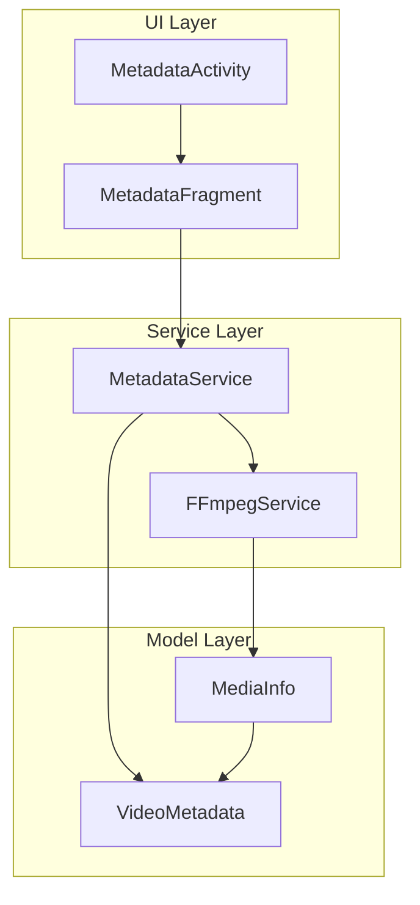
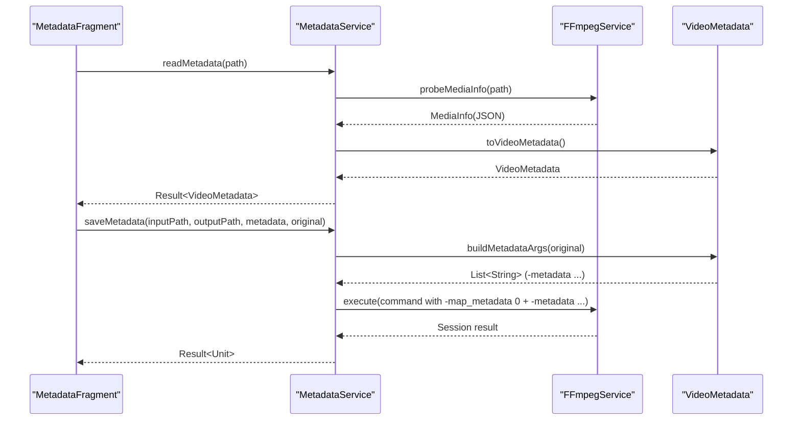
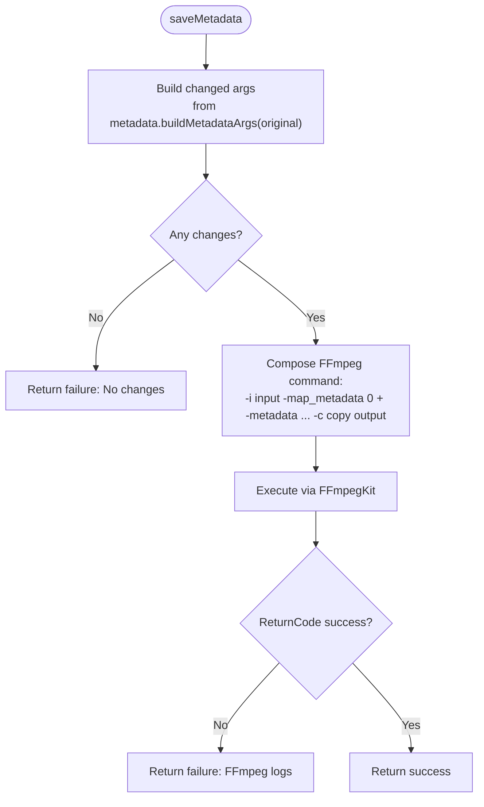
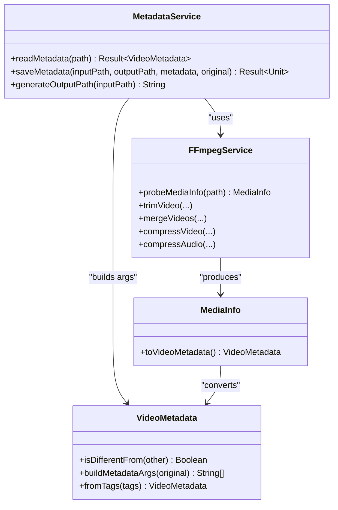

# Metadata Service

<cite>
**Referenced Files in This Document**
- [MetadataService.kt](file://app/src/main/java/com/pisces312/streamclip/service/MetadataService.kt)
- [VideoMetadata.kt](file://app/src/main/java/com/pisces312/streamclip/model/VideoMetadata.kt)
- [FFmpegService.kt](file://app/src/main/java/com/pisces312/streamclip/service/FFmpegService.kt)
- [MediaInfo.kt](file://app/src/main/java/com/pisces312/streamclip/model/MediaInfo.kt)
- [MetadataFragment.kt](file://app/src/main/java/com/pisces312/streamclip/fragment/MetadataFragment.kt)
- [MetadataActivity.kt](file://app/src/main/java/com/pisces312/streamclip/ui/MetadataActivity.kt)
- [fragment_metadata.xml](file://app/src/main/res/layout/fragment_metadata.xml)
- [strings.xml](file://app/src/main/res/values/strings.xml)
</cite>

## Table of Contents
1. [Introduction](#introduction)
2. [Project Structure](#project-structure)
3. [Core Components](#core-components)
4. [Architecture Overview](#architecture-overview)
5. [Detailed Component Analysis](#detailed-component-analysis)
6. [Dependency Analysis](#dependency-analysis)
7. [Performance Considerations](#performance-considerations)
8. [Troubleshooting Guide](#troubleshooting-guide)
9. [Conclusion](#conclusion)

## Introduction
This document describes the MetadataService and its ecosystem for managing video metadata in the StreamClip application. It explains how metadata is extracted, manipulated, and preserved during video processing operations, focusing on:
- Extraction via FFprobe integration
- Format tag management and GPS data handling
- Custom metadata injection and selective updates
- Integration with FFmpegService for trimming, merging, and compression while preserving metadata
- File format compatibility considerations and sidecar metadata file creation
- Practical scenarios, troubleshooting, and best practices

## Project Structure
The metadata subsystem centers around three primary modules:
- MetadataService: orchestrates read/save operations and builds FFmpeg commands
- FFmpegService: provides probing and execution capabilities, including sidecar metadata handling
- Model layer: VideoMetadata and MediaInfo define the data structures and conversion utilities

**Diagram sources**
- [MetadataFragment.kt:26-224](file://app/src/main/java/com/pisces312/streamclip/fragment/MetadataFragment.kt#L26-L224)
- [MetadataActivity.kt:12-37](file://app/src/main/java/com/pisces312/streamclip/ui/MetadataActivity.kt#L12-L37)
- [MetadataService.kt:10-93](file://app/src/main/java/com/pisces312/streamclip/service/MetadataService.kt#L10-L93)
- [FFmpegService.kt:19-420](file://app/src/main/java/com/pisces312/streamclip/service/FFmpegService.kt#L19-L420)
- [VideoMetadata.kt:5-56](file://app/src/main/java/com/pisces312/streamclip/model/VideoMetadata.kt#L5-L56)
- [MediaInfo.kt:5-144](file://app/src/main/java/com/pisces312/streamclip/model/MediaInfo.kt#L5-L144)

**Section sources**
- [MetadataService.kt:10-93](file://app/src/main/java/com/pisces312/streamclip/service/MetadataService.kt#L10-L93)
- [FFmpegService.kt:19-420](file://app/src/main/java/com/pisces312/streamclip/service/FFmpegService.kt#L19-L420)
- [VideoMetadata.kt:5-56](file://app/src/main/java/com/pisces312/streamclip/model/VideoMetadata.kt#L5-L56)
- [MediaInfo.kt:5-144](file://app/src/main/java/com/pisces312/streamclip/model/MediaInfo.kt#L5-L144)

## Core Components
- MetadataService: Provides suspend functions to read metadata from a video file and to save edited metadata to a new output file using FFmpeg with selective metadata updates.
- VideoMetadata: Encapsulates editable metadata fields (title, artist, creation time, location, comment) and supports building FFmpeg -metadata arguments and constructing from format tags.
- FFmpegService: Offers probeMediaInfo for comprehensive media info extraction, and executes FFmpeg commands for trimming, merging, and compression. Includes sidecar metadata file creation for preserving format tags during merge operations.
- MetadataFragment and MetadataActivity: Present a UI for selecting a video, displaying editable metadata fields, and saving changes.

Key responsibilities:
- Read metadata: Uses FFprobe via FFmpegService to obtain MediaInfo, then converts to VideoMetadata.
- Save metadata: Builds a selective FFmpeg command (-metadata per changed field) and copies streams losslessly.
- Preserve metadata during processing: Integrates -map_metadata 0 in trimming/merging/compression commands; merges sidecar metadata for merged outputs.

**Section sources**
- [MetadataService.kt:15-67](file://app/src/main/java/com/pisces312/streamclip/service/MetadataService.kt#L15-L67)
- [VideoMetadata.kt:13-41](file://app/src/main/java/com/pisces312/streamclip/model/VideoMetadata.kt#L13-L41)
- [FFmpegService.kt:56-147](file://app/src/main/java/com/pisces312/streamclip/service/FFmpegService.kt#L56-L147)
- [FFmpegService.kt:246-272](file://app/src/main/java/com/pisces312/streamclip/service/FFmpegService.kt#L246-L272)
- [FFmpegService.kt:297-334](file://app/src/main/java/com/pisces312/streamclip/service/FFmpegService.kt#L297-L334)
- [FFmpegService.kt:355-393](file://app/src/main/java/com/pisces312/streamclip/service/FFmpegService.kt#L355-L393)
- [MetadataFragment.kt:85-114](file://app/src/main/java/com/pisces312/streamclip/fragment/MetadataFragment.kt#L85-L114)
- [MetadataFragment.kt:164-209](file://app/src/main/java/com/pisces312/streamclip/fragment/MetadataFragment.kt#L164-L209)

## Architecture Overview
The metadata workflow integrates UI, service, and model layers with FFmpegKit for probing and transcoding.

**Diagram sources**
- [MetadataService.kt:15-67](file://app/src/main/java/com/pisces312/streamclip/service/MetadataService.kt#L15-L67)
- [FFmpegService.kt:56-147](file://app/src/main/java/com/pisces312/streamclip/service/FFmpegService.kt#L56-L147)
- [VideoMetadata.kt:22-41](file://app/src/main/java/com/pisces312/streamclip/model/VideoMetadata.kt#L22-L41)

## Detailed Component Analysis

### MetadataService
Responsibilities:
- Read metadata: Executes FFprobe via FFmpegService and converts MediaInfo to VideoMetadata.
- Save metadata: Computes changed fields, constructs FFmpeg -metadata arguments, and runs a lossless copy command with -map_metadata 0.
- Output path generation: Creates a deterministic "_meta" suffixed filename.

Implementation highlights:
- Uses Dispatchers.IO for I/O-bound operations.
- Validates FFprobe success and logs failures.
- Builds selective metadata arguments only for changed fields.
- Returns typed Result for success/failure propagation.

**Diagram sources**
- [MetadataService.kt:34-67](file://app/src/main/java/com/pisces312/streamclip/service/MetadataService.kt#L34-L67)
- [VideoMetadata.kt:22-41](file://app/src/main/java/com/pisces312/streamclip/model/VideoMetadata.kt#L22-L41)

**Section sources**
- [MetadataService.kt:15-67](file://app/src/main/java/com/pisces312/streamclip/service/MetadataService.kt#L15-L67)

### VideoMetadata
Responsibilities:
- Holds editable metadata fields and a raw JSON object for unprocessed tags.
- Compares against another VideoMetadata instance to detect differences.
- Generates FFmpeg -metadata arguments for only the differing fields.

Notes:
- GPS location is stored as a string compatible with FFmpeg format "+latitude+longitude/".
- fromTags constructor populates fields from a JSONObject of format tags.

**Section sources**
- [VideoMetadata.kt:5-56](file://app/src/main/java/com/pisces312/streamclip/model/VideoMetadata.kt#L5-L56)

### FFmpegService
Responsibilities:
- probeMediaInfo: Parses ffprobe JSON to produce MediaInfo, including format tags, streams, and derived properties.
- Trimming: Lossless trim using -c copy with -map_metadata 0.
- Merging: Concatenation with -c copy; preserves metadata by writing format tags to a sidecar file and applying them back to the merged output.
- Compression: Video and audio compression with -map_metadata 0 to preserve tags.

Sidecar metadata handling:
- extractTagsToFile: Writes format tags to a temporary text file for later application.
- mergeVideos: After concatenation, writes tags from the first input to a sidecar and reapplies them to the merged output.

**Section sources**
- [FFmpegService.kt:56-147](file://app/src/main/java/com/pisces312/streamclip/service/FFmpegService.kt#L56-L147)
- [FFmpegService.kt:246-272](file://app/src/main/java/com/pisces312/streamclip/service/FFmpegService.kt#L246-L272)
- [FFmpegService.kt:278-291](file://app/src/main/java/com/pisces312/streamclip/service/FFmpegService.kt#L278-L291)
- [FFmpegService.kt:297-334](file://app/src/main/java/com/pisces312/streamclip/service/FFmpegService.kt#L297-L334)
- [FFmpegService.kt:355-393](file://app/src/main/java/com/pisces312/streamclip/service/FFmpegService.kt#L355-L393)

### UI Integration (MetadataFragment and MetadataActivity)
Responsibilities:
- MetadataActivity: Hosts MetadataFragment and forwards external video URIs for direct metadata editing.
- MetadataFragment: Provides a form for title, artist, creation time, location (GPS), and comment; enables save only when changes exist; shows progress and status messages.

User flow:
- Select video via system picker
- Read metadata asynchronously and populate fields
- Edit fields; save button enabled when differences detected
- Save metadata to a generated output path; update UI state on completion

**Section sources**
- [MetadataActivity.kt:12-37](file://app/src/main/java/com/pisces312/streamclip/ui/MetadataActivity.kt#L12-L37)
- [MetadataFragment.kt:85-114](file://app/src/main/java/com/pisces312/streamclip/fragment/MetadataFragment.kt#L85-L114)
- [MetadataFragment.kt:164-209](file://app/src/main/java/com/pisces312/streamclip/fragment/MetadataFragment.kt#L164-L209)
- [fragment_metadata.xml:66-176](file://app/src/main/res/layout/fragment_metadata.xml#L66-L176)
- [strings.xml:194-212](file://app/src/main/res/values/strings.xml#L194-L212)

## Dependency Analysis
MetadataService depends on:
- FFmpegService for probing and executing FFmpeg commands
- VideoMetadata for building selective metadata arguments
- MediaInfo for converting ffprobe JSON into structured metadata

FFmpegService depends on:
- FFprobeKit for probing
- FFmpegKit for transcoding
- MediaInfo and model classes for data representation

**Diagram sources**
- [MetadataService.kt:15-67](file://app/src/main/java/com/pisces312/streamclip/service/MetadataService.kt#L15-L67)
- [FFmpegService.kt:56-147](file://app/src/main/java/com/pisces312/streamclip/service/FFmpegService.kt#L56-L147)
- [VideoMetadata.kt:13-41](file://app/src/main/java/com/pisces312/streamclip/model/VideoMetadata.kt#L13-L41)
- [MediaInfo.kt:142-144](file://app/src/main/java/com/pisces312/streamclip/model/MediaInfo.kt#L142-L144)

**Section sources**
- [MetadataService.kt:15-67](file://app/src/main/java/com/pisces312/streamclip/service/MetadataService.kt#L15-L67)
- [FFmpegService.kt:56-147](file://app/src/main/java/com/pisces312/streamclip/service/FFmpegService.kt#L56-L147)
- [VideoMetadata.kt:13-41](file://app/src/main/java/com/pisces312/streamclip/model/VideoMetadata.kt#L13-L41)
- [MediaInfo.kt:142-144](file://app/src/main/java/com/pisces312/streamclip/model/MediaInfo.kt#L142-L144)

## Performance Considerations
- Lossless operations: Trimming and merging use -c copy to avoid re-encoding, preserving quality and reducing processing time.
- Selective metadata updates: Only changed fields are included in -metadata arguments, minimizing command complexity.
- Sidecar metadata: Writing format tags to a temporary file avoids embedding large metadata blocks into the output container header.
- Concurrency: I/O-bound operations run on Dispatchers.IO to keep the UI responsive.

[No sources needed since this section provides general guidance]

## Troubleshooting Guide
Common issues and resolutions:
- FFprobe failure: Metadata read returns failure; verify file accessibility and format compatibility.
- No changes detected: saveMetadata returns failure when no fields differ; edit at least one field before saving.
- FFmpeg execution failure: Inspect session logs captured in the result; ensure sufficient storage space and correct file paths.
- Metadata not applied: Confirm -map_metadata 0 is present in the executed command and that sidecar metadata was written and reapplied during merge.
- GPS location format: Ensure location follows the "+latitude+longitude/" format expected by FFmpeg.

Operational tips:
- Keep screen on during long operations via SettingsManager flag.
- Use the generated output path to avoid overwriting the input file.
- Validate file permissions and storage availability before processing.

**Section sources**
- [MetadataService.kt:15-67](file://app/src/main/java/com/pisces312/streamclip/service/MetadataService.kt#L15-L67)
- [FFmpegService.kt:246-272](file://app/src/main/java/com/pisces312/streamclip/service/FFmpegService.kt#L246-L272)
- [FFmpegService.kt:297-334](file://app/src/main/java/com/pisces312/streamclip/service/FFmpegService.kt#L297-L334)
- [MetadataFragment.kt:164-209](file://app/src/main/java/com/pisces312/streamclip/fragment/MetadataFragment.kt#L164-L209)
- [strings.xml:204-205](file://app/src/main/res/values/strings.xml#L204-L205)

## Conclusion
The MetadataService provides a robust, lossless pipeline for reading, editing, and preserving video metadata. By leveraging FFmpegService's probing and command execution, it ensures that format tags and GPS data remain intact during trimming, merging, and compression. The selective metadata argument construction minimizes overhead, while sidecar metadata handling guarantees compatibility across diverse file formats. The UI layer offers a straightforward workflow for users to inspect and update metadata safely.