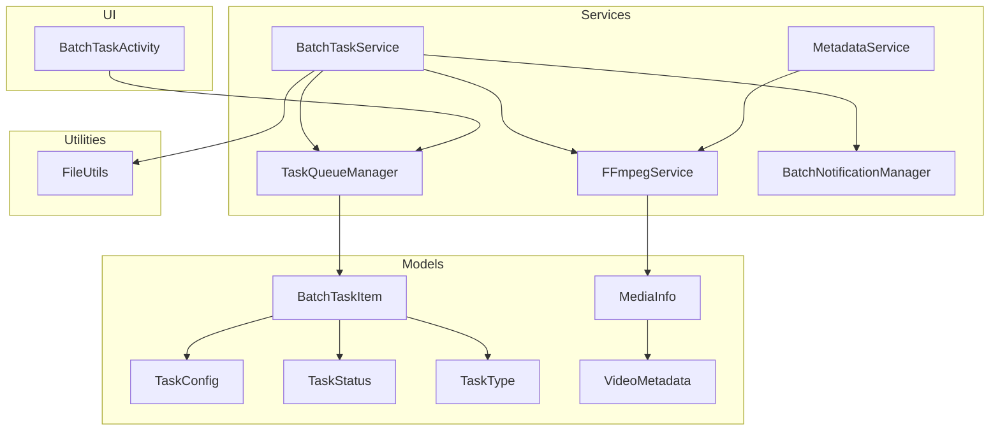
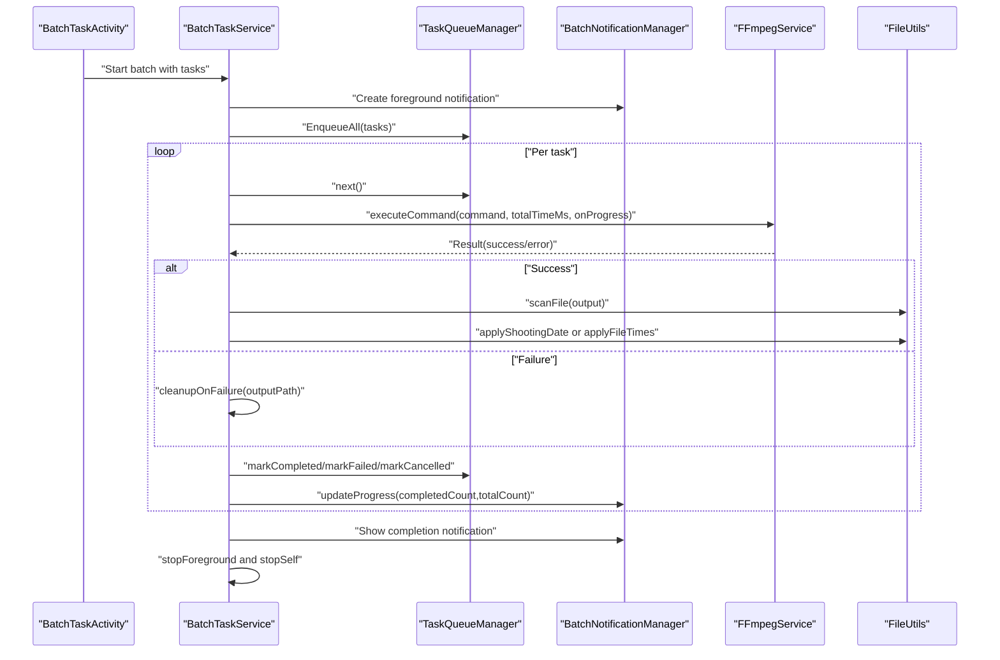
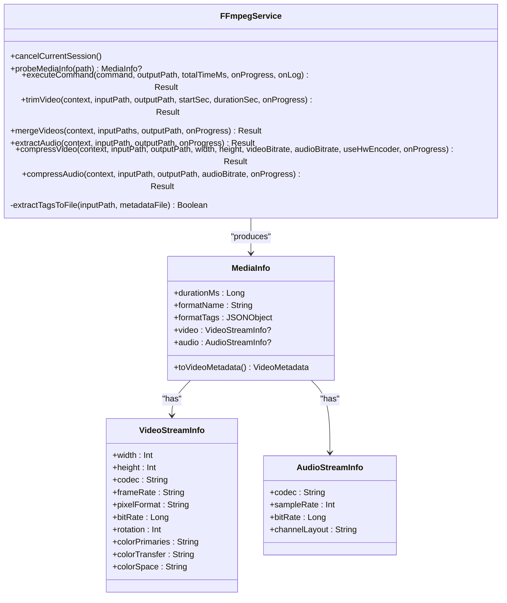
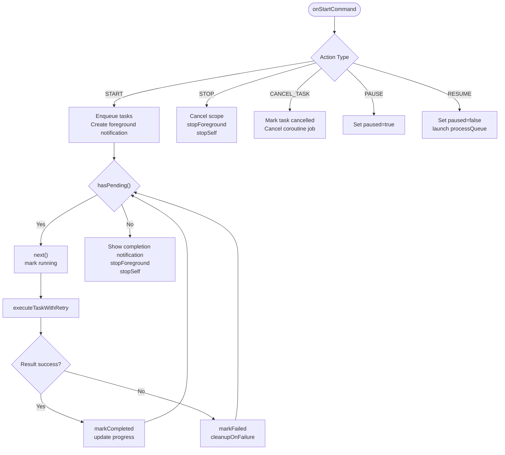
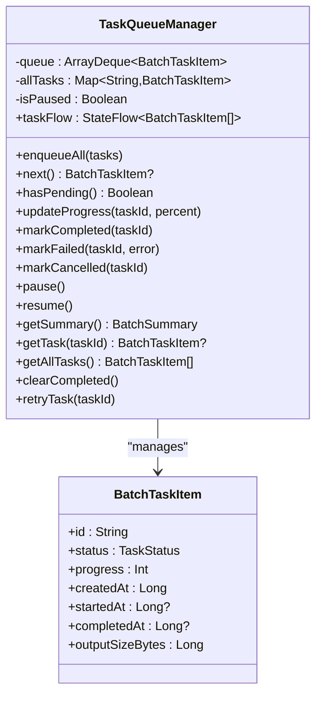
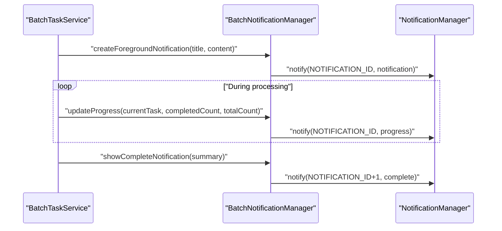
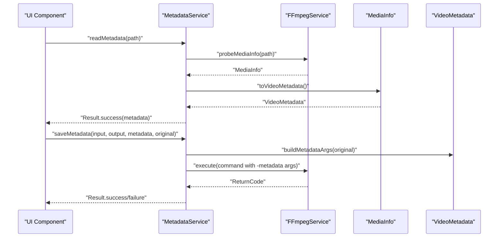
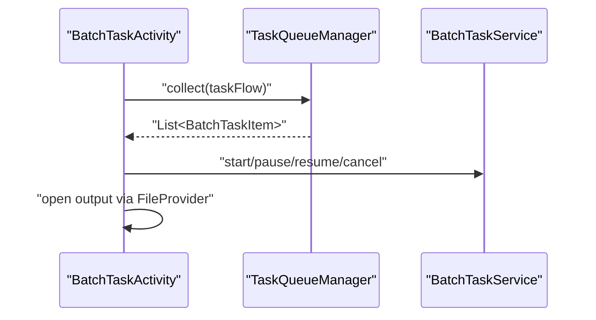
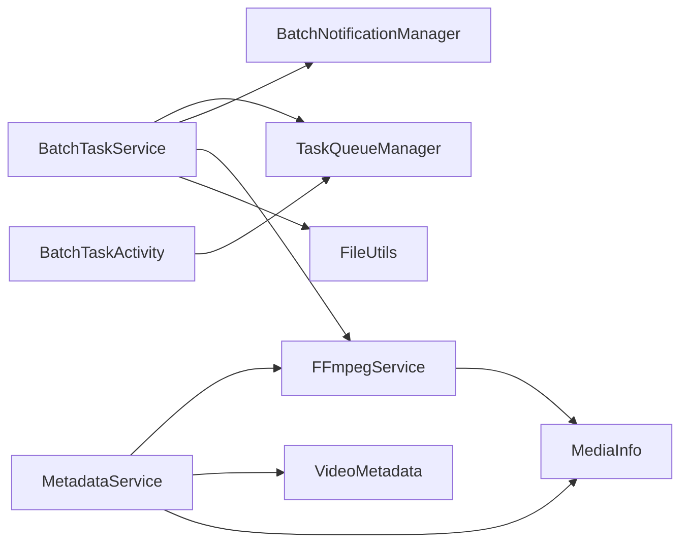

# Service Layer Architecture

<cite>
**Referenced Files in This Document**
- [FFmpegService.kt](file://app/src/main/java/com/pisces312/streamclip/service/FFmpegService.kt)
- [BatchTaskService.kt](file://app/src/main/java/com/pisces312/streamclip/service/BatchTaskService.kt)
- [TaskQueueManager.kt](file://app/src/main/java/com/pisces312/streamclip/service/TaskQueueManager.kt)
- [BatchNotificationManager.kt](file://app/src/main/java/com/pisces312/streamclip/service/BatchNotificationManager.kt)
- [MetadataService.kt](file://app/src/main/java/com/pisces312/streamclip/service/MetadataService.kt)
- [MediaInfo.kt](file://app/src/main/java/com/pisces312/streamclip/model/MediaInfo.kt)
- [BatchTaskItem.kt](file://app/src/main/java/com/pisces312/streamclip/model/BatchTaskItem.kt)
- [TaskConfig.kt](file://app/src/main/java/com/pisces312/streamclip/model/TaskConfig.kt)
- [TaskStatus.kt](file://app/src/main/java/com/pisces312/streamclip/model/TaskStatus.kt)
- [TaskType.kt](file://app/src/main/java/com/pisces312/streamclip/model/TaskType.kt)
- [VideoMetadata.kt](file://app/src/main/java/com/pisces312/streamclip/model/VideoMetadata.kt)
- [FileUtils.kt](file://app/src/main/java/com/pisces312/streamclip/util/FileUtils.kt)
- [BatchTaskActivity.kt](file://app/src/main/java/com/pisces312/streamclip/ui/BatchTaskActivity.kt)
- [AndroidManifest.xml](file://app/src/main/AndroidManifest.xml)
- [build.gradle.kts](file://app/build.gradle.kts)
</cite>

## Table of Contents
1. [Introduction](#introduction)
2. [Project Structure](#project-structure)
3. [Core Components](#core-components)
4. [Architecture Overview](#architecture-overview)
5. [Detailed Component Analysis](#detailed-component-analysis)
6. [Dependency Analysis](#dependency-analysis)
7. [Performance Considerations](#performance-considerations)
8. [Troubleshooting Guide](#troubleshooting-guide)
9. [Conclusion](#conclusion)
10. [Appendices](#appendices)

## Introduction
This document explains StreamClip’s service layer architecture for background video processing. It focuses on the core FFmpegService that orchestrates FFmpeg operations via ffmpeg-kit, the batch processing pipeline driven by BatchTaskService, TaskQueueManager for state management, and BatchNotificationManager for user feedback. It also covers MetadataService for metadata operations and the overall service architecture patterns. The document details asynchronous operation handling, resource management, state maintenance, UI integration, error handling, lifecycle management, performance considerations, and troubleshooting.

## Project Structure
The service layer resides under app/src/main/java/com/pisces312/streamclip/service and integrates with models, utilities, and UI components. Key modules:
- FFmpegService: Singleton for FFmpeg operations, progress tracking, and command execution.
- BatchTaskService: Foreground service managing batch queues, retries, and notifications.
- TaskQueueManager: Shared state manager for task lists and statuses.
- BatchNotificationManager: Foreground notification and actions for batch operations.
- MetadataService: Read/write metadata using FFmpegService and MediaInfo.
- Models: Data structures for tasks, statuses, types, and media metadata.
- Utilities: File handling, scanning, and time manipulation.
- UI: BatchTaskActivity observes task state and opens outputs.

**Diagram sources**
- [BatchTaskService.kt:26-301](file://app/src/main/java/com/pisces312/streamclip/service/BatchTaskService.kt#L26-L301)
- [TaskQueueManager.kt:10-146](file://app/src/main/java/com/pisces312/streamclip/service/TaskQueueManager.kt#L10-L146)
- [BatchNotificationManager.kt:17-137](file://app/src/main/java/com/pisces312/streamclip/service/BatchNotificationManager.kt#L17-L137)
- [FFmpegService.kt:19-420](file://app/src/main/java/com/pisces312/streamclip/service/FFmpegService.kt#L19-L420)
- [MetadataService.kt:10-93](file://app/src/main/java/com/pisces312/streamclip/service/MetadataService.kt#L10-L93)
- [BatchTaskItem.kt:5-32](file://app/src/main/java/com/pisces312/streamclip/model/BatchTaskItem.kt#L5-L32)
- [TaskConfig.kt:5-15](file://app/src/main/java/com/pisces312/streamclip/model/TaskConfig.kt#L5-L15)
- [TaskStatus.kt:3-11](file://app/src/main/java/com/pisces312/streamclip/model/TaskStatus.kt#L3-L11)
- [TaskType.kt:3-8](file://app/src/main/java/com/pisces312/streamclip/model/TaskType.kt#L3-L8)
- [MediaInfo.kt:5-165](file://app/src/main/java/com/pisces312/streamclip/model/MediaInfo.kt#L5-L165)
- [VideoMetadata.kt:5-56](file://app/src/main/java/com/pisces312/streamclip/model/VideoMetadata.kt#L5-L56)
- [FileUtils.kt:17-362](file://app/src/main/java/com/pisces312/streamclip/util/FileUtils.kt#L17-L362)
- [BatchTaskActivity.kt:18-89](file://app/src/main/java/com/pisces312/streamclip/ui/BatchTaskActivity.kt#L18-L89)

**Section sources**
- [AndroidManifest.xml:120-124](file://app/src/main/AndroidManifest.xml#L120-L124)
- [build.gradle.kts:74-75](file://app/build.gradle.kts#L74-L75)

## Core Components
- FFmpegService: Singleton implementing ffmpeg-kit integration, command execution, progress estimation, and cancellation. Provides specialized operations (trim, merge, extract, compress, compress audio) and media probing.
- BatchTaskService: Foreground service handling batch queues, per-task coroutines, retries, cancellation, and progress notifications.
- TaskQueueManager: Shared state holder for tasks, counts, and status transitions with StateFlow emission.
- BatchNotificationManager: Foreground notification lifecycle and actions for pause/cancel/complete.
- MetadataService: Wraps FFmpegService for metadata read/write using VideoMetadata and MediaInfo.
- Models and Utilities: Define task structures, statuses, media info, and file/time utilities.

**Section sources**
- [FFmpegService.kt:19-420](file://app/src/main/java/com/pisces312/streamclip/service/FFmpegService.kt#L19-L420)
- [BatchTaskService.kt:26-301](file://app/src/main/java/com/pisces312/streamclip/service/BatchTaskService.kt#L26-L301)
- [TaskQueueManager.kt:10-146](file://app/src/main/java/com/pisces312/streamclip/service/TaskQueueManager.kt#L10-L146)
- [BatchNotificationManager.kt:17-137](file://app/src/main/java/com/pisces312/streamclip/service/BatchNotificationManager.kt#L17-L137)
- [MetadataService.kt:10-93](file://app/src/main/java/com/pisces312/streamclip/service/MetadataService.kt#L10-L93)
- [MediaInfo.kt:5-165](file://app/src/main/java/com/pisces312/streamclip/model/MediaInfo.kt#L5-L165)
- [BatchTaskItem.kt:5-32](file://app/src/main/java/com/pisces312/streamclip/model/BatchTaskItem.kt#L5-L32)
- [TaskConfig.kt:5-15](file://app/src/main/java/com/pisces312/streamclip/model/TaskConfig.kt#L5-L15)
- [TaskStatus.kt:3-11](file://app/src/main/java/com/pisces312/streamclip/model/TaskStatus.kt#L3-L11)
- [TaskType.kt:3-8](file://app/src/main/java/com/pisces312/streamclip/model/TaskType.kt#L3-L8)
- [VideoMetadata.kt:5-56](file://app/src/main/java/com/pisces312/streamclip/model/VideoMetadata.kt#L5-L56)
- [FileUtils.kt:17-362](file://app/src/main/java/com/pisces312/streamclip/util/FileUtils.kt#L17-L362)

## Architecture Overview
The service layer follows a layered design:
- UI triggers operations (e.g., batch start, metadata edits).
- Services coordinate background work with coroutines and ffmpeg-kit.
- TaskQueueManager centralizes state for UI observation.
- Notifications keep users informed during long-running tasks.
- MetadataService leverages FFmpegService and MediaInfo for tag manipulation.

**Diagram sources**
- [BatchTaskService.kt:92-240](file://app/src/main/java/com/pisces312/streamclip/service/BatchTaskService.kt#L92-L240)
- [TaskQueueManager.kt:24-86](file://app/src/main/java/com/pisces312/streamclip/service/TaskQueueManager.kt#L24-L86)
- [BatchNotificationManager.kt:40-89](file://app/src/main/java/com/pisces312/streamclip/service/BatchNotificationManager.kt#L40-L89)
- [FFmpegService.kt:152-241](file://app/src/main/java/com/pisces312/streamclip/service/FFmpegService.kt#L152-L241)
- [FileUtils.kt:268-331](file://app/src/main/java/com/pisces312/streamclip/util/FileUtils.kt#L268-L331)

## Detailed Component Analysis

### FFmpegService
FFmpegService is a singleton coordinating FFmpeg operations via ffmpeg-kit:
- Singleton pattern: object declaration ensures single instance across the app.
- ffmpeg-kit integration: executes async commands with callbacks for logs and statistics.
- Command execution management:
  - executeCommand: wraps async execution, captures return code, and resumes coroutine with Result.
  - trimVideo, mergeVideos, extractAudio, compressVideo, compressAudio: build ffmpeg arguments and reuse executeCommand.
- Progress tracking:
  - StatisticsCallback computes percentage from session time vs. total duration.
  - Estimated remaining time derived from elapsed time and progress.
  - Output size updates via file length.
- Cancellation:
  - cancelCurrentSession cancels the current ffmpeg session.
  - invokeOnCancellation cancels ffmpeg on coroutine cancellation.
- Media probing:
  - probeMediaInfo parses ffprobe JSON to produce MediaInfo with video/audio streams and format tags.
  - Extracts color primaries/transfers/spaces and rotation from side data.

**Diagram sources**
- [FFmpegService.kt:19-420](file://app/src/main/java/com/pisces312/streamclip/service/FFmpegService.kt#L19-L420)
- [MediaInfo.kt:5-165](file://app/src/main/java/com/pisces312/streamclip/model/MediaInfo.kt#L5-L165)

**Section sources**
- [FFmpegService.kt:19-420](file://app/src/main/java/com/pisces312/streamclip/service/FFmpegService.kt#L19-L420)
- [MediaInfo.kt:5-165](file://app/src/main/java/com/pisces312/streamclip/model/MediaInfo.kt#L5-L165)

### BatchTaskService
BatchTaskService runs as a foreground service to process queued tasks:
- Lifecycle:
  - onStartCommand handles start/stop/cancel/pause/resume actions.
  - Foreground notification created with BatchNotificationManager.
  - stopSelf invoked after completion.
- Queue processing:
  - processQueue loops while tasks remain and service is running.
  - next() retrieves the next task and marks it running.
  - executeTaskWithRetry performs up to N retries with delays.
- Per-task execution:
  - Builds command based on TaskType and CompressConfig.
  - Uses FFmpegService.executeCommand with onProgress updating TaskQueueManager and notifications.
  - On success: scans file, applies shooting date or original file times.
  - On failure: deletes partial output.
- Cancellation and pause/resume:
  - Individual task cancellation tracked via runningTaskJobs.
  - Pause/resume toggles queue processing state.

**Diagram sources**
- [BatchTaskService.kt:79-165](file://app/src/main/java/com/pisces312/streamclip/service/BatchTaskService.kt#L79-L165)
- [BatchTaskService.kt:167-240](file://app/src/main/java/com/pisces312/streamclip/service/BatchTaskService.kt#L167-L240)
- [TaskQueueManager.kt:32-86](file://app/src/main/java/com/pisces312/streamclip/service/TaskQueueManager.kt#L32-L86)

**Section sources**
- [BatchTaskService.kt:26-301](file://app/src/main/java/com/pisces312/streamclip/service/BatchTaskService.kt#L26-L301)
- [TaskQueueManager.kt:10-146](file://app/src/main/java/com/pisces312/streamclip/service/TaskQueueManager.kt#L10-L146)

### TaskQueueManager
TaskQueueManager is a shared state holder:
- Thread-safe queue and map of tasks with synchronized updates.
- Exposes StateFlow taskFlow for UI observation.
- Supports pause/resume, progress updates, status transitions, retry, and cleanup.

**Diagram sources**
- [TaskQueueManager.kt:10-146](file://app/src/main/java/com/pisces312/streamclip/service/TaskQueueManager.kt#L10-L146)
- [BatchTaskItem.kt:5-32](file://app/src/main/java/com/pisces312/streamclip/model/BatchTaskItem.kt#L5-L32)

**Section sources**
- [TaskQueueManager.kt:10-146](file://app/src/main/java/com/pisces312/streamclip/service/TaskQueueManager.kt#L10-L146)
- [BatchTaskItem.kt:5-32](file://app/src/main/java/com/pisces312/streamclip/model/BatchTaskItem.kt#L5-L32)

### BatchNotificationManager
BatchNotificationManager manages foreground notifications:
- Creates notification channel for Android O+.
- Builds ongoing foreground notification with actions for pause and cancel.
- Updates progress with current task and queue totals.
- Shows completion notification with summary.

**Diagram sources**
- [BatchNotificationManager.kt:40-121](file://app/src/main/java/com/pisces312/streamclip/service/BatchNotificationManager.kt#L40-L121)
- [BatchTaskService.kt:112-160](file://app/src/main/java/com/pisces312/streamclip/service/BatchTaskService.kt#L112-L160)

**Section sources**
- [BatchNotificationManager.kt:17-137](file://app/src/main/java/com/pisces312/streamclip/service/BatchNotificationManager.kt#L17-L137)

### MetadataService
MetadataService reads and writes video metadata:
- readMetadata: probes MediaInfo and converts to VideoMetadata.
- saveMetadata: builds -metadata arguments for changed fields and executes FFmpeg with -c copy.
- generateOutputPath: creates output path with “_meta” suffix.

**Diagram sources**
- [MetadataService.kt:15-67](file://app/src/main/java/com/pisces312/streamclip/service/MetadataService.kt#L15-L67)
- [FFmpegService.kt:56-147](file://app/src/main/java/com/pisces312/streamclip/service/FFmpegService.kt#L56-L147)
- [MediaInfo.kt:142-144](file://app/src/main/java/com/pisces312/streamclip/model/MediaInfo.kt#L142-L144)
- [VideoMetadata.kt:22-41](file://app/src/main/java/com/pisces312/streamclip/model/VideoMetadata.kt#L22-L41)

**Section sources**
- [MetadataService.kt:10-93](file://app/src/main/java/com/pisces312/streamclip/service/MetadataService.kt#L10-L93)
- [MediaInfo.kt:5-165](file://app/src/main/java/com/pisces312/streamclip/model/MediaInfo.kt#L5-L165)
- [VideoMetadata.kt:5-56](file://app/src/main/java/com/pisces312/streamclip/model/VideoMetadata.kt#L5-L56)

### Integration with UI Components
- BatchTaskActivity observes TaskQueueManager.taskFlow to render task list and empty state.
- Actions: retry, cancel, open output file via FileProvider.
- Foreground service registration in AndroidManifest enables persistent notifications.

**Diagram sources**
- [BatchTaskActivity.kt:69-82](file://app/src/main/java/com/pisces312/streamclip/ui/BatchTaskActivity.kt#L69-L82)
- [TaskQueueManager.kt:13-14](file://app/src/main/java/com/pisces312/streamclip/service/TaskQueueManager.kt#L13-L14)
- [AndroidManifest.xml:120-124](file://app/src/main/AndroidManifest.xml#L120-L124)

**Section sources**
- [BatchTaskActivity.kt:18-89](file://app/src/main/java/com/pisces312/streamclip/ui/BatchTaskActivity.kt#L18-L89)
- [AndroidManifest.xml:120-124](file://app/src/main/AndroidManifest.xml#L120-L124)

## Dependency Analysis
- FFmpegService depends on ffmpeg-kit and MediaInfo for parsing.
- BatchTaskService depends on TaskQueueManager, BatchNotificationManager, FFmpegService, and FileUtils.
- MetadataService depends on FFmpegService and VideoMetadata/MediaInfo.
- UI components depend on TaskQueueManager for reactive updates.

**Diagram sources**
- [FFmpegService.kt:19-420](file://app/src/main/java/com/pisces312/streamclip/service/FFmpegService.kt#L19-L420)
- [BatchTaskService.kt:26-301](file://app/src/main/java/com/pisces312/streamclip/service/BatchTaskService.kt#L26-L301)
- [TaskQueueManager.kt:10-146](file://app/src/main/java/com/pisces312/streamclip/service/TaskQueueManager.kt#L10-L146)
- [BatchNotificationManager.kt:17-137](file://app/src/main/java/com/pisces312/streamclip/service/BatchNotificationManager.kt#L17-L137)
- [MetadataService.kt:10-93](file://app/src/main/java/com/pisces312/streamclip/service/MetadataService.kt#L10-L93)
- [BatchTaskActivity.kt:18-89](file://app/src/main/java/com/pisces312/streamclip/ui/BatchTaskActivity.kt#L18-L89)

**Section sources**
- [build.gradle.kts:74-75](file://app/build.gradle.kts#L74-L75)

## Performance Considerations
- Concurrency and cancellation:
  - Coroutines with SupervisorJob isolate child failures; individual task jobs stored for targeted cancellation.
  - invokeOnCancellation ensures ffmpeg-kit sessions are cancelled promptly.
- Progress estimation:
  - Uses StatisticsCallback time and total duration to compute percentage and remaining time.
  - Output size updates help monitor disk usage.
- Resource management:
  - Temporary files for concat lists and metadata sidecars are cleaned up after use.
  - Media scanning via MediaScannerConnection to expose outputs immediately.
- Background processing limitations:
  - Foreground service required for long-running operations; ensure appropriate notification channels and permissions.
  - Hardware encoders may vary by device; software fallbacks are supported.
- Memory and I/O:
  - BatchTaskService deletes partial outputs on failure to prevent disk accumulation.
  - FileUtils provides safe file time handling and formatted display helpers.

[No sources needed since this section provides general guidance]

## Troubleshooting Guide
Common issues and resolutions:
- FFmpeg command failures:
  - Check return code and logs via Result.error; review onLog callbacks for detailed messages.
  - Validate input paths and ensure sufficient storage space.
- Progress not updating:
  - Verify totalTimeMs is available; probeMediaInfo durationMs used when missing.
  - Ensure StatisticsCallback is attached when progress is required.
- Partial output remains on failure:
  - BatchTaskService automatically deletes output on failure; confirm cleanup executed.
- Metadata not applied:
  - MetadataService.saveMetadata requires changed fields; ensure buildMetadataArgs produces arguments.
- Foreground service and notifications:
  - Confirm foreground service type and notification channel are configured; verify POST_NOTIFICATIONS permission on Android 13+.
- Permissions:
  - MANAGE_EXTERNAL_STORAGE or scoped read/write/media permissions required depending on Android version.

**Section sources**
- [FFmpegService.kt:152-241](file://app/src/main/java/com/pisces312/streamclip/service/FFmpegService.kt#L152-L241)
- [BatchTaskService.kt:257-263](file://app/src/main/java/com/pisces312/streamclip/service/BatchTaskService.kt#L257-L263)
- [MetadataService.kt:34-67](file://app/src/main/java/com/pisces312/streamclip/service/MetadataService.kt#L34-L67)
- [AndroidManifest.xml:20-26](file://app/src/main/AndroidManifest.xml#L20-L26)

## Conclusion
StreamClip’s service layer cleanly separates concerns: FFmpegService encapsulates FFmpeg operations and progress, BatchTaskService orchestrates batch execution with robust state and notifications, TaskQueueManager provides reactive task state, and MetadataService offers lossless metadata editing. The architecture balances asynchronous execution, resource safety, and user feedback, enabling reliable background video processing on Android.

[No sources needed since this section summarizes without analyzing specific files]

## Appendices
- Example usage patterns:
  - Start batch: Build BatchTaskItem list, call BatchTaskService.start(context, tasks), observe TaskQueueManager.taskFlow in UI.
  - Metadata edit: Call MetadataService.readMetadata, modify VideoMetadata, call MetadataService.saveMetadata with changed args.
  - Progress handling: Pass onProgress to FFmpegService.executeCommand to receive periodic updates.
- Lifecycle management:
  - Foreground service lifecycle handled by BatchTaskService; ensure stopSelf called after completion.
  - Cancellation via cancelCurrentSession or coroutine cancellation propagates to ffmpeg-kit.

[No sources needed since this section provides general guidance]