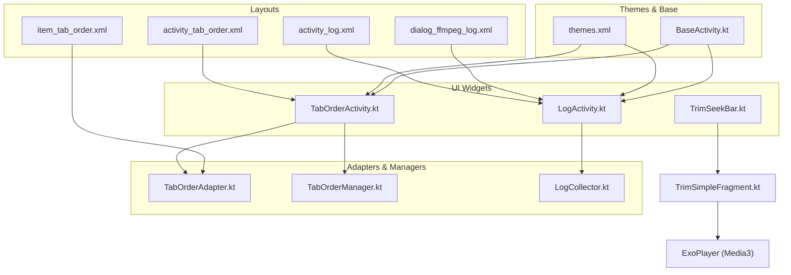
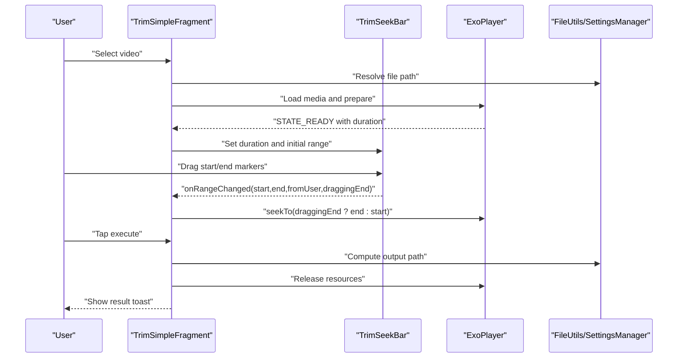
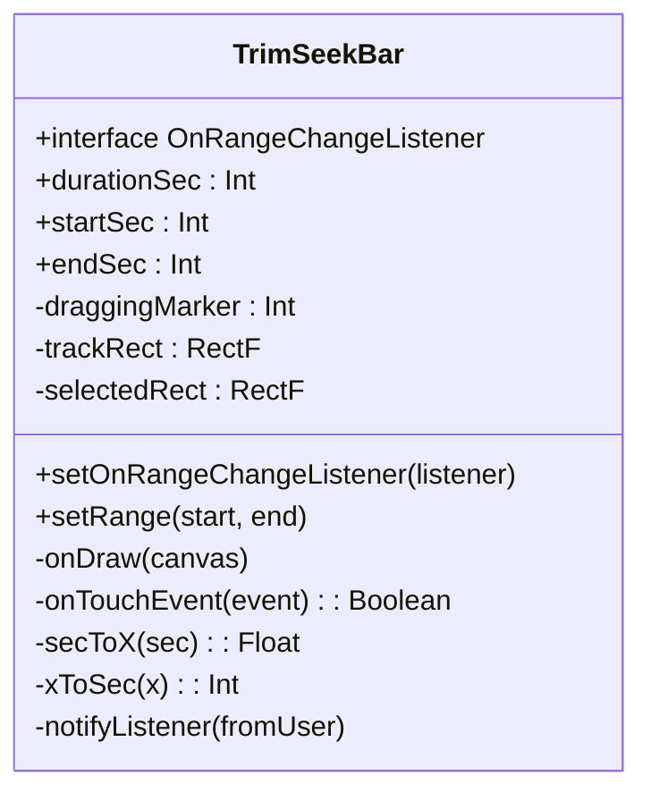
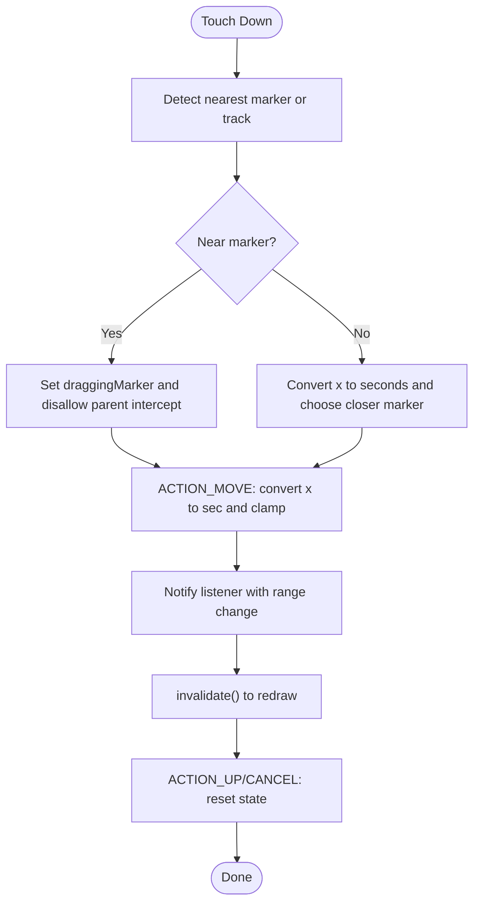
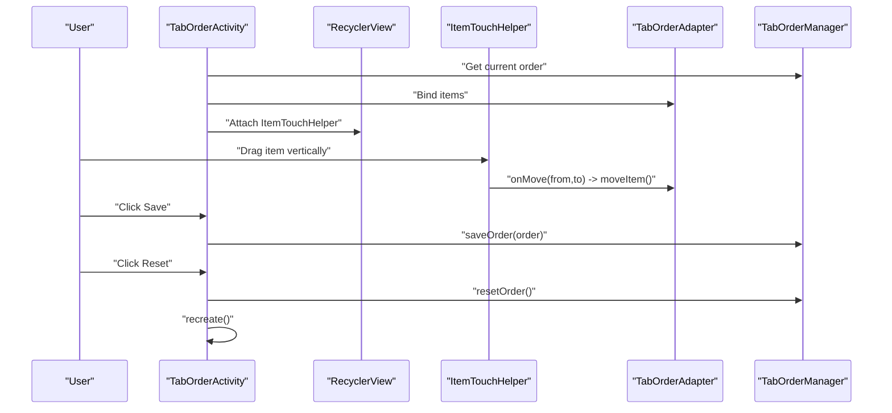
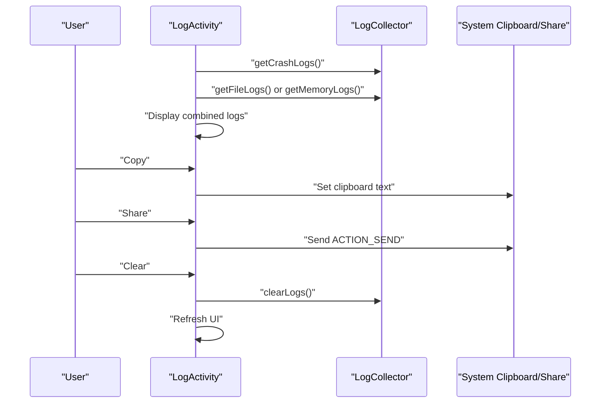
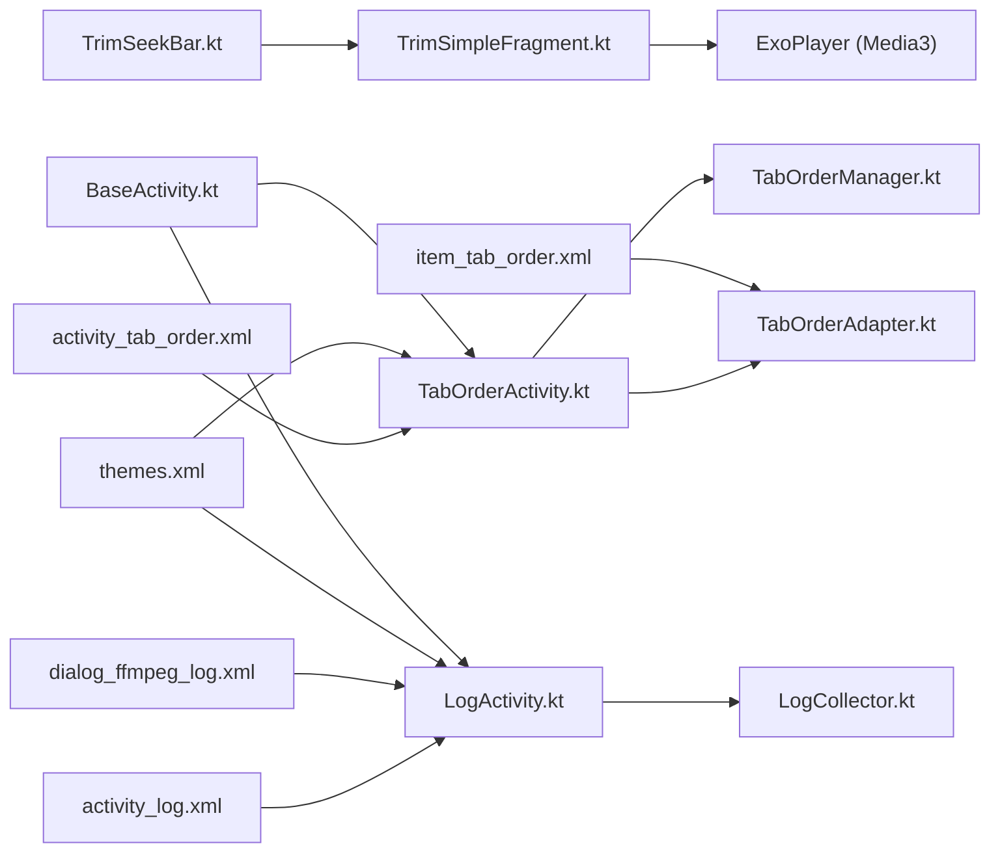

# Custom UI Widgets

<cite>
**Referenced Files in This Document**
- [TrimSeekBar.kt](file://app/src/main/java/com/pisces312/streamclip/ui/TrimSeekBar.kt)
- [TabOrderActivity.kt](file://app/src/main/java/com/pisces312/streamclip/ui/TabOrderActivity.kt)
- [TabOrderAdapter.kt](file://app/src/main/java/com/pisces312/streamclip/adapter/TabOrderAdapter.kt)
- [TabOrderManager.kt](file://app/src/main/java/com/pisces312/streamclip/util/TabOrderManager.kt)
- [TrimSimpleFragment.kt](file://app/src/main/java/com/pisces312/streamclip/fragment/TrimSimpleFragment.kt)
- [Trim2Fragment.kt](file://app/src/main/java/com/pisces312/streamclip/fragment/Trim2Fragment.kt)
- [LogActivity.kt](file://app/src/main/java/com/pisces312/streamclip/LogActivity.kt)
- [LogCollector.kt](file://app/src/main/java/com/pisces312/streamclip/util/LogCollector.kt)
- [activity_tab_order.xml](file://app/src/main/res/layout/activity_tab_order.xml)
- [item_tab_order.xml](file://app/src/main/res/layout/item_tab_order.xml)
- [activity_log.xml](file://app/src/main/res/layout/activity_log.xml)
- [dialog_ffmpeg_log.xml](file://app/src/main/res/layout/dialog_ffmpeg_log.xml)
- [themes.xml](file://app/src/main/res/values/themes.xml)
- [BaseActivity.kt](file://app/src/main/java/com/pisces312/streamclip/BaseActivity.kt)
</cite>

## Table of Contents
1. [Introduction](#introduction)
2. [Project Structure](#project-structure)
3. [Core Components](#core-components)
4. [Architecture Overview](#architecture-overview)
5. [Detailed Component Analysis](#detailed-component-analysis)
6. [Dependency Analysis](#dependency-analysis)
7. [Performance Considerations](#performance-considerations)
8. [Troubleshooting Guide](#troubleshooting-guide)
9. [Conclusion](#conclusion)

## Introduction
This document focuses on StreamClip’s custom UI widgets and specialized components that enhance user interaction and visual feedback. It covers:
- TrimSeekBar: a custom seek bar for precise time-range selection with visual indicators, drag gesture handling, and snapping behavior.
- TabOrderActivity: a drag-and-drop interface for customizing tab arrangement, including touch handling, visual feedback, and persistence of user preferences.
- Custom dialogs for log viewing, crash reporting, and help systems.
- Material Design 3 usage, custom styling, and responsive layout adaptations.
- Widget lifecycle management, state preservation, and integration with the main application flow.
- Accessibility considerations, touch target sizing, and cross-device compatibility.
- Performance optimization and memory management for complex UI hierarchies.

## Project Structure
The custom UI widgets are implemented across dedicated UI classes, adapters, activities, fragments, and supporting utilities. Layouts define the visual structure and Material 3 components, while themes and resources provide consistent styling.

**Diagram sources**
- [TrimSeekBar.kt:1-238](file://app/src/main/java/com/pisces312/streamclip/ui/TrimSeekBar.kt#L1-L238)
- [TabOrderActivity.kt:1-93](file://app/src/main/java/com/pisces312/streamclip/ui/TabOrderActivity.kt#L1-L93)
- [TabOrderAdapter.kt:1-45](file://app/src/main/java/com/pisces312/streamclip/adapter/TabOrderAdapter.kt#L1-L45)
- [TabOrderManager.kt:1-62](file://app/src/main/java/com/pisces312/streamclip/util/TabOrderManager.kt#L1-L62)
- [TrimSimpleFragment.kt:1-387](file://app/src/main/java/com/pisces312/streamclip/fragment/TrimSimpleFragment.kt#L1-L387)
- [LogActivity.kt:1-126](file://app/src/main/java/com/pisces312/streamclip/LogActivity.kt#L1-L126)
- [LogCollector.kt:1-202](file://app/src/main/java/com/pisces312/streamclip/util/LogCollector.kt#L1-L202)
- [activity_tab_order.xml:1-53](file://app/src/main/res/layout/activity_tab_order.xml#L1-L53)
- [item_tab_order.xml:1-34](file://app/src/main/res/layout/item_tab_order.xml#L1-L34)
- [activity_log.xml:1-35](file://app/src/main/res/layout/activity_log.xml#L1-L35)
- [dialog_ffmpeg_log.xml:1-154](file://app/src/main/res/layout/dialog_ffmpeg_log.xml#L1-L154)
- [themes.xml:1-30](file://app/src/main/res/values/themes.xml#L1-L30)
- [BaseActivity.kt:1-14](file://app/src/main/java/com/pisces312/streamclip/BaseActivity.kt#L1-L14)

**Section sources**
- [TrimSeekBar.kt:1-238](file://app/src/main/java/com/pisces312/streamclip/ui/TrimSeekBar.kt#L1-L238)
- [TabOrderActivity.kt:1-93](file://app/src/main/java/com/pisces312/streamclip/ui/TabOrderActivity.kt#L1-L93)
- [TabOrderAdapter.kt:1-45](file://app/src/main/java/com/pisces312/streamclip/adapter/TabOrderAdapter.kt#L1-L45)
- [TabOrderManager.kt:1-62](file://app/src/main/java/com/pisces312/streamclip/util/TabOrderManager.kt#L1-L62)
- [TrimSimpleFragment.kt:1-387](file://app/src/main/java/com/pisces312/streamclip/fragment/TrimSimpleFragment.kt#L1-L387)
- [LogActivity.kt:1-126](file://app/src/main/java/com/pisces312/streamclip/LogActivity.kt#L1-L126)
- [LogCollector.kt:1-202](file://app/src/main/java/com/pisces312/streamclip/util/LogCollector.kt#L1-L202)
- [activity_tab_order.xml:1-53](file://app/src/main/res/layout/activity_tab_order.xml#L1-L53)
- [item_tab_order.xml:1-34](file://app/src/main/res/layout/item_tab_order.xml#L1-L34)
- [activity_log.xml:1-35](file://app/src/main/res/layout/activity_log.xml#L1-L35)
- [dialog_ffmpeg_log.xml:1-154](file://app/src/main/res/layout/dialog_ffmpeg_log.xml#L1-L154)
- [themes.xml:1-30](file://app/src/main/res/values/themes.xml#L1-L30)
- [BaseActivity.kt:1-14](file://app/src/main/java/com/pisces312/streamclip/BaseActivity.kt#L1-L14)

## Core Components
- TrimSeekBar: A custom View implementing a two-handle range selector with visual markers, precise time snapping, and drag gesture handling. It notifies listeners of range changes and supports programmatic updates.
- TabOrderActivity: An activity enabling drag-and-drop reordering of tabs via RecyclerView and ItemTouchHelper, with save/reset actions and persistent storage.
- LogActivity: A screen displaying combined crash and runtime logs with copy/share/clear actions and a floating scroll-to-bottom button.
- Supporting utilities: TabOrderManager persists tab order; LogCollector aggregates logs in-memory and to disk, including crash logs.

**Section sources**
- [TrimSeekBar.kt:16-238](file://app/src/main/java/com/pisces312/streamclip/ui/TrimSeekBar.kt#L16-L238)
- [TabOrderActivity.kt:14-93](file://app/src/main/java/com/pisces312/streamclip/ui/TabOrderActivity.kt#L14-L93)
- [LogActivity.kt:18-126](file://app/src/main/java/com/pisces312/streamclip/LogActivity.kt#L18-L126)
- [TabOrderManager.kt:7-62](file://app/src/main/java/com/pisces312/streamclip/util/TabOrderManager.kt#L7-L62)
- [LogCollector.kt:15-202](file://app/src/main/java/com/pisces312/streamclip/util/LogCollector.kt#L15-L202)

## Architecture Overview
The custom UI widgets integrate with fragments and activities to deliver cohesive user experiences. TrimSimpleFragment integrates TrimSeekBar and ExoPlayer for playback and trimming. TabOrderActivity orchestrates drag-and-drop ordering and persists preferences. LogActivity surfaces collected logs and provides sharing/copying capabilities.

**Diagram sources**
- [TrimSimpleFragment.kt:88-123](file://app/src/main/java/com/pisces312/streamclip/fragment/TrimSimpleFragment.kt#L88-L123)
- [TrimSeekBar.kt:67-75](file://app/src/main/java/com/pisces312/streamclip/ui/TrimSeekBar.kt#L67-L75)
- [TrimSimpleFragment.kt:224-286](file://app/src/main/java/com/pisces312/streamclip/fragment/TrimSimpleFragment.kt#L224-L286)

**Section sources**
- [TrimSimpleFragment.kt:88-123](file://app/src/main/java/com/pisces312/streamclip/fragment/TrimSimpleFragment.kt#L88-L123)
- [TrimSeekBar.kt:67-75](file://app/src/main/java/com/pisces312/streamclip/ui/TrimSeekBar.kt#L67-L75)
- [TrimSimpleFragment.kt:224-286](file://app/src/main/java/com/pisces312/streamclip/fragment/TrimSimpleFragment.kt#L224-L286)

## Detailed Component Analysis

### TrimSeekBar: Custom Range Selector
TrimSeekBar renders a rounded track with selected-range highlighting and bracket-shaped markers for start and end positions. It handles touch events to detect proximity to markers, initiates drags, and enforces constraints so markers never overlap. It converts between seconds and X-pixel coordinates and notifies a listener of changes.

Key behaviors:
- Visual rendering: background track, selected region, and bracket markers.
- Touch handling: ACTION_DOWN detects nearest marker or seeks track; ACTION_MOVE drags the active marker; ACTION_UP ends drag.
- Constraints: start < end; neither exceeds duration; snapping to integer seconds.
- Listener notifications: start, end, origin flag, and whether the end marker was dragged.

**Diagram sources**
- [TrimSeekBar.kt:20-238](file://app/src/main/java/com/pisces312/streamclip/ui/TrimSeekBar.kt#L20-L238)

**Section sources**
- [TrimSeekBar.kt:16-238](file://app/src/main/java/com/pisces312/streamclip/ui/TrimSeekBar.kt#L16-L238)

#### TrimSeekBar Interaction Flow

**Diagram sources**
- [TrimSeekBar.kt:162-214](file://app/src/main/java/com/pisces312/streamclip/ui/TrimSeekBar.kt#L162-L214)

### TabOrderActivity: Drag-and-Drop Tab Reordering
TabOrderActivity builds a list of tabs from TabOrderManager, binds them to TabOrderAdapter, and enables drag-and-drop reordering via ItemTouchHelper. Save persists the new order; Reset restores defaults and refreshes the list.

Highlights:
- RecyclerView with LinearLayoutManager and ItemTouchHelper.SimpleCallback configured for vertical drag.
- Adapter moveItem updates internal list and notifies item movement.
- Save writes order to SharedPreferences; Reset clears stored preference and recreates activity.

**Diagram sources**
- [TabOrderActivity.kt:43-86](file://app/src/main/java/com/pisces312/streamclip/ui/TabOrderActivity.kt#L43-L86)
- [TabOrderAdapter.kt:37-41](file://app/src/main/java/com/pisces312/streamclip/adapter/TabOrderAdapter.kt#L37-L41)
- [TabOrderManager.kt:32-60](file://app/src/main/java/com/pisces312/streamclip/util/TabOrderManager.kt#L32-L60)

**Section sources**
- [TabOrderActivity.kt:14-93](file://app/src/main/java/com/pisces312/streamclip/ui/TabOrderActivity.kt#L14-L93)
- [TabOrderAdapter.kt:1-45](file://app/src/main/java/com/pisces312/streamclip/adapter/TabOrderAdapter.kt#L1-L45)
- [TabOrderManager.kt:7-62](file://app/src/main/java/com/pisces312/streamclip/util/TabOrderManager.kt#L7-L62)

### LogActivity and LogCollector: Logging and Sharing
LogActivity aggregates crash logs (if present) and runtime logs (file or memory), displays them in a scrollable TextView, and provides actions to copy, share, and clear logs. LogCollector maintains an in-memory ring buffer and writes to a rotating log file, including crash logs.

Key features:
- Load crash logs first, then append file logs; otherwise, render memory logs.
- Floating action button scrolls to bottom after loading.
- Menu actions: copy to clipboard, share via chooser, clear logs with confirmation dialog.

**Diagram sources**
- [LogActivity.kt:39-124](file://app/src/main/java/com/pisces312/streamclip/LogActivity.kt#L39-L124)
- [LogCollector.kt:134-200](file://app/src/main/java/com/pisces312/streamclip/util/LogCollector.kt#L134-L200)

**Section sources**
- [LogActivity.kt:18-126](file://app/src/main/java/com/pisces312/streamclip/LogActivity.kt#L18-L126)
- [LogCollector.kt:15-202](file://app/src/main/java/com/pisces312/streamclip/util/LogCollector.kt#L15-L202)

### Material Design 3, Custom Styling, and Responsive Layouts
- Theme: The app uses Theme.Material3.Dark.NoActionBar with primary/secondary color roles and dark status/navigation bars.
- Buttons: MaterialButton components are used for save/reset actions with outlined styles; custom button style defines corner radius, stroke, and text appearance.
- Typography and spacing: Consistent text sizes and paddings across layouts; monospace fonts for log readability.
- Responsiveness: RecyclerView weights and match_parent dimensions adapt to various screen sizes; toolbar and FAB placement remain consistent.

**Section sources**
- [themes.xml:1-30](file://app/src/main/res/values/themes.xml#L1-L30)
- [activity_tab_order.xml:1-53](file://app/src/main/res/layout/activity_tab_order.xml#L1-L53)
- [item_tab_order.xml:1-34](file://app/src/main/res/layout/item_tab_order.xml#L1-L34)
- [activity_log.xml:1-35](file://app/src/main/res/layout/activity_log.xml#L1-L35)
- [dialog_ffmpeg_log.xml:1-154](file://app/src/main/res/layout/dialog_ffmpeg_log.xml#L1-L154)

### Widget Lifecycle Management and State Preservation
- TrimSeekBar: Maintains internal state for duration, start, and end seconds; invalidation triggers redraw; listener callbacks inform upstream components.
- TrimSimpleFragment: Manages ExoPlayer lifecycle (release on destroy), binds TrimSeekBar, and updates UI on playback state changes and range updates.
- TabOrderActivity: Persists order via TabOrderManager; reset restores defaults and refreshes UI.
- LogActivity: Loads logs once per creation; UI updates reflect current state.

**Section sources**
- [TrimSeekBar.kt:34-75](file://app/src/main/java/com/pisces312/streamclip/ui/TrimSeekBar.kt#L34-L75)
- [TrimSimpleFragment.kt:224-286](file://app/src/main/java/com/pisces312/streamclip/fragment/TrimSimpleFragment.kt#L224-L286)
- [TabOrderActivity.kt:74-86](file://app/src/main/java/com/pisces312/streamclip/ui/TabOrderActivity.kt#L74-L86)
- [LogActivity.kt:22-67](file://app/src/main/java/com/pisces312/streamclip/LogActivity.kt#L22-L67)

### Accessibility and Cross-Device Compatibility
- Content descriptions: FloatingActionButton includes contentDescription; drag handle image view has a content description in the item layout.
- Touch targets: Drag handle and buttons meet recommended minimum sizes; RecyclerView items use selectable backgrounds for focus indication.
- Dark theme: Material3 dark theme ensures contrast and readability across devices.
- Orientation and density: Layouts use wrap_content/match_parent and dp-based dimensions; RecyclerView weight adapts to screen real estate.

**Section sources**
- [activity_log.xml:24-32](file://app/src/main/res/layout/activity_log.xml#L24-L32)
- [item_tab_order.xml:26-31](file://app/src/main/res/layout/item_tab_order.xml#L26-L31)
- [themes.xml:2-9](file://app/src/main/res/values/themes.xml#L2-L9)

## Dependency Analysis
The following diagram shows key dependencies among UI widgets, adapters, managers, and layouts.

**Diagram sources**
- [TrimSimpleFragment.kt:88-123](file://app/src/main/java/com/pisces312/streamclip/fragment/TrimSimpleFragment.kt#L88-L123)
- [TrimSeekBar.kt:67-75](file://app/src/main/java/com/pisces312/streamclip/ui/TrimSeekBar.kt#L67-L75)
- [TabOrderActivity.kt:43-86](file://app/src/main/java/com/pisces312/streamclip/ui/TabOrderActivity.kt#L43-L86)
- [TabOrderAdapter.kt:1-45](file://app/src/main/java/com/pisces312/streamclip/adapter/TabOrderAdapter.kt#L1-L45)
- [TabOrderManager.kt:1-62](file://app/src/main/java/com/pisces312/streamclip/util/TabOrderManager.kt#L1-L62)
- [LogActivity.kt:18-126](file://app/src/main/java/com/pisces312/streamclip/LogActivity.kt#L18-L126)
- [LogCollector.kt:1-202](file://app/src/main/java/com/pisces312/streamclip/util/LogCollector.kt#L1-L202)
- [activity_tab_order.xml:1-53](file://app/src/main/res/layout/activity_tab_order.xml#L1-L53)
- [item_tab_order.xml:1-34](file://app/src/main/res/layout/item_tab_order.xml#L1-L34)
- [activity_log.xml:1-35](file://app/src/main/res/layout/activity_log.xml#L1-L35)
- [dialog_ffmpeg_log.xml:1-154](file://app/src/main/res/layout/dialog_ffmpeg_log.xml#L1-L154)
- [themes.xml:1-30](file://app/src/main/res/values/themes.xml#L1-L30)
- [BaseActivity.kt:1-14](file://app/src/main/java/com/pisces312/streamclip/BaseActivity.kt#L1-L14)

**Section sources**
- [TrimSimpleFragment.kt:88-123](file://app/src/main/java/com/pisces312/streamclip/fragment/TrimSimpleFragment.kt#L88-L123)
- [TrimSeekBar.kt:67-75](file://app/src/main/java/com/pisces312/streamclip/ui/TrimSeekBar.kt#L67-L75)
- [TabOrderActivity.kt:43-86](file://app/src/main/java/com/pisces312/streamclip/ui/TabOrderActivity.kt#L43-L86)
- [TabOrderAdapter.kt:1-45](file://app/src/main/java/com/pisces312/streamclip/adapter/TabOrderAdapter.kt#L1-L45)
- [TabOrderManager.kt:1-62](file://app/src/main/java/com/pisces312/streamclip/util/TabOrderManager.kt#L1-L62)
- [LogActivity.kt:18-126](file://app/src/main/java/com/pisces312/streamclip/LogActivity.kt#L18-L126)
- [LogCollector.kt:1-202](file://app/src/main/java/com/pisces312/streamclip/util/LogCollector.kt#L1-L202)
- [activity_tab_order.xml:1-53](file://app/src/main/res/layout/activity_tab_order.xml#L1-L53)
- [item_tab_order.xml:1-34](file://app/src/main/res/layout/item_tab_order.xml#L1-L34)
- [activity_log.xml:1-35](file://app/src/main/res/layout/activity_log.xml#L1-L35)
- [dialog_ffmpeg_log.xml:1-154](file://app/src/main/res/layout/dialog_ffmpeg_log.xml#L1-L154)
- [themes.xml:1-30](file://app/src/main/res/values/themes.xml#L1-L30)
- [BaseActivity.kt:1-14](file://app/src/main/java/com/pisces312/streamclip/BaseActivity.kt#L1-L14)

## Performance Considerations
- TrimSeekBar
  - Efficient drawing: minimal allocations; RectF reused; invalidate only when needed.
  - Touch handling: early returns for non-drag actions; clamping avoids unnecessary work.
- TrimSimpleFragment
  - Player lifecycle: release on destroy; avoid leaks by clearing flags and releasing references.
  - UI updates: format time strings off main thread where appropriate; limit frequent seeks.
- TabOrderActivity
  - RecyclerView with ItemTouchHelper: lightweight drag-and-drop; adapter notifies item moves efficiently.
  - Persistence: SharedPreferences write on save; reset removes keys and recreates UI.
- LogActivity and LogCollector
  - Memory ring buffer limits log entries; file truncation prevents excessive disk usage.
  - UI updates posted after loading to ensure immediate scroll-to-bottom.

[No sources needed since this section provides general guidance]

## Troubleshooting Guide
Common issues and resolutions:
- TrimSeekBar does not respond to touches
  - Verify durationSec is set and greater than zero; ensure onTouchEvent returns true for handled actions.
  - Check that parent does not intercept touch events unexpectedly.
- Range overlaps or invalid values
  - Ensure start and end are clamped to [0, duration] and start < end; listener receives fromUser flag to prevent recursive updates.
- Drag-and-drop not working
  - Confirm ItemTouchHelper is attached to RecyclerView and SimpleCallback allows UP/DOWN movement.
  - Ensure adapter moveItem updates the list and calls notifyItemMoved.
- Logs not appearing
  - Crash logs are shown first; check if crash log file exists under external files/logs.
  - If no file logs, memory logs are displayed; confirm LogCollector.init is called during app startup.
- Save/Reset not persisting
  - Verify TabOrderManager.saveOrder and resetOrder are invoked and SharedPreferences edits are applied.

**Section sources**
- [TrimSeekBar.kt:162-214](file://app/src/main/java/com/pisces312/streamclip/ui/TrimSeekBar.kt#L162-L214)
- [TabOrderActivity.kt:55-72](file://app/src/main/java/com/pisces312/streamclip/ui/TabOrderActivity.kt#L55-L72)
- [TabOrderAdapter.kt:37-41](file://app/src/main/java/com/pisces312/streamclip/adapter/TabOrderAdapter.kt#L37-L41)
- [LogActivity.kt:39-67](file://app/src/main/java/com/pisces312/streamclip/LogActivity.kt#L39-L67)
- [LogCollector.kt:43-54](file://app/src/main/java/com/pisces312/streamclip/util/LogCollector.kt#L43-L54)

## Conclusion
StreamClip’s custom UI widgets combine precise interaction controls (TrimSeekBar), intuitive drag-and-drop reordering (TabOrderActivity), and robust logging (LogActivity/LogCollector) with Material Design 3 theming and responsive layouts. The components are modular, maintain clear lifecycles, and integrate smoothly with the application’s core workflows. Following the guidelines in this document will help ensure consistent behavior, accessibility, and performance across devices.