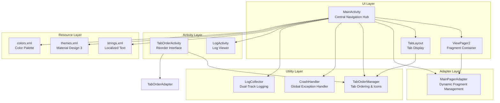
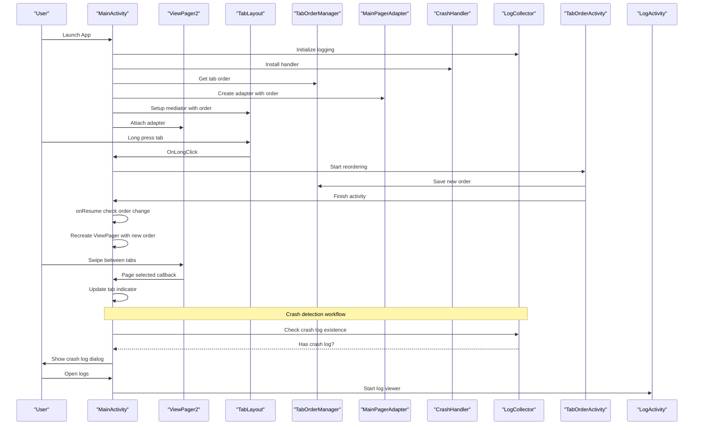
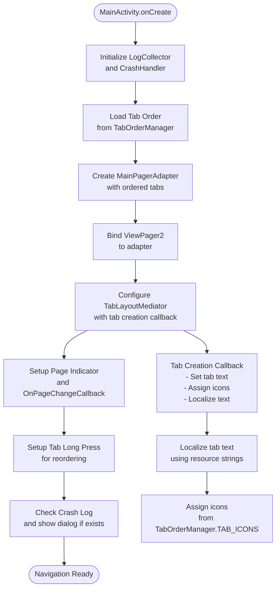
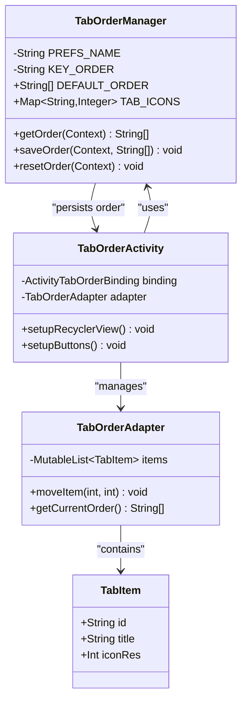
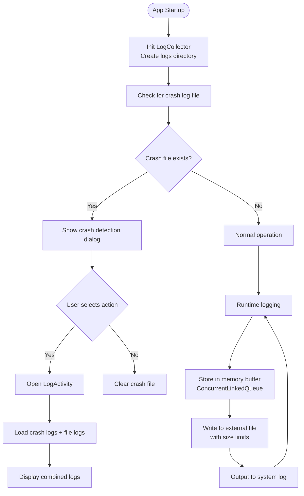
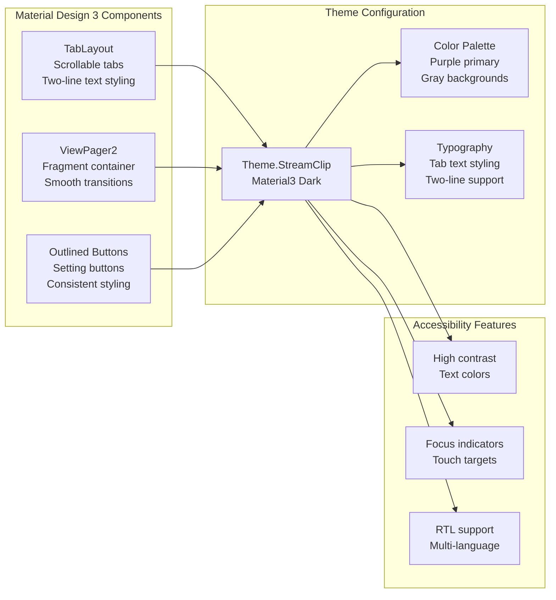
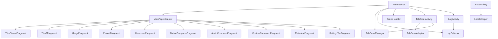

# Main Navigation System

<cite>
**Referenced Files in This Document**
- [MainActivity.kt](file://app/src/main/java/com/pisces312/streamclip/MainActivity.kt)
- [MainPagerAdapter.kt](file://app/src/main/java/com/pisces312/streamclip/adapter/MainPagerAdapter.kt)
- [TabOrderManager.kt](file://app/src/main/java/com/pisces312/streamclip/util/TabOrderManager.kt)
- [TabOrderActivity.kt](file://app/src/main/java/com/pisces312/streamclip/ui/TabOrderActivity.kt)
- [LogActivity.kt](file://app/src/main/java/com/pisces312/streamclip/LogActivity.kt)
- [BaseActivity.kt](file://app/src/main/java/com/pisces312/streamclip/BaseActivity.kt)
- [CrashHandler.kt](file://app/src/main/java/com/pisces312/streamclip/util/CrashHandler.kt)
- [LogCollector.kt](file://app/src/main/java/com/pisces312/streamclip/util/LogCollector.kt)
- [TabOrderAdapter.kt](file://app/src/main/java/com/pisces312/streamclip/adapter/TabOrderAdapter.kt)
- [activity_main.xml](file://app/src/main/res/layout/activity_main.xml)
- [strings.xml](file://app/src/main/res/values/strings.xml)
- [colors.xml](file://app/src/main/res/values/colors.xml)
- [themes.xml](file://app/src/main/res/values/themes.xml)
- [LocaleHelper.kt](file://app/src/main/java/com/pisces312/streamclip/util/LocaleHelper.kt)
</cite>

## Table of Contents
1. [Introduction](#introduction)
2. [Project Structure](#project-structure)
3. [Core Components](#core-components)
4. [Architecture Overview](#architecture-overview)
5. [Detailed Component Analysis](#detailed-component-analysis)
6. [Dependency Analysis](#dependency-analysis)
7. [Performance Considerations](#performance-considerations)
8. [Troubleshooting Guide](#troubleshooting-guide)
9. [Conclusion](#conclusion)

## Introduction
This document provides comprehensive documentation for StreamClip's main navigation system, focusing on the tab-based interface built with ViewPager2 and TabLayout. The system centers around MainActivity as the primary navigation hub, integrating dynamic fragment management through MainPagerAdapter, Material Design 3 components, customizable tab ordering, and robust logging/crash handling workflows.

## Project Structure
The navigation system spans several key modules:
- UI Layer: MainActivity orchestrates the ViewPager2 and TabLayout setup
- Adapter Layer: MainPagerAdapter manages fragment instantiation based on configurable tab order
- Utility Layer: TabOrderManager handles persistent tab ordering and icon mapping
- Activity Layer: TabOrderActivity provides drag-and-drop reordering interface
- Logging Layer: CrashHandler and LogCollector manage crash detection and log persistence
- Resource Layer: Material Design 3 theming and localized string resources

**Diagram sources**
- [MainActivity.kt:35-81](file://app/src/main/java/com/pisces312/streamclip/MainActivity.kt#L35-L81)
- [MainPagerAdapter.kt:17-39](file://app/src/main/java/com/pisces312/streamclip/adapter/MainPagerAdapter.kt#L17-L39)
- [TabOrderManager.kt:7-61](file://app/src/main/java/com/pisces312/streamclip/util/TabOrderManager.kt#L7-L61)
- [TabOrderActivity.kt:14-92](file://app/src/main/java/com/pisces312/streamclip/ui/TabOrderActivity.kt#L14-L92)
- [LogActivity.kt:18-125](file://app/src/main/java/com/pisces312/streamclip/LogActivity.kt#L18-L125)

**Section sources**
- [MainActivity.kt:26-52](file://app/src/main/java/com/pisces312/streamclip/MainActivity.kt#L26-L52)
- [activity_main.xml:10-27](file://app/src/main/res/layout/activity_main.xml#L10-L27)

## Core Components
The navigation system comprises four primary components:

### MainActivity - Central Navigation Hub
MainActivity serves as the main controller for the entire navigation system. It initializes logging infrastructure, sets up the ViewPager2 with TabLayoutMediator, manages tab ordering, handles permission checks, and coordinates crash log detection.

Key responsibilities include:
- Initializing LogCollector and CrashHandler during onCreate
- Setting up ViewPager2 with dynamic tab configuration
- Managing tab indicator display and page change callbacks
- Handling long-press gestures for tab reordering
- Implementing permission checking for storage and media access
- Coordinating crash log detection and user notification

### MainPagerAdapter - Dynamic Fragment Management
MainPagerAdapter extends FragmentStateAdapter to provide dynamic fragment instantiation based on the configured tab order. It maps tab identifiers to specific fragment implementations, enabling flexible tab arrangement without code changes.

Supported fragments include:
- TrimSimpleFragment, Trim2Fragment (video trimming)
- MergeFragment (video merging)
- ExtractFragment (audio extraction)
- CompressFragment, NativeCompressFragment, AudioCompressFragment (compression)
- CustomCommandFragment (FFmpeg command execution)
- MetadataFragment (media metadata editing)
- SettingsTabFragment (application settings)

### TabOrderManager - Customizable Tab Ordering
TabOrderManager provides persistent tab ordering through SharedPreferences, maintaining both default order and user preferences. It ensures backward compatibility when new tabs are added by merging existing orders with new tabs.

Features:
- Default tab order with extensible design
- Icon mapping for all supported tabs
- Automatic migration of new tabs into existing user orders
- Persistent storage with SharedPreferences
- Reset functionality to restore defaults

### TabOrderActivity - Reordering Interface
TabOrderActivity implements a drag-and-drop interface for customizing tab order using RecyclerView with ItemTouchHelper. Users can reorder tabs by long-pressing and dragging items, with immediate visual feedback.

**Section sources**
- [MainActivity.kt:62-81](file://app/src/main/java/com/pisces312/streamclip/MainActivity.kt#L62-L81)
- [MainPagerAdapter.kt:17-39](file://app/src/main/java/com/pisces312/streamclip/adapter/MainPagerAdapter.kt#L17-L39)
- [TabOrderManager.kt:7-61](file://app/src/main/java/com/pisces312/streamclip/util/TabOrderManager.kt#L7-L61)
- [TabOrderActivity.kt:14-92](file://app/src/main/java/com/pisces312/streamclip/ui/TabOrderActivity.kt#L14-L92)

## Architecture Overview
The navigation system follows a layered architecture pattern with clear separation of concerns:

**Diagram sources**
- [MainActivity.kt:35-131](file://app/src/main/java/com/pisces312/streamclip/MainActivity.kt#L35-L131)
- [TabOrderActivity.kt:74-86](file://app/src/main/java/com/pisces312/streamclip/ui/TabOrderActivity.kt#L74-L86)
- [LogActivity.kt:18-67](file://app/src/main/java/com/pisces312/streamclip/LogActivity.kt#L18-L67)

## Detailed Component Analysis

### MainActivity Navigation Setup
MainActivity implements the core navigation logic through the setupViewPager() method, which integrates multiple systems:

**Diagram sources**
- [MainActivity.kt:62-81](file://app/src/main/java/com/pisces312/streamclip/MainActivity.kt#L62-L81)
- [MainActivity.kt:103-115](file://app/src/main/java/com/pisces312/streamclip/MainActivity.kt#L103-L115)
- [TabOrderManager.kt:15-26](file://app/src/main/java/com/pisces312/streamclip/util/TabOrderManager.kt#L15-L26)

The TabLayoutMediator configuration creates tabs dynamically based on the stored order, assigning localized text and appropriate icons. The page indicator updates automatically with each page change.

**Section sources**
- [MainActivity.kt:62-81](file://app/src/main/java/com/pisces312/streamclip/MainActivity.kt#L62-L81)
- [MainActivity.kt:103-115](file://app/src/main/java/com/pisces312/streamclip/MainActivity.kt#L103-L115)

### Tab Ordering System
The tab ordering system provides a sophisticated customization mechanism:

**Diagram sources**
- [TabOrderManager.kt:7-61](file://app/src/main/java/com/pisces312/streamclip/util/TabOrderManager.kt#L7-L61)
- [TabOrderActivity.kt:14-92](file://app/src/main/java/com/pisces312/streamclip/ui/TabOrderActivity.kt#L14-L92)
- [TabOrderAdapter.kt:11-44](file://app/src/main/java/com/pisces312/streamclip/adapter/TabOrderAdapter.kt#L11-L44)

The system supports long-press functionality for initiating reordering, with drag-and-drop capabilities using ItemTouchHelper. The DEFAULT_ORDER list serves as the master catalog, while user preferences are stored separately and merged automatically when new tabs are added.

**Section sources**
- [TabOrderManager.kt:32-56](file://app/src/main/java/com/pisces312/streamclip/util/TabOrderManager.kt#L32-L56)
- [TabOrderActivity.kt:55-72](file://app/src/main/java/com/pisces312/streamclip/ui/TabOrderActivity.kt#L55-L72)
- [TabOrderAdapter.kt:37-43](file://app/src/main/java/com/pisces312/streamclip/adapter/TabOrderAdapter.kt#L37-L43)

### Crash Detection and Log Management
The logging and crash detection system implements a dual-track approach for reliability:

**Diagram sources**
- [LogCollector.kt:43-54](file://app/src/main/java/com/pisces312/streamclip/util/LogCollector.kt#L43-L54)
- [LogCollector.kt:149-168](file://app/src/main/java/com/pisces312/streamclip/util/LogCollector.kt#L149-L168)
- [MainActivity.kt:117-131](file://app/src/main/java/com/pisces312/streamclip/MainActivity.kt#L117-L131)

The system maintains a memory buffer with a maximum capacity and automatically truncates files when they exceed size limits. Crash logs are captured globally and stored persistently for user review.

**Section sources**
- [LogCollector.kt:15-201](file://app/src/main/java/com/pisces312/streamclip/util/LogCollector.kt#L15-L201)
- [CrashHandler.kt:10-28](file://app/src/main/java/com/pisces312/streamclip/util/CrashHandler.kt#L10-L28)
- [MainActivity.kt:117-131](file://app/src/main/java/com/pisces312/streamclip/MainActivity.kt#L117-L131)

### Material Design 3 Implementation
The navigation system extensively uses Material Design 3 components with dark theme support:

**Diagram sources**
- [themes.xml:2-28](file://app/src/main/res/values/themes.xml#L2-L28)
- [colors.xml:1-15](file://app/src/main/res/values/colors.xml#L1-L15)
- [activity_main.xml:10-21](file://app/src/main/res/layout/activity_main.xml#L10-L21)

The implementation includes scrollable tabs with two-line text display, consistent color theming, and proper contrast ratios for accessibility compliance.

**Section sources**
- [themes.xml:2-28](file://app/src/main/res/values/themes.xml#L2-L28)
- [activity_main.xml:10-21](file://app/src/main/res/layout/activity_main.xml#L10-L21)
- [strings.xml:183-192](file://app/src/main/res/values/strings.xml#L183-L192)

## Dependency Analysis
The navigation system exhibits clean dependency relationships with minimal coupling:

**Diagram sources**
- [MainActivity.kt:21-24](file://app/src/main/java/com/pisces312/streamclip/MainActivity.kt#L21-L24)
- [MainPagerAdapter.kt:6-15](file://app/src/main/java/com/pisces312/streamclip/adapter/MainPagerAdapter.kt#L6-L15)
- [TabOrderActivity.kt:10-12](file://app/src/main/java/com/pisces312/streamclip/ui/TabOrderActivity.kt#L10-L12)
- [BaseActivity.kt:8-12](file://app/src/main/java/com/pisces312/streamclip/BaseActivity.kt#L8-L12)

The design promotes loose coupling through dependency injection via constructor parameters and shared utility objects. MainActivity depends on TabOrderManager for state management and on adapters for UI composition.

**Section sources**
- [MainActivity.kt:21-24](file://app/src/main/java/com/pisces312/streamclip/MainActivity.kt#L21-L24)
- [MainPagerAdapter.kt:17-39](file://app/src/main/java/com/pisces312/streamclip/adapter/MainPagerAdapter.kt#L17-L39)

## Performance Considerations
The navigation system implements several performance optimizations:

### Fragment Lifecycle Management
- Uses FragmentStateAdapter for efficient fragment lifecycle management
- Automatic fragment state preservation and restoration
- Lazy loading of fragments on demand

### Memory Management
- ConcurrentLinkedQueue for thread-safe log buffering
- Maximum 500 entries in memory log buffer
- Automatic file size management with truncation when exceeding 1MB

### UI Performance
- ViewPager2 provides hardware-accelerated page transitions
- TabLayoutMediator handles tab creation efficiently
- Minimal view hierarchy complexity in activity_main.xml

### State Persistence
- SharedPreferences for lightweight tab order storage
- Efficient merge algorithm for new tab additions
- Background thread-safe operations for logging

**Section sources**
- [MainPagerAdapter.kt:22-38](file://app/src/main/java/com/pisces312/streamclip/adapter/MainPagerAdapter.kt#L22-L38)
- [LogCollector.kt:18-27](file://app/src/main/java/com/pisces312/streamclip/util/LogCollector.kt#L18-L27)
- [TabOrderManager.kt:48-51](file://app/src/main/java/com/pisces312/streamclip/util/TabOrderManager.kt#L48-L51)

## Troubleshooting Guide

### Permission Issues
The system handles various Android permission scenarios:
- Android 11+ requires MANAGE_EXTERNAL_STORAGE permission
- Android 13+ requires READ_MEDIA_VIDEO and READ_MEDIA_AUDIO permissions
- Runtime permission requests for storage access
- Settings redirection for manual permission granting

### Tab Reordering Problems
Common issues and solutions:
- Tabs not appearing in expected order: Verify TabOrderManager.DEFAULT_ORDER matches fragment implementations
- Long-press not triggering reordering: Check TabLayout long-click listener registration
- Reordered tabs not persisting: Ensure TabOrderManager.saveOrder is called from TabOrderActivity

### Crash Log Detection
If crash logs are not detected:
- Verify LogCollector.init is called during application startup
- Check external storage write permissions
- Confirm crash log file exists in external files directory

### Accessibility Considerations
The system includes built-in accessibility features:
- High contrast color schemes
- Proper focus management
- Touch target sizing compliant with Material Design guidelines
- Multi-language support through resource localization

**Section sources**
- [MainActivity.kt:455-503](file://app/src/main/java/com/pisces312/streamclip/MainActivity.kt#L455-L503)
- [TabOrderActivity.kt:74-86](file://app/src/main/java/com/pisces312/streamclip/ui/TabOrderActivity.kt#L74-L86)
- [LogCollector.kt:191-200](file://app/src/main/java/com/pisces312/streamclip/util/LogCollector.kt#L191-L200)

## Conclusion
StreamClip's main navigation system demonstrates a well-architected tab-based interface that balances flexibility, performance, and user experience. The integration of ViewPager2 and TabLayout with dynamic fragment management provides a responsive and customizable user interface. The robust logging and crash detection system ensures reliable operation monitoring, while Material Design 3 implementation delivers modern, accessible UI components. The tab ordering system offers extensive customization capabilities without compromising system stability, making it an excellent foundation for media processing applications requiring intuitive navigation.