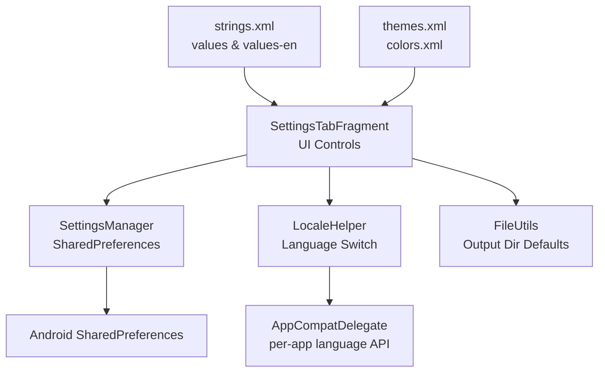
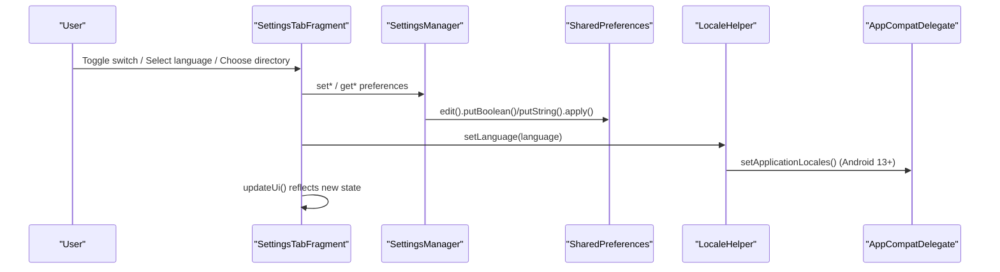
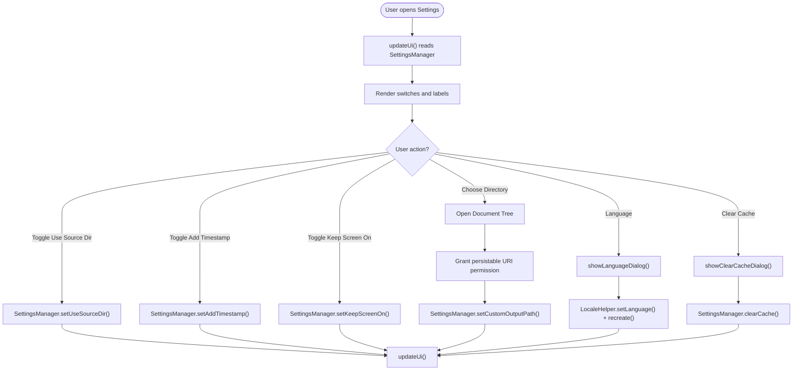
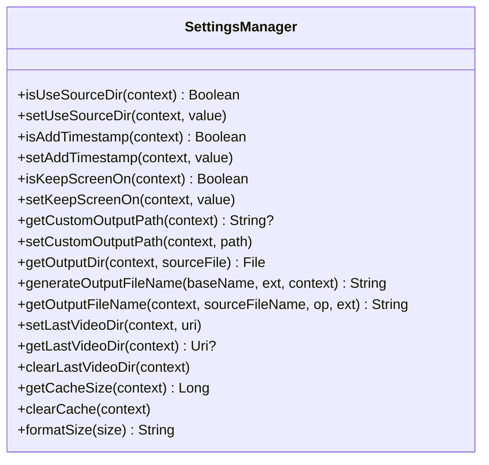
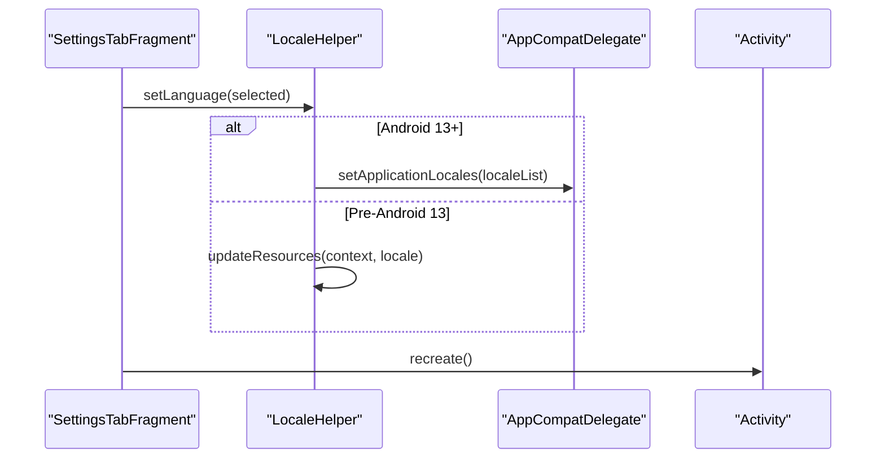
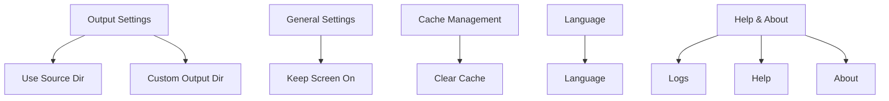
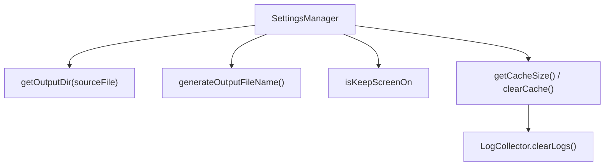
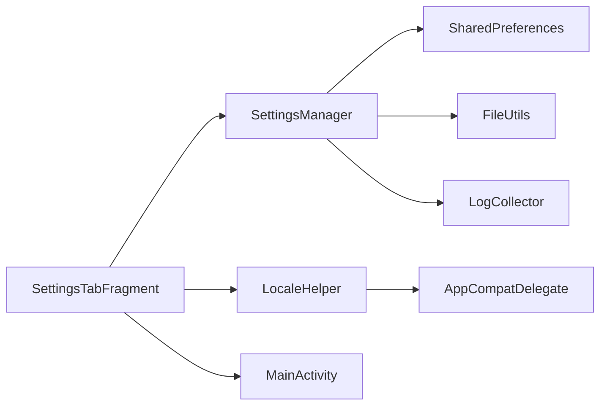

# Settings and Configuration

<cite>
**Referenced Files in This Document**
- [SettingsTabFragment.kt](file://app/src/main/java/com/pisces312/streamclip/fragment/SettingsTabFragment.kt)
- [SettingsManager.kt](file://app/src/main/java/com/pisces312/streamclip/util/SettingsManager.kt)
- [LocaleHelper.kt](file://app/src/main/java/com/pisces312/streamclip/util/LocaleHelper.kt)
- [strings.xml](file://app/src/main/res/values/strings.xml)
- [strings.xml (English)](file://app/src/main/res/values-en/strings.xml)
- [fragment_settings_tab.xml](file://app/src/main/res/layout/fragment_settings_tab.xml)
- [themes.xml](file://app/src/main/res/values/themes.xml)
- [colors.xml](file://app/src/main/res/values/colors.xml)
- [MainActivity.kt](file://app/src/main/java/com/pisces312/streamclip/MainActivity.kt)
- [FileUtils.kt](file://app/src/main/java/com/pisces312/streamclip/util/FileUtils.kt)
- [LogCollector.kt](file://app/src/main/java/com/pisces312/streamclip/util/LogCollector.kt)
</cite>

## Table of Contents
1. [Introduction](#introduction)
2. [Project Structure](#project-structure)
3. [Core Components](#core-components)
4. [Architecture Overview](#architecture-overview)
5. [Detailed Component Analysis](#detailed-component-analysis)
6. [Dependency Analysis](#dependency-analysis)
7. [Performance Considerations](#performance-considerations)
8. [Troubleshooting Guide](#troubleshooting-guide)
9. [Conclusion](#conclusion)

## Introduction
This document explains StreamClip’s settings and configuration system with a focus on preference management, user customization, and internationalization. It covers how the SettingsTabFragment manages user preferences, how SettingsManager persists and validates configuration, how LocaleHelper handles language switching, and how the UI organizes settings into logical categories. It also documents integration with Android’s SharedPreferences, cache management, and how settings influence application behavior at runtime.

## Project Structure
The settings system spans UI, utilities, and resources:
- UI: SettingsTabFragment and its layout define the settings screen and interactive controls.
- Utilities: SettingsManager encapsulates SharedPreferences-backed preferences, default values, and derived behaviors.
- Internationalization: LocaleHelper manages language selection and applies locale changes.
- Resources: Strings and themes provide localized text and UI styling.

**Diagram sources**
- [SettingsTabFragment.kt:47-134](file://app/src/main/java/com/pisces312/streamclip/fragment/SettingsTabFragment.kt#L47-L134)
- [SettingsManager.kt:15-61](file://app/src/main/java/com/pisces312/streamclip/util/SettingsManager.kt#L15-L61)
- [LocaleHelper.kt:19-48](file://app/src/main/java/com/pisces312/streamclip/util/LocaleHelper.kt#L19-L48)
- [fragment_settings_tab.xml:82-310](file://app/src/main/res/layout/fragment_settings_tab.xml#L82-L310)
- [strings.xml:36-115](file://app/src/main/res/values/strings.xml#L36-L115)
- [themes.xml:2-9](file://app/src/main/res/values/themes.xml#L2-L9)

**Section sources**
- [SettingsTabFragment.kt:47-134](file://app/src/main/java/com/pisces312/streamclip/fragment/SettingsTabFragment.kt#L47-L134)
- [fragment_settings_tab.xml:82-310](file://app/src/main/res/layout/fragment_settings_tab.xml#L82-L310)
- [strings.xml:36-115](file://app/src/main/res/values/strings.xml#L36-L115)

## Core Components
- SettingsTabFragment: Hosts the settings UI, wires up interactive controls, and orchestrates actions like selecting output directories, clearing cache, and language switching.
- SettingsManager: Centralized preference manager backed by SharedPreferences, with defaults and computed behaviors (e.g., output directory selection).
- LocaleHelper: Manages language preferences and applies locale changes, including Android 13 per-app language API.
- Resource bundles: Localized strings for Chinese and English, plus theme and color resources for dark UI.

Key responsibilities:
- Preference persistence and defaults
- Derived UI state updates
- Internationalization and theme-aware contexts
- Cache size calculation and cleanup
- Output directory resolution with fallback logic

**Section sources**
- [SettingsTabFragment.kt:23-134](file://app/src/main/java/com/pisces312/streamclip/fragment/SettingsTabFragment.kt#L23-L134)
- [SettingsManager.kt:6-61](file://app/src/main/java/com/pisces312/streamclip/util/SettingsManager.kt#L6-L61)
- [LocaleHelper.kt:12-48](file://app/src/main/java/com/pisces312/streamclip/util/LocaleHelper.kt#L12-L48)

## Architecture Overview
The settings architecture integrates UI, preferences, and resources:

**Diagram sources**
- [SettingsTabFragment.kt:70-96](file://app/src/main/java/com/pisces312/streamclip/fragment/SettingsTabFragment.kt#L70-L96)
- [SettingsManager.kt:26-61](file://app/src/main/java/com/pisces312/streamclip/util/SettingsManager.kt#L26-L61)
- [LocaleHelper.kt:27-48](file://app/src/main/java/com/pisces312/streamclip/util/LocaleHelper.kt#L27-L48)

## Detailed Component Analysis

### SettingsTabFragment: Settings UI and Interactions
- UI organization:
  - Categories: Donation, Tab Order, Output Settings, General Settings, Cache Management, Language, Logs, Help, About.
  - Interactive controls: SwitchCompat toggles, buttons, and clickable rows.
- Behavior:
  - Uses SettingsManager to read/write preferences and update UI state.
  - Integrates with MainActivity for dialogs and navigation.
  - Implements directory selection via SAF tree picker and persistable URI permissions.
  - Provides language selection dialog with immediate recreation to apply locale.
  - Offers cache size calculation and confirmation dialog before clearing.

**Diagram sources**
- [SettingsTabFragment.kt:70-184](file://app/src/main/java/com/pisces312/streamclip/fragment/SettingsTabFragment.kt#L70-L184)
- [SettingsManager.kt:22-61](file://app/src/main/java/com/pisces312/streamclip/util/SettingsManager.kt#L22-L61)
- [LocaleHelper.kt:27-48](file://app/src/main/java/com/pisces312/streamclip/util/LocaleHelper.kt#L27-L48)

**Section sources**
- [SettingsTabFragment.kt:47-134](file://app/src/main/java/com/pisces312/streamclip/fragment/SettingsTabFragment.kt#L47-L134)
- [fragment_settings_tab.xml:82-310](file://app/src/main/res/layout/fragment_settings_tab.xml#L82-L310)

### SettingsManager: Persistent Storage, Defaults, and Validation
- Persistence:
  - SharedPreferences-backed with a dedicated preferences name and keys for each setting.
- Defaults:
  - Boolean defaults are true for “use source dir”, “add timestamp”, and “keep screen on”.
- Derived behaviors:
  - Output directory resolution considers whether to use the source file’s directory or a custom path, with fallback to a public Movies/StreamClip directory when the source is in cache/private storage.
  - Output filename generation appends a timestamp when enabled.
  - Cache size calculation includes app cache, external cache, and logs directory.
- Utility helpers:
  - Formatting for human-readable sizes.
  - Clearing cache and logs.

**Diagram sources**
- [SettingsManager.kt:6-208](file://app/src/main/java/com/pisces312/streamclip/util/SettingsManager.kt#L6-L208)

**Section sources**
- [SettingsManager.kt:6-208](file://app/src/main/java/com/pisces312/streamclip/util/SettingsManager.kt#L6-L208)
- [FileUtils.kt:208-216](file://app/src/main/java/com/pisces312/streamclip/util/FileUtils.kt#L208-L216)

### LocaleHelper: Internationalization and Locale Switching
- Preferences:
  - Stores language choice in a separate SharedPreferences namespace.
  - Supports “follow system”, “zh”, and “en”.
- Application-wide locale:
  - Applies locale via AppCompatDelegate.setApplicationLocales on Android 13+.
  - Older versions update resources configuration context.
- UI integration:
  - SettingsTabFragment displays current language and triggers recreation to apply changes.

**Diagram sources**
- [LocaleHelper.kt:27-48](file://app/src/main/java/com/pisces312/streamclip/util/LocaleHelper.kt#L27-L48)
- [SettingsTabFragment.kt:156-167](file://app/src/main/java/com/pisces312/streamclip/fragment/SettingsTabFragment.kt#L156-L167)

**Section sources**
- [LocaleHelper.kt:12-62](file://app/src/main/java/com/pisces312/streamclip/util/LocaleHelper.kt#L12-L62)
- [strings.xml:94-98](file://app/src/main/res/values/strings.xml#L94-L98)
- [strings.xml (English):72-76](file://app/src/main/res/values-en/strings.xml#L72-L76)

### UI Patterns and Organization
- Category-based layout:
  - Logical grouping of settings (Output, General, Cache, Language, Help/About).
- Accessible controls:
  - Descriptive labels and secondary text for each setting.
  - SwitchCompat for boolean toggles.
  - Clickable rows with chevrons indicating navigation.
- Dark theme:
  - Material3 Dark theme with custom colors and tab styles.

**Diagram sources**
- [fragment_settings_tab.xml:82-310](file://app/src/main/res/layout/fragment_settings_tab.xml#L82-L310)
- [themes.xml:2-9](file://app/src/main/res/values/themes.xml#L2-L9)
- [colors.xml:10-15](file://app/src/main/res/values/colors.xml#L10-L15)

**Section sources**
- [fragment_settings_tab.xml:82-310](file://app/src/main/res/layout/fragment_settings_tab.xml#L82-L310)
- [themes.xml:2-9](file://app/src/main/res/values/themes.xml#L2-L9)
- [colors.xml:10-15](file://app/src/main/res/values/colors.xml#L10-L15)

### Relationship Between Settings and Application Behavior
- Output directory:
  - SettingsManager.getOutputDir chooses either the source directory (with safety checks) or a custom path/fallback directory.
- Filename generation:
  - Timestamp suffix is controlled by isAddTimestamp.
- Screen behavior:
  - isKeepScreenOn influences UI behavior during processing.
- Cache management:
  - SettingsManager.getCacheSize and clearCache integrate with LogCollector to manage logs and cache.

**Diagram sources**
- [SettingsManager.kt:67-106](file://app/src/main/java/com/pisces312/streamclip/util/SettingsManager.kt#L67-L106)
- [SettingsManager.kt:141-164](file://app/src/main/java/com/pisces312/streamclip/util/SettingsManager.kt#L141-L164)
- [LogCollector.kt:173-186](file://app/src/main/java/com/pisces312/streamclip/util/LogCollector.kt#L173-L186)

**Section sources**
- [SettingsManager.kt:67-106](file://app/src/main/java/com/pisces312/streamclip/util/SettingsManager.kt#L67-L106)
- [SettingsManager.kt:141-164](file://app/src/main/java/com/pisces312/streamclip/util/SettingsManager.kt#L141-L164)
- [LogCollector.kt:173-186](file://app/src/main/java/com/pisces312/streamclip/util/LogCollector.kt#L173-L186)

### Runtime Configuration Updates and Migration Strategies
- Immediate effect:
  - Toggling switches updates UI immediately via SettingsManager and updateUi().
- Locale changes:
  - Language selection triggers LocaleHelper.setLanguage and Activity.recreate to reload resources.
- Output directory fallback:
  - If the source file is in cache/private storage, SettingsManager.getOutputDir falls back to a public directory to ensure write access.
- Migration considerations:
  - New settings can be introduced by adding keys in SettingsManager with sensible defaults and updating SettingsTabFragment UI accordingly.
  - For breaking changes, introduce a migration step that reads old keys and writes new ones, then removes old keys.

**Section sources**
- [SettingsTabFragment.kt:115-134](file://app/src/main/java/com/pisces312/streamclip/fragment/SettingsTabFragment.kt#L115-L134)
- [SettingsManager.kt:67-92](file://app/src/main/java/com/pisces312/streamclip/util/SettingsManager.kt#L67-L92)
- [LocaleHelper.kt:27-48](file://app/src/main/java/com/pisces312/streamclip/util/LocaleHelper.kt#L27-L48)

### Accessibility Features, Dark Theme, and Localization Best Practices
- Accessibility:
  - Descriptive labels and secondary text improve clarity.
  - SwitchCompat provides accessible toggle controls.
- Dark theme:
  - Material3 Dark theme with custom colors and tab styles ensures readability and battery-friendly visuals.
- Localization:
  - Separate values and values-en string resources.
  - LocaleHelper supports per-app language API on Android 13+.
  - Follow system option allows users to align with device language.

**Section sources**
- [fragment_settings_tab.xml:82-310](file://app/src/main/res/layout/fragment_settings_tab.xml#L82-L310)
- [themes.xml:2-9](file://app/src/main/res/values/themes.xml#L2-L9)
- [LocaleHelper.kt:30-38](file://app/src/main/java/com/pisces312/streamclip/util/LocaleHelper.kt#L30-L38)
- [strings.xml:94-98](file://app/src/main/res/values/strings.xml#L94-L98)
- [strings.xml (English):72-76](file://app/src/main/res/values-en/strings.xml#L72-L76)

## Dependency Analysis
- SettingsTabFragment depends on:
  - SettingsManager for preferences and derived behaviors.
  - LocaleHelper for language management.
  - MainActivity for dialogs and navigation.
- SettingsManager depends on:
  - SharedPreferences for persistence.
  - FileUtils for default output directory fallback.
  - LogCollector for cache/log cleanup.
- LocaleHelper depends on:
  - AppCompatDelegate for Android 13+ per-app language API.
  - Resources configuration for older versions.

**Diagram sources**
- [SettingsTabFragment.kt:15-21](file://app/src/main/java/com/pisces312/streamclip/fragment/SettingsTabFragment.kt#L15-L21)
- [SettingsManager.kt:3-4](file://app/src/main/java/com/pisces312/streamclip/util/SettingsManager.kt#L3-L4)
- [LocaleHelper.kt:8](file://app/src/main/java/com/pisces312/streamclip/util/LocaleHelper.kt#L8)

**Section sources**
- [SettingsTabFragment.kt:15-21](file://app/src/main/java/com/pisces312/streamclip/fragment/SettingsTabFragment.kt#L15-L21)
- [SettingsManager.kt:3-4](file://app/src/main/java/com/pisces312/streamclip/util/SettingsManager.kt#L3-L4)
- [LocaleHelper.kt:8](file://app/src/main/java/com/pisces312/streamclip/util/LocaleHelper.kt#L8)

## Performance Considerations
- SharedPreferences usage:
  - All writes use apply() for asynchronous persistence; reads are lightweight.
- Cache computation:
  - getCacheSize traverses directories; consider caching results if frequently queried.
- UI updates:
  - updateUi() consolidates reads and visibility changes to minimize redundant work.
- Locale switching:
  - Recreate() can be expensive; consider deferring until user confirms language change.

## Troubleshooting Guide
- Output directory not writable:
  - If the source file is in cache/private storage, SettingsManager.getOutputDir falls back to a public directory. Verify the fallback path exists.
- Cache size shows zero:
  - Ensure cache and logs directories exist and are readable.
- Language not changing:
  - Confirm LocaleHelper.setLanguage was called and Activity.recreate() executed.
- Directory selection fails:
  - Verify SAF tree picker permissions were granted and persisted.

**Section sources**
- [SettingsManager.kt:67-92](file://app/src/main/java/com/pisces312/streamclip/util/SettingsManager.kt#L67-L92)
- [SettingsManager.kt:141-164](file://app/src/main/java/com/pisces312/streamclip/util/SettingsManager.kt#L141-L164)
- [SettingsTabFragment.kt:186-201](file://app/src/main/java/com/pisces312/streamclip/fragment/SettingsTabFragment.kt#L186-L201)

## Conclusion
StreamClip’s settings system combines a clear UI with robust preference management, reliable persistence, and flexible internationalization. SettingsTabFragment provides intuitive controls, SettingsManager centralizes configuration logic with sensible defaults, and LocaleHelper enables per-app language support. Together, they deliver a user-friendly, accessible, and maintainable configuration experience across languages and devices.