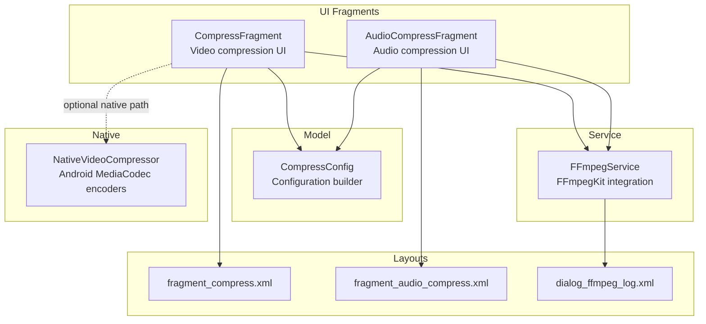
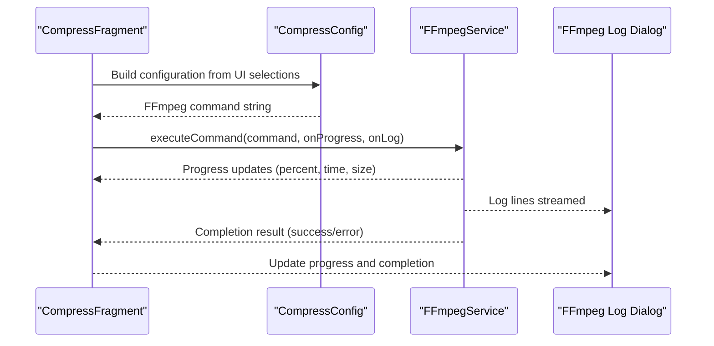
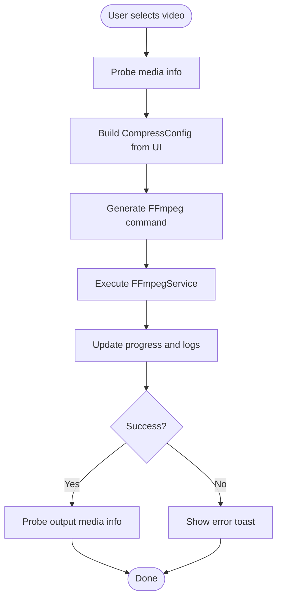
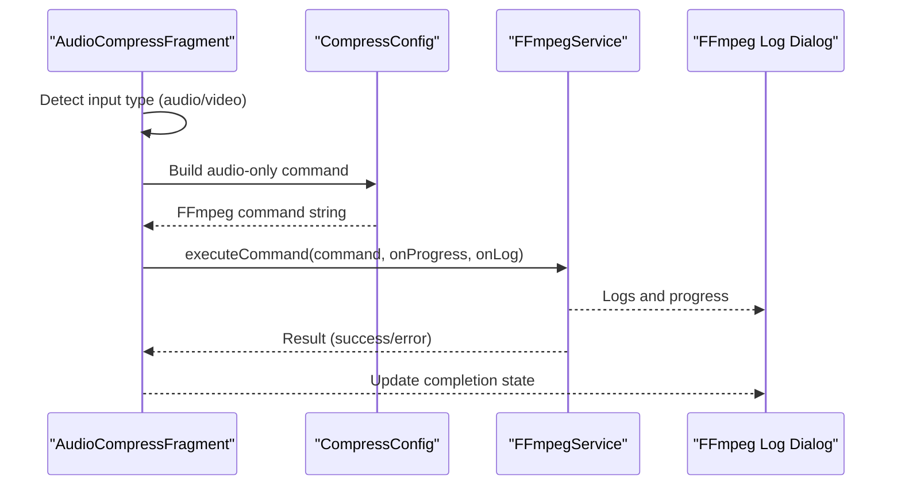
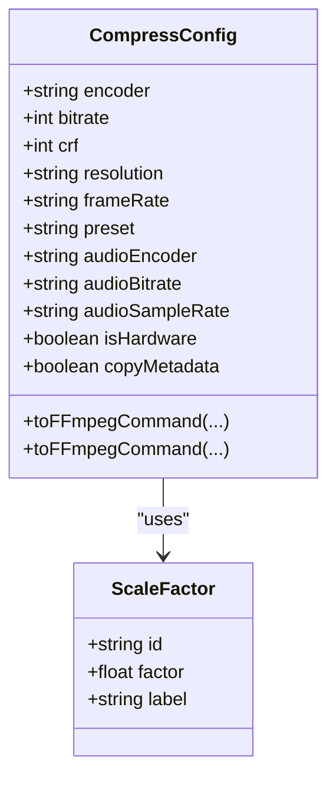
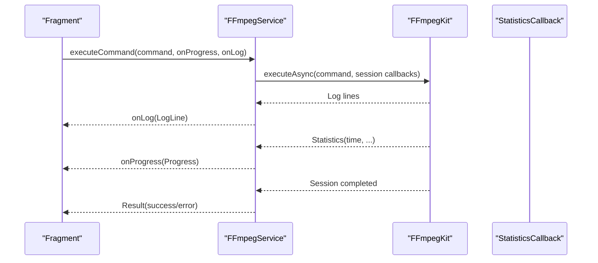
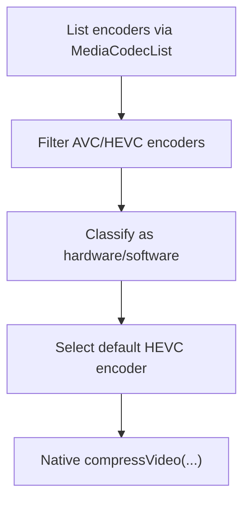
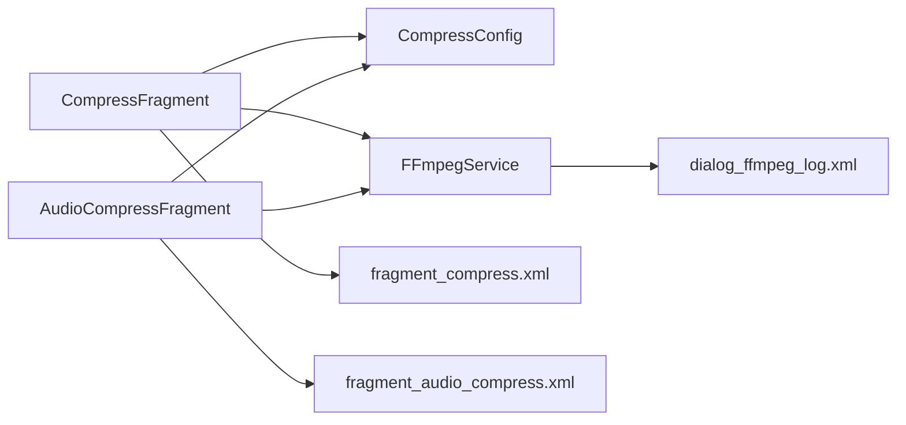

# Compression Fragments

<cite>
**Referenced Files in This Document**
- [CompressFragment.kt](file://app/src/main/java/com/pisces312/streamclip/fragment/CompressFragment.kt)
- [AudioCompressFragment.kt](file://app/src/main/java/com/pisces312/streamclip/fragment/AudioCompressFragment.kt)
- [FFmpegService.kt](file://app/src/main/java/com/pisces312/streamclip/service/FFmpegService.kt)
- [CompressConfig.kt](file://app/src/main/java/com/pisces312/streamclip/model/CompressConfig.kt)
- [fragment_compress.xml](file://app/src/main/res/layout/fragment_compress.xml)
- [fragment_audio_compress.xml](file://app/src/main/res/layout/fragment_audio_compress.xml)
- [dialog_ffmpeg_log.xml](file://app/src/main/res/layout/dialog_ffmpeg_log.xml)
- [NativeVideoCompressor.kt](file://app/src/main/java/com/pisces312/streamclip/videocompressor/NativeVideoCompressor.kt)
</cite>

## Table of Contents
1. [Introduction](#introduction)
2. [Project Structure](#project-structure)
3. [Core Components](#core-components)
4. [Architecture Overview](#architecture-overview)
5. [Detailed Component Analysis](#detailed-component-analysis)
6. [Dependency Analysis](#dependency-analysis)
7. [Performance Considerations](#performance-considerations)
8. [Troubleshooting Guide](#troubleshooting-guide)
9. [Conclusion](#conclusion)

## Introduction
This document explains StreamClip’s compression fragments that enable video and audio compression. It covers:
- Video compression with hardware/software encoding options, encoder selection (H.264/H.265), quality control parameters, and bitrate management
- Audio compression with format conversion, sample rate adjustment, and audio quality optimization
- Hardware acceleration techniques, encoder performance comparisons, and quality vs file size trade-offs
- Compression configuration management, preset selection, custom parameter tuning, and real-time quality assessment
- Integration with FFmpegService for encoding operations, progress tracking, and error handling
- User interface patterns for compression settings, visual quality indicators, and performance optimization strategies
- Differences between video and audio compression workflows, parameter validation, and output format compatibility

## Project Structure
The compression features are implemented across Kotlin fragments, a shared configuration model, and an FFmpeg integration service. UI layouts define the controls and progress displays.

**Diagram sources**
- [CompressFragment.kt:112-137](file://app/src/main/java/com/pisces312/streamclip/fragment/CompressFragment.kt#L112-L137)
- [AudioCompressFragment.kt:59-73](file://app/src/main/java/com/pisces312/streamclip/fragment/AudioCompressFragment.kt#L59-L73)
- [CompressConfig.kt:21-114](file://app/src/main/java/com/pisces312/streamclip/model/CompressConfig.kt#L21-L114)
- [FFmpegService.kt:19-420](file://app/src/main/java/com/pisces312/streamclip/service/FFmpegService.kt#L19-L420)
- [fragment_compress.xml:1-632](file://app/src/main/res/layout/fragment_compress.xml#L1-L632)
- [fragment_audio_compress.xml:1-222](file://app/src/main/res/layout/fragment_audio_compress.xml#L1-L222)
- [dialog_ffmpeg_log.xml:1-154](file://app/src/main/res/layout/dialog_ffmpeg_log.xml#L1-L154)
- [NativeVideoCompressor.kt:36-107](file://app/src/main/java/com/pisces312/streamclip/videocompressor/NativeVideoCompressor.kt#L36-L107)

**Section sources**
- [CompressFragment.kt:112-137](file://app/src/main/java/com/pisces312/streamclip/fragment/CompressFragment.kt#L112-L137)
- [AudioCompressFragment.kt:59-73](file://app/src/main/java/com/pisces312/streamclip/fragment/AudioCompressFragment.kt#L59-L73)
- [CompressConfig.kt:21-114](file://app/src/main/java/com/pisces312/streamclip/model/CompressConfig.kt#L21-L114)
- [FFmpegService.kt:19-420](file://app/src/main/java/com/pisces312/streamclip/service/FFmpegService.kt#L19-L420)
- [fragment_compress.xml:1-632](file://app/src/main/res/layout/fragment_compress.xml#L1-L632)
- [fragment_audio_compress.xml:1-222](file://app/src/main/res/layout/fragment_audio_compress.xml#L1-L222)
- [dialog_ffmpeg_log.xml:1-154](file://app/src/main/res/layout/dialog_ffmpeg_log.xml#L1-L154)
- [NativeVideoCompressor.kt:36-107](file://app/src/main/java/com/pisces312/streamclip/videocompressor/NativeVideoCompressor.kt#L36-L107)

## Core Components
- CompressFragment: Implements video compression with hardware/software tabs, resolution scaling, frame rate control, audio options, and batch processing. It builds FFmpeg commands via CompressConfig and executes them through FFmpegService.
- AudioCompressFragment: Implements audio-only compression with encoder selection, bitrate, and sample rate controls. It constructs a minimal FFmpeg command and reports progress.
- CompressConfig: Central configuration model that generates FFmpeg command strings, manages presets, bitrates, scale factors, and help text keys.
- FFmpegService: Provides async execution of FFmpeg commands, progress estimation, log streaming, cancellation, and media probing.
- NativeVideoCompressor: Lists available Android MediaCodec encoders and offers a native compression path (optional alongside FFmpeg).

**Section sources**
- [CompressFragment.kt:40-137](file://app/src/main/java/com/pisces312/streamclip/fragment/CompressFragment.kt#L40-L137)
- [AudioCompressFragment.kt:33-73](file://app/src/main/java/com/pisces312/streamclip/fragment/AudioCompressFragment.kt#L33-L73)
- [CompressConfig.kt:3-15](file://app/src/main/java/com/pisces312/streamclip/model/CompressConfig.kt#L3-L15)
- [FFmpegService.kt:19-420](file://app/src/main/java/com/pisces312/streamclip/service/FFmpegService.kt#L19-L420)
- [NativeVideoCompressor.kt:36-107](file://app/src/main/java/com/pisces312/streamclip/videocompressor/NativeVideoCompressor.kt#L36-L107)

## Architecture Overview
The compression workflow integrates UI fragments, configuration, and FFmpegKit execution with real-time progress and logs.

**Diagram sources**
- [CompressFragment.kt:682-719](file://app/src/main/java/com/pisces312/streamclip/fragment/CompressFragment.kt#L682-L719)
- [CompressConfig.kt:21-114](file://app/src/main/java/com/pisces312/streamclip/model/CompressConfig.kt#L21-L114)
- [FFmpegService.kt:152-241](file://app/src/main/java/com/pisces312/streamclip/service/FFmpegService.kt#L152-L241)
- [dialog_ffmpeg_log.xml:1-154](file://app/src/main/res/layout/dialog_ffmpeg_log.xml#L1-L154)

## Detailed Component Analysis

### Video Compression: CompressFragment
- Tabs: Hardware vs Software panels toggle visibility and populate different controls.
- Hardware panel:
  - Encoder: H.264/H.265 MediaCodec encoders
  - Bitrate: Kbps selection
  - Frame rate: FPS selection
  - Resolution: Scale factors or “copy”
  - Audio: Copy or AAC/MP3/FLAC; bitrate and sample rate adjustments
- Software panel:
  - Encoder: libx264/libx265
  - CRF: 0–51 slider
  - Preset: ultrafast to veryslow
  - Frame rate and resolution controls
  - Audio: Same options as hardware
- Batch mode: Select multiple videos, confirm, and enqueue tasks.
- Execution:
  - Builds FFmpeg command via CompressConfig
  - Executes asynchronously with progress and logs
  - Updates UI cards with original and output media info
  - Supports cancellation and keep-screen-on option

**Diagram sources**
- [CompressFragment.kt:359-387](file://app/src/main/java/com/pisces312/streamclip/fragment/CompressFragment.kt#L359-L387)
- [CompressFragment.kt:682-719](file://app/src/main/java/com/pisces312/streamclip/fragment/CompressFragment.kt#L682-L719)
- [FFmpegService.kt:152-241](file://app/src/main/java/com/pisces312/streamclip/service/FFmpegService.kt#L152-L241)

**Section sources**
- [CompressFragment.kt:140-162](file://app/src/main/java/com/pisces312/streamclip/fragment/CompressFragment.kt#L140-L162)
- [CompressFragment.kt:164-292](file://app/src/main/java/com/pisces312/streamclip/fragment/CompressFragment.kt#L164-L292)
- [CompressFragment.kt:294-355](file://app/src/main/java/com/pisces312/streamclip/fragment/CompressFragment.kt#L294-L355)
- [CompressFragment.kt:359-387](file://app/src/main/java/com/pisces312/streamclip/fragment/CompressFragment.kt#L359-L387)
- [CompressFragment.kt:452-487](file://app/src/main/java/com/pisces312/streamclip/fragment/CompressFragment.kt#L452-L487)
- [CompressFragment.kt:530-570](file://app/src/main/java/com/pisces312/streamclip/fragment/CompressFragment.kt#L530-L570)
- [CompressFragment.kt:572-680](file://app/src/main/java/com/pisces312/streamclip/fragment/CompressFragment.kt#L572-L680)
- [CompressFragment.kt:682-719](file://app/src/main/java/com/pisces312/streamclip/fragment/CompressFragment.kt#L682-L719)
- [CompressFragment.kt:726-839](file://app/src/main/java/com/pisces312/streamclip/fragment/CompressFragment.kt#L726-L839)
- [fragment_compress.xml:129-612](file://app/src/main/res/layout/fragment_compress.xml#L129-L612)

### Audio Compression: AudioCompressFragment
- Controls:
  - Audio encoder: copy, AAC, MP3, FLAC
  - Audio bitrate: 64–320 kbps
  - Audio sample rate: copy, 22050/44100/48000 Hz
- Behavior:
  - Detects whether input is audio-only or video+audio
  - Builds a minimal FFmpeg command to re-encode audio while preserving video (or stripping video for audio-only)
  - Determines output extension based on encoder and input type
  - Streams progress and logs, scans output file, applies timestamps

**Diagram sources**
- [AudioCompressFragment.kt:170-199](file://app/src/main/java/com/pisces312/streamclip/fragment/AudioCompressFragment.kt#L170-L199)
- [AudioCompressFragment.kt:225-345](file://app/src/main/java/com/pisces312/streamclip/fragment/AudioCompressFragment.kt#L225-L345)
- [CompressConfig.kt:21-114](file://app/src/main/java/com/pisces312/streamclip/model/CompressConfig.kt#L21-L114)
- [FFmpegService.kt:152-241](file://app/src/main/java/com/pisces312/streamclip/service/FFmpegService.kt#L152-L241)

**Section sources**
- [AudioCompressFragment.kt:75-112](file://app/src/main/java/com/pisces312/streamclip/fragment/AudioCompressFragment.kt#L75-L112)
- [AudioCompressFragment.kt:143-168](file://app/src/main/java/com/pisces312/streamclip/fragment/AudioCompressFragment.kt#L143-L168)
- [AudioCompressFragment.kt:170-199](file://app/src/main/java/com/pisces312/streamclip/fragment/AudioCompressFragment.kt#L170-L199)
- [AudioCompressFragment.kt:225-345](file://app/src/main/java/com/pisces312/streamclip/fragment/AudioCompressFragment.kt#L225-L345)
- [fragment_audio_compress.xml:58-157](file://app/src/main/res/layout/fragment_audio_compress.xml#L58-L157)

### Configuration Model: CompressConfig
- Encoders:
  - Hardware: h264_mediacodec, hevc_mediacodec
  - Software: libx264, libx265
- Bitrates: 500–12000 kbps
- CRF: 0–51
- Presets: ultrafast to veryslow
- Scale factors: 1.5×, 2.25×, 3.0× reductions
- Frame rates: original, 24/25/30/60 fps
- Audio: copy, aac, libmp3lame, flac; bitrate and sample rate options
- Command builder:
  - Copies metadata when enabled
  - Writes color metadata for HDR (nclx box) and SDR (colorspace/color_primaries/color_trc)
  - Applies scaling filter and rotation cleanup when resizing
  - Sets MOV container for GPS metadata preservation
  - Adds faststart for MP4-like streaming

**Diagram sources**
- [CompressConfig.kt:3-15](file://app/src/main/java/com/pisces312/streamclip/model/CompressConfig.kt#L3-L15)
- [CompressConfig.kt:116-207](file://app/src/main/java/com/pisces312/streamclip/model/CompressConfig.kt#L116-L207)

**Section sources**
- [CompressConfig.kt:3-15](file://app/src/main/java/com/pisces312/streamclip/model/CompressConfig.kt#L3-L15)
- [CompressConfig.kt:21-114](file://app/src/main/java/com/pisces312/streamclip/model/CompressConfig.kt#L21-L114)
- [CompressConfig.kt:116-207](file://app/src/main/java/com/pisces312/streamclip/model/CompressConfig.kt#L116-L207)

### FFmpeg Integration: FFmpegService
- Media probing: Parses ffprobe JSON to extract format, streams, duration, and color metadata.
- Async execution: Runs FFmpegKit commands with callbacks for completion, logs, and statistics.
- Progress estimation: Computes percentage from processed time and total duration; estimates remaining time.
- Utilities: Trimming, merging, extracting audio, and dedicated compression helpers for video/audio.

**Diagram sources**
- [FFmpegService.kt:152-241](file://app/src/main/java/com/pisces312/streamclip/service/FFmpegService.kt#L152-L241)
- [FFmpegService.kt:56-147](file://app/src/main/java/com/pisces312/streamclip/service/FFmpegService.kt#L56-L147)

**Section sources**
- [FFmpegService.kt:19-420](file://app/src/main/java/com/pisces312/streamclip/service/FFmpegService.kt#L19-L420)

### Native Video Compression Path
- Lists available encoders via MediaCodecList and categorizes as hardware/software.
- Provides a native compression coroutine path with progress callbacks.
- Integrates with VideoController for actual encoding.

**Diagram sources**
- [NativeVideoCompressor.kt:41-65](file://app/src/main/java/com/pisces312/streamclip/videocompressor/NativeVideoCompressor.kt#L41-L65)
- [NativeVideoCompressor.kt:67-105](file://app/src/main/java/com/pisces312/streamclip/videocompressor/NativeVideoCompressor.kt#L67-L105)

**Section sources**
- [NativeVideoCompressor.kt:36-107](file://app/src/main/java/com/pisces312/streamclip/videocompressor/NativeVideoCompressor.kt#L36-L107)

## Dependency Analysis
- UI fragments depend on CompressConfig for command construction and on FFmpegService for execution.
- FFmpegService depends on FFmpegKit for media operations and on CompressConfig for building commands.
- Layouts define the controls and progress UI used by both fragments.

**Diagram sources**
- [CompressFragment.kt:24-30](file://app/src/main/java/com/pisces312/streamclip/fragment/CompressFragment.kt#L24-L30)
- [AudioCompressFragment.kt:24-28](file://app/src/main/java/com/pisces312/streamclip/fragment/AudioCompressFragment.kt#L24-L28)
- [CompressConfig.kt:21-114](file://app/src/main/java/com/pisces312/streamclip/model/CompressConfig.kt#L21-L114)
- [FFmpegService.kt:19-420](file://app/src/main/java/com/pisces312/streamclip/service/FFmpegService.kt#L19-L420)
- [fragment_compress.xml:1-632](file://app/src/main/res/layout/fragment_compress.xml#L1-L632)
- [fragment_audio_compress.xml:1-222](file://app/src/main/res/layout/fragment_audio_compress.xml#L1-L222)
- [dialog_ffmpeg_log.xml:1-154](file://app/src/main/res/layout/dialog_ffmpeg_log.xml#L1-L154)

**Section sources**
- [CompressFragment.kt:24-30](file://app/src/main/java/com/pisces312/streamclip/fragment/CompressFragment.kt#L24-L30)
- [AudioCompressFragment.kt:24-28](file://app/src/main/java/com/pisces312/streamclip/fragment/AudioCompressFragment.kt#L24-L28)
- [CompressConfig.kt:21-114](file://app/src/main/java/com/pisces312/streamclip/model/CompressConfig.kt#L21-L114)
- [FFmpegService.kt:19-420](file://app/src/main/java/com/pisces312/streamclip/service/FFmpegService.kt#L19-L420)
- [fragment_compress.xml:1-632](file://app/src/main/res/layout/fragment_compress.xml#L1-L632)
- [fragment_audio_compress.xml:1-222](file://app/src/main/res/layout/fragment_audio_compress.xml#L1-L222)
- [dialog_ffmpeg_log.xml:1-154](file://app/src/main/res/layout/dialog_ffmpeg_log.xml#L1-L154)

## Performance Considerations
- Hardware vs Software:
  - Hardware encoders (MediaCodec) are faster and power-efficient but may yield slightly lower quality at equivalent bitrate.
  - Software encoders (libx264/libx265) offer finer control and higher quality at the cost of speed and CPU usage.
- Quality vs File Size Trade-offs:
  - Bitrate: Higher kbps improves quality but increases file size; suitable presets and CRF values balance quality and speed.
  - Resolution scaling: Reducing by 1.5×–3× significantly reduces file size with minimal perceptible quality loss.
  - Frame rate: Lowering fps reduces data volume; use 24–30 fps for most content.
- HDR Handling:
  - Color metadata is written to MOV container nclx box to preserve HDR characteristics; hardware path sets profile/main10 and HDR metadata flags.
- Progress Estimation:
  - FFmpegService computes progress from processed time and total duration; unknown durations show indeterminate progress.
- Native Path:
  - NativeVideoCompressor lists encoders and can be used as an alternative path; consult device capabilities and stability.

[No sources needed since this section provides general guidance]

## Troubleshooting Guide
- Progress and Logs:
  - Real-time logs are displayed in a dedicated dialog; copy logs for support.
  - Cancel button triggers session cancellation; dialog updates state accordingly.
- Error Handling:
  - FFmpegService returns success/failure and error messages; UI shows toasts with failure details.
  - Media probing failures (e.g., unsupported codecs) prevent output info display; UI degrades gracefully.
- Parameter Validation:
  - Audio-only inputs automatically adjust encoder and output extension; ensure valid combinations (e.g., AAC for M4A).
  - Copy options avoid unnecessary conversions; sample rate adjustments are disabled when set to copy.
- Output Format Compatibility:
  - MOV container preserves GPS metadata for Android; MP4-like faststart is applied for streaming-friendly outputs.

**Section sources**
- [CompressFragment.kt:726-839](file://app/src/main/java/com/pisces312/streamclip/fragment/CompressFragment.kt#L726-L839)
- [AudioCompressFragment.kt:347-410](file://app/src/main/java/com/pisces312/streamclip/fragment/AudioCompressFragment.kt#L347-L410)
- [FFmpegService.kt:152-241](file://app/src/main/java/com/pisces312/streamclip/service/FFmpegService.kt#L152-L241)

## Conclusion
StreamClip’s compression fragments provide a robust, user-friendly pipeline for video and audio compression:
- Flexible encoder choices (hardware/software) and quality controls
- Real-time progress and logging for transparency
- Configurable bitrate, resolution, frame rate, and audio parameters
- Reliable integration with FFmpegKit and optional native encoder path
- Practical UI patterns for batch processing, metadata handling, and output compatibility

[No sources needed since this section summarizes without analyzing specific files]