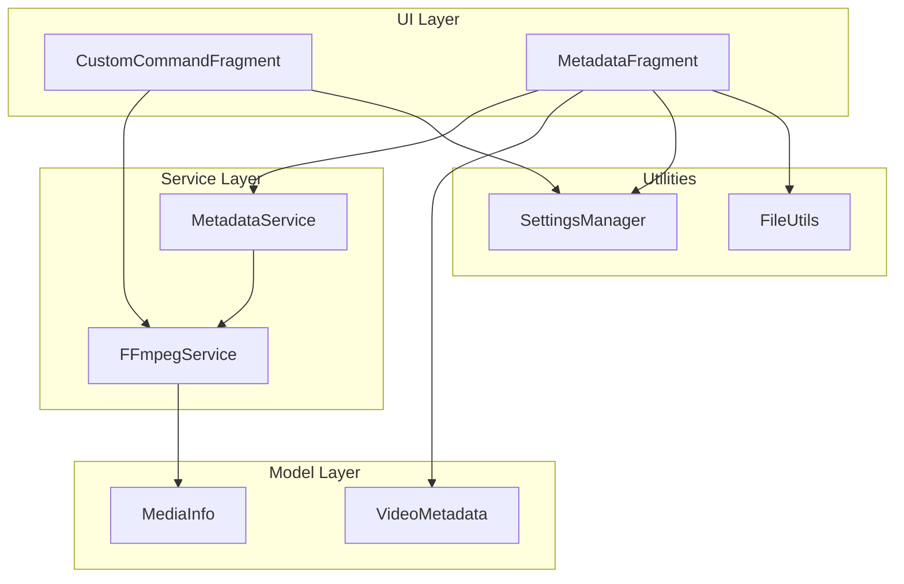
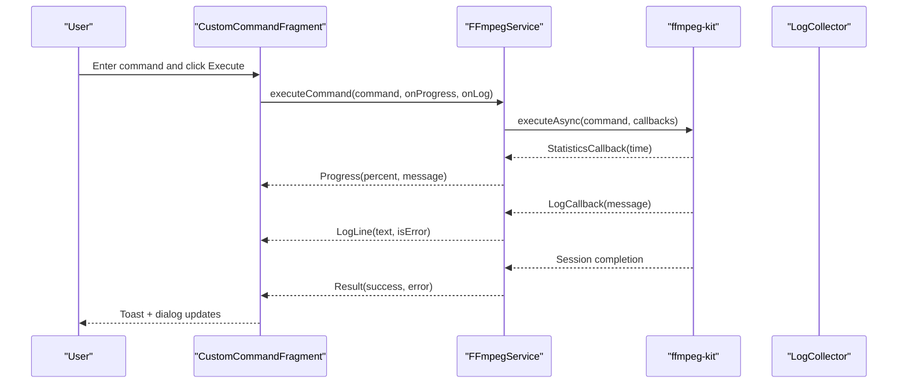
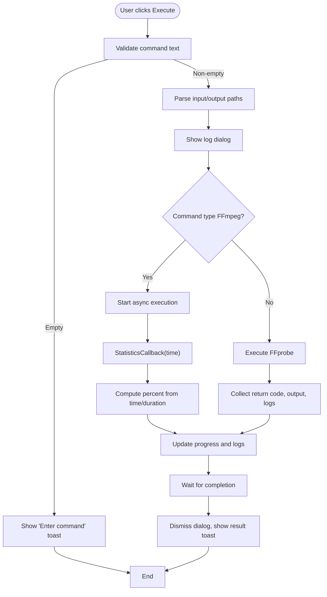
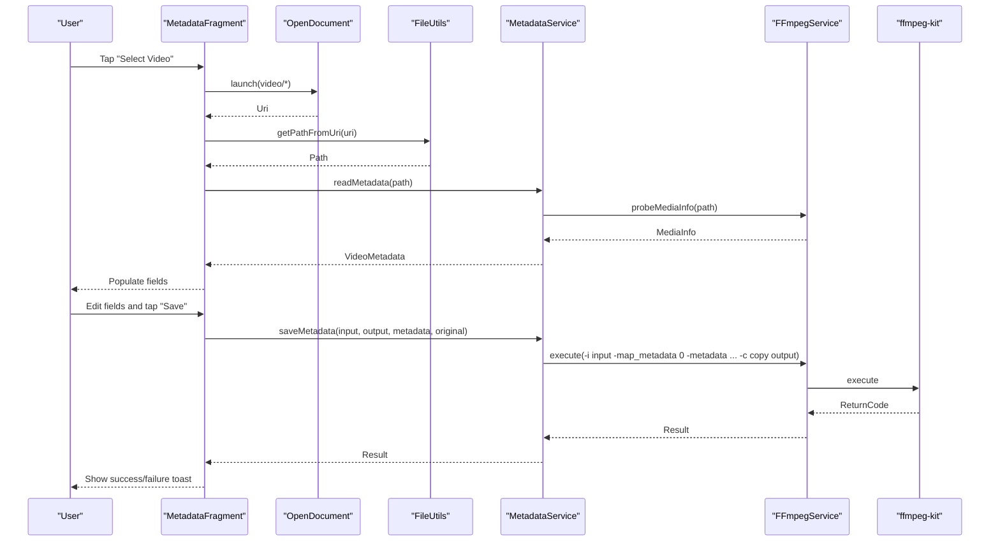
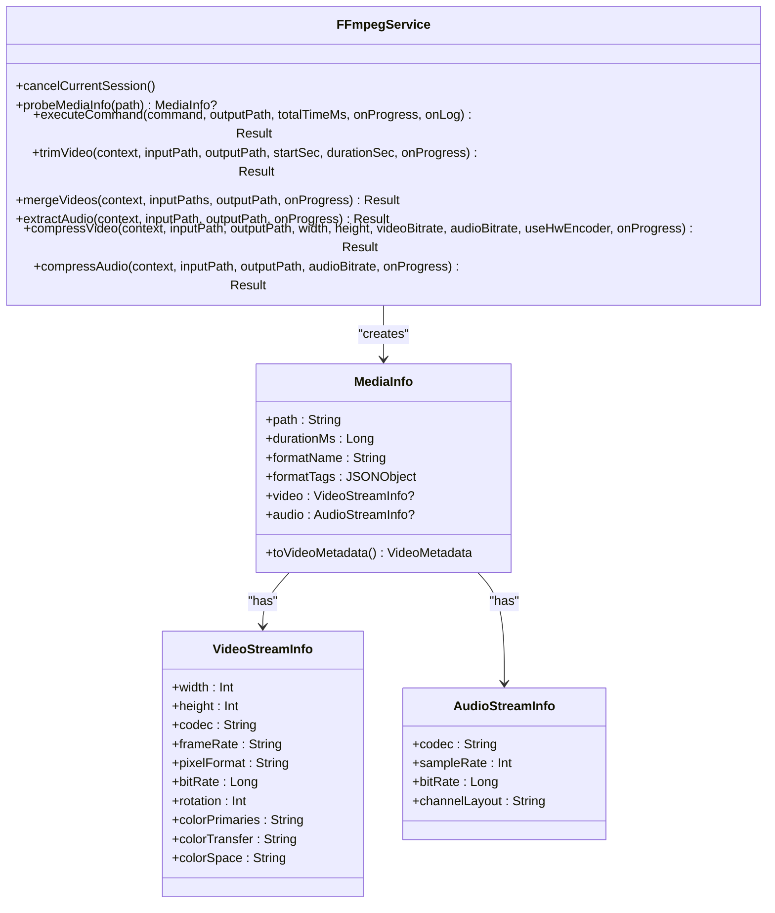
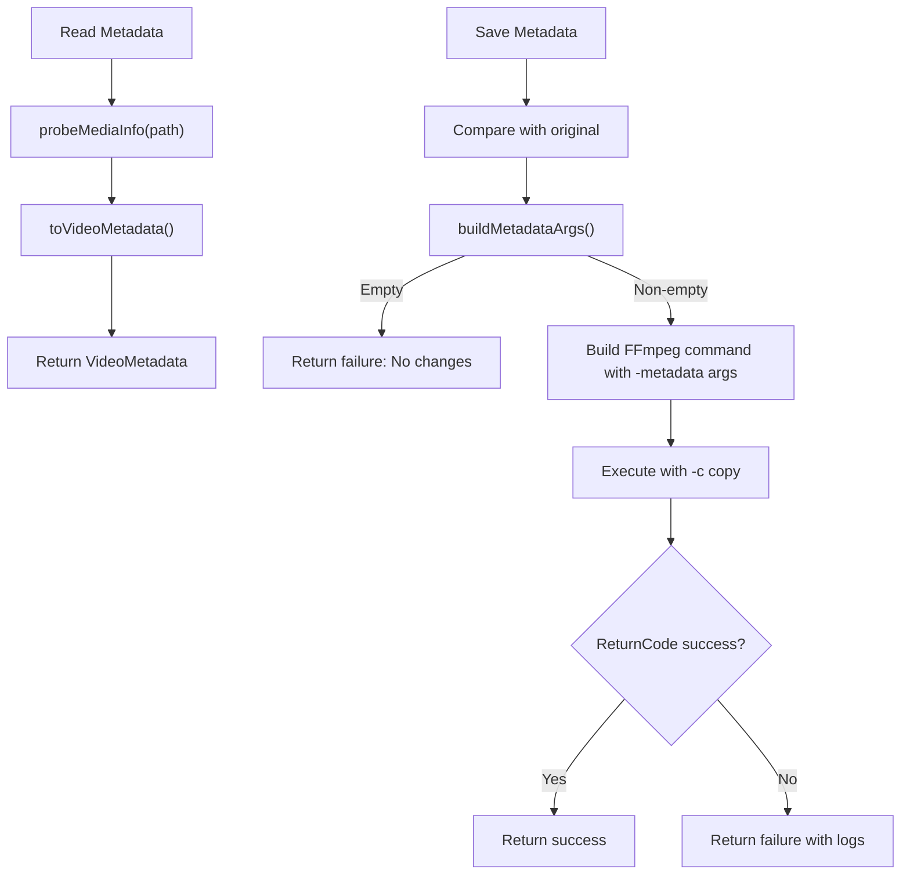
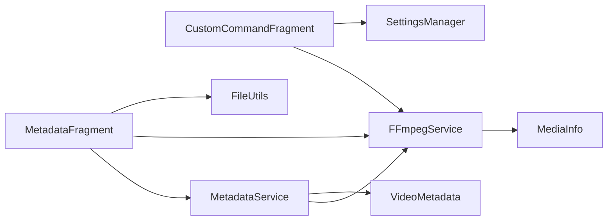

# Custom Command and Metadata Fragments

<cite>
**Referenced Files in This Document**
- [CustomCommandFragment.kt](file://app/src/main/java/com/pisces312/streamclip/fragment/CustomCommandFragment.kt)
- [MetadataFragment.kt](file://app/src/main/java/com/pisces312/streamclip/fragment/MetadataFragment.kt)
- [FFmpegService.kt](file://app/src/main/java/com/pisces312/streamclip/service/FFmpegService.kt)
- [MetadataService.kt](file://app/src/main/java/com/pisces312/streamclip/service/MetadataService.kt)
- [VideoMetadata.kt](file://app/src/main/java/com/pisces312/streamclip/model/VideoMetadata.kt)
- [MediaInfo.kt](file://app/src/main/java/com/pisces312/streamclip/model/MediaInfo.kt)
- [fragment_custom_command.xml](file://app/src/main/res/layout/fragment_custom_command.xml)
- [fragment_metadata.xml](file://app/src/main/res/layout/fragment_metadata.xml)
- [strings.xml](file://app/src/main/res/values/strings.xml)
- [SettingsManager.kt](file://app/src/main/java/com/pisces312/streamclip/util/SettingsManager.kt)
- [FileUtils.kt](file://app/src/main/java/com/pisces312/streamclip/util/FileUtils.kt)
</cite>

## Table of Contents
1. [Introduction](#introduction)
2. [Project Structure](#project-structure)
3. [Core Components](#core-components)
4. [Architecture Overview](#architecture-overview)
5. [Detailed Component Analysis](#detailed-component-analysis)
6. [Dependency Analysis](#dependency-analysis)
7. [Performance Considerations](#performance-considerations)
8. [Troubleshooting Guide](#troubleshooting-guide)
9. [Conclusion](#conclusion)

## Introduction
This document provides comprehensive technical documentation for StreamClip’s advanced fragment components focused on custom FFmpeg command execution and metadata operations. It covers:
- CustomCommandFragment: Building, validating, and executing custom FFmpeg/FFprobe commands with real-time logging, progress monitoring, and cancellation.
- MetadataFragment: Reading, editing, and writing video metadata with GPS coordinates, format tags, and custom metadata injection.
- Integration with FFmpegService for command execution, log collection, and progress callbacks.
- Safety validation, parameter parsing, and user interface patterns for robust workflows.
- Advanced features including custom filter chains, complex parameter combinations, and metadata manipulation.

## Project Structure
The relevant components are organized by feature and responsibility:
- UI fragments: CustomCommandFragment and MetadataFragment manage user interactions and display.
- Services: FFmpegService orchestrates FFmpeg/FFprobe execution and progress/log callbacks; MetadataService handles metadata read/write.
- Models: VideoMetadata and MediaInfo encapsulate metadata and media information.
- Utilities: SettingsManager and FileUtils support runtime preferences and file path handling.

**Diagram sources**
- [CustomCommandFragment.kt:28-331](file://app/src/main/java/com/pisces312/streamclip/fragment/CustomCommandFragment.kt#L28-L331)
- [MetadataFragment.kt:26-224](file://app/src/main/java/com/pisces312/streamclip/fragment/MetadataFragment.kt#L26-L224)
- [FFmpegService.kt:19-420](file://app/src/main/java/com/pisces312/streamclip/service/FFmpegService.kt#L19-L420)
- [MetadataService.kt:10-93](file://app/src/main/java/com/pisces312/streamclip/service/MetadataService.kt#L10-L93)
- [VideoMetadata.kt:5-56](file://app/src/main/java/com/pisces312/streamclip/model/VideoMetadata.kt#L5-L56)
- [MediaInfo.kt:5-165](file://app/src/main/java/com/pisces312/streamclip/model/MediaInfo.kt#L5-L165)
- [SettingsManager.kt:6-208](file://app/src/main/java/com/pisces312/streamclip/util/SettingsManager.kt#L6-L208)
- [FileUtils.kt:17-362](file://app/src/main/java/com/pisces312/streamclip/util/FileUtils.kt#L17-L362)

**Section sources**
- [CustomCommandFragment.kt:28-331](file://app/src/main/java/com/pisces312/streamclip/fragment/CustomCommandFragment.kt#L28-L331)
- [MetadataFragment.kt:26-224](file://app/src/main/java/com/pisces312/streamclip/fragment/MetadataFragment.kt#L26-L224)
- [FFmpegService.kt:19-420](file://app/src/main/java/com/pisces312/streamclip/service/FFmpegService.kt#L19-L420)
- [MetadataService.kt:10-93](file://app/src/main/java/com/pisces312/streamclip/service/MetadataService.kt#L10-L93)
- [VideoMetadata.kt:5-56](file://app/src/main/java/com/pisces312/streamclip/model/VideoMetadata.kt#L5-L56)
- [MediaInfo.kt:5-165](file://app/src/main/java/com/pisces312/streamclip/model/MediaInfo.kt#L5-L165)
- [SettingsManager.kt:6-208](file://app/src/main/java/com/pisces312/streamclip/util/SettingsManager.kt#L6-L208)
- [FileUtils.kt:17-362](file://app/src/main/java/com/pisces312/streamclip/util/FileUtils.kt#L17-L362)

## Core Components
- CustomCommandFragment: Provides a command builder UI for FFmpeg and FFprobe, parses input/output paths, executes commands asynchronously, and displays real-time logs and progress.
- MetadataFragment: Allows selecting a video, reading metadata, editing fields (title, artist, creation time, location, comment), and saving changes losslessly via FFmpeg.
- FFmpegService: Centralized service for executing FFmpeg/FFprobe commands, collecting logs, calculating progress, and managing cancellation.
- MetadataService: Encapsulates metadata read/write operations, builds FFmpeg metadata arguments, and generates output paths.
- VideoMetadata and MediaInfo: Data models for metadata and media information, including convenience accessors and tag handling.

**Section sources**
- [CustomCommandFragment.kt:28-331](file://app/src/main/java/com/pisces312/streamclip/fragment/CustomCommandFragment.kt#L28-L331)
- [MetadataFragment.kt:26-224](file://app/src/main/java/com/pisces312/streamclip/fragment/MetadataFragment.kt#L26-L224)
- [FFmpegService.kt:19-420](file://app/src/main/java/com/pisces312/streamclip/service/FFmpegService.kt#L19-L420)
- [MetadataService.kt:10-93](file://app/src/main/java/com/pisces312/streamclip/service/MetadataService.kt#L10-L93)
- [VideoMetadata.kt:5-56](file://app/src/main/java/com/pisces312/streamclip/model/VideoMetadata.kt#L5-L56)
- [MediaInfo.kt:5-165](file://app/src/main/java/com/pisces312/streamclip/model/MediaInfo.kt#L5-L165)

## Architecture Overview
The system follows a layered architecture:
- UI fragments orchestrate user actions and present results.
- Services abstract FFmpeg/FFprobe execution and metadata operations.
- Models encapsulate data structures and provide convenience methods.
- Utilities support settings and file path resolution.

**Diagram sources**
- [CustomCommandFragment.kt:89-204](file://app/src/main/java/com/pisces312/streamclip/fragment/CustomCommandFragment.kt#L89-L204)
- [FFmpegService.kt:152-241](file://app/src/main/java/com/pisces312/streamclip/service/FFmpegService.kt#L152-L241)

## Detailed Component Analysis

### CustomCommandFragment: Custom FFmpeg Command Builder
- Responsibilities:
  - UI for command type selection (FFmpeg/FFprobe), command input, execution button, progress bar, and status text.
  - Command parsing for input and output paths.
  - Real-time progress and log collection with a dedicated dialog.
  - Cancellation support and screen-on preference handling.
- Key behaviors:
  - Command type spinner sets hints and pre-filled examples.
  - Input path parsing uses a regex to locate the first -i argument value.
  - Output path parsing handles quoted and unquoted values, extracting the last non-option token.
  - Progress percentage computed from FFmpeg statistics time and total duration.
  - Logs appended to a scrollable TextView; dialog supports copy-to-clipboard and cancellation.
  - Screen kept on during long-running operations based on settings.

**Diagram sources**
- [CustomCommandFragment.kt:89-204](file://app/src/main/java/com/pisces312/streamclip/fragment/CustomCommandFragment.kt#L89-L204)
- [FFmpegService.kt:152-241](file://app/src/main/java/com/pisces312/streamclip/service/FFmpegService.kt#L152-L241)

**Section sources**
- [CustomCommandFragment.kt:28-331](file://app/src/main/java/com/pisces312/streamclip/fragment/CustomCommandFragment.kt#L28-L331)
- [strings.xml:134-136](file://app/src/main/res/values/strings.xml#L134-L136)
- [SettingsManager.kt:44-50](file://app/src/main/java/com/pisces312/streamclip/util/SettingsManager.kt#L44-L50)

### MetadataFragment: Video Metadata Editor
- Responsibilities:
  - Select a video via Android’s document picker.
  - Read metadata using FFmpegService.probeMediaInfo and populate editable fields.
  - Detect changes and enable save/reset buttons accordingly.
  - Save metadata losslessly using FFmpeg with -c copy and -map_metadata.
- Key behaviors:
  - Uses ActivityResultContracts.OpenDocument to select video URIs.
  - Resolves URIs to file paths via FileUtils.getPathFromUri.
  - Reads metadata via MetadataService.readMetadata, which delegates to FFmpegService.probeMediaInfo.
  - Builds FFmpeg metadata arguments only for changed fields using VideoMetadata.buildMetadataArgs.
  - Generates output path by appending “_meta” before extension via MetadataService.generateOutputPath.
  - Keeps screen on during processing based on settings.

**Diagram sources**
- [MetadataFragment.kt:76-209](file://app/src/main/java/com/pisces312/streamclip/fragment/MetadataFragment.kt#L76-L209)
- [MetadataService.kt:15-67](file://app/src/main/java/com/pisces312/streamclip/service/MetadataService.kt#L15-L67)
- [FFmpegService.kt:56-147](file://app/src/main/java/com/pisces312/streamclip/service/FFmpegService.kt#L56-L147)
- [VideoMetadata.kt:23-41](file://app/src/main/java/com/pisces312/streamclip/model/VideoMetadata.kt#L23-L41)

**Section sources**
- [MetadataFragment.kt:26-224](file://app/src/main/java/com/pisces312/streamclip/fragment/MetadataFragment.kt#L26-L224)
- [MetadataService.kt:10-93](file://app/src/main/java/com/pisces312/streamclip/service/MetadataService.kt#L10-L93)
- [VideoMetadata.kt:5-56](file://app/src/main/java/com/pisces312/streamclip/model/VideoMetadata.kt#L5-L56)
- [MediaInfo.kt:142-144](file://app/src/main/java/com/pisces312/streamclip/model/MediaInfo.kt#L142-L144)
- [FileUtils.kt:123-125](file://app/src/main/java/com/pisces312/streamclip/util/FileUtils.kt#L123-L125)

### FFmpegService: Command Execution and Progress Monitoring
- Responsibilities:
  - Execute FFmpeg/FFprobe commands asynchronously.
  - Parse ffprobe JSON output into MediaInfo.
  - Compute progress percentage from statistics time and total duration.
  - Provide cancellation for ongoing sessions.
- Key behaviors:
  - probeMediaInfo parses format and streams, extracts tags, and computes derived properties.
  - executeCommand supports optional onProgress and onLog callbacks; cancellation resumes coroutine.
  - trimVideo, mergeVideos, extractAudio, compressVideo, and compressAudio demonstrate advanced workflows.

**Diagram sources**
- [FFmpegService.kt:19-420](file://app/src/main/java/com/pisces312/streamclip/service/FFmpegService.kt#L19-L420)
- [MediaInfo.kt:5-165](file://app/src/main/java/com/pisces312/streamclip/model/MediaInfo.kt#L5-L165)

**Section sources**
- [FFmpegService.kt:19-420](file://app/src/main/java/com/pisces312/streamclip/service/FFmpegService.kt#L19-L420)
- [MediaInfo.kt:5-165](file://app/src/main/java/com/pisces312/streamclip/model/MediaInfo.kt#L5-L165)

### MetadataService: Metadata Read/Write Pipeline
- Responsibilities:
  - Read metadata via FFmpegService.probeMediaInfo and convert to VideoMetadata.
  - Save metadata by constructing FFmpeg -metadata arguments for changed fields and re-muxing with -c copy.
  - Generate safe output paths for edited files.
- Key behaviors:
  - buildMetadataArgs emits only changed fields to minimize unnecessary writes.
  - Uses -map_metadata 0 to preserve source metadata and adds only changed tags.

**Diagram sources**
- [MetadataService.kt:15-67](file://app/src/main/java/com/pisces312/streamclip/service/MetadataService.kt#L15-L67)
- [VideoMetadata.kt:23-41](file://app/src/main/java/com/pisces312/streamclip/model/VideoMetadata.kt#L23-L41)
- [FFmpegService.kt:56-147](file://app/src/main/java/com/pisces312/streamclip/service/FFmpegService.kt#L56-L147)

**Section sources**
- [MetadataService.kt:10-93](file://app/src/main/java/com/pisces312/streamclip/service/MetadataService.kt#L10-L93)
- [VideoMetadata.kt:5-56](file://app/src/main/java/com/pisces312/streamclip/model/VideoMetadata.kt#L5-L56)

### UI Layouts and User Experience Patterns
- CustomCommandFragment layout:
  - Spinner for command type with hints and examples.
  - Multi-line EditText for command input.
  - Execute button, horizontal ProgressBar, and status TextView.
- MetadataFragment layout:
  - Video path selection with button.
  - Editable fields for title, artist, creation time, location, and comment.
  - Reset and Save buttons, enabled only when changes exist.
  - Progress indicator during read/save operations.

**Section sources**
- [fragment_custom_command.xml:1-81](file://app/src/main/res/layout/fragment_custom_command.xml#L1-L81)
- [fragment_metadata.xml:1-225](file://app/src/main/res/layout/fragment_metadata.xml#L1-L225)

## Dependency Analysis
- CustomCommandFragment depends on:
  - FFmpegService for execution and progress.
  - SettingsManager for keep-screen-on behavior.
  - LogCollector for diagnostic logging.
- MetadataFragment depends on:
  - MetadataService for read/save operations.
  - FFmpegService for probing media info.
  - FileUtils for resolving URIs to paths.
  - SettingsManager for keep-screen-on behavior.
- FFmpegService depends on:
  - ffmpeg-kit for command execution and statistics.
  - MediaInfo for structured media data.
- MetadataService depends on:
  - FFmpegService for probing and executing metadata edits.
  - VideoMetadata for building metadata arguments.

**Diagram sources**
- [CustomCommandFragment.kt:28-331](file://app/src/main/java/com/pisces312/streamclip/fragment/CustomCommandFragment.kt#L28-L331)
- [MetadataFragment.kt:26-224](file://app/src/main/java/com/pisces312/streamclip/fragment/MetadataFragment.kt#L26-L224)
- [FFmpegService.kt:19-420](file://app/src/main/java/com/pisces312/streamclip/service/FFmpegService.kt#L19-L420)
- [MetadataService.kt:10-93](file://app/src/main/java/com/pisces312/streamclip/service/MetadataService.kt#L10-L93)
- [VideoMetadata.kt:5-56](file://app/src/main/java/com/pisces312/streamclip/model/VideoMetadata.kt#L5-L56)
- [MediaInfo.kt:5-165](file://app/src/main/java/com/pisces312/streamclip/model/MediaInfo.kt#L5-L165)
- [SettingsManager.kt:6-208](file://app/src/main/java/com/pisces312/streamclip/util/SettingsManager.kt#L6-L208)
- [FileUtils.kt:17-362](file://app/src/main/java/com/pisces312/streamclip/util/FileUtils.kt#L17-L362)

**Section sources**
- [CustomCommandFragment.kt:28-331](file://app/src/main/java/com/pisces312/streamclip/fragment/CustomCommandFragment.kt#L28-L331)
- [MetadataFragment.kt:26-224](file://app/src/main/java/com/pisces312/streamclip/fragment/MetadataFragment.kt#L26-L224)
- [FFmpegService.kt:19-420](file://app/src/main/java/com/pisces312/streamclip/service/FFmpegService.kt#L19-L420)
- [MetadataService.kt:10-93](file://app/src/main/java/com/pisces312/streamclip/service/MetadataService.kt#L10-L93)
- [VideoMetadata.kt:5-56](file://app/src/main/java/com/pisces312/streamclip/model/VideoMetadata.kt#L5-L56)
- [MediaInfo.kt:5-165](file://app/src/main/java/com/pisces312/streamclip/model/MediaInfo.kt#L5-L165)
- [SettingsManager.kt:6-208](file://app/src/main/java/com/pisces312/streamclip/util/SettingsManager.kt#L6-L208)
- [FileUtils.kt:17-362](file://app/src/main/java/com/pisces312/streamclip/util/FileUtils.kt#L17-L362)

## Performance Considerations
- Asynchronous execution: Commands run off the main thread using coroutines and ffmpeg-kit callbacks to avoid UI blocking.
- Progress estimation: Percentage computed from statistics time and known duration; fallbacks to unknown when duration is unavailable.
- Memory efficiency: Temporary files used for metadata sidecar and concat lists are cleaned up after operations.
- I/O optimization: Direct reads preferred when possible; cache copy used otherwise to ensure reliable access.

[No sources needed since this section provides general guidance]

## Troubleshooting Guide
- Command validation and safety:
  - Input path parsing uses a regex to find the first -i argument; ensure the command includes a valid input file.
  - Output path parsing handles quoted and unquoted tokens; verify the last non-option token is a valid output path.
  - Empty command triggers a user-facing toast; ensure the command is not blank.
- Cancellation:
  - Cancel button in the log dialog invokes FFmpegService.cancelCurrentSession; repeated cancellations are handled gracefully.
- Metadata editing:
  - If no changes are detected, save is disabled; ensure at least one field is modified.
  - Output path generation appends “_meta”; confirm write permissions to the target directory.
- Logging and diagnostics:
  - All logs are collected via LogCollector and displayed in the dialog; copy-to-clipboard enables sharing for support.
- FFmpegKit stability:
  - Known issue with continuous execution in self-compiled ffmpeg-kit 8.1; avoid consecutive executions without restarts or migrate to official releases.

**Section sources**
- [CustomCommandFragment.kt:89-204](file://app/src/main/java/com/pisces312/streamclip/fragment/CustomCommandFragment.kt#L89-L204)
- [MetadataFragment.kt:164-209](file://app/src/main/java/com/pisces312/streamclip/fragment/MetadataFragment.kt#L164-L209)
- [FFmpegService.kt:24-31](file://app/src/main/java/com/pisces312/streamclip/service/FFmpegService.kt#L24-L31)
- [strings.xml:134-136](file://app/src/main/res/values/strings.xml#L134-L136)

## Conclusion
StreamClip’s CustomCommandFragment and MetadataFragment provide powerful, user-friendly interfaces for advanced FFmpeg operations:
- CustomCommandFragment enables flexible command execution with real-time feedback, progress tracking, and cancellation.
- MetadataFragment offers precise metadata editing with lossless re-muxing and robust change detection.
- FFmpegService centralizes execution, progress calculation, and cancellation, while MetadataService encapsulates metadata workflows.
- Utilities ensure reliability with path resolution, settings management, and file handling.

These components collectively support complex workflows such as custom filter chains, advanced parameter combinations, and metadata manipulation while maintaining usability and safety.