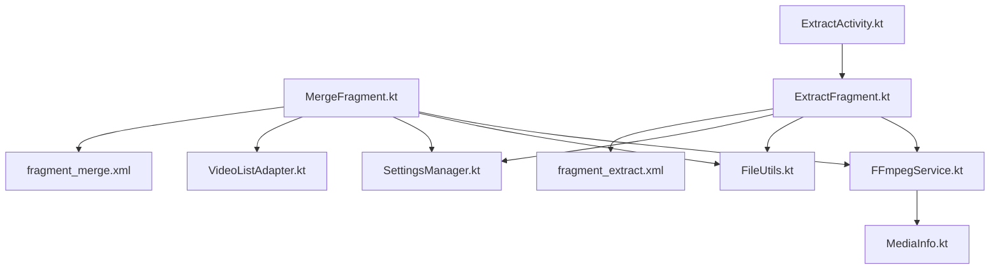
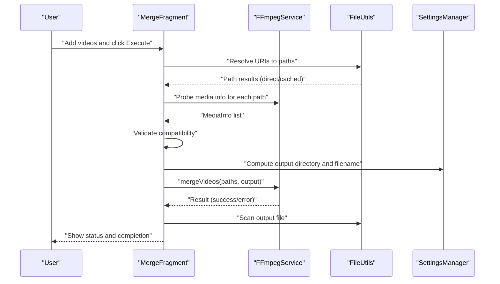
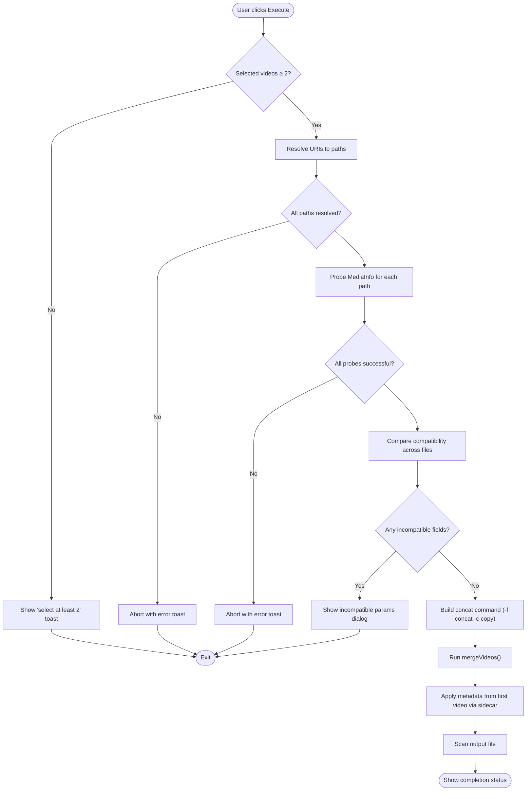
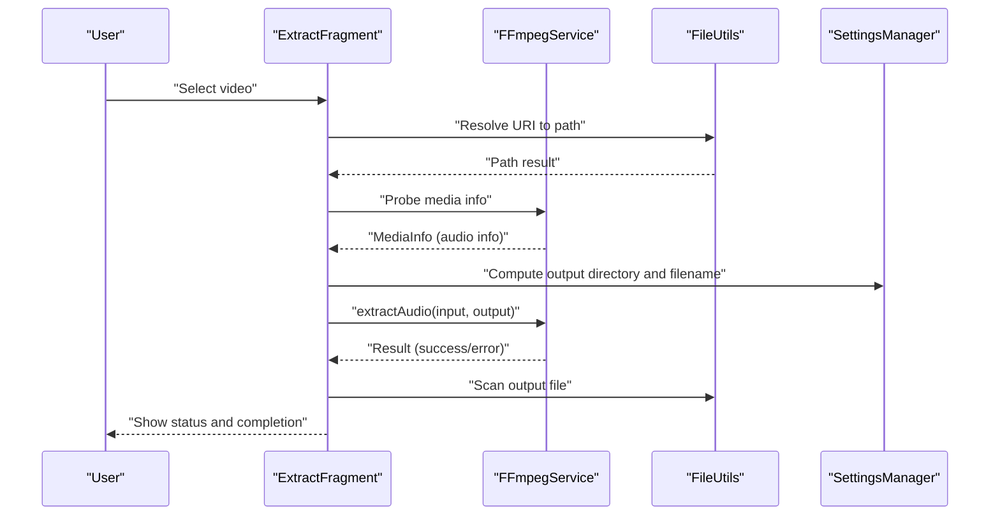
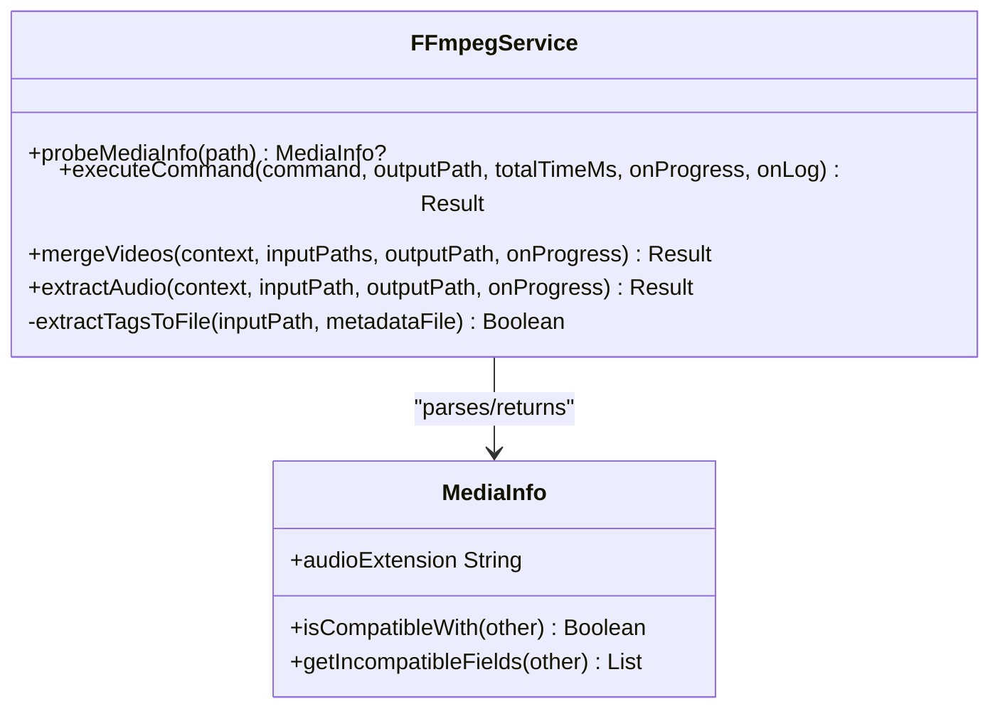
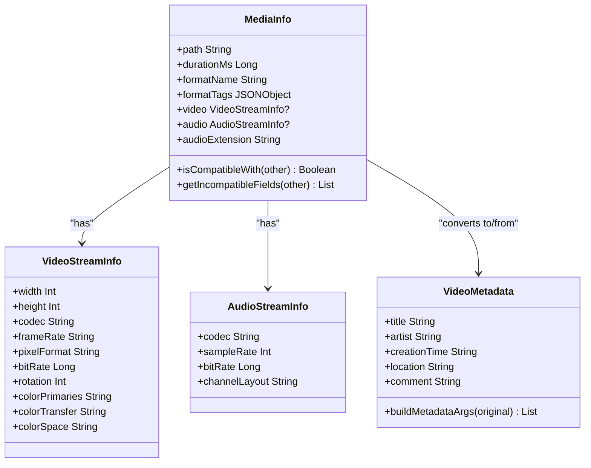
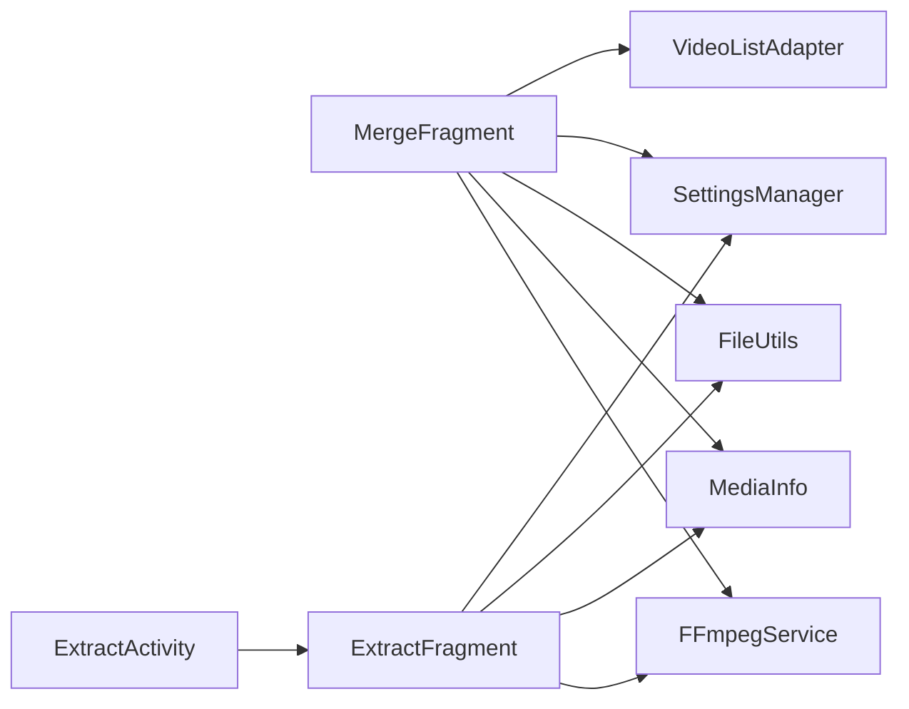

# Merge and Extract Fragments

<cite>
**Referenced Files in This Document**
- [MergeFragment.kt](file://app/src/main/java/com/pisces312/streamclip/fragment/MergeFragment.kt)
- [ExtractFragment.kt](file://app/src/main/java/com/pisces312/streamclip/fragment/ExtractFragment.kt)
- [FFmpegService.kt](file://app/src/main/java/com/pisces312/streamclip/service/FFmpegService.kt)
- [MediaInfo.kt](file://app/src/main/java/com/pisces312/streamclip/model/MediaInfo.kt)
- [VideoMetadata.kt](file://app/src/main/java/com/pisces312/streamclip/model/VideoMetadata.kt)
- [FileUtils.kt](file://app/src/main/java/com/pisces312/streamclip/util/FileUtils.kt)
- [SettingsManager.kt](file://app/src/main/java/com/pisces312/streamclip/util/SettingsManager.kt)
- [VideoListAdapter.kt](file://app/src/main/java/com/pisces312/streamclip/adapter/VideoListAdapter.kt)
- [fragment_merge.xml](file://app/src/main/res/layout/fragment_merge.xml)
- [fragment_extract.xml](file://app/src/main/res/layout/fragment_extract.xml)
- [ExtractActivity.kt](file://app/src/main/java/com/pisces312/streamclip/ui/ExtractActivity.kt)
- [strings.xml](file://app/src/main/res/values/strings.xml)
</cite>

## Table of Contents
1. [Introduction](#introduction)
2. [Project Structure](#project-structure)
3. [Core Components](#core-components)
4. [Architecture Overview](#architecture-overview)
5. [Detailed Component Analysis](#detailed-component-analysis)
6. [Dependency Analysis](#dependency-analysis)
7. [Performance Considerations](#performance-considerations)
8. [Troubleshooting Guide](#troubleshooting-guide)
9. [Conclusion](#conclusion)

## Introduction
This document explains the Merge and Extract fragments that implement lossless video concatenation and audio extraction in StreamClip. It covers:
- MergeFragment: Combines multiple videos using FFmpeg’s concat demuxer, validates compatibility, preserves metadata, and manages the fragment lifecycle.
- ExtractFragment: Extracts audio tracks losslessly from a single video using FFmpeg’s stream copy, selects output formats based on codec, and integrates with background processing.
- Supporting services and models: FFmpegService orchestrates FFmpeg/ffprobe commands, MediaInfo parses media properties, SettingsManager and FileUtils manage output paths and file access, and UI layouts define user interactions.

## Project Structure
The merge and extract features are implemented as Android fragments backed by a service layer and shared models:
- UI fragments: MergeFragment and ExtractFragment
- Service: FFmpegService encapsulates FFmpeg/ffprobe execution and progress callbacks
- Models: MediaInfo and VideoMetadata represent parsed media properties and editable metadata
- Utilities: FileUtils resolves URIs to local paths and manages output directories; SettingsManager stores user preferences
- Layouts: fragment_merge.xml and fragment_extract.xml define the UI for each fragment
- Activity: ExtractActivity supports external intents to open a video directly in the extract fragment

**Diagram sources**
- [MergeFragment.kt:1-278](file://app/src/main/java/com/pisces312/streamclip/fragment/MergeFragment.kt#L1-L278)
- [ExtractFragment.kt:1-209](file://app/src/main/java/com/pisces312/streamclip/fragment/ExtractFragment.kt#L1-L209)
- [FFmpegService.kt:1-420](file://app/src/main/java/com/pisces312/streamclip/service/FFmpegService.kt#L1-L420)
- [MediaInfo.kt:1-165](file://app/src/main/java/com/pisces312/streamclip/model/MediaInfo.kt#L1-L165)
- [FileUtils.kt:1-362](file://app/src/main/java/com/pisces312/streamclip/util/FileUtils.kt#L1-L362)
- [SettingsManager.kt:1-208](file://app/src/main/java/com/pisces312/streamclip/util/SettingsManager.kt#L1-L208)
- [VideoListAdapter.kt:1-35](file://app/src/main/java/com/pisces312/streamclip/adapter/VideoListAdapter.kt#L1-L35)
- [fragment_merge.xml:1-65](file://app/src/main/res/layout/fragment_merge.xml#L1-L65)
- [fragment_extract.xml:1-68](file://app/src/main/res/layout/fragment_extract.xml#L1-L68)
- [ExtractActivity.kt:1-37](file://app/src/main/java/com/pisces312/streamclip/ui/ExtractActivity.kt#L1-L37)

**Section sources**
- [MergeFragment.kt:1-278](file://app/src/main/java/com/pisces312/streamclip/fragment/MergeFragment.kt#L1-L278)
- [ExtractFragment.kt:1-209](file://app/src/main/java/com/pisces312/streamclip/fragment/ExtractFragment.kt#L1-L209)
- [FFmpegService.kt:1-420](file://app/src/main/java/com/pisces312/streamclip/service/FFmpegService.kt#L1-L420)
- [MediaInfo.kt:1-165](file://app/src/main/java/com/pisces312/streamclip/model/MediaInfo.kt#L1-L165)
- [FileUtils.kt:1-362](file://app/src/main/java/com/pisces312/streamclip/util/FileUtils.kt#L1-L362)
- [SettingsManager.kt:1-208](file://app/src/main/java/com/pisces312/streamclip/util/SettingsManager.kt#L1-L208)
- [VideoListAdapter.kt:1-35](file://app/src/main/java/com/pisces312/streamclip/adapter/VideoListAdapter.kt#L1-L35)
- [fragment_merge.xml:1-65](file://app/src/main/res/layout/fragment_merge.xml#L1-L65)
- [fragment_extract.xml:1-68](file://app/src/main/res/layout/fragment_extract.xml#L1-L68)
- [ExtractActivity.kt:1-37](file://app/src/main/java/com/pisces312/streamclip/ui/ExtractActivity.kt#L1-L37)

## Core Components
- MergeFragment: Manages multiple video selection, validates compatibility, probes media info, constructs FFmpeg concat commands, and displays progress and outcomes.
- ExtractFragment: Selects a single video, probes audio info, determines output extension from codec, executes audio extraction, and reports results.
- FFmpegService: Provides probe and command execution APIs, progress callbacks, and specialized operations like mergeVideos and extractAudio.
- MediaInfo: Parses ffprobe JSON into typed properties and exposes compatibility checks and audio extension mapping.
- FileUtils: Resolves URIs to direct or cached paths, computes output directories, and scans files into the media store.
- SettingsManager: Persists user preferences for output directories, timestamps, and screen-on behavior.
- UI layouts: Provide controls for adding/removing videos, executing operations, and displaying status.

**Section sources**
- [MergeFragment.kt:28-278](file://app/src/main/java/com/pisces312/streamclip/fragment/MergeFragment.kt#L28-L278)
- [ExtractFragment.kt:25-209](file://app/src/main/java/com/pisces312/streamclip/fragment/ExtractFragment.kt#L25-L209)
- [FFmpegService.kt:19-420](file://app/src/main/java/com/pisces312/streamclip/service/FFmpegService.kt#L19-L420)
- [MediaInfo.kt:5-165](file://app/src/main/java/com/pisces312/streamclip/model/MediaInfo.kt#L5-L165)
- [FileUtils.kt:17-362](file://app/src/main/java/com/pisces312/streamclip/util/FileUtils.kt#L17-L362)
- [SettingsManager.kt:6-208](file://app/src/main/java/com/pisces312/streamclip/util/SettingsManager.kt#L6-L208)
- [fragment_merge.xml:10-65](file://app/src/main/res/layout/fragment_merge.xml#L10-L65)
- [fragment_extract.xml:10-68](file://app/src/main/res/layout/fragment_extract.xml#L10-L68)

## Architecture Overview
The fragments delegate to FFmpegService for all FFmpeg/ffprobe operations. Media probing occurs before execution to validate compatibility and inform UI. Output paths are computed using SettingsManager and FileUtils. Progress updates are handled asynchronously, and the UI reflects status and outcomes.

**Diagram sources**
- [MergeFragment.kt:135-232](file://app/src/main/java/com/pisces312/streamclip/fragment/MergeFragment.kt#L135-L232)
- [FFmpegService.kt:297-334](file://app/src/main/java/com/pisces312/streamclip/service/FFmpegService.kt#L297-L334)
- [FileUtils.kt:30-118](file://app/src/main/java/com/pisces312/streamclip/util/FileUtils.kt#L30-L118)
- [SettingsManager.kt:67-114](file://app/src/main/java/com/pisces312/streamclip/util/SettingsManager.kt#L67-L114)

## Detailed Component Analysis

### MergeFragment: Lossless Concatenation with Metadata Preservation
Key responsibilities:
- File selection and ordering: Uses a RecyclerView with VideoListAdapter to manage multiple video URIs.
- Input validation: Resolves URIs to paths and checks read mode (direct vs cached).
- Compatibility checking: Probes each video and compares essential properties (resolution, codecs, frame rate, pixel format, rotation).
- Execution: Builds a concat playlist and runs FFmpeg with -f concat -c copy, then applies metadata from the first video via a sidecar file.
- Output handling: Computes output directory and filename, scans the file, and updates UI status.

**Diagram sources**
- [MergeFragment.kt:135-232](file://app/src/main/java/com/pisces312/streamclip/fragment/MergeFragment.kt#L135-L232)
- [FFmpegService.kt:297-334](file://app/src/main/java/com/pisces312/streamclip/service/FFmpegService.kt#L297-L334)
- [MediaInfo.kt:101-121](file://app/src/main/java/com/pisces312/streamclip/model/MediaInfo.kt#L101-L121)

Implementation highlights:
- Concat demuxer workflow: Creates a temporary playlist file with file entries and invokes FFmpeg with -f concat -safe 0 -c copy to avoid re-encoding.
- Metadata preservation: After concatenation, extracts format-level tags from the first input and re-merges with -map_metadata to preserve GPS/location and other tags.
- Quality preservation: Uses -c copy to maintain original video/audio quality.
- Error handling: Validates minimum input count, handles probe failures, and presents user-friendly dialogs for incompatible parameters.

**Section sources**
- [MergeFragment.kt:35-96](file://app/src/main/java/com/pisces312/streamclip/fragment/MergeFragment.kt#L35-L96)
- [MergeFragment.kt:135-232](file://app/src/main/java/com/pisces312/streamclip/fragment/MergeFragment.kt#L135-L232)
- [MergeFragment.kt:244-271](file://app/src/main/java/com/pisces312/streamclip/fragment/MergeFragment.kt#L244-L271)
- [FFmpegService.kt:297-334](file://app/src/main/java/com/pisces312/streamclip/service/FFmpegService.kt#L297-L334)
- [MediaInfo.kt:101-121](file://app/src/main/java/com/pisces312/streamclip/model/MediaInfo.kt#L101-L121)
- [strings.xml:139-142](file://app/src/main/res/values/strings.xml#L139-L142)

### ExtractFragment: Lossless Audio Extraction Pipeline
Key responsibilities:
- Single video selection: Opens a file picker restricted to video/* and supports external intents via ExtractActivity.
- Audio probing: Uses ffprobe to display audio codec, sample rate, and channel layout.
- Stream selection and output: Determines output extension based on audio codec mapping and executes FFmpeg with -vn -c:a copy to extract losslessly.
- Output handling: Computes output directory and filename, scans the file, and updates UI status.

**Diagram sources**
- [ExtractFragment.kt:32-82](file://app/src/main/java/com/pisces312/streamclip/fragment/ExtractFragment.kt#L32-L82)
- [ExtractFragment.kt:119-134](file://app/src/main/java/com/pisces312/streamclip/fragment/ExtractFragment.kt#L119-L134)
- [ExtractFragment.kt:136-191](file://app/src/main/java/com/pisces312/streamclip/fragment/ExtractFragment.kt#L136-L191)
- [FFmpegService.kt:339-350](file://app/src/main/java/com/pisces312/streamclip/service/FFmpegService.kt#L339-L350)
- [MediaInfo.kt:123-140](file://app/src/main/java/com/pisces312/streamclip/model/MediaInfo.kt#L123-L140)

Implementation highlights:
- Lossless extraction: Uses -vn to disable video and -c:a copy to copy the audio stream without re-encoding.
- Codec-to-format mapping: Chooses appropriate audio extension based on detected codec.
- External intent support: ExtractActivity forwards an external video URI to ExtractFragment for direct invocation.

**Section sources**
- [ExtractFragment.kt:25-209](file://app/src/main/java/com/pisces312/streamclip/fragment/ExtractFragment.kt#L25-L209)
- [ExtractActivity.kt:12-31](file://app/src/main/java/com/pisces312/streamclip/ui/ExtractActivity.kt#L12-L31)
- [FFmpegService.kt:339-350](file://app/src/main/java/com/pisces312/streamclip/service/FFmpegService.kt#L339-L350)
- [MediaInfo.kt:123-140](file://app/src/main/java/com/pisces312/streamclip/model/MediaInfo.kt#L123-L140)

### FFmpegService: Command Execution and Progress Callbacks
Responsibilities:
- Probe media info: Executes ffprobe and parses JSON into MediaInfo.
- Execute commands: Runs FFmpeg async with optional progress and log callbacks.
- Specialized operations: mergeVideos and extractAudio implement lossless workflows.
- Metadata application: Two-phase metadata injection for merged outputs.

**Diagram sources**
- [FFmpegService.kt:19-420](file://app/src/main/java/com/pisces312/streamclip/service/FFmpegService.kt#L19-L420)
- [MediaInfo.kt:5-165](file://app/src/main/java/com/pisces312/streamclip/model/MediaInfo.kt#L5-L165)

**Section sources**
- [FFmpegService.kt:56-147](file://app/src/main/java/com/pisces312/streamclip/service/FFmpegService.kt#L56-L147)
- [FFmpegService.kt:152-241](file://app/src/main/java/com/pisces312/streamclip/service/FFmpegService.kt#L152-L241)
- [FFmpegService.kt:297-334](file://app/src/main/java/com/pisces312/streamclip/service/FFmpegService.kt#L297-L334)
- [FFmpegService.kt:339-350](file://app/src/main/java/com/pisces312/streamclip/service/FFmpegService.kt#L339-L350)

### MediaInfo and VideoMetadata: Data Models and Compatibility
- MediaInfo: Holds format-level and stream-level properties, computes derived values (aspect ratio, HDR indicators), and provides compatibility checks and audio extension mapping.
- VideoMetadata: Encapsulates editable metadata fields and generates FFmpeg -metadata arguments for selective updates.

**Diagram sources**
- [MediaInfo.kt:5-165](file://app/src/main/java/com/pisces312/streamclip/model/MediaInfo.kt#L5-L165)
- [VideoMetadata.kt:5-56](file://app/src/main/java/com/pisces312/streamclip/model/VideoMetadata.kt#L5-L56)

**Section sources**
- [MediaInfo.kt:101-140](file://app/src/main/java/com/pisces312/streamclip/model/MediaInfo.kt#L101-L140)
- [VideoMetadata.kt:22-41](file://app/src/main/java/com/pisces312/streamclip/model/VideoMetadata.kt#L22-L41)

### UI Patterns and Lifecycle Management
- MergeFragment UI: RecyclerView lists selected videos with remove actions; status bar indicates direct-read vs cached; execute button enabled when ≥2 items.
- ExtractFragment UI: Displays selected file name and audio info; execute button enabled after selection; supports external video via ExtractActivity.
- Fragment lifecycle: Properly manages binding lifecycle and clears window flags on completion.

**Section sources**
- [fragment_merge.xml:10-65](file://app/src/main/res/layout/fragment_merge.xml#L10-L65)
- [fragment_extract.xml:10-68](file://app/src/main/res/layout/fragment_extract.xml#L10-L68)
- [MergeFragment.kt:70-79](file://app/src/main/java/com/pisces312/streamclip/fragment/MergeFragment.kt#L70-L79)
- [ExtractFragment.kt:55-82](file://app/src/main/java/com/pisces312/streamclip/fragment/ExtractFragment.kt#L55-L82)
- [ExtractActivity.kt:14-31](file://app/src/main/java/com/pisces312/streamclip/ui/ExtractActivity.kt#L14-L31)

## Dependency Analysis
- MergeFragment depends on:
  - FFmpegService for probing and merging
  - MediaInfo for compatibility checks
  - FileUtils for path resolution
  - SettingsManager for output computation
  - VideoListAdapter for UI list management
- ExtractFragment depends on:
  - FFmpegService for probing and extracting
  - MediaInfo for audio codec mapping
  - FileUtils for path resolution
  - SettingsManager for output computation
  - ExtractActivity for external intent handling

**Diagram sources**
- [MergeFragment.kt:28-278](file://app/src/main/java/com/pisces312/streamclip/fragment/MergeFragment.kt#L28-L278)
- [ExtractFragment.kt:25-209](file://app/src/main/java/com/pisces312/streamclip/fragment/ExtractFragment.kt#L25-L209)
- [FFmpegService.kt:19-420](file://app/src/main/java/com/pisces312/streamclip/service/FFmpegService.kt#L19-L420)
- [MediaInfo.kt:5-165](file://app/src/main/java/com/pisces312/streamclip/model/MediaInfo.kt#L5-L165)
- [FileUtils.kt:17-362](file://app/src/main/java/com/pisces312/streamclip/util/FileUtils.kt#L17-L362)
- [SettingsManager.kt:6-208](file://app/src/main/java/com/pisces312/streamclip/util/SettingsManager.kt#L6-L208)
- [VideoListAdapter.kt:1-35](file://app/src/main/java/com/pisces312/streamclip/adapter/VideoListAdapter.kt#L1-L35)
- [ExtractActivity.kt:1-37](file://app/src/main/java/com/pisces312/streamclip/ui/ExtractActivity.kt#L1-L37)

**Section sources**
- [MergeFragment.kt:28-278](file://app/src/main/java/com/pisces312/streamclip/fragment/MergeFragment.kt#L28-L278)
- [ExtractFragment.kt:25-209](file://app/src/main/java/com/pisces312/streamclip/fragment/ExtractFragment.kt#L25-L209)
- [FFmpegService.kt:19-420](file://app/src/main/java/com/pisces312/streamclip/service/FFmpegService.kt#L19-L420)
- [MediaInfo.kt:5-165](file://app/src/main/java/com/pisces312/streamclip/model/MediaInfo.kt#L5-L165)
- [FileUtils.kt:17-362](file://app/src/main/java/com/pisces312/streamclip/util/FileUtils.kt#L17-L362)
- [SettingsManager.kt:6-208](file://app/src/main/java/com/pisces312/streamclip/util/SettingsManager.kt#L6-L208)
- [VideoListAdapter.kt:1-35](file://app/src/main/java/com/pisces312/streamclip/adapter/VideoListAdapter.kt#L1-L35)
- [ExtractActivity.kt:1-37](file://app/src/main/java/com/pisces312/streamclip/ui/ExtractActivity.kt#L1-L37)

## Performance Considerations
- Direct read vs cached: Prefer direct reads when possible to avoid copying large files; UI status indicates read mode.
- Background execution: Both fragments keep the screen on during processing per user preference.
- Progress estimation: FFmpegService computes percentage from statistics and estimates remaining time.
- Large files: Use SettingsManager to choose output directories outside app-private storage to prevent cache limitations.
- Metadata application: Two-phase metadata injection avoids re-encoding and minimizes overhead.

[No sources needed since this section provides general guidance]

## Troubleshooting Guide
Common issues and resolutions:
- Format mismatches during merge:
  - Symptom: Incompatible parameters dialog appears listing differences.
  - Cause: Mismatched resolution, codecs, frame rate, pixel format, or rotation.
  - Resolution: Ensure all input videos share the same essential properties; re-encode inputs to align formats if necessary.
- Cannot read files:
  - Symptom: Toast indicating inability to read video/file.
  - Cause: URI cannot be resolved to a readable path.
  - Resolution: Verify permissions and storage access; try selecting files again or move files to accessible locations.
- Probe failures:
  - Symptom: Toast indicating failure to probe media info.
  - Cause: Corrupted or unsupported container.
  - Resolution: Validate input files; use a different player or tool to confirm format integrity.
- Output not visible:
  - Symptom: File not appearing in gallery or file manager.
  - Resolution: FileUtils.scanFile is called automatically; manually refresh if needed.
- External intent not opening:
  - Symptom: No action when opening a video with “Extract audio”.
  - Resolution: Ensure ExtractActivity receives the intent and passes the URI to ExtractFragment.

**Section sources**
- [MergeFragment.kt:180-199](file://app/src/main/java/com/pisces312/streamclip/fragment/MergeFragment.kt#L180-L199)
- [MergeFragment.kt:244-271](file://app/src/main/java/com/pisces312/streamclip/fragment/MergeFragment.kt#L244-L271)
- [MergeFragment.kt:164-178](file://app/src/main/java/com/pisces312/streamclip/fragment/MergeFragment.kt#L164-L178)
- [ExtractFragment.kt:149-157](file://app/src/main/java/com/pisces312/streamclip/fragment/ExtractFragment.kt#L149-L157)
- [strings.xml:139-142](file://app/src/main/res/values/strings.xml#L139-L142)
- [ExtractActivity.kt:17-31](file://app/src/main/java/com/pisces312/streamclip/ui/ExtractActivity.kt#L17-L31)

## Conclusion
MergeFragment and ExtractFragment provide robust, user-friendly workflows for lossless video concatenation and audio extraction. They leverage FFmpegService for reliable command execution, MediaInfo for compatibility and metadata decisions, and FileUtils/SettingsManager for path resolution and output management. The concat demuxer ensures zero-quality degradation, while metadata preservation maintains GPS and other tags. Users benefit from clear UI feedback, progress indication, and practical safeguards against common pitfalls like format mismatches and inaccessible files.