# Specialized Fragment Components

<cite>
**Referenced Files in This Document**
- [TrimSimpleFragment.kt](file://app/src/main/java/com/pisces312/streamclip/fragment/TrimSimpleFragment.kt)
- [Trim2Fragment.kt](file://app/src/main/java/com/pisces312/streamclip/fragment/Trim2Fragment.kt)
- [CompressFragment.kt](file://app/src/main/java/com/pisces312/streamclip/fragment/CompressFragment.kt)
- [AudioCompressFragment.kt](file://app/src/main/java/com/pisces312/streamclip/fragment/AudioCompressFragment.kt)
- [MergeFragment.kt](file://app/src/main/java/com/pisces312/streamclip/fragment/MergeFragment.kt)
- [ExtractFragment.kt](file://app/src/main/java/com/pisces312/streamclip/fragment/ExtractFragment.kt)
- [CustomCommandFragment.kt](file://app/src/main/java/com/pisces312/streamclip/fragment/CustomCommandFragment.kt)
- [MetadataFragment.kt](file://app/src/main/java/com/pisces312/streamclip/fragment/MetadataFragment.kt)
- [FFmpegService.kt](file://app/src/main/java/com/pisces312/streamclip/service/FFmpegService.kt)
- [CompressConfig.kt](file://app/src/main/java/com/pisces312/streamclip/model/CompressConfig.kt)
- [MediaInfo.kt](file://app/src/main/java/com/pisces312/streamclip/model/MediaInfo.kt)
- [VideoMetadata.kt](file://app/src/main/java/com/pisces312/streamclip/model/VideoMetadata.kt)
- [MetadataService.kt](file://app/src/main/java/com/pisces312/streamclip/service/MetadataService.kt)
- [TrimSeekBar.kt](file://app/src/main/java/com/pisces312/streamclip/ui/TrimSeekBar.kt)
</cite>

## Table of Contents
1. [Introduction](#introduction)
2. [Project Structure](#project-structure)
3. [Core Components](#core-components)
4. [Architecture Overview](#architecture-overview)
5. [Detailed Component Analysis](#detailed-component-analysis)
6. [Dependency Analysis](#dependency-analysis)
7. [Performance Considerations](#performance-considerations)
8. [Troubleshooting Guide](#troubleshooting-guide)
9. [Conclusion](#conclusion)

## Introduction
This document provides comprehensive technical documentation for StreamClip’s specialized fragment components that implement video processing operations. It covers lifecycle management, UI organization, state persistence, event handling, and integration with the underlying FFmpegService. Each fragment type is analyzed in depth: trim fragments for lossless trimming, compression fragments for hardware/software encoding, merge fragment for concatenating videos using the concat demuxer, extract fragment for lossless audio extraction, custom command fragment for advanced FFmpeg operations, and metadata fragment for video information display and GPS data handling. The document also explains fragment-to-service communication patterns, parameter validation, user input handling, memory management, performance optimization, and error handling strategies.

## Project Structure
The specialized fragment components reside under the fragment package and integrate with service-layer components for FFmpeg operations, model classes for media metadata, and UI utilities for custom views.

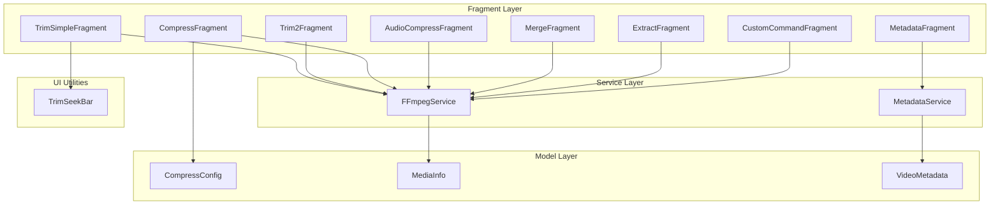

**Diagram sources**
- [TrimSimpleFragment.kt:1-387](file://app/src/main/java/com/pisces312/streamclip/fragment/TrimSimpleFragment.kt#L1-L387)
- [Trim2Fragment.kt:1-286](file://app/src/main/java/com/pisces312/streamclip/fragment/Trim2Fragment.kt#L1-L286)
- [CompressFragment.kt:1-839](file://app/src/main/java/com/pisces312/streamclip/fragment/CompressFragment.kt#L1-L839)
- [AudioCompressFragment.kt:1-417](file://app/src/main/java/com/pisces312/streamclip/fragment/AudioCompressFragment.kt#L1-L417)
- [MergeFragment.kt:1-278](file://app/src/main/java/com/pisces312/streamclip/fragment/MergeFragment.kt#L1-L278)
- [ExtractFragment.kt:1-209](file://app/src/main/java/com/pisces312/streamclip/fragment/ExtractFragment.kt#L1-L209)
- [CustomCommandFragment.kt:1-331](file://app/src/main/java/com/pisces312/streamclip/fragment/CustomCommandFragment.kt#L1-L331)
- [MetadataFragment.kt:1-224](file://app/src/main/java/com/pisces312/streamclip/fragment/MetadataFragment.kt#L1-L224)
- [FFmpegService.kt:1-420](file://app/src/main/java/com/pisces312/streamclip/service/FFmpegService.kt#L1-L420)
- [CompressConfig.kt:1-209](file://app/src/main/java/com/pisces312/streamclip/model/CompressConfig.kt#L1-L209)
- [MediaInfo.kt:1-165](file://app/src/main/java/com/pisces312/streamclip/model/MediaInfo.kt#L1-L165)
- [VideoMetadata.kt:1-56](file://app/src/main/java/com/pisces312/streamclip/model/VideoMetadata.kt#L1-L56)
- [MetadataService.kt:1-93](file://app/src/main/java/com/pisces312/streamclip/service/MetadataService.kt#L1-L93)
- [TrimSeekBar.kt:1-238](file://app/src/main/java/com/pisces312/streamclip/ui/TrimSeekBar.kt#L1-L238)

**Section sources**
- [TrimSimpleFragment.kt:1-387](file://app/src/main/java/com/pisces312/streamclip/fragment/TrimSimpleFragment.kt#L1-L387)
- [Trim2Fragment.kt:1-286](file://app/src/main/java/com/pisces312/streamclip/fragment/Trim2Fragment.kt#L1-L286)
- [CompressFragment.kt:1-839](file://app/src/main/java/com/pisces312/streamclip/fragment/CompressFragment.kt#L1-L839)
- [AudioCompressFragment.kt:1-417](file://app/src/main/java/com/pisces312/streamclip/fragment/AudioCompressFragment.kt#L1-L417)
- [MergeFragment.kt:1-278](file://app/src/main/java/com/pisces312/streamclip/fragment/MergeFragment.kt#L1-L278)
- [ExtractFragment.kt:1-209](file://app/src/main/java/com/pisces312/streamclip/fragment/ExtractFragment.kt#L1-L209)
- [CustomCommandFragment.kt:1-331](file://app/src/main/java/com/pisces312/streamclip/fragment/CustomCommandFragment.kt#L1-L331)
- [MetadataFragment.kt:1-224](file://app/src/main/java/com/pisces312/streamclip/fragment/MetadataFragment.kt#L1-L224)

## Core Components
- Trim fragments (TrimSimpleFragment and Trim2Fragment): Implement lossless trimming using FFmpeg’s -c copy to avoid re-encoding. They manage ExoPlayer playback, UI controls for selecting input, setting trim ranges, and executing trimming operations. Both fragments support external video URIs passed via intents and persist input directory preferences.
- Compression fragments (CompressFragment and AudioCompressFragment): Provide hardware and software encoding options with configurable encoders, bitrates, CRF, presets, frame rates, resolutions, and audio settings. They display original and output media info cards, support batch compression, and show progress via a modal log dialog with cancel capability.
- Merge fragment (MergeFragment): Concatenates multiple videos using the concat demuxer for lossless operation. It validates compatibility across input videos and preserves metadata (including GPS) from the first video.
- Extract fragment (ExtractFragment): Performs lossless audio extraction using -c:a copy and displays audio information via ffprobe.
- Custom command fragment (CustomCommandFragment): Allows advanced users to execute arbitrary FFmpeg or FFprobe commands with progress reporting and cancellation.
- Metadata fragment (MetadataFragment): Reads and writes video metadata (title, artist, creation time, location, comment) using FFprobe and FFmpeg, preserving existing metadata and applying only changed fields.

**Section sources**
- [TrimSimpleFragment.kt:30-387](file://app/src/main/java/com/pisces312/streamclip/fragment/TrimSimpleFragment.kt#L30-L387)
- [Trim2Fragment.kt:27-286](file://app/src/main/java/com/pisces312/streamclip/fragment/Trim2Fragment.kt#L27-L286)
- [CompressFragment.kt:40-725](file://app/src/main/java/com/pisces312/streamclip/fragment/CompressFragment.kt#L40-L725)
- [AudioCompressFragment.kt:33-417](file://app/src/main/java/com/pisces312/streamclip/fragment/AudioCompressFragment.kt#L33-L417)
- [MergeFragment.kt:28-278](file://app/src/main/java/com/pisces312/streamclip/fragment/MergeFragment.kt#L28-L278)
- [ExtractFragment.kt:25-209](file://app/src/main/java/com/pisces312/streamclip/fragment/ExtractFragment.kt#L25-L209)
- [CustomCommandFragment.kt:28-331](file://app/src/main/java/com/pisces312/streamclip/fragment/CustomCommandFragment.kt#L28-L331)
- [MetadataFragment.kt:26-224](file://app/src/main/java/com/pisces312/streamclip/fragment/MetadataFragment.kt#L26-L224)

## Architecture Overview
The fragments orchestrate user interactions and delegate heavy lifting to FFmpegService and MetadataService. MediaInfo and VideoMetadata encapsulate parsed metadata and provide convenience accessors and compatibility checks. CompressConfig centralizes configuration for compression operations and generates FFmpeg commands.

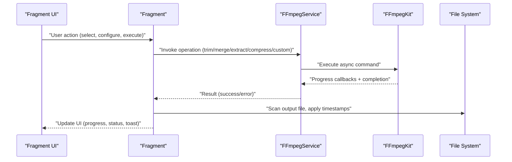

**Diagram sources**
- [FFmpegService.kt:152-241](file://app/src/main/java/com/pisces312/streamclip/service/FFmpegService.kt#L152-L241)
- [CompressFragment.kt:602-679](file://app/src/main/java/com/pisces312/streamclip/fragment/CompressFragment.kt#L602-L679)
- [TrimSimpleFragment.kt:288-354](file://app/src/main/java/com/pisces312/streamclip/fragment/TrimSimpleFragment.kt#L288-L354)
- [MergeFragment.kt:135-231](file://app/src/main/java/com/pisces312/streamclip/fragment/MergeFragment.kt#L135-L231)
- [ExtractFragment.kt:136-191](file://app/src/main/java/com/pisces312/streamclip/fragment/ExtractFragment.kt#L136-L191)
- [CustomCommandFragment.kt:110-198](file://app/src/main/java/com/pisces312/streamclip/fragment/CustomCommandFragment.kt#L110-L198)

## Detailed Component Analysis

### TrimSimpleFragment
- Lifecycle management: Initializes ExoPlayer in onViewCreated, manages playback state, and releases player in onDestroyView. Handles external video URIs via intent extras.
- UI component organization: Uses FragmentTrimSimpleBinding, includes a custom TrimSeekBar, ExoPlayer view, and input/output status indicators.
- State persistence: Stores selected video URI, duration, trim range (startSec/endSec), and source file timestamps for later restoration.
- Event handling: Responds to video selection, click-to-play/pause, TrimSeekBar range changes, manual time input dialogs, and execute button.
- Parameter validation: Ensures non-empty URI, minimum 1-second trim duration, and valid time format parsing (MM:SS or seconds).
- Integration with FFmpegService: Calls FFmpegService.trimVideo with start seconds and duration seconds; applies original file timestamps post-execution.
- Memory management: Releases ExoPlayer and clears binding references; keeps UI updates on main thread.
- Performance optimization: Uses keep-screen-on flag during execution; avoids re-encoding via -c copy.
- Error handling: Displays meaningful toasts for invalid inputs and FFmpeg errors; clears keep-screen-on flag on completion.

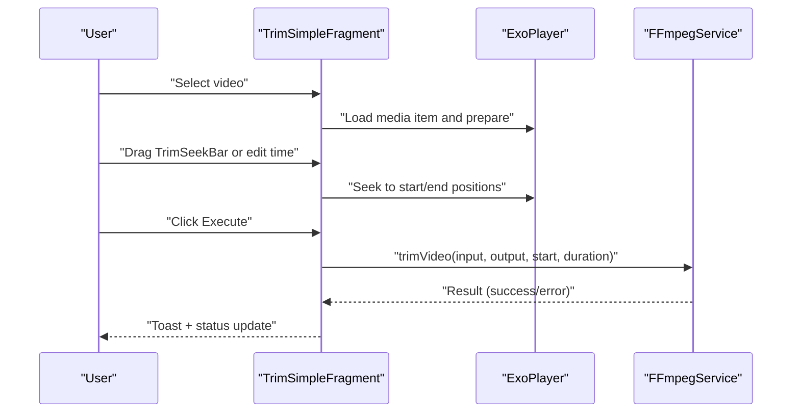

**Diagram sources**
- [TrimSimpleFragment.kt:68-123](file://app/src/main/java/com/pisces312/streamclip/fragment/TrimSimpleFragment.kt#L68-L123)
- [TrimSimpleFragment.kt:224-286](file://app/src/main/java/com/pisces312/streamclip/fragment/TrimSimpleFragment.kt#L224-L286)
- [TrimSimpleFragment.kt:288-354](file://app/src/main/java/com/pisces312/streamclip/fragment/TrimSimpleFragment.kt#L288-L354)
- [FFmpegService.kt:246-272](file://app/src/main/java/com/pisces312/streamclip/service/FFmpegService.kt#L246-L272)

**Section sources**
- [TrimSimpleFragment.kt:30-387](file://app/src/main/java/com/pisces312/streamclip/fragment/TrimSimpleFragment.kt#L30-L387)
- [TrimSeekBar.kt:16-238](file://app/src/main/java/com/pisces312/streamclip/ui/TrimSeekBar.kt#L16-L238)
- [FFmpegService.kt:246-272](file://app/src/main/java/com/pisces312/streamclip/service/FFmpegService.kt#L246-L272)

### Trim2Fragment
- Lifecycle management: Similar to TrimSimpleFragment with ExoPlayer lifecycle and external video handling.
- UI component organization: Uses FragmentTrim2Binding with ExoPlayer controller, RangeSlider for trim range, and time labels.
- State persistence: Tracks previous start/end milliseconds for real-time seek behavior and slider initialization state.
- Event handling: RangeSlider change listeners update time labels and seek to the handler with the largest delta; drag start/stop pauses/resumes playback.
- Parameter validation: Enforces minimum 1-second duration and rounds duration to nearest second for stepSize compatibility.
- Integration with FFmpegService: Executes lossless trim using FFmpegService.trimVideo with millisecond precision converted to seconds.
- Memory management: Releases ExoPlayer and clears binding references.
- Performance optimization: Real-time preview by seeking to the moving handler; keep-screen-on during execution.
- Error handling: Displays toasts for invalid inputs and FFmpeg errors.

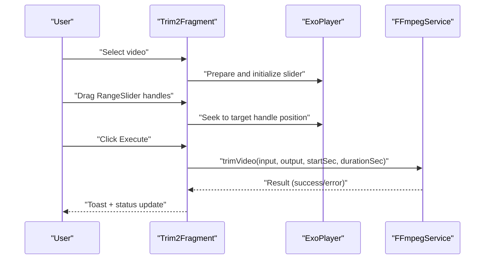

**Diagram sources**
- [Trim2Fragment.kt:67-119](file://app/src/main/java/com/pisces312/streamclip/fragment/Trim2Fragment.kt#L67-L119)
- [Trim2Fragment.kt:142-176](file://app/src/main/java/com/pisces312/streamclip/fragment/Trim2Fragment.kt#L142-L176)
- [Trim2Fragment.kt:178-251](file://app/src/main/java/com/pisces312/streamclip/fragment/Trim2Fragment.kt#L178-L251)
- [FFmpegService.kt:246-272](file://app/src/main/java/com/pisces312/streamclip/service/FFmpegService.kt#L246-L272)

**Section sources**
- [Trim2Fragment.kt:27-286](file://app/src/main/java/com/pisces312/streamclip/fragment/Trim2Fragment.kt#L27-L286)
- [FFmpegService.kt:246-272](file://app/src/main/java/com/pisces312/streamclip/service/FFmpegService.kt#L246-L272)

### CompressFragment
- Lifecycle management: Manages UI visibility, tab switching between hardware/software panels, and batch video selection.
- UI component organization: Two tabs (hardware/software), multiple spinners for encoder, bitrate, CRF, preset, frame rate, resolution, audio encoder/bitrate/sample rate, and a batch RecyclerView.
- State persistence: Maintains selected video path, original media info, hardware/software tab selection, and batch video URIs with cached path results.
- Event handling: Handles video selection (single/multiple), tab changes, help buttons, batch confirm dialog, and compression execution.
- Parameter validation: Builds CompressConfig from UI selections; ensures valid spinner positions; computes resolution options based on source info or batch mode.
- Integration with FFmpegService: Generates FFmpeg command via CompressConfig.toFFmpegCommand, executes asynchronously with progress/log callbacks, and probes output media info.
- Memory management: Clears binding references in onDestroyView; caches path results to reduce repeated file resolution.
- Performance optimization: Uses keep-screen-on during compression; displays progress percentage and estimated time; applies color metadata flags for HDR preservation.
- Error handling: Validates input paths, shows toasts for failures, and updates UI to reflect completion or error states.

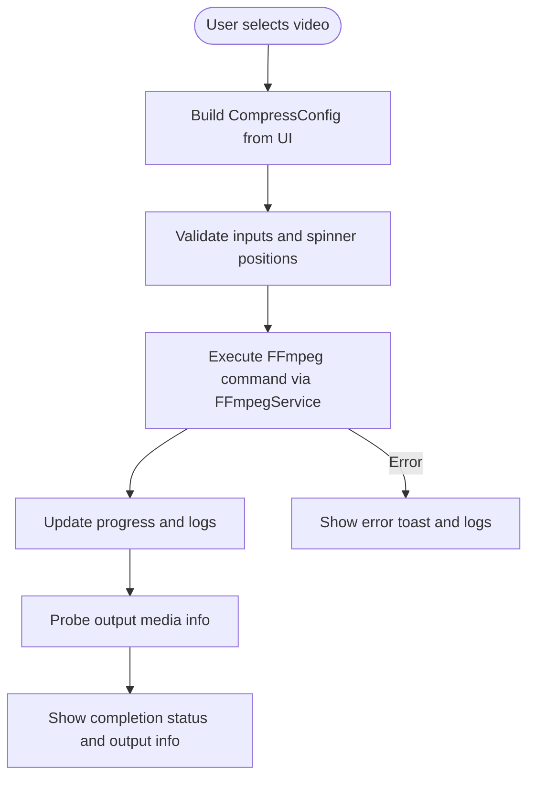

**Diagram sources**
- [CompressFragment.kt:682-719](file://app/src/main/java/com/pisces312/streamclip/fragment/CompressFragment.kt#L682-L719)
- [CompressFragment.kt:572-680](file://app/src/main/java/com/pisces312/streamclip/fragment/CompressFragment.kt#L572-L680)
- [CompressConfig.kt:21-114](file://app/src/main/java/com/pisces312/streamclip/model/CompressConfig.kt#L21-L114)
- [FFmpegService.kt:152-241](file://app/src/main/java/com/pisces312/streamclip/service/FFmpegService.kt#L152-L241)

**Section sources**
- [CompressFragment.kt:40-725](file://app/src/main/java/com/pisces312/streamclip/fragment/CompressFragment.kt#L40-L725)
- [CompressConfig.kt:1-209](file://app/src/main/java/com/pisces312/streamclip/model/CompressConfig.kt#L1-L209)
- [FFmpegService.kt:152-241](file://app/src/main/java/com/pisces312/streamclip/service/FFmpegService.kt#L152-L241)

### AudioCompressFragment
- Lifecycle management: Manages audio/video input selection, media info probing, and compression execution.
- UI component organization: Audio encoder, bitrate, and sample rate spinners; audio options panel visibility toggles based on encoder choice.
- State persistence: Stores selected video path, original media info, whether input is audio-only, and source file timestamps.
- Event handling: Handles audio/video selection, spinner changes, execute button, and progress/log reporting.
- Parameter validation: Determines output extension based on input type and selected audio encoder; ensures valid spinner positions.
- Integration with FFmpegService: Constructs FFmpeg command for audio-only or audio+video compression; executes with progress/log callbacks.
- Memory management: Clears binding references in onDestroyView.
- Performance optimization: Uses keep-screen-on during compression; applies shooting date or file timestamps post-execution.
- Error handling: Displays toasts for invalid inputs and FFmpeg errors.

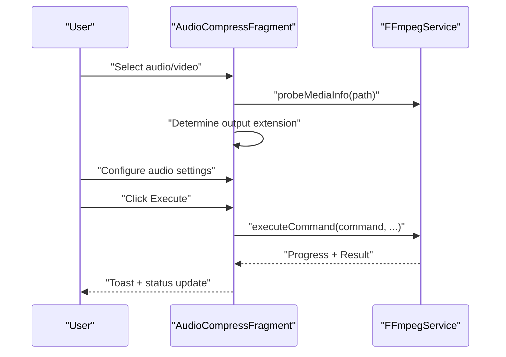

**Diagram sources**
- [AudioCompressFragment.kt:170-199](file://app/src/main/java/com/pisces312/streamclip/fragment/AudioCompressFragment.kt#L170-L199)
- [AudioCompressFragment.kt:225-344](file://app/src/main/java/com/pisces312/streamclip/fragment/AudioCompressFragment.kt#L225-L344)
- [FFmpegService.kt:152-241](file://app/src/main/java/com/pisces312/streamclip/service/FFmpegService.kt#L152-L241)

**Section sources**
- [AudioCompressFragment.kt:33-417](file://app/src/main/java/com/pisces312/streamclip/fragment/AudioCompressFragment.kt#L33-L417)
- [FFmpegService.kt:152-241](file://app/src/main/java/com/pisces312/streamclip/service/FFmpegService.kt#L152-L241)

### MergeFragment
- Lifecycle management: Manages RecyclerView of selected videos, UI updates, and merge execution.
- UI component organization: Video list with remove actions, status indicators for direct read/cached, and execute button.
- State persistence: Stores selected video URIs and updates UI counts and statuses.
- Event handling: Handles multi-select video picking, remove actions, and execute button.
- Parameter validation: Requires at least two videos; resolves paths for each video; probes media info for compatibility checks.
- Integration with FFmpegService: Uses concat demuxer to merge videos without re-encoding; applies metadata from the first video; cleans up temporary files.
- Memory management: Clears binding references in onDestroyView.
- Performance optimization: Uses keep-screen-on during merge; displays progress percentage and completion status.
- Error handling: Validates inputs, shows toasts for failures, and presents detailed compatibility mismatch dialog.

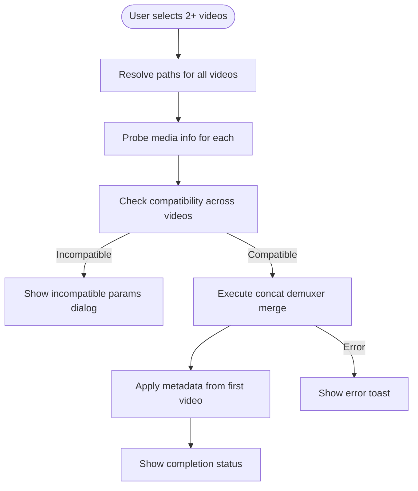

**Diagram sources**
- [MergeFragment.kt:135-231](file://app/src/main/java/com/pisces312/streamclip/fragment/MergeFragment.kt#L135-L231)
- [FFmpegService.kt:297-334](file://app/src/main/java/com/pisces312/streamclip/service/FFmpegService.kt#L297-L334)

**Section sources**
- [MergeFragment.kt:28-278](file://app/src/main/java/com/pisces312/streamclip/fragment/MergeFragment.kt#L28-L278)
- [FFmpegService.kt:297-334](file://app/src/main/java/com/pisces312/streamclip/service/FFmpegService.kt#L297-L334)

### ExtractFragment
- Lifecycle management: Manages video selection, media info probing, and extraction execution.
- UI component organization: Select video button, file name display, audio info card, and execute button.
- State persistence: Stores selected video URI and media info for display.
- Event handling: Handles video selection, execute button, and status updates.
- Parameter validation: Resolves path from URI; determines output extension from media info.
- Integration with FFmpegService: Executes lossless audio extraction using -c:a copy; scans output file post-execution.
- Memory management: Clears binding references in onDestroyView.
- Performance optimization: Uses keep-screen-on during extraction.
- Error handling: Displays toasts for invalid inputs and FFmpeg errors.

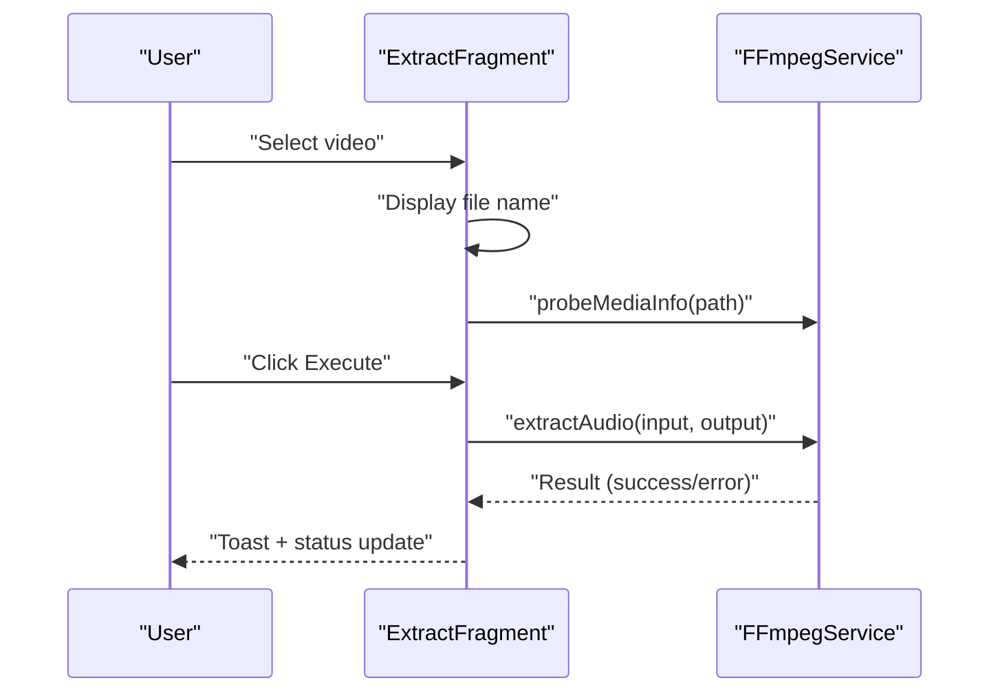

**Diagram sources**
- [ExtractFragment.kt:119-134](file://app/src/main/java/com/pisces312/streamclip/fragment/ExtractFragment.kt#L119-L134)
- [ExtractFragment.kt:136-191](file://app/src/main/java/com/pisces312/streamclip/fragment/ExtractFragment.kt#L136-L191)
- [FFmpegService.kt:339-350](file://app/src/main/java/com/pisces312/streamclip/service/FFmpegService.kt#L339-L350)

**Section sources**
- [ExtractFragment.kt:25-209](file://app/src/main/java/com/pisces312/streamclip/fragment/ExtractFragment.kt#L25-L209)
- [FFmpegService.kt:339-350](file://app/src/main/java/com/pisces312/streamclip/service/FFmpegService.kt#L339-L350)

### CustomCommandFragment
- Lifecycle management: Manages command type selection (FFmpeg/FFprobe), command execution, and progress/log reporting.
- UI component organization: Command type spinner, command text area, execute button, and a modal log dialog with progress.
- State persistence: None required; maintains command text and type selection.
- Event handling: Handles command type changes, execute button, and cancel actions.
- Parameter validation: Validates non-empty command; parses input/output paths for progress estimation.
- Integration with FFmpegService: Executes FFmpeg command with progress/log callbacks; executes FFprobe command and displays output/logs.
- Memory management: Clears binding references in onDestroyView.
- Performance optimization: Uses keep-screen-on during execution; estimates remaining time based on progress.
- Error handling: Displays toasts for invalid commands and FFmpeg/FFprobe failures.

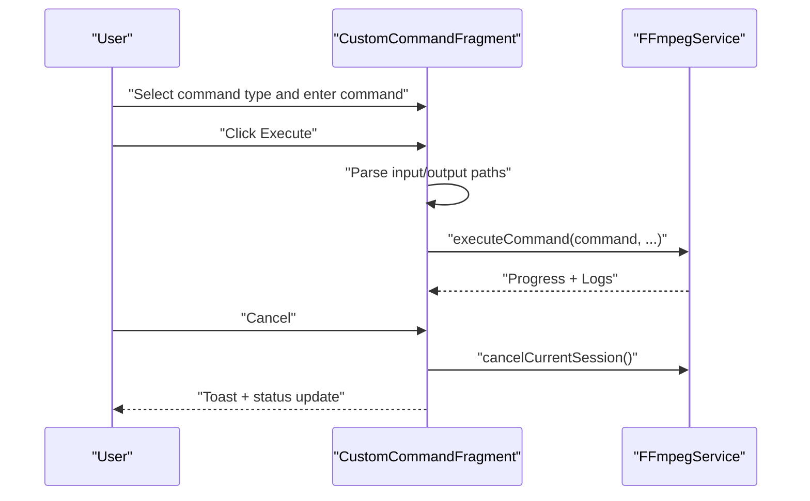

**Diagram sources**
- [CustomCommandFragment.kt:89-204](file://app/src/main/java/com/pisces312/streamclip/fragment/CustomCommandFragment.kt#L89-L204)
- [FFmpegService.kt:24-31](file://app/src/main/java/com/pisces312/streamclip/service/FFmpegService.kt#L24-L31)
- [FFmpegService.kt:152-241](file://app/src/main/java/com/pisces312/streamclip/service/FFmpegService.kt#L152-L241)

**Section sources**
- [CustomCommandFragment.kt:28-331](file://app/src/main/java/com/pisces312/streamclip/fragment/CustomCommandFragment.kt#L28-L331)
- [FFmpegService.kt:24-31](file://app/src/main/java/com/pisces312/streamclip/service/FFmpegService.kt#L24-L31)
- [FFmpegService.kt:152-241](file://app/src/main/java/com/pisces312/streamclip/service/FFmpegService.kt#L152-L241)

### MetadataFragment
- Lifecycle management: Manages video path selection, metadata reading/writing, and UI updates.
- UI component organization: Path input/edit, metadata fields (title, artist, creation time, location, comment), save/reset buttons, and status indicators.
- State persistence: Stores original metadata and current metadata for change detection.
- Event handling: Handles video selection, field text changes, save/reset actions.
- Parameter validation: Checks for valid path resolution; compares current metadata against original to enable save.
- Integration with MetadataService: Reads metadata via probeMediaInfo and saves only changed fields using FFmpeg with -c copy.
- Memory management: Clears binding references in onDestroyView.
- Performance optimization: Uses keep-screen-on during save; shows processing status.
- Error handling: Displays toasts for invalid paths and save failures.

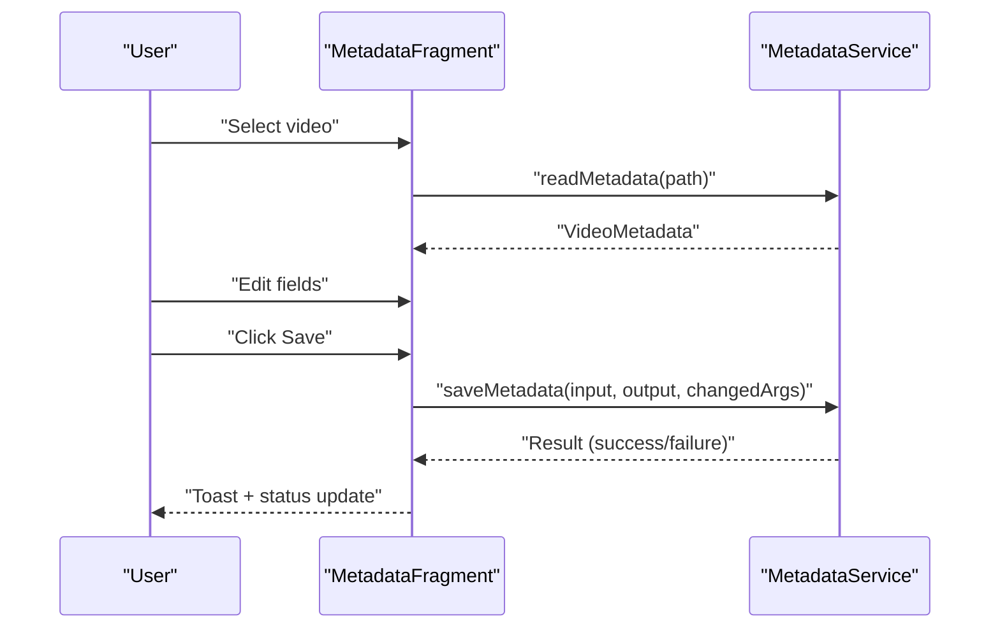

**Diagram sources**
- [MetadataFragment.kt:85-114](file://app/src/main/java/com/pisces312/streamclip/fragment/MetadataFragment.kt#L85-L114)
- [MetadataFragment.kt:164-209](file://app/src/main/java/com/pisces312/streamclip/fragment/MetadataFragment.kt#L164-L209)
- [MetadataService.kt:15-28](file://app/src/main/java/com/pisces312/streamclip/service/MetadataService.kt#L15-L28)
- [MetadataService.kt:34-67](file://app/src/main/java/com/pisces312/streamclip/service/MetadataService.kt#L34-L67)

**Section sources**
- [MetadataFragment.kt:26-224](file://app/src/main/java/com/pisces312/streamclip/fragment/MetadataFragment.kt#L26-L224)
- [MetadataService.kt:15-67](file://app/src/main/java/com/pisces312/streamclip/service/MetadataService.kt#L15-L67)
- [VideoMetadata.kt:13-41](file://app/src/main/java/com/pisces312/streamclip/model/VideoMetadata.kt#L13-L41)

## Dependency Analysis
The fragments depend on FFmpegService for all media operations and on model classes for metadata representation. CompressFragment additionally depends on CompressConfig for command construction. MetadataFragment depends on MetadataService and VideoMetadata.

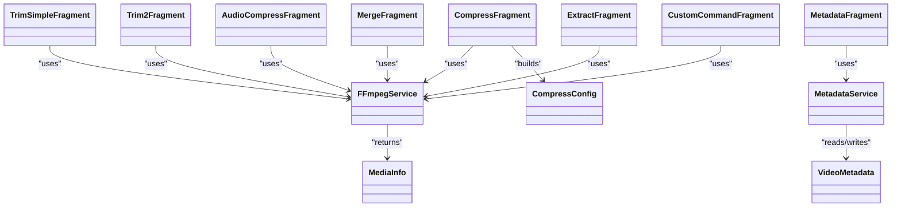

**Diagram sources**
- [TrimSimpleFragment.kt:23](file://app/src/main/java/com/pisces312/streamclip/fragment/TrimSimpleFragment.kt#L23)
- [Trim2Fragment.kt:20](file://app/src/main/java/com/pisces312/streamclip/fragment/Trim2Fragment.kt#L20)
- [CompressFragment.kt:26](file://app/src/main/java/com/pisces312/streamclip/fragment/CompressFragment.kt#L26)
- [CompressConfig.kt:3](file://app/src/main/java/com/pisces312/streamclip/model/CompressConfig.kt#L3)
- [AudioCompressFragment.kt:25](file://app/src/main/java/com/pisces312/streamclip/fragment/AudioCompressFragment.kt#L25)
- [MergeFragment.kt:21](file://app/src/main/java/com/pisces312/streamclip/fragment/MergeFragment.kt#L21)
- [ExtractFragment.kt:18](file://app/src/main/java/com/pisces312/streamclip/fragment/ExtractFragment.kt#L18)
- [CustomCommandFragment.kt:21](file://app/src/main/java/com/pisces312/streamclip/fragment/CustomCommandFragment.kt#L21)
- [MetadataFragment.kt:18](file://app/src/main/java/com/pisces312/streamclip/fragment/MetadataFragment.kt#L18)
- [FFmpegService.kt:19](file://app/src/main/java/com/pisces312/streamclip/service/FFmpegService.kt#L19)
- [MetadataService.kt:10](file://app/src/main/java/com/pisces312/streamclip/service/MetadataService.kt#L10)
- [MediaInfo.kt:5](file://app/src/main/java/com/pisces312/streamclip/model/MediaInfo.kt#L5)
- [VideoMetadata.kt:5](file://app/src/main/java/com/pisces312/streamclip/model/VideoMetadata.kt#L5)

**Section sources**
- [FFmpegService.kt:19-420](file://app/src/main/java/com/pisces312/streamclip/service/FFmpegService.kt#L19-L420)
- [CompressConfig.kt:1-209](file://app/src/main/java/com/pisces312/streamclip/model/CompressConfig.kt#L1-L209)
- [MediaInfo.kt:1-165](file://app/src/main/java/com/pisces312/streamclip/model/MediaInfo.kt#L1-L165)
- [VideoMetadata.kt:1-56](file://app/src/main/java/com/pisces312/streamclip/model/VideoMetadata.kt#L1-L56)
- [MetadataService.kt:1-93](file://app/src/main/java/com/pisces312/streamclip/service/MetadataService.kt#L1-L93)

## Performance Considerations
- Lossless operations: TrimSimpleFragment and Trim2Fragment use -c copy for trimming; MergeFragment uses concat demuxer; ExtractFragment uses -c:a copy. These avoid re-encoding and complete quickly.
- Progress reporting: CompressFragment, AudioCompressFragment, and CustomCommandFragment provide progress callbacks via FFmpeg statistics; MergeFragment and Trim operations report completion immediately.
- Memory management: All fragments release ExoPlayer instances and clear binding references in onDestroyView. Batch operations cache path results to minimize repeated file resolution.
- UI responsiveness: Operations run on Dispatchers.IO with main-thread UI updates; keep-screen-on flag prevents device sleep during long-running tasks.
- HDR and color metadata: CompressConfig writes container-level color metadata flags to preserve HDR characteristics across platforms.

[No sources needed since this section provides general guidance]

## Troubleshooting Guide
- Invalid inputs: Fragments validate URIs, minimum durations, and spinner positions. They show toasts for invalid states and prevent execution.
- FFmpeg errors: FFmpegService returns error messages; fragments display them via toasts and log dialogs. CustomCommandFragment distinguishes FFmpeg vs FFprobe failures.
- Cancellation: CustomCommandFragment and compression fragments expose cancel handlers; FFmpegService.cancelCurrentSession cancels active sessions.
- Compatibility issues: MergeFragment detects incompatible videos and shows a detailed dialog listing differences.
- External intents: TrimSimpleFragment, Trim2Fragment, ExtractFragment, and MetadataFragment handle external video URIs passed via intents.

**Section sources**
- [TrimSimpleFragment.kt:288-354](file://app/src/main/java/com/pisces312/streamclip/fragment/TrimSimpleFragment.kt#L288-L354)
- [Trim2Fragment.kt:178-251](file://app/src/main/java/com/pisces312/streamclip/fragment/Trim2Fragment.kt#L178-L251)
- [CompressFragment.kt:602-679](file://app/src/main/java/com/pisces312/streamclip/fragment/CompressFragment.kt#L602-L679)
- [AudioCompressFragment.kt:284-344](file://app/src/main/java/com/pisces312/streamclip/fragment/AudioCompressFragment.kt#L284-L344)
- [MergeFragment.kt:191-231](file://app/src/main/java/com/pisces312/streamclip/fragment/MergeFragment.kt#L191-L231)
- [CustomCommandFragment.kt:110-198](file://app/src/main/java/com/pisces312/streamclip/fragment/CustomCommandFragment.kt#L110-L198)
- [FFmpegService.kt:24-31](file://app/src/main/java/com/pisces312/streamclip/service/FFmpegService.kt#L24-L31)

## Conclusion
StreamClip’s specialized fragment components provide a cohesive, efficient, and user-friendly interface for common video processing tasks. By leveraging FFmpegService for all media operations, maintaining robust validation and error handling, and offering both lossless and configurable compression options, the fragments deliver reliable performance across diverse devices and use cases. The modular design allows for easy maintenance and future enhancements, while the UI components remain intuitive and responsive.

[No sources needed since this section summarizes without analyzing specific files]