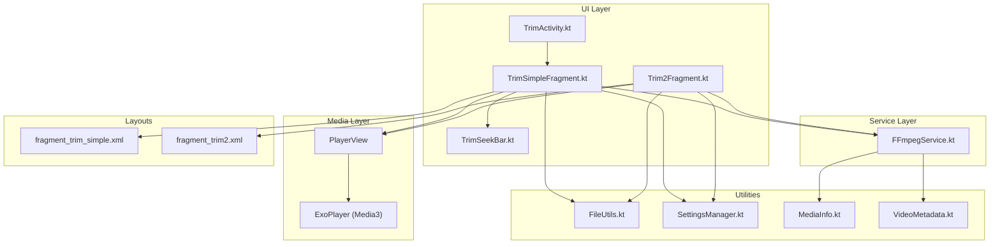
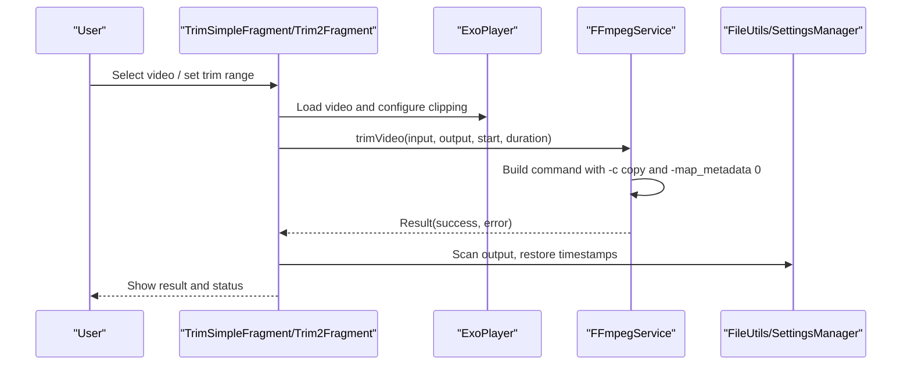
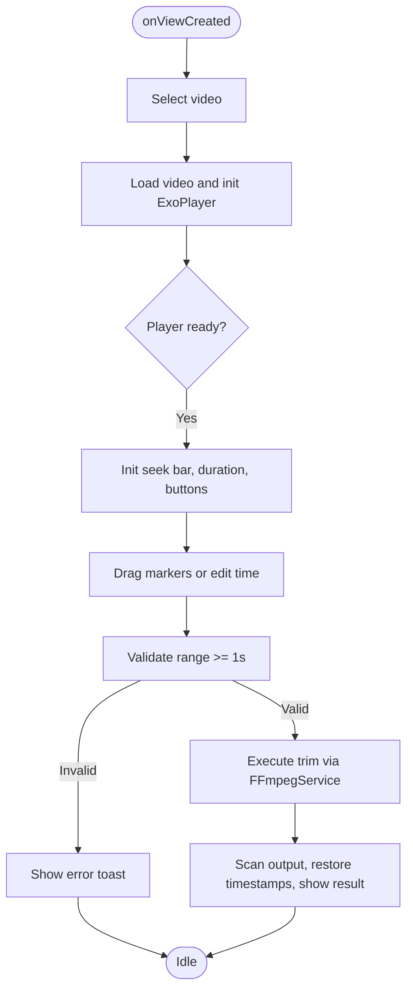
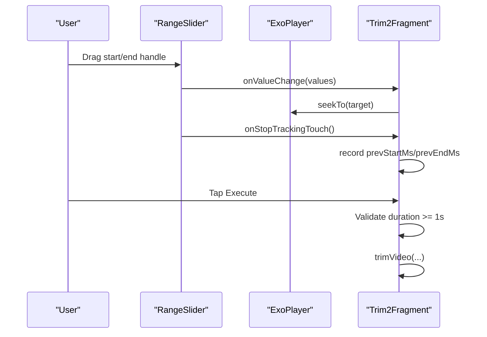
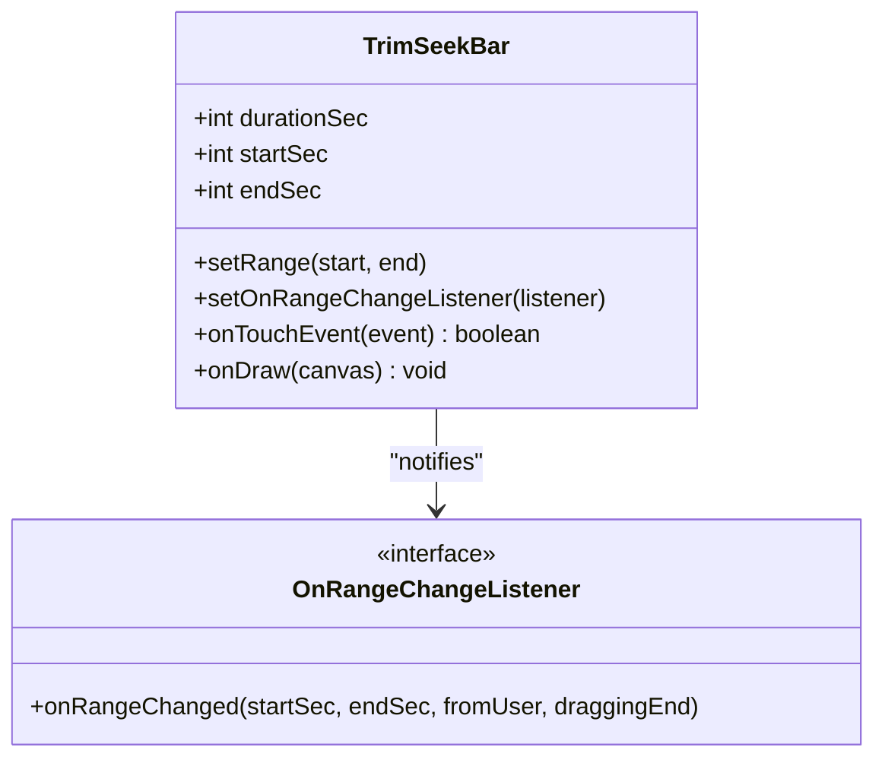
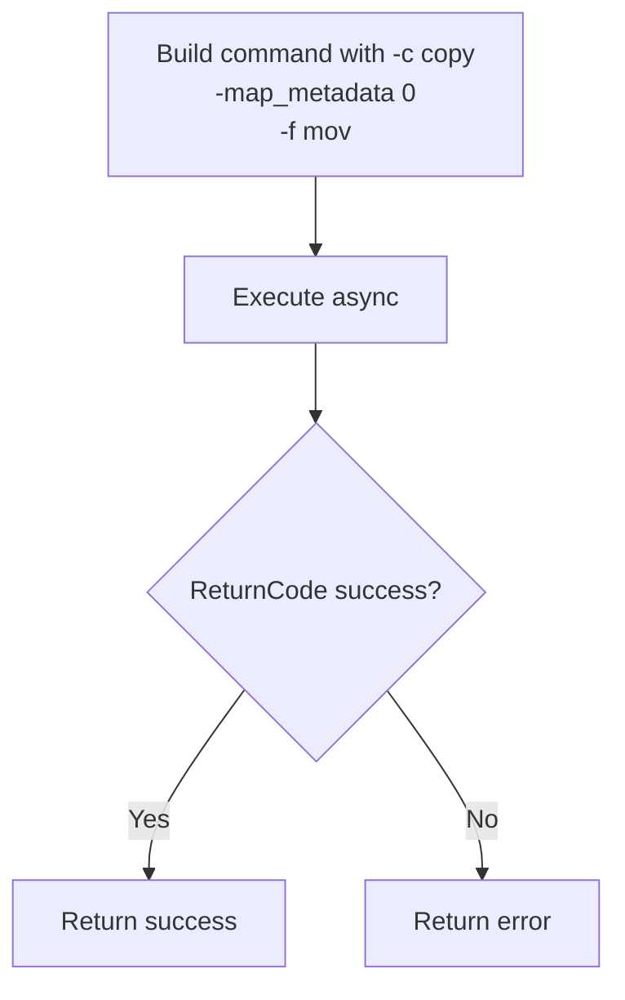
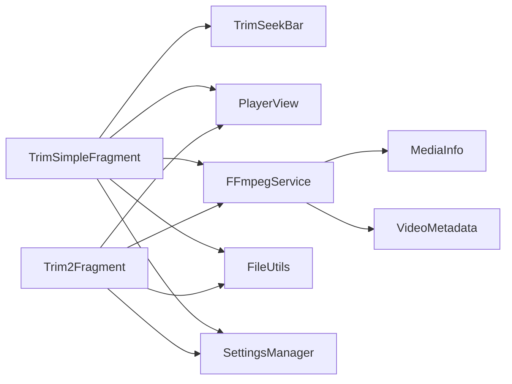

# Trim Fragments

<cite>
**Referenced Files in This Document**
- [TrimSimpleFragment.kt](file://app/src/main/java/com/pisces312/streamclip/fragment/TrimSimpleFragment.kt)
- [Trim2Fragment.kt](file://app/src/main/java/com/pisces312/streamclip/fragment/Trim2Fragment.kt)
- [TrimSeekBar.kt](file://app/src/main/java/com/pisces312/streamclip/ui/TrimSeekBar.kt)
- [FFmpegService.kt](file://app/src/main/java/com/pisces312/streamclip/service/FFmpegService.kt)
- [TrimActivity.kt](file://app/src/main/java/com/pisces312/streamclip/ui/TrimActivity.kt)
- [fragment_trim_simple.xml](file://app/src/main/res/layout/fragment_trim_simple.xml)
- [fragment_trim2.xml](file://app/src/main/res/layout/fragment_trim2.xml)
- [FileUtils.kt](file://app/src/main/java/com/pisces312/streamclip/util/FileUtils.kt)
- [SettingsManager.kt](file://app/src/main/java/com/pisces312/streamclip/util/SettingsManager.kt)
- [MediaInfo.kt](file://app/src/main/java/com/pisces312/streamclip/model/MediaInfo.kt)
- [VideoMetadata.kt](file://app/src/main/java/com/pisces312/streamclip/model/VideoMetadata.kt)
- [2026-05-09-trim-gps-metadata.md](file://docs/superpowers/plans/2026-05-09-trim-gps-metadata.md)
- [README.md](file://README.md)
</cite>

## Table of Contents
1. [Introduction](#introduction)
2. [Project Structure](#project-structure)
3. [Core Components](#core-components)
4. [Architecture Overview](#architecture-overview)
5. [Detailed Component Analysis](#detailed-component-analysis)
6. [Dependency Analysis](#dependency-analysis)
7. [Performance Considerations](#performance-considerations)
8. [Troubleshooting Guide](#troubleshooting-guide)
9. [Conclusion](#conclusion)

## Introduction
This document explains StreamClip’s trim fragment components that enable lossless video trimming. It covers:
- TrimSimpleFragment: Basic trimming with a custom seek bar and time input controls
- Trim2Fragment: Advanced trimming with a RangeSlider, real-time preview, and precise time controls
- TrimSeekBar: Interactive timeline with draggable markers and visual feedback
- Lossless stream copying via FFmpegService, including metadata preservation and GPS handling
- Fragment lifecycle, state restoration, parameter validation, and integration with FFmpegService
- User interaction patterns, touch handling, visual feedback, and error handling for invalid time ranges

## Project Structure
The trim functionality spans UI fragments, a custom timeline widget, a media player, and a service that executes FFmpeg commands.

**Diagram sources**
- [TrimSimpleFragment.kt:1-387](file://app/src/main/java/com/pisces312/streamclip/fragment/TrimSimpleFragment.kt#L1-L387)
- [Trim2Fragment.kt:1-286](file://app/src/main/java/com/pisces312/streamclip/fragment/Trim2Fragment.kt#L1-L286)
- [TrimSeekBar.kt:1-238](file://app/src/main/java/com/pisces312/streamclip/ui/TrimSeekBar.kt#L1-L238)
- [FFmpegService.kt:1-420](file://app/src/main/java/com/pisces312/streamclip/service/FFmpegService.kt#L1-L420)
- [TrimActivity.kt:1-37](file://app/src/main/java/com/pisces312/streamclip/ui/TrimActivity.kt#L1-L37)
- [fragment_trim_simple.xml:1-155](file://app/src/main/res/layout/fragment_trim_simple.xml#L1-L155)
- [fragment_trim2.xml:1-123](file://app/src/main/res/layout/fragment_trim2.xml#L1-L123)

**Section sources**
- [TrimSimpleFragment.kt:1-387](file://app/src/main/java/com/pisces312/streamclip/fragment/TrimSimpleFragment.kt#L1-L387)
- [Trim2Fragment.kt:1-286](file://app/src/main/java/com/pisces312/streamclip/fragment/Trim2Fragment.kt#L1-L286)
- [TrimSeekBar.kt:1-238](file://app/src/main/java/com/pisces312/streamclip/ui/TrimSeekBar.kt#L1-L238)
- [FFmpegService.kt:1-420](file://app/src/main/java/com/pisces312/streamclip/service/FFmpegService.kt#L1-L420)
- [TrimActivity.kt:1-37](file://app/src/main/java/com/pisces312/streamclip/ui/TrimActivity.kt#L1-L37)
- [fragment_trim_simple.xml:1-155](file://app/src/main/res/layout/fragment_trim_simple.xml#L1-L155)
- [fragment_trim2.xml:1-123](file://app/src/main/res/layout/fragment_trim2.xml#L1-L123)

## Core Components
- TrimSimpleFragment: Provides a simple UI with a custom seek bar and time buttons. Supports external video opening via TrimActivity, playback control, and lossless trimming with metadata preservation.
- Trim2Fragment: Offers advanced trimming with a Material RangeSlider, real-time preview, and precise second-level controls. Integrates with ExoPlayer controller and exposes a “real-time seek” behavior during drag.
- TrimSeekBar: A custom view with draggable markers for start and end selection, click-to-seek, and visual feedback.
- FFmpegService: Executes lossless trim commands with stream copy, preserves metadata, and manages progress/log callbacks.
- Utilities: FileUtils resolves URIs to real paths, maintains file timestamps, and scans outputs; SettingsManager stores preferences like keep-screen-on and output directory.

**Section sources**
- [TrimSimpleFragment.kt:30-387](file://app/src/main/java/com/pisces312/streamclip/fragment/TrimSimpleFragment.kt#L30-L387)
- [Trim2Fragment.kt:27-286](file://app/src/main/java/com/pisces312/streamclip/fragment/Trim2Fragment.kt#L27-L286)
- [TrimSeekBar.kt:16-238](file://app/src/main/java/com/pisces312/streamclip/ui/TrimSeekBar.kt#L16-L238)
- [FFmpegService.kt:243-272](file://app/src/main/java/com/pisces312/streamclip/service/FFmpegService.kt#L243-L272)
- [FileUtils.kt:17-362](file://app/src/main/java/com/pisces312/streamclip/util/FileUtils.kt#L17-L362)
- [SettingsManager.kt:6-208](file://app/src/main/java/com/pisces312/streamclip/util/SettingsManager.kt#L6-L208)

## Architecture Overview
Lossless trimming relies on stream copy to avoid re-encoding. The fragments orchestrate user input and playback, while FFmpegService constructs and executes the FFmpeg command. Metadata preservation is achieved via `-map_metadata 0` and container-specific flags.

**Diagram sources**
- [TrimSimpleFragment.kt:288-354](file://app/src/main/java/com/pisces312/streamclip/fragment/TrimSimpleFragment.kt#L288-L354)
- [Trim2Fragment.kt:178-251](file://app/src/main/java/com/pisces312/streamclip/fragment/Trim2Fragment.kt#L178-L251)
- [FFmpegService.kt:243-272](file://app/src/main/java/com/pisces312/streamclip/service/FFmpegService.kt#L243-L272)
- [FileUtils.kt:268-312](file://app/src/main/java/com/pisces312/streamclip/util/FileUtils.kt#L268-L312)

## Detailed Component Analysis

### TrimSimpleFragment
- Purpose: Basic lossless trimming with a custom seek bar and time input buttons.
- Key behaviors:
  - External video handling via TrimActivity argument passing
  - ExoPlayer integration with clipping configuration for playback range
  - Custom TrimSeekBar range change listener updates UI and seeks player
  - Time input dialog validates MM:SS format and enforces 1-second minimum duration
  - Lossless trim execution via FFmpegService with metadata preservation
  - Status updates and output file scanning with timestamp restoration

**Diagram sources**
- [TrimSimpleFragment.kt:68-123](file://app/src/main/java/com/pisces312/streamclip/fragment/TrimSimpleFragment.kt#L68-L123)
- [TrimSimpleFragment.kt:224-286](file://app/src/main/java/com/pisces312/streamclip/fragment/TrimSimpleFragment.kt#L224-L286)
- [TrimSimpleFragment.kt:288-354](file://app/src/main/java/com/pisces312/streamclip/fragment/TrimSimpleFragment.kt#L288-L354)

**Section sources**
- [TrimSimpleFragment.kt:30-387](file://app/src/main/java/com/pisces312/streamclip/fragment/TrimSimpleFragment.kt#L30-L387)
- [fragment_trim_simple.xml:1-155](file://app/src/main/res/layout/fragment_trim_simple.xml#L1-L155)

### Trim2Fragment
- Purpose: Advanced trimming with a RangeSlider, real-time preview, and precise second-level controls.
- Key behaviors:
  - Uses ExoPlayer with built-in controller
  - RangeSlider value change triggers real-time seek to the handler that moved more
  - Slider initialized with step size aligned to seconds and rounded duration
  - Real-time pause during drag and resume after stop tracking
  - Lossless trim execution with metadata preservation and output status update

**Diagram sources**
- [Trim2Fragment.kt:87-119](file://app/src/main/java/com/pisces312/streamclip/fragment/Trim2Fragment.kt#L87-L119)
- [Trim2Fragment.kt:142-176](file://app/src/main/java/com/pisces312/streamclip/fragment/Trim2Fragment.kt#L142-L176)
- [Trim2Fragment.kt:178-251](file://app/src/main/java/com/pisces312/streamclip/fragment/Trim2Fragment.kt#L178-L251)

**Section sources**
- [Trim2Fragment.kt:27-286](file://app/src/main/java/com/pisces312/streamclip/fragment/Trim2Fragment.kt#L27-L286)
- [fragment_trim2.xml:1-123](file://app/src/main/res/layout/fragment_trim2.xml#L1-L123)

### TrimSeekBar
- Purpose: Custom interactive timeline with draggable start/end markers and click-to-seek.
- Key behaviors:
  - Tracks duration in seconds and clamps start/end within bounds
  - Draggable markers detect proximity and move the closest one
  - Clicking the track seeks to the nearest marker
  - Notifies range changes to listeners with dragging end flag
  - Renders visual markers and selected region

**Diagram sources**
- [TrimSeekBar.kt:16-238](file://app/src/main/java/com/pisces312/streamclip/ui/TrimSeekBar.kt#L16-L238)

**Section sources**
- [TrimSeekBar.kt:16-238](file://app/src/main/java/com/pisces312/streamclip/ui/TrimSeekBar.kt#L16-L238)

### FFmpegService: Lossless Trim and Metadata Preservation
- Lossless trim command:
  - Uses `-c copy` to avoid re-encoding
  - Applies `-map_metadata 0` to preserve format-level tags (including GPS)
  - Uses `-f mov` to ensure container compatibility for metadata atoms
  - Adds `-fflags +genpts` and `-avoid_negative_ts make_zero` for robustness
- Execution:
  - Asynchronous execution with optional progress/log callbacks
  - Cancellation support via sessionId
- Metadata preservation:
  - Trim: adds `-map_metadata 0` and `-f mov` to preserve GPS and other tags
  - Merge: two-pass approach—merge first, then extract tags from first video and apply to merged output

**Diagram sources**
- [FFmpegService.kt:243-272](file://app/src/main/java/com/pisces312/streamclip/service/FFmpegService.kt#L243-L272)
- [2026-05-09-trim-gps-metadata.md:15-56](file://docs/superpowers/plans/2026-05-09-trim-gps-metadata.md#L15-L56)

**Section sources**
- [FFmpegService.kt:243-272](file://app/src/main/java/com/pisces312/streamclip/service/FFmpegService.kt#L243-L272)
- [2026-05-09-trim-gps-metadata.md:15-56](file://docs/superpowers/plans/2026-05-09-trim-gps-metadata.md#L15-L56)

### Utilities: File Resolution, Timestamps, and Settings
- FileUtils:
  - Resolves URIs to real paths, preferring direct read; falls back to cache copy
  - Scans outputs into media scanners
  - Reads and applies file creation/modification times
  - Parses shooting date strings to apply as timestamps
- SettingsManager:
  - Stores keep-screen-on preference and output directory choices
  - Generates output filenames with optional timestamp suffixes
  - Persists last video directory for quick reopening

**Section sources**
- [FileUtils.kt:17-362](file://app/src/main/java/com/pisces312/streamclip/util/FileUtils.kt#L17-L362)
- [SettingsManager.kt:6-208](file://app/src/main/java/com/pisces312/streamclip/util/SettingsManager.kt#L6-L208)

### Model: MediaInfo and VideoMetadata
- MediaInfo: Parses ffprobe JSON to expose format tags, streams, and derived properties (resolution, rotation, HDR indicators)
- VideoMetadata: Encapsulates editable metadata fields and generates FFmpeg `-metadata` arguments for selective updates

**Section sources**
- [MediaInfo.kt:1-165](file://app/src/main/java/com/pisces312/streamclip/model/MediaInfo.kt#L1-L165)
- [VideoMetadata.kt:1-56](file://app/src/main/java/com/pisces312/streamclip/model/VideoMetadata.kt#L1-L56)

## Dependency Analysis
- TrimSimpleFragment and Trim2Fragment depend on:
  - ExoPlayer for playback and clipping configuration
  - TrimSeekBar (TrimSimpleFragment) for range selection
  - FFmpegService for lossless trimming
  - FileUtils and SettingsManager for file path resolution and output management
- FFmpegService depends on:
  - MediaInfo and VideoMetadata for metadata parsing and application
  - LogCollector for diagnostics

**Diagram sources**
- [TrimSimpleFragment.kt:1-387](file://app/src/main/java/com/pisces312/streamclip/fragment/TrimSimpleFragment.kt#L1-L387)
- [Trim2Fragment.kt:1-286](file://app/src/main/java/com/pisces312/streamclip/fragment/Trim2Fragment.kt#L1-L286)
- [FFmpegService.kt:1-420](file://app/src/main/java/com/pisces312/streamclip/service/FFmpegService.kt#L1-L420)

**Section sources**
- [TrimSimpleFragment.kt:1-387](file://app/src/main/java/com/pisces312/streamclip/fragment/TrimSimpleFragment.kt#L1-L387)
- [Trim2Fragment.kt:1-286](file://app/src/main/java/com/pisces312/streamclip/fragment/Trim2Fragment.kt#L1-L286)
- [FFmpegService.kt:1-420](file://app/src/main/java/com/pisces312/streamclip/service/FFmpegService.kt#L1-L420)

## Performance Considerations
- Lossless trimming is near-instant because it copies streams without re-encoding.
- Real-time preview during drag uses millisecond-precision seeking; however, the UI rounds to seconds to avoid preview desync.
- Playback range is clipped to the selected trim window to prevent unnecessary buffering outside the segment.
- Keep screen on setting prevents device sleep during long operations.

[No sources needed since this section provides general guidance]

## Troubleshooting Guide
Common issues and resolutions:
- Invalid time range:
  - Minimum duration is enforced to 1 second; otherwise, a toast informs the user.
- Cannot read file:
  - If URI resolution fails, the app falls back to cache copy; if still failing, a toast indicates inability to read the file.
- Trim completion:
  - On success, the output is scanned into media databases and timestamps are restored; on failure, an error message is shown.
- External video opening:
  - TrimActivity passes the external video URI to TrimSimpleFragment; ensure the intent action is handled and the fragment receives the argument.

**Section sources**
- [TrimSimpleFragment.kt:288-354](file://app/src/main/java/com/pisces312/streamclip/fragment/TrimSimpleFragment.kt#L288-L354)
- [Trim2Fragment.kt:178-251](file://app/src/main/java/com/pisces312/streamclip/fragment/Trim2Fragment.kt#L178-L251)
- [TrimActivity.kt:14-31](file://app/src/main/java/com/pisces312/streamclip/ui/TrimActivity.kt#L14-L31)

## Conclusion
StreamClip’s trim fragments provide two complementary approaches to lossless video trimming:
- TrimSimpleFragment offers simplicity with a custom seek bar and time input controls.
- Trim2Fragment provides advanced precision with a RangeSlider and real-time preview.
Both leverage FFmpegService’s stream-copy trimming with metadata preservation, ensuring GPS and other tags remain intact. The UI integrates seamlessly with ExoPlayer, utilities manage file paths and timestamps, and robust validation and error handling improve reliability.