# User Interface Components

<cite>
**Referenced Files in This Document**
- [MainActivity.kt](file://app/src/main/java/com/pisces312/streamclip/MainActivity.kt)
- [MainPagerAdapter.kt](file://app/src/main/java/com/pisces312/streamclip/adapter/MainPagerAdapter.kt)
- [TabOrderActivity.kt](file://app/src/main/java/com/pisces312/streamclip/ui/TabOrderActivity.kt)
- [TabOrderAdapter.kt](file://app/src/main/java/com/pisces312/streamclip/adapter/TabOrderAdapter.kt)
- [SettingsTabFragment.kt](file://app/src/main/java/com/pisces312/streamclip/fragment/SettingsTabFragment.kt)
- [TrimSeekBar.kt](file://app/src/main/java/com/pisces312/streamclip/ui/TrimSeekBar.kt)
- [TrimSimpleFragment.kt](file://app/src/main/java/com/pisces312/streamclip/fragment/TrimSimpleFragment.kt)
- [Trim2Fragment.kt](file://app/src/main/java/com/pisces312/streamclip/fragment/Trim2Fragment.kt)
- [MergeFragment.kt](file://app/src/main/java/com/pisces312/streamclip/fragment/MergeFragment.kt)
- [ExtractFragment.kt](file://app/src/main/java/com/pisces312/streamclip/fragment/ExtractFragment.kt)
- [CompressFragment.kt](file://app/src/main/java/com/pisces312/streamclip/fragment/CompressFragment.kt)
- [AudioCompressFragment.kt](file://app/src/main/java/com/pisces312/streamclip/fragment/AudioCompressFragment.kt)
- [TabOrderManager.kt](file://app/src/main/java/com/pisces312/streamclip/util/TabOrderManager.kt)
- [SettingsManager.kt](file://app/src/main/java/com/pisces312/streamclip/util/SettingsManager.kt)
- [BaseActivity.kt](file://app/src/main/java/com/pisces312/streamclip/BaseActivity.kt)
</cite>

## Table of Contents
1. [Introduction](#introduction)
2. [Project Structure](#project-structure)
3. [Core Components](#core-components)
4. [Architecture Overview](#architecture-overview)
5. [Detailed Component Analysis](#detailed-component-analysis)
6. [Dependency Analysis](#dependency-analysis)
7. [Performance Considerations](#performance-considerations)
8. [Troubleshooting Guide](#troubleshooting-guide)
9. [Conclusion](#conclusion)

## Introduction
This document explains StreamClip’s user interface components with a focus on Material Design 3 (Material You) and navigation patterns. It covers the MainActivity tabbed interface built with ViewPager2 and TabLayout, the MainPagerAdapter’s role in fragment management, the customizable tab ordering system, and the lifecycle/state management of key fragments. It also documents the SettingsTabFragment for preferences, the TabOrderActivity for user customization, and specialized UI components like TrimSeekBar for precise time selection. Accessibility, responsive design, cross-platform compatibility, performance optimization, and debugging approaches are addressed.

## Project Structure
The UI layer is organized around:
- An activity hosting a ViewPager2 with a TabLayout for tabbed navigation
- A FragmentStateAdapter (MainPagerAdapter) that maps tab identifiers to fragments
- Utility managers for tab ordering and settings persistence
- Specialized fragments implementing domain-specific UIs and workflows
- A custom view (TrimSeekBar) for precise time-range selection

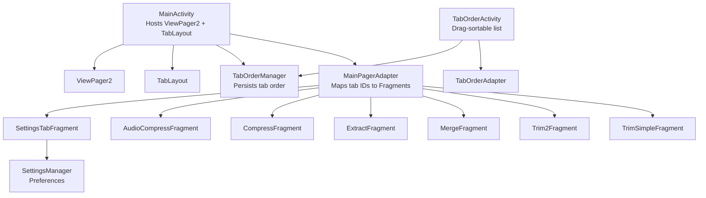

**Diagram sources**
- [MainActivity.kt:62-81](file://app/src/main/java/com/pisces312/streamclip/MainActivity.kt#L62-L81)
- [MainPagerAdapter.kt:16-36](file://app/src/main/java/com/pisces312/streamclip/adapter/MainPagerAdapter.kt#L16-L36)
- [TabOrderActivity.kt:43-72](file://app/src/main/java/com/pisces312/streamclip/ui/TabOrderActivity.kt#L43-L72)
- [TabOrderAdapter.kt:11-43](file://app/src/main/java/com/pisces312/streamclip/adapter/TabOrderAdapter.kt#L11-L43)
- [TabOrderManager.kt:31-51](file://app/src/main/java/com/pisces312/streamclip/util/TabOrderManager.kt#L31-L51)
- [SettingsTabFragment.kt:52-113](file://app/src/main/java/com/pisces312/streamclip/fragment/SettingsTabFragment.kt#L52-L113)
- [SettingsManager.kt:15-17](file://app/src/main/java/com/pisces312/streamclip/util/SettingsManager.kt#L15-L17)

**Section sources**
- [MainActivity.kt:62-81](file://app/src/main/java/com/pisces312/streamclip/MainActivity.kt#L62-L81)
- [MainPagerAdapter.kt:16-36](file://app/src/main/java/com/pisces312/streamclip/adapter/MainPagerAdapter.kt#L16-L36)
- [TabOrderActivity.kt:43-72](file://app/src/main/java/com/pisces312/streamclip/ui/TabOrderActivity.kt#L43-L72)
- [TabOrderAdapter.kt:11-43](file://app/src/main/java/com/pisces312/streamclip/adapter/TabOrderAdapter.kt#L11-L43)
- [TabOrderManager.kt:31-51](file://app/src/main/java/com/pisces312/streamclip/util/TabOrderManager.kt#L31-L51)
- [SettingsTabFragment.kt:52-113](file://app/src/main/java/com/pisces312/streamclip/fragment/SettingsTabFragment.kt#L52-L113)
- [SettingsManager.kt:15-17](file://app/src/main/java/com/pisces312/streamclip/util/SettingsManager.kt#L15-L17)

## Core Components
- MainActivity: Initializes logging, sets up ViewPager2 with TabLayout, applies tab icons and titles via TabLayoutMediator, handles long-press on tabs to open TabOrderActivity, and displays version info. It listens for tab order changes and refreshes the ViewPager accordingly.
- MainPagerAdapter: A FragmentStateAdapter that creates fragments based on the current tab order list. It ensures only valid tabs are instantiated and throws on invalid identifiers.
- TabOrderActivity: Presents a draggable list of tabs to reorder. Uses ItemTouchHelper for drag-and-drop and saves/restores order via TabOrderManager.
- SettingsTabFragment: Central preferences hub with toggles, directory selection, language picker, cache clearing, logs access, and links to guide/about dialogs.
- TrimSeekBar: A custom view that renders a rounded track with two draggable markers representing a time range. It supports click-to-seek and notifies listeners on range changes.

**Section sources**
- [MainActivity.kt:35-101](file://app/src/main/java/com/pisces312/streamclip/MainActivity.kt#L35-L101)
- [MainPagerAdapter.kt:16-36](file://app/src/main/java/com/pisces312/streamclip/adapter/MainPagerAdapter.kt#L16-L36)
- [TabOrderActivity.kt:14-92](file://app/src/main/java/com/pisces312/streamclip/ui/TabOrderActivity.kt#L14-L92)
- [TabOrderAdapter.kt:11-43](file://app/src/main/java/com/pisces312/streamclip/adapter/TabOrderAdapter.kt#L11-L43)
- [SettingsTabFragment.kt:23-134](file://app/src/main/java/com/pisces312/streamclip/fragment/SettingsTabFragment.kt#L23-L134)
- [TrimSeekBar.kt:20-75](file://app/src/main/java/com/pisces312/streamclip/ui/TrimSeekBar.kt#L20-L75)

## Architecture Overview
The UI architecture follows a clean separation of concerns:
- Navigation: MainActivity orchestrates ViewPager2 and TabLayout, delegating tab content to fragments via MainPagerAdapter.
- State Management: TabOrderManager persists and merges tab order; SettingsManager persists user preferences.
- Domain Fragments: Each fragment encapsulates UI, lifecycle, state, and event handling for its domain (trim, merge, extract, compress, audio compress, settings).
- Custom UI: TrimSeekBar encapsulates drawing and gesture handling for precise time selection.

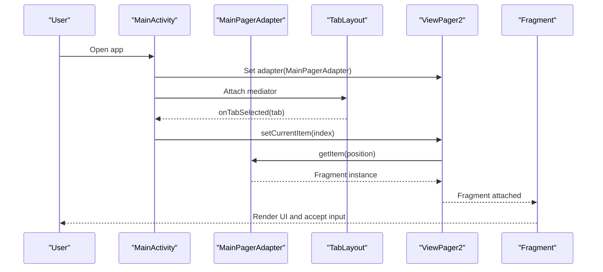

**Diagram sources**
- [MainActivity.kt:62-81](file://app/src/main/java/com/pisces312/streamclip/MainActivity.kt#L62-L81)
- [MainPagerAdapter.kt:21-36](file://app/src/main/java/com/pisces312/streamclip/adapter/MainPagerAdapter.kt#L21-L36)

## Detailed Component Analysis

### MainActivity: Tabbed Interface and Navigation
- Initializes logging and crash handling early in onCreate.
- Sets up ViewPager2 with MainPagerAdapter and TabLayoutMediator to bind tab text/icon and page selection indicator.
- Registers an OnPageChangeCallback to update the tab indicator label.
- Long-press on any tab opens TabOrderActivity to customize ordering.
- Provides actions in the overflow menu to jump to Settings, open Logs, show Help, and open About.

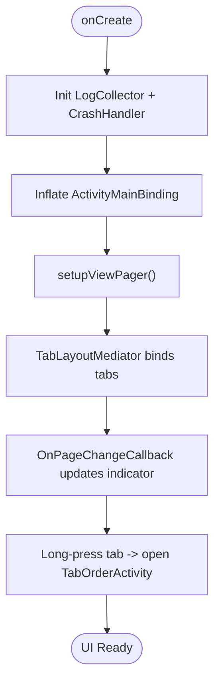

**Diagram sources**
- [MainActivity.kt:35-101](file://app/src/main/java/com/pisces312/streamclip/MainActivity.kt#L35-L101)

**Section sources**
- [MainActivity.kt:35-101](file://app/src/main/java/com/pisces312/streamclip/MainActivity.kt#L35-L101)
- [MainActivity.kt:132-160](file://app/src/main/java/com/pisces312/streamclip/MainActivity.kt#L132-L160)

### MainPagerAdapter: Fragment Management
- Receives a tab order list and returns the appropriate Fragment per position.
- Supported tabs include trim, trim2, merge, extract, compress, audio_compress, custom, metadata, settings.
- Throws on invalid tab identifiers to surface configuration errors early.

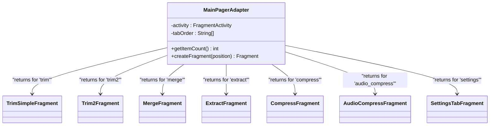

**Diagram sources**
- [MainPagerAdapter.kt:16-36](file://app/src/main/java/com/pisces312/streamclip/adapter/MainPagerAdapter.kt#L16-L36)

**Section sources**
- [MainPagerAdapter.kt:16-36](file://app/src/main/java/com/pisces312/streamclip/adapter/MainPagerAdapter.kt#L16-L36)

### TabOrderActivity: Customizable Tab Ordering
- Displays current tab order as a draggable list using RecyclerView and ItemTouchHelper.
- Saves the new order via TabOrderManager and resets to defaults when requested.
- Toolbar navigation support to return to MainActivity.

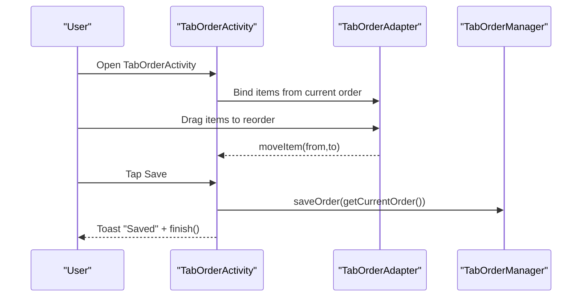

**Diagram sources**
- [TabOrderActivity.kt:43-86](file://app/src/main/java/com/pisces312/streamclip/ui/TabOrderActivity.kt#L43-L86)
- [TabOrderAdapter.kt:37-43](file://app/src/main/java/com/pisces312/streamclip/adapter/TabOrderAdapter.kt#L37-L43)
- [TabOrderManager.kt:53-59](file://app/src/main/java/com/pisces312/streamclip/util/TabOrderManager.kt#L53-L59)

**Section sources**
- [TabOrderActivity.kt:14-92](file://app/src/main/java/com/pisces312/streamclip/ui/TabOrderActivity.kt#L14-L92)
- [TabOrderAdapter.kt:11-43](file://app/src/main/java/com/pisces312/streamclip/adapter/TabOrderAdapter.kt#L11-L43)
- [TabOrderManager.kt:31-59](file://app/src/main/java/com/pisces312/streamclip/util/TabOrderManager.kt#L31-L59)

### SettingsTabFragment: Preference Management
- Handles toggles for output directory behavior, timestamp suffix, screen-on during tasks, and language selection.
- Integrates with SettingsManager for persistence and UI updates.
- Provides actions to open TabOrderActivity, select custom output directory, clear cache, view logs, and show help/about dialogs.

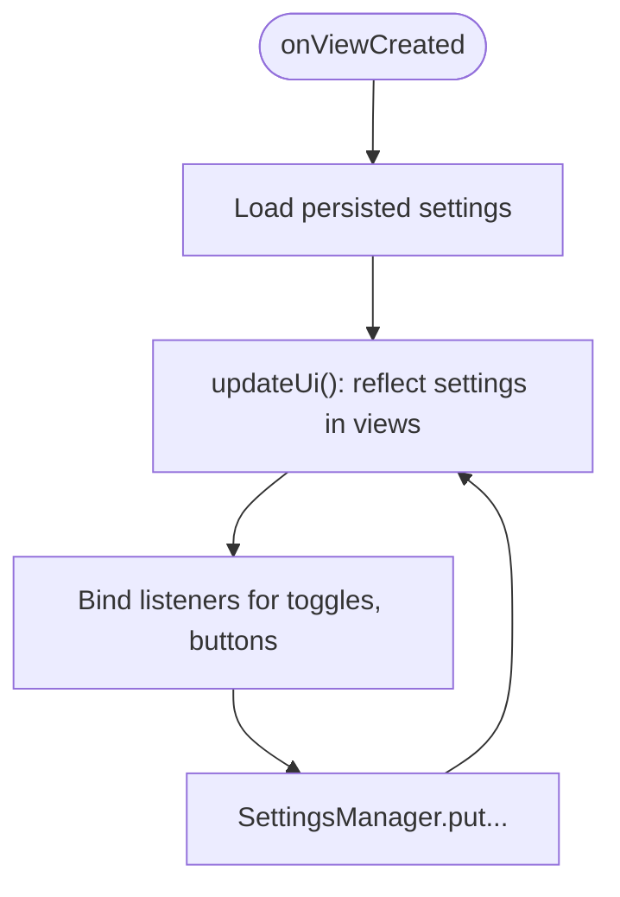

**Diagram sources**
- [SettingsTabFragment.kt:52-134](file://app/src/main/java/com/pisces312/streamclip/fragment/SettingsTabFragment.kt#L52-L134)
- [SettingsManager.kt:22-61](file://app/src/main/java/com/pisces312/streamclip/util/SettingsManager.kt#L22-L61)

**Section sources**
- [SettingsTabFragment.kt:23-134](file://app/src/main/java/com/pisces312/streamclip/fragment/SettingsTabFragment.kt#L23-L134)
- [SettingsManager.kt:15-17](file://app/src/main/java/com/pisces312/streamclip/util/SettingsManager.kt#L15-L17)

### TrimSeekBar: Precise Time Selection
- Renders a rounded track with two draggable markers ([ and ]) and a selected region.
- Supports click-to-seek near the nearest marker and continuous drag updates.
- Notifies listeners on range changes with flags indicating user-initiated changes and whether the end marker was dragged.

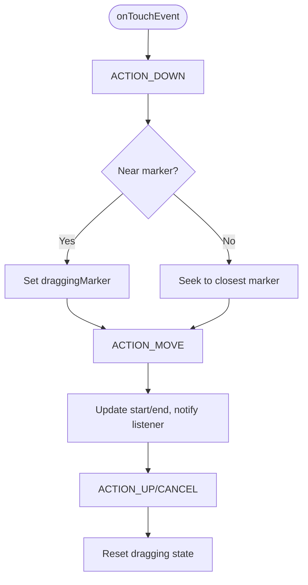

**Diagram sources**
- [TrimSeekBar.kt:162-214](file://app/src/main/java/com/pisces312/streamclip/ui/TrimSeekBar.kt#L162-L214)
- [TrimSeekBar.kt:26-28](file://app/src/main/java/com/pisces312/streamclip/ui/TrimSeekBar.kt#L26-L28)

**Section sources**
- [TrimSeekBar.kt:20-75](file://app/src/main/java/com/pisces312/streamclip/ui/TrimSeekBar.kt#L20-L75)
- [TrimSeekBar.kt:162-214](file://app/src/main/java/com/pisces312/streamclip/ui/TrimSeekBar.kt#L162-L214)

### TrimSimpleFragment: Time-Range Trim (Seconds)
- Selects a video via SAF, loads it into ExoPlayer, and initializes a TrimSeekBar with duration.
- Supports inputting start/end times via formatted text input and seeks the player accordingly.
- Executes lossless trim using FFmpegService and reports progress/results.

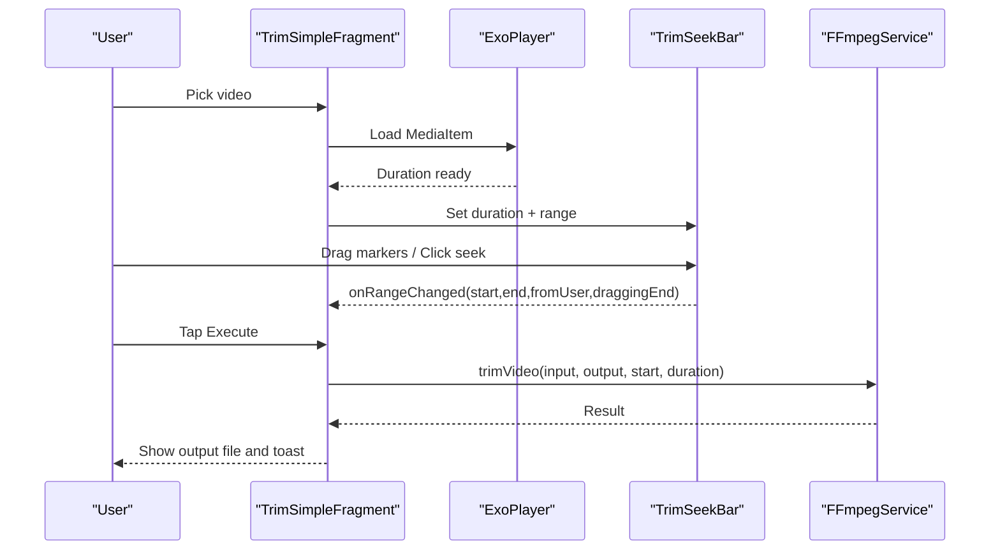

**Diagram sources**
- [TrimSimpleFragment.kt:68-123](file://app/src/main/java/com/pisces312/streamclip/fragment/TrimSimpleFragment.kt#L68-L123)
- [TrimSimpleFragment.kt:288-354](file://app/src/main/java/com/pisces312/streamclip/fragment/TrimSimpleFragment.kt#L288-L354)
- [TrimSeekBar.kt:67-75](file://app/src/main/java/com/pisces312/streamclip/ui/TrimSeekBar.kt#L67-L75)

**Section sources**
- [TrimSimpleFragment.kt:35-123](file://app/src/main/java/com/pisces312/streamclip/fragment/TrimSimpleFragment.kt#L35-L123)
- [TrimSimpleFragment.kt:288-354](file://app/src/main/java/com/pisces312/streamclip/fragment/TrimSimpleFragment.kt#L288-L354)

### Trim2Fragment: RangeSlider-Based Trim (Real-time Preview)
- Uses ExoPlayer with a built-in controller and a Material Design RangeSlider.
- On slider change, seeks the player to the handdle that moved the most.
- Executes lossless trim and updates UI with progress and completion.

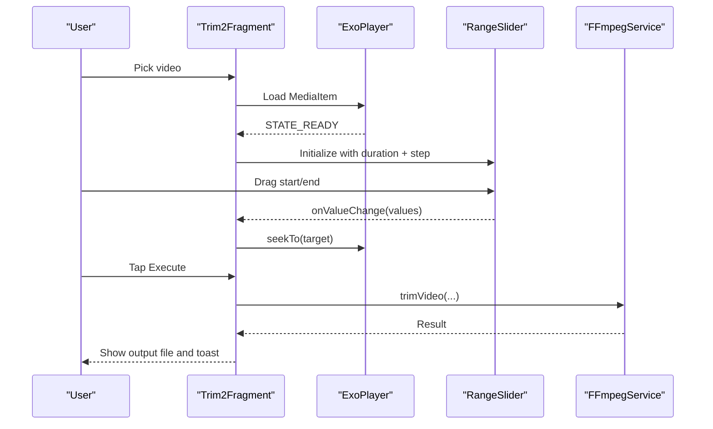

**Diagram sources**
- [Trim2Fragment.kt:67-119](file://app/src/main/java/com/pisces312/streamclip/fragment/Trim2Fragment.kt#L67-L119)
- [Trim2Fragment.kt:178-251](file://app/src/main/java/com/pisces312/streamclip/fragment/Trim2Fragment.kt#L178-L251)

**Section sources**
- [Trim2Fragment.kt:31-119](file://app/src/main/java/com/pisces312/streamclip/fragment/Trim2Fragment.kt#L31-L119)
- [Trim2Fragment.kt:178-251](file://app/src/main/java/com/pisces312/streamclip/fragment/Trim2Fragment.kt#L178-L251)

### MergeFragment: Multi-File Concatenation
- Allows selecting multiple videos via SAF, validates compatibility, probes media info, and merges into MP4.
- Displays status indicators for direct-read vs cached reads and handles incompatible parameters.

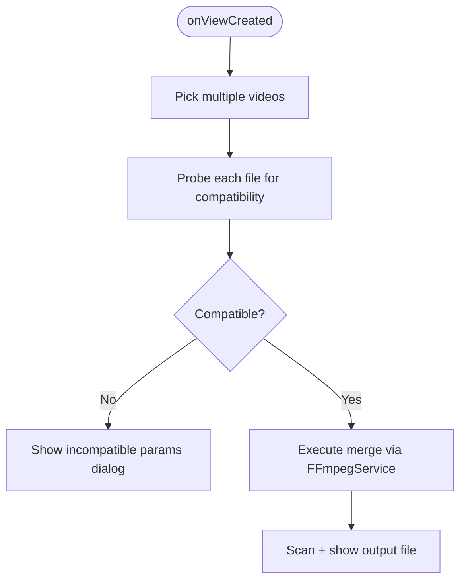

**Diagram sources**
- [MergeFragment.kt:67-97](file://app/src/main/java/com/pisces312/streamclip/fragment/MergeFragment.kt#L67-L97)
- [MergeFragment.kt:135-232](file://app/src/main/java/com/pisces312/streamclip/fragment/MergeFragment.kt#L135-L232)

**Section sources**
- [MergeFragment.kt:28-97](file://app/src/main/java/com/pisces312/streamclip/fragment/MergeFragment.kt#L28-L97)
- [MergeFragment.kt:135-232](file://app/src/main/java/com/pisces312/streamclip/fragment/MergeFragment.kt#L135-L232)

### ExtractFragment: Audio Extraction
- Probes media info to display audio details, extracts audio to a chosen container based on codec, and reports results.

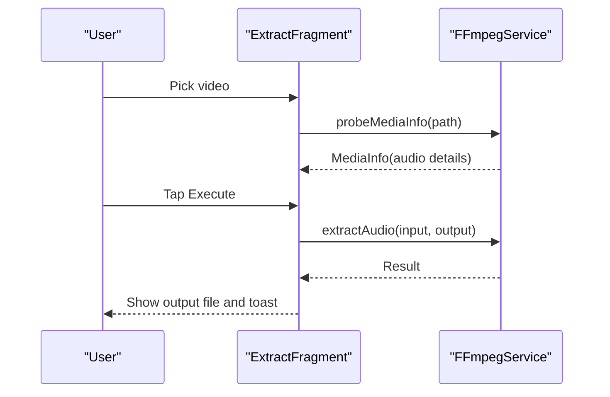

**Diagram sources**
- [ExtractFragment.kt:55-82](file://app/src/main/java/com/pisces312/streamclip/fragment/ExtractFragment.kt#L55-L82)
- [ExtractFragment.kt:136-191](file://app/src/main/java/com/pisces312/streamclip/fragment/ExtractFragment.kt#L136-L191)

**Section sources**
- [ExtractFragment.kt:25-82](file://app/src/main/java/com/pisces312/streamclip/fragment/ExtractFragment.kt#L25-L82)
- [ExtractFragment.kt:136-191](file://app/src/main/java/com/pisces312/streamclip/fragment/ExtractFragment.kt#L136-L191)

### CompressFragment: Video Compression (HW/SW)
- Supports hardware and software encoding tabs with extensive controls (encoder, bitrate/crf, preset, resolution scaling, frame rate, audio options).
- Builds FFmpeg commands dynamically and streams progress/logs in a modal dialog.
- Supports single-file compression and batch compression workflows.

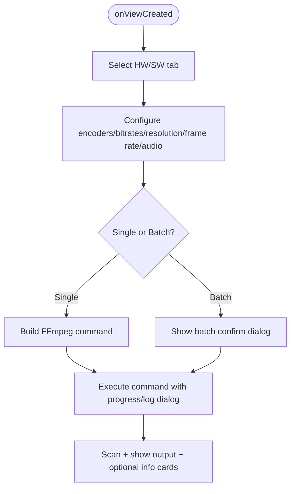

**Diagram sources**
- [CompressFragment.kt:121-137](file://app/src/main/java/com/pisces312/streamclip/fragment/CompressFragment.kt#L121-L137)
- [CompressFragment.kt:572-680](file://app/src/main/java/com/pisces312/streamclip/fragment/CompressFragment.kt#L572-L680)
- [CompressFragment.kt:530-570](file://app/src/main/java/com/pisces312/streamclip/fragment/CompressFragment.kt#L530-L570)

**Section sources**
- [CompressFragment.kt:40-137](file://app/src/main/java/com/pisces312/streamclip/fragment/CompressFragment.kt#L40-L137)
- [CompressFragment.kt:530-680](file://app/src/main/java/com/pisces312/streamclip/fragment/CompressFragment.kt#L530-L680)

### AudioCompressFragment: Audio-Only Compression
- Configures audio encoder, bitrate, and sample rate; optionally preserves video stream when input is a video.
- Builds and executes FFmpeg command with progress/logging dialog.

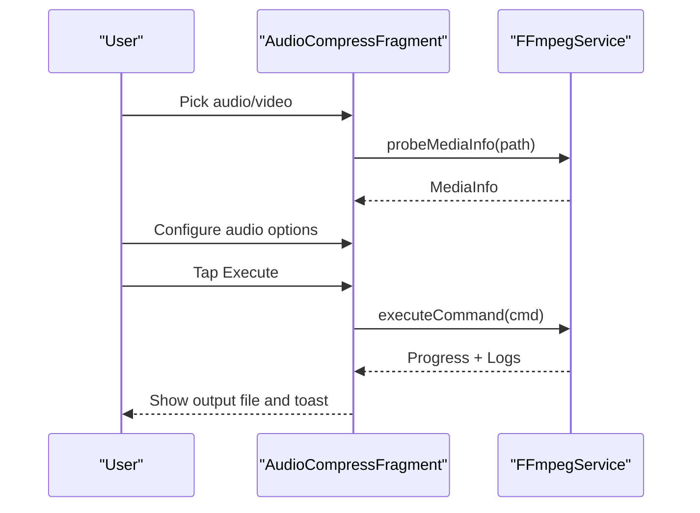

**Diagram sources**
- [AudioCompressFragment.kt:68-73](file://app/src/main/java/com/pisces312/streamclip/fragment/AudioCompressFragment.kt#L68-L73)
- [AudioCompressFragment.kt:225-344](file://app/src/main/java/com/pisces312/streamclip/fragment/AudioCompressFragment.kt#L225-L344)

**Section sources**
- [AudioCompressFragment.kt:33-73](file://app/src/main/java/com/pisces312/streamclip/fragment/AudioCompressFragment.kt#L33-L73)
- [AudioCompressFragment.kt:225-344](file://app/src/main/java/com/pisces312/streamclip/fragment/AudioCompressFragment.kt#L225-L344)

## Dependency Analysis
- MainActivity depends on TabOrderManager for tab order retrieval and on MainPagerAdapter for fragment instantiation.
- TabOrderActivity depends on TabOrderAdapter and TabOrderManager for persistence.
- Fragments depend on SettingsManager for preferences and on FFmpegService for media operations.
- TrimSeekBar is a standalone custom view used by TrimSimpleFragment and Trim2Fragment.

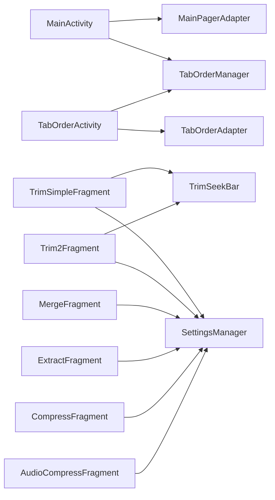

**Diagram sources**
- [MainActivity.kt:62-81](file://app/src/main/java/com/pisces312/streamclip/MainActivity.kt#L62-L81)
- [TabOrderActivity.kt:43-86](file://app/src/main/java/com/pisces312/streamclip/ui/TabOrderActivity.kt#L43-L86)
- [TabOrderAdapter.kt:11-43](file://app/src/main/java/com/pisces312/streamclip/adapter/TabOrderAdapter.kt#L11-L43)
- [TabOrderManager.kt:31-59](file://app/src/main/java/com/pisces312/streamclip/util/TabOrderManager.kt#L31-L59)
- [TrimSimpleFragment.kt:89-100](file://app/src/main/java/com/pisces312/streamclip/fragment/TrimSimpleFragment.kt#L89-L100)
- [Trim2Fragment.kt:87-101](file://app/src/main/java/com/pisces312/streamclip/fragment/Trim2Fragment.kt#L87-L101)
- [SettingsManager.kt:15-17](file://app/src/main/java/com/pisces312/streamclip/util/SettingsManager.kt#L15-L17)

**Section sources**
- [MainActivity.kt:62-81](file://app/src/main/java/com/pisces312/streamclip/MainActivity.kt#L62-L81)
- [TabOrderActivity.kt:43-86](file://app/src/main/java/com/pisces312/streamclip/ui/TabOrderActivity.kt#L43-L86)
- [TabOrderAdapter.kt:11-43](file://app/src/main/java/com/pisces312/streamclip/adapter/TabOrderAdapter.kt#L11-L43)
- [TabOrderManager.kt:31-59](file://app/src/main/java/com/pisces312/streamclip/util/TabOrderManager.kt#L31-L59)
- [TrimSimpleFragment.kt:89-100](file://app/src/main/java/com/pisces312/streamclip/fragment/TrimSimpleFragment.kt#L89-L100)
- [Trim2Fragment.kt:87-101](file://app/src/main/java/com/pisces312/streamclip/fragment/Trim2Fragment.kt#L87-L101)
- [SettingsManager.kt:15-17](file://app/src/main/java/com/pisces312/streamclip/util/SettingsManager.kt#L15-L17)

## Performance Considerations
- ViewPager2 + FragmentStateAdapter: Efficiently manages fragment instances and state, reducing memory overhead for large tab sets.
- ExoPlayer integration: Player listeners and clipping configuration minimize unnecessary re-preparations and optimize playback range.
- Coroutines: Background work for probing media info, executing FFmpeg, and scanning files prevents UI thread blocking.
- Custom TrimSeekBar: Lightweight drawing and minimal invalidations; avoid frequent allocations in onTouchEvent.
- Preferences and persistence: SharedPreferences-backed settings reduce I/O overhead; cache computed sizes and reuse adapters where possible.

[No sources needed since this section provides general guidance]

## Troubleshooting Guide
- Tab order not updating after reordering:
  - Ensure TabOrderActivity saves via TabOrderManager.saveOrder and MainActivity.refreshes ViewPager on resume.
- Crashes on invalid tab identifiers:
  - Verify MainPagerAdapter only receives supported tab IDs; invalid entries trigger exceptions.
- Permission prompts:
  - MainActivity checks storage and media permissions per Android version; grant or direct to Settings when prompted.
- Playback range issues:
  - TrimSimpleFragment updates ExoPlayer clipping configuration when duration is ready; ensure start/end bounds are enforced.
- FFmpeg failures:
  - Inspect returned error messages and logs; verify input paths and permissions; ensure keep-screen-on flag is cleared on completion.

**Section sources**
- [MainActivity.kt:54-60](file://app/src/main/java/com/pisces312/streamclip/MainActivity.kt#L54-L60)
- [MainPagerAdapter.kt:34](file://app/src/main/java/com/pisces312/streamclip/adapter/MainPagerAdapter.kt#L34)
- [MainActivity.kt:454-502](file://app/src/main/java/com/pisces312/streamclip/MainActivity.kt#L454-L502)
- [TrimSimpleFragment.kt:273-286](file://app/src/main/java/com/pisces312/streamclip/fragment/TrimSimpleFragment.kt#L273-L286)

## Conclusion
StreamClip’s UI leverages Material Design 3 components and modern Android patterns to deliver a flexible, customizable, and efficient editing experience. The MainActivity-driven tabbed interface, backed by a configurable tab order system, provides a scalable foundation. Specialized fragments encapsulate domain logic with robust lifecycle and state management, while TrimSeekBar enables precise time selection. Preferences and settings are centralized via SettingsManager, and the tab ordering is persisted and restored seamlessly. The architecture balances responsiveness, accessibility, and maintainability, with clear pathways for debugging and performance tuning.