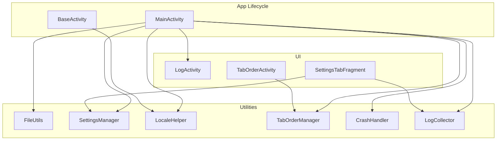
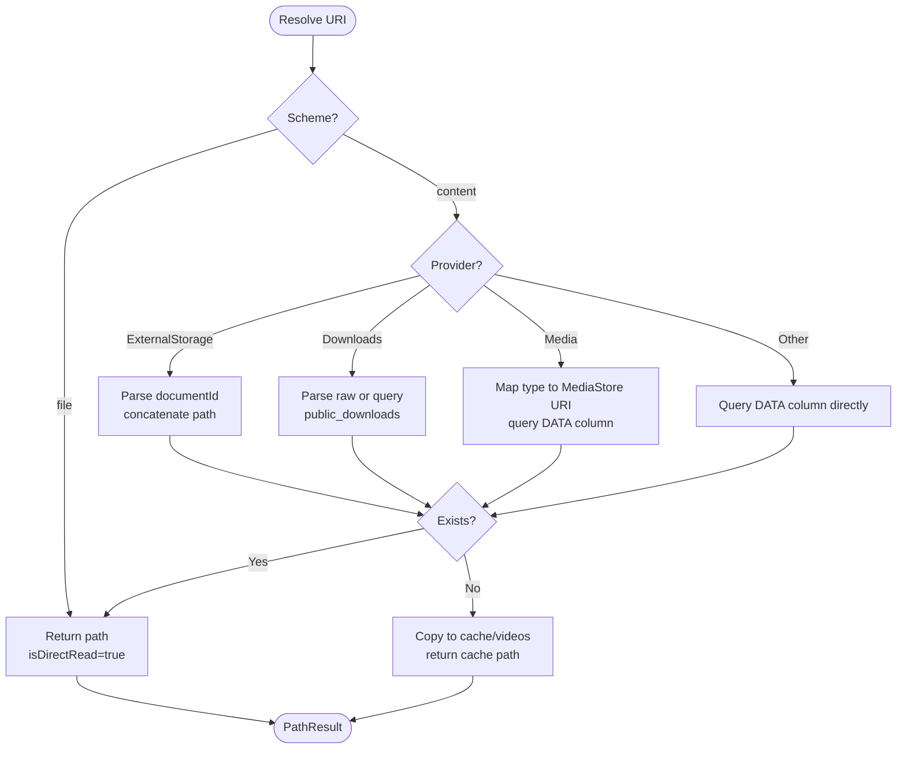
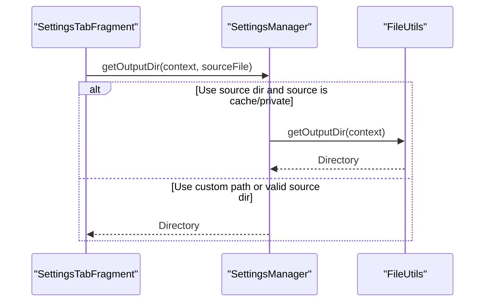
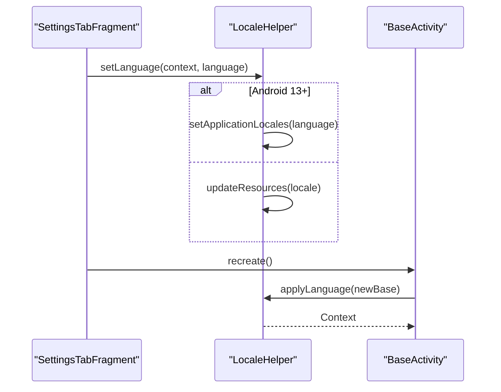
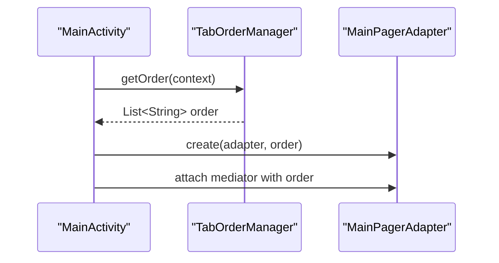
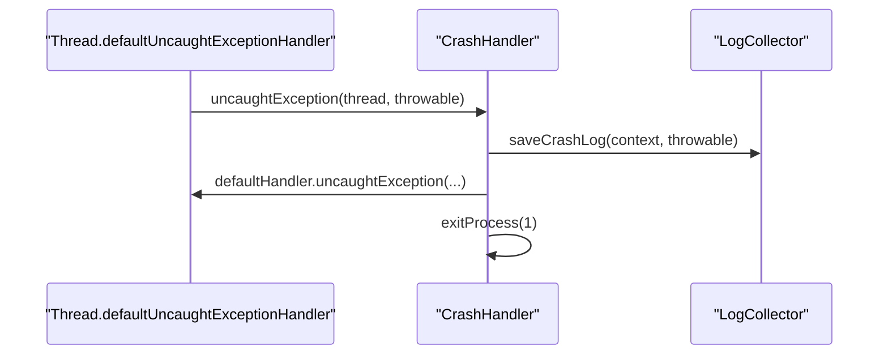
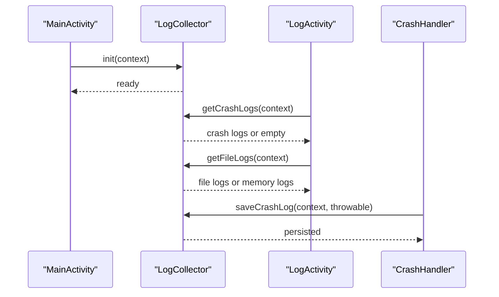
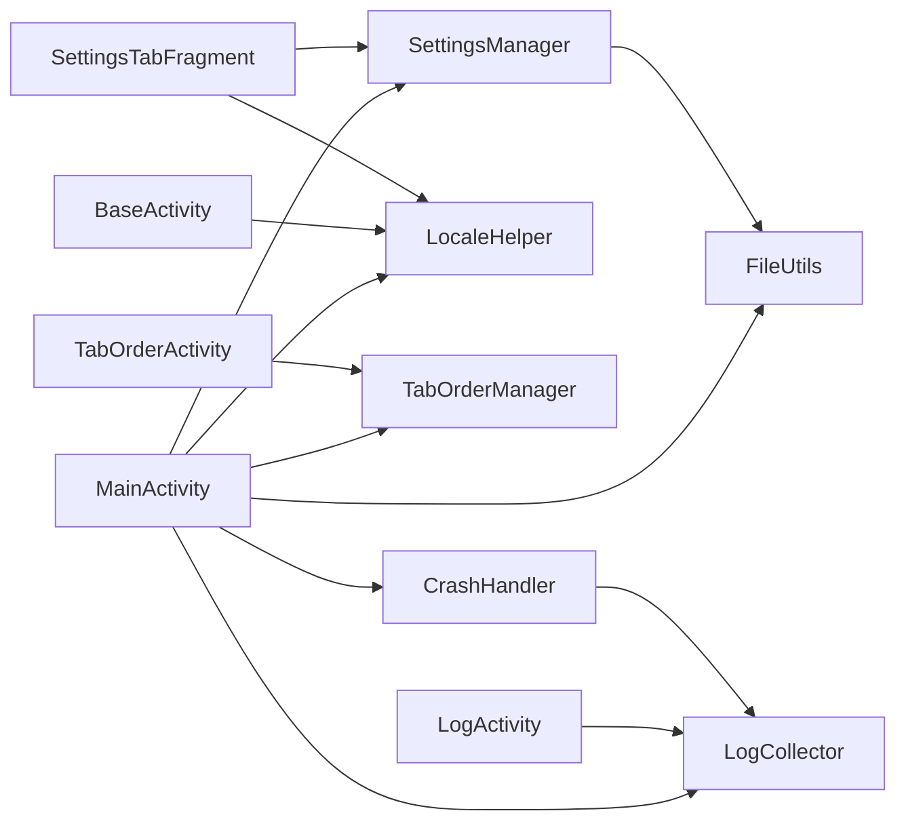

# Utility and Helper Classes

<cite>
**Referenced Files in This Document**
- [FileUtils.kt](file://app/src/main/java/com/pisces312/streamclip/util/FileUtils.kt)
- [SettingsManager.kt](file://app/src/main/java/com/pisces312/streamclip/util/SettingsManager.kt)
- [CrashHandler.kt](file://app/src/main/java/com/pisces312/streamclip/util/CrashHandler.kt)
- [LogCollector.kt](file://app/src/main/java/com/pisces312/streamclip/util/LogCollector.kt)
- [LocaleHelper.kt](file://app/src/main/java/com/pisces312/streamclip/util/LocaleHelper.kt)
- [TabOrderManager.kt](file://app/src/main/java/com/pisces312/streamclip/util/TabOrderManager.kt)
- [MainActivity.kt](file://app/src/main/java/com/pisces312/streamclip/MainActivity.kt)
- [BaseActivity.kt](file://app/src/main/java/com/pisces312/streamclip/BaseActivity.kt)
- [LogActivity.kt](file://app/src/main/java/com/pisces312/streamclip/LogActivity.kt)
- [SettingsTabFragment.kt](file://app/src/main/java/com/pisces312/streamclip/fragment/SettingsTabFragment.kt)
- [TabOrderActivity.kt](file://app/src/main/java/com/pisces312/streamclip/ui/TabOrderActivity.kt)
</cite>

## Table of Contents
1. [Introduction](#introduction)
2. [Project Structure](#project-structure)
3. [Core Components](#core-components)
4. [Architecture Overview](#architecture-overview)
5. [Detailed Component Analysis](#detailed-component-analysis)
6. [Dependency Analysis](#dependency-analysis)
7. [Performance Considerations](#performance-considerations)
8. [Troubleshooting Guide](#troubleshooting-guide)
9. [Conclusion](#conclusion)

## Introduction
This document focuses on StreamClip’s utility and helper classes that encapsulate cross-cutting concerns and shared functionality across the application. These utilities provide:
- File path resolution and storage access integration
- Preference management and internationalization support
- User-customizable interface ordering
- Native crash reporting and diagnostic information gathering
- Consistent behavior across Android versions and platform-specific integrations

They are designed to maintain clean architecture separation by keeping platform-specific logic and cross-cutting concerns out of business logic and UI components, while enabling consistent behavior across different Android versions.

## Project Structure
The utility classes reside under the application module’s Java source tree and are consumed by various activities, fragments, and adapters. They integrate with:
- Application lifecycle (initialization during startup)
- UI components (tabs, settings, logs)
- Platform APIs (SharedPreferences, MediaStore, DocumentsProvider, MediaScanner)
- Logging infrastructure for diagnostics and crash reporting

**Diagram sources**
- [MainActivity.kt:35-52](file://app/src/main/java/com/pisces312/streamclip/MainActivity.kt#L35-L52)
- [BaseActivity.kt:10-12](file://app/src/main/java/com/pisces312/streamclip/BaseActivity.kt#L10-L12)
- [FileUtils.kt:17](file://app/src/main/java/com/pisces312/streamclip/util/FileUtils.kt#L17)
- [SettingsManager.kt:6](file://app/src/main/java/com/pisces312/streamclip/util/SettingsManager.kt#L6)
- [LocaleHelper.kt:12](file://app/src/main/java/com/pisces312/streamclip/util/LocaleHelper.kt#L12)
- [TabOrderManager.kt:7](file://app/src/main/java/com/pisces312/streamclip/util/TabOrderManager.kt#L7)
- [CrashHandler.kt:10](file://app/src/main/java/com/pisces312/streamclip/util/CrashHandler.kt#L10)
- [LogCollector.kt:15](file://app/src/main/java/com/pisces312/streamclip/util/LogCollector.kt#L15)
- [LogActivity.kt:18](file://app/src/main/java/com/pisces312/streamclip/LogActivity.kt#L18)
- [SettingsTabFragment.kt:23](file://app/src/main/java/com/pisces312/streamclip/fragment/SettingsTabFragment.kt#L23)
- [TabOrderActivity.kt:39](file://app/src/main/java/com/pisces312/streamclip/ui/TabOrderActivity.kt#L39)

**Section sources**
- [MainActivity.kt:35-52](file://app/src/main/java/com/pisces312/streamclip/MainActivity.kt#L35-L52)
- [BaseActivity.kt:10-12](file://app/src/main/java/com/pisces312/streamclip/BaseActivity.kt#L10-L12)

## Core Components
- FileUtils: Resolves file paths from URIs, manages output directories, formats sizes and durations, scans media, and preserves file timestamps and shooting dates.
- SettingsManager: Manages preferences for output directory behavior, screen-on behavior, timestamps, last video directory, and cache management.
- LocaleHelper: Provides internationalization support with per-app language on modern Android and wraps contexts for themed rendering.
- TabOrderManager: Stores and merges user-specified tab order with defaults, enabling customizable interface ordering.
- CrashHandler: Installs a global uncaught exception handler to capture crashes, persist logs, and exit cleanly.
- LogCollector: Dual-channel logging (memory buffer + external file), crash log persistence, and retrieval for diagnostics.

**Section sources**
- [FileUtils.kt:17](file://app/src/main/java/com/pisces312/streamclip/util/FileUtils.kt#L17)
- [SettingsManager.kt:6](file://app/src/main/java/com/pisces312/streamclip/util/SettingsManager.kt#L6)
- [LocaleHelper.kt:12](file://app/src/main/java/com/pisces312/streamclip/util/LocaleHelper.kt#L12)
- [TabOrderManager.kt:7](file://app/src/main/java/com/pisces312/streamclip/util/TabOrderManager.kt#L7)
- [CrashHandler.kt:10](file://app/src/main/java/com/pisces312/streamclip/util/CrashHandler.kt#L10)
- [LogCollector.kt:15](file://app/src/main/java/com/pisces312/streamclip/util/LogCollector.kt#L15)

## Architecture Overview
These utilities form a cohesive cross-cutting layer that:
- Encapsulates platform-specific APIs behind unified interfaces
- Centralizes configuration and preferences
- Provides diagnostic capabilities for both application and native crashes
- Enables user customization without altering core business logic

```mermaid
classDiagram
class FileUtils {
+getPathResultFromUri(context, uri) PathResult?
+getPathFromUri(context, uri) String?
+getOutputDir(context) File
+getAudioOutputDir(context) File
+formatFileSize(size) String
+formatDuration(ms) String
+scanFile(context, file) void
+readFileTimes(path) Pair<FileTime?, FileTime?>?
+applyFileTimes(outputPath, creationTime, modifiedTime) void
+applyShootingDate(outputPath, shootingDate) void
}
class SettingsManager {
+isUseSourceDir(context) Boolean
+setUseSourceDir(context, value) void
+isAddTimestamp(context) Boolean
+setAddTimestamp(context, value) void
+isKeepScreenOn(context) Boolean
+setKeepScreenOn(context, value) void
+getCustomOutputPath(context) String?
+setCustomOutputPath(context, path) void
+getOutputDir(context, sourceFile) File
+generateOutputFileName(baseName, extension, context) String
+getOutputFileName(context, sourceFileName, operation, extension) String
+setLastVideoDir(context, uri) void
+getLastVideoDir(context) Uri?
+clearLastVideoDir(context) void
+getCacheSize(context) Long
+clearCache(context) void
+formatSize(size) String
}
class LocaleHelper {
+getLanguage(context) String
+setLanguage(context, language) void
+applyLanguage(context) Context
+wrapContext(context) ContextThemeWrapper
}
class TabOrderManager {
+DEFAULT_ORDER List<String>
+TAB_ICONS Map<String, Int>
+getOrder(context) List<String>
+saveOrder(context, order) void
+resetOrder(context) void
}
class CrashHandler {
+install() void
+uncaughtException(thread, throwable) void
}
class LogCollector {
+init(context) void
+log(level, tag, message) void
+d(tag, message) void
+i(tag, message) void
+w(tag, message) void
+e(tag, message) void
+e(tag, message, throwable) void
+getMemoryLogs() List<LogEntry>
+getFileLogs(context) String
+getCrashLogs(context) String
+saveCrashLog(context, throwable) void
+clearLogs(context) void
+hasCrashLog(context) Boolean
+clearCrashLog(context) void
}
class MainActivity
class BaseActivity
class LogActivity
class SettingsTabFragment
class TabOrderActivity
MainActivity --> FileUtils : "uses"
MainActivity --> SettingsManager : "uses"
MainActivity --> LocaleHelper : "uses"
MainActivity --> TabOrderManager : "uses"
MainActivity --> CrashHandler : "installs"
MainActivity --> LogCollector : "uses"
BaseActivity --> LocaleHelper : "applies"
LogActivity --> LogCollector : "reads/writes"
SettingsTabFragment --> SettingsManager : "uses"
SettingsTabFragment --> LocaleHelper : "uses"
TabOrderActivity --> TabOrderManager : "reads/writes"
```

**Diagram sources**
- [FileUtils.kt:17](file://app/src/main/java/com/pisces312/streamclip/util/FileUtils.kt#L17)
- [SettingsManager.kt:6](file://app/src/main/java/com/pisces312/streamclip/util/SettingsManager.kt#L6)
- [LocaleHelper.kt:12](file://app/src/main/java/com/pisces312/streamclip/util/LocaleHelper.kt#L12)
- [TabOrderManager.kt:7](file://app/src/main/java/com/pisces312/streamclip/util/TabOrderManager.kt#L7)
- [CrashHandler.kt:10](file://app/src/main/java/com/pisces312/streamclip/util/CrashHandler.kt#L10)
- [LogCollector.kt:15](file://app/src/main/java/com/pisces312/streamclip/util/LogCollector.kt#L15)
- [MainActivity.kt:35-52](file://app/src/main/java/com/pisces312/streamclip/MainActivity.kt#L35-L52)
- [BaseActivity.kt:10-12](file://app/src/main/java/com/pisces312/streamclip/BaseActivity.kt#L10-L12)
- [LogActivity.kt:18](file://app/src/main/java/com/pisces312/streamclip/LogActivity.kt#L18)
- [SettingsTabFragment.kt:23](file://app/src/main/java/com/pisces312/streamclip/fragment/SettingsTabFragment.kt#L23)
- [TabOrderActivity.kt:39](file://app/src/main/java/com/pisces312/streamclip/ui/TabOrderActivity.kt#L39)

## Detailed Component Analysis

### FileUtils
Responsibilities:
- Resolve real file paths from URIs across multiple providers (External Storage, Downloads, Media Store, and direct file scheme)
- Fallback to copying content to a cache directory when direct access is not possible
- Manage output directories for videos and audio, adapting to scoped storage on newer Android versions
- Format file sizes and durations for user display
- Scan files into media galleries and preserve timestamps and shooting dates

Key implementation patterns:
- PathResult encapsulates whether a path is direct-read or cached-copy
- Provider-specific parsing for ExternalStorage, Downloads, and Media documents
- Robust fallback to cache copy when direct access fails
- Version-aware directory selection for scoped storage (Q+) and legacy public directories
- Timestamp preservation using NIO attributes on O+ and date parsing for shooting date application

Integration points:
- Used by activities and services to resolve input URIs and compute output locations
- Consumed by SettingsManager to derive output directories based on user preferences

**Diagram sources**
- [FileUtils.kt:30-118](file://app/src/main/java/com/pisces312/streamclip/util/FileUtils.kt#L30-L118)
- [FileUtils.kt:170-187](file://app/src/main/java/com/pisces312/streamclip/util/FileUtils.kt#L170-L187)

**Section sources**
- [FileUtils.kt:17](file://app/src/main/java/com/pisces312/streamclip/util/FileUtils.kt#L17)
- [FileUtils.kt:19](file://app/src/main/java/com/pisces312/streamclip/util/FileUtils.kt#L19-L25)
- [FileUtils.kt:30-118](file://app/src/main/java/com/pisces312/streamclip/util/FileUtils.kt#L30-L118)
- [FileUtils.kt:170-187](file://app/src/main/java/com/pisces312/streamclip/util/FileUtils.kt#L170-L187)
- [FileUtils.kt:208-229](file://app/src/main/java/com/pisces312/streamclip/util/FileUtils.kt#L208-L229)
- [FileUtils.kt:234-255](file://app/src/main/java/com/pisces312/streamclip/util/FileUtils.kt#L234-L255)
- [FileUtils.kt:268-296](file://app/src/main/java/com/pisces312/streamclip/util/FileUtils.kt#L268-L296)
- [FileUtils.kt:318-331](file://app/src/main/java/com/pisces312/streamclip/util/FileUtils.kt#L318-L331)
- [FileUtils.kt:333-360](file://app/src/main/java/com/pisces312/streamclip/util/FileUtils.kt#L333-L360)

### SettingsManager
Responsibilities:
- Persist and retrieve user preferences for output directory behavior, timestamp suffix, screen-on behavior, and last video directory
- Compute effective output directory considering user preferences and source file location
- Generate output filenames with optional timestamp suffix
- Manage cache size calculation and clearing

Key implementation patterns:
- Uses SharedPreferences with a dedicated preferences name and typed getters/setters
- Output directory resolution logic checks if source is in cache/private directories and falls back to app-specific directories
- Cache management traverses cache directories and logs directory to compute and clear sizes

Integration points:
- Consumed by UI components to configure behavior and display cache statistics
- Used by file operations to determine where to write processed files

**Diagram sources**
- [SettingsManager.kt:67-92](file://app/src/main/java/com/pisces312/streamclip/util/SettingsManager.kt#L67-L92)
- [FileUtils.kt:208-229](file://app/src/main/java/com/pisces312/streamclip/util/FileUtils.kt#L208-L229)

**Section sources**
- [SettingsManager.kt:6](file://app/src/main/java/com/pisces312/streamclip/util/SettingsManager.kt#L6)
- [SettingsManager.kt:19-50](file://app/src/main/java/com/pisces312/streamclip/util/SettingsManager.kt#L19-L50)
- [SettingsManager.kt:67-92](file://app/src/main/java/com/pisces312/streamclip/util/SettingsManager.kt#L67-L92)
- [SettingsManager.kt:99-114](file://app/src/main/java/com/pisces312/streamclip/util/SettingsManager.kt#L99-L114)
- [SettingsManager.kt:118-136](file://app/src/main/java/com/pisces312/streamclip/util/SettingsManager.kt#L118-L136)
- [SettingsManager.kt:141-164](file://app/src/main/java/com/pisces312/streamclip/util/SettingsManager.kt#L141-L164)

### LocaleHelper
Responsibilities:
- Persist and apply user-selected language
- Support per-app language on Android 13+ using AppCompatDelegate
- Wrap contexts for themed rendering

Key implementation patterns:
- Uses SharedPreferences to store language choice
- On Android 13+, sets application locales via AppCompatDelegate
- Older versions rely on resource configuration updates

Integration points:
- Applied in BaseActivity to ensure all activities reflect the selected language
- Used by UI components to present language selection dialogs

**Diagram sources**
- [LocaleHelper.kt:27-48](file://app/src/main/java/com/pisces312/streamclip/util/LocaleHelper.kt#L27-L48)
- [BaseActivity.kt:10-12](file://app/src/main/java/com/pisces312/streamclip/BaseActivity.kt#L10-L12)

**Section sources**
- [LocaleHelper.kt:12](file://app/src/main/java/com/pisces312/streamclip/util/LocaleHelper.kt#L12)
- [LocaleHelper.kt:23-48](file://app/src/main/java/com/pisces312/streamclip/util/LocaleHelper.kt#L23-L48)
- [LocaleHelper.kt:58-60](file://app/src/main/java/com/pisces312/streamclip/util/LocaleHelper.kt#L58-L60)
- [BaseActivity.kt:10-12](file://app/src/main/java/com/pisces312/streamclip/BaseActivity.kt#L10-L12)

### TabOrderManager
Responsibilities:
- Store and merge user-specified tab order with default tabs
- Provide icons for tabs and expose a master list of tab identifiers
- Save and reset user order preferences

Key implementation patterns:
- Maintains a DEFAULT_ORDER list and merges saved order with new tabs appended
- Ensures saved order only contains known tab IDs and filters unknown entries

Integration points:
- Used by MainActivity to construct the main pager adapter and tab mediator
- Used by TabOrderActivity to render and reorder tabs

**Diagram sources**
- [TabOrderManager.kt:31-51](file://app/src/main/java/com/pisces312/streamclip/util/TabOrderManager.kt#L31-L51)
- [MainActivity.kt:62-81](file://app/src/main/java/com/pisces312/streamclip/MainActivity.kt#L62-L81)

**Section sources**
- [TabOrderManager.kt:7](file://app/src/main/java/com/pisces312/streamclip/util/TabOrderManager.kt#L7)
- [TabOrderManager.kt:31-51](file://app/src/main/java/com/pisces312/streamclip/util/TabOrderManager.kt#L31-L51)
- [TabOrderManager.kt:53-59](file://app/src/main/java/com/pisces312/streamclip/util/TabOrderManager.kt#L53-L59)

### CrashHandler
Responsibilities:
- Install a global uncaught exception handler
- Capture exceptions, delegate to default handler, and exit cleanly

Key implementation patterns:
- Implements Thread.UncaughtExceptionHandler
- Delegates to LogCollector to persist crash logs

Integration points:
- Installed in MainActivity.onCreate alongside LogCollector initialization

**Diagram sources**
- [CrashHandler.kt:18-27](file://app/src/main/java/com/pisces312/streamclip/util/CrashHandler.kt#L18-L27)
- [LogCollector.kt:150-168](file://app/src/main/java/com/pisces312/streamclip/util/LogCollector.kt#L150-L168)

**Section sources**
- [CrashHandler.kt:10](file://app/src/main/java/com/pisces312/streamclip/util/CrashHandler.kt#L10)
- [CrashHandler.kt:18-27](file://app/src/main/java/com/pisces312/streamclip/util/CrashHandler.kt#L18-L27)

### LogCollector
Responsibilities:
- Initialize logging subsystem and manage log files
- Maintain an in-memory ring buffer of recent logs
- Persist crash logs to a separate file and provide retrieval
- Provide convenience methods for different log levels

Key implementation patterns:
- Uses ConcurrentLinkedQueue for thread-safe memory buffering
- Writes to external files under app’s external files directory
- Truncates files when exceeding size limits
- Formats timestamps using a preconfigured DateTimeFormatter

Integration points:
- Initialized in MainActivity.onCreate
- Used by CrashHandler to persist crash logs
- Consumed by LogActivity to display logs
- Used by SettingsTabFragment to clear cache and trigger log clearing

**Diagram sources**
- [MainActivity.kt:38-51](file://app/src/main/java/com/pisces312/streamclip/MainActivity.kt#L38-L51)
- [LogActivity.kt:39-67](file://app/src/main/java/com/pisces312/streamclip/LogActivity.kt#L39-L67)
- [CrashHandler.kt:18-27](file://app/src/main/java/com/pisces312/streamclip/util/CrashHandler.kt#L18-L27)
- [LogCollector.kt:43-54](file://app/src/main/java/com/pisces312/streamclip/util/LogCollector.kt#L43-L54)
- [LogCollector.kt:134-145](file://app/src/main/java/com/pisces312/streamclip/util/LogCollector.kt#L134-L145)
- [LogCollector.kt:150-168](file://app/src/main/java/com/pisces312/streamclip/util/LogCollector.kt#L150-L168)

**Section sources**
- [LogCollector.kt:15](file://app/src/main/java/com/pisces312/streamclip/util/LogCollector.kt#L15)
- [LogCollector.kt:43-54](file://app/src/main/java/com/pisces312/streamclip/util/LogCollector.kt#L43-L54)
- [LogCollector.kt:59-88](file://app/src/main/java/com/pisces312/streamclip/util/LogCollector.kt#L59-L88)
- [LogCollector.kt:118-145](file://app/src/main/java/com/pisces312/streamclip/util/LogCollector.kt#L118-L145)
- [LogCollector.kt:150-168](file://app/src/main/java/com/pisces312/streamclip/util/LogCollector.kt#L150-L168)
- [LogCollector.kt:173-200](file://app/src/main/java/com/pisces312/streamclip/util/LogCollector.kt#L173-L200)

## Dependency Analysis
- Cross-cutting dependencies:
  - MainActivity depends on all utilities for initialization and runtime behavior
  - BaseActivity depends on LocaleHelper for language application
  - LogActivity depends on LogCollector for display and management
  - SettingsTabFragment depends on SettingsManager and LocaleHelper for configuration and cache management
  - TabOrderActivity depends on TabOrderManager for ordering and icons
- Internal dependencies:
  - SettingsManager uses FileUtils for output directory computation
  - CrashHandler uses LogCollector for crash log persistence
  - LogCollector is used by MainActivity for crash detection and by LogActivity for display

**Diagram sources**
- [MainActivity.kt:35-52](file://app/src/main/java/com/pisces312/streamclip/MainActivity.kt#L35-L52)
- [BaseActivity.kt:10-12](file://app/src/main/java/com/pisces312/streamclip/BaseActivity.kt#L10-L12)
- [LogActivity.kt:18](file://app/src/main/java/com/pisces312/streamclip/LogActivity.kt#L18)
- [SettingsTabFragment.kt:23](file://app/src/main/java/com/pisces312/streamclip/fragment/SettingsTabFragment.kt#L23)
- [TabOrderActivity.kt:39](file://app/src/main/java/com/pisces312/streamclip/ui/TabOrderActivity.kt#L39)
- [SettingsManager.kt:78](file://app/src/main/java/com/pisces312/streamclip/util/SettingsManager.kt#L78)
- [CrashHandler.kt:20](file://app/src/main/java/com/pisces312/streamclip/util/CrashHandler.kt#L20)

**Section sources**
- [MainActivity.kt:35-52](file://app/src/main/java/com/pisces312/streamclip/MainActivity.kt#L35-L52)
- [SettingsManager.kt:78](file://app/src/main/java/com/pisces312/streamclip/util/SettingsManager.kt#L78)
- [CrashHandler.kt:20](file://app/src/main/java/com/pisces312/streamclip/util/CrashHandler.kt#L20)

## Performance Considerations
- FileUtils
  - Direct reads minimize I/O overhead; cache copy is used as a fallback
  - Media scanning is asynchronous via MediaScannerConnection
  - Timestamp operations are guarded by version checks to avoid overhead on unsupported versions
- SettingsManager
  - Cache size calculation traverses directories; avoid frequent recalculations by caching results in UI where appropriate
  - Clearing cache deletes files recursively; ensure it runs off the main thread
- LogCollector
  - Memory buffer caps at a fixed size to prevent excessive RAM usage
  - File truncation ensures log files remain bounded in size
  - Logging to external files is buffered and written asynchronously via append operations
- LocaleHelper
  - Per-app language setting on Android 13+ avoids per-activity recreation costs by applying at application level
- TabOrderManager
  - Order retrieval is lightweight; merging logic runs once per session and caches results in UI components

[No sources needed since this section provides general guidance]

## Troubleshooting Guide
- Crash detection and handling
  - MainActivity checks for crash logs on startup and prompts the user to view logs
  - CrashHandler delegates to LogCollector to persist crash logs and exits cleanly
  - LogActivity displays crash logs and allows copying, sharing, and clearing
- Log retention and retrieval
  - LogCollector maintains a rolling memory buffer and a file-backed log
  - Crash logs are stored separately and cleared after user action
- File path resolution failures
  - FileUtils falls back to cache copy when direct access is not possible
  - Verify provider authorities and document IDs for ExternalStorage, Downloads, and Media providers
- Internationalization issues
  - Ensure per-app language is set on Android 13+ and that BaseActivity applies the language consistently
- Tab ordering inconsistencies
  - TabOrderManager merges saved order with defaults; verify saved keys and ensure new tabs are appended correctly

**Section sources**
- [MainActivity.kt:116-130](file://app/src/main/java/com/pisces312/streamclip/MainActivity.kt#L116-L130)
- [CrashHandler.kt:18-27](file://app/src/main/java/com/pisces312/streamclip/util/CrashHandler.kt#L18-L27)
- [LogActivity.kt:39-67](file://app/src/main/java/com/pisces312/streamclip/LogActivity.kt#L39-L67)
- [LogCollector.kt:150-168](file://app/src/main/java/com/pisces312/streamclip/util/LogCollector.kt#L150-L168)
- [FileUtils.kt:110-118](file://app/src/main/java/com/pisces312/streamclip/util/FileUtils.kt#L110-L118)
- [LocaleHelper.kt:30-38](file://app/src/main/java/com/pisces312/streamclip/util/LocaleHelper.kt#L30-L38)
- [BaseActivity.kt:10-12](file://app/src/main/java/com/pisces312/streamclip/BaseActivity.kt#L10-L12)
- [TabOrderManager.kt:31-51](file://app/src/main/java/com/pisces312/streamclip/util/TabOrderManager.kt#L31-L51)

## Conclusion
StreamClip’s utility and helper classes provide a robust foundation for cross-cutting concerns:
- FileUtils centralizes storage access and path resolution with graceful fallbacks
- SettingsManager consolidates preferences and cache management
- LocaleHelper enables consistent internationalization across Android versions
- TabOrderManager supports user-customizable UI layouts
- CrashHandler and LogCollector deliver reliable crash reporting and diagnostics

These components maintain clean architecture by isolating platform-specific logic and cross-cutting concerns, enabling consistent behavior across Android versions and simplifying integration with UI and business logic layers.