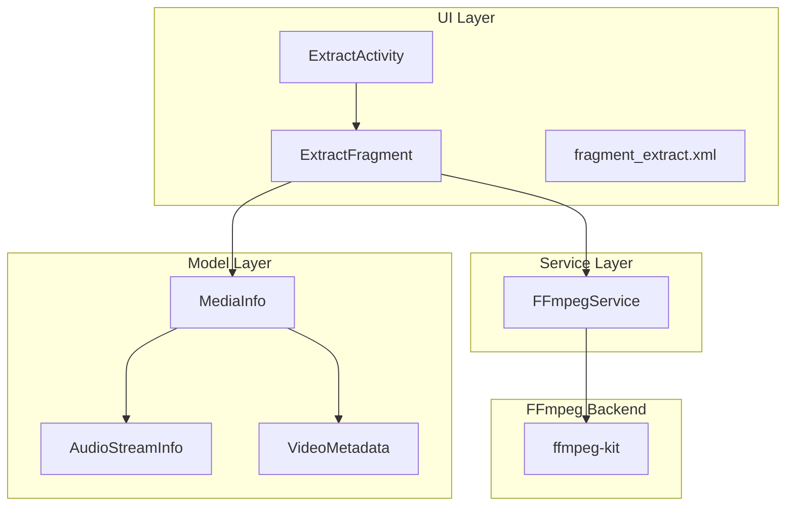
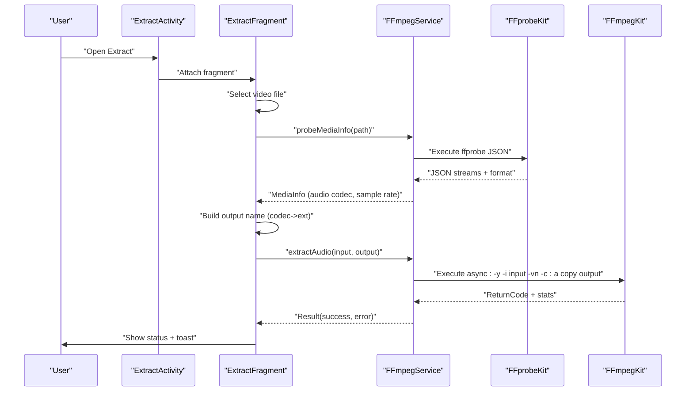
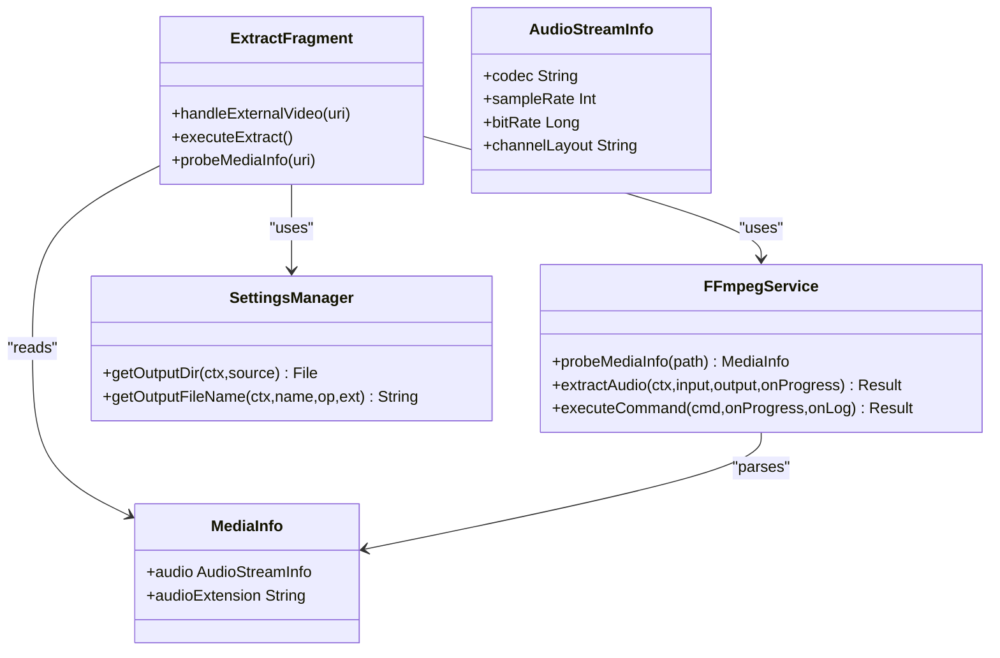

# Audio Extraction

<cite>
**Referenced Files in This Document**
- [ExtractFragment.kt](file://app/src/main/java/com/pisces312/streamclip/fragment/ExtractFragment.kt)
- [FFmpegService.kt](file://app/src/main/java/com/pisces312/streamclip/service/FFmpegService.kt)
- [MediaInfo.kt](file://app/src/main/java/com/pisces312/streamclip/model/MediaInfo.kt)
- [VideoMetadata.kt](file://app/src/main/java/com/pisces312/streamclip/model/VideoMetadata.kt)
- [ExtractActivity.kt](file://app/src/main/java/com/pisces312/streamclip/ui/ExtractActivity.kt)
- [fragment_extract.xml](file://app/src/main/res/layout/fragment_extract.xml)
- [SettingsManager.kt](file://app/src/main/java/com/pisces312/streamclip/util/SettingsManager.kt)
- [README.md](file://README.md)
- [ffmpeg-kit-migration-plan.md](file://docs/ffmpeg-kit-migration-plan.md)
- [swresample-crash-analysis.md](file://docs/swresample-crash-analysis.md)
</cite>

## Table of Contents
1. [Introduction](#introduction)
2. [Project Structure](#project-structure)
3. [Core Components](#core-components)
4. [Architecture Overview](#architecture-overview)
5. [Detailed Component Analysis](#detailed-component-analysis)
6. [Dependency Analysis](#dependency-analysis)
7. [Performance Considerations](#performance-considerations)
8. [Troubleshooting Guide](#troubleshooting-guide)
9. [Conclusion](#conclusion)
10. [Appendices](#appendices)

## Introduction
This document explains StreamClip’s audio extraction feature that performs lossless audio stream copying from video files. It covers the technical implementation, supported audio formats, codec compatibility, quality preservation, FFmpeg command construction, parameter configuration, and practical usage patterns. It also addresses differences from audio compression, performance characteristics, metadata preservation, common issues, and troubleshooting.

## Project Structure
The audio extraction feature spans UI, service, and model layers:
- UI: An activity and fragment orchestrate selection, probing, and execution.
- Service: A centralized FFmpeg service constructs and executes commands, handles progress and logs, and manages cancellation.
- Model: Media information parsing and codec-to-extension mapping drive output naming and format decisions.

**Diagram sources**
- [ExtractActivity.kt:12-36](file://app/src/main/java/com/pisces312/streamclip/ui/ExtractActivity.kt#L12-L36)
- [ExtractFragment.kt:25-209](file://app/src/main/java/com/pisces312/streamclip/fragment/ExtractFragment.kt#L25-L209)
- [FFmpegService.kt:19-420](file://app/src/main/java/com/pisces312/streamclip/service/FFmpegService.kt#L19-L420)
- [MediaInfo.kt:5-165](file://app/src/main/java/com/pisces312/streamclip/model/MediaInfo.kt#L5-L165)
- [VideoMetadata.kt:5-56](file://app/src/main/java/com/pisces312/streamclip/model/VideoMetadata.kt#L5-L56)

**Section sources**
- [ExtractFragment.kt:25-209](file://app/src/main/java/com/pisces312/streamclip/fragment/ExtractFragment.kt#L25-L209)
- [FFmpegService.kt:19-420](file://app/src/main/java/com/pisces312/streamclip/service/FFmpegService.kt#L19-L420)
- [MediaInfo.kt:5-165](file://app/src/main/java/com/pisces312/streamclip/model/MediaInfo.kt#L5-L165)
- [VideoMetadata.kt:5-56](file://app/src/main/java/com/pisces312/streamclip/model/VideoMetadata.kt#L5-L56)

## Core Components
- ExtractFragment orchestrates user interaction, file selection, probing, and execution.
- FFmpegService encapsulates FFprobe probing and FFmpeg command execution, progress reporting, and cancellation.
- MediaInfo parses ffprobe JSON and exposes audio codec, sample rate, and convenience helpers.
- SettingsManager controls output directory, filename generation, and runtime preferences.
- ExtractActivity supports opening external video URIs for audio extraction.

Key responsibilities:
- Lossless audio extraction: -vn -c:a copy
- Output naming: derived from audio codec mapping
- Progress and logging: via ffmpeg-kit statistics and callbacks
- Metadata preservation: handled elsewhere in the app for other operations

**Section sources**
- [ExtractFragment.kt:25-209](file://app/src/main/java/com/pisces312/streamclip/fragment/ExtractFragment.kt#L25-L209)
- [FFmpegService.kt:336-350](file://app/src/main/java/com/pisces312/streamclip/service/FFmpegService.kt#L336-L350)
- [MediaInfo.kt:123-141](file://app/src/main/java/com/pisces312/streamclip/model/MediaInfo.kt#L123-L141)
- [SettingsManager.kt:67-114](file://app/src/main/java/com/pisces312/streamclip/util/SettingsManager.kt#L67-L114)
- [ExtractActivity.kt:12-36](file://app/src/main/java/com/pisces312/streamclip/ui/ExtractActivity.kt#L12-L36)

## Architecture Overview
The audio extraction pipeline follows a clear flow: UI triggers, service probes media, builds a lossless extraction command, executes it asynchronously, and reports progress and results.

**Diagram sources**
- [ExtractActivity.kt:12-36](file://app/src/main/java/com/pisces312/streamclip/ui/ExtractActivity.kt#L12-L36)
- [ExtractFragment.kt:119-191](file://app/src/main/java/com/pisces312/streamclip/fragment/ExtractFragment.kt#L119-L191)
- [FFmpegService.kt:56-147](file://app/src/main/java/com/pisces312/streamclip/service/FFmpegService.kt#L56-L147)
- [FFmpegService.kt:336-350](file://app/src/main/java/com/pisces312/streamclip/service/FFmpegService.kt#L336-L350)

## Detailed Component Analysis

### ExtractFragment: UI orchestration and execution
- Handles file selection via Android’s storage access framework.
- Probes media info using FFmpegService.probeMediaInfo and displays audio details.
- Builds output path using SettingsManager and MediaInfo’s audioExtension mapping.
- Executes extraction via FFmpegService.extractAudio and updates UI with progress and status.

Practical notes:
- External video URIs are supported via ExtractActivity argument passing.
- Output directory selection respects user preferences and falls back to a safe default when needed.

**Section sources**
- [ExtractFragment.kt:25-209](file://app/src/main/java/com/pisces312/streamclip/fragment/ExtractFragment.kt#L25-L209)
- [ExtractActivity.kt:12-36](file://app/src/main/java/com/pisces312/streamclip/ui/ExtractActivity.kt#L12-L36)
- [fragment_extract.xml:10-68](file://app/src/main/res/layout/fragment_extract.xml#L10-L68)

### FFmpegService: probing, command execution, and progress
- probeMediaInfo: Parses ffprobe JSON to extract format and stream information, including the first audio stream.
- extractAudio: Constructs and executes a lossless audio extraction command using ffmpeg-kit.
- executeCommand: Asynchronous execution with optional progress and log callbacks; computes percentage from statistics and estimated remaining time.

Important command:
- Lossless audio extraction: -y -i input -vn -c:a copy output

Progress and logging:
- StatisticsCallback provides time-based progress; when total duration is known, percentage is computed.
- Logs are forwarded to onLog callback for UI display.

Cancellation:
- cancelCurrentSession cancels the currently running session.

**Section sources**
- [FFmpegService.kt:56-147](file://app/src/main/java/com/pisces312/streamclip/service/FFmpegService.kt#L56-L147)
- [FFmpegService.kt:336-350](file://app/src/main/java/com/pisces312/streamclip/service/FFmpegService.kt#L336-L350)
- [FFmpegService.kt:152-241](file://app/src/main/java/com/pisces312/streamclip/service/FFmpegService.kt#L152-L241)

### MediaInfo and AudioStreamInfo: codec and extension mapping
- MediaInfo exposes audio codec, sample rate, and convenience accessors.
- Codec-to-extension mapping determines output file extension based on audio codec:
  - AAC -> aac
  - MP3 -> mp3
  - FLAC -> flac
  - PCM variants -> wav
  - Opus -> opus
  - Vorbis -> ogg
  - AC-3/EAC-3 -> ac3/eac3
  - DTS -> dts
  - TrueHD -> thd
  - ALAC -> m4a
  - WMA -> wma
  - Others -> audio

This mapping ensures sensible output extensions for extracted audio.

**Section sources**
- [MediaInfo.kt:123-141](file://app/src/main/java/com/pisces312/streamclip/model/MediaInfo.kt#L123-L141)
- [MediaInfo.kt:159-165](file://app/src/main/java/com/pisces312/streamclip/model/MediaInfo.kt#L159-L165)

### SettingsManager: output directory and filename generation
- Determines whether to use the source directory or a custom output path.
- Generates output filenames with optional timestamp suffixes.
- Controls keep-screen-on behavior during long operations.

These settings influence where extracted audio is saved and how the filename is constructed.

**Section sources**
- [SettingsManager.kt:67-114](file://app/src/main/java/com/pisces312/streamclip/util/SettingsManager.kt#L67-L114)
- [SettingsManager.kt:44-50](file://app/src/main/java/com/pisces312/streamclip/util/SettingsManager.kt#L44-L50)

### Practical examples and usage patterns
- Selecting a specific audio track: The current implementation extracts the first audio stream present in the media. Multi-track selection is not exposed in the UI; it would require extending the UI to enumerate tracks and pass a stream selector to the FFmpeg command.
- Handling multi-language audio files: The UI currently shows the first audio stream’s details. To extract a specific language track, the app would need to parse additional streams and expose a selector.
- Output formats: The extension is derived from the detected audio codec. For example, AAC yields an .aac file; ALAC yields .m4a; FLAC yields .flac; PCM variants yield .wav.

Note: These examples describe potential enhancements; the current implementation focuses on extracting the first audio stream with a codec-derived extension.

**Section sources**
- [ExtractFragment.kt:119-134](file://app/src/main/java/com/pisces312/streamclip/fragment/ExtractFragment.kt#L119-L134)
- [MediaInfo.kt:123-141](file://app/src/main/java/com/pisces312/streamclip/model/MediaInfo.kt#L123-L141)

### Differences between audio extraction and audio compression
- Audio extraction (-c:a copy):
  - Copies the audio stream without re-encoding.
  - Preserves original quality and sample rate/bit depth.
  - Fast, near-instantaneous.
- Audio compression (-c:a <encoder> with bitrate/sample rate settings):
  - Re-encodes audio, changing quality and potentially sample rate.
  - Slower and may introduce artifacts depending on settings.
  - Useful when reducing file size or converting formats.

The app distinguishes these operations clearly in its service methods and documentation.

**Section sources**
- [FFmpegService.kt:336-350](file://app/src/main/java/com/pisces312/streamclip/service/FFmpegService.kt#L336-L350)
- [FFmpegService.kt:398-418](file://app/src/main/java/com/pisces312/streamclip/service/FFmpegService.kt#L398-L418)
- [README.md:10-32](file://README.md#L10-L32)

## Dependency Analysis
The audio extraction feature depends on:
- ffmpeg-kit for probing and transcoding.
- MediaInfo for stream metadata.
- SettingsManager for output configuration.
- Android storage APIs for file selection.

**Diagram sources**
- [ExtractFragment.kt:25-209](file://app/src/main/java/com/pisces312/streamclip/fragment/ExtractFragment.kt#L25-L209)
- [FFmpegService.kt:56-147](file://app/src/main/java/com/pisces312/streamclip/service/FFmpegService.kt#L56-L147)
- [MediaInfo.kt:5-165](file://app/src/main/java/com/pisces312/streamclip/model/MediaInfo.kt#L5-L165)
- [SettingsManager.kt:67-114](file://app/src/main/java/com/pisces312/streamclip/util/SettingsManager.kt#L67-L114)

**Section sources**
- [ExtractFragment.kt:25-209](file://app/src/main/java/com/pisces312/streamclip/fragment/ExtractFragment.kt#L25-L209)
- [FFmpegService.kt:56-147](file://app/src/main/java/com/pisces312/streamclip/service/FFmpegService.kt#L56-L147)
- [MediaInfo.kt:5-165](file://app/src/main/java/com/pisces312/streamclip/model/MediaInfo.kt#L5-L165)
- [SettingsManager.kt:67-114](file://app/src/main/java/com/pisces312/streamclip/util/SettingsManager.kt#L67-L114)

## Performance Considerations
- Lossless extraction speed: Near-instantaneous because no re-encoding occurs.
- Progress estimation: When total duration is known, percentage is computed from statistics; otherwise, a percentage indicator is not shown.
- Memory and I/O: Output directory selection and filename generation avoid unnecessary copies; the app writes directly to the chosen location.

[No sources needed since this section provides general guidance]

## Troubleshooting Guide
Common issues and resolutions:
- Codec support limitations:
  - The extraction command uses -c:a copy. If the audio codec is unsupported by the output container, the muxer may reject the stream. Ensure the output container supports the detected audio codec (e.g., AAC in MP4/M4A, FLAC in FLAC/WAV containers).
- Format compatibility problems:
  - If the input container does not match the output container, consider specifying an output container that supports the audio codec (e.g., M4A for ALAC, WAV for PCM).
- Extraction failures:
  - Check the returned error from FFmpegService.Result.error and review logs captured via onLog.
  - Verify the input file is readable and not locked by another process.
- Progress tracking:
  - Progress is available when total duration is known; otherwise, the UI may show indeterminate progress.
- Metadata preservation:
  - The extraction command does not map metadata by default. If preserving metadata is required, consider adding -map_metadata directives similar to other operations in the app.

**Section sources**
- [FFmpegService.kt:152-241](file://app/src/main/java/com/pisces312/streamclip/service/FFmpegService.kt#L152-L241)
- [FFmpegService.kt:336-350](file://app/src/main/java/com/pisces312/streamclip/service/FFmpegService.kt#L336-L350)

## Conclusion
StreamClip’s audio extraction feature performs lossless audio stream copying using ffmpeg-kit. It detects the first audio stream, maps the codec to an appropriate extension, and writes the output without re-encoding. The UI provides immediate feedback, and the service offers progress and logging. For advanced scenarios like multi-language track selection or explicit container selection, the UI and service can be extended to expose additional parameters.

[No sources needed since this section summarizes without analyzing specific files]

## Appendices

### FFmpeg command construction for audio extraction
- Base command: -y -i input -vn -c:a copy output
- Notes:
  - -vn disables video stream mapping.
  - -c:a copy selects stream copying for audio.
  - Total duration is used for progress calculation when available.

**Section sources**
- [FFmpegService.kt:336-350](file://app/src/main/java/com/pisces312/streamclip/service/FFmpegService.kt#L336-L350)
- [FFmpegService.kt:182-214](file://app/src/main/java/com/pisces312/streamclip/service/FFmpegService.kt#L182-L214)

### Parameter configuration for audio extraction
- Audio codec: Determined by probing; mapped to an extension for output naming.
- Sample rate and bit depth: Preserved automatically when using -c:a copy.
- Container selection: Derived from codec mapping; can be adjusted if needed for compatibility.

**Section sources**
- [MediaInfo.kt:123-141](file://app/src/main/java/com/pisces312/streamclip/model/MediaInfo.kt#L123-L141)
- [ExtractFragment.kt:162-172](file://app/src/main/java/com/pisces312/streamclip/fragment/ExtractFragment.kt#L162-L172)

### Practical examples
- Extract first audio track: Select a video; the app probes and extracts the first audio stream with a codec-derived extension.
- Multi-language audio: Not currently exposed in UI; requires enumerating streams and selecting a specific track.
- Output formats: Choose output directory and filename via SettingsManager; extension is derived from audio codec.

**Section sources**
- [ExtractFragment.kt:119-191](file://app/src/main/java/com/pisces312/streamclip/fragment/ExtractFragment.kt#L119-L191)
- [SettingsManager.kt:67-114](file://app/src/main/java/com/pisces312/streamclip/util/SettingsManager.kt#L67-L114)

### Migration note: ffmpeg-kit usage
- The app migrated to ffmpeg-kit for simplified deployment and consistent behavior across devices.

**Section sources**
- [ffmpeg-kit-migration-plan.md:20-32](file://docs/ffmpeg-kit-migration-plan.md#L20-L32)

### Related crash and stability considerations
- Audio sample rate conversion pitfalls: The app avoids triggering resampling crashes by keeping audio sample rate at “copy” by default.

**Section sources**
- [swresample-crash-analysis.md:225](file://docs/swresample-crash-analysis.md#L225)