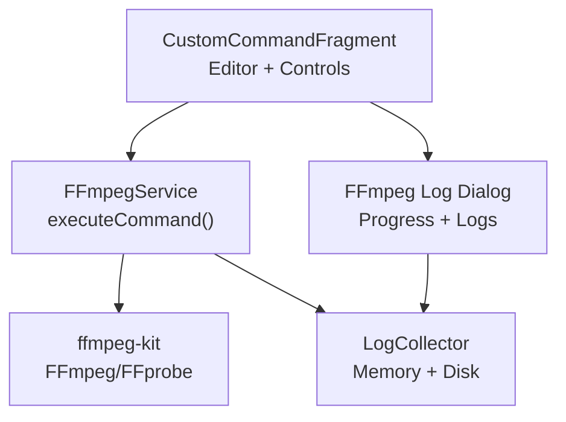
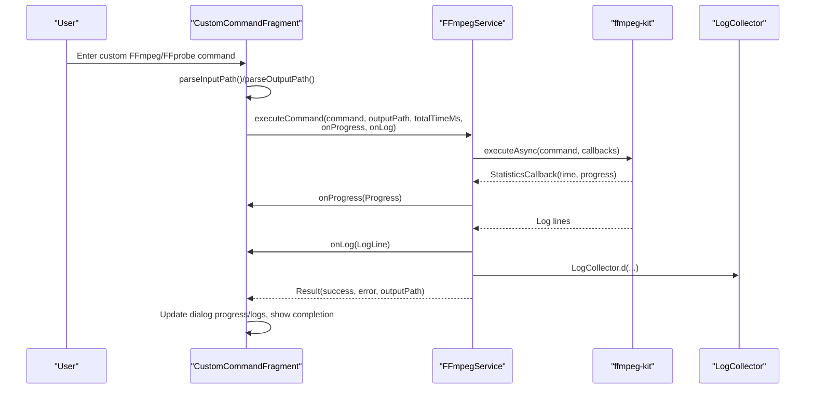
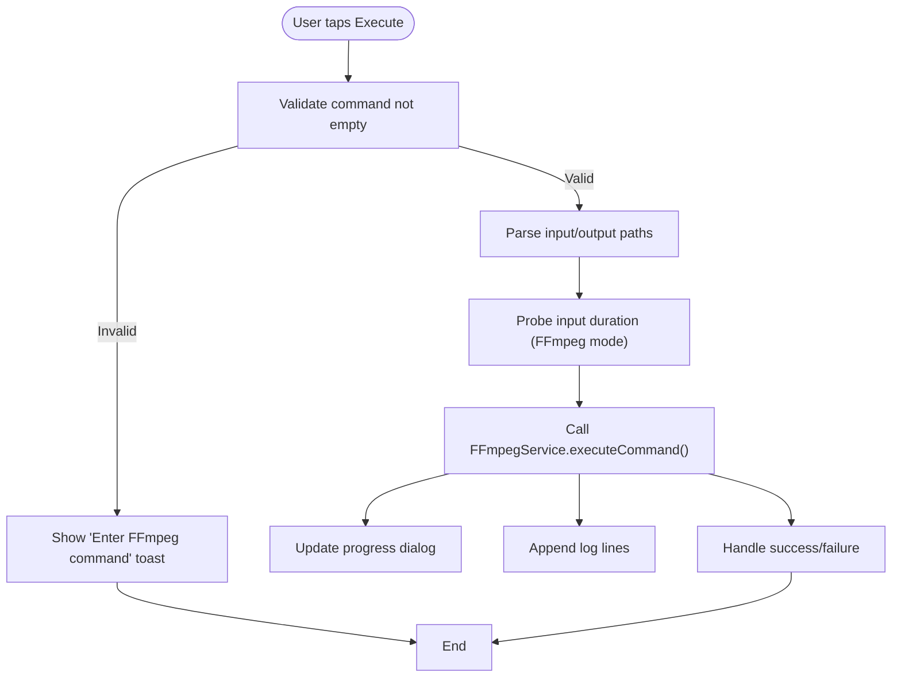
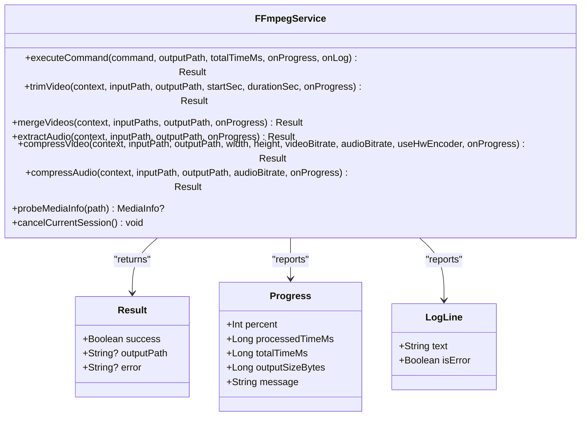
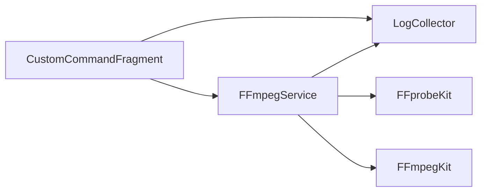

# Custom FFmpeg Commands

<cite>
**Referenced Files in This Document**
- [FFmpegService.kt](file://app/src/main/java/com/pisces312/streamclip/service/FFmpegService.kt)
- [CustomCommandFragment.kt](file://app/src/main/java/com/pisces312/streamclip/fragment/CustomCommandFragment.kt)
- [dialog_ffmpeg_log.xml](file://app/src/main/res/layout/dialog_ffmpeg_log.xml)
- [fragment_custom_command.xml](file://app/src/main/res/layout/fragment_custom_command.xml)
- [strings.xml](file://app/src/main/res/values/strings.xml)
- [LogCollector.kt](file://app/src/main/java/com/pisces312/streamclip/util/LogCollector.kt)
- [CompressConfig.kt](file://app/src/main/java/com/pisces312/streamclip/model/CompressConfig.kt)
- [TaskConfig.kt](file://app/src/main/java/com/pisces312/streamclip/model/TaskConfig.kt)
- [ffmpeg-kit-8.1-double-execute-crash.md](file://docs/ffmpeg-kit-8.1-double-execute-crash.md)
</cite>

## Table of Contents
1. [Introduction](#introduction)
2. [Project Structure](#project-structure)
3. [Core Components](#core-components)
4. [Architecture Overview](#architecture-overview)
5. [Detailed Component Analysis](#detailed-component-analysis)
6. [Dependency Analysis](#dependency-analysis)
7. [Performance Considerations](#performance-considerations)
8. [Troubleshooting Guide](#troubleshooting-guide)
9. [Conclusion](#conclusion)
10. [Appendices](#appendices)

## Introduction
This document explains StreamClip’s custom FFmpeg command execution functionality. It covers how users can build and execute arbitrary FFmpeg commands beyond the app’s predefined operations, including the command builder interface, parameter parsing, safety considerations, and integration with the FFmpegService for execution. It also documents logging, progress tracking, and result interpretation for custom operations, along with practical examples and troubleshooting guidance.

## Project Structure
The custom command feature spans UI, service orchestration, and logging utilities:
- UI: A dedicated fragment hosts the command editor and execution controls.
- Service: A centralized FFmpegService wraps ffmpeg-kit to execute commands, stream logs, and report progress.
- Logging: A robust LogCollector writes logs to memory and disk, enabling post-mortem diagnostics.
- Layouts: XML layouts define the command editor and the real-time log dialog.

**Diagram sources**
- [CustomCommandFragment.kt:28-204](file://app/src/main/java/com/pisces312/streamclip/fragment/CustomCommandFragment.kt#L28-L204)
- [FFmpegService.kt:152-241](file://app/src/main/java/com/pisces312/streamclip/service/FFmpegService.kt#L152-L241)
- [dialog_ffmpeg_log.xml:1-154](file://app/src/main/res/layout/dialog_ffmpeg_log.xml#L1-L154)
- [LogCollector.kt:15-96](file://app/src/main/java/com/pisces312/streamclip/util/LogCollector.kt#L15-L96)

**Section sources**
- [CustomCommandFragment.kt:28-204](file://app/src/main/java/com/pisces312/streamclip/fragment/CustomCommandFragment.kt#L28-L204)
- [FFmpegService.kt:152-241](file://app/src/main/java/com/pisces312/streamclip/service/FFmpegService.kt#L152-L241)
- [dialog_ffmpeg_log.xml:1-154](file://app/src/main/res/layout/dialog_ffmpeg_log.xml#L1-L154)
- [fragment_custom_command.xml:1-81](file://app/src/main/res/layout/fragment_custom_command.xml#L1-L81)
- [strings.xml:273-275](file://app/src/main/res/values/strings.xml#L273-L275)

## Core Components
- CustomCommandFragment: Presents the command editor, parses input/output paths, triggers execution, and displays progress/logs.
- FFmpegService: Executes commands via ffmpeg-kit, handles cancellation, progress estimation, and returns structured results.
- LogCollector: Centralized logging for both runtime diagnostics and crash reporting.
- FFmpeg Log Dialog: Real-time UI for progress percentage, elapsed/remaining time, output size, and live logs.

Key responsibilities:
- Build and validate custom commands (via user input).
- Parse input/output paths from the command string.
- Integrate with FFmpegService for execution and progress callbacks.
- Render progress and logs in a dedicated dialog.

**Section sources**
- [CustomCommandFragment.kt:28-204](file://app/src/main/java/com/pisces312/streamclip/fragment/CustomCommandFragment.kt#L28-L204)
- [FFmpegService.kt:152-241](file://app/src/main/java/com/pisces312/streamclip/service/FFmpegService.kt#L152-L241)
- [LogCollector.kt:15-96](file://app/src/main/java/com/pisces312/streamclip/util/LogCollector.kt#L15-L96)
- [dialog_ffmpeg_log.xml:1-154](file://app/src/main/res/layout/dialog_ffmpeg_log.xml#L1-L154)

## Architecture Overview
The custom command flow integrates UI, service, and logging:

**Diagram sources**
- [CustomCommandFragment.kt:89-204](file://app/src/main/java/com/pisces312/streamclip/fragment/CustomCommandFragment.kt#L89-L204)
- [FFmpegService.kt:152-241](file://app/src/main/java/com/pisces312/streamclip/service/FFmpegService.kt#L152-L241)
- [LogCollector.kt:90-96](file://app/src/main/java/com/pisces312/streamclip/util/LogCollector.kt#L90-L96)

## Detailed Component Analysis

### CustomCommandFragment: Command Editor and Execution Orchestrator
Responsibilities:
- Provides a spinner to select FFmpeg or FFprobe mode.
- Supplies example commands for quick start.
- Parses input and output paths from the command string.
- Launches execution in a coroutine, updates UI progress and logs, and handles cancellation.

Parsing logic:
- Input path extraction uses a regex to match the first occurrence of the input flag and quoted/unquoted path.
- Output path extraction handles both quoted and unquoted trailing arguments.

Execution flow:
- Determines total duration for progress calculation by probing the input file.
- Starts execution via FFmpegService.executeCommand with progress and log callbacks.
- Updates the log dialog with live logs and progress metrics.

Safety and UX:
- Validates non-empty command input.
- Optionally keeps screen on during long-running tasks.
- Supports cancellation that cancels the current ffmpeg-kit session.

**Diagram sources**
- [CustomCommandFragment.kt:89-204](file://app/src/main/java/com/pisces312/streamclip/fragment/CustomCommandFragment.kt#L89-L204)

**Section sources**
- [CustomCommandFragment.kt:28-204](file://app/src/main/java/com/pisces312/streamclip/fragment/CustomCommandFragment.kt#L28-L204)
- [fragment_custom_command.xml:1-81](file://app/src/main/res/layout/fragment_custom_command.xml#L1-L81)
- [strings.xml:273-275](file://app/src/main/res/values/strings.xml#L273-L275)

### FFmpegService: Command Execution Engine
Responsibilities:
- Execute FFmpeg/FFprobe commands asynchronously.
- Provide progress estimation using statistics callbacks.
- Cancel ongoing sessions.
- Probe media info for duration and metadata.

Key APIs:
- executeCommand(command, outputPath, totalTimeMs, onProgress, onLog): Main executor with progress/log hooks.
- trimVideo, mergeVideos, extractAudio, compressVideo, compressAudio: Predefined operations built on top of the same engine.
- probeMediaInfo: JSON-based media probing for format and streams.

Progress calculation:
- Uses StatisticsCallback time to compute percentage against total duration.
- Estimates remaining time based on elapsed time and progress.
- Reports output size by reading the output file length.

Cancellation:
- Tracks current session ID and cancels on demand.

**Diagram sources**
- [FFmpegService.kt:19-241](file://app/src/main/java/com/pisces312/streamclip/service/FFmpegService.kt#L19-L241)

**Section sources**
- [FFmpegService.kt:152-241](file://app/src/main/java/com/pisces312/streamclip/service/FFmpegService.kt#L152-L241)
- [FFmpegService.kt:246-393](file://app/src/main/java/com/pisces312/streamclip/service/FFmpegService.kt#L246-L393)

### LogCollector: Logging and Diagnostics
Responsibilities:
- Writes logs to both memory buffer and external file.
- Supports crash log capture and retrieval.
- Provides helpers to format timestamps and manage log file size.

Usage:
- Used extensively in FFmpegService and CustomCommandFragment for consistent logging.

**Section sources**
- [LogCollector.kt:15-96](file://app/src/main/java/com/pisces312/streamclip/util/LogCollector.kt#L15-L96)
- [FFmpegService.kt:160-181](file://app/src/main/java/com/pisces312/streamclip/service/FFmpegService.kt#L160-L181)

### FFmpeg Log Dialog: Progress and Logs UI
Responsibilities:
- Displays the executed command.
- Shows progress bar, percentage, elapsed/remaining time, and output size.
- Streams live logs with copy-to-clipboard support.
- Handles cancellation and completion states.

**Section sources**
- [dialog_ffmpeg_log.xml:1-154](file://app/src/main/res/layout/dialog_ffmpeg_log.xml#L1-L154)
- [CustomCommandFragment.kt:222-310](file://app/src/main/java/com/pisces312/streamclip/fragment/CustomCommandFragment.kt#L222-L310)

## Dependency Analysis
- CustomCommandFragment depends on FFmpegService for execution and on LogCollector for logging.
- FFmpegService depends on ffmpeg-kit for command execution and on LogCollector for internal logging.
- The log dialog is tightly coupled with FFmpegService’s progress/log callbacks.

**Diagram sources**
- [CustomCommandFragment.kt:18-26](file://app/src/main/java/com/pisces312/streamclip/fragment/CustomCommandFragment.kt#L18-L26)
- [FFmpegService.kt:3-8](file://app/src/main/java/com/pisces312/streamclip/service/FFmpegService.kt#L3-L8)

**Section sources**
- [CustomCommandFragment.kt:18-26](file://app/src/main/java/com/pisces312/streamclip/fragment/CustomCommandFragment.kt#L18-L26)
- [FFmpegService.kt:3-8](file://app/src/main/java/com/pisces312/streamclip/service/FFmpegService.kt#L3-L8)

## Performance Considerations
- Progress estimation relies on the total duration of the input media. For accurate percentage, ensure the input path is correctly parsed and probe succeeds.
- Output size reporting requires the output path to be known; otherwise, it defaults to zero.
- Continuous execution of ffmpeg-kit can trigger native crashes in certain versions. See the crash analysis for mitigation strategies.

[No sources needed since this section provides general guidance]

## Troubleshooting Guide
Common issues and resolutions:
- Command syntax errors:
  - Verify the command string is complete and free of typos.
  - Use the log dialog to inspect FFmpeg output and logs.
- Parameter validation failures:
  - Ensure input and output paths are present and accessible.
  - Confirm the command type selection matches the command content.
- Cancellation:
  - Use the dialog’s cancel button to cancel the current session.
- Native crash with ffmpeg-kit 8.1:
  - Known issue with continuous executeAsync calls causing SIGSEGV.
  - Mitigation: apply the fix described in the crash analysis document.

Practical checks:
- Confirm input path parsing succeeded before execution.
- Confirm output path parsing succeeded for FFmpeg mode.
- Review logs for return codes and error messages.

**Section sources**
- [CustomCommandFragment.kt:89-204](file://app/src/main/java/com/pisces312/streamclip/fragment/CustomCommandFragment.kt#L89-L204)
- [FFmpegService.kt:152-241](file://app/src/main/java/com/pisces312/streamclip/service/FFmpegService.kt#L152-L241)
- [ffmpeg-kit-8.1-double-execute-crash.md:1-174](file://docs/ffmpeg-kit-8.1-double-execute-crash.md#L1-L174)

## Conclusion
StreamClip’s custom FFmpeg command feature provides a flexible way to execute arbitrary FFmpeg/FFprobe commands while maintaining robust progress tracking, logging, and cancellation. The UI integrates seamlessly with FFmpegService, which encapsulates ffmpeg-kit execution and statistics callbacks. Advanced users can leverage this capability to implement complex workflows, while the built-in safety checks and logging help diagnose and resolve issues quickly.

[No sources needed since this section summarizes without analyzing specific files]

## Appendices

### Practical Examples and Workflows
- Basic compression:
  - Example command: adjust encoders, bitrates, and filters as needed.
  - Ensure input path is parsed and output path is valid.
- Lossless trim:
  - Use copy codecs and precise timing to avoid re-encoding.
- Metadata preservation:
  - Use map_metadata flags to preserve tags from source files.
- Concatenation:
  - Use concat demuxer for lossless merging of multiple clips.

[No sources needed since this section provides general guidance]

### Differences Between Predefined Operations and Custom Commands
- Predefined operations:
  - Built-in logic constructs safe, tested commands with consistent parameters.
  - Provide higher-level UI and validation tailored to specific tasks.
- Custom commands:
  - Full flexibility to craft any FFmpeg/FFprobe command.
  - Requires manual validation of inputs, outputs, and parameter correctness.
  - Offers advanced users complete control over codecs, filters, and formats.

**Section sources**
- [FFmpegService.kt:246-393](file://app/src/main/java/com/pisces312/streamclip/service/FFmpegService.kt#L246-L393)
- [CustomCommandFragment.kt:78-82](file://app/src/main/java/com/pisces312/streamclip/fragment/CustomCommandFragment.kt#L78-L82)

### Parameter Configuration for Advanced Users
- Codec-specific options:
  - Encoders: hardware/software variants with different quality/speed trade-offs.
  - Bitrate control: constant or variable bitrate settings.
- Filter chains:
  - Scale, color metadata, rotation adjustments, and frame rate conversions.
- Format-specific parameters:
  - Container flags, metadata mapping, and faststart for streaming.

**Section sources**
- [CompressConfig.kt:32-100](file://app/src/main/java/com/pisces312/streamclip/model/CompressConfig.kt#L32-L100)
- [FFmpegService.kt:355-393](file://app/src/main/java/com/pisces312/streamclip/service/FFmpegService.kt#L355-L393)

### Safety Considerations and Best Practices
- Always validate command inputs before execution.
- Prefer lossless operations when possible (e.g., -c copy).
- Use probeMediaInfo to estimate durations for accurate progress.
- Keep screen on during long operations if configured.
- Use the cancellation mechanism to abort long-running tasks.

**Section sources**
- [CustomCommandFragment.kt:90-103](file://app/src/main/java/com/pisces312/streamclip/fragment/CustomCommandFragment.kt#L90-L103)
- [FFmpegService.kt:246-272](file://app/src/main/java/com/pisces312/streamclip/service/FFmpegService.kt#L246-L272)

### Logging Capabilities, Progress Tracking, and Result Interpretation
- Logging:
  - Live logs are streamed to the dialog and mirrored in LogCollector.
  - Crash logs are captured and stored for later inspection.
- Progress tracking:
  - Percentage computed from processed time vs. total duration.
  - Remaining time estimated using elapsed time and progress.
  - Output size reported when output path is known.
- Result interpretation:
  - Success/failure determined by return code.
  - Error messages populated from FFmpeg output/logs when available.

**Section sources**
- [dialog_ffmpeg_log.xml:1-154](file://app/src/main/res/layout/dialog_ffmpeg_log.xml#L1-L154)
- [FFmpegService.kt:152-241](file://app/src/main/java/com/pisces312/streamclip/service/FFmpegService.kt#L152-L241)
- [LogCollector.kt:15-96](file://app/src/main/java/com/pisces312/streamclip/util/LogCollector.kt#L15-L96)