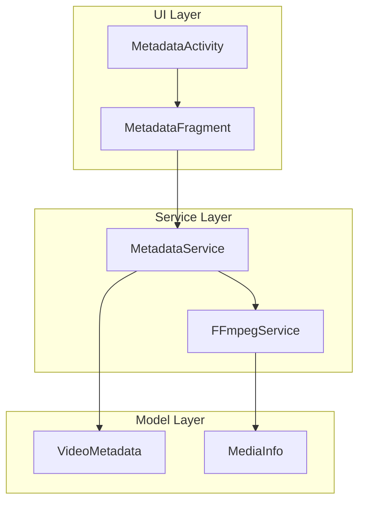
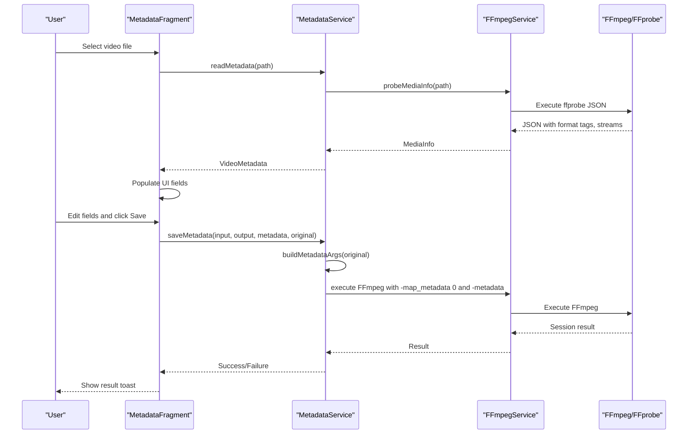
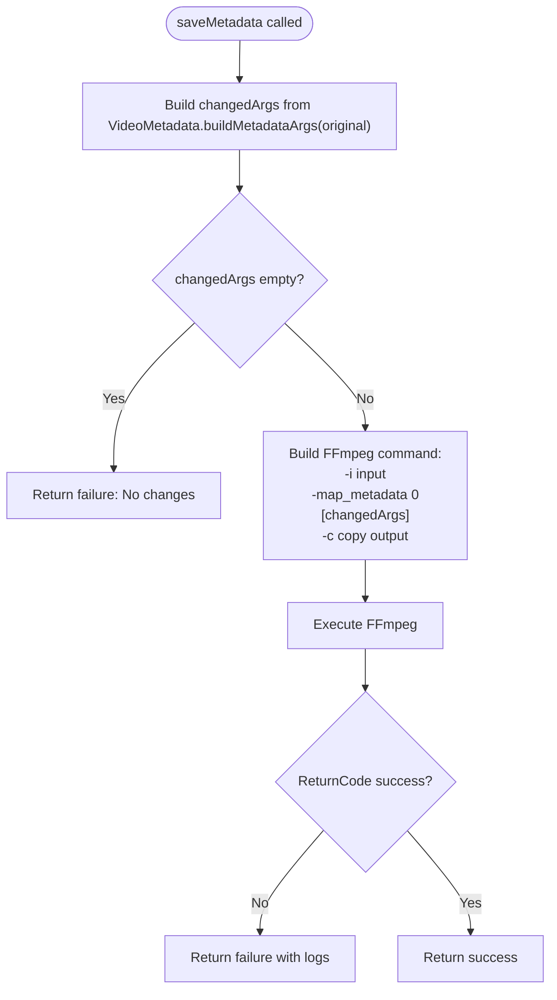
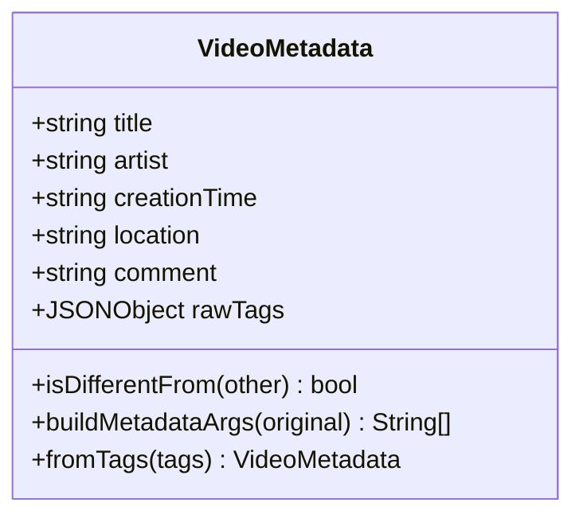
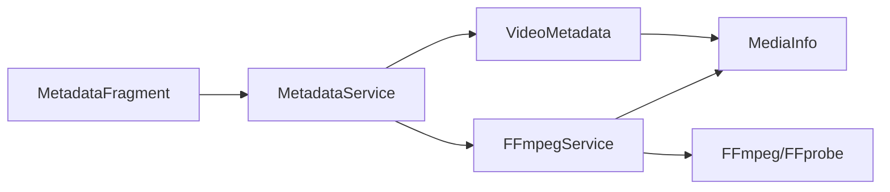

# Metadata Operations

<cite>
**Referenced Files in This Document**
- [MetadataService.kt](file://app/src/main/java/com/pisces312/streamclip/service/MetadataService.kt)
- [VideoMetadata.kt](file://app/src/main/java/com/pisces312/streamclip/model/VideoMetadata.kt)
- [MetadataFragment.kt](file://app/src/main/java/com/pisces312/streamclip/fragment/MetadataFragment.kt)
- [MetadataActivity.kt](file://app/src/main/java/com/pisces312/streamclip/ui/MetadataActivity.kt)
- [FFmpegService.kt](file://app/src/main/java/com/pisces312/streamclip/service/FFmpegService.kt)
- [MediaInfo.kt](file://app/src/main/java/com/pisces312/streamclip/model/MediaInfo.kt)
- [fragment_metadata.xml](file://app/src/main/res/layout/fragment_metadata.xml)
- [strings.xml](file://app/src/main/res/values/strings.xml)
</cite>

## Table of Contents
1. [Introduction](#introduction)
2. [Project Structure](#project-structure)
3. [Core Components](#core-components)
4. [Architecture Overview](#architecture-overview)
5. [Detailed Component Analysis](#detailed-component-analysis)
6. [Dependency Analysis](#dependency-analysis)
7. [Performance Considerations](#performance-considerations)
8. [Troubleshooting Guide](#troubleshooting-guide)
9. [Conclusion](#conclusion)

## Introduction
This document explains StreamClip's metadata manipulation operations for video files. It covers how the application reads, modifies, and preserves metadata using FFmpeg's metadata handling capabilities. The focus areas include supported metadata formats, tag management, GPS data preservation, and the complete workflow for extracting duration, codec details, resolution, and custom tags. It also documents parameter configuration for metadata operations, batch processing considerations, and practical examples for extraction, modification, and preservation during video processing.

## Project Structure
The metadata feature spans UI, service, and model layers:
- UI Layer: MetadataFragment and MetadataActivity manage user interaction and lifecycle
- Service Layer: MetadataService orchestrates FFmpeg operations; FFmpegService provides probing and command execution
- Model Layer: VideoMetadata and MediaInfo represent metadata structures and parsing results

**Diagram sources**
- [MetadataActivity.kt:12-31](file://app/src/main/java/com/pisces312/streamclip/ui/MetadataActivity.kt#L12-L31)
- [MetadataFragment.kt:26-67](file://app/src/main/java/com/pisces312/streamclip/fragment/MetadataFragment.kt#L26-L67)
- [MetadataService.kt:10-92](file://app/src/main/java/com/pisces312/streamclip/service/MetadataService.kt#L10-L92)
- [FFmpegService.kt:19-420](file://app/src/main/java/com/pisces312/streamclip/service/FFmpegService.kt#L19-L420)
- [VideoMetadata.kt:5-56](file://app/src/main/java/com/pisces312/streamclip/model/VideoMetadata.kt#L5-L56)
- [MediaInfo.kt:5-165](file://app/src/main/java/com/pisces312/streamclip/model/MediaInfo.kt#L5-L165)

**Section sources**
- [MetadataActivity.kt:12-31](file://app/src/main/java/com/pisces312/streamclip/ui/MetadataActivity.kt#L12-L31)
- [MetadataFragment.kt:26-67](file://app/src/main/java/com/pisces312/streamclip/fragment/MetadataFragment.kt#L26-L67)
- [MetadataService.kt:10-92](file://app/src/main/java/com/pisces312/streamclip/service/MetadataService.kt#L10-L92)
- [FFmpegService.kt:19-420](file://app/src/main/java/com/pisces312/streamclip/service/FFmpegService.kt#L19-L420)
- [VideoMetadata.kt:5-56](file://app/src/main/java/com/pisces312/streamclip/model/VideoMetadata.kt#L5-L56)
- [MediaInfo.kt:5-165](file://app/src/main/java/com/pisces312/streamclip/model/MediaInfo.kt#L5-L165)

## Core Components
- MetadataService: Reads metadata via FFmpeg probing and writes modified metadata using FFmpeg commands with `-map_metadata` and `-metadata` flags
- VideoMetadata: Encapsulates editable metadata fields (title, artist, creation_time, location, comment) and generates FFmpeg arguments for changes
- FFmpegService: Provides probing (ffprobe) and command execution (ffmpeg) with progress callbacks and cancellation support
- MediaInfo: Parses ffprobe JSON output into structured data including format tags, duration, video/audio streams, and convenience accessors
- MetadataFragment: UI for selecting video, displaying editable fields, and saving changes

Key capabilities:
- Extraction: Uses ffprobe JSON to gather duration, codec details, resolution, and format tags
- Modification: Builds `-metadata` arguments only for changed fields to minimize overhead
- Preservation: Preserves existing metadata using `-map_metadata 0` and applies only requested changes

**Section sources**
- [MetadataService.kt:15-67](file://app/src/main/java/com/pisces312/streamclip/service/MetadataService.kt#L15-L67)
- [VideoMetadata.kt:13-41](file://app/src/main/java/com/pisces312/streamclip/model/VideoMetadata.kt#L13-L41)
- [FFmpegService.kt:56-147](file://app/src/main/java/com/pisces312/streamclip/service/FFmpegService.kt#L56-L147)
- [MediaInfo.kt:142-144](file://app/src/main/java/com/pisces312/streamclip/model/MediaInfo.kt#L142-L144)
- [MetadataFragment.kt:85-114](file://app/src/main/java/com/pisces312/streamclip/fragment/MetadataFragment.kt#L85-L114)

## Architecture Overview
The metadata workflow integrates UI, service, and FFmpeg operations:

**Diagram sources**
- [MetadataFragment.kt:85-114](file://app/src/main/java/com/pisces312/streamclip/fragment/MetadataFragment.kt#L85-L114)
- [MetadataService.kt:15-67](file://app/src/main/java/com/pisces312/streamclip/service/MetadataService.kt#L15-L67)
- [FFmpegService.kt:56-147](file://app/src/main/java/com/pisces312/streamclip/service/FFmpegService.kt#L56-L147)

## Detailed Component Analysis

### MetadataService: Read and Write Operations
Responsibilities:
- Read metadata: Executes ffprobe JSON, parses into MediaInfo, converts to VideoMetadata
- Write metadata: Generates FFmpeg command with `-map_metadata 0` to preserve existing tags, then adds only changed `-metadata` entries, and copies streams with `-c copy`

Implementation highlights:
- readMetadata: Uses FFmpegService.probeMediaInfo and converts to VideoMetadata
- saveMetadata: Computes changedArgs via VideoMetadata.buildMetadataArgs; constructs command with `-map_metadata 0` and `-metadata`; executes with FFmpegKit
- generateOutputPath: Creates output filename with `_meta` suffix before extension

**Diagram sources**
- [MetadataService.kt:34-67](file://app/src/main/java/com/pisces312/streamclip/service/MetadataService.kt#L34-L67)
- [VideoMetadata.kt:22-41](file://app/src/main/java/com/pisces312/streamclip/model/VideoMetadata.kt#L22-L41)

**Section sources**
- [MetadataService.kt:15-80](file://app/src/main/java/com/pisces312/streamclip/service/MetadataService.kt#L15-L80)

### VideoMetadata: Tag Management and Argument Building
Responsibilities:
- Holds editable fields: title, artist, creation_time, location, comment, and rawTags
- isDifferentFrom: Compares two VideoMetadata instances to detect changes
- buildMetadataArgs: Produces FFmpeg `-metadata` arguments only for differing fields

Supported tags and formats:
- Title, artist, comment: Free-form text
- Creation time: Stored as `creation_time` tag; format expected as ISO-like string
- Location: Stored as `location` tag; format expected as `+lat+lon/` (GPS coordinate pair)
- Raw tags: JSONObject containing all original format tags for round-trip preservation

**Diagram sources**
- [VideoMetadata.kt:5-56](file://app/src/main/java/com/pisces312/streamclip/model/VideoMetadata.kt#L5-L56)

**Section sources**
- [VideoMetadata.kt:13-54](file://app/src/main/java/com/pisces312/streamclip/model/VideoMetadata.kt#L13-L54)

### FFmpegService: Probing and Command Execution
Responsibilities:
- probeMediaInfo: Executes ffprobe JSON with format, streams, and side_data; parses duration, codec details, resolution, and format tags
- executeCommand: Runs FFmpeg with optional progress callback and statistics; supports cancellation
- Utility methods: trimVideo, mergeVideos, extractAudio, compressVideo, compressAudio

Important for metadata:
- probeMediaInfo populates MediaInfo.formatTags, enabling VideoMetadata.fromTags conversion
- Commands consistently use `-map_metadata 0` to preserve existing tags during operations

**Section sources**
- [FFmpegService.kt:56-147](file://app/src/main/java/com/pisces312/streamclip/service/FFmpegService.kt#L56-L147)
- [FFmpegService.kt:246-272](file://app/src/main/java/com/pisces312/streamclip/service/FFmpegService.kt#L246-L272)
- [FFmpegService.kt:297-334](file://app/src/main/java/com/pisces312/streamclip/service/FFmpegService.kt#L297-L334)

### MediaInfo: Metadata Parsing and Accessors
Responsibilities:
- Parses ffprobe JSON into structured data
- Exposes format tags (including creation_time and location variants), duration, video/audio streams, and convenience accessors
- toVideoMetadata: Converts parsed format tags into VideoMetadata for editing

Key fields:
- formatTags: JSONObject containing all format-level tags
- creationTime: Convenience accessor for `creation_time`
- location: Convenience accessor preferring `location` then `location-eng`

**Section sources**
- [MediaInfo.kt:32-36](file://app/src/main/java/com/pisces312/streamclip/model/MediaInfo.kt#L32-L36)
- [MediaInfo.kt:142-144](file://app/src/main/java/com/pisces312/streamclip/model/MediaInfo.kt#L142-L144)

### MetadataFragment: UI Workflow and Validation
Responsibilities:
- File selection and path resolution
- Loading metadata into EditText fields (title, artist, creation_time, location, comment)
- Real-time change detection and save button enablement
- Save operation orchestration and result feedback
- Progress indication and screen-on setting based on preferences

UI elements:
- EditText fields for each editable metadata field
- Reset and Save buttons with dynamic enablement
- Progress bar and status text during operations

**Section sources**
- [MetadataFragment.kt:85-114](file://app/src/main/java/com/pisces312/streamclip/fragment/MetadataFragment.kt#L85-L114)
- [MetadataFragment.kt:120-158](file://app/src/main/java/com/pisces312/streamclip/fragment/MetadataFragment.kt#L120-L158)
- [MetadataFragment.kt:164-209](file://app/src/main/java/com/pisces312/streamclip/fragment/MetadataFragment.kt#L164-L209)
- [fragment_metadata.xml:66-176](file://app/src/main/res/layout/fragment_metadata.xml#L66-L176)
- [strings.xml:194-212](file://app/src/main/res/values/strings.xml#L194-L212)

## Dependency Analysis
Component relationships and data flow:

**Diagram sources**
- [MetadataFragment.kt:96-113](file://app/src/main/java/com/pisces312/streamclip/fragment/MetadataFragment.kt#L96-L113)
- [MetadataService.kt:15-28](file://app/src/main/java/com/pisces312/streamclip/service/MetadataService.kt#L15-L28)
- [FFmpegService.kt:56-147](file://app/src/main/java/com/pisces312/streamclip/service/FFmpegService.kt#L56-L147)
- [VideoMetadata.kt:44-54](file://app/src/main/java/com/pisces312/streamclip/model/VideoMetadata.kt#L44-L54)
- [MediaInfo.kt:142-144](file://app/src/main/java/com/pisces312/streamclip/model/MediaInfo.kt#L142-L144)

**Section sources**
- [MetadataFragment.kt:96-113](file://app/src/main/java/com/pisces312/streamclip/fragment/MetadataFragment.kt#L96-L113)
- [MetadataService.kt:15-28](file://app/src/main/java/com/pisces312/streamclip/service/MetadataService.kt#L15-L28)
- [FFmpegService.kt:56-147](file://app/src/main/java/com/pisces312/streamclip/service/FFmpegService.kt#L56-L147)
- [VideoMetadata.kt:44-54](file://app/src/main/java/com/pisces312/streamclip/model/VideoMetadata.kt#L44-L54)
- [MediaInfo.kt:142-144](file://app/src/main/java/com/pisces312/streamclip/model/MediaInfo.kt#L142-L144)

## Performance Considerations
- Lossless modification: Using `-c copy` ensures no re-encoding, minimizing processing time and preserving quality
- Incremental changes: buildMetadataArgs only emits `-metadata` for changed fields, reducing command length and avoiding unnecessary tag updates
- Progress tracking: FFmpegService provides progress callbacks with processed time, total time, and output size for long-running operations
- Cancellation: Current session can be cancelled mid-execution to free resources

Practical tips:
- Prefer `-map_metadata 0` to preserve existing tags and avoid redundant write operations
- Batch operations: For multiple files, process sequentially or queue tasks to leverage device resources efficiently
- Format compatibility: Some containers may not expose `bit_rate` in ffprobe CSV; rely on ffprobe JSON parsing for robustness

[No sources needed since this section provides general guidance]

## Troubleshooting Guide
Common issues and resolutions:
- Read metadata failures: Occur when ffprobe fails or returns empty output; MetadataService wraps errors and returns failure
- Save metadata failures: Triggered when FFmpeg returns non-success return code; logs include all FFmpeg output for diagnosis
- No changes detected: If current metadata equals original, save is rejected; ensure at least one field is modified
- GPS location format: Ensure location follows `+lat+lon/` format; invalid formats may cause parsing or writing issues
- Format-specific tags: Some containers may lack certain tags; rely on MediaInfo.formatTags for availability checks
- Progress validation: Use progress callbacks to monitor operation status; verify output file size increases during processing

Validation steps:
- Confirm ffprobe JSON parsing succeeds and formatTags are populated
- Verify buildMetadataArgs produces non-empty argument list for actual changes
- Check FFmpeg return code and session logs for errors
- Validate output file exists and contains expected metadata using external tools

**Section sources**
- [MetadataService.kt:15-28](file://app/src/main/java/com/pisces312/streamclip/service/MetadataService.kt#L15-L28)
- [MetadataService.kt:55-66](file://app/src/main/java/com/pisces312/streamclip/service/MetadataService.kt#L55-L66)
- [FFmpegService.kt:152-241](file://app/src/main/java/com/pisces312/streamclip/service/FFmpegService.kt#L152-L241)

## Conclusion
StreamClip's metadata operations provide a robust, lossless workflow for reading, modifying, and preserving video metadata. By leveraging FFmpeg's `-map_metadata` and `-metadata` flags, the system ensures existing tags remain intact while applying only requested changes. The modular design separates UI, service, and model concerns, enabling maintainable enhancements and reliable progress tracking. Following the outlined best practices and troubleshooting steps will help achieve predictable results across diverse video formats and use cases.