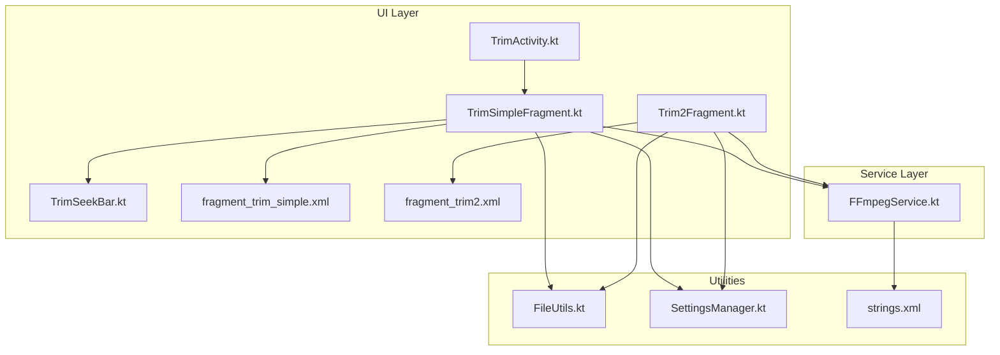
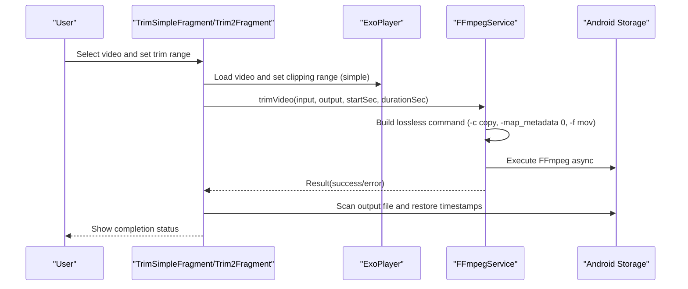
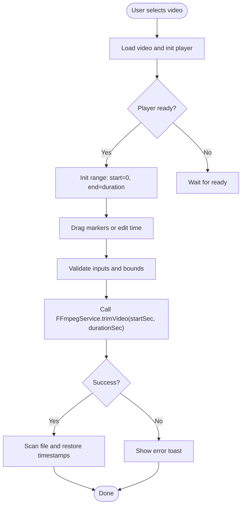
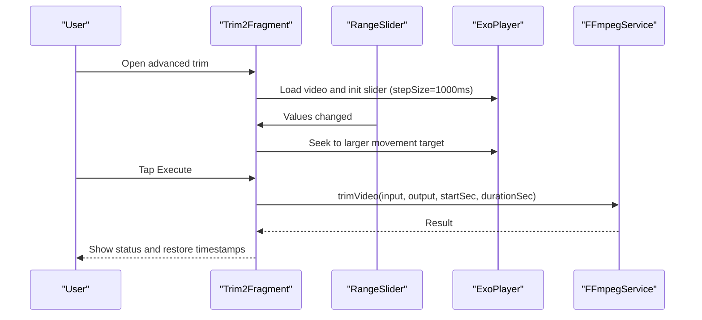
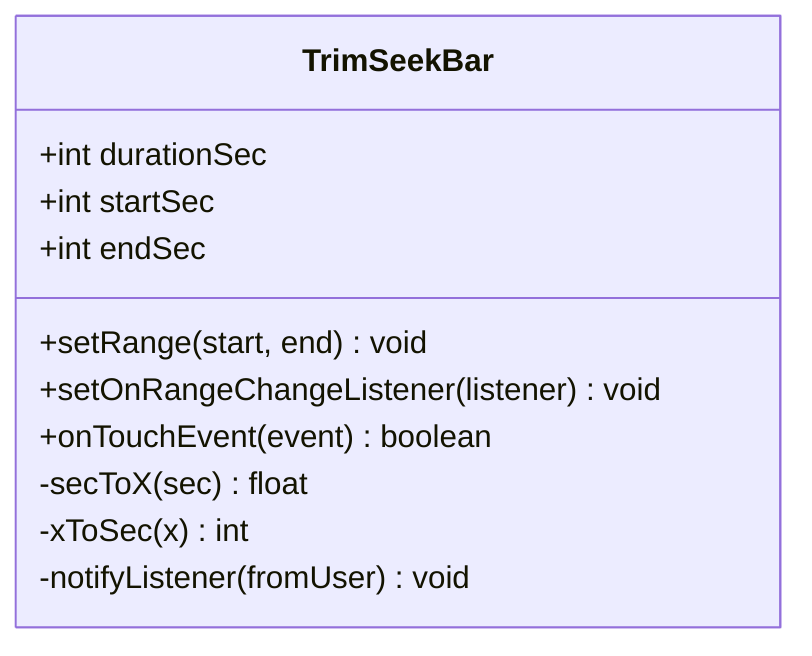
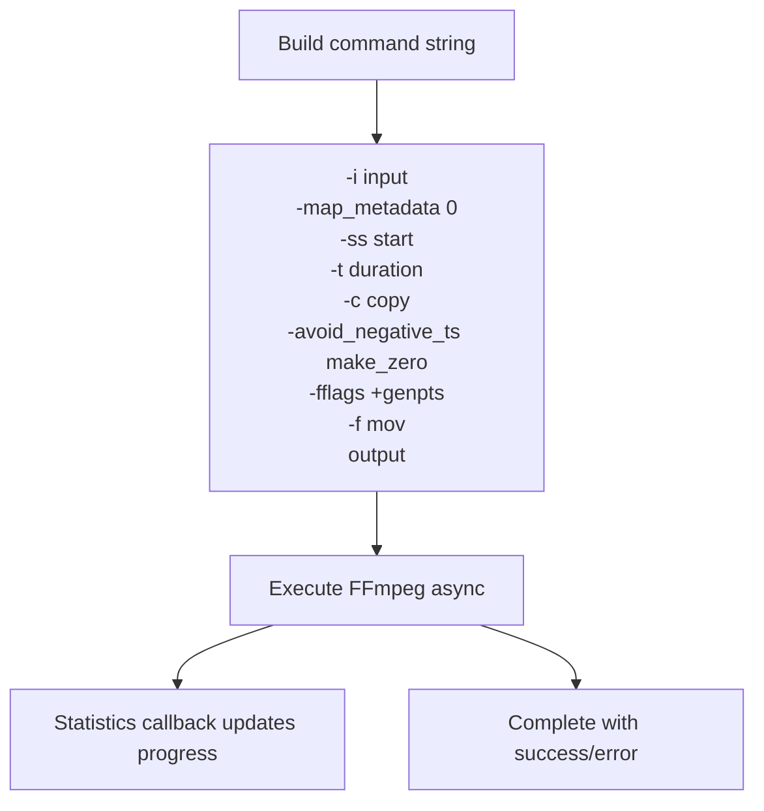
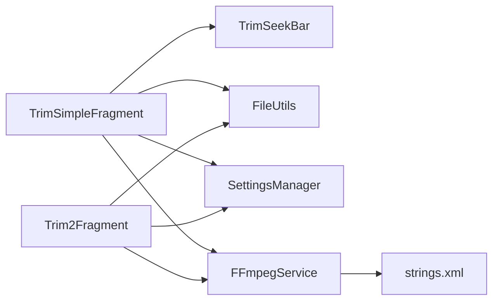

# Trimming Operations

<cite>
**Referenced Files in This Document**
- [TrimSimpleFragment.kt](file://app/src/main/java/com/pisces312/streamclip/fragment/TrimSimpleFragment.kt)
- [Trim2Fragment.kt](file://app/src/main/java/com/pisces312/streamclip/fragment/Trim2Fragment.kt)
- [TrimActivity.kt](file://app/src/main/java/com/pisces312/streamclip/ui/TrimActivity.kt)
- [TrimSeekBar.kt](file://app/src/main/java/com/pisces312/streamclip/ui/TrimSeekBar.kt)
- [FFmpegService.kt](file://app/src/main/java/com/pisces312/streamclip/service/FFmpegService.kt)
- [FileUtils.kt](file://app/src/main/java/com/pisces312/streamclip/util/FileUtils.kt)
- [SettingsManager.kt](file://app/src/main/java/com/pisces312/streamclip/util/SettingsManager.kt)
- [fragment_trim_simple.xml](file://app/src/main/res/layout/fragment_trim_simple.xml)
- [fragment_trim2.xml](file://app/src/main/res/layout/fragment_trim2.xml)
- [strings.xml](file://app/src/main/res/values/strings.xml)
- [README.md](file://README.md)
</cite>

## Table of Contents
1. [Introduction](#introduction)
2. [Project Structure](#project-structure)
3. [Core Components](#core-components)
4. [Architecture Overview](#architecture-overview)
5. [Detailed Component Analysis](#detailed-component-analysis)
6. [Dependency Analysis](#dependency-analysis)
7. [Performance Considerations](#performance-considerations)
8. [Troubleshooting Guide](#troubleshooting-guide)
9. [Conclusion](#conclusion)

## Introduction
This document explains StreamClip’s lossless video trimming implementation. It covers:
- How lossless trimming works using stream copying without re-encoding
- Two trimming modes: simple trim with time input and advanced trim with a dual seek bar
- FFmpeg command construction, parameter validation, and time format handling
- Practical configuration of start/end times, edge-case handling, and quality preservation
- Differences between lossless stream copying and frame-accurate cutting
- Memory management and performance characteristics
- Common issues and troubleshooting steps
- Integration between UI fragments and FFmpegService for progress tracking and results

## Project Structure
The trimming feature spans UI fragments, a media player, a custom seek bar, and a service that executes FFmpeg commands.

**Diagram sources**
- [TrimSimpleFragment.kt:1-387](file://app/src/main/java/com/pisces312/streamclip/fragment/TrimSimpleFragment.kt#L1-L387)
- [Trim2Fragment.kt:1-286](file://app/src/main/java/com/pisces312/streamclip/fragment/Trim2Fragment.kt#L1-L286)
- [TrimActivity.kt:1-37](file://app/src/main/java/com/pisces312/streamclip/ui/TrimActivity.kt#L1-L37)
- [TrimSeekBar.kt:1-238](file://app/src/main/java/com/pisces312/streamclip/ui/TrimSeekBar.kt#L1-L238)
- [FFmpegService.kt:1-420](file://app/src/main/java/com/pisces312/streamclip/service/FFmpegService.kt#L1-L420)
- [FileUtils.kt:1-362](file://app/src/main/java/com/pisces312/streamclip/util/FileUtils.kt#L1-L362)
- [SettingsManager.kt:1-208](file://app/src/main/java/com/pisces312/streamclip/util/SettingsManager.kt#L1-L208)
- [fragment_trim_simple.xml:1-155](file://app/src/main/res/layout/fragment_trim_simple.xml#L1-L155)
- [fragment_trim2.xml:1-123](file://app/src/main/res/layout/fragment_trim2.xml#L1-L123)
- [strings.xml:1-321](file://app/src/main/res/values/strings.xml#L1-L321)

**Section sources**
- [TrimSimpleFragment.kt:1-387](file://app/src/main/java/com/pisces312/streamclip/fragment/TrimSimpleFragment.kt#L1-L387)
- [Trim2Fragment.kt:1-286](file://app/src/main/java/com/pisces312/streamclip/fragment/Trim2Fragment.kt#L1-L286)
- [FFmpegService.kt:243-272](file://app/src/main/java/com/pisces312/streamclip/service/FFmpegService.kt#L243-L272)

## Core Components
- TrimSimpleFragment: Provides a simple UI with a custom seek bar and manual time input for trimming. It validates time inputs and triggers lossless trimming via FFmpegService.
- Trim2Fragment: Offers an advanced UI with a RangeSlider for precise selection and real-time preview while dragging.
- TrimActivity: Hosts TrimSimpleFragment and handles external intents to open videos directly for trimming.
- TrimSeekBar: A custom view that renders two draggable markers and notifies range changes.
- FFmpegService: Builds and executes FFmpeg commands for lossless trimming using stream copying, with optional progress callbacks.
- FileUtils: Resolves URIs to real paths, copies content to cache when needed, and manages file timestamps.
- SettingsManager: Controls output directory, filename timestamping, and keep-screen-on behavior.

Key trimming command highlights:
- Uses stream copy to avoid re-encoding
- Applies metadata preservation flags
- Uses container-specific flags for stability

**Section sources**
- [TrimSimpleFragment.kt:288-354](file://app/src/main/java/com/pisces312/streamclip/fragment/TrimSimpleFragment.kt#L288-L354)
- [Trim2Fragment.kt:178-251](file://app/src/main/java/com/pisces312/streamclip/fragment/Trim2Fragment.kt#L178-L251)
- [FFmpegService.kt:246-272](file://app/src/main/java/com/pisces312/streamclip/service/FFmpegService.kt#L246-L272)
- [FileUtils.kt:30-118](file://app/src/main/java/com/pisces312/streamclip/util/FileUtils.kt#L30-L118)
- [SettingsManager.kt:67-114](file://app/src/main/java/com/pisces312/streamclip/util/SettingsManager.kt#L67-L114)

## Architecture Overview
The trimming pipeline integrates UI controls, media playback, and FFmpeg execution.

**Diagram sources**
- [TrimSimpleFragment.kt:224-286](file://app/src/main/java/com/pisces312/streamclip/fragment/TrimSimpleFragment.kt#L224-L286)
- [Trim2Fragment.kt:142-176](file://app/src/main/java/com/pisces312/streamclip/fragment/Trim2Fragment.kt#L142-L176)
- [FFmpegService.kt:246-272](file://app/src/main/java/com/pisces312/streamclip/service/FFmpegService.kt#L246-L272)

## Detailed Component Analysis

### Simple Trim Mode (TrimSimpleFragment)
- Loads a video via ExoPlayer and sets a clipping configuration for playback preview.
- Provides a custom TrimSeekBar to drag start and end markers; updates UI and seeks the player accordingly.
- Supports manual time input in MM:SS format with validation and bounds checking.
- Executes lossless trimming by calling FFmpegService.trimVideo with start seconds and duration seconds.
- Validates minimum duration and handles file path resolution and output directory selection.

**Diagram sources**
- [TrimSimpleFragment.kt:224-286](file://app/src/main/java/com/pisces312/streamclip/fragment/TrimSimpleFragment.kt#L224-L286)
- [TrimSimpleFragment.kt:288-354](file://app/src/main/java/com/pisces312/streamclip/fragment/TrimSimpleFragment.kt#L288-L354)

**Section sources**
- [TrimSimpleFragment.kt:89-123](file://app/src/main/java/com/pisces312/streamclip/fragment/TrimSimpleFragment.kt#L89-L123)
- [TrimSimpleFragment.kt:147-184](file://app/src/main/java/com/pisces312/streamclip/fragment/TrimSimpleFragment.kt#L147-L184)
- [TrimSimpleFragment.kt:224-286](file://app/src/main/java/com/pisces312/streamclip/fragment/TrimSimpleFragment.kt#L224-L286)
- [TrimSimpleFragment.kt:288-354](file://app/src/main/java/com/pisces312/streamclip/fragment/TrimSimpleFragment.kt#L288-L354)
- [fragment_trim_simple.xml:1-155](file://app/src/main/res/layout/fragment_trim_simple.xml#L1-L155)

### Advanced Trim Mode (Trim2Fragment)
- Uses a RangeSlider to select start and end times with second-level precision.
- Real-time preview: seeks the player to the handler that moved the most to keep preview synced.
- Enforces a minimum 1-second duration and executes lossless trimming via FFmpegService.
- Displays output status and restores original file timestamps after completion.

**Diagram sources**
- [Trim2Fragment.kt:67-119](file://app/src/main/java/com/pisces312/streamclip/fragment/Trim2Fragment.kt#L67-L119)
- [Trim2Fragment.kt:142-176](file://app/src/main/java/com/pisces312/streamclip/fragment/Trim2Fragment.kt#L142-L176)
- [Trim2Fragment.kt:178-251](file://app/src/main/java/com/pisces312/streamclip/fragment/Trim2Fragment.kt#L178-L251)

**Section sources**
- [Trim2Fragment.kt:67-119](file://app/src/main/java/com/pisces312/streamclip/fragment/Trim2Fragment.kt#L67-L119)
- [Trim2Fragment.kt:142-176](file://app/src/main/java/com/pisces312/streamclip/fragment/Trim2Fragment.kt#L142-L176)
- [Trim2Fragment.kt:178-251](file://app/src/main/java/com/pisces312/streamclip/fragment/Trim2Fragment.kt#L178-L251)
- [fragment_trim2.xml:1-123](file://app/src/main/res/layout/fragment_trim2.xml#L1-L123)

### Custom Seek Bar (TrimSeekBar)
- Renders a track with two draggable markers representing start and end times.
- Converts between seconds and X positions, enforces bounds, and notifies listeners on change.
- Supports click-to-seek and drag-to-adjust behaviors.

**Diagram sources**
- [TrimSeekBar.kt:20-238](file://app/src/main/java/com/pisces312/streamclip/ui/TrimSeekBar.kt#L20-L238)

**Section sources**
- [TrimSeekBar.kt:20-238](file://app/src/main/java/com/pisces312/streamclip/ui/TrimSeekBar.kt#L20-L238)

### FFmpegService: Lossless Trimming Command
- Constructs a lossless trimming command using stream copy and metadata preservation.
- Uses container-specific flags to improve stability and compatibility.
- Executes asynchronously and optionally reports progress via statistics callbacks.

Key command elements:
- Input path and metadata mapping
- Start offset and duration
- Stream copy for all streams
- Negative timestamp handling and presentation timestamp generation
- Container-specific flags for MOV output

**Diagram sources**
- [FFmpegService.kt:256-272](file://app/src/main/java/com/pisces312/streamclip/service/FFmpegService.kt#L256-L272)
- [FFmpegService.kt:152-241](file://app/src/main/java/com/pisces312/streamclip/service/FFmpegService.kt#L152-L241)

**Section sources**
- [FFmpegService.kt:246-272](file://app/src/main/java/com/pisces312/streamclip/service/FFmpegService.kt#L246-L272)
- [FFmpegService.kt:152-241](file://app/src/main/java/com/pisces312/streamclip/service/FFmpegService.kt#L152-L241)

### UI Integration and External Launch
- TrimActivity hosts TrimSimpleFragment and forwards external video URIs for direct trimming.
- Simple trim UI includes a custom seek bar, time buttons, and a progress indicator.

**Section sources**
- [TrimActivity.kt:12-31](file://app/src/main/java/com/pisces312/streamclip/ui/TrimActivity.kt#L12-L31)
- [fragment_trim_simple.xml:1-155](file://app/src/main/res/layout/fragment_trim_simple.xml#L1-L155)

## Dependency Analysis
- UI fragments depend on ExoPlayer for playback and clipping configuration.
- Both fragments rely on FileUtils to resolve URIs to real paths and on SettingsManager for output configuration.
- FFmpegService encapsulates command building and execution, returning structured results and optional progress.
- Strings resource provides localized messages for user feedback.

**Diagram sources**
- [TrimSimpleFragment.kt:1-387](file://app/src/main/java/com/pisces312/streamclip/fragment/TrimSimpleFragment.kt#L1-L387)
- [Trim2Fragment.kt:1-286](file://app/src/main/java/com/pisces312/streamclip/fragment/Trim2Fragment.kt#L1-L286)
- [FFmpegService.kt:1-420](file://app/src/main/java/com/pisces312/streamclip/service/FFmpegService.kt#L1-L420)
- [strings.xml:1-321](file://app/src/main/res/values/strings.xml#L1-L321)

**Section sources**
- [TrimSimpleFragment.kt:1-387](file://app/src/main/java/com/pisces312/streamclip/fragment/TrimSimpleFragment.kt#L1-L387)
- [Trim2Fragment.kt:1-286](file://app/src/main/java/com/pisces312/streamclip/fragment/Trim2Fragment.kt#L1-L286)
- [FFmpegService.kt:1-420](file://app/src/main/java/com/pisces312/streamclip/service/FFmpegService.kt#L1-L420)

## Performance Considerations
- Lossless trimming is near-instant because it performs stream copying without re-encoding.
- Playback preview uses ExoPlayer with clipping configuration to minimize overhead.
- Progress reporting is disabled for lossless trimming in advanced mode, reflecting near-zero processing time.
- Memory usage remains low as trimming does not decode/encode frames.

Practical tips:
- Prefer second-level precision for trimming to avoid preview desync and unnecessary seeking.
- Keep screen on during long operations if enabled in settings.
- Use direct read paths when possible to avoid extra copying.

**Section sources**
- [Trim2Fragment.kt:221-228](file://app/src/main/java/com/pisces312/streamclip/fragment/Trim2Fragment.kt#L221-L228)
- [SettingsManager.kt:44-50](file://app/src/main/java/com/pisces312/streamclip/util/SettingsManager.kt#L44-L50)
- [README.md:10-32](file://README.md#L10-L32)

## Troubleshooting Guide
Common issues and resolutions:
- Time format parsing
  - Simple trim accepts MM:SS or seconds-only input. Validation ensures values are within duration bounds and at least 1 second long.
  - Advanced trim uses second-level precision; avoid millisecond-level seeking to prevent preview desync.
- Minimum duration enforcement
  - Both modes enforce a minimum 1-second trim length.
- File path resolution
  - If a URI cannot be resolved to a direct path, content is copied to cache. Output directory selection falls back to app’s public movies directory when needed.
- Unknown or container-specific errors
  - Lossless trimming uses MOV container flags to improve compatibility. If trimming fails, review FFmpeg logs and confirm container support.
- Metadata preservation
  - The command includes metadata mapping flags to preserve GPS and other metadata. Verify that the output retains expected tags.

Operational checks:
- Confirm the input file is accessible and readable.
- Ensure sufficient storage space for the output file.
- Review localized error messages for actionable hints.

**Section sources**
- [TrimSimpleFragment.kt:147-184](file://app/src/main/java/com/pisces312/streamclip/fragment/TrimSimpleFragment.kt#L147-L184)
- [Trim2Fragment.kt:188-191](file://app/src/main/java/com/pisces312/streamclip/fragment/Trim2Fragment.kt#L188-L191)
- [FileUtils.kt:30-118](file://app/src/main/java/com/pisces312/streamclip/util/FileUtils.kt#L30-L118)
- [FFmpegService.kt:256-272](file://app/src/main/java/com/pisces312/streamclip/service/FFmpegService.kt#L256-L272)
- [strings.xml:143-145](file://app/src/main/res/values/strings.xml#L143-L145)

## Conclusion
StreamClip’s trimming implementation achieves true lossless cuts by leveraging FFmpeg’s stream copy mode. The simple and advanced UI modes provide flexible, precise control over trim ranges, backed by robust path resolution, metadata preservation, and minimal runtime overhead. By following the guidelines here, users can reliably trim videos without quality loss and with predictable performance.