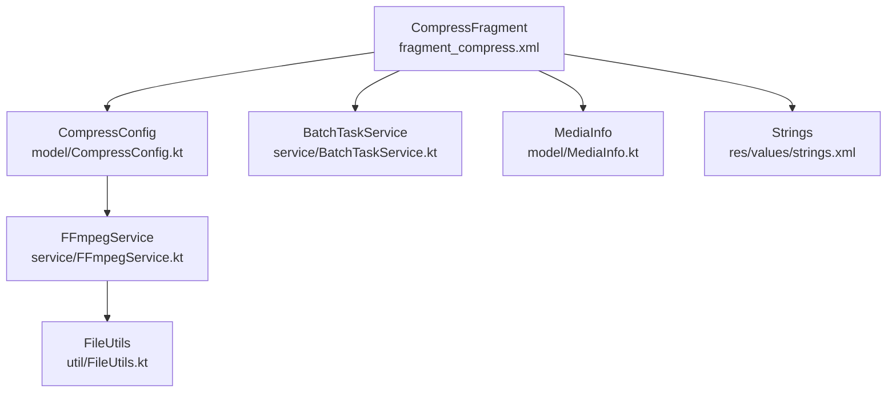
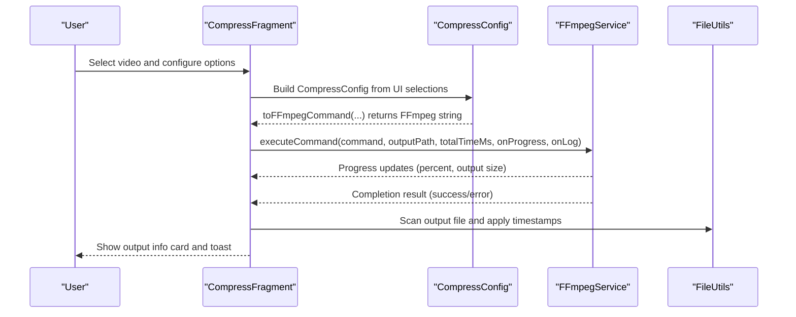
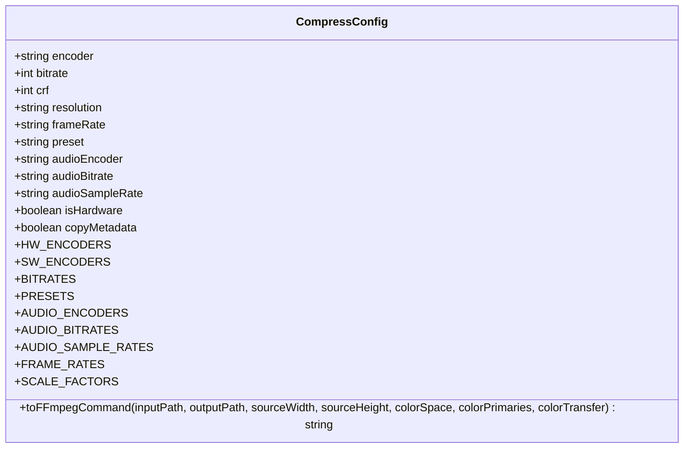
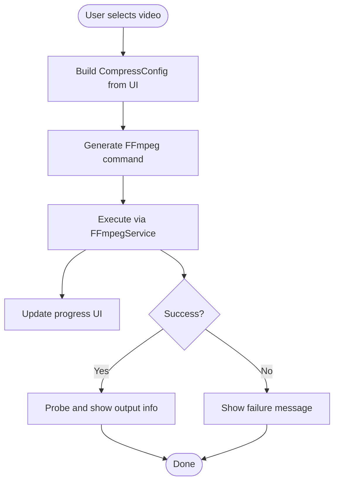
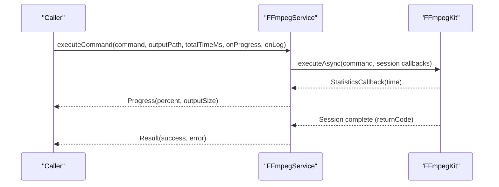
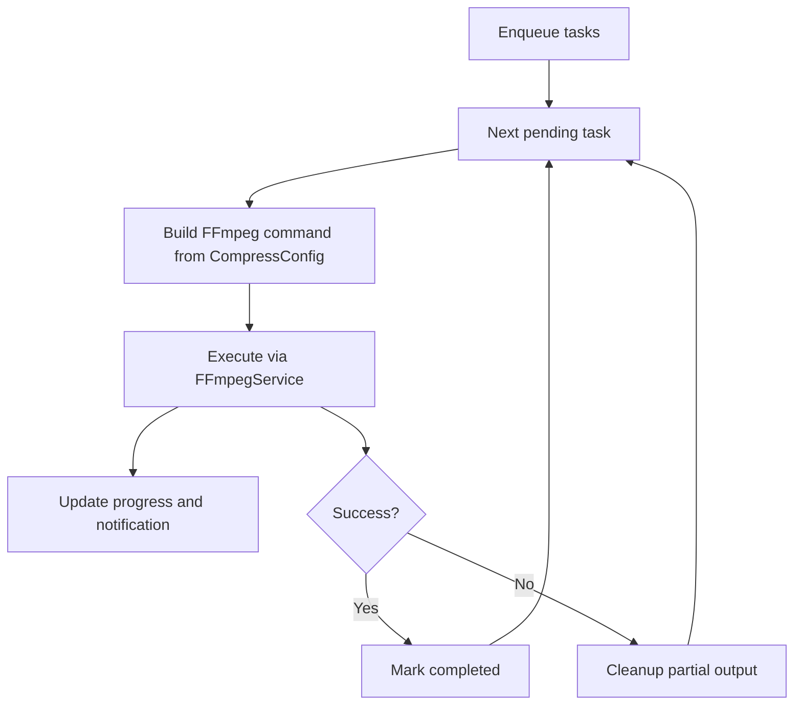
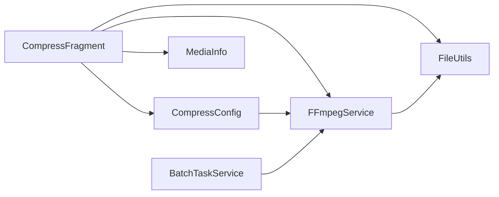

# Video Compression

<cite>
**Referenced Files in This Document**
- [CompressConfig.kt](file://app/src/main/java/com/pisces312/streamclip/model/CompressConfig.kt)
- [CompressFragment.kt](file://app/src/main/java/com/pisces312/streamclip/fragment/CompressFragment.kt)
- [FFmpegService.kt](file://app/src/main/java/com/pisces312/streamclip/service/FFmpegService.kt)
- [AudioCompressFragment.kt](file://app/src/main/java/com/pisces312/streamclip/fragment/AudioCompressFragment.kt)
- [MediaInfo.kt](file://app/src/main/java/com/pisces312/streamclip/model/MediaInfo.kt)
- [BatchTaskService.kt](file://app/src/main/java/com/pisces312/streamclip/service/BatchTaskService.kt)
- [fragment_compress.xml](file://app/src/main/res/layout/fragment_compress.xml)
- [strings.xml](file://app/src/main/res/values/strings.xml)
- [FileUtils.kt](file://app/src/main/java/com/pisces312/streamclip/util/FileUtils.kt)
- [README.md](file://README.md)
- [ffmpeg-kit-8.1-double-execute-crash.md](file://docs/ffmpeg-kit-8.1-double-execute-crash.md)
</cite>

## Table of Contents
1. [Introduction](#introduction)
2. [Project Structure](#project-structure)
3. [Core Components](#core-components)
4. [Architecture Overview](#architecture-overview)
5. [Detailed Component Analysis](#detailed-component-analysis)
6. [Dependency Analysis](#dependency-analysis)
7. [Performance Considerations](#performance-considerations)
8. [Troubleshooting Guide](#troubleshooting-guide)
9. [Conclusion](#conclusion)
10. [Appendices](#appendices)

## Introduction
This document explains StreamClip’s video compression capabilities with a focus on both hardware and software encoding options, including H.264 and H.265 encoders, quality control parameters (CRF/bitrate), and bitrate management. It covers the compression workflow for reducing file sizes while maintaining acceptable quality, preset configurations, CRF values, and quality scaling algorithms. It also documents parameter configuration for resolution changes, frame rate adjustments, and audio compression settings. Practical examples demonstrate optimizing compression for different use cases, balancing quality and file size, and handling various input formats. Differences between hardware and software encoding, performance implications, and quality trade-offs are addressed. Common issues such as quality degradation, encoding errors, and format compatibility are documented along with progress tracking, real-time quality assessment, and result validation processes.

## Project Structure
The compression feature spans UI configuration, model definitions, service orchestration, and FFmpeg integration:
- UI configuration panels for hardware and software encoding
- Model that builds FFmpeg commands and exposes presets
- Service layer that executes FFmpeg commands and reports progress
- Batch processing service for queueing and monitoring tasks
- Utility functions for file handling and metadata preservation

**Diagram sources**
- [CompressFragment.kt:121-137](file://app/src/main/java/com/pisces312/streamclip/fragment/CompressFragment.kt#L121-L137)
- [CompressConfig.kt:21-114](file://app/src/main/java/com/pisces312/streamclip/model/CompressConfig.kt#L21-L114)
- [FFmpegService.kt:152-241](file://app/src/main/java/com/pisces312/streamclip/service/FFmpegService.kt#L152-L241)
- [BatchTaskService.kt:181-240](file://app/src/main/java/com/pisces312/streamclip/service/BatchTaskService.kt#L181-L240)
- [fragment_compress.xml:146-612](file://app/src/main/res/layout/fragment_compress.xml#L146-L612)
- [MediaInfo.kt:5-165](file://app/src/main/java/com/pisces312/streamclip/model/MediaInfo.kt#L5-L165)
- [strings.xml:237-267](file://app/src/main/res/values/strings.xml#L237-L267)
- [FileUtils.kt:208-229](file://app/src/main/java/com/pisces312/streamclip/util/FileUtils.kt#L208-L229)

**Section sources**
- [README.md:33-40](file://README.md#L33-L40)
- [fragment_compress.xml:146-612](file://app/src/main/res/layout/fragment_compress.xml#L146-L612)

## Core Components
- CompressConfig: Defines encoder selection (hardware/software), bitrate/CRF, presets, resolution scaling, frame rate, audio settings, and builds the FFmpeg command string. Includes predefined lists for encoders, bitrates, presets, audio encoders, audio bitrates, audio sample rates, and frame rates. Provides a toFFmpegCommand method that generates the full command with metadata, color space, and container choices.
- CompressFragment: Hosts the UI for hardware and software encoding panels, resolution options, frame rate, audio settings, and batch processing. Builds a CompressConfig from UI selections and triggers compression execution via FFmpegService.
- FFmpegService: Executes FFmpeg commands asynchronously, parses progress via statistics callbacks, probes media info, and supports cancellation. Provides convenience methods for compression and audio compression.
- MediaInfo: Parses and exposes video/audio metadata, including color primaries/transfers/spaces, rotation, duration, and derived properties like display width/height and aspect ratio.
- BatchTaskService: Manages a persistent queue of compression tasks, monitors progress, and handles retries and cancellation.
- AudioCompressFragment: Dedicated UI for audio-only compression with similar controls and command generation.
- FileUtils: Utilities for output directory management, file scanning, and applying timestamps and shooting dates.

**Section sources**
- [CompressConfig.kt:3-15](file://app/src/main/java/com/pisces312/streamclip/model/CompressConfig.kt#L3-L15)
- [CompressConfig.kt:21-114](file://app/src/main/java/com/pisces312/streamclip/model/CompressConfig.kt#L21-L114)
- [CompressFragment.kt:40-137](file://app/src/main/java/com/pisces312/streamclip/fragment/CompressFragment.kt#L40-L137)
- [FFmpegService.kt:19-241](file://app/src/main/java/com/pisces312/streamclip/service/FFmpegService.kt#L19-L241)
- [MediaInfo.kt:5-165](file://app/src/main/java/com/pisces312/streamclip/model/MediaInfo.kt#L5-L165)
- [BatchTaskService.kt:26-121](file://app/src/main/java/com/pisces312/streamclip/service/BatchTaskService.kt#L26-L121)
- [AudioCompressFragment.kt:33-168](file://app/src/main/java/com/pisces312/streamclip/fragment/AudioCompressFragment.kt#L33-L168)
- [FileUtils.kt:208-229](file://app/src/main/java/com/pisces312/streamclip/util/FileUtils.kt#L208-L229)

## Architecture Overview
The compression workflow integrates UI selection, configuration, command building, execution, and progress reporting.

**Diagram sources**
- [CompressFragment.kt:572-680](file://app/src/main/java/com/pisces312/streamclip/fragment/CompressFragment.kt#L572-L680)
- [CompressConfig.kt:21-114](file://app/src/main/java/com/pisces312/streamclip/model/CompressConfig.kt#L21-L114)
- [FFmpegService.kt:152-241](file://app/src/main/java/com/pisces312/streamclip/service/FFmpegService.kt#L152-L241)
- [FileUtils.kt:268-275](file://app/src/main/java/com/pisces312/streamclip/util/FileUtils.kt#L268-L275)

## Detailed Component Analysis

### CompressConfig: Encoding Options and Command Generation
- Encoder selection:
  - Hardware: h264_mediacodec, hevc_mediacodec
  - Software: libx264, libx265
- Quality control:
  - Hardware: bitrate (kbps)
  - Software: CRF (0–51), preset (ultrafast to veryslow)
- Resolution scaling:
  - Predefined scale factors (e.g., 1.5x, 2.25x, 3x) with automatic rounding to even dimensions
  - Clears rotation metadata when resizing to prevent orientation confusion
- Frame rate:
  - Supports original and specific FPS values (24, 25, 30, 60)
- Audio:
  - Encoders: copy, aac, libmp3lame, flac
  - Audio bitrate and sample rate configurable; default copy to avoid resampling issues
- Color metadata:
  - Writes color primaries/trc/spaces and range for HDR/SDR; MOV container chosen to preserve GPS metadata
- Container and tagging:
  - MOV format for GPS metadata preservation; optional metadata copy from source

**Diagram sources**
- [CompressConfig.kt:3-15](file://app/src/main/java/com/pisces312/streamclip/model/CompressConfig.kt#L3-L15)
- [CompressConfig.kt:116-207](file://app/src/main/java/com/pisces312/streamclip/model/CompressConfig.kt#L116-L207)

**Section sources**
- [CompressConfig.kt:21-114](file://app/src/main/java/com/pisces312/streamclip/model/CompressConfig.kt#L21-L114)
- [CompressConfig.kt:116-207](file://app/src/main/java/com/pisces312/streamclip/model/CompressConfig.kt#L116-L207)

### CompressFragment: UI Panels and Execution Flow
- Tabs:
  - Hardware panel: encoder, bitrate, frame rate, resolution, audio options
  - Software panel: encoder, CRF seekbar, preset, frame rate, resolution, audio options
- Resolution options:
  - Single-file mode: computes final rounded resolution per scale factor
  - Batch mode: shows scale factor labels and approximate percentages
- Execution:
  - Builds CompressConfig from selected items
  - Calls FFmpegService.executeCommand with progress and log callbacks
  - Updates UI progress bar and displays output info after completion

**Diagram sources**
- [CompressFragment.kt:572-680](file://app/src/main/java/com/pisces312/streamclip/fragment/CompressFragment.kt#L572-L680)
- [CompressFragment.kt:682-719](file://app/src/main/java/com/pisces312/streamclip/fragment/CompressFragment.kt#L682-L719)

**Section sources**
- [CompressFragment.kt:150-162](file://app/src/main/java/com/pisces312/streamclip/fragment/CompressFragment.kt#L150-L162)
- [CompressFragment.kt:389-427](file://app/src/main/java/com/pisces312/streamclip/fragment/CompressFragment.kt#L389-L427)
- [CompressFragment.kt:572-680](file://app/src/main/java/com/pisces312/streamclip/fragment/CompressFragment.kt#L572-L680)
- [fragment_compress.xml:146-612](file://app/src/main/res/layout/fragment_compress.xml#L146-L612)
- [strings.xml:237-267](file://app/src/main/res/values/strings.xml#L237-L267)

### FFmpegService: Execution, Progress, and Probing
- executeCommand:
  - Async execution with optional StatisticsCallback for progress
  - Calculates percentage from processed time and total duration
  - Reports output size and logs
- probeMediaInfo:
  - JSON probing of format and streams
  - Extracts color info, rotation, and durations
- compressVideo and compressAudio:
  - Convenience methods for quick compression scenarios

**Diagram sources**
- [FFmpegService.kt:152-241](file://app/src/main/java/com/pisces312/streamclip/service/FFmpegService.kt#L152-L241)

**Section sources**
- [FFmpegService.kt:19-147](file://app/src/main/java/com/pisces312/streamclip/service/FFmpegService.kt#L19-L147)
- [FFmpegService.kt:152-241](file://app/src/main/java/com/pisces312/streamclip/service/FFmpegService.kt#L152-L241)

### BatchTaskService: Queueing and Monitoring
- Enqueues tasks, processes sequentially, and updates notifications
- Builds compression command from CompressConfig and invokes FFmpegService
- Applies file timestamps and scans output files

**Diagram sources**
- [BatchTaskService.kt:123-165](file://app/src/main/java/com/pisces312/streamclip/service/BatchTaskService.kt#L123-L165)
- [BatchTaskService.kt:181-240](file://app/src/main/java/com/pisces312/streamclip/service/BatchTaskService.kt#L181-L240)

**Section sources**
- [BatchTaskService.kt:26-121](file://app/src/main/java/com/pisces312/streamclip/service/BatchTaskService.kt#L26-L121)
- [BatchTaskService.kt:181-240](file://app/src/main/java/com/pisces312/streamclip/service/BatchTaskService.kt#L181-L240)

### AudioCompressFragment: Audio Compression Workflow
- Dedicated UI for audio-only compression
- Builds FFmpeg command with optional video copy and audio re-encode
- Supports AAC, MP3, FLAC encoders and configurable audio bitrate/sample rate

**Section sources**
- [AudioCompressFragment.kt:225-344](file://app/src/main/java/com/pisces312/streamclip/fragment/AudioCompressFragment.kt#L225-L344)

## Dependency Analysis
- CompressFragment depends on CompressConfig for command construction and on FFmpegService for execution.
- FFmpegService depends on ffmpeg-kit and uses statistics callbacks for progress.
- BatchTaskService orchestrates multiple tasks and relies on CompressConfig and FFmpegService.
- MediaInfo is used for probing and displaying input/output characteristics.
- FileUtils provides output directory management and file scanning.

**Diagram sources**
- [CompressFragment.kt:572-680](file://app/src/main/java/com/pisces312/streamclip/fragment/CompressFragment.kt#L572-L680)
- [CompressConfig.kt:21-114](file://app/src/main/java/com/pisces312/streamclip/model/CompressConfig.kt#L21-L114)
- [FFmpegService.kt:152-241](file://app/src/main/java/com/pisces312/streamclip/service/FFmpegService.kt#L152-L241)
- [BatchTaskService.kt:181-240](file://app/src/main/java/com/pisces312/streamclip/service/BatchTaskService.kt#L181-L240)
- [MediaInfo.kt:5-165](file://app/src/main/java/com/pisces312/streamclip/model/MediaInfo.kt#L5-L165)
- [FileUtils.kt:208-229](file://app/src/main/java/com/pisces312/streamclip/util/FileUtils.kt#L208-L229)

**Section sources**
- [CompressFragment.kt:40-137](file://app/src/main/java/com/pisces312/streamclip/fragment/CompressFragment.kt#L40-L137)
- [BatchTaskService.kt:181-240](file://app/src/main/java/com/pisces312/streamclip/service/BatchTaskService.kt#L181-L240)

## Performance Considerations
- Hardware encoding (MediaCodec) prioritizes speed and power efficiency, suitable for quick sharing and mobile devices. It uses fixed bitrate mode and may produce slightly lower quality than software encoders at equivalent file sizes.
- Software encoding (libx264/libx265) offers finer quality control via CRF and presets, enabling higher compression efficiency and better quality per bit, but requires more CPU time.
- Resolution scaling reduces computation by lowering dimensions; the implementation rounds to even dimensions to satisfy codec requirements.
- Frame rate reduction lowers data volume but affects motion smoothness; choose according to intended viewing device and platform playback capabilities.
- Audio bitrate defaults to copy to avoid resampling overhead and potential artifacts; re-encoding only when necessary.

[No sources needed since this section provides general guidance]

## Troubleshooting Guide
Common issues and remedies:
- Quality degradation:
  - Prefer software encoding with appropriate CRF and preset for higher quality.
  - Use resolution scaling judiciously; excessive downscaling can introduce artifacts.
- Encoding errors:
  - Verify input format compatibility; use MOV container to preserve metadata and reduce playback issues.
  - Ensure sufficient storage space and permissions for output directory.
- Progress tracking:
  - FFmpegService provides real-time progress via StatisticsCallback; UI updates percentage and output size.
- HDR/S DR color metadata:
  - Hardware path writes container-level nclx box flags; software path sets pixel format for 10-bit HDR.
- Native crash with ffmpeg-kit 8.1:
  - Known issue with consecutive executeAsync calls causing SIGSEGV; resolved by resetting global counters in cleanup routines.

**Section sources**
- [FFmpegService.kt:152-241](file://app/src/main/java/com/pisces312/streamclip/service/FFmpegService.kt#L152-L241)
- [ffmpeg-kit-8.1-double-execute-crash.md:1-174](file://docs/ffmpeg-kit-8.1-double-execute-crash.md#L1-L174)

## Conclusion
StreamClip’s compression pipeline combines flexible encoder selection (hardware/software), robust quality controls (CRF/bitrate/presets), and precise parameter tuning (resolution, frame rate, audio) to deliver efficient file size reduction while preserving essential metadata. The UI enables quick configuration and batch processing, while the service layer ensures reliable execution, progress reporting, and result validation. Understanding the trade-offs between hardware and software encoding, and applying recommended presets and scaling strategies, allows users to tailor compression for diverse use cases.

[No sources needed since this section summarizes without analyzing specific files]

## Appendices

### Practical Configuration Examples
- General recommendation:
  - For broad compatibility: H.264 with CRF around 25.
  - For smaller file sizes: HEVC with CRF around 30.
  - For speed and mobile: hardware encoding with 3 Mbps for 1080p.
- Resolution and frame rate:
  - Downscale to 720p or 1080p depending on target device; reduce frame rate to 30 fps for smoother playback on older devices.
- Audio:
  - Keep audio bitrate at 128 kbps for most cases; re-encode only when necessary.

**Section sources**
- [strings.xml:58-86](file://app/src/main/res/values/strings.xml#L58-L86)
- [CompressConfig.kt:116-207](file://app/src/main/java/com/pisces312/streamclip/model/CompressConfig.kt#L116-L207)