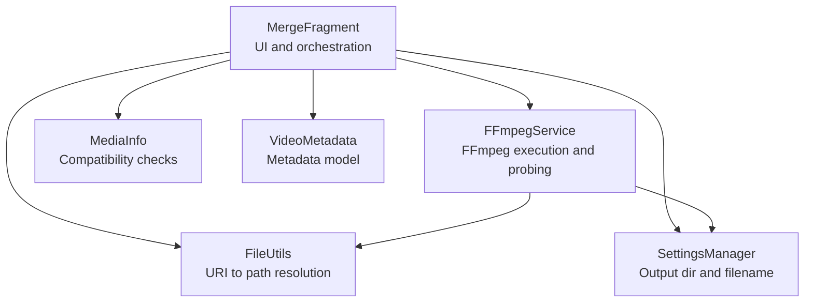
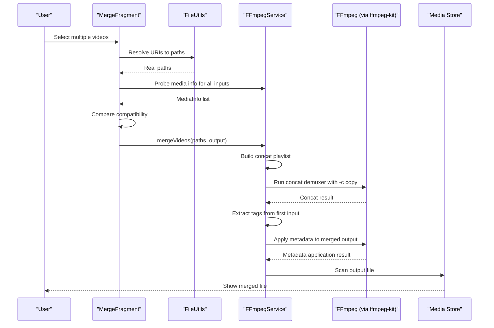
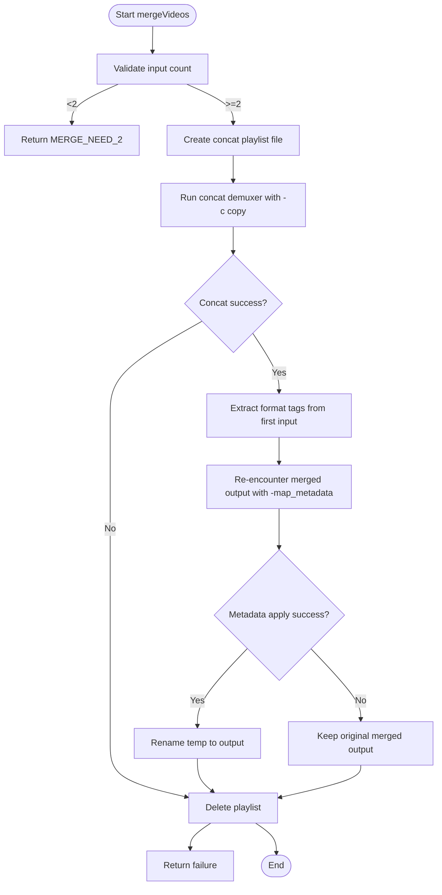
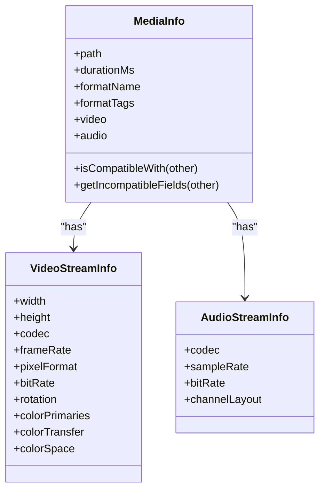
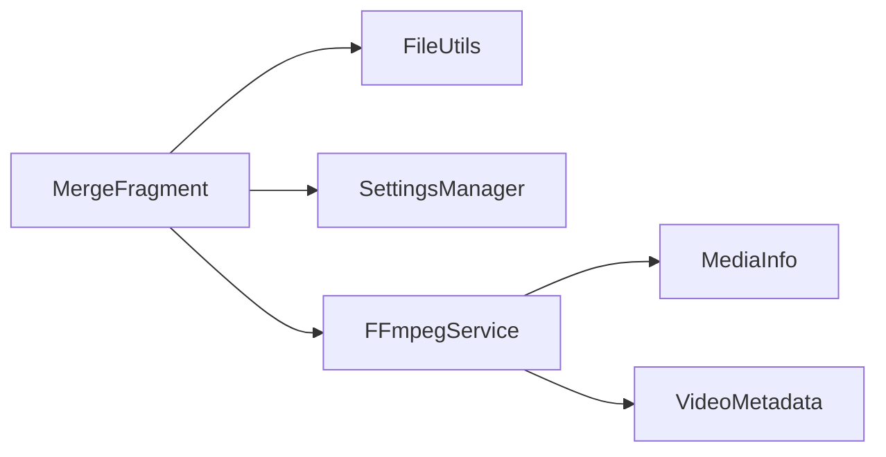

# Video Merging

<cite>
**Referenced Files in This Document**
- [MergeFragment.kt](file://app/src/main/java/com/pisces312/streamclip/fragment/MergeFragment.kt)
- [FFmpegService.kt](file://app/src/main/java/com/pisces312/streamclip/service/FFmpegService.kt)
- [MediaInfo.kt](file://app/src/main/java/com/pisces312/streamclip/model/MediaInfo.kt)
- [VideoMetadata.kt](file://app/src/main/java/com/pisces312/streamclip/model/VideoMetadata.kt)
- [FileUtils.kt](file://app/src/main/java/com/pisces312/streamclip/util/FileUtils.kt)
- [SettingsManager.kt](file://app/src/main/java/com/pisces312/streamclip/util/SettingsManager.kt)
- [fragment_merge.xml](file://app/src/main/res/layout/fragment_merge.xml)
- [strings.xml](file://app/src/main/res/values/strings.xml)
- [2026-05-09-trim-gps-metadata.md](file://docs/superpowers/plans/2026-05-09-trim-gps-metadata.md)
</cite>

## Table of Contents
1. [Introduction](#introduction)
2. [Project Structure](#project-structure)
3. [Core Components](#core-components)
4. [Architecture Overview](#architecture-overview)
5. [Detailed Component Analysis](#detailed-component-analysis)
6. [Dependency Analysis](#dependency-analysis)
7. [Performance Considerations](#performance-considerations)
8. [Troubleshooting Guide](#troubleshooting-guide)
9. [Conclusion](#conclusion)
10. [Appendices](#appendices)

## Introduction
This document explains StreamClip’s video merging functionality powered by FFmpeg’s concat demuxer for lossless concatenation. It covers the technical implementation of combining multiple video files without re-encoding, including format requirements, codec compatibility, metadata transfer, and the concat demuxer workflow. It also documents parameter configuration for handling different video formats, resolution changes, and audio track management, along with practical examples, differences from traditional concatenation, performance benefits of stream copying, quality preservation techniques, and troubleshooting guidance.

## Project Structure
The merging feature spans UI, service orchestration, media probing, and utility modules:
- UI: MergeFragment handles user interactions, file selection, compatibility checks, and progress feedback.
- Service: FFmpegService executes FFmpeg commands, probes media, and manages progress callbacks.
- Models: MediaInfo and VideoMetadata represent media properties and metadata for compatibility checks and metadata transfer.
- Utilities: FileUtils resolves URIs to real paths, SettingsManager controls output directories and filenames, and resources provide localized messages.

**Diagram sources**
- [MergeFragment.kt:28-278](file://app/src/main/java/com/pisces312/streamclip/fragment/MergeFragment.kt#L28-L278)
- [FFmpegService.kt:19-420](file://app/src/main/java/com/pisces312/streamclip/service/FFmpegService.kt#L19-L420)
- [MediaInfo.kt:5-165](file://app/src/main/java/com/pisces312/streamclip/model/MediaInfo.kt#L5-L165)
- [VideoMetadata.kt:5-56](file://app/src/main/java/com/pisces312/streamclip/model/VideoMetadata.kt#L5-L56)
- [FileUtils.kt:17-362](file://app/src/main/java/com/pisces312/streamclip/util/FileUtils.kt#L17-L362)
- [SettingsManager.kt:6-208](file://app/src/main/java/com/pisces312/streamclip/util/SettingsManager.kt#L6-L208)

**Section sources**
- [MergeFragment.kt:28-278](file://app/src/main/java/com/pisces312/streamclip/fragment/MergeFragment.kt#L28-L278)
- [FFmpegService.kt:19-420](file://app/src/main/java/com/pisces312/streamclip/service/FFmpegService.kt#L19-L420)
- [MediaInfo.kt:5-165](file://app/src/main/java/com/pisces312/streamclip/model/MediaInfo.kt#L5-L165)
- [VideoMetadata.kt:5-56](file://app/src/main/java/com/pisces312/streamclip/model/VideoMetadata.kt#L5-L56)
- [FileUtils.kt:17-362](file://app/src/main/java/com/pisces312/streamclip/util/FileUtils.kt#L17-L362)
- [SettingsManager.kt:6-208](file://app/src/main/java/com/pisces312/streamclip/util/SettingsManager.kt#L6-L208)

## Core Components
- MergeFragment: Manages UI, collects video URIs, validates compatibility, triggers merge, and displays progress and results.
- FFmpegService.mergeVideos: Implements concat demuxer workflow, stream copying, and metadata transfer.
- MediaInfo: Provides compatibility checks and metadata accessors used by MergeFragment.
- VideoMetadata: Encapsulates metadata fields for editing and comparison.
- FileUtils: Resolves URIs to real paths and determines direct vs cached reads.
- SettingsManager: Determines output directory and filename generation.

**Section sources**
- [MergeFragment.kt:28-278](file://app/src/main/java/com/pisces312/streamclip/fragment/MergeFragment.kt#L28-L278)
- [FFmpegService.kt:297-334](file://app/src/main/java/com/pisces312/streamclip/service/FFmpegService.kt#L297-L334)
- [MediaInfo.kt:101-121](file://app/src/main/java/com/pisces312/streamclip/model/MediaInfo.kt#L101-L121)
- [VideoMetadata.kt:22-41](file://app/src/main/java/com/pisces312/streamclip/model/VideoMetadata.kt#L22-L41)
- [FileUtils.kt:30-118](file://app/src/main/java/com/pisces312/streamclip/util/FileUtils.kt#L30-L118)
- [SettingsManager.kt:67-114](file://app/src/main/java/com/pisces312/streamclip/util/SettingsManager.kt#L67-L114)

## Architecture Overview
The merging pipeline:
1. User selects multiple videos via MergeFragment.
2. MergeFragment resolves URIs to paths, probes media, and checks compatibility.
3. FFmpegService.mergeVideos constructs a concat playlist and runs concat demuxer with stream copying.
4. Metadata from the first video is transferred to the merged output via a two-pass approach.
5. Results are scanned into the media store and presented to the user.

**Diagram sources**
- [MergeFragment.kt:135-232](file://app/src/main/java/com/pisces312/streamclip/fragment/MergeFragment.kt#L135-L232)
- [FFmpegService.kt:297-334](file://app/src/main/java/com/pisces312/streamclip/service/FFmpegService.kt#L297-L334)
- [FFmpegService.kt:278-291](file://app/src/main/java/com/pisces312/streamclip/service/FFmpegService.kt#L278-L291)
- [FileUtils.kt:30-118](file://app/src/main/java/com/pisces312/streamclip/util/FileUtils.kt#L30-L118)

## Detailed Component Analysis

### MergeFragment: UI and Orchestration
Responsibilities:
- Collects multiple video URIs and updates UI state.
- Resolves URIs to real paths and reports read modes (direct vs cached).
- Probes media info for all inputs and checks compatibility.
- Executes merge and handles progress, cancellation, and results.

Key behaviors:
- Validates at least two inputs before enabling execution.
- Updates status indicators for direct/cached reads.
- Displays progress bar and disables execute button during processing.
- Presents success/failure messages and opens output file location on completion.

**Section sources**
- [MergeFragment.kt:35-96](file://app/src/main/java/com/pisces312/streamclip/fragment/MergeFragment.kt#L35-L96)
- [MergeFragment.kt:135-232](file://app/src/main/java/com/pisces312/streamclip/fragment/MergeFragment.kt#L135-L232)
- [MergeFragment.kt:104-128](file://app/src/main/java/com/pisces312/streamclip/fragment/MergeFragment.kt#L104-L128)
- [fragment_merge.xml:10-62](file://app/src/main/res/layout/fragment_merge.xml#L10-L62)
- [strings.xml:139-142](file://app/src/main/res/values/strings.xml#L139-L142)

### FFmpegService.mergeVideos: Concat Demuxer Workflow
Implementation highlights:
- Builds a temporary concat playlist file listing input paths.
- Executes concat demuxer with stream copying and flags to regenerate timestamps and reset offsets.
- Applies metadata from the first input via a two-pass approach:
  - Extracts format-level tags from the first input to a sidecar file.
  - Re-encounters the merged output with -map_metadata to apply tags, writing to a temp file and renaming to replace the original.

Important flags and parameters:
- concat demuxer: -f concat -safe 0 -i playlist.txt
- Stream copying: -c copy
- Timestamp handling: -fflags +genpts -avoid_negative_ts make_zero -reset_timestamps 1
- Metadata application: -map_metadata 0 -map_metadata 1 -c copy -f mov

**Diagram sources**
- [FFmpegService.kt:297-334](file://app/src/main/java/com/pisces312/streamclip/service/FFmpegService.kt#L297-L334)
- [FFmpegService.kt:278-291](file://app/src/main/java/com/pisces312/streamclip/service/FFmpegService.kt#L278-L291)

**Section sources**
- [FFmpegService.kt:297-334](file://app/src/main/java/com/pisces312/streamclip/service/FFmpegService.kt#L297-L334)
- [FFmpegService.kt:278-291](file://app/src/main/java/com/pisces312/streamclip/service/FFmpegService.kt#L278-L291)

### MediaInfo: Compatibility and Metadata Accessors
- Provides isCompatibleWith(other) and getIncompatibleFields(other) to compare resolution, video codec, audio codec, frame rate, pixel format, and rotation.
- Exposes convenience accessors for resolution, codecs, frame rate, pixel format, rotation, and color space.
- Supplies format tags for metadata operations.

**Diagram sources**
- [MediaInfo.kt:5-165](file://app/src/main/java/com/pisces312/streamclip/model/MediaInfo.kt#L5-L165)

**Section sources**
- [MediaInfo.kt:101-121](file://app/src/main/java/com/pisces312/streamclip/model/MediaInfo.kt#L101-L121)
- [MediaInfo.kt:146-165](file://app/src/main/java/com/pisces312/streamclip/model/MediaInfo.kt#L146-L165)

### VideoMetadata: Metadata Editing Model
- Holds editable metadata fields (title, artist, creation time, location, comment) and raw tags.
- Provides isDifferentFrom and buildMetadataArgs to compute incremental metadata changes.

**Section sources**
- [VideoMetadata.kt:13-41](file://app/src/main/java/com/pisces312/streamclip/model/VideoMetadata.kt#L13-L41)

### FileUtils: URI Resolution and Read Modes
- getPathResultFromUri resolves URIs to real paths and distinguishes direct reads vs cached copies.
- updateInputStatus reflects read modes in the UI.

**Section sources**
- [FileUtils.kt:30-118](file://app/src/main/java/com/pisces312/streamclip/util/FileUtils.kt#L30-L118)
- [MergeFragment.kt:104-128](file://app/src/main/java/com/pisces312/streamclip/fragment/MergeFragment.kt#L104-L128)

### SettingsManager: Output Directory and Filename
- Determines output directory based on user preference and source location.
- Generates output filename with optional timestamp suffix.

**Section sources**
- [SettingsManager.kt:67-114](file://app/src/main/java/com/pisces312/streamclip/util/SettingsManager.kt#L67-L114)

## Dependency Analysis
- MergeFragment depends on FileUtils for path resolution, SettingsManager for output configuration, and FFmpegService for probing and merging.
- FFmpegService depends on ffmpeg-kit for command execution and on MediaInfo/VideoMetadata for metadata operations.
- MediaInfo and VideoMetadata are data-only models with no external dependencies.

**Diagram sources**
- [MergeFragment.kt:28-278](file://app/src/main/java/com/pisces312/streamclip/fragment/MergeFragment.kt#L28-L278)
- [FFmpegService.kt:19-420](file://app/src/main/java/com/pisces312/streamclip/service/FFmpegService.kt#L19-L420)
- [MediaInfo.kt:5-165](file://app/src/main/java/com/pisces312/streamclip/model/MediaInfo.kt#L5-L165)
- [VideoMetadata.kt:5-56](file://app/src/main/java/com/pisces312/streamclip/model/VideoMetadata.kt#L5-L56)

**Section sources**
- [MergeFragment.kt:28-278](file://app/src/main/java/com/pisces312/streamclip/fragment/MergeFragment.kt#L28-L278)
- [FFmpegService.kt:19-420](file://app/src/main/java/com/pisces312/streamclip/service/FFmpegService.kt#L19-L420)

## Performance Considerations
- Lossless concatenation: Stream copying avoids re-encoding, preserving quality and minimizing CPU usage.
- Concat demuxer flags:
  - -fflags +genpts regenerates presentation timestamps to prevent negative timestamps.
  - -avoid_negative_ts make_zero adjusts timestamps to avoid negative values.
  - -reset_timestamps 1 resets timestamps for each input segment to ensure seamless playback.
- Metadata transfer: Two-pass approach ensures GPS/location metadata is preserved without re-encoding.
- Direct vs cached reads: Prefer direct reads when possible to reduce I/O overhead.

[No sources needed since this section provides general guidance]

## Troubleshooting Guide
Common issues and resolutions:
- Format mismatches:
  - Symptom: Incompatibility dialog listing mismatched fields (resolution, video codec, audio codec, frame rate, pixel format, rotation).
  - Action: Ensure all inputs share identical resolution, codecs, frame rate, pixel format, and rotation.
- Concat demuxer failures:
  - Symptom: FFmpeg returns non-zero exit code.
  - Actions:
    - Verify inputs are valid MP4/AVC/H.264 or compatible containers.
    - Confirm concat playlist entries are correctly escaped and use single quotes around paths.
    - Retry with -safe 0 and ensure playlist file is written correctly.
- Timing synchronization problems:
  - Symptom: Playback glitches or gaps at segment boundaries.
  - Actions:
    - Use -fflags +genpts to regenerate timestamps.
    - Use -avoid_negative_ts make_zero and -reset_timestamps 1 to normalize timestamps.
- Metadata not preserved:
  - Symptom: GPS/location missing in merged output.
  - Actions:
    - Ensure the two-pass metadata application completes successfully.
    - Confirm the sidecar file contains format-level tags extracted from the first input.
- Progress tracking and cancellation:
  - Use the provided progress callback to estimate completion percentage and output size.
  - Cancel ongoing sessions via FFmpegService.cancelCurrentSession.

**Section sources**
- [MergeFragment.kt:180-199](file://app/src/main/java/com/pisces312/streamclip/fragment/MergeFragment.kt#L180-L199)
- [FFmpegService.kt:152-241](file://app/src/main/java/com/pisces312/streamclip/service/FFmpegService.kt#L152-L241)
- [FFmpegService.kt:297-334](file://app/src/main/java/com/pisces312/streamclip/service/FFmpegService.kt#L297-L334)

## Conclusion
StreamClip’s merge feature leverages FFmpeg’s concat demuxer to achieve lossless concatenation, preserving quality and performance. The implementation includes robust compatibility checking, stream copying, and a two-pass metadata application process to retain GPS/location data. By following the guidelines in this document—ensuring format compatibility, using recommended flags, and validating outputs—you can reliably merge multiple video files without re-encoding.

[No sources needed since this section summarizes without analyzing specific files]

## Appendices

### Concat Demuxer Workflow Details
- Concat playlist construction: Temporary file containing file 'path' entries for each input.
- Command execution: -f concat -safe 0 -i playlist.txt -c copy -fflags +genpts -avoid_negative_ts make_zero -reset_timestamps 1 output.mp4.
- Metadata application: After concat, extract format tags from the first input and re-encounter the merged output with -map_metadata to apply tags.

**Section sources**
- [FFmpegService.kt:297-334](file://app/src/main/java/com/pisces312/streamclip/service/FFmpegService.kt#L297-L334)
- [FFmpegService.kt:278-291](file://app/src/main/java/com/pisces312/streamclip/service/FFmpegService.kt#L278-L291)

### Practical Examples
- Preparing video sequences:
  - Ensure all inputs have identical resolution, video codec, audio codec, frame rate, pixel format, and rotation.
  - Use MergeFragment to select multiple videos; the app will probe and validate compatibility automatically.
- Executing merge:
  - Click Execute; the app builds a concat playlist and runs the concat demuxer with stream copying.
  - On success, the merged file is scanned into the media store and displayed in the status area.

**Section sources**
- [MergeFragment.kt:135-232](file://app/src/main/java/com/pisces312/streamclip/fragment/MergeFragment.kt#L135-L232)
- [strings.xml:277-284](file://app/src/main/res/values/strings.xml#L277-L284)

### Differences Between Concat Demuxer and Traditional Methods
- Concat demuxer:
  - Reads segments directly without re-encoding.
  - Requires compatible formats and codecs across inputs.
  - Preserves quality and reduces processing time.
- Traditional concatenation (re-encoding):
  - Re-encodes video and audio, potentially altering quality.
  - More flexible with format variations but slower and more CPU-intensive.

[No sources needed since this section provides general guidance]

### Parameter Configuration Notes
- Format requirements:
  - Inputs must share identical resolution, video codec, audio codec, frame rate, pixel format, and rotation.
- Handling resolution changes:
  - If inputs differ in resolution, adjust them before merging or accept potential playback issues.
- Audio track management:
  - Stream copying preserves original audio tracks; ensure audio codecs are compatible across inputs.

**Section sources**
- [MediaInfo.kt:101-121](file://app/src/main/java/com/pisces312/streamclip/model/MediaInfo.kt#L101-L121)

### Quality Preservation Techniques
- Use -c copy to avoid re-encoding.
- Regenerate timestamps with -fflags +genpts and normalize with -avoid_negative_ts make_zero and -reset_timestamps 1.
- Preserve metadata via the two-pass approach described above.

**Section sources**
- [FFmpegService.kt:297-334](file://app/src/main/java/com/pisces312/streamclip/service/FFmpegService.kt#L297-L334)

### Result Validation
- Post-merge scanning: The app scans the output file into the media store for gallery visibility.
- Status reporting: Success or failure messages are shown with localized strings.

**Section sources**
- [MergeFragment.kt:213-231](file://app/src/main/java/com/pisces312/streamclip/fragment/MergeFragment.kt#L213-L231)
- [strings.xml:142](file://app/src/main/res/values/strings.xml#L142)